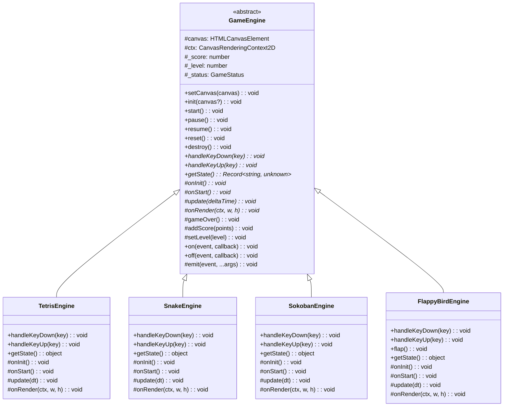
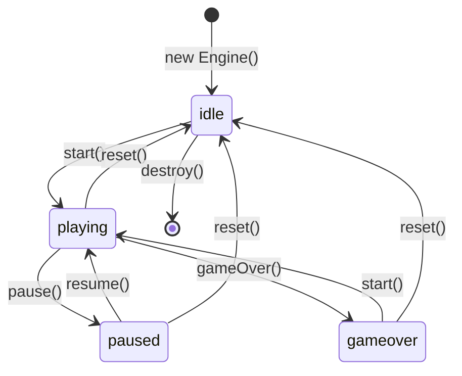
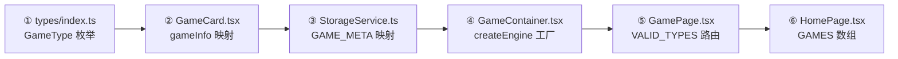
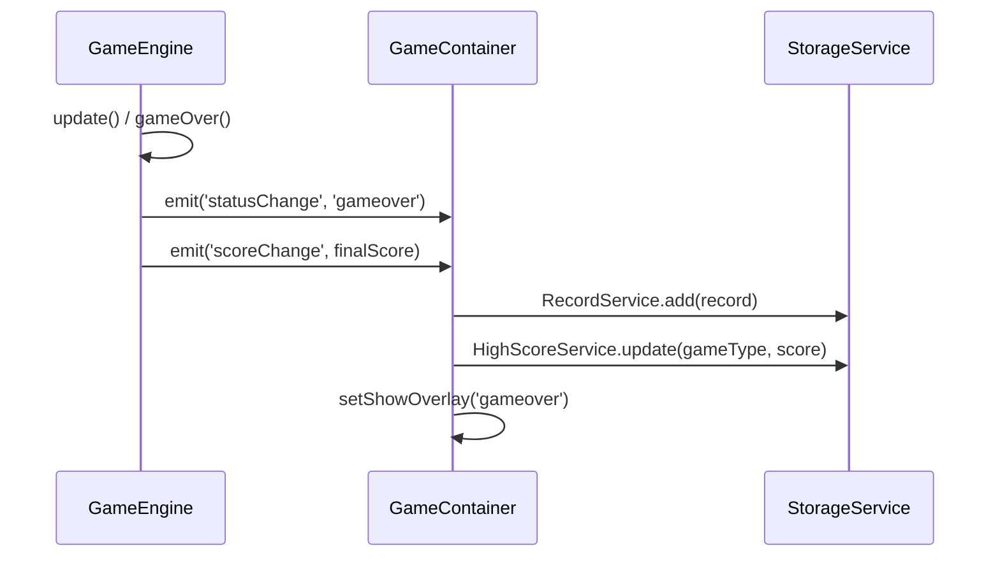
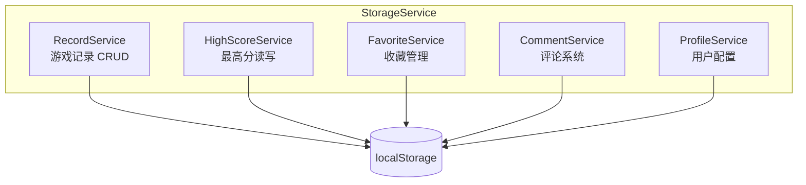
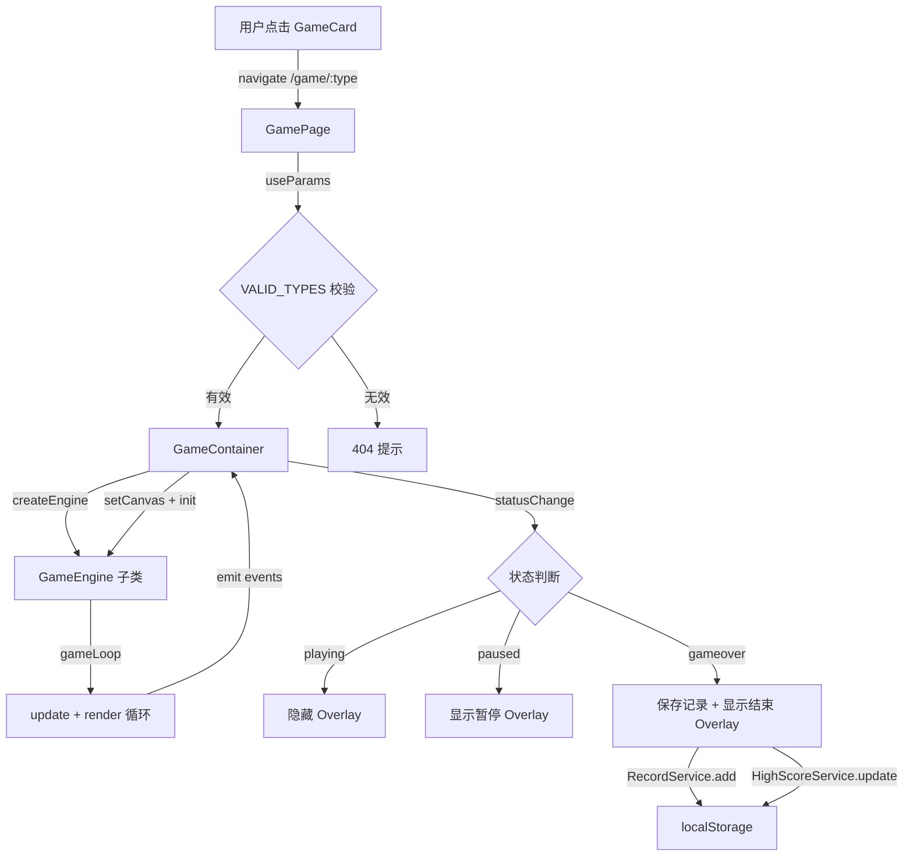
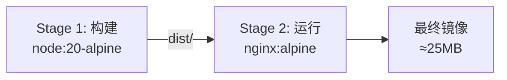

# Game Portal 架构文档

> 版本: v2.0 | 最后更新: 2026-04-11

## 目录

- [1. 系统概述](#1-系统概述)
- [2. 技术栈](#2-技术栈)
- [3. 项目结构](#3-项目结构)
- [4. 核心架构](#4-核心架构)
  - [4.1 GameEngine 基类](#41-gameengine-基类)
  - [4.2 游戏注册机制](#42-游戏注册机制)
  - [4.3 事件系统](#43-事件系统)
  - [4.4 游戏循环](#44-游戏循环)
- [5. 分层架构](#5-分层架构)
  - [5.1 引擎层 (Engine)](#51-引擎层-engine)
  - [5.2 组件层 (Component)](#52-组件层-component)
  - [5.3 服务层 (Service)](#53-服务层-service)
  - [5.4 页面层 (Page)](#54-页面层-page)
- [6. 数据流](#6-数据流)
- [7. 新游戏集成指南](#7-新游戏集成指南)
- [8. 测试架构](#8-测试架构)
- [9. 部署架构](#9-部署架构)

---

## 1. 系统概述

Game Portal 是一个纯前端的经典小游戏合集平台，采用 Canvas API 渲染游戏画面，React 构建 UI 外壳。核心设计理念是 **引擎与 UI 解耦** —— 每款游戏是一个独立的 Engine 类，通过事件系统与 React 组件通信，实现游戏热插拔。

**关键特性：**
- 🎮 游戏引擎抽象基类，统一生命周期管理
- 📡 事件驱动架构，Engine ↔ Component 松耦合
- 🔌 注册式集成，新游戏只需 6 个文件改动
- 💾 localStorage 持久化，零后端依赖
- 📱 响应式 Canvas，自适应容器尺寸

---

## 2. 技术栈

| 层级 | 技术 | 版本 | 用途 |
|------|------|------|------|
| 框架 | React | 18.x | UI 组件化 |
| 语言 | TypeScript | 5.x | 类型安全 |
| 构建 | Vite | 5.x | 开发服务器 + 打包 |
| 样式 | Tailwind CSS | 3.x | 原子化样式 |
| 渲染 | Canvas API | - | 游戏画面绘制 |
| 路由 | react-router-dom | 6.x | SPA 路由 |
| 测试 | Vitest | 1.6.x | 单元/集成测试 |
| 部署 | Docker + Nginx | - | 容器化生产部署 |

---

## 3. 项目结构

```
game-portal/
├── src/
│   ├── core/                          # 核心抽象层
│   │   └── GameEngine.ts              # 游戏引擎抽象基类
│   │
│   ├── games/                         # 游戏引擎实现层
│   │   ├── config.ts                  # 预留扩展配置
│   │   ├── tetris/
│   │   │   ├── TetrisEngine.ts        # 俄罗斯方块引擎
│   │   │   └── constants.ts           # 方块定义、颜色、尺寸
│   │   ├── snake/
│   │   │   ├── SnakeEngine.ts         # 贪吃蛇引擎
│   │   │   └── constants.ts           # 网格、速度、颜色
│   │   ├── sokoban/
│   │   │   └── SokobanEngine.ts       # 推箱子引擎（含关卡数据）
│   │   └── flappy-bird/
│   │       ├── FlappyBirdEngine.ts    # Flappy Bird 引擎
│   │       └── constants.ts           # 物理、管道、渲染参数
│   │
│   ├── components/                    # React UI 组件层
│   │   ├── GameContainer.tsx          # Canvas 容器 + HUD + Overlay
│   │   ├── GameCard.tsx               # 首页游戏卡片
│   │   ├── GameList.tsx               # 游戏列表（预留）
│   │   ├── Header.tsx                 # 顶部导航栏
│   │   └── ScoreBoard.tsx             # 排行榜组件
│   │
│   ├── contexts/                      # React Context（预留扩展）
│   │   ├── AppProviders.tsx
│   │   ├── GameContext.tsx
│   │   └── UserContext.tsx
│   │
│   ├── pages/                         # 页面路由层
│   │   ├── HomePage.tsx               # 首页（游戏列表）
│   │   └── GamePage.tsx               # 游戏详情页（动态路由）
│   │
│   ├── services/                      # 业务服务层
│   │   └── StorageService.ts          # localStorage 封装
│   │
│   ├── types/                         # 类型定义层
│   │   └── index.ts                   # 全局类型 & 枚举
│   │
│   ├── __tests__/                     # 测试层
│   │   ├── setup.ts                   # 测试环境 mock
│   │   ├── tetris.test.ts             # 53 用例
│   │   ├── snake.test.ts              # 29 用例
│   │   ├── sokoban.test.ts            # 41 用例
│   │   ├── flappy-bird.test.ts        # 46 用例
│   │   ├── game-container.test.tsx    # 6 用例
│   │   ├── routing.test.tsx           # 6 用例
│   │   └── storage.test.ts            # 21 用例
│   │
│   ├── App.tsx                        # 根组件 + 路由配置
│   ├── main.tsx                       # 应用入口
│   └── index.css                      # 全局样式 + Tailwind
│
├── Dockerfile                         # 多阶段构建（Node → Nginx）
├── docker-compose.yml                 # 生产/开发双模式
├── nginx.conf                         # SPA 路由回退 + 缓存策略
├── deploy-docker.sh                   # 一键部署脚本
├── GAME-EXPANSION-PLAN.md             # 扩展计划（v1.0→v5.0）
├── ARCHITECTURE.md                    # 本文档
└── README.md / README.en.md           # 项目说明
```

---

## 4. 核心架构

### 4.1 GameEngine 基类

所有游戏引擎继承自 `GameEngine` 抽象基类，定义统一的生命周期和接口契约。



**生命周期状态机：**



**子类必须实现的抽象方法：**

| 方法 | 说明 |
|------|------|
| `onInit()` | 初始化游戏状态（网格、关卡、角色等） |
| `onStart()` | 游戏开始时的额外逻辑 |
| `update(deltaTime)` | 每帧更新逻辑（物理、碰撞、AI） |
| `onRender(ctx, w, h)` | 每帧 Canvas 绘制 |
| `handleKeyDown(key)` | 键盘按下处理 |
| `handleKeyUp(key)` | 键盘释放处理 |
| `getState()` | 返回游戏内部状态快照 |

### 4.2 游戏注册机制

新游戏采用 **注册式集成**，需要在 6 个位置同步添加配置：



| 序号 | 文件 | 改动 | 说明 |
|------|------|------|------|
| ① | `types/index.ts` | `GameType` 枚举新增值 | 定义游戏类型标识符 |
| ② | `components/GameCard.tsx` | `gameInfo` 新增映射 | 首页卡片展示信息 |
| ③ | `services/StorageService.ts` | `GAME_META` 新增映射 | 游戏元信息（名称/描述/图标/难度等） |
| ④ | `components/GameContainer.tsx` | `createEngine` 新增 case | 引擎工厂实例化 |
| ⑤ | `pages/GamePage.tsx` | `VALID_TYPES` 新增映射 | URL 路由合法性校验 |
| ⑥ | `pages/HomePage.tsx` | `GAMES` 数组新增元素 | 首页游戏列表展示 |

> ⚠️ **关键经验**：第③项 `StorageService.ts` 的 `GAME_META` 是 `Record<GameType, GameMeta>` 类型，如果遗漏会导致 **TS2741 类型错误**，编译不通过。

### 4.3 事件系统

GameEngine 内置发布-订阅事件系统，实现引擎与 UI 组件的松耦合：

```typescript
// 标准事件
'statusChange'  → (status: GameStatus)   // 状态变更：idle | playing | paused | gameover
'scoreChange'   → (score: number)        // 分数变更
'levelChange'   → (level: number)        // 等级变更
'stateChange'   → ()                     // 通用状态变更（如 Sokoban 移动步数）

// 使用方式
engine.on('scoreChange', (score) => setScore(score));
engine.on('statusChange', (status) => {
  if (status === 'gameover') saveRecord();
});
```

**事件流：**



### 4.4 游戏循环

基于 `requestAnimationFrame` 的固定 Canvas 尺寸（480×640）游戏循环：

```typescript
// GameEngine.gameLoop 核心逻辑
private gameLoop = (timestamp: number): void => {
    if (this._status !== 'playing') return;
    
    const deltaTime = timestamp - this.lastTime;  // 帧间隔（ms）
    this.lastTime = timestamp;
    this._elapsedTime = (timestamp - this._startTime) / 1000;
    
    this.update(deltaTime);   // 子类实现：物理、碰撞、AI
    this.render();            // 基类调用：clearRect → onRender()
    
    this.animationId = requestAnimationFrame(this.gameLoop);
};
```

---

## 5. 分层架构

### 5.1 引擎层 (Engine)

每个游戏引擎独立目录，包含引擎类和常量定义：

| 游戏 | 目录 | 核心文件 | 特殊机制 |
|------|------|----------|----------|
| 俄罗斯方块 | `games/tetris/` | TetrisEngine.ts + constants.ts | 7种方块旋转矩阵、行消除、等级加速 |
| 贪吃蛇 | `games/snake/` | SnakeEngine.ts + constants.ts | 20×20网格、方向队列、自碰撞检测 |
| 推箱子 | `games/sokoban/` | SokobanEngine.ts | 多关卡、Undo栈、胜利判定 |
| Flappy Bird | `games/flappy-bird/` | FlappyBirdEngine.ts + constants.ts | 重力物理、管道生成、难度递增 |

**引擎设计原则：**
- 纯逻辑，不依赖 DOM（除 Canvas API）
- 所有状态通过 `getState()` 暴露
- 通过事件系统通知外部，不直接操作 React 状态

### 5.2 组件层 (Component)

| 组件 | 职责 | 关键 Props |
|------|------|-----------|
| `GameContainer` | Canvas 宿主 + HUD + Overlay + 键盘/触摸事件 | `gameType: GameType` |
| `GameCard` | 首页游戏卡片，点击导航到游戏页 | `type: GameType` |
| `Header` | 顶部导航栏，含 Logo 和返回首页 | - |
| `ScoreBoard` | 排行榜展示，读取 HighScoreService | - |

**GameContainer 职责详解：**
1. 创建对应引擎实例（`createEngine` 工厂函数）
2. 管理 Canvas 元素和引擎生命周期
3. 监听引擎事件，同步 React 状态（score/level/status）
4. 渲染 HUD（分数、等级、步数）和 Overlay（开始/暂停/结束）
5. 绑定键盘和触摸事件，转发给引擎
6. 游戏结束时自动保存记录和最高分

### 5.3 服务层 (Service)

`StorageService.ts` 基于 localStorage 提供 5 个子服务：



| 服务 | Storage Key | 功能 |
|------|------------|------|
| RecordService | `gp_records` | 添加/查询/统计游戏记录 |
| HighScoreService | `gp_high_scores` | 读取/更新各游戏最高分 |
| FavoriteService | `gp_favorites` | 收藏/取消收藏游戏 |
| CommentService | `gp_comments` | 发表/查询/点赞评论 |
| ProfileService | `gp_profile` | 读取/更新用户配置 |

### 5.4 页面层 (Page)

| 页面 | 路由 | 组件 | 功能 |
|------|------|------|------|
| 首页 | `/` | HomePage | 游戏卡片网格 + 排行榜 |
| 游戏页 | `/game/:gameType` | GamePage | 动态路由 → GameContainer |

**路由配置（App.tsx）：**
```typescript
<Routes>
  <Route path="/" element={<HomePage />} />
  <Route path="/game/:gameType" element={<GamePage />} />
</Routes>
```

GamePage 通过 `useParams` 获取 URL 中的 `gameType`，在 `VALID_TYPES` 中查找对应的 `GameType` 枚举值，找不到则显示 404 页面。

---

## 6. 数据流

### 完整游戏会话数据流



### Canvas 渲染管线

```
requestAnimationFrame(gameLoop)
  → deltaTime 计算
  → update(deltaTime)        // 子类：物理/碰撞/逻辑
  → render()
    → ctx.clearRect()        // 清空画布
    → onRender(ctx, w, h)    // 子类：绘制游戏画面
  → requestAnimationFrame    // 下一帧
```

---

## 7. 新游戏集成指南

以添加 "2048" 游戏为例的完整步骤：

### Step 1: 创建引擎文件

```
src/games/g2044/
├── G2048Engine.ts      # 继承 GameEngine，实现 7 个抽象方法
└── constants.ts        # 网格尺寸、颜色映射、动画参数
```

### Step 2: 注册到 6 个位置

```typescript
// ① types/index.ts — 新增枚举值
export enum GameType {
  // ...existing
  G2048 = 'g2048',
}

// ② components/GameCard.tsx — gameInfo 新增
[GameType.G2048]: {
  title: '2048', description: '...', icon: '🎯',
  color: 'text-amber-400', gradient: 'from-amber-600/20 to-orange-600/20',
}

// ③ services/StorageService.ts — GAME_META 新增（⚠️ 必须同步！）
[GameType.G2048]: {
  type: GameType.G2048, name: '2048',
  description: '滑动合并数字，挑战 2048！',
  icon: '🎯', color: '#f59e0b', gradient: 'from-amber-500 to-orange-400',
  controls: '方向键 / WASD 滑动', difficulty: '中等',
}

// ④ components/GameContainer.tsx — createEngine 新增
case GameTypeEnum.G2048: return new G2048Engine();

// ⑤ pages/GamePage.tsx — VALID_TYPES 新增
'g2048': GameType.G2048,

// ⑥ pages/HomePage.tsx — GAMES 数组新增
const GAMES = [..., GameType.G2048];
```

### Step 3: 编写测试

```
src/__tests__/g2048.test.ts   // ≥15 个测试用例
```

### Step 4: 验证

```bash
npx vitest run                # 全量测试通过
npm run build                 # 构建无 TS 错误
```

---

## 8. 测试架构

### 测试环境配置

```typescript
// vitest.config.ts
{
  globals: true,
  environment: 'jsdom',
  setupFiles: ['./src/__tests__/setup.ts'],
  resolve: { alias: { '@': './src' } },
  coverage: { provider: 'v8' },
}
```

### Mock 策略（setup.ts）

| Mock 对象 | 实现方式 | 用途 |
|-----------|---------|------|
| `localStorage` | 内存 Map 实现 | 存储服务测试 |
| `CanvasRenderingContext2D` | 全方法空实现 stub | Canvas 绘制测试 |
| `HTMLCanvasElement` | 添加 getContext mock | 引擎初始化测试 |
| `requestAnimationFrame` | 同步回调 + `flushAnimationFrame()` | 游戏循环测试 |
| `cancelAnimationFrame` | 空函数 | 清理动画帧 |
| `ResizeObserver` | 空类 | 组件渲染测试 |

### 测试辅助函数

```typescript
// 创建并初始化引擎
function createEngine<T extends GameEngine>(EngineClass: new() => T): T {
  const engine = new EngineClass();
  engine.setCanvas(mockCanvas);
  engine.init();
  return engine;
}

// 启动引擎（触发 gameLoop）
function startEngine<T extends GameEngine>(engine: T): T {
  engine.start();
  return engine;
}

// 推进一帧更新（绕过 RAF）
function advanceUpdate(engine: GameEngine, dt: number): void {
  (engine as any).update(dt);
}

// 刷新所有待处理的 requestAnimationFrame 回调
function flushAnimationFrame(timestamp?: number): void { ... }
```

### 当前测试覆盖

| 测试文件 | 用例数 | 覆盖范围 |
|---------|-------|---------|
| `tetris.test.ts` | 53 | 初始化、方块生成、旋转、碰撞、行消除、计分、等级、游戏结束 |
| `snake.test.ts` | 29 | 初始化、移动、转向、食物、碰撞、速度、边界 |
| `sokoban.test.ts` | 41 | 初始化、移动、推箱、胜利、Undo、关卡、事件 |
| `flappy-bird.test.ts` | 46 | 物理、管道、碰撞、计分、难度递增、动画、生命周期 |
| `game-container.test.tsx` | 6 | 引擎创建、生命周期、事件绑定 |
| `routing.test.tsx` | 6 | 首页渲染、游戏页路由、404 处理 |
| `storage.test.ts` | 21 | 5 个子服务 + GAME_META 完整性 |
| **合计** | **202** | |

---

## 9. 部署架构

### Docker 多阶段构建



**Nginx 配置要点：**
- SPA 路由回退：`try_files $uri $uri/ /index.html`
- 静态资源长缓存：`assets/` 目录 1 年缓存
- Gzip 压缩：text/css、application/javascript、image/svg+xml
- 安全头：X-Frame-Options、X-Content-Type-Options

### 部署方式

| 方式 | 命令 | 适用场景 |
|------|------|---------|
| 一键脚本 | `./deploy-docker.sh` | 快速部署 |
| 手动构建 | `docker build -t game-portal .` | 自定义构建 |
| Docker Compose | `docker compose up -d` | 生产环境 |
| 开发模式 | `docker compose --profile dev up` | 热更新开发 |

---

## 附录: Canvas 统一参数

所有游戏共享的 Canvas 基础尺寸：

```typescript
const BASE_W = 480;   // Canvas 逻辑宽度
const BASE_H = 640;   // Canvas 逻辑高度
// 通过 CSS width/height: 100% 实现响应式缩放
// imageRendering: 'pixelated' 保持像素风格
```

各游戏内部通过 `constants.ts` 定义自己的网格/物理参数，引擎在 `onRender` 中使用传入的 `w, h` 参数进行绘制。
