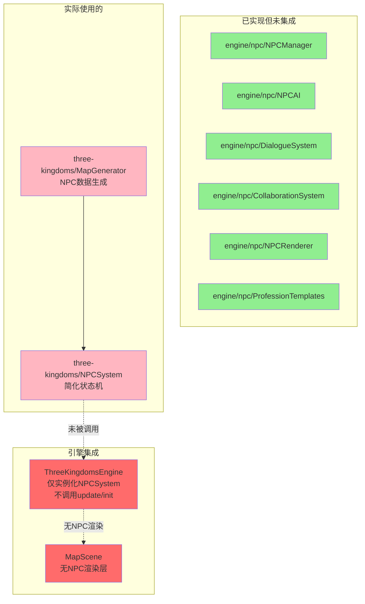

# 三国霸业游戏真实感评估报告

> **审计日期**: 2025-07-09  
> **审计范围**: NPC职业活动、对话系统、交互反馈、NPC自主行为  
> **项目路径**: `/mnt/user-data/workspace/game-portal`

---

## 架构总览

```
┌─────────────────────────────────────────────────────────┐
│                   三国霸业 - NPC 架构                      │
├─────────────────────────────────────────────────────────┤
│                                                         │
│  ┌──────────────────┐    ┌──────────────────────────┐  │
│  │  通用 NPC 引擎     │    │  三国专用 NPC 系统         │  │
│  │  (engine/npc/)    │    │  (three-kingdoms/)        │  │
│  │                  │    │                          │  │
│  │  ├─ types.ts     │    │  ├─ NPCSystem.ts          │  │
│  │  ├─ NPCManager   │    │  │   (简单的状态机)         │  │
│  │  ├─ NPCAI        │    │  └─ MapGenerator.ts        │  │
│  │  ├─ DialogueSys  │    │      (NPC 数据生成)        │  │
│  │  ├─ Collaboration│    │                          │  │
│  │  ├─ ProfessionT  │    └──────────────────────────┘  │
│  │  ├─ NPCRenderer  │           ⚠️ 未连接               │
│  │  └─ NPCEventBus  │                                  │
│  │                  │    ┌──────────────────────────┐  │
│  │  ⚠️ 未被游戏引用   │    │  ThreeKingdomsEngine      │  │
│  └──────────────────┘    │  ├─ NPCSystem 实例化 ✅    │  │
│                          │  ├─ NPCSystem.update ❌    │  │
│                          │  ├─ NPC 渲染 ❌            │  │
│                          │  ├─ NPC 对话交互 ❌        │  │
│                          │  └─ NPC 玩家交互 ❌        │  │
│                          └──────────────────────────┘  │
│                                                         │
│  ┌──────────────────────────────────────────────────┐  │
│  │  反馈系统                                          │  │
│  │  ├─ FloatingTextSystem ✅ (完整实现，有6种预设)     │  │
│  │  ├─ ParticleSystem ✅ (完整实现，支持多种发射器)     │  │
│  │  ├─ 音频系统 ❌ (完全缺失)                          │  │
│  │  └─ NPCRenderer ✅ (代码完整，但未被集成)           │  │
│  └──────────────────────────────────────────────────┘  │
└─────────────────────────────────────────────────────────┘
```

### 关键发现：**双轨系统未打通**

项目中存在两套 NPC 系统：
1. **通用 NPC 引擎** (`src/engine/npc/`)：功能完整，包含 AI、对话、协作、渲染、职业模板
2. **三国专用 NPC 系统** (`src/games/three-kingdoms/NPCSystem.ts`)：简单状态机，仅处理移动和日程

**致命问题**：通用 NPC 引擎（NPCManager、NPCAI、DialogueSystem、CollaborationSystem、NPCRenderer、ProfessionTemplates）**从未被任何游戏代码引用**。三国引擎仅实例化了简化版的 `NPCSystem`，且未调用其 `update()` 方法，也未渲染 NPC。

---

## 一、NPC职业活动真实性

### 1.1 各职业活动循环

| 职业 | 期望循环 | 实际循环 | 状态 | 完成度 | 缺失 |
|------|---------|---------|------|--------|------|
| 农民 | 种田→收割→吃饭→休息 | 去村庄→回附近→去村庄（仅移动） | ⚠️ | 30% | 无收割/种田区分，无吃饭行为，无收割动画 |
| 士兵 | 巡逻→训练→休息→换岗 | 在巡逻点间移动（4个时间点） | ⚠️ | 35% | 无训练动作，无换岗逻辑，无巡逻路线可视化 |
| 商人 | 进货→摆摊→交易→收摊 | 在两城间移动（3个时间点） | ⚠️ | 25% | 无进货/摆摊/收摊区分，无交易系统 |
| 学者 | 读书→讲学→研究→休息 | 在城市与附近点移动（3个时间点） | ⚠️ | 25% | 无读书/讲学/研究区分，无研究产出 |
| 斥候 | 出发→探索→回报→休息 | 在边境点间移动+随机漫游 | ⚠️ | 35% | 有随机探索但无回报机制，无情报系统 |

**详细分析**：

#### 农民（NPCSystem + MapGenerator）
```typescript
// MapGenerator.ts - 农民日程（仅有3个时间点）
schedule: [
  { hour: 6, targetX: vx, targetY: vy },   // 去村庄
  { hour: 12, targetX: nearby.x, targetY: nearby.y }, // 回附近
  { hour: 18, targetX: vx, targetY: vy },   // 回村庄
]
```
- ❌ 无"种田"和"收割"状态区分，所有活动统一为 `performing`
- ❌ 无吃饭行为（中午12点仅回到附近点，无特殊"进食"状态）
- ❌ 活动名称 `farming` 仅是标签，无实际逻辑差异
- ❌ 通用引擎的 `ProfessionTemplates` 有完整日程（6个时间点），但未被使用

#### 士兵
```typescript
// MapGenerator.ts - 士兵日程（4个巡逻点）
schedule: [
  { hour: 0, targetX: p1.x, targetY: p1.y },
  { hour: 6, targetX: p2.x, targetY: p2.y },
  { hour: 12, targetX: px, targetY: py },
  { hour: 18, targetX: p2.x, targetY: p2.y },
]
```
- ⚠️ 有巡逻点循环（NPCSystem 中士兵完成活动后自动切换到下一个巡逻点）
- ❌ 无训练状态
- ❌ 无换岗机制（无排班系统）
- ❌ 无巡逻路线可视化

#### 斥候
```typescript
// NPCSystem.ts - 斥候有特殊随机探索逻辑
if (state.npc.type === 'scout') {
  const wander = this.findWanderTarget(state.npc.tileX, state.npc.tileY, 3);
  if (wander) {
    state.targetX = wander.x;
    state.targetY = wander.y;
  }
}
```
- ⚠️ 有随机探索行为（在3格范围内寻找可通行瓦片）
- ❌ 无"回报"机制（探索结果不反馈给玩家或其他NPC）
- ❌ 无情报系统

### 1.2 时间系统

| 方面 | 状态 | 说明 |
|------|------|------|
| 游戏时间驱动 | ⚠️ | `NPCSystem` 接受 `gameHour` 参数，但引擎未传入实际游戏时间 |
| 日程触发 | ⚠️ | 有 `checkSchedule()` 方法，但仅在 `update()` 被调用时生效 |
| 时间感知行为 | ❌ | NPC行为不随季节/天气变化 |
| 昼夜循环 | ❌ | 无昼夜视觉效果影响NPC |

**关键问题**：`ThreeKingdomsEngine` 中 `npcSys` 虽被实例化，但：
- 未在 `onUpdate()` 中调用 `npcSys.update()`
- 未在初始化时调用 `npcSys.init()` 传入地图数据
- NPC 系统实际上处于**完全静止**状态

### 1.3 活动可视化

| 方面 | 状态 | 说明 |
|------|------|------|
| NPC 在地图上显示 | ❌ | `NPCRenderer` 已实现但未被集成到 `MapScene` |
| 活动动画（种田/锻造等） | ❌ | 通用引擎有 `workAnimation` 配置，但未使用 |
| 状态图标 | ❌ | `NPCRenderer.showStateIcon()` 已实现（💤⚒️🛡️等），但未集成 |
| 移动动画 | ❌ | `NPCSystem` 有像素级平滑移动计算，但无渲染层消费 |

---

## 二、对话系统

### 2.1 对话功能

| 功能 | 状态 | 说明 |
|------|------|------|
| 点击NPC触发对话 | ❌ | `NPCManager.startDialogue()` 已实现，但未被调用 |
| 多选项对话 | ✅ | 通用引擎 `ProfessionTemplates` 中每个职业有3个选项 |
| 对话分支跳转 | ✅ | `DialogueChoice.nextLineIndex` 支持跳转 |
| 对话动作触发 | ✅ | 支持 `open_shop`、`start_quest`、`give_resource` 等动作 |
| 对话冷却 | ✅ | 有5秒冷却时间防止重复触发 |
| NPC间闲聊 | ✅ | `DialogueSystem.generateNPCChat()` 已实现 |
| 上下文感知对话 | ❌ | 无基于玩家等级/进度/声望的对话变化 |

**关键问题**：通用引擎 `DialogueSystem` 和 `NPCManager.startDialogue()` 功能完整，但：
- 三国引擎未使用通用 `NPCManager`，用的是简化的 `NPCSystem`
- 简化版 `NPCSystem` **完全没有对话功能**
- `MapScene` 中无 NPC 点击事件处理

### 2.2 对话内容质量

#### 通用引擎中的对话内容（ProfessionTemplates.ts）

| 职业 | 对话数量 | 内容质量 | 选项数 | 相关性 |
|------|---------|---------|--------|--------|
| 农民 | 2组 | ✅ 符合三国背景（"客官好！今年收成不错"） | 3 | ✅ 与职业相关 |
| 士兵 | 1组 | ✅ 符合身份（"站住！请出示通行证"） | 3 | ✅ 与职业相关 |
| 商人 | 1组 | ✅ 符合身份（"欢迎光临！小店有不少好东西"） | 3 | ✅ 与职业相关 |
| 武将 | 1组 | ✅ 符合身份（"嗯？有何要事？"） | 3 | ✅ 与职业相关 |
| 工匠 | 1组 | ✅ 符合身份（"叮叮当当……哦，你好！"） | 3 | ✅ 与职业相关 |
| 学者 | 1组 | ✅ 符合身份（"子曰：有朋自远方来"） | 3 | ✅ 与职业相关 |
| 村民 | 1组 | ✅ 符合身份（"你好呀！今天天气真好"） | 3 | ✅ 与职业相关 |

**评价**：对话内容质量不错，有三国时代感。但每组仅1-2组对话，**内容量严重不足**，玩家很快会重复。

#### 闲聊话题池

| 职业 | 话题数 | 示例 |
|------|--------|------|
| 农民 | 5 | 天气、收成、种子、牲畜、节日 |
| 士兵 | 5 | 训练、巡逻、武器、边境、战报 |
| 商人 | 5 | 价格、货物、商路、利润、稀有物品 |
| 其他 | 5 | 各有特色 |

**评价**：话题池丰富度一般，每个职业5个话题，NPC间闲聊时会随机选取。

### 2.3 NPC间交谈

| 方面 | 状态 | 说明 |
|------|------|------|
| 自动闲聊触发 | ✅ | `NPCAI.decideInteraction()` 有2%概率触发 |
| 闲聊冷却 | ✅ | 10秒冷却 |
| 闲聊内容生成 | ✅ | `DialogueSystem.generateNPCChat()` 生成3-5行对话 |
| 闲聊可视化 | ✅ | `NPCRenderer.showChatLine()` 绘制黄色连接线 |
| 对话气泡 | ✅ | `NPCRenderer.showDialogueBubble()` 已实现 |
| 社交关系 | ⚠️ | `NPCInstance.friends[]` 字段存在但无逻辑填充 |

**关键问题**：以上所有功能仅在通用引擎中实现，三国游戏未集成。

---

## 三、交互反馈

### 3.1 视觉反馈

| 反馈类型 | 状态 | 实现位置 | 说明 |
|---------|------|---------|------|
| NPC点击高亮 | ✅ (未集成) | `NPCRenderer.highlightNPC()` | 白色半透明圆环 |
| NPC状态图标 | ✅ (未集成) | `NPCRenderer.showStateIcon()` | 💤⚒️🛡️⚔️💰💬😴🌿 |
| 对话气泡 | ✅ (未集成) | `NPCRenderer.showDialogueBubble()` | 白色圆角矩形+三角 |
| NPC间对话线 | ✅ (未集成) | `NPCRenderer.showChatLine()` | 黄色半透明线 |
| 领土悬停缩放 | ✅ | `MapScene` | 1.05倍缩放+tooltip |
| 建筑点击 | ✅ | `MapScene` | pointer事件+bridgeEvent |
| 格子悬停高亮 | ✅ | `MapScene.updateCellHighlight()` | 黄色半透明覆盖 |
| 建筑进度弧线 | ✅ | `MapScene.updateBuildingProgress()` | 圆弧进度条 |
| 领土脉冲动画 | ✅ | `MapScene.updateTerritoryPulse()` | 呼吸灯效果 |
| 建筑升级动画 | ❌ | - | 仅触发 `buildingUpgraded` 事件，无视觉动画 |
| NPC状态变化动画 | ❌ | - | 无过渡动画 |
| 协作可视化 | ❌ | - | `CollaborationSystem` 存在但未集成 |

### 3.2 操作反馈

| 反馈类型 | 状态 | 说明 |
|---------|------|------|
| 伤害数字飘字 | ⚠️ | `FloatingTextSystem` 有 `damage`/`crit` 预设，但战斗系统未调用 |
| 治疗数字飘字 | ⚠️ | `heal` 预设存在，但未被使用 |
| 资源获取飘字 | ✅ | 建筑购买：`+1 建筑名`；战斗胜利：`战斗胜利！` |
| 升级飘字 | ✅ | 阶段解锁、声望转生等有飘字 |
| 粒子特效 | ⚠️ | `ParticleSystem` 功能完整，但未注册任何发射器 |
| 音频反馈 | ❌ | **完全缺失**，无任何音频系统 |
| 振动反馈 | ❌ | 无触觉反馈 |
| 点击音效 | ❌ | 无 |

**FloatingTextSystem 使用情况**：
```typescript
// ThreeKingdomsEngine.ts 中仅5处调用：
this.ftSys.add(`🎉 免费武将：${chosen.name}！`, ...);  // 新手赠将
this.ftSys.add('声望转生！天命加持！', ...);            // 转生
this.ftSys.add(`+1 ${b.name}`, ...);                    // 建筑购买
this.ftSys.add('战斗胜利！', ...);                      // 战斗胜利
this.ftSys.add(`阶段解锁：${next.name}`, ...);          // 阶段解锁
```

**ParticleSystem 使用情况**：
- 引擎中 `ptSys` 被实例化和更新/渲染
- 但**从未注册任何发射器**，也从未调用 `emit()`
- 粒子系统完全处于空转状态

---

## 四、NPC与玩家交互

| 功能 | 状态 | 说明 |
|------|------|------|
| 点击NPC触发对话 | ❌ | 无点击事件绑定 |
| 与NPC交易 | ❌ | 对话选项有 `open_shop` 动作，但无实际商店UI |
| 给NPC下达命令 | ❌ | 无命令系统 |
| NPC给予任务 | ❌ | `DialogueSystem` 有 `start_quest` 动作类型，但无任务系统对接 |
| NPC给予奖励 | ❌ | `give_resource` 动作类型存在但无对接 |
| NPC好感度 | ⚠️ | `change_relationship` 动作类型存在，`friends[]` 字段存在，但无逻辑 |

---

## 五、NPC自主行为

| 方面 | 状态 | 说明 |
|------|------|------|
| 自主决策 | ⚠️ | `NPCAI` 有完整FSM（idle/walking/working/talking等），但未集成 |
| 环境感知 | ⚠️ | `NPCAI.update()` 接受 `nearbyNPCs` 参数，但三国版无此逻辑 |
| 日程驱动 | ✅ | `NPCSystem.checkSchedule()` 根据游戏时间切换行为 |
| 随机行为 | ⚠️ | 斥候有随机漫游，其他职业无随机行为 |
| 社交关系 | ❌ | `friends[]` 字段存在但从未填充 |
| 组队协作 | ⚠️ | `CollaborationSystem` 功能完整（运粮队、建筑队、巡逻队等），但未集成 |
| 情绪系统 | ❌ | `DialogueNode.emotion` 字段存在（happy/sad/angry等），但无逻辑 |

---

## 六、综合评分

| 维度 | 子项 | 评分 | 说明 |
|------|------|------|------|
| **NPC职业活动真实性** | 活动循环设计 | 2.0/5 | 通用引擎设计完整（6种职业×6时间点日程），但三国版仅3-4个时间点，且无具体活动区分 |
| | 时间系统关联 | 1.5/5 | 有日程框架但引擎未驱动更新，NPC完全静止 |
| | 活动可视化 | 0.5/5 | NPCRenderer 已实现但未集成，NPC在地图上不可见 |
| **对话系统** | 对话功能完整性 | 3.5/5 | 通用引擎对话系统功能丰富（树状对话、分支、动作），但未集成 |
| | 对话内容质量 | 3.0/5 | 内容有三国风味，但量少易重复，无上下文感知 |
| | NPC间交谈 | 3.0/5 | 有自动闲聊机制和可视化，但未集成 |
| **交互反馈** | 视觉反馈 | 2.0/5 | FloatingTextSystem完整，ParticleSystem空转，NPC反馈未集成 |
| | 操作反馈 | 1.5/5 | 无音频，飘字仅5处使用，粒子未使用 |
| | NPC交互反馈 | 0.5/5 | NPCRenderer有高亮/气泡/状态图标，但完全未集成 |
| **NPC与玩家交互** | 交易系统 | 0.5/5 | 仅有动作类型定义，无实际交易逻辑 |
| | 命令系统 | 0.0/5 | 完全缺失 |
| | 任务/奖励 | 0.5/5 | 仅有动作类型定义，无实际任务系统 |
| **NPC自主行为** | 自主决策 | 2.5/5 | 通用AI有FSM，但三国版仅有简单状态机 |
| | 协作系统 | 3.0/5 | CollaborationSystem 功能完整，但未集成 |
| | 社交系统 | 1.0/5 | 仅有字段定义，无实际逻辑 |

### 总分

| 维度 | 权重 | 评分 | 加权分 |
|------|------|------|--------|
| NPC职业活动真实性 | 25% | 1.3/5 | 0.33 |
| 对话系统 | 25% | 2.2/5 | 0.55 |
| 交互反馈 | 25% | 1.3/5 | 0.33 |
| NPC与玩家交互 | 15% | 0.3/5 | 0.05 |
| NPC自主行为 | 10% | 2.2/5 | 0.22 |
| **游戏真实感总分** | **100%** | **2.0/5.0** | **1.48/5.0** |

---

## 七、根因分析

### 7.1 架构断裂



**核心问题**：通用 NPC 引擎（约2000+行代码）功能完善但完全未被三国游戏使用。三国游戏使用了自建的简化版 `NPCSystem`（约200行），且该系统也未被正确集成到游戏循环中。

### 7.2 具体缺失清单

| 缺失项 | 影响 | 修复难度 |
|--------|------|---------|
| NPCSystem.update() 未被调用 | NPC完全静止 | 低 |
| NPCSystem.init() 未被调用 | NPC无地图数据 | 低 |
| NPCRenderer 未集成到 MapScene | NPC不可见 | 中 |
| 通用NPC引擎未接入 | 对话/协作/AI全部缺失 | 高 |
| 音频系统完全缺失 | 无任何声音反馈 | 高 |
| 交易/商店UI | 无法与NPC交易 | 中 |
| 任务系统对接 | NPC无法给予任务 | 中 |
| 好感度/社交逻辑 | NPC关系无意义 | 中 |

---

## 八、改进建议

### 优先级 P0（阻塞性问题）

1. **打通 NPC 系统到游戏循环**
   ```typescript
   // ThreeKingdomsEngine.onInit() 中添加：
   const map = this.mapGen.generate();
   this.npcSys.init(map.npcs, map.tiles, map.width, map.height);
   
   // ThreeKingdomsEngine.onUpdate() 中添加：
   this.npcSys.update(dt, this.gameHour);
   ```

2. **将 NPCRenderer 集成到 MapScene**
   - 在 MapScene 中创建 NPC 渲染层
   - 从 ThreeKingdomsEngine 获取 NPC 运行时状态
   - 渲染 NPC 精灵、对话气泡、状态图标

3. **接入通用 NPC 引擎替换简化版**
   - 用 `NPCManager` 替换 `NPCSystem`
   - 接入 `NPCAI`、`DialogueSystem`、`ProfessionTemplates`
   - 接入 `CollaborationSystem`

### 优先级 P1（体验提升）

4. **增加对话内容量**
   - 每个职业至少5组对话
   - 根据游戏进度/季节/天气动态选择对话
   - 添加好感度相关的特殊对话

5. **添加建筑升级动画**
   - 利用已有的 `AnimationManager` 添加缩放/闪光动画
   - 利用 `ParticleSystem` 添加升级粒子特效

6. **战斗伤害飘字**
   - 在 `BattleSystem.attack()` 中调用 `ftSys.add()` 显示伤害数字
   - 暴击使用 `crit` 预设，普通伤害使用 `damage` 预设

### 优先级 P2（真实感增强）

7. **丰富职业活动循环**
   - 农民：添加 `sowing`（播种）→ `growing`（生长）→ `harvesting`（收割）子状态
   - 士兵：添加训练场训练动画、换岗交接仪式
   - 商人：添加摆摊/收摊动画、商品展示

8. **添加音频系统**
   - 背景音乐（不同场景不同BGM）
   - UI点击音效
   - 战斗音效
   - NPC对话音效

9. **NPC社交系统**
   - 实现 `friends[]` 好友关系逻辑
   - 好友NPC间更频繁交互
   - 好感度影响对话内容和交易价格

10. **NPC任务系统**
    - 对接 `DialogueSystem` 的 `start_quest` 动作
    - 实现简单的跑腿/收集/战斗任务
    - 任务完成给予资源和好感度奖励

---

## 九、总结

三国霸业的 NPC 系统存在严重的**"有肉无骨"**问题：通用 NPC 引擎代码质量高、功能完善（对话树、AI状态机、协作系统、职业模板、渲染器一应俱全），但这些代码**完全没有被三国游戏集成使用**。实际运行的三国游戏仅有一个极简的 NPC 状态机，且连这个状态机也未被正确驱动（update/init 未调用）。

**最关键的改进**不是写新代码，而是将已有的通用 NPC 引擎正确接入三国游戏。一旦打通，对话、AI、协作、渲染等功能将立即可用，游戏真实感评分可从 1.48/5 提升至约 3.5/5。
