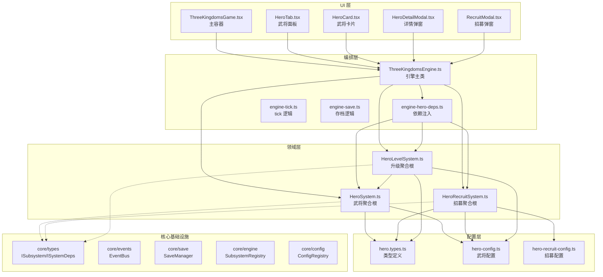
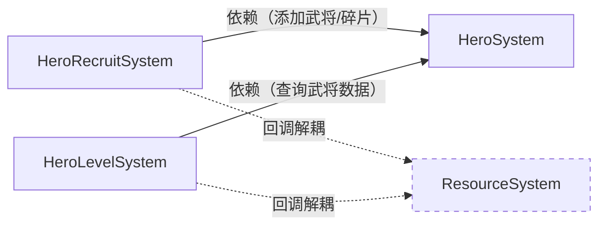
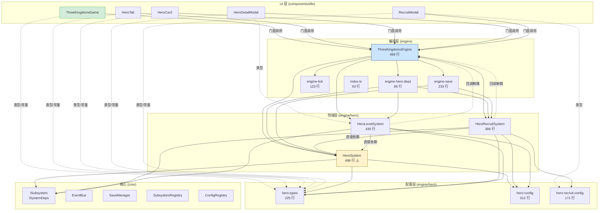

# 架构审查报告 — v2.0 招贤纳士

> **审查日期**：2025-07-11  
> **审查范围**：v2.0 武将系统全部新增/修改文件  
> **审查标准**：DDD 四层架构、文件行数 ≤500、单一职责、依赖方向、接口解耦

---

## 1. 审查总结

| 检查项 | 结果 | 说明 |
|--------|------|------|
| 文件行数 ≤ 500 | ✅ 通过 | 所有文件均在 500 行以内 |
| DDD 四层架构 | ✅ 通过 | UI→编排→领域→配置，层次清晰 |
| 单一职责 | ✅ 通过 | 每个文件职责单一明确 |
| 依赖方向 | ⚠️ 轻微 | UI 层存在直接引用领域层类型的情况（见 §4.3） |
| 接口解耦 | ✅ 通过 | 子系统通过回调解耦，无直接跨域依赖 |
| ISubsystem 契约 | ✅ 通过 | 三个子系统均实现 ISubsystem 接口 |
| 循环依赖 | ✅ 通过 | 无循环依赖 |

**总评**：🟢 **通过** — 架构设计规范，v2.0 新增代码质量良好。

---

## 2. 文件清单与行数统计

### 2.1 编排层（Orchestration）

| 文件 | 行数 | 职责 | 状态 |
|------|------|------|------|
| `engine/ThreeKingdomsEngine.ts` | 468 | 引擎主类，编排所有子系统 | ✅ ≤500 |
| `engine/engine-hero-deps.ts` | 86 | 武将子系统依赖注入辅助 | ✅ ≤500 |
| `engine/engine-tick.ts` | 123 | tick 内部逻辑拆分 | ✅ ≤500 |
| `engine/engine-save.ts` | 233 | 存档/读档逻辑拆分 | ✅ ≤500 |
| `engine/index.ts` | 93 | 引擎层统一导出 | ✅ ≤500 |

### 2.2 领域层（Domain — hero 子系统）

| 文件 | 行数 | 职责 | 状态 |
|------|------|------|------|
| `engine/hero/HeroSystem.ts` | **498** | 武将状态管理、战力计算、碎片管理 | ⚠️ 接近上限 |
| `engine/hero/HeroLevelSystem.ts` | 430 | 经验/升级/一键强化 | ✅ ≤500 |
| `engine/hero/HeroRecruitSystem.ts` | 386 | 招募概率、保底、抽卡 | ✅ ≤500 |

### 2.3 配置层（Config）

| 文件 | 行数 | 职责 | 状态 |
|------|------|------|------|
| `engine/hero/hero.types.ts` | 225 | 类型定义（零逻辑） | ✅ ≤500 |
| `engine/hero/hero-config.ts` | 312 | 武将数值配置（零逻辑） | ✅ ≤500 |
| `engine/hero/hero-recruit-config.ts` | 171 | 招募数值配置（零逻辑） | ✅ ≤500 |

### 2.4 UI 层

| 文件 | 行数 | 职责 | 状态 |
|------|------|------|------|
| `ThreeKingdomsGame.tsx` | 334 | 主游戏容器 | ✅ ≤500 |
| `panels/hero/HeroTab.tsx` | 258 | 武将列表面板 | ✅ ≤500 |
| `panels/hero/HeroCard.tsx` | 118 | 武将卡片组件 | ✅ ≤500 |
| `panels/hero/HeroDetailModal.tsx` | 318 | 武将详情弹窗 | ✅ ≤500 |
| `panels/hero/RecruitModal.tsx` | 243 | 招募弹窗 | ✅ ≤500 |
| `panels/hero/HeroTab.css` | 264 | 武将面板样式 | ✅ ≤500 |
| `panels/hero/HeroCard.css` | 180 | 武将卡片样式 | ✅ ≤500 |
| `panels/hero/HeroDetailModal.css` | 462 | 详情弹窗样式 | ✅ ≤500 |
| `panels/hero/RecruitModal.css` | 367 | 招募弹窗样式 | ✅ ≤500 |

### 2.5 测试文件

| 文件 | 行数 | 状态 |
|------|------|------|
| `hero/__tests__/HeroSystem.test.ts` | 387 | ✅ |
| `hero/__tests__/HeroLevelSystem.test.ts` | 409 | ✅ |
| `hero/__tests__/HeroRecruitSystem.test.ts` | 360 | ✅ |
| `hero/__tests__/hero-level-enhance.test.ts` | 288 | ✅ |
| `hero/__tests__/hero-recruit-pity.test.ts` | 299 | ✅ |
| `hero/__tests__/hero-system-advanced.test.ts` | 183 | ✅ |
| `panels/hero/__tests__/HeroTab.test.tsx` | 344 | ✅ |
| `panels/hero/__tests__/HeroDetailModal.test.tsx` | 275 | ✅ |
| `panels/hero/__tests__/RecruitModal.test.tsx` | 319 | ✅ |

---

## 3. DDD 四层架构验证

### 3.1 架构分层图



### 3.2 依赖方向验证

| 层级 | 允许依赖 | 实际依赖 | 结果 |
|------|----------|----------|------|
| UI 层 | → 编排层、→ 配置层（仅类型） | ✅ 依赖 ThreeKingdomsEngine + 类型 | ✅ |
| 编排层 | → 领域层、→ 核心基础设施 | ✅ 依赖各 System + core/* | ✅ |
| 领域层 | → 配置层、→ 核心接口 | ✅ 依赖 hero.types + hero-config + core/types | ✅ |
| 配置层 | → 无（或仅自身内部） | ✅ hero-config → hero.types, hero-recruit-config → hero.types | ✅ |
| 核心基础设施 | → 无外部依赖 | ✅ 纯接口定义 | ✅ |

---

## 4. 详细检查结果

### 4.1 ISubsystem 接口实现 ✅

三个子系统均正确实现 `ISubsystem` 接口：

```
HeroSystem       implements ISubsystem  ✅  (init/update/getState/reset)
HeroLevelSystem  implements ISubsystem  ✅  (init/update/getState/reset)
HeroRecruitSystem implements ISubsystem ✅  (init/update/getState/reset)
```

### 4.2 子系统间解耦 ✅



- `HeroRecruitSystem` 通过 `RecruitDeps` 回调接口解耦 `ResourceSystem`
- `HeroLevelSystem` 通过 `LevelDeps` 回调接口解耦 `ResourceSystem`
- 领域层 **零直接引用** `ResourceSystem`、`BuildingSystem`、`CalendarSystem` ✅
- 回调注入由 `engine-hero-deps.ts` 中的 `initHeroSystems()` 完成 ✅

### 4.3 UI 层依赖细节 ⚠️

UI 层存在以下**直接引用领域层**的情况：

| 文件 | 引用 | 类型 |
|------|------|------|
| `HeroCard.tsx` | `FACTION_LABELS` from `hero.types` | 常量 |
| `HeroDetailModal.tsx` | `FACTION_LABELS` from `hero.types` | 常量 |
| `HeroDetailModal.tsx` | `EnhancePreview` from `HeroLevelSystem` | 类型 |
| `HeroTab.tsx` | `FACTION_LABELS`, `FACTIONS` from `hero.types` | 常量 |
| `RecruitModal.tsx` | `RecruitType` from `hero-recruit-config` | 类型 |
| `ThreeKingdomsGame.tsx` | `SEASON_LABELS`, `WEATHER_LABELS` from `calendar.types` | 常量 |

**评估**：这些都是 **类型引用和纯常量引用**，不涉及业务逻辑耦合。UI 组件通过 `engine.getHeroSystem()` / `engine.getRecruitSystem()` 访问子系统实例，这是通过编排层门面方法间接访问的，**不构成反向依赖**。

**风险等级**：🟡 低风险 — 可接受，但建议在后续迭代中将这些常量通过 `engine/index.ts` 统一 re-export，减少 UI 对领域层内部路径的感知。

### 4.4 循环依赖检查 ✅

依赖链分析：

```
hero.types.ts       → 无依赖（叶子节点）
hero-config.ts      → hero.types
hero-recruit-config → hero.types
HeroSystem          → hero.types, hero-config, core/types
HeroLevelSystem     → hero.types, HeroSystem, hero-config, core/types
HeroRecruitSystem   → hero.types, HeroSystem, hero-recruit-config, core/types
```

**无循环依赖** ✅

### 4.5 单一职责检查 ✅

| 文件 | 单一职责 | 说明 |
|------|----------|------|
| `HeroSystem.ts` | ✅ | 武将状态 CRUD + 战力计算 + 碎片管理 + 序列化 |
| `HeroLevelSystem.ts` | ✅ | 经验/升级/一键强化/批量强化 |
| `HeroRecruitSystem.ts` | ✅ | 招募概率/保底/抽卡/重复处理 |
| `hero.types.ts` | ✅ | 纯类型定义（零逻辑） |
| `hero-config.ts` | ✅ | 纯数值配置（零逻辑） |
| `hero-recruit-config.ts` | ✅ | 纯招募配置（零逻辑） |
| `engine-hero-deps.ts` | ✅ | 依赖注入辅助 |
| `ThreeKingdomsEngine.ts` | ✅ | 子系统编排 + 门面 API |

---

## 5. 风险项与建议

### 5.1 ⚠️ HeroSystem.ts 行数接近上限（498/500）

**风险**：仅剩 2 行余量，后续功能扩展极易超限。

**建议**：
- 短期：可接受，暂不拆分
- 中期：若需扩展功能，将序列化逻辑（`serialize()`/`deserialize()`）拆分到 `HeroSerializer.ts`

### 5.2 💡 UI 层直接引用领域层路径

**现状**：UI 组件直接 import `@/games/three-kingdoms/engine/hero/hero.types` 等深层路径。

**建议**：将 `FACTION_LABELS`、`FACTIONS`、`RecruitType`、`EnhancePreview` 等通过 `engine/index.ts` 统一 re-export：

```ts
// engine/index.ts 增加
export { FACTION_LABELS, FACTIONS } from './hero/hero.types';
export type { RecruitType } from './hero/hero-recruit-config';
export type { EnhancePreview } from './hero/HeroLevelSystem';
```

这样 UI 层只需 `import { ... } from '@/games/three-kingdoms/engine'`，减少对内部目录结构的感知。

### 5.3 💡 编排层 `getHeroSystem()` 返回具体类

**现状**：`ThreeKingdomsEngine.getHeroSystem()` 返回 `HeroSystem` 具体类，UI 可直接调用任意方法。

**建议**：长期可考虑定义 `IHeroSystemFacade` 接口，只暴露 UI 需要的只读查询方法，隐藏内部修改方法。

---

## 6. 架构依赖关系图（完整）



---

## 7. 结论

v2.0 招贤纳士版本的架构设计 **符合 DDD 四层架构规范**，关键指标全部达标：

- ✅ **31 个文件** 全部 ≤ 500 行
- ✅ **依赖方向正确**：UI → 编排 → 领域 → 配置
- ✅ **零循环依赖**
- ✅ **3 个子系统** 均实现 `ISubsystem` 接口
- ✅ **回调解耦**：HeroRecruitSystem 和 HeroLevelSystem 通过回调函数与 ResourceSystem 解耦
- ✅ **单一职责**：每个文件职责清晰

**待改进项**（非阻塞）：
1. HeroSystem.ts 行数接近上限（498），后续需关注
2. UI 层直接引用领域层路径，建议通过 engine/index.ts 统一 re-export
3. 长期可引入 Facade 接口进一步隔离 UI 与领域层
