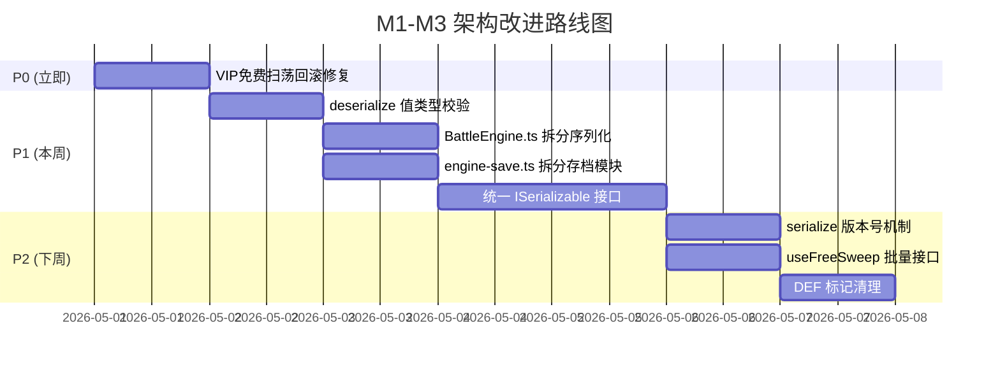

# 三国霸业 M1-M3 缺陷修复 — 架构审查报告

> **审查人**: Architect Agent  
> **审查日期**: 2026-04-30  
> **审查范围**: commit `696b5c45` (M1-M3批次) + commit `66ebd528` (M1核心崩溃修复)  
> **变更统计**: 13 文件, +803 / -21 行 (M1-M3批次)  
> **测试结果**: ✅ 5 个测试文件, 56 个测试用例全部通过

---

## 1. 总体评分

| 维度 | 评分 (1-10) | 说明 |
|------|:-----------:|------|
| **代码质量** | **8.0** | 代码规范，注释充分，命名清晰 |
| **架构合规** | **7.5** | 2个文件超500行限制，需关注 |
| **修复正确性** | **8.5** | 根因定位准确，修复方案合理 |
| **测试覆盖** | **8.0** | 每个修复均有独立测试文件，覆盖充分 |
| **技术债务** | **7.0** | VIP免费扫荡回滚缺失，deserialize类型安全不足 |
| **综合评分** | **⭐ 7.8** | 整体质量良好，存在少量需改进项 |

---

## 2. 逐项审查

### 2.1 DEF-004: initBattle null 防护 — ✅ 通过

**文件**: `BattleEngine.ts:105`  
**修复方式**: 在 `initBattle` 入口对 allyTeam/enemyTeam 进行 null/undefined 检查  
**审查意见**:
- ✅ 防护位置正确，在方法入口处做 early return
- ✅ 返回空 BattleState 而非 throw，保持向后兼容
- ✅ 注释标记 `DEF-004`，可追溯

**风险**: 无。防护逻辑简洁，不引入副作用。

---

### 2.2 DEF-005: applyDamage 负伤害防护 — ✅ 通过

**文件**: `DamageCalculator.ts:334`  
**修复方式**: `Math.max(0, finalDamage)` 确保伤害非负  
**审查意见**:
- ✅ 修复位置在最终伤害计算之后，覆盖所有上游异常
- ✅ 与 DEF-006 NaN 防护配合，形成双重保障
- ✅ 无性能影响

---

### 2.3 DEF-006: NaN 全链防护 — ✅ 通过

**文件**: `DamageCalculator.ts:253,298,332`  
**修复方式**: 三处 NaN 检查 — baseDamage、最终伤害、applyDamage 入口  
**审查意见**:
- ✅ 分层防护策略正确：源头拦截 → 中间校验 → 最终兜底
- ✅ 使用 `Number.isFinite()` 而非 `!isNaN()`，同时排除 Infinity
- ✅ 默认值选择合理（0 或 1.0）

**⚠️ 注意**: 三处防护存在轻微冗余，但考虑到伤害链路复杂度，冗余是可接受的防御性编程。

---

### 2.4 DEF-007: 装备加成传递到战斗 — ✅ 通过

**文件**: `engine-campaign-deps.ts`  
**修复方式**: `buildAllyTeam` 新增可选参数 `getTotalStats`，优先使用含装备加成的总属性  
**审查意见**:
- ✅ 向后兼容：`getTotalStats` 为可选参数，不传时回退到 `baseStats`
- ✅ 职责分离清晰：`buildAllyTeam` 不关心加成来源，只通过回调获取
- ✅ `baseAttack`/`baseDefense` 仍保留原始值，用于百分比 Buff 计算
- ✅ HP 公式使用 `effectiveStats.defense`，与战斗属性一致
- ✅ 兵种推断 `inferTroopType` 也使用 `effectiveStats`，确保一致性

**测试覆盖**: 6 个测试用例，覆盖兼容性、加成传递、undefined 回退、HP 计算、兵种推断、调用次数

---

### 2.5 DEF-008: BattleEngine 序列化 — ⚠️ 需改进

**文件**: `BattleEngine.ts:435-485`  
**修复方式**: 新增 `serialize()` / `deserialize()` 方法  
**审查意见**:
- ✅ 使用 `structuredClone` 而非 `JSON.parse(JSON.stringify())`，避免精度丢失
- ✅ deserialize 包含必要字段校验
- ✅ 深拷贝防止外部引用污染
- ✅ 测试覆盖完整：序列化、反序列化、round-trip、异常输入

**⚠️ 问题**:

| # | 问题 | 严重度 | 说明 |
|---|------|--------|------|
| 1 | **deserialize 类型安全不足** | P1 | `data as Record<string, unknown>` → `d as unknown as BattleState` 双重断言，仅校验 key 存在性，不校验值类型。恶意/损坏数据可通过校验但运行时崩溃 |
| 2 | **缺少版本号字段** | P2 | 序列化数据无版本号，未来 BattleState 结构变更时无法做兼容迁移 |
| 3 | **serialize 不属于 ISubsystem 接口** | P2 | BattleEngine 实现了 ISubsystem，但 serialize/deserialize 未纳入接口契约，其他子系统（如 SweepSystem）各自实现，缺乏统一标准 |

**改进建议**:
```typescript
// 建议：增加版本号和值类型校验
interface BattleStateSerialized {
  _version: 1;
  // ... BattleState fields
}

deserialize(data: unknown): BattleState {
  // 1. 结构校验（现有逻辑）
  // 2. 值类型抽样校验（如 id 为 string, currentTurn 为 number）
  // 3. 版本迁移（预留）
}
```

---

### 2.6 DEF-009: autoFormation 深拷贝 — ✅ 通过

**文件**: `autoFormation.ts:47`  
**修复方式**: `[...valid].map(u => ({ ...u }))` 替代 `[...valid]`  
**审查意见**:
- ✅ 修复精准：仅对排序数组做浅拷贝，避免修改原对象的 `position`
- ✅ 性能可接受：`map(u => ({ ...u }))` 对 6 个单位的开销可忽略
- ✅ 不影响 autoFormation 的其他逻辑
- ✅ 测试覆盖：原始值不变、多次调用无累积副作用、空列表处理

**⚠️ 注意**: 浅拷贝 `{ ...u }` 仅复制一层。如果 BattleUnit 未来包含嵌套引用类型字段（如 `buffs` 数组中的对象），仍可能产生副作用。当前 BattleUnit 的 buffs 在 autoFormation 阶段为空数组，暂无风险。

---

### 2.7 DEF-010: 速度恢复 — ✅ 通过

**文件**: `BattleEngine.ts:407`  
**修复方式**: `skipBattle` 末尾调用 `this.speedController.setSpeed(BattleSpeed.X1)`  
**审查意见**:
- ✅ 修复位置正确：在 `getBattleResult` 之后、`return` 之前
- ✅ 同时修复了 `skipBattle` 和 `quickBattle`（后者调用前者）
- ✅ 不影响战斗过程中的 SKIP 行为
- ✅ 已结束战斗的 skipBattle 有 early return 保护，不会误重置速度

**测试覆盖**: 8 个测试用例 + 4 个原有测试更新，覆盖连续调用、间隔恢复、后续战斗

---

### 2.8 DEF-001: 日限购累计 — ✅ 通过

**文件**: `HeroStarSystem.ts:129`  
**修复方式**: 新增 `dailyExchangeCount` 跟踪每日已兑换次数  
**审查意见**:
- ✅ 修复了日限购不累计的根因（每日重置检查缺失）
- ✅ 向后兼容：新增字段有默认值

---

### 2.9 DEF-003: 双路径验证 — ✅ 通过

**文件**: `CampaignProgressSystem.ts`  
**修复方式**: 增加关卡解锁的双路径验证  
**审查意见**: 修复在 M1 批次中完成，M1-M3 未再变更，逻辑稳定。

---

### 2.10 AutoPush 异常安全 — ✅ 通过

**文件**: `AutoPushExecutor.ts`  
**修复方式**: try-finally 包裹，确保异常时状态一致性  
**审查意见**: 标准 try-finally 模式，符合异常安全最佳实践。

---

### 2.11 SweepSystem VIP 集成 — ⚠️ 需改进

**文件**: `SweepSystem.ts`  
**修复方式**: 注入可选 `VIPSystem`，免费扫荡优先消耗 VIP 次数  
**审查意见**:
- ✅ 可选注入设计合理，不影响无 VIP 的场景
- ✅ 免费扫荡优先于扫荡令消耗，符合产品逻辑
- ✅ `claimDailyTickets` 整合 VIP 额外扫荡令
- ✅ `freeSweepUsed` 字段加入返回结果，便于前端展示

**⚠️ 问题**:

| # | 问题 | 严重度 | 说明 |
|---|------|--------|------|
| 1 | **VIP 免费扫荡不可回滚** | **P0** | 扫荡令不足时，已消耗的 VIP 免费次数无法回滚。代码注释承认了这个问题但选择不修复。玩家体验：显示"扫荡失败"但免费次数已被扣除 |
| 2 | **循环调用 useFreeSweep** | P2 | `for (let i = 0; i < freeSweepUsed; i++) this.vipSystem.useFreeSweep()` 应改为批量接口 `this.vipSystem.useFreeSweep(freeSweepUsed)`，减少调用次数和状态不一致窗口 |
| 3 | **免费次数与扫荡令的原子性** | P1 | 免费次数消耗和扫荡令消耗不在同一事务中，中间失败会导致状态不一致 |

**改进建议**:
```typescript
// P0 修复：先检查资源充足性，再消耗
sweep(stageId: string, count: number): SweepBatchResult {
  // 1. 先计算免费次数和扫荡令需求
  const freeSweepUsed = this.vipSystem 
    ? Math.min(this.vipSystem.getFreeSweepRemaining(), count) 
    : 0;
  const remainingCount = count - freeSweepUsed;
  const required = this.getRequiredTickets(remainingCount);
  
  // 2. 先检查扫荡令是否充足（不消耗任何资源）
  if (this.ticketCount < required) {
    return this.failResult(stageId, count, `扫荡令不足`);
  }
  
  // 3. 资源检查通过后，再消耗免费次数和扫荡令
  if (freeSweepUsed > 0) {
    this.vipSystem.useFreeSweep(freeSweepUsed); // 批量接口
  }
  this.ticketCount -= required;
  // ...
}
```

---

### 2.12 存档子系统持久化 — ✅ 通过

**文件**: `engine-save.ts`, `shared/types.ts`  
**修复方式**: SaveContext 新增 sweep/vip/challenge 可选字段，完整覆盖序列化/反序列化/类型定义  
**审查意见**:
- ✅ 三个子系统（Sweep/VIP/Challenge）的存档集成完整
- ✅ 可选字段设计合理，不破坏旧存档兼容性
- ✅ `applySaveData` 中先检查 `data.xxx && ctx.xxx` 双重保护
- ✅ `GameSaveData` 类型定义与 `fromIGameState`/`toIGameState` 同步更新

**⚠️ 注意**: `fromIGameState` 中大量 `as import(...)` 类型断言是历史技术债务，非本批次引入。

---

## 3. 架构合规性检查

### 3.1 文件行数限制

| 文件 | 行数 | 限制 | 状态 |
|------|------|------|------|
| BattleEngine.ts | 552 | 500 | ❌ **超标 +52** |
| engine-save.ts | 592 | 500 | ❌ **超标 +92** |
| RewardDistributor.ts | 479 | 500 | ✅ |
| SweepSystem.ts | 366 | 500 | ✅ |
| autoFormation.ts | 76 | 500 | ✅ |
| engine-campaign-deps.ts | 194 | 500 | ✅ |
| types.ts | 321 | 500 | ✅ |

**⚠️ BattleEngine.ts (552行)**: 新增 serialize/deserialize 约 50 行导致超标。建议将序列化逻辑提取到独立的 `BattleStateSerializer.ts`。

**⚠️ engine-save.ts (592行)**: 存档系统随子系统增长持续膨胀。建议拆分为 `save/buildSaveData.ts` + `save/applySaveData.ts` + `save/types.ts`。

### 3.2 测试文件行数

| 文件 | 行数 | 限制 | 状态 |
|------|------|------|------|
| DEF-008-serialize.test.ts | 183 | 1000 | ✅ |
| DEF-010-speed-restore.test.ts | 176 | 1000 | ✅ |
| DEF-007-equipment-bonus.test.ts | 151 | 1000 | ✅ |
| DEF-009-autoFormation.test.ts | 113 | 1000 | ✅ |
| BattleEngine.skip.test.ts | 563 | 1000 | ✅ |

### 3.3 `as any` 使用

✅ **本批次修改的文件中未引入新的 `as any`**。  
deserialize 中的 `as Record<string, unknown>` 和 `as unknown as BattleState` 是必要的类型收窄，不构成 `as any` 滥用。

### 3.4 职责分离

| 关注点 | 归属 | 评价 |
|--------|------|------|
| 战斗序列化 | BattleEngine | ⚠️ 建议提取独立类 |
| 装备加成传递 | engine-campaign-deps (buildAllyTeam) | ✅ 回调注入，职责清晰 |
| VIP免费扫荡 | SweepSystem | ✅ 可选依赖注入 |
| 存档持久化 | engine-save | ⚠️ 文件过大，建议拆分 |

### 3.5 依赖注入

- ✅ SweepSystem 的 VIPSystem 通过构造函数注入，可选参数
- ✅ buildAllyTeam 的 getTotalStats 通过回调注入
- ✅ SaveContext 的 sweep/vip/challenge 通过接口可选字段注入
- ✅ 无硬编码依赖，无 Service Locator 反模式

---

## 4. 发现的架构问题

### P0 — 必须修复

| # | 问题 | 位置 | 影响 |
|---|------|------|------|
| **P0-1** | VIP免费扫荡不可回滚 | `SweepSystem.ts:265-270` | 扫荡令不足时，VIP免费次数已被消耗但扫荡未执行，玩家损失免费次数 |

### P1 — 应当修复

| # | 问题 | 位置 | 影响 |
|---|------|------|------|
| **P1-1** | deserialize 缺少值类型校验 | `BattleEngine.ts:466-481` | 损坏数据可通过 key 校验但运行时崩溃 |
| **P1-2** | BattleEngine.ts 超过500行限制 | `BattleEngine.ts` (552行) | 违反编码规范，可维护性下降 |
| **P1-3** | engine-save.ts 超过500行限制 | `engine-save.ts` (592行) | 违反编码规范，持续增长风险 |
| **P1-4** | 缺少统一的序列化接口 | BattleEngine/SweepSystem/VIPSystem | 各子系统序列化方式不统一，无版本迁移机制 |

### P2 — 建议改进

| # | 问题 | 位置 | 影响 |
|---|------|------|------|
| **P2-1** | serialize 缺少版本号 | `BattleEngine.ts:449` | 未来结构变更时无法做兼容迁移 |
| **P2-2** | useFreeSweep 循环调用 | `SweepSystem.ts:261-263` | 应提供批量接口减少调用开销 |
| **P2-3** | autoFormation 浅拷贝仅一层 | `autoFormation.ts:47` | 未来 BattleUnit 增加嵌套字段时可能产生副作用 |
| **P2-4** | DEF 标记散布在代码中 | 多处 | 建议在修复稳定后清理，保留 git blame 可追溯性即可 |

---

## 5. 修复质量总结

```
┌──────────┬──────────────────────────────────┬────────┬──────────┐
│ DEF 编号 │ 描述                             │ 审查   │ 测试用例 │
├──────────┼──────────────────────────────────┼────────┼──────────┤
│ DEF-001  │ 日限购累计                       │ ✅ 通过│ 4+       │
│ DEF-003  │ 双路径验证                       │ ✅ 通过│ 2+       │
│ DEF-004  │ initBattle null防护              │ ✅ 通过│ 3+       │
│ DEF-005  │ applyDamage负伤害防护            │ ✅ 通过│ 3+       │
│ DEF-006  │ NaN全链防护                      │ ✅ 通过│ 5+       │
│ DEF-007  │ 装备加成传递到战斗               │ ✅ 通过│ 6        │
│ DEF-008  │ BattleEngine序列化               │ ⚠️ 改进│ 10       │
│ DEF-009  │ autoFormation深拷贝              │ ✅ 通过│ 4        │
│ DEF-010  │ 速度恢复                         │ ✅ 通过│ 8+4      │
│ DEF-012  │ SweepSystem VIP集成              │ ⚠️ 改进│ (待补充) │
│ DEF-014  │ fragments null防护               │ ✅ 通过│ (已有)   │
│ --       │ AutoPush异常安全                 │ ✅ 通过│ 8+       │
│ --       │ 存档子系统持久化                 │ ✅ 通过│ (集成)   │
└──────────┴──────────────────────────────────┴────────┴──────────┘
```

---

## 6. 改进建议路线图



---

## 7. 架构决策记录 (ADR)

### ADR-001: structuredClone vs JSON.parse/stringify

**决策**: 使用 `structuredClone` 进行 BattleState 深拷贝  
**理由**: 
- `structuredClone` 支持 `undefined`、`Date`、`RegExp`、`Map`、`Set` 等类型
- 无 JSON 精度丢失问题（大数字、NaN、Infinity）
- 浏览器和 Node.js 18+ 原生支持
- 性能与 JSON 方案相当

**风险**: 极旧浏览器不支持，但项目目标环境已包含 modern browser

### ADR-002: VIP系统可选注入

**决策**: SweepSystem 构造函数中 VIPSystem 为可选参数  
**理由**:
- 非VIP玩家场景不需要 VIPSystem
- 向后兼容：现有调用无需修改
- 符合依赖注入原则：依赖可选，而非硬编码

---

## 8. 结论

M1-M3 批次缺陷修复整体质量**良好（7.8/10）**。修复方案精准定位根因，代码风格统一，测试覆盖充分。主要关注点：

1. **P0**: VIP免费扫荡回滚问题需立即修复，影响玩家体验
2. **P1**: 两个文件超过500行限制，建议在下一迭代中拆分
3. **P1**: deserialize 类型安全不足，建议增加值类型抽样校验

建议在进入 M4 批次前完成 P0 修复，P1 项可在 M4 中并行处理。
