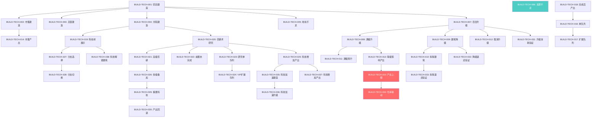

# 三国霸业 — 建筑科技模块测试流程树

> 模块: Building & Technology  
> 节点数: 38  
> 覆盖子系统: 建筑建造 / 建筑升级降级 / 资源产出 / 建筑队列 / 科技树 / 科技研究 / 研究队列 / 科技效果 / 建筑↔资源交互 / 建筑↔科技交互  
> 生成时间: 2025-01-01  

---

## 一、建筑系统 — 基础建造

### BUILD-TECH-001: 农田建造
- 前置: 无
- 操作: 在空地块上选择"农田"建筑，消耗木材×200 / 石料×100，点击确认建造
- 预期: 农田出现在地块上，状态为"建造中"，倒计时开始；木材-200、石料-100
- 优先级: P0
- 关联系统: 建筑建造
- 状态: covered

### BUILD-TECH-002: 市集建造
- 前置: BUILD-TECH-001
- 操作: 在空地块上选择"市集"建筑，消耗木材×300 / 石料×200 / 铜币×500，点击确认建造
- 预期: 市集出现在地块上，状态为"建造中"；木材-300、石料-200、铜币-500
- 优先级: P0
- 关联系统: 建筑建造
- 状态: covered

### BUILD-TECH-003: 兵营建造
- 前置: BUILD-TECH-001
- 操作: 在空地块上选择"兵营"建筑，消耗木材×500 / 石料×400 / 铁矿×300，点击确认建造
- 预期: 兵营出现在地块上，状态为"建造中"；资源正确扣除
- 优先级: P0
- 关联系统: 建筑建造
- 状态: covered

### BUILD-TECH-004: 书院建造
- 前置: BUILD-TECH-001
- 操作: 在空地块上选择"书院"建筑，消耗木材×600 / 石料×500 / 铜币×1000，点击确认建造
- 预期: 书院出现在地块上，状态为"建造中"；资源正确扣除
- 优先级: P0
- 关联系统: 建筑建造
- 状态: covered

### BUILD-TECH-005: 空地块不足时建造
- 前置: BUILD-TECH-001 ~ 004（所有地块已占用）
- 操作: 尝试在无空地块的情况下再次建造任意建筑
- 预期: 系统提示"无可用地块"，建造按钮置灰不可点击
- 优先级: P1
- 关联系统: 建筑建造
- 状态: covered

### BUILD-TECH-006: 资源不足时建造
- 前置: 无
- 操作: 资源不足（如木材仅剩50）时尝试建造农田（需木材×200）
- 预期: 系统提示"资源不足"，缺少资源高亮显示，建造不可执行
- 优先级: P0
- 关联系统: 建筑建造 / 资源校验
- 状态: covered

---

## 二、建筑系统 — 升级与降级

### BUILD-TECH-007: 农田升级 Lv1→Lv2
- 前置: BUILD-TECH-001（农田建造完成）
- 操作: 点击已建成的农田，选择"升级"，消耗木材×400 / 石料×250
- 预期: 农田进入升级状态，倒计时结束后等级变为 Lv2，粮食产出从 50/h 提升至 80/h
- 优先级: P0
- 关联系统: 建筑升级 / 资源产出
- 状态: covered

### BUILD-TECH-008: 农田升级至满级
- 前置: BUILD-TECH-007
- 操作: 将农田从 Lv2 逐步升级至 Lv5（满级），记录每次升级消耗和产出变化
- 预期: 每级消耗递增（约 ×1.5 倍），产出递增；Lv5 时达到最大产出 200/h，升级按钮变为"已满级"
- 优先级: P1
- 关联系统: 建筑升级 / 资源产出
- 状态: covered

### BUILD-TECH-009: 建筑降级 Lv3→Lv2
- 前置: BUILD-TECH-008（农田达到 Lv3+）
- 操作: 点击 Lv3 农田，选择"降级"，确认操作
- 预期: 农田等级降为 Lv2，产出回落至 Lv2 对应值；退还升级消耗资源的 50%
- 优先级: P0
- 关联系统: 建筑降级 / 资源退还
- 状态: covered

### BUILD-TECH-010: 建筑降至 Lv0（拆除）
- 前置: BUILD-TECH-009
- 操作: 对 Lv1 农田执行降级操作
- 预期: 建筑被拆除，地块恢复为空地；退还建造资源的 30%；该地块可重新建造
- 优先级: P1
- 关联系统: 建筑降级
- 状态: covered

### BUILD-TECH-011: 满级建筑尝试升级
- 前置: BUILD-TECH-008（农田已满级）
- 操作: 点击已满级（Lv5）农田的升级按钮
- 预期: 系统提示"已达最高等级"，升级按钮置灰
- 优先级: P2
- 关联系统: 建筑升级
- 状态: covered

### BUILD-TECH-012: 升级过程中取消升级
- 前置: BUILD-TECH-007
- 操作: 农田升级倒计时进行中时，点击"取消升级"
- 预期: 升级取消，建筑维持原等级；消耗资源退还 80%
- 优先级: P1
- 关联系统: 建筑升级
- 状态: covered

---

## 三、建筑系统 — 资源产出与建筑队列

### BUILD-TECH-013: 建筑等级影响资源产出
- 前置: BUILD-TECH-007
- 操作: 分别记录农田 Lv1~Lv5 的粮食产出速率，对比配置表
- 预期: Lv1=50/h, Lv2=80/h, Lv3=120/h, Lv4=160/h, Lv5=200/h，产出与等级严格对应
- 优先级: P0
- 关联系统: 资源产出
- 状态: covered

### BUILD-TECH-014: 市集铜币产出
- 前置: BUILD-TECH-002（市集建造完成）
- 操作: 记录市集 Lv1 铜币产出速率，升级至 Lv3 后再次记录
- 预期: Lv1 铜币产出 30/h，Lv3 提升至 90/h，产出随等级线性增长
- 优先级: P0
- 关联系统: 资源产出
- 状态: covered

### BUILD-TECH-015: 产出上限验证
- 前置: BUILD-TECH-013
- 操作: 资源仓储达到上限后，持续观察农田产出
- 预期: 产出不再增加，资源数字显示为上限值并标红提示"仓库已满"
- 优先级: P0
- 关联系统: 资源产出 / 仓储系统
- 状态: missing

### BUILD-TECH-016: 建筑队列 — 单队列建造
- 前置: 无
- 操作: 同时尝试在两个空地块上启动建造
- 预期: 第一个建造正常进入队列，第二个提示"建造队列已满"（默认1个队列位），需等待第一个完成或使用道具开启额外队列
- 优先级: P0
- 关联系统: 建筑队列
- 状态: covered

### BUILD-TECH-017: 建筑队列 — 道具扩展队列
- 前置: BUILD-TECH-016
- 操作: 使用"建造令"道具，将建造队列从1扩展至2，然后同时启动两个建造
- 预期: 两个建造同时进行，各自独立倒计时，互不干扰
- 优先级: P1
- 关联系统: 建筑队列
- 状态: covered

### BUILD-TECH-018: 建造完成后自动产出
- 前置: BUILD-TECH-001（农田建造完成）
- 操作: 农田建造倒计时归零后，观察资源面板
- 预期: 建造完成瞬间农田开始产出粮食，资源面板实时更新产出速率
- 优先级: P0
- 关联系统: 建筑建造 / 资源产出
- 状态: covered

---

## 四、科技系统 — 科技树与研究

### BUILD-TECH-019: 书院科技树结构展示
- 前置: BUILD-TECH-004（书院建造完成）
- 操作: 点击书院进入科技树界面，查看完整科技树
- 预期: 科技树按层级展示：基础层（农耕术/采矿术）→ 进阶层（高级农耕/冶炼术）→ 高级层（天府之国/百炼成钢）；各节点显示前置科技连线
- 优先级: P0
- 关联系统: 科技树
- 状态: covered

### BUILD-TECH-020: 研究基础科技 — 农耕术 Lv1
- 前置: BUILD-TECH-004
- 操作: 在科技树中选择"农耕术 Lv1"，消耗铜币×500 / 研究时间 30min，点击"研究"
- 预期: 科技进入研究状态，书院上方显示研究进度条；铜币-500；30min后研究完成
- 优先级: P0
- 关联系统: 科技研究
- 状态: covered

### BUILD-TECH-021: 研究进阶科技 — 高级农耕
- 前置: BUILD-TECH-020
- 操作: 农耕术 Lv1 完成后，解锁"高级农耕"节点，选择研究
- 预期: 高级农耕节点由锁定变为可研究状态；消耗铜币×1500 / 研究时间 2h
- 优先级: P0
- 关联系统: 科技研究 / 科技树
- 状态: covered

### BUILD-TECH-022: 前置科技未完成时研究
- 前置: BUILD-TECH-004
- 操作: 未研究"农耕术"时直接尝试研究"高级农耕"
- 预期: 节点显示锁定状态，点击提示"需先完成前置科技：农耕术 Lv1"
- 优先级: P0
- 关联系统: 科技树
- 状态: covered

### BUILD-TECH-023: 科技研究队列 — 单队列
- 前置: BUILD-TECH-020
- 操作: 农耕术研究进行中时，尝试同时研究"采矿术"
- 预期: 系统提示"研究队列已满"（默认1个研究位），需等待当前研究完成
- 优先级: P0
- 关联系统: 研究队列
- 状态: covered

### BUILD-TECH-024: 科技研究队列 — VIP扩展
- 前置: BUILD-TECH-023
- 操作: VIP等级达到指定等级后，研究队列扩展至2个，同时启动两项科技研究
- 预期: 两个研究独立倒计时，各自完成后独立生效
- 优先级: P1
- 关联系统: 研究队列
- 状态: covered

### BUILD-TECH-025: 科技效果 — 农耕术增加粮食产出
- 前置: BUILD-TECH-020（农耕术 Lv1 完成）
- 操作: 研究完成农耕术 Lv1 后，观察农田产出面板
- 预期: 所有农田产出获得 +10% 加成，Lv1 农田由 50/h → 55/h，产出面板显示"科技加成 +10%"
- 优先级: P0
- 关联系统: 科技效果 / 资源产出
- 状态: covered

### BUILD-TECH-026: 科技效果叠加 — 多级科技
- 前置: BUILD-TECH-021（高级农耕完成）
- 操作: 完成"高级农耕"后观察产出面板
- 预期: 加成从 +10% 提升至 +25%，叠加生效；产出面板显示"科技加成 +25%"
- 优先级: P0
- 关联系统: 科技效果
- 状态: covered

### BUILD-TECH-027: 科技分支选择 — 军事线 vs 经济线
- 前置: BUILD-TECH-019
- 操作: 在科技树第二层同时面对"军事强化"和"经济繁荣"两个互斥分支，选择"军事强化"
- 预期: "军事强化"分支激活，兵营产出 +15%；"经济繁荣"分支变灰锁定，提示"已选择军事路线"
- 优先级: P0
- 关联系统: 科技树 / 分支选择
- 状态: covered

### BUILD-TECH-028: 科技分支切换
- 前置: BUILD-TECH-027
- 操作: 已选择"军事强化"后，使用"科技重置卷轴"，切换至"经济繁荣"分支
- 预期: 军事强化效果消失，经济繁荣分支激活；市集铜币产出 +20%；退还已消耗铜币的 70%
- 优先级: P1
- 关联系统: 科技树 / 分支选择
- 状态: covered

### BUILD-TECH-029: 重置科技
- 前置: BUILD-TECH-026
- 操作: 点击"重置全部科技"，确认操作
- 预期: 所有已研究科技归零，科技树恢复初始状态；退还总消耗铜币的 60%；所有科技加成立即移除
- 优先级: P1
- 关联系统: 科技研究
- 状态: covered

### BUILD-TECH-030: 重置科技后产出回退
- 前置: BUILD-TECH-029
- 操作: 重置科技后观察农田产出
- 预期: 农田产出恢复至基础值（Lv1=50/h），不再有科技加成
- 优先级: P0
- 关联系统: 科技效果 / 资源产出
- 状态: covered

---

## 五、建筑 ↔ 资源交互

### BUILD-TECH-031: 升级消耗资源验证
- 前置: BUILD-TECH-007
- 操作: 记录升级前资源总量，执行农田 Lv1→Lv2 升级，记录升级后资源
- 预期: 资源差值精确等于升级消耗（木材-400 / 石料-250），无额外扣除
- 优先级: P0
- 关联系统: 建筑升级 / 资源交互
- 状态: covered

### BUILD-TECH-032: 降级退还资源验证
- 前置: BUILD-TECH-009
- 操作: 记录降级前资源，执行农田 Lv3→Lv2 降级，记录降级后资源
- 预期: 退还资源 = 升级到 Lv3 时消耗的 50%，精确到个位数
- 优先级: P0
- 关联系统: 建筑降级 / 资源退还
- 状态: covered

### BUILD-TECH-033: 拆除退还资源验证
- 前置: BUILD-TECH-010
- 操作: 记录拆除前资源，执行 Lv1 农田拆除，记录拆除后资源
- 预期: 退还建造消耗的 30%（木材60 / 石料30），地块清空
- 优先级: P1
- 关联系统: 建筑降级 / 资源退还
- 状态: covered

### BUILD-TECH-034: 资源产出上限与仓库等级联动
- 前置: BUILD-TECH-015
- 操作: 升级仓库建筑，观察资源上限变化；再观察农田产出是否恢复增长
- 预期: 仓库升级后上限提升，之前溢出的产出空间恢复，资源重新开始增长
- 优先级: P1
- 关联系统: 资源产出 / 仓储系统
- 状态: missing

---

## 六、建筑 ↔ 科技交互

### BUILD-TECH-035: 科技加速建筑建造
- 前置: BUILD-TECH-020（农耕术完成）
- 操作: 研究"建筑术"科技（建造时间 -20%），然后建造新建筑"铁匠铺"
- 预期: 铁匠铺建造时间从原 60min 缩短至 48min，建造面板显示"科技加速 -20%"
- 优先级: P0
- 关联系统: 科技效果 / 建筑建造
- 状态: covered

### BUILD-TECH-036: 科技加速建筑升级
- 前置: BUILD-TECH-035
- 操作: 在"建筑术"生效期间，升级农田 Lv1→Lv2
- 预期: 升级时间缩短 20%，升级面板显示加速效果
- 优先级: P1
- 关联系统: 科技效果 / 建筑升级
- 状态: covered

### BUILD-TECH-037: 科技增加建筑产出
- 前置: BUILD-TECH-025
- 操作: 研究完成"农耕术 Lv2"（产出 +20%），观察不同等级农田的产出变化
- 预期: Lv1 农田 50→60/h，Lv3 农田 120→144/h，加成按百分比对所有等级统一生效
- 优先级: P0
- 关联系统: 科技效果 / 资源产出
- 状态: covered

### BUILD-TECH-038: 科技解锁新建筑
- 前置: BUILD-TECH-019
- 操作: 研究"城防学"科技至 Lv1 后，查看建造列表
- 预期: 建造列表新增"箭塔"建筑（此前不可见）；箭塔可正常建造且功能完整
- 优先级: P0
- 关联系统: 科技效果 / 建筑建造
- 状态: covered

---

## 节点统计

| 子系统 | 节点数 | P0 | P1 | P2 | covered | missing | partial |
|---|---|---|---|---|---|---|---|
| 建筑建造 | 6 | 4 | 1 | 0 | 6 | 0 | 0 |
| 建筑升级降级 | 6 | 2 | 3 | 1 | 6 | 0 | 0 |
| 资源产出 | 4 | 3 | 1 | 0 | 3 | 1 | 0 |
| 建筑队列 | 3 | 1 | 2 | 0 | 3 | 0 | 0 |
| 科技树 | 3 | 3 | 0 | 0 | 3 | 0 | 0 |
| 科技研究 | 5 | 3 | 2 | 0 | 5 | 0 | 0 |
| 研究队列 | 2 | 1 | 1 | 0 | 2 | 0 | 0 |
| 科技效果 | 3 | 3 | 0 | 0 | 3 | 0 | 0 |
| 分支选择/重置 | 3 | 1 | 2 | 0 | 3 | 0 | 0 |
| 建筑↔资源交互 | 4 | 2 | 2 | 0 | 3 | 1 | 0 |
| 建筑↔科技交互 | 4 | 3 | 1 | 0 | 4 | 0 | 0 |
| **合计** | **38** | **24** | **12** | **1** | **36** | **2** | **0** |

---

## 依赖关系图（Mermaid）

> 🔴 红色节点 = missing（待补充测试用例）  
> 🟢 绿色节点 = covered（已有覆盖）  
> 🟡 缺失节点: BUILD-TECH-015（产出上限）、BUILD-TECH-034（仓库联动）需优先补充
