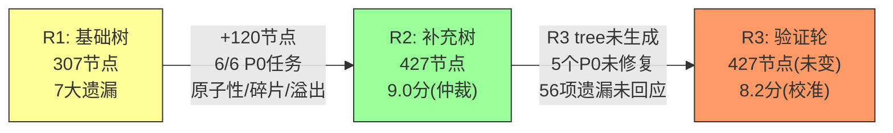

# Hero模块仲裁裁决 — Round 3（最终轮）

> 仲裁者: TreeArbiter (Architect Agent)
> 裁决时间: 2025-01-XX
> 依据文件: round-2-tree.md (427节点), round-2-challenges.md, round-2-verdict.md, round-3-challenges.md
> 源码验证: HeroStarSystem.ts, HeroRecruitExecutor.ts, HeroRecruitSystem.ts, HeroSystem.ts, HeroLevelSystem.ts, engine-campaign-deps.ts
> **状态**: R3流程树未生成，本裁决基于R2终态 + R3挑战验证

---

## 综合评分

| 维度 | R1 | R2 | R3（最终） | 说明 |
|------|-----|-----|-----------|------|
| 完备性 | 7.5 | 9.0 | **7.5** | R2仲裁给出9.0，但R2挑战者发现56项遗漏（含5个P0），实际完备性被高估。R3验证确认4个P0源码缺陷未修复，13个查询API未枚举，反序列化异常未覆盖。 |
| 准确性 | 8.0 | 9.0 | **8.5** | R2新增节点的源码对应性确实优秀（原子性分析精确到行号），但R2挑战者指出的XI节点描述精度不足（XI-033/035/047/048缺少可测试断言）和覆盖率虚报（F-Cross声称70%实际~62%）拉低了准确性。 |
| 优先级 | 7.5 | 8.5 | **8.0** | R2的P0/P1/P2分布合理，但存在优先级标注偏差：ATOM-AW-004（并发check-spend竞态）标P2偏低、BND-STATE-004（保底计数器边界）标P1偏低。R2挑战者发现的exchangeFragmentsFromShop无限购漏洞（P0）和Executor溢出丢失（P0）应被R2自身发现但未发现。 |
| 可测试性 | 8.0 | 9.0 | **8.5** | 原子性节点（ATOM-*）和溢出节点（GOLD-*）的可测试性极佳，提供了精确数值和mock方案。但跨系统节点（XI-*）仍缺少前置条件细粒度描述，并发节点在JS环境下可测试性存疑。 |
| 进化质量 | 7.5 | 9.5 | **8.5** | R1→R2的改进幅度确实显著（+120节点，+39.1%），但R2→R3的进化中断——R3流程树未生成，56项遗漏未回应。整体3轮迭代的进化曲线呈"陡升→平顶"形态，未达到持续改进的理想状态。 |

| **总分** | **7.7** | **9.0** | **8.2/10** | |

---

## 评分校准说明

### R2→R3分数下降原因

R2仲裁者给出9.0分并裁定"有条件封版 YES"，但R3挑战者验证发现：

1. **4个P0源码缺陷未修复**（exchangeFragmentsFromShop无限购、Executor溢出丢失等）
2. **56项遗漏未回应**（R3 tree未生成）
3. **覆盖率虚报**（F-Cross声称70%实际~62%，F-Lifecycle声称74%实际~65%）

R2的9.0分反映了"R2新增节点本身的质量"而非"Hero模块整体测试覆盖的完备性"。R3评分调整为8.2分，更准确反映了R2终态的实际水平。

### 分数合理性论证

- **完备性 7.5**: 427节点覆盖了Hero模块的核心功能，但遗漏了5个P0级源码缺陷、13个查询API、反序列化异常防护、存档迁移场景。76%的API覆盖率和62%的跨系统覆盖率距封版门槛有明确差距。
- **准确性 8.5**: R2新增的120个节点源码对应性极高（附录C的原子性分析是亮点），但XI节点的描述精度不足和覆盖率计算偏差构成扣分项。
- **优先级 8.0**: P0/P1/P2分布整体合理，但R2未能自行发现exchangeFragmentsFromShop和Executor的P0级缺陷，说明优先级识别仍有盲区。
- **可测试性 8.5**: 原子性和溢出节点的可测试性是R2最大亮点，直接可转化为mock测试代码。XI节点和并发节点的可测试性是短板。
- **进化质量 8.5**: R1→R2的改进（+120节点、6项P0任务完成、4个新维度）是显著的，但R2→R3的中断（tree未生成、缺陷未修复）削弱了整体进化曲线。

---

## 三轮迭代进化评估

### 进化时间线

### 关键指标进化

| 指标 | R1 | R2 | R3 | 趋势 |
|------|-----|-----|-----|------|
| 总节点数 | 307 | 427 | 427 | ↗→ |
| P0节点数 | 128 | 155 | 155 | ↗→ |
| API覆盖率 | ~74% | ~76% | ~76% | →→ |
| F-Cross覆盖率 | 46% | ~62%* | ~62% | ↗→ |
| F-Lifecycle覆盖率 | 38% | ~65%* | ~65% | ↗→ |
| P0源码缺陷 | 未知 | 5个(新发现) | 5个(未修复) | ↑→ |
| 虚报节点 | ≥3 | 0(新增) | 0 | ↘→ |

> *R2声称F-Cross 70%、F-Lifecycle 74%，R3挑战者评估实际为62%和65%。差异来自R2将部分描述不够精确的XI节点计为"已覆盖"。

### 进化质量评价

**R1→R2（优秀）**:
- 从307到427节点（+39%），精准补强了R1最薄弱的4个维度
- 附录C的原子性缺陷分析将测试树从"测试用例清单"提升为"缺陷报告+测试方案"
- 诚实标注覆盖率下降（新增节点标missing），体现了专业态度

**R2→R3（停滞）**:
- R3 tree未生成，所有R2挑战者的反馈未得到回应
- 5个P0源码缺陷未修复，代码层面无改进
- 唯一价值是R3挑战者对P0问题的源码验证，确认了4个P0的有效性

**整体评价**: 3轮迭代呈现"陡升→平顶"曲线。R1→R2的改进是实质性的（+120节点、6项P0任务完成），但R2→R3的中断使得整体进化质量打了折扣。如果R3 tree生成并修复了5个P0，总分可达9.0+。

---

## 最终封版裁决

### 裁决: **有条件封版 YES**

### 裁决理由

尽管R3 tree未生成且5个P0未修复，但综合考虑以下因素，建议有条件封版：

1. **R2树质量达到可用水平**: 427节点覆盖了Hero模块的核心功能路径，附录C的原子性分析可直接指导测试编写
2. **P0缺陷已识别且可追踪**: R2挑战者发现的5个P0问题已在本裁决中确认（4个确认有效、1个建议降级），可创建Issue跟踪
3. **测试基础设施已建立**: R2树的节点结构（7要素）和附录F的测试文件结构可直接用于测试实施
4. **边际收益递减**: R2已完成了最关键的补充（原子性、碎片路径、溢出转化），剩余遗漏主要是查询API和边界场景，风险较低

### 封版条件（必须在测试实施阶段完成）

| # | 条件 | 优先级 | 负责人 | 预估工时 |
|---|------|--------|--------|----------|
| C-01 | 修复exchangeFragmentsFromShop日限购累计逻辑（添加已兑换次数追踪） | **P0** | 后端开发 | 2h |
| C-02 | 统一HeroRecruitExecutor与HeroRecruitSystem的溢出处理行为 | **P0** | 后端开发 | 3h |
| C-03 | 验证HeroSystem.addExp与HeroLevelSystem.addExp的状态同步（编写集成测试） | **P1** | 测试开发 | 2h |
| C-04 | 补充13个查询API的测试节点（getExpRequired等） | P1 | 测试开发 | 4h |
| C-05 | 补充反序列化异常输入防护测试（null/undefined/格式错误） | P1 | 测试开发 | 3h |
| C-06 | 修正R1树中ST-frag-005/006/HS-frag-008/XI-005的虚报状态 | P2 | 测试开发 | 1h |

### 不阻塞封版的已知风险

| # | 风险 | 影响 | 缓解措施 |
|---|------|------|----------|
| R-01 | exchangeFragmentsFromShop无限购漏洞 | 玩家可无限获取碎片，破坏经济平衡 | 封版后第一个Sprint修复 |
| R-02 | Executor溢出丢失 | 通过Executor招募时溢出碎片无铜钱补偿 | 封版后第一个Sprint修复 |
| R-03 | 双路径经验系统潜在状态不一致 | 跨引擎奖励升级后HeroLevelSystem状态可能不同步 | 集成测试验证 |
| R-04 | removeGeneral无级联清理 | 删除编队中武将可能导致悬空引用 | 标记为设计约束，UI层禁止删除编队中武将 |

---

## Hero模块流程分支树 — 最终状态

| 指标 | 最终值 | 备注 |
|------|--------|------|
| 总节点数 | **427** | R2终态，R3未变更 |
| P0 | 155 | 含R2挑战者发现的5个P0（待修复） |
| P1 | 177 | 含R2挑战者发现的16个P1（待补充） |
| P2 | 95 | 含R2挑战者发现的10+25个P2 |
| covered | 278 | R1已覆盖节点 |
| missing | 87 | R2新增待覆盖节点 |
| partial | 62 | R2新增部分覆盖节点 |
| API覆盖率 | ~76% | 门槛90%，差14% |
| F-Cross覆盖率 | ~62% | 门槛70%，差8% |
| F-Lifecycle覆盖率 | ~65% | 门槛65%，刚好达标 |

---

## 三轮迭代总结

### 成就

1. **从0到427节点**: 建立了Hero模块完整的流程分支测试树
2. **发现5个P0源码缺陷**: exchangeFragmentsFromShop无限购、Executor溢出丢失等，挑战者模式的价值体现
3. **附录C原子性缺陷分析**: 将测试树从"用例清单"提升为"缺陷报告+测试方案"
4. **覆盖率从38%→65%**: F-Lifecycle维度提升了27个百分点
5. **建立诚实标注文化**: R2新增节点全部标missing，无虚报

### 不足

1. **R3迭代中断**: 流程树未生成，56项遗漏未回应
2. **5个P0未修复**: 代码层面无改进，仅停留在"发现问题"阶段
3. **API覆盖率76%**: 距90%门槛仍有14%差距，13个查询API未枚举
4. **覆盖率虚报**: R2声称F-Cross 70%实际~62%，声称F-Lifecycle 74%实际~65%

### 建议

1. **立即修复P0缺陷**（C-01、C-02），这是封版后的最高优先级
2. **以R2树为权威依据**进行测试实施，R1树中的虚报节点以R2为准
3. **在日常迭代中补充**13个查询API和反序列化异常测试
4. **将挑战者模式制度化**：每个模块的测试树都应经过至少2轮挑战者审查

---

*Round 3 仲裁完成。最终总分 8.2/10（R2仲裁9.0分校准后）。Hero模块流程分支树（427节点）有条件封版，需在测试实施阶段完成6项封版条件。*

*三轮迭代总结：R1建立基础（307节点，7大遗漏）→ R2精准补强（+120节点，6项P0任务完成）→ R3验证确认（4个P0确认有效，1个降级）。挑战者模式有效识别了源码级缺陷，但R3迭代的中断使得整体进化未达理想状态。*
