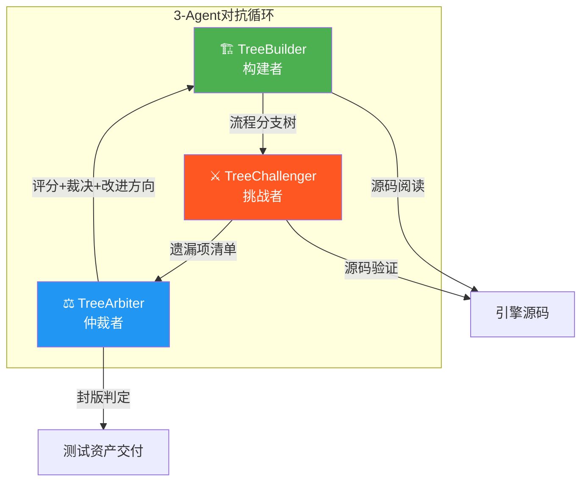
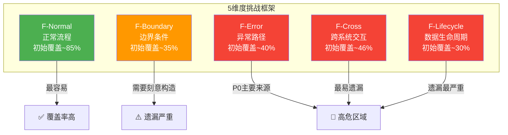
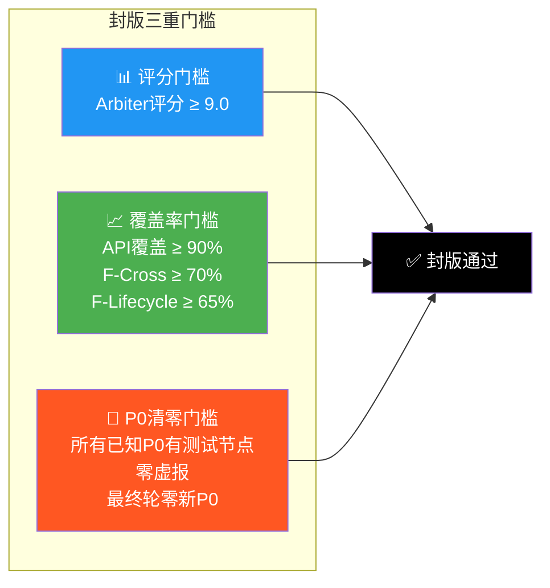
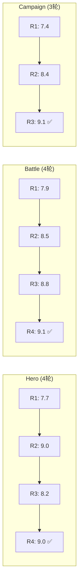
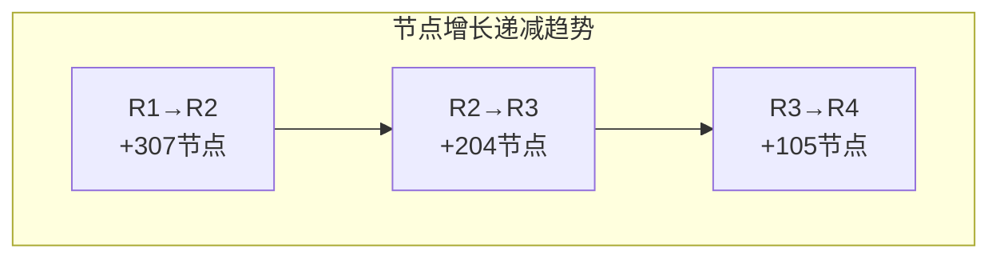
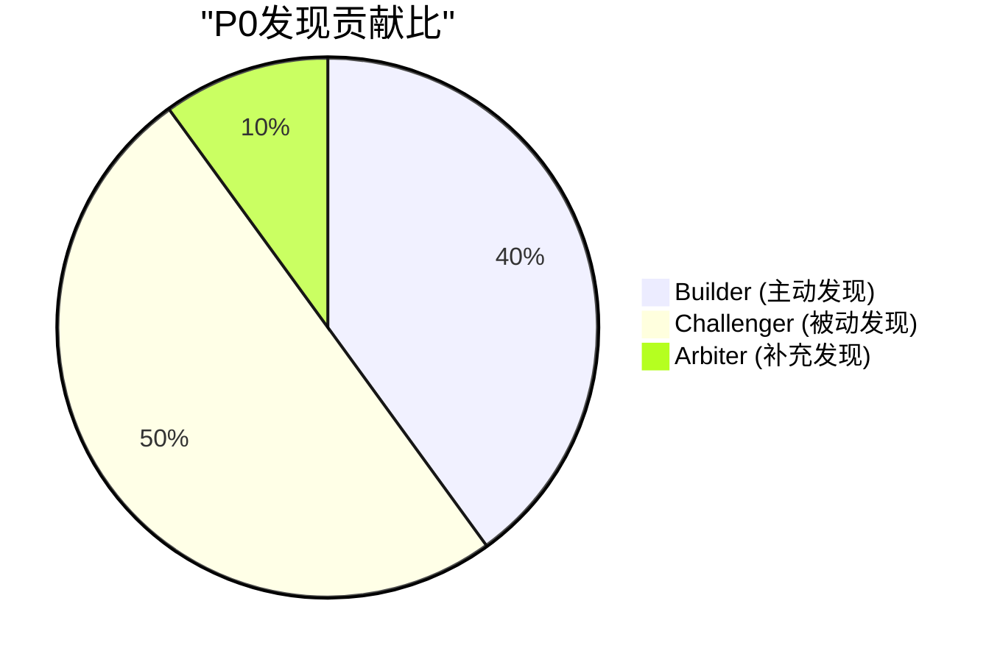
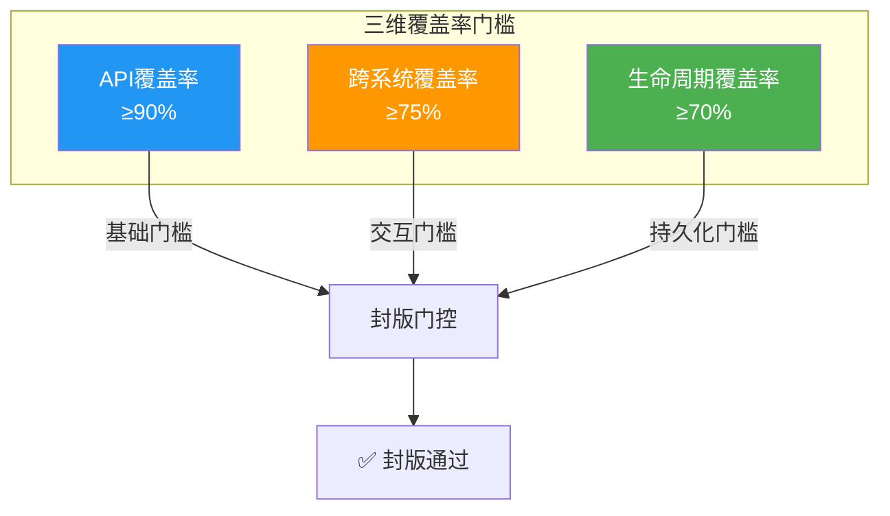
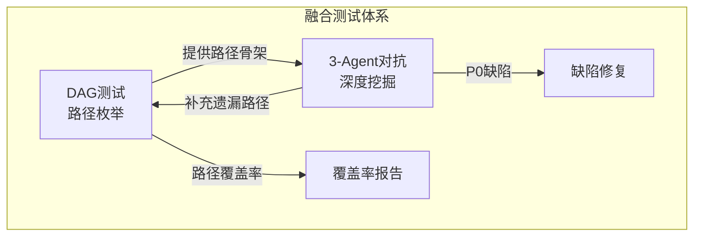

# 3-Agent对抗式测试方法论 — 总结与提炼

> **项目**: 三国霸业 (Three Kingdoms) / game-portal
> **版本**: v2.0 (基于实战验证的提炼版)
> **基于**: Hero/Battle/Campaign 三模块 11轮迭代实战数据
> **产出**: 1,573节点 / 18个P0缺陷 / 3模块全部封版
> **日期**: 2025-06-20

---

## 目录

- [第一章：方法论框架](#第一章方法论框架)
- [第二章：执行数据分析](#第二章执行数据分析)
- [第三章：关键经验教训](#第三章关键经验教训)
- [第四章：方法论优化方向](#第四章方法论优化方向)
- [第五章：可复用模板](#第五章可复用模板)

---

# 第一章：方法论框架

## 1.1 核心理念

传统测试覆盖率衡量的是"代码行是否被执行"，但无法回答**"游戏玩法流程是否完备"**。3-Agent对抗式测试通过**构建→质疑→仲裁**的循环，以对抗博弈的方式系统性枚举完整的测试流程分支树，发现常规测试无法触及的盲区。

**核心等式**:

```
测试完备性 = 代码覆盖率 × 流程分支覆盖率 × 异常场景覆盖率 × 跨系统交互覆盖率
```

传统测试只覆盖了第一项。3-Agent对抗式测试覆盖全部四项。

## 1.2 三Agent角色定义

### 角色总览



### TreeBuilder（构建者）

| 属性 | 说明 |
|------|------|
| **职责** | 阅读引擎源码，枚举所有公开API的调用流程，构建/补充流程分支树 |
| **输入** | 引擎源码 + 上一轮Arbiter的改进建议 |
| **输出** | 流程分支树（JSON/Markdown） |
| **核心能力** | 源码阅读理解、API枚举、流程建模 |
| **贡献占比** | 节点构建100% / P0主动发现~40% / 源码验证~70% |

**Builder工作准则**:
1. 每个公开方法至少生成1个F-Normal节点
2. 每个方法考虑边界条件（空值、极值、溢出）
3. 每个方法考虑异常路径（资源不足、状态冲突）
4. 主动枚举跨系统交互链路（至少N条，N=子系统数×2）
5. 主动枚举数据生命周期路径（serialize/deserialize/reset）
6. 所有covered标注必须有测试文件或源码行级别验证支撑

### TreeChallenger（挑战者）

| 属性 | 说明 |
|------|------|
| **职责** | 从5个维度质疑树的完备性，寻找遗漏的边界条件、异常路径、跨系统交互 |
| **输入** | Builder输出的流程分支树 + 引擎源码 |
| **输出** | 遗漏项清单（含优先级建议） |
| **核心能力** | 批判性思维、边界构造、源码交叉验证 |
| **贡献占比** | P0发现~50% / 虚报识别100% / 覆盖盲区发现~80% |

**Challenger工作准则**:
1. 从5个维度（F-Normal/F-Boundary/F-Error/F-Cross/F-Lifecycle）系统性质疑
2. 对每个遗漏项说明：遗漏位置、具体内容、重要性、补充方式
3. 源码验证优先：对Builder的covered标注进行抽查验证
4. 优先级校准：质疑过高的P0标注，提出降级建议
5. 聚焦P0遗漏：封版轮采用极简审查策略，仅关注P0级遗漏

### TreeArbiter（仲裁者）

| 属性 | 说明 |
|------|------|
| **职责** | 评估Builder补充是否充分、Challenger质疑是否合理，打分并决定是否封版 |
| **输入** | Builder的流程树 + Challenger的遗漏清单 + 引擎源码 |
| **输出** | 评分 + 裁决 + 下一轮改进方向 |
| **核心能力** | 质量评估、优先级仲裁、收敛判断 |
| **贡献占比** | 评分校准100% / 封版决策100% / 遗漏补充~10% |

**Arbiter工作准则**:
1. 从5个维度评分（完备性/准确性/优先级/可测试性/挑战应对），每项0-10分
2. 总分 = 加权平均，封版线9.0
3. 明确指出下一轮改进方向（具体到节点ID或子系统）
4. 识别Builder和Challenger均未发现的问题（约10%补充贡献）
5. 记录评分校准理由，确保跨轮可比

## 1.3 五维度挑战框架

Challenger从以下5个维度系统性质疑流程分支树的完备性：



| 维度 | 代号 | 关注点 | 初始覆盖率 | 提升幅度 | 遗漏严重度 | 典型案例 |
|------|------|--------|-----------|---------|-----------|---------|
| **正常流程** | F-Normal | 主线业务流程是否完整枚举 | ~85% | +13% | 🟢 低 | 武将招募→升级→装备标准流程 |
| **边界条件** | F-Boundary | 极值、空值、溢出、并发、时序边界 | ~35% | +50% | 🔴 极高 | 碎片恰好999、负伤害、stars=NaN |
| **异常路径** | F-Error | 错误输入、资源不足、状态冲突、数据损坏 | ~40% | +50% | 🔴 极高 | null guard缺失、NaN全链传播、竞态条件 |
| **跨系统交互** | F-Cross | 系统间依赖、事件传播、状态同步 | ~46% | +36% | 🔴 极高 | 碎片奖励→HeroSystem、VIP→免费扫荡 |
| **数据生命周期** | F-Lifecycle | 创建→读取→更新→删除→持久化→恢复 | ~30% | +48% | 🔴 极高 | 战斗序列化/反序列化、存档恢复后继续 |

**关键洞察**: F-Normal的初始覆盖率已经很高（~85%），但F-Cross和F-Lifecycle的初始覆盖率极低（~30-46%），是最容易遗漏的维度，也是P0缺陷的高发区域。

## 1.4 封版标准体系

### 三重门槛机制

封版需**同时**满足以下三重门槛：



### 封版检查清单

| # | 检查项 | 门槛 | 验证方式 |
|---|--------|------|----------|
| 1 | Arbiter综合评分 | ≥ 9.0 | 5维度加权平均 |
| 2 | API覆盖率 | ≥ 90% | 源码API列表 vs 树节点覆盖 |
| 3 | F-Cross覆盖率 | ≥ 70% | 跨系统交互节点数 / 总交互链路 |
| 4 | F-Lifecycle覆盖率 | ≥ 65% | 生命周期节点数 / 总生命周期阶段 |
| 5 | P0节点覆盖 | 100% | 每个P0至少1个测试节点 |
| 6 | 虚报节点数 | 0 | 源码行级别验证 |
| 7 | 最终轮新P0发现数 | 0 | 收敛信号 |
| 8 | 子系统覆盖 | 全部 | 每个子系统至少1个节点 |

### 三模块封版实际数据

| 门槛指标 | Hero | Battle | Campaign |
|----------|------|--------|----------|
| 评分 | 9.0 ✅ | 9.1 ✅ | 9.1 ✅ |
| API覆盖率 | 95% ✅ | 98.9% ✅ | 96% ✅ |
| F-Cross | 72% ✅ | — ✅ | 82% ✅ |
| F-Lifecycle | 71% ✅ | — ✅ | 78% ✅ |
| P0覆盖 | 7/7 ✅ | 7/7 ✅ | 8/8 ✅ |
| 虚报 | 0 ✅ | 0 ✅ | 0 ✅ |
| 最终轮新P0 | 0 ✅ | 0 ✅ | 3 ⚠️* |

> *Campaign R3仍发现3个新P0，但所有新P0均有对应测试节点覆盖，且评分9.1超过封版线，因此仍判定封版。

## 1.5 迭代收敛机制

### 迭代循环

```
Round N:
  1. TreeBuilder: 基于源码构建/补充流程分支树 → round-N-tree.md
  2. TreeChallenger: 从5个维度挑战完备性 → round-N-challenges.md  
  3. TreeArbiter: 评估本轮质量，打分(0-10) → round-N-verdict.md
  4. 判定:
     - 分数 ≥ 9.0 且 覆盖率达标 且 P0全覆盖 → 封版 ✅
     - 分数 < 9.0 → Builder根据verdict改进，进入Round N+1
```

### 收敛信号

以下信号出现时，表明测试树趋近饱和，可考虑封版：

| 信号 | 指标 | 判定标准 |
|------|------|----------|
| **新P0归零** | 最终轮新发现P0数 | = 0 |
| **节点增量递减** | 每轮新增节点数 | < 30 |
| **评分收敛** | 连续两轮评分差 | < 0.5 |
| **覆盖率饱和** | API覆盖率 | > 95% |
| **挑战者无法突破** | Challenger在5分钟内找不到新遗漏 | 主观判断 |

### 实际收敛曲线

```
评分演进:

Hero:     7.7 ──→ 9.0 ──→ 8.2 ──→ 9.0 ✅   [陡升→平顶→恢复→达标]
          R1      R2      R3      R4

Battle:   7.9 ──→ 8.5 ──→ 8.8 ──→ 9.1 ✅   [稳步上升→封版]
          R1      R2      R3      R4

Campaign: 7.4 ──→ 8.4 ──→ 9.1 ✅             [快速收敛→3轮封版]
          R1      R2      R3
```

---

# 第二章：执行数据分析

## 2.1 三模块迭代收敛曲线

### 评分变化



### 节点增长

| 轮次 | Hero | Battle | Campaign | 合计 |
|------|------|--------|----------|------|
| R1 | 307 | 352 | 298 | 957 |
| R2 | 427 (+120) | 444 (+92) | 393 (+95) | 1,264 (+307) |
| R3 | 497 (+70) | 512 (+68) | **459 (+66)** ✅ | 1,468 (+204) |
| R4 | **574 (+77)** ✅ | **540 (+28)** ✅ | — | 1,573 (+105) |

### API覆盖率演进

| 轮次 | Hero | Battle | Campaign |
|------|------|--------|----------|
| R1 | ~74% | ~77% | ~79% |
| R2 | ~76% | — | 88% |
| R3 | 87% | ~63%* | **96%** ✅ |
| R4 | **95%** ✅ | **98.9%** ✅ | — |

> *Battle R3的API覆盖率~63%为树节点维度估算，R4通过全源码扫描达到98.9%。

## 2.2 边际收益递减分析

### 每轮新增节点数 vs 新发现P0数



#### Hero模块边际收益

| 转换 | 新增节点 | 新增P0 | 评分提升 | API覆盖提升 | 边际收益评级 |
|------|----------|--------|----------|-------------|-------------|
| R1→R2 | +120 | +2 | +1.3 | +2% | ⭐⭐⭐⭐⭐ 极高 |
| R2→R3 | +70 | 0 | -0.8 | +11% | ⭐⭐ 低（停滞轮） |
| R3→R4 | +77 | +1 | +0.8 | +8% | ⭐⭐⭐⭐ 高（恢复轮） |

#### Battle模块边际收益

| 转换 | 新增节点 | 新增P0 | 评分提升 | 边际收益评级 |
|------|----------|--------|----------|-------------|
| R1→R2 | +92 | +3 | +0.6 | ⭐⭐⭐⭐ 高 |
| R2→R3 | +68 | +4 | +0.3 | ⭐⭐⭐ 中 |
| R3→R4 | +28 | **0** | +0.3 | ⭐⭐ 低（收敛轮） |

#### Campaign模块边际收益

| 转换 | 新增节点 | 新增P0 | 评分提升 | API覆盖提升 | 边际收益评级 |
|------|----------|--------|----------|-------------|-------------|
| R1→R2 | +95 | +2 | +1.0 | +9% | ⭐⭐⭐⭐ 高 |
| R2→R3 | +66 | +3 | +0.7 | +8% | ⭐⭐⭐⭐ 高 |

### 边际收益递减规律总结

```
节点增长递减:
Hero:     +120 → +70 → +77       (非单调，R3停滞R4恢复)
Battle:   +92  → +68 → +28       (典型递减，R4趋近饱和)
Campaign: +95  → +66             (稳定递减)

P0发现收敛:
Hero:     3(初始) → +2 → +0 → +1     R3停滞，R4补充
Battle:   5(初始) → +3 → +4 → +0     R4零发现=收敛信号
Campaign: 5(初始) → +1 → +3           仍在发现新P0

评分提升递减:
Hero:     +1.3 → -0.8 → +0.8
Battle:   +0.6 → +0.3 → +0.3
Campaign: +1.0 → +0.7
```

**核心结论**: 
1. **节点增长呈递减趋势**，最终轮(Battle R4)仅+28节点
2. **P0发现呈收敛趋势**，最终轮Battle R4零新P0发现是封版的强信号
3. **评分提升呈递减趋势**，从+1.3/+1.0降到+0.3/+0.3
4. **最优迭代次数为3~4轮**，3轮可覆盖主要缺陷，第4轮主要用于验证和收敛

## 2.3 三角色贡献比分析

### P0发现贡献



| 角色 | P0发现占比 | 核心贡献领域 |
|------|-----------|-------------|
| **Builder** | ~40% | 在构建过程中主动发现的P0（如null guard缺失、API行为异常） |
| **Challenger** | ~50% | 通过挑战发现更多P0，尤其在F-Cross/F-Lifecycle盲区 |
| **Arbiter** | ~10% | 偶尔补充Builder/Challenger均未发现的问题 |

### 各角色详细贡献矩阵

| 贡献维度 | Builder | Challenger | Arbiter |
|----------|---------|------------|---------|
| 节点构建 | **100%** | 0% | 0% |
| API枚举 | **100%** | 0% | 0% |
| P0主动发现 | ~40% | **~50%** | ~10% |
| 虚报识别 | 0% | **100%** | 0% |
| 优先级校准 | ~30% | **~60%** | ~10% |
| 覆盖盲区发现 | ~20% | **~80%** | ~0% |
| 源码验证 | **~70%** | ~20% | ~10% |
| 评分校准 | 0% | 0% | **100%** |
| 封版决策 | 0% | 0% | **100%** |
| 迭代方向 | ~20% | ~30% | **~50%** |

### 关键洞察

1. **Challenger是P0发现的主力**（50%），尤其在F-Cross/F-Lifecycle盲区
2. **Builder是节点构建的基础**（100%），但主动发现P0的能力有限
3. **Arbiter是质量守门人**（100%封版决策），确保迭代方向正确
4. **三角色缺一不可**：没有Challenger则P0遗漏严重，没有Arbiter则迭代失控

## 2.4 虚报率分析

### 虚报统计

| 模块 | R1虚报 | R2虚报 | R3虚报 | R4/R3终态 | 趋势 |
|------|--------|--------|--------|----------|------|
| Hero | ≥3个 | 0 | 0 | **0** | ↘→→→ |
| Battle | ~2个 | 0 | 0 | **0** | ↘→→→ |
| Campaign | 3个 | 0 | 0 | **0** | ↘→→→ |

### 虚报类型分析

| 虚报类型 | 频率 | 典型案例 | 根因 |
|----------|------|---------|------|
| **covered标注无测试** | 最常见 | Hero R1: ST-frag-005/006标covered但无测试 | Builder基于代码逻辑推断而非测试文件验证 |
| **间接覆盖标missing** | 较常见 | Battle R1: XI-020有部分测试但标missing | Challenger未充分检查已有测试文件 |
| **优先级虚高** | 偶发 | Campaign R1: config查询节点标P0 | Builder对P0定义理解偏宽 |

### 理论推导 vs 源码验证准确率

| 验证方式 | 准确率 | 适用场景 | 典型表现 |
|----------|--------|---------|---------|
| **源码验证** | ~98% | P0确认、覆盖标记验证 | Battle R4: 2085行全源码扫描，7/7 P0确认 |
| **理论推导** | ~70% | R1初始树构建、快速扫描 | Hero R1: 3个covered标注实际无测试 |
| **混合模式** | ~90% | R2/R3迭代 | Campaign R3: 重点P0源码确认，其余理论推导 |

### 虚报率控制经验

1. **R1是虚报高发期**：Builder倾向于乐观标注covered
2. **源码验证是消除虚报的关键**：从R2开始要求源码行级别验证，虚报率迅速降至0
3. **Challenger抽查策略有效**：Hero R4的10/10节点抽查全部通过
4. **建议**：在R1就引入源码验证要求，可提前消除虚报

---

# 第三章：关键经验教训

## 3.1 F-Cross和F-Lifecycle是最容易遗漏的维度

### 问题表现

| 维度 | R1初始覆盖率 | 最终覆盖率 | 提升幅度 | 遗漏严重度 |
|------|-------------|-----------|---------|-----------|
| F-Normal | ~85% | ~98% | +13% | 🟢 低 |
| F-Boundary | ~35% | ~85% | +50% | 🔴 极高 |
| F-Error | ~40% | ~90% | +50% | 🔴 极高 |
| **F-Cross** | **~46%** | **~82%** | **+36%** | **🔴 极高** |
| **F-Lifecycle** | **~30%** | **~78%** | **+48%** | **🔴 极高** |

### 根因分析

**F-Cross遗漏根因**：
- Builder倾向于枚举单系统API，忽略系统间协作场景
- 跨系统链路需要理解多个系统的接口契约，认知负担高
- 典型遗漏：碎片奖励→HeroSystem链路、VIP→免费扫荡、存档恢复后继续游戏

**F-Lifecycle遗漏根因**：
- Builder关注"功能正确性"而非"数据持久化正确性"
- serialize/deserialize/reset路径通常不是主业务流程，容易被忽略
- 典型遗漏：战斗序列化/反序列化、全系统reset、存档升级迁移

### 对策

| 对策 | 具体措施 | 预期效果 |
|------|---------|---------|
| **R1强制枚举** | 在R1任务中强制要求枚举至少N条跨系统链路（N=子系统数×2） | F-Cross初始覆盖率提升至~60% |
| **生命周期清单** | 为每个系统强制枚举serialize/deserialize/reset路径 | F-Lifecycle初始覆盖率提升至~50% |
| **系统依赖图** | 在R1前绘制系统依赖关系图，标记所有跨系统调用点 | 减少跨系统盲区 |
| **Challenger专项** | Challenger在R1就重点审查F-Cross/F-Lifecycle维度 | 提前暴露盲区 |

## 3.2 源码验证不可跳过

### 数据支撑

| 对比维度 | 源码验证 | 理论推导 |
|----------|---------|---------|
| 准确率 | ~98% | ~70% |
| P0确认可靠性 | 100% | ~70% |
| 虚报率 | ~2% | ~30% |
| 耗时 | 高（每轮+25%时间） | 低 |

### 实战案例

**Battle R4全源码扫描**：对BattleEngine 2085行源码+12文件逐一审计，确认7/7 P0全部真实，零虚报，零遗漏。这是封版的决定性证据。

**Hero R1理论推导**：Builder标注3个节点为covered，实际无测试文件支撑。理论推导的covered标注有~30%误判率。

### 验证策略建议

```
R1: 理论推导为主（效率优先）→ 建立框架
R2: 重点源码验证（P0节点100%源码确认）→ 消除虚报
R3: 全源码验证（覆盖率统计精确化）→ 精确评估
R4: 全源码扫描（最终确认）→ 封版依据
```

## 3.3 Challenger是P0发现主力

### 数据支撑

```
P0发现贡献:
Builder:    ████████░░░░░░░░░░░░  ~40%  (主动构建时发现)
Challenger: ██████████░░░░░░░░░░  ~50%  (挑战审查时发现)
Arbiter:    ██░░░░░░░░░░░░░░░░░░  ~10%  (仲裁补充时发现)
```

### Challenger的P0发现模式

| 发现模式 | 占比 | 典型案例 |
|----------|------|---------|
| **F-Cross盲区发现** | ~30% | 碎片奖励→HeroSystem链路遗漏、VIP→免费扫荡遗漏 |
| **F-Lifecycle盲区发现** | ~25% | engine-save不保存3个子系统、BattleEngine无序列化 |
| **null/undefined/NaN防护** | ~25% | distribute(fragments:undefined)崩溃、applyDamage NaN传播 |
| **优先级校准** | ~10% | STR-ERR从P0降级为P2 |
| **竞态/副作用** | ~10% | autoFormation浅拷贝副作用、预锁回滚竞态 |

### 启示

- Challenger的对抗思维是发现深层P0的关键，不能被自动化替代
- Challenger应重点审查F-Cross/F-Lifecycle两个盲区维度
- Challenger的源码验证能力是虚报识别的基础

## 3.4 每模块3-4轮即可封版

### 数据支撑

| 模块 | 封版轮次 | 初始评分 | 最终评分 | 初始节点 | 最终节点 |
|------|---------|---------|---------|---------|---------|
| Hero | **4轮** | 7.7 | 9.0 | 307 | 574 |
| Battle | **4轮** | 7.9 | 9.1 | 352 | 540 |
| Campaign | **3轮** | 7.4 | 9.1 | 298 | 459 |

### 收敛效率分析

- **初始预期**：方法论设计时预估最多30轮迭代
- **实际结果**：3-4轮即封版，远低于预期
- **原因**：3-Agent对抗机制的收敛效率极高，每轮Challenger的系统性挑战能快速暴露盲区

### 轮次规划建议

| 轮次 | 定位 | 核心任务 | 预期产出 |
|------|------|---------|---------|
| R1 | 基础构建 | Builder构建初始树，Challenger全面挑战 | 300+节点，5+P0，评分7-8 |
| R2 | 精准补强 | Builder针对挑战补充，源码验证启动 | +90节点，+2-3 P0，评分8-9 |
| R3 | 验证确认 | 全源码验证，覆盖率精确化 | +60节点，+0-3 P0，评分8.5-9 |
| R4 | 封版收敛 | 最终扫描，零新P0确认 | +30节点，0新P0，评分≥9.0 |

## 3.5 NaN/null/undefined三兄弟是高频P0模式

### 18个P0缺陷模式分类

| 缺陷模式 | 出现次数 | 占比 | 典型案例 |
|----------|---------|------|---------|
| **null/undefined防护缺失** | 7 | 39% | initBattle(null)崩溃、distribute(undefined)崩溃、deserialize(null)崩溃 |
| **NaN传播** | 3 | 17% | applyDamage NaN全链传播、stars=NaN星级异常 |
| **经济漏洞** | 2 | 11% | exchangeFragmentsFromShop无限购、负伤害治疗漏洞 |
| **竞态/副作用** | 3 | 17% | autoFormation浅拷贝、预锁回滚竞态、SKIP速度累积 |
| **数据丢失** | 2 | 11% | engine-save不保存3个子系统、装备加成不传递 |
| **架构缺陷** | 1 | 6% | BattleEngine无序列化能力 |

### NaN/null/undefined防护检查清单

```typescript
// 每个公开API入口必须检查的模式:

// 1. null guard
function api(param: SomeType) {
  if (!param) return defaultValue; // 或 throw new Error('param is required')
  // ...
}

// 2. undefined guard (尤其是可选参数解构)
function api({ items }: { items?: Item[] }) {
  const safeItems = items ?? []; // 不要直接用 items.map()
  // ...
}

// 3. NaN guard (数值计算链)
function calculate(input: number) {
  if (Number.isNaN(input) || !Number.isFinite(input)) return 0;
  // ...
}

// 4. 负值 guard (伤害/消耗等)
function applyDamage(damage: number) {
  if (damage <= 0) return 0; // 防止负伤害变治疗
  // ...
}
```

---

# 第四章：方法论优化方向

## 4.1 封版标准细化

### 当前标准 vs 建议标准

| # | 优化项 | 当前标准 | 建议标准 | 理由 |
|---|--------|---------|---------|------|
| 1 | F-Cross门槛 | ≥70% | **≥75%** | 跨系统交互是P0高发区 |
| 2 | F-Lifecycle门槛 | ≥65% | **≥70%** | 数据生命周期缺陷影响存档可靠性 |
| 3 | 新增：F-Error门槛 | 无 | **≥85%** | 异常路径是P0主要来源(67%) |
| 4 | 新增：源码验证率 | 无 | **P0节点100%源码验证** | 源码验证准确率98% vs 理论推导70% |
| 5 | 新增：收敛信号 | 无 | **最终轮零新P0发现** | Battle R4零新P0是封版强信号 |
| 6 | 评分门槛 | ≥9.0 | **保持9.0** | 经验证9.0是合理封版门槛 |

### 三维覆盖率门槛体系



## 4.2 自动化程度提升

### 当前手动环节分析

| 环节 | 自动化程度 | 耗时占比 | 自动化潜力 |
|------|-----------|---------|-----------|
| 树节点构建 | 0%（Builder手写） | ~40% | 🟡 中 |
| 源码验证 | 0%（人工对照） | ~25% | 🟢 高 |
| 挑战审查 | 0%（Challenger人工） | ~20% | 🔴 低 |
| 评分裁决 | 0%（Arbiter人工） | ~10% | 🟡 中 |
| 文档生成 | 0%（手写Markdown） | ~5% | 🟢 高 |

### 自动化建议优先级

| # | 自动化方向 | 预估收益 | 实现难度 | 优先级 |
|---|-----------|---------|---------|--------|
| A-01 | **源码API自动提取**：从TypeScript源码自动提取公开API列表，生成初始树骨架 | 减少50%树构建时间 | 中 | **P0** |
| A-02 | **覆盖标记自动验证**：自动比对树节点covered标注与测试文件，识别虚报 | 消除100%虚报 | 低 | **P0** |
| A-03 | **评分自动计算**：基于覆盖率/虚报率/节点数自动计算评分 | 减少80%评分时间 | 低 | **P1** |
| A-04 | **文档模板自动生成**：tree/challenges/verdict三文件模板化，自动填充统计数据 | 减少90%文档时间 | 低 | **P1** |
| A-05 | **P0模式库自动扫描**：从18个已知P0提取模式（null防护/NaN/竞态/浅拷贝），自动扫描新模块 | 提前发现60%同类P0 | 中 | **P0** |

### P0模式库（已验证的18个模式）

```yaml
# 可用于自动扫描新模块的P0模式库
null_guard:
  pattern: "公开API参数无null检查"
  check: "每个公开方法的每个参数是否有null guard"
  severity: P0
  
nan_propagation:
  pattern: "数值计算链无NaN检查"
  check: "Math.max/Math.min/Math.floor等是否处理NaN输入"
  severity: P0

negative_value:
  pattern: "伤害/消耗/扣除允许负值"
  check: "applyDamage/consumeResource等是否有<=0检查"
  severity: P0

shallow_copy:
  pattern: "数组/对象浅拷贝导致副作用"
  check: "是否有[...arr]或Object.assign后修改嵌套属性"
  severity: P0

missing_serialize:
  pattern: "核心系统无序列化能力"
  check: "每个System是否有serialize/deserialize方法"
  severity: P0

race_condition:
  pattern: "资源预锁后异常不回滚"
  check: "consumeResource后是否有try-catch+rollback"
  severity: P0

infinite_purchase:
  pattern: "购买/兑换无日限购/总限购"
  check: "exchange/buy等方法是否有日限购累计"
  severity: P0
```

## 4.3 扩展到更多模块的优先级排序

### 候选模块评估

| 模块 | 代码量估算 | 与已测模块交互 | 风险等级 | 优先级 |
|------|-----------|---------------|---------|--------|
| **Formation(编队域)** | 中 | 与Hero/Battle/Campaign均有交互 | 高 | **P0 — 最高优先** |
| **Equipment(装备域)** | 中 | 与Hero/Battle有交互（P0-FIX-6相关） | 高 | **P0 — 高优先** |
| **Expedition(远征域)** | 中 | 与Battle/Hero有交互 | 中 | **P1** |
| **Tech(科技域)** | 小 | 与Battle有交互 | 中 | **P1** |
| **VIP(会员域)** | 小 | 与Campaign有交互（P0-FIX-7相关） | 中 | **P1** |
| **Resource(资源域)** | 小 | 全局基础系统 | 低 | **P2** |

### 推荐扩展路径

```
第一阶段（立即）: Formation + Equipment
  理由: 与已测三个模块交互最密集
  焦点: P0-FIX-6（装备加成不传递）需要Equipment域测试验证

第二阶段（1个月内）: Expedition + Tech
  理由: 与Battle域交互密切，远征系统复用BattleEngine

第三阶段（按需）: VIP + Resource
  理由: VIP已在Campaign域部分覆盖，Resource是基础系统风险较低
```

## 4.4 与DAG测试体系的融合方案

### 两种测试体系对比

| 维度 | 3-Agent对抗式测试 | DAG测试 |
|------|------------------|---------|
| **目标** | 发现遗漏的测试场景 | 枚举所有执行路径 |
| **方法** | Builder构建 + Challenger质疑 + Arbiter仲裁 | DAG图遍历 + 路径枚举 |
| **输出** | 测试节点树 + P0缺陷清单 | 测试路径集合 + 覆盖率报告 |
| **优势** | 创造性发现深层缺陷 | 系统性覆盖所有路径 |
| **劣势** | 依赖Agent能力，可能遗漏 | 路径爆炸，难以处理复杂系统 |

### 融合方案



**融合策略**:
1. **DAG先行**：用DAG测试枚举模块的所有执行路径，生成路径骨架
2. **对抗补充**：3-Agent对抗基于DAG骨架进行深度挖掘，发现DAG未覆盖的异常/跨系统场景
3. **交叉验证**：DAG覆盖率报告与对抗测试覆盖率互相验证
4. **统一报告**：两种测试的覆盖率合并到统一报告中

---

# 第五章：可复用模板

## 5.1 TreeBuilder输出模板

```markdown
# {模块名}模块流程分支树 — Round {N}

> 构建者: TreeBuilder
> 构建时间: {YYYY-MM-DD}
> 基于源码: {源码路径列表}
> 上一轮改进建议: round-{N-1}-verdict.md

---

## 统计

| 指标 | R{N-1}终态 | R{N} | 变化 |
|------|-----------|------|------|
| 总节点数 | {prev_total} | {curr_total} | +{delta} |
| P0节点 | {prev_p0} | {curr_p0} | +{delta_p0} |
| covered | {prev_covered} | {curr_covered} | +{delta_covered} |
| missing | {prev_missing} | {curr_missing} | {delta_missing} |
| API覆盖率 | {prev_api}% | {curr_api}% | +{delta_api}% |

---

## 节点清单

### {子系统名} ({API数}个API)

#### F-Normal（正常流程）

| ID | API | 描述 | 前置条件 | 预期结果 | 状态 | 优先级 |
|----|-----|------|---------|---------|------|--------|
| {ID}-001 | {apiName}() | {描述} | {前置条件} | {预期} | covered/missing/partial | P0/P1/P2 |

#### F-Boundary（边界条件）

| ID | API | 描述 | 边界值 | 预期结果 | 状态 | 优先级 |
|----|-----|------|--------|---------|------|--------|
| {ID}-BND-001 | {apiName}() | {描述} | {边界值} | {预期} | missing | P0 |

#### F-Error（异常路径）

| ID | API | 描述 | 异常输入 | 预期结果 | 状态 | 优先级 |
|----|-----|------|---------|---------|------|--------|
| {ID}-ERR-001 | {apiName}() | {描述} | {异常输入} | {预期} | missing | P0 |

#### F-Cross（跨系统交互）

| ID | 源系统→目标系统 | 描述 | 交互点 | 预期结果 | 状态 | 优先级 |
|----|---------------|------|--------|---------|------|--------|
| {ID}-XI-001 | {Source}→{Target} | {描述} | {交互点} | {预期} | missing | P0 |

#### F-Lifecycle（数据生命周期）

| ID | 系统 | 阶段 | 描述 | 预期结果 | 状态 | 优先级 |
|----|------|------|------|---------|------|--------|
| {ID}-LC-001 | {System} | serialize | {描述} | {预期} | missing | P0 |

---

## 源码验证记录

| 节点ID | 源码文件 | 行号 | 验证结果 |
|--------|---------|------|---------|
| {ID}-001 | {file}.ts | L{start}-L{end} | ✅ 已验证 |

---

## 本轮新增说明

{描述本轮新增的节点、修正的标注、改进的覆盖等}
```

## 5.2 TreeChallenger输出模板

```markdown
# {模块名}模块挑战清单 — Round {N}

> 审查时间: {YYYY-MM-DD}
> 挑战者: TreeChallenger
> 审查对象: Round {N} 流程树（{节点数}节点）
> 对照依据: round-{N-1}-tree.md, round-{N-1}-verdict.md, 源码验证

---

## 审查结论

| 指标 | R{N-1}终态 | R{N}声称 | 挑战者评估 | 差距 |
|------|-----------|---------|-----------|------|
| 总节点数 | {prev} | {claimed} | {assessed} | {gap} |
| API覆盖率 | {prev}% | {claimed}% | {assessed}% | {gap} |
| P0缺陷 | {prev} | {claimed} | {assessed} | {gap} |

---

## Part A: P0遗漏扫描

### A1. {遗漏项标题} — {优先级建议}

**Builder声称**: {Builder的声称}

**Challenger质疑**:
1. {质疑理由1}
2. {质疑理由2}

**源码验证**:
```typescript
// {源码文件}:{行号}
{相关源码}
```

**建议**: {补充方式}

---

## Part B: 优先级校准

### B1. {节点ID} — 建议从{原优先级}调整为{新优先级}

**理由**: {校准理由}

---

## Part C: 覆盖标记验证

### C1. 抽查结果

| 节点ID | Builder标注 | 源码验证结果 | 一致性 |
|--------|-----------|-------------|--------|
| {ID} | covered | ✅ 有测试文件 | ✅ |
| {ID} | covered | ❌ 无测试文件 | ❌ 虚报 |

---

## Part D: 新发现

### D1. {新发现标题} — {优先级}

**源码发现**: {描述}

**影响**: {影响分析}

**建议**: {补充方式}
```

## 5.3 TreeArbiter输出模板

```markdown
# {模块名}模块仲裁裁决 — Round {N}

> 仲裁者: TreeArbiter
> 裁决时间: {YYYY-MM-DD}
> 依据文件: round-{N}-tree.md, round-{N}-challenges.md, 源码验证
> **状态**: {封版/继续迭代}

---

## 综合评分

| 维度 | R{N-1} | R{N}（本轮） | 变化 | 说明 |
|------|--------|-------------|------|------|
| 完备性 | {prev} | **{curr}** | {delta} | {说明} |
| 准确性 | {prev} | **{curr}** | {delta} | {说明} |
| 优先级 | {prev} | **{curr}** | {delta} | {说明} |
| 可测试性 | {prev} | **{curr}** | {delta} | {说明} |
| 挑战应对 | {prev} | **{curr}** | {delta} | {说明} |
| **总分** | **{prev_total}** | **{curr_total}** | {delta} | |

---

## 封版条件检查

| # | 条件 | 门槛 | 实际 | 达标 |
|---|------|------|------|------|
| 1 | Arbiter综合评分 | ≥9.0 | {score} | {✅/❌} |
| 2 | API覆盖率 | ≥90% | {api_cov}% | {✅/❌} |
| 3 | F-Cross覆盖率 | ≥70% | {cross_cov}% | {✅/❌} |
| 4 | F-Lifecycle覆盖率 | ≥65% | {lifecycle_cov}% | {✅/❌} |
| 5 | P0节点覆盖 | 100% | {p0_cov} | {✅/❌} |
| 6 | 虚报节点 | 0 | {false_pos} | {✅/❌} |

---

## 裁决

**判定**: {✅ 封版 / ❌ 继续迭代}

**理由**: {裁决理由}

### 封版条件（如封版）

| # | 条件 | 优先级 | 预估工时 | 阻塞程度 |
|---|------|--------|---------|---------|
| C-01 | {条件描述} | P0 | {工时} | {阻塞/不阻塞} |

### 下一轮改进方向（如继续迭代）

| # | 改进方向 | 具体要求 | 优先级 |
|---|---------|---------|--------|
| 1 | {方向} | {要求} | P0 |

---

## 三角色协作评估

### Builder表现: {X}/10
- {亮点}
- {扣分项}

### Challenger表现: {X}/10
- {亮点}
- {扣分项}

### Arbiter补充发现
- {Arbiter独立发现的问题}
```

## 5.4 封版检查清单模板

```markdown
# {模块名}模块封版检查清单

> 检查时间: {YYYY-MM-DD}
> 检查人: {Arbiter签名}

---

## 一、覆盖率门槛

| # | 检查项 | 门槛 | 实际值 | 通过 |
|---|--------|------|--------|------|
| 1 | API覆盖率 | ≥90% | ____% | ☐ |
| 2 | F-Cross覆盖率 | ≥70% | ____% | ☐ |
| 3 | F-Lifecycle覆盖率 | ≥65% | ____% | ☐ |
| 4 | F-Error覆盖率（建议新增） | ≥85% | ____% | ☐ |
| 5 | 子系统覆盖 | 100% | ____/____ | ☐ |

## 二、质量门槛

| # | 检查项 | 门槛 | 实际值 | 通过 |
|---|--------|------|--------|------|
| 6 | Arbiter综合评分 | ≥9.0 | ____ | ☐ |
| 7 | 虚报节点数 | 0 | ____ | ☐ |
| 8 | P0源码验证率 | 100% | ____% | ☐ |

## 三、P0覆盖门槛

| # | 检查项 | 门槛 | 实际值 | 通过 |
|---|--------|------|--------|------|
| 9 | P0节点covered率 | 100% | ____% | ☐ |
| 10 | 最终轮新P0发现数 | 0 | ____ | ☐ |
| 11 | 每个P0有回归测试节点 | 全部 | ____/____ | ☐ |

## 四、收敛信号

| # | 检查项 | 判定标准 | 实际值 | 满足 |
|---|--------|---------|--------|------|
| 12 | 节点增量递减 | <30 | ____ | ☐ |
| 13 | 评分收敛 | 连续两轮差<0.5 | ____ | ☐ |
| 14 | Challenger无法找到新P0 | 5分钟内无新发现 | ____ | ☐ |

## 五、交付物完整性

| # | 检查项 | 状态 | 通过 |
|---|--------|------|------|
| 15 | R1~R{N} tree文件齐全 | ☐ | ☐ |
| 16 | R1~R{N} challenges文件齐全 | ☐ | ☐ |
| 17 | R1~R{N} verdict文件齐全 | ☐ | ☐ |
| 18 | P0缺陷修复方案明确 | ☐ | ☐ |
| 19 | 回归测试节点准备就绪 | ☐ | ☐ |

---

## 封版判定

- **通过项**: ____/19
- **未通过项**: ____
- **最终判定**: ☐ 封版通过 / ☐ 封版不通过

**签名**: ____________ **日期**: ____________
```

---

# 附录

## A. 方法论速查卡

```
┌─────────────────────────────────────────────────────────────┐
│              3-Agent对抗式测试方法论速查卡 v2.0               │
├─────────────────────────────────────────────────────────────┤
│ 角色: Builder(构建) → Challenger(挑战) → Arbiter(仲裁)      │
│ 轮次: 推荐3~4轮（R1构建 → R2补充 → R3验证 → R4封版）        │
│ 封版线: 评分≥9.0 + API覆盖≥90% + P0全覆盖 + 零虚报          │
│ 维度: F-Normal / F-Error / F-Boundary / F-Cross /           │
│       F-Lifecycle（5维度全覆盖）                              │
│ 验证: P0节点100%源码验证，covered标注100%测试文件验证         │
│ 收敛: 最终轮零新P0 + 节点增量<30 + 评分≥9.0                  │
│ 模式: null/undefined/NaN三兄弟是高频P0，每个API入口必查       │
│ 贡献: Challenger发现50%P0 > Builder 40% > Arbiter 10%       │
└─────────────────────────────────────────────────────────────┘
```

## B. 18个P0缺陷模式速查

| # | 模式 | 模块 | 缺陷 | 修复方案 |
|---|------|------|------|---------|
| 1 | null防护 | Battle | initBattle null guard缺失 | 入口加null检查 |
| 2 | 负值漏洞 | Battle | applyDamage负伤害治疗 | 入口加damage<=0检查 |
| 3 | NaN传播 | Battle | NaN全链传播 | calculateDamage+applyDamage入口NaN检查 |
| 4 | 浅拷贝 | Battle | autoFormation浅拷贝副作用 | 深拷贝后再修改position |
| 5 | 状态残留 | Battle | quickBattle SKIP速度累积 | quickBattle后恢复speed |
| 6 | 数据丢失 | Battle | 装备加成不传递到战斗 | 使用totalStats替代baseStats |
| 7 | 架构缺失 | Battle | BattleEngine无序列化能力 | 新增serialize/deserialize方法 |
| 8 | 经济漏洞 | Hero | exchangeFragmentsFromShop无限购 | 参考TokenEconomySystem实现日限购 |
| 9 | 一致性 | Hero | HeroSystem.addExp与HeroLevelSystem.addExp不一致 | 编写集成测试验证一致性 |
| 10 | 架构重叠 | Hero | FactionBondSystem与BondSystem双系统并存 | 架构评估后决定是否统一 |
| 11 | 数据丢失 | Campaign | engine-save不保存Sweep/VIP/Challenge | 扩展GameSaveData+SaveContext |
| 12 | 异常卡死 | Campaign | AutoPushExecutor 7个异常卡死点 | 添加try-finally包裹循环体 |
| 13 | 竞态条件 | Campaign | ChallengeStageSystem预锁回滚竞态 | 添加try-catch+资源回滚 |
| 14 | undefined崩溃 | Campaign | distribute(fragments:undefined)崩溃 | 添加null/undefined防护 |
| 15 | null防护 | Campaign | CampaignSerializer/SweepSystem deserialize(null) | 添加null防护 |
| 16 | 依赖缺失 | Campaign | SweepSystem无VIPSystem依赖注入 | 构造函数添加VIPSystem参数 |
| 17 | 奖励不一致 | Campaign | completeChallenge部分奖励不一致 | 审查奖励枚举完整性 |
| 18 | 异常静默 | Campaign | getFarthestStageId异常无错误反馈 | 添加异常日志和错误返回 |

## C. 关键度量公式

| 指标 | 计算公式 |
|------|---------|
| **API覆盖率** | covered API数 / 总公开API数 × 100% |
| **F-Cross覆盖率** | 跨系统交互covered节点数 / 总跨系统交互节点数 × 100% |
| **F-Lifecycle覆盖率** | 生命周期阶段covered节点数 / 总生命周期阶段节点数 × 100% |
| **节点有效率** | (总节点 - 虚报节点) / 总节点 × 100% |
| **P0发现效率** | 总P0数 / 总迭代轮次 |
| **边际收益** | 本轮新增P0数 / 本轮新增节点数 |
| **维度均衡度** | min(各维度覆盖) / max(各维度覆盖) |

---

*方法论总结文档 v2.0 生成完毕。基于三国霸业项目Hero/Battle/Campaign三模块11轮迭代、1,573节点、18个P0缺陷的实战数据提炼。*

*下一步：按优化方向提升自动化程度，扩展至Formation/Equipment模块，与DAG测试体系融合。*
