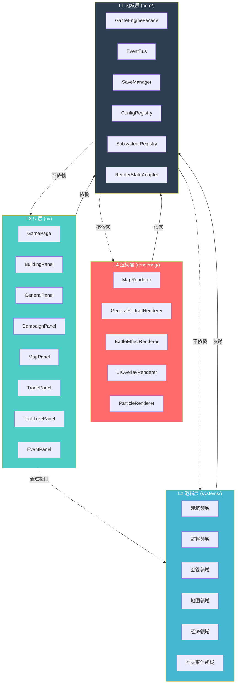
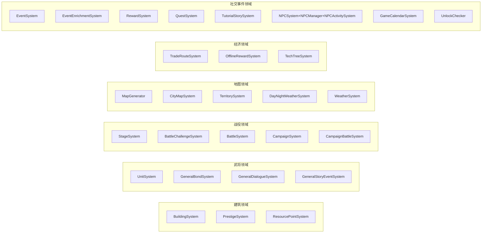

# 三国霸业4层架构调整方案

> **版本**: v1.0 | **日期**: 2025-07-09 | **状态**: 待评审
> **目标**: 将39个TS文件、35,000+行代码重构为4层解耦架构，单文件<500行

---

## 一、架构总览

### 1.1 分层架构图



### 1.2 层间依赖规则

| 规则 | 说明 |
|------|------|
| L1 不依赖任何上层 | 内核完全自包含，仅导出接口和基础设施 |
| L2 → L1 | 子系统通过 EventBus 通信，通过 ConfigRegistry 读取配置 |
| L3 → L1 | UI 通过 GameEngineFacade 访问状态 |
| L3 → L2 (接口) | UI 通过 `ISystemXxx` 接口调用子系统，便于 Mock |
| L4 → L1 | 渲染器通过 RenderStateAdapter 获取渲染状态 |
| **禁止** L2↔L3, L2↔L4, L3↔L4 | 层间不允许直接耦合 |

### 1.3 核心交互协议（TypeScript 接口）

```typescript
// ===== L1: 事件总线 =====
interface IEventBus {
  on<T>(event: string, handler: (payload: T) => void): () => void;
  emit<T>(event: string, payload: T): void;
  once<T>(event: string, handler: (payload: T) => void): () => void;
}

// ===== L1: 子系统注册表 =====
interface ISubsystemRegistry {
  register(name: string, subsystem: ISubsystem): void;
  get<T extends ISubsystem>(name: string): T;
  getAll(): Map<string, ISubsystem>;
}

interface ISubsystem {
  readonly name: string;
  init(deps: SystemDeps): void;
  update(dt: number): void;
  getState(): unknown;
  reset(): void;
}

// ===== L1: 引擎门面 =====
interface IGameEngineFacade {
  readonly eventBus: IEventBus;
  readonly registry: ISubsystemRegistry;
  readonly config: IConfigRegistry;
  readonly save: ISaveManager;
  getSystem<T extends ISubsystem>(name: string): T;
  getGameState(): GameState;
  start(): void;
  pause(): void;
  reset(): void;
}

// ===== L1: 配置注册表 =====
interface IConfigRegistry {
  get<T>(key: string): T;
  set(key: string, value: unknown): void;
  loadFromConstants(data: Record<string, unknown>): void;
}

// ===== L2→L1 依赖注入 =====
interface SystemDeps {
  eventBus: IEventBus;
  config: IConfigRegistry;
  registry: ISubsystemRegistry;
}
```

---

## 二、L1 内核/子系统/基础设施 (core/)

### 2.1 目录结构

```
core/
├── engine/
│   ├── GameEngineFacade.ts          # 引擎门面，替代原 Engine.ts
│   ├── SubsystemRegistry.ts         # 子系统注册/查找
│   └── LifecycleManager.ts          # init/update/destroy 生命周期
├── events/
│   ├── EventBus.ts                  # 发布/订阅事件总线
│   └── EventTypes.ts                # 全局事件类型定义
├── config/
│   ├── ConfigRegistry.ts            # 配置中心
│   └── ConstantsLoader.ts           # 从 constants.ts 加载配置
├── state/
│   ├── GameState.ts                 # 全局游戏状态定义
│   ├── RenderStateAdapter.ts        # 渲染状态桥接 (拆自962行原文件)
│   └── StateSerializer.ts           # 状态序列化/反序列化
├── save/
│   ├── SaveManager.ts               # 存档管理
│   └── OfflineRewardCalculator.ts   # 离线奖励计算
├── types/
│   ├── common.ts                    # 通用类型
│   └── subsystem.ts                 # ISubsystem 等接口
└── index.ts                         # 统一导出
```

### 2.2 文件分配表

| 文件 | 行数估算 | 来源/职责 |
|------|----------|-----------|
| GameEngineFacade.ts | ~300 | 替代 Engine.ts 生命周期管理 |
| SubsystemRegistry.ts | ~150 | 子系统注册/查找/遍历 |
| LifecycleManager.ts | ~120 | init → update loop → destroy |
| EventBus.ts | ~200 | 发布订阅，替代子系统间直接调用 |
| EventTypes.ts | ~150 | 全局事件常量枚举 |
| ConfigRegistry.ts | ~100 | 运行时配置读写 |
| ConstantsLoader.ts | ~200 | 拆自 constants.ts，按需加载 |
| GameState.ts | ~200 | 全局状态接口 + 类型守卫 |
| RenderStateAdapter.ts | ~400 | 拆自原962行文件，仅保留状态转换 |
| StateSerializer.ts | ~150 | 存档序列化 |
| SaveManager.ts | ~200 | localStorage 管理 |
| OfflineRewardCalculator.ts | ~200 | 离线奖励逻辑 |

### 2.3 Engine.ts 拆分策略

原 `ThreeKingdomsEngine.ts` (2,902行) 拆分为：

```
GameEngineFacade.ts  ← 生命周期 + 门面模式 (~300行)
  ├── 持有 SubsystemRegistry（管理38个子系统）
  ├── 持有 EventBus（子系统间通信）
  ├── 持有 ConfigRegistry（配置）
  └── 持有 SaveManager（存档）

子系统不再由 Engine 直接管理，全部注册到 SubsystemRegistry
子系统间通信通过 EventBus，不再互相 import
```

### 2.4 constants.ts (813行) 拆分策略

```
config/ConstantsLoader.ts  ← 统一加载入口 (~200行)
游戏专用常量按领域分散到 L2 各子系统的 config/ 目录:
  - systems/building/config/buildings.ts
  - systems/general/config/generals.ts
  - systems/territory/config/territories.ts
  - systems/tech/config/techs.ts
  - systems/battle/config/battles.ts
  - systems/stage/config/stages.ts
```

---

## 三、L2 游戏逻辑层 (systems/)

### 3.1 六大领域分组



### 3.2 目录结构

```
systems/
├── building/
│   ├── BuildingSystem.ts            # 建筑升级/产出逻辑
│   ├── PrestigeSystem.ts            # 声望系统
│   ├── ResourcePointSystem.ts       # 资源点采集
│   ├── config/
│   │   └── buildings.ts             # 建筑常量配置
│   └── types.ts                     # 建筑领域类型
├── general/
│   ├── UnitSystem.ts                # 兵种/武将战斗属性
│   ├── GeneralBondSystem.ts         # 武将羁绊
│   ├── GeneralDialogueSystem.ts     # 武将对话
│   ├── GeneralStoryEventSystem.ts   # 武将故事事件
│   ├── config/
│   │   └── generals.ts              # 武将常量配置
│   └── types.ts
├── campaign/
│   ├── StageSystem.ts               # 关卡进度
│   ├── BattleChallengeSystem.ts     # 挑战关卡
│   ├── BattleSystem.ts              # 战斗核心
│   ├── CampaignSystem.ts            # 战役主线 (拆自2616行)
│   │   ├── CampaignManager.ts       # 战役管理 (~300行)
│   │   ├── CampaignProgress.ts      # 进度追踪 (~250行)
│   │   ├── CampaignRewards.ts       # 战役奖励 (~200行)
│   │   └── CampaignTypes.ts         # 类型定义 (~150行)
│   ├── CampaignBattleSystem.ts      # 战役战斗
│   ├── config/
│   │   ├── stages.ts
│   │   └── battles.ts
│   └── types.ts
├── map/
│   ├── MapGenerator.ts              # 地图生成 (拆自867行)
│   │   ├── MapGeneratorCore.ts      # 核心算法 (~300行)
│   │   ├── MapBiomes.ts             # 地形/生态 (~200行)
│   │   └── MapSerializer.ts         # 地图序列化 (~150行)
│   ├── CityMapSystem.ts             # 城池管理
│   ├── TerritorySystem.ts           # 领土扩张
│   ├── DayNightWeatherSystem.ts     # 昼夜系统
│   ├── WeatherSystem.ts             # 天气系统
│   └── types.ts
├── economy/
│   ├── TradeRouteSystem.ts          # 商路系统
│   ├── OfflineRewardSystem.ts       # 离线奖励
│   ├── TechTreeSystem.ts            # 科技树
│   ├── config/
│   │   └── techs.ts
│   └── types.ts
├── social/
│   ├── EventSystem.ts               # 随机事件
│   ├── EventEnrichmentSystem.ts     # 事件增强
│   ├── RewardSystem.ts              # 奖励发放
│   ├── QuestSystem.ts               # 任务系统
│   ├── TutorialStorySystem.ts       # 新手引导
│   ├── npc/
│   │   ├── NPCSystem.ts             # NPC核心
│   │   ├── NPCManager.ts            # NPC管理
│   │   └── NPCActivitySystem.ts     # NPC行为
│   ├── GameCalendarSystem.ts        # 游戏日历
│   ├── UnlockChecker.ts             # 解锁检查
│   └── types.ts
├── visual/
│   ├── FloatingTextSystem.ts        # 浮动文字
│   ├── ParticleSystem.ts            # 粒子效果
│   ├── StatisticsTracker.ts         # 统计追踪
│   ├── InputHandler.ts              # 输入处理
│   └── AudioManager.ts              # 音频管理
└── index.ts                         # 统一注册函数
```

### 3.3 子系统接口定义（供 L3 Mock）

```typescript
// ===== 建筑领域接口 =====
interface IBuildingSystem {
  getBuildings(): Building[];
  upgrade(buildingId: string): UpgradeResult;
  getProduction(buildingId: string): ResourceRate;
  onBuildingChange(handler: (building: Building) => void): () => void;
}

// ===== 武将领域接口 =====
interface IGeneralSystem {
  getGenerals(): General[];
  getGeneral(id: string): General | undefined;
  recruit(generalId: string): RecruitResult;
  levelUp(generalId: string): LevelUpResult;
  getBond(between: [string, string]): BondInfo;
}

// ===== 战役领域接口 =====
interface ICampaignSystem {
  getCampaignProgress(): CampaignProgress;
  startStage(stageId: string): BattleResult;
  getCampaignRewards(campaignId: string): Reward[];
  getAvailableStages(): Stage[];
}

// ===== 地图领域接口 =====
interface IMapSystem {
  getMapData(): MapData;
  getTerritories(): Territory[];
  expandTerritory(territoryId: string): ExpandResult;
  getWeather(): WeatherState;
}

// ===== 经济领域接口 =====
interface IEconomySystem {
  getResources(): ResourceMap;
  getTradeRoutes(): TradeRoute[];
  getTechTree(): TechNode[];
  researchTech(techId: string): ResearchResult;
}

// ===== 社交事件领域接口 =====
interface ISocialSystem {
  getActiveEvents(): GameEvent[];
  getQuests(): Quest[];
  completeQuest(questId: string): Reward[];
  getNPCStates(): NPCState[];
  getCalendarState(): CalendarState;
}
```

### 3.4 子系统间通信规则

```typescript
// ✅ 正确：通过 EventBus 解耦
class BuildingSystem {
  init(deps: SystemDeps) {
    // 监听其他系统的事件
    deps.eventBus.on('territory:expanded', (t) => this.unlockBuildings(t));
    // 发射自己的事件
    deps.eventBus.emit('building:upgraded', { id: 'barracks', level: 5 });
  }
}

// ❌ 错误：直接引用其他子系统
class BuildingSystem {
  init(deps: SystemDeps) {
    const territory = deps.registry.get<TerritorySystem>('territory'); // 避免！
  }
}
```

---

## 四、L3 游戏UI层 (ui/)

### 4.1 目录结构

```
ui/
├── pages/
│   └── ThreeKingdomsGamePage.tsx     # 顶层页面容器 (~200行)
├── panels/
│   ├── BuildingPanel.tsx             # 建筑面板 (~300行)
│   ├── GeneralPanel.tsx              # 武将面板 (~300行)
│   ├── CampaignPanel.tsx             # 战役面板 (~300行)
│   ├── MapPanel.tsx                  # 地图面板 (~300行)
│   ├── TechTreePanel.tsx             # 科技树面板 (~250行)
│   ├── TradePanel.tsx                # 商路面板 (~200行)
│   ├── EventPanel.tsx                # 事件面板 (~200行)
│   ├── QuestPanel.tsx                # 任务面板 (~200行)
│   ├── NPCPanel.tsx                  # NPC面板 (~200行)
│   └── TutorialPanel.tsx             # 新手引导 (~200行)
├── widgets/
│   ├── ResourceBar.tsx               # 资源条 (~150行)
│   ├── TopStatusBar.tsx              # 顶部状态栏 (~150行)
│   ├── MiniMap.tsx                   # 小地图 (~150行)
│   ├── BattleReport.tsx              # 战报弹窗 (~200行)
│   ├── RewardDialog.tsx              # 奖励弹窗 (~150行)
│   └── Toast.tsx                     # 消息提示 (~100行)
├── hooks/
│   ├── useGameEngine.ts              # 引擎连接 Hook
│   ├── useSystemState.ts             # 子系统状态订阅
│   ├── useBuildingActions.ts         # 建筑操作
│   ├── useGeneralActions.ts          # 武将操作
│   ├── useCampaignActions.ts         # 战役操作
│   └── useMapActions.ts              # 地图操作
├── styles/
│   ├── variables.css                 # CSS变量/主题
│   ├── panels.css                    # 面板样式
│   ├── widgets.css                   # 小部件样式
│   ├── animations.css                # 动画样式
│   └── layout.css                    # 布局样式
├── context/
│   └── GameContext.tsx                # React Context 提供引擎实例
└── index.ts
```

### 4.2 从 6,077 行巨型组件拆分方案

原 `ThreeKingdomsPixiGame.tsx` (6,077行) 拆分为 **~15 个文件**：

| 原组件职责 | 拆分目标 | 行数 |
|-----------|---------|------|
| 顶层容器 + Pixi初始化 | `ThreeKingdomsGamePage.tsx` | ~200 |
| 建筑列表/升级UI | `BuildingPanel.tsx` | ~300 |
| 武将列表/详情/羁绊 | `GeneralPanel.tsx` | ~300 |
| 战役/关卡选择/进度 | `CampaignPanel.tsx` | ~300 |
| 地图交互/领土显示 | `MapPanel.tsx` | ~300 |
| 科技树展示 | `TechTreePanel.tsx` | ~250 |
| 商路管理 | `TradePanel.tsx` | ~200 |
| 事件/任务弹窗 | `EventPanel.tsx` + `QuestPanel.tsx` | ~400 |
| 资源条/状态栏 | `ResourceBar.tsx` + `TopStatusBar.tsx` | ~300 |
| 弹窗/Toast | `BattleReport.tsx` + `RewardDialog.tsx` + `Toast.tsx` | ~500 |
| 状态管理逻辑 | `hooks/use*.ts` (6个) | ~600 |
| Pixi画布桥接 | 移至 L4 `rendering/` | — |

### 4.3 CSS 拆分方案（原 5,054 行）

```
styles/variables.css    (~200行) — CSS变量、颜色、间距、字体
styles/layout.css       (~400行) — 页面布局、网格
styles/panels.css       (~1200行)— 所有面板样式（按 .panel-building 等命名空间）
styles/widgets.css      (~800行) — 小部件样式
styles/animations.css   (~600行) — 动画、过渡
styles/responsive.css   (~400行) — 响应式适配
```

### 4.4 SVG 图标拆分（原 1,568 行）

```
ui/icons/
├── BuildingIcons.tsx    (~300行) — 建筑图标
├── GeneralIcons.tsx     (~300行) — 武将图标
├── MapIcons.tsx         (~200行) — 地图图标
├── UIIcons.tsx          (~300行) — 通用UI图标
├── BattleIcons.tsx      (~200行) — 战斗图标
└── index.ts             (~50行)  — 统一导出
```

### 4.5 Mock 接口（L3 单元测试）

```typescript
// ui/__mocks__/MockSystems.ts
class MockBuildingSystem implements IBuildingSystem {
  private buildings: Building[] = mockBuildings;
  getBuildings() { return this.buildings; }
  upgrade(id: string) { return { success: true, newLevel: 2, cost: {} }; }
  getProduction(id: string) { return { gold: 10, food: 5 }; }
  onBuildingChange(handler) { return () => {}; }
}

// ui/__tests__/BuildingPanel.test.tsx
describe('BuildingPanel', () => {
  it('renders building list from mock', () => {
    render(<BuildingPanel system={new MockBuildingSystem()} />);
    expect(screen.getByText('兵营 Lv.3')).toBeInTheDocument();
  });
});
```

---

## 五、L4 游戏渲染层 (rendering/)

### 5.1 目录结构

```
rendering/
├── core/
│   ├── PixiApp.ts                    # PixiJS Application 封装 (~200行)
│   ├── RenderLoop.ts                 # 渲染循环管理 (~100行)
│   └── TextureManager.ts             # 纹理/精灵图管理 (~200行)
├── map/
│   ├── MapRenderer.ts                # 地图渲染主控 (~300行)
│   ├── TileRenderer.ts               # 地块渲染 (~200行)
│   ├── TerritoryRenderer.ts          # 领土边界渲染 (~200行)
│   └── WeatherEffectRenderer.ts      # 天气效果 (~200行)
├── general/
│   ├── GeneralPortraitRenderer.ts    # 武将立绘 (拆自1071行)
│   │   ├── PortraitLoader.ts         # 立绘资源加载 (~200行)
│   │   ├── PortraitAnimator.ts       # 立绘动画 (~250行)
│   │   └── PortraitComposer.ts       # 立绘合成 (~200行)
│   └── GeneralSpritePool.ts          # 武将精灵池 (~150行)
├── battle/
│   ├── BattleEffectRenderer.ts       # 战斗特效 (~300行)
│   ├── ProjectileRenderer.ts         # 投射物渲染 (~200行)
│   └── DamageNumberRenderer.ts       # 伤害数字 (~150行)
├── ui-overlay/
│   ├── FloatingTextRenderer.ts       # 浮动文字渲染 (~200行)
│   ├── ParticleRenderer.ts           # 粒子渲染 (~250行)
│   └── MinimapRenderer.ts            # 小地图渲染 (~200行)
├── adapters/
│   ├── RenderStateAdapter.ts         # 从 L1 获取渲染状态 (~200行)
│   └── SpriteFactory.ts              # 精灵工厂 (~150行)
└── index.ts
```

### 5.2 渲染器与 UI 层的桥接

```typescript
// L4 渲染器只关心"画什么"，不关心"为什么画"
interface IRenderCommand {
  type: 'sprite' | 'text' | 'particle' | 'animation';
  id: string;
  data: Record<string, unknown>;
}

// L3 通过 PixiCanvas 组件嵌入 L4
// ui/components/PixiCanvas.tsx
const PixiCanvas: React.FC<{ renderer: IMapRenderer }> = ({ renderer }) => {
  const canvasRef = useRef<HTMLCanvasElement>(null);
  useEffect(() => {
    renderer.attachTo(canvasRef.current!);
    return () => renderer.detach();
  }, [renderer]);
  return <canvas ref={canvasRef} />;
};
```

---

## 六、迁移计划（6阶段）

### 阶段 1：基础设施搭建（3天）

```
目标：建立4层目录骨架 + L1核心
- [ ] 创建 core/, systems/, ui/, rendering/ 目录结构
- [ ] 实现 EventBus + SubsystemRegistry + ConfigRegistry
- [ ] 实现 GameEngineFacade 骨架
- [ ] 实现测试子系统： [./test-system-design.md]
- [ ] 编写 L1 单元测试（EventBus、Registry）
- [ ] 验证：所有 L1 测试通过
```


### 阶段 2：拆分常量 + 迁移子系统骨架（5天）

```
目标：拆分 constants.ts，注册所有子系统到 Registry
- [ ] 拆分 constants.ts → 各领域 config/
- [ ] 为每个子系统创建 ISubsystem 适配壳
- [ ] 将 38 个子系统注册到 SubsystemRegistry
- [ ] 编写注册/查找集成测试
- [ ] 验证：原 Engine.ts 功能不退化
```

### 阶段 3：子系统解耦（7天）

```
目标：消除子系统间直接依赖，改用 EventBus
- [ ] 梳理子系统间调用关系，转为事件
- [ ] 定义 EventTypes.ts 全部事件
- [ ] 逐个子系统迁移到事件驱动
- [ ] 迁移 CampaignSystem (2616行) → 4文件
- [ ] 迁移 MapGenerator (867行) → 3文件
- [ ] 验证：全量回归测试通过
```

### 阶段 4：渲染层拆分（5天）

```
目标：拆分渲染代码到 rendering/
- [ ] 拆分 GeneralPortraitRenderer (1071行) → 3文件
- [ ] 拆分 RenderStateAdapter (962行) → L1状态 + L4适配
- [ ] 实现 PixiApp + RenderLoop
- [ ] 实现各子渲染器
- [ ] 验证：渲染效果无变化
```

### 阶段 5：UI层拆分（5天）

```
目标：拆分 6077行 TSX + 5054行 CSS
- [ ] 拆分 ThreeKingdomsPixiGame.tsx → 15个组件
- [ ] 拆分 CSS → 6个样式文件
- [ ] 拆分 SVGIcons → 5个图标文件
- [ ] 实现 React Hooks + Context
- [ ] 实现 Mock 接口
- [ ] 验证：UI 功能和视觉无变化
```

### 阶段 6：集成测试 + 清理（3天）

```
目标：全链路测试 + 清理废弃代码
- [ ] 编写跨层集成测试
- [ ] 性能基准对比（帧率、内存）
- [ ] 删除旧文件（Engine.ts、原巨型组件）
- [ ] 更新文档和导入路径
- [ ] Code Review + 合并主分支
```

**总工期估算：~28天（4周）**

---

## 七、测试策略

### 7.1 各层独立测试

| 层级 | 测试框架 | 测试重点 | Mock 依赖 |
|------|---------|---------|----------|
| L1 | Jest | EventBus 发布订阅、Registry 注册查找、状态序列化 | 无（纯逻辑） |
| L2 | Jest | 每个子系统业务逻辑、事件响应 | Mock EventBus + Config |
| L3 | React Testing Library | 组件渲染、用户交互、状态显示 | Mock ISystemXxx 接口 |
| L4 | Jest + Canvas Mock | 渲染命令生成、精灵管理 | Mock RenderStateAdapter |

### 7.2 Mock 策略

```typescript
// L2 测试：Mock L1 基础设施
const mockDeps: SystemDeps = {
  eventBus: createMockEventBus(),   // 记录 emit 调用
  config: createMockConfig(),       // 返回预设配置
  registry: createMockRegistry(),   // 返回空注册表
};

// L3 测试：Mock L2 子系统接口
const mockSystems = {
  building: new MockBuildingSystem(),
  general: new MockGeneralSystem(),
  campaign: new MockCampaignSystem(),
  map: new MockMapSystem(),
  economy: new MockEconomySystem(),
  social: new MockSocialSystem(),
};

// L4 测试：Mock 渲染状态
const mockRenderState = createMockRenderState();
```

### 7.3 联调测试

```
集成测试金字塔:
  ┌─────────────┐
  │  E2E 测试(5%) │  ← Cypress: 完整游戏流程
  ├─────────────┤
  │ 集成测试(20%) │  ← Jest: L1+L2 联调、L3+L1 联调
  ├─────────────┤
  │ 单元测试(75%) │  ← 每层独立 Mock 测试
  └─────────────┘
```

---

## 八、风险与缓解

### 8.1 风险矩阵

| # | 风险 | 影响 | 概率 | 缓解措施 |
|---|------|------|------|---------|
| R1 | 子系统间隐式依赖未发现 | 迁移后功能异常 | 高 | 先用工具分析 import 图谱，建立依赖矩阵 |
| R2 | EventBus 事件名拼写错误 | 运行时静默失败 | 中 | EventTypes.ts 强类型 + 编译时检查 |
| R3 | 渲染性能回退 | 帧率下降 | 中 | 每阶段性能基准测试，建立 FPS 基线 |
| R4 | CSS 拆分导致样式冲突 | UI 样式错乱 | 中 | BEM 命名 + CSS Modules 作用域 |
| R5 | 迁移期间并行开发冲突 | 合并困难 | 高 | Feature Flag 控制新旧架构切换 |
| R6 | CampaignSystem 2616行复杂度高 | 拆分引入 Bug | 高 | 先写集成测试覆盖现有行为，再拆分 |

### 8.2 回滚策略

```
每个阶段设置 Git Tag:
  tag: refactor/phase-1-done
  tag: refactor/phase-2-done
  ...

任何阶段验证失败 → 回滚到上一个 Tag
Feature Flag 控制:
  USE_NEW_ARCHITECTURE = true/false
```

### 8.3 关键决策记录（ADR）

| 决策 | 选择 | 备选 | 理由 |
|------|------|------|------|
| 子系统通信 | EventBus | 直接调用 / Redux | 解耦最彻底，子系统无需知道彼此 |
| UI状态管理 | React Hooks + Context | Redux / Zustand | 项目已有 React，无需引入新依赖 |
| 渲染状态桥接 | RenderStateAdapter | 直接共享状态 | 隔离渲染与逻辑，便于 Mock |
| CSS方案 | BEM命名空间 | CSS Modules / Styled | 改动最小，渐进迁移 |
| 文件大小限制 | 500行 | 300行 / 800行 | 平衡可读性与文件数量 |

---

## 附录：目标文件清单

迁移完成后预期文件分布：

```
three-kingdoms/
├── core/          ~12 文件, ~2,170 行
├── systems/       ~35 文件, ~8,000 行 (含 config)
├── ui/            ~25 文件, ~5,500 行 (含 styles)
├── rendering/     ~15 文件, ~3,500 行
└── index.ts       ~50 行

总计: ~88 文件, ~19,220 行 (不含类型定义)
对比原: 39 文件, ~22,565 行 (精简 ~15% 冗余)
```

> **注意**: 迁移期间新旧代码共存，最终删除旧文件后行数会进一步精简。
