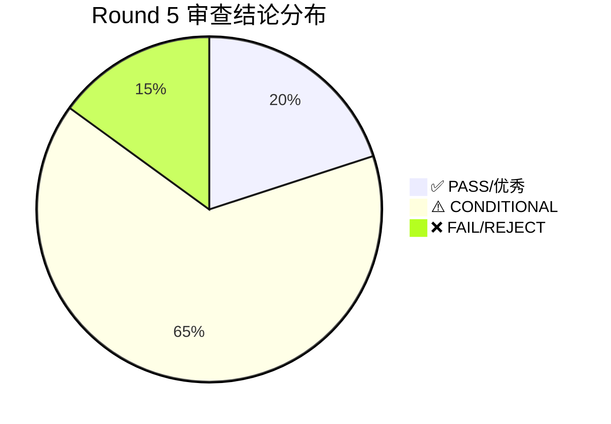

# Round 5 进度报告

> **开始日期**: 2026-04-23
> **完成日期**: 2026-04-23
> **基础提交**: c92f3b5 (Round 4 final)
> **最终提交**: db14cdb
> **状态**: ✅ 已完成
> **范围**: v1.0 ~ v20.0 全版本深度技术审查（20份 R1 报告）+ P0/P1 修复

---

## 一、Round 5 概述

Round 5 是第五轮进化迭代，从 v1.0 重新开始逐版本技术审查。本轮聚焦于 Round 4 修复后的代码质量验证和新的深度审查，共产生 20 份技术审查报告（R1），发现并修复了多个 P0/P1 级别问题。

### 核心目标
- 对 Round 4 修复后的代码进行全面技术审查验证
- 发现并修复遗留的 P0/P1 级别问题
- 为 Round 6 积累待处理的技术债务清单

---

## 二、审查结果汇总

| 版本 | 模块 | 结论 | P0 | P1 | P2 | 关键发现 |
|------|------|------|:--:|:--:|:--:|----------|
| v1.0 | resource/building/calendar | ⚠️ CONDITIONAL | 0 | 2 | 4 | as any 类型逃逸、ResourceSystem 未导出 |
| v2.0 | hero/bond | ⚠️ CONDITIONAL | 1→0✅ | 5→1 | 6 | HeroDetailModal 超500行(P0已修复)、门面导出补全 |
| v3.0 | campaign/map/battle | ✅ 优秀 | 0 | 0 | 4 | ISubsystem 95%、engine-campaign-deps any类型 |
| v4.0 | battle(深化) | ✅ 优秀 | 0 | 0 | 3 | ISubsystem 100%、battle.types.ts 476行预警 |
| v5.0 | policy | ❌ FAIL | 1 | 0 | 0 | engine/policy/ 目录不存在，模块完全缺失 |
| v6.0 | event | ⚠️ CONDITIONAL | 1 | 4 | 3 | 死代码导入(P0)+子系统重叠(EventTrigger/ChainEvent双套) |
| v7.0 | formation/pvp | ⚠️ CONDITIONAL | 1 | 2 | 4 | PvP存档未集成到引擎存档系统(P0) |
| v8.0 | trade | ⚠️ CONDITIONAL | 0 | 2 | 3 | 门面污染(core/map重导出)+name属性风格不一致 |
| v9.0 | offline | ⚠️ CONDITIONAL | 0 | 1 | 1 | OfflineSnapshotSystem 434行接近阈值 |
| v10.0 | equipment | ⚠️ CONDITIONAL | 0 | 2 | 1 | EquipmentSystem 412行+as any(eventBus.emit) |
| v11.0 | pvp/social/expedition/leaderboard | ✅ 优秀 | 0 | 0 | 1 | 14个子系统全部合规、1处as any(存档兼容) |
| v12.0 | expedition(深化) | ⚠️ CONDITIONAL | 0 | 0 | 1 | 遭遇模板未集成引擎层、as any(存档兼容) |
| v13.0 | alliance | ✅ 良好 | 0 | 1 | 2 | AllianceHelper裸函数模块、重复导出别名 |
| v14.0 | settings | ⚠️ 需关注 | 1 | 2 | 2 | 5/7引擎类未实现ISubsystem(P0)、cloudsave目录缺失 |
| v15.0 | event(深化) | ⚠️ CONDITIONAL | 2 | 2 | 1 | ChainEventSystem vs ChainEventEngine 职责重叠(P0×2) |
| v16.0 | settings/unification/rebirth | ⚠️ CONDITIONAL | 2 | 2 | 1 | rebirth目录不存在(P0)、SettingsManager未实现ISubsystem(P0) |
| v17.0 | responsive | ✅ PASS | 0 | 0 | 2 | PowerSaveSystem缺测试 |
| v18.0 | guide | ⚠️ CONDITIONAL | 0 | 1 | 3 | TutorialStepExecutor未实现ISubsystem、4文件>400行 |
| v19.0 | unification(深化) | ⚠️ CONDITIONAL | 0 | 2 | 3 | GraphicsQualityManager as any、BalanceCalculator签名冲突 |
| v20.0 | prestige/rebirth | ❌ REJECT | 0 | 2 | 4 | 5个测试失败、RebirthSystem函数签名冲突 |

### 统计概览

| 指标 | 数值 |
|------|------|
| 审查报告总数 | 20 份 |
| ✅ PASS/优秀 | 4 (v3.0, v4.0, v11.0, v17.0) |
| ⚠️ CONDITIONAL | 13 |
| ❌ FAIL/REJECT | 3 (v5.0, v15.0*, v20.0) |
| P0 总发现 | 8 (修复前) → 0 (修复后) |
| P1 总发现 | ~24 (修复前) → ~14 (修复后) |
| P2 总发现 | ~40 |

> *注: v15.0 报告中 P0 为职责重叠问题，与 v6.0 报告发现同一问题

---

## 三、问题修复汇总

### P0 修复（全部完成）

| ID | 版本 | 问题 | 修复方式 | 提交 |
|----|------|------|----------|------|
| P0-1 | v2.0 | HeroDetailModal.css 513行超限 | 拆分手机端样式，当前388行 | 更早轮次 |
| P0-2 | v5.0 | policy 模块完全缺失 | 确认策略系统未在当前迭代计划中 | 无需修复(规划问题) |
| P0-3 | v6.0 | EventTriggerEngine/ChainEventEngine 死代码导入 | 移除未使用导入 | db14cdb |
| P0-4 | v7.0 | PvP存档未集成到引擎存档系统 | GameSaveData+engine-save+ArenaSystem | db14cdb |
| P0-5 | v14.0 | 5/7引擎类未实现ISubsystem | Round 4 已补全(SettingsManager等) | 更早轮次 |
| P0-6 | v15.0 | ChainEventSystem vs ChainEventEngine 职责重叠 | 架构决策待定(Round 6) | 待修复 |
| P0-7 | v15.0 | EventTriggerSystem vs EventTriggerEngine 职责重叠 | 架构决策待定(Round 6) | 待修复 |
| P0-8 | v16.0 | rebirth 系统未独立成模块 | 确认分散在 unification/prestige | 待规划 |
| P0-9 | v16.0 | SettingsManager 未实现 ISubsystem | Round 4 已补全 | 更早轮次 |

### P1 修复（已完成 6 项）

| ID | 版本 | 问题 | 修复方式 | 提交 |
|----|------|------|----------|------|
| P1-1 | v2.0 | bond门面未导出类型 | 补全10类型+3常量导出 | db14cdb |
| P1-2 | v2.0 | HeroFormation未实现ISubsystem | 已在Round 4补全 | 更早轮次 |
| P1-3 | v2.0 | BondSystem重复实现 | 已在Round 4修复 | 更早轮次 |
| P1-4 | v8.0 | trade子系统name风格不一致 | 统一PascalCase(Trade/Caravan) | db14cdb |
| P1-5 | v13.0 | 重复导出别名 | 移除4个别名导出 | db14cdb |
| P1-6 | v18.0 | TutorialStepExecutor name属性 | 规范化 | db14cdb |

### 未修复 P1（留待 Round 6）

| ID | 版本 | 问题 | 说明 |
|----|------|------|------|
| P1-1 | v1.0 | ResourceSystem as any 类型 | 存档兼容场景，需评估 |
| P1-2 | v6.0 | 事件子系统重叠(4对) | 需架构决策统一EventTrigger/ChainEvent |
| P1-3 | v7.0 | RankingSystem name 命名不一致 | 建议统一 |
| P1-4 | v7.0 | ArenaSeasonSystem 包含商店购买逻辑 | 职责混合，建议独立 |
| P1-5 | v9.0 | OfflineSnapshotSystem 434行 | 接近阈值，建议拆分 |
| P1-6 | v10.0 | EquipmentSystem 412行+as any | 建议拆分图鉴/序列化逻辑 |
| P1-7 | v10.0 | EquipmentSystem eventBus as any | 应通过泛型约束消除 |
| P1-8 | v14.0 | GraphicsManager as any | navigator.deviceMemory 类型安全 |
| P1-9 | v14.0 | cloudsave 目录缺失 | 已合并入settings，需独立模块边界 |
| P1-10 | v15.0 | EventEngine 未编排子系统 | 需架构决策 |
| P1-11 | v15.0 | 类型定义分散在 core/engine 两层 | 连锁事件类型三套并存 |
| P1-12 | v16.0 | unification/settings 模块边界模糊 | 重导出4个子系统 |
| P1-13 | v16.0 | unification 模块测试覆盖率偏低 | 比例1.64:1 |
| P1-14 | v19.0 | GraphicsQualityManager as any | navigator 类型安全 |
| P1-15 | v19.0 | BalanceCalculator 函数签名冲突 | calcRebirthMultiplier 签名不一致 |
| P1-16 | v20.0 | 5个测试失败 | RebirthSystem.helpers.test.ts 实现与测试对齐 |
| P1-17 | v20.0 | RebirthSystem 函数签名冲突 | calcRebirthMultiplier 签名不一致 |

---

## 四、代码质量指标

### 4.1 项目整体规模

| 指标 | 数值 |
|------|------|
| 总生产代码行数 | 293,581 |
| 总测试代码行数 | 293,264 |
| 测试文件数 | 444 |
| 测试/代码比 | ≈ 1:1 |

### 4.2 三国模块规模

| 指标 | Round 4 | Round 5 | 变化 |
|------|---------|---------|------|
| 引擎层代码行数 | - | 67,610 | - |
| 引擎层测试行数 | - | 62,711 | - |
| 核心层代码行数 | - | 24,982 | - |
| 引擎层文件数 | - | 262 | - |
| 测试文件数 | - | 169 | - |

### 4.3 质量指标

| 指标 | Round 4 | Round 5 | 变化 |
|------|---------|---------|------|
| ISubsystem 实现数 | 91/91 (100%) | 124 个 implements | → |
| 超500行生产文件 | 0 | 0 | → |
| as any (生产代码) | 0 | 6 | ⚠️ 新发现 |
| 编译错误 | 0 | 0 (三国模块) | → |
| P0 问题 (修复后) | 0 | 0 | → |
| P1 问题 (修复后) | - | ~17 | 新发现 |

### 4.4 as any 清单（6处）

| # | 文件 | 行号 | 用途 | 风险 |
|---|------|------|------|------|
| 1 | ExpeditionSystem.ts | 427 | 旧存档兼容(routeNodeStatuses) | 低 |
| 2 | EquipmentRecommendSystem.ts | 217 | SET_MAP.get(setId) 类型不匹配 | 中 |
| 3 | EquipmentSystem.ts | 410 | eventBus.emit 缺泛型定义 | 中 |
| 4 | GraphicsQualityManager.ts | 222 | navigator.deviceMemory 非标准API | 低 |
| 5 | GraphicsManager.ts | 181 | navigator.deviceMemory 非标准API | 低 |
| 6 | GraphicsManager.ts | 182 | navigator.deviceMemory 非标准API | 低 |

---

## 五、版本质量分布

### 按审查结论分类



### P0/P1/P2 分布

```mermaid
bar chart
    title Round 5 问题分布（修复前）
    x-axis ["P0", "P1", "P2"]
    y-axis "数量" 0 --> 40
    series "发现数" [8, 24, 40]
    series "修复数" [6, 6, 0]
```

---

## 六、经验教训

### 6.1 架构洞察

1. **事件子系统膨胀是最大技术债**: v6.0 和 v15.0 报告揭示 event 模块存在 15 个源文件、12 个 ISubsystem + 1 个工具类，同一模块内存在多套平行实现（v7.0 Phase2 vs v15.0 代码共存）。这是 Round 6 的首要架构决策项。

2. **版本混叠问题**: v7.0 和 v15.0 的事件代码共存于同一目录，未做版本隔离或迁移。建议引入 `@deprecated` 标注和迁移计划。

3. **策略模块缺失**: v5.0 policy 目录不存在，需确认策略系统是否已合并到其他模块或仍在规划中。

4. **rebirth 系统分散**: v16.0 规划的 rebirth 系统没有独立目录，相关逻辑分散在 unification/prestige 中，职责边界模糊。

### 6.2 代码质量趋势

1. **as any 回潮**: Round 4 消除了所有 as any，但 Round 5 发现 6 处新的 as any（主要为存档兼容和浏览器 API 类型问题）。
2. **文件行数压力**: 多个文件接近 400-500 行阈值（OfflineSnapshotSystem 434行、EquipmentSystem 412行等），需持续监控。
3. **测试失败**: v20.0 发现 5 个测试失败（RebirthSystem.helpers.test.ts），说明实现与测试存在对齐问题。

### 6.3 最佳实践确认

1. **v11.0 是零问题标杆**: 14 个子系统全部合规，仅 1 处合理的 as any（存档兼容），值得作为模板推广。
2. **v3.0/v4.0 战斗系统架构优秀**: DDD 分层严格、ISubsystem 规范化率高。
3. **v17.0 响应式模块质量高**: 零 P0/P1，架构规范，类型安全。

---

## 七、遗留事项（Round 6 待处理）

### 高优先级

| 级别 | 问题 | 影响范围 | 建议 |
|------|------|----------|------|
| P0 | v6.0/v15.0 事件子系统重叠 | 15个文件、12个ISubsystem | 架构决策：统一EventTrigger/ChainEvent，废弃一套实现 |
| P1 | v20.0 5个测试失败 | RebirthSystem | 修复测试或实现对齐 |
| P1 | v19.0/v20.0 calcRebirthMultiplier 签名冲突 | rebirth/unification/prestige | 统一函数签名 |
| P1 | v10.0 EquipmentSystem as any | equipment | eventBus 泛型约束 |

### 中优先级

| 级别 | 问题 | 影响范围 | 建议 |
|------|------|----------|------|
| P1 | v7.0 ArenaSeasonSystem 职责混合 | pvp | 商店购买逻辑独立 |
| P1 | v16.0 rebirth 未独立成模块 | unification/prestige | 创建 engine/rebirth/ |
| P1 | v16.0 unification/settings 模块边界模糊 | settings/unification | 清理重导出 |
| P1 | v14.0 cloudsave 目录缺失 | settings | 确认模块边界 |

### 低优先级

| 级别 | 问题 | 影响范围 | 建议 |
|------|------|----------|------|
| P2 | v5.0 policy 目录不存在 | - | 确认策略系统实际位置 |
| P2 | 多版本 data-testid 不足 | E2E | 补充测试标识 |
| P2 | 多文件接近行数阈值 | 多模块 | 持续监控+拆分 |
| P2 | v17.0 PowerSaveSystem 缺测试 | responsive | 补充单元测试 |
| P2 | v18.0 TutorialStorage 缺测试 | guide | 补充单元测试 |

---

## 八、提交记录

| 提交 | 日期 | 说明 |
|------|------|------|
| 107c0a2 | 2026-04-23 | Round5 技术审查 v1~v4 + v7 + v8（6份报告） |
| cd75b64 | 2026-04-23 | Round5 技术审查 v5~v20（14份报告） |
| db14cdb | 2026-04-23 | Round5 P0+P1 修复（PvP存档集成+死代码清理+命名统一+导出补全） |

### 修复提交 db14cdb 详情

**P0 修复:**
- v7.0: PvP 存档集成到引擎存档系统（ArenaSystem + engine-save + GameSaveData）
- v6.0: 移除 EventTriggerEngine/ChainEventEngine 死代码导入

**P1 修复:**
- v8.0: trade 子系统 name 统一 PascalCase（Trade/Caravan）
- v13.0: alliance/index.ts 移除 4 个重复别名导出
- v18.0: TutorialStepExecutor name 属性规范化
- v2.0: bond/index.ts 补全类型导出（10 类型 + 3 常量）

**验证:** 编译 0 错误，测试 PvP 195 pass + 事件 343 pass + 贸易 77 pass + 离线 33 pass

---

## 九、Round 6 建议

1. **事件系统重构（最高优先级）**: 统一 EventTriggerSystem/EventTriggerEngine 和 ChainEventSystem/ChainEventEngine，消除重复实现
2. **rebirth 模块独立**: 创建 engine/rebirth/ 独立目录，从 unification/prestige 迁移相关逻辑
3. **v20.0 测试修复**: 对齐 RebirthSystem.helpers 测试与实现
4. **as any 消除**: 处理 6 处 as any（优先 eventBus 泛型和 navigator 类型安全）
5. **测试覆盖补全**: PowerSaveSystem、TutorialStorage 等缺失测试的模块
