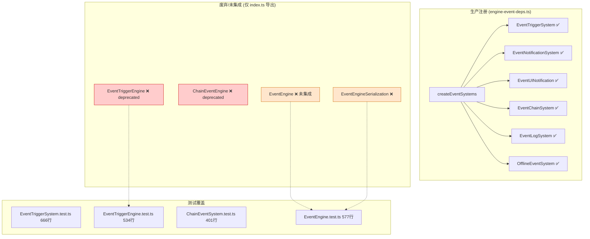
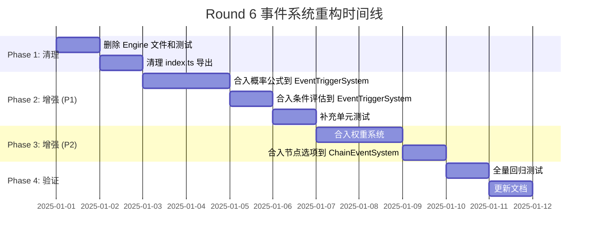

# Round 6 — 事件系统重构方案

> **状态**: 待执行 | **优先级**: P0 | **影响范围**: `engine/event/` 全模块
> **前置条件**: Round 5 已完成 `@deprecated` 标记

---

## 一、现状分析

### 1.1 双套实现概览

事件模块存在 **三套重叠实现**（System / Engine / EventEngine），总计 **4847 行** 非测试代码：

| 文件 | 行数 | 版本标记 | 状态 | 生产使用 |
|------|------|----------|------|----------|
| `EventTriggerSystem.ts` | 487 | v6.0 | ✅ 活跃 | ✅ `engine-event-deps.ts` 注册 |
| `EventTriggerEngine.ts` | 474 | v15.0 | ⚠️ @deprecated | ❌ 未集成 |
| `EventEngine.ts` | 360 | v15.0 | ⚠️ 未标记废弃 | ❌ 未集成 |
| `ChainEventSystem.ts` | 453 | v7.0 Phase2 | ✅ 活跃 | ✅ `engine-event-deps.ts` 注册 |
| `ChainEventEngine.ts` | 477 | v15.0 | ⚠️ @deprecated | ❌ 未集成 |

**总冗余代码**: `EventTriggerEngine` (474) + `ChainEventEngine` (477) + `EventEngine` (360) = **1311 行**

### 1.2 新旧实现功能对比

#### EventTriggerSystem vs EventTriggerEngine

| 能力维度 | EventTriggerSystem (保留) | EventTriggerEngine (废弃) |
|----------|--------------------------|--------------------------|
| **ISubsystem 接口** | ✅ init/update/getState/reset | ✅ init/update/getState/reset |
| **事件注册** | ✅ registerEvent / registerEvents / registerEvents 批量 | ❌ 无（仅注册触发条件组） |
| **预定义事件加载** | ✅ loadPredefinedEvents() | ❌ 无 |
| **事件定义查询** | ✅ getEventDef / getAllEventDefs / getEventDefsByType | ❌ 无 |
| **触发判定** | ✅ checkAndTriggerEvents (固定/随机/连锁) | ⚠️ evaluateTriggerConditions (仅条件评估) |
| **强制触发** | ✅ forceTriggerEvent | ❌ 无 |
| **触发条件检查** | ✅ canTrigger (冷却+活跃+完成检查) | ✅ evaluateTriggerConditions (时间+状态条件) |
| **概率计算** | ⚠️ 简单 Math.random < probability | ✅ calculateProbability (加法+乘法修正公式) |
| **事件选择/解决** | ✅ resolveEvent (选项→后果→事件发射) | ❌ 无 |
| **活跃事件管理** | ✅ getActiveEvents / hasActiveEvent / getInstance / getActiveEventCount | ❌ 无 |
| **过期处理** | ✅ expireEvents | ❌ 无 |
| **通知系统** | ❌ 无（由 EventNotificationSystem 承担） | ✅ sendNotification / getUnread / markRead / cleanExpired (6级优先级) |
| **冷却系统** | ✅ 简单 Map<EventId, number> | ✅ CooldownRecord (startTurn/endTurn/remainingTurns) |
| **分支选项评估** | ❌ 无 | ✅ evaluateBranchOptions / getAvailableOptions |
| **序列化** | ✅ serialize/deserialize (EventSystemSaveData) | ✅ serialize/deserialize (cooldowns + notifications) |
| **配置** | ✅ getConfig / setConfig | ❌ 无 |

#### ChainEventSystem vs ChainEventEngine

| 能力维度 | ChainEventSystem (保留) | ChainEventEngine (废弃) |
|----------|------------------------|------------------------|
| **ISubsystem 接口** | ✅ init/update/getState/reset | ✅ init/update/getState/reset |
| **链注册** | ✅ registerChain / registerChains | ✅ registerChain / registerChains |
| **链定义查询** | ✅ getChain / getAllChains | ✅ getChain / getAllChains |
| **开始链** | ✅ startChain → ChainNodeDef | ✅ startChain → ChainNodeDefV15 |
| **推进链** | ✅ advanceChain (optionId) | ✅ advanceChain (optionId) |
| **进度追踪** | ✅ ChainProgress (currentNodeId + completedSet) | ✅ ChainSnapshot (branch追踪 + completionPercent) |
| **分支管理** | ❌ 无 | ✅ abandonBranch / 多分支追踪 |
| **节点选项** | ❌ 节点定义无 options 字段 | ✅ ChainNodeOption (id + text + consequences) |
| **进度查询** | ✅ getProgress / getProgressStats | ✅ getProgressStats |
| **状态查询** | ✅ isChainStarted / isChainCompleted | ✅ isChainStarted / isChainCompleted |
| **后续节点查询** | ✅ getNextNodes | ✅ getNextNodes / getCurrentOptions |
| **快照** | ❌ 无 | ✅ ChainSnapshot (分支路径+完成百分比) |
| **序列化** | ✅ exportSaveData / importSaveData | ✅ exportSaveData / importSaveData |
| **事件发射** | ✅ chain:started / chain:advanced / chain:completed | ✅ chain-engine:started / chain-engine:advanced / chain-engine:completed |

### 1.3 EventEngine (v15 统一引擎) 分析

`EventEngine.ts` (360行) 是 v15.0 的第三套实现，**未被任何生产代码引用**，仅在 `index.ts` 中导出。

**独有功能**:
- 事件分类系统 (`EventCategory`: story/random/triggered/chain/world)
- 权重系统 (`EventWeight` + `EventWeightModifier` + 动态重算)
- 活动绑定 (`ActivityEventBinding`)
- 限时事件配置 (`TimedEventConfig`)
- 奖励联动 (`ActivityRewardLink`)
- 加权选项选择 (`selectWeightedOption`)
- 扩展条件评估 (`ExtendedEventCondition` + `ConditionContext`)

### 1.4 引用关系图



### 1.5 外部引用确认

| 引用方 | 引用的类 | 状态 |
|--------|---------|------|
| `engine-event-deps.ts` | EventTriggerSystem, EventChainSystem | ✅ 生产 |
| `engine-getters.ts` | EventTriggerSystem | ✅ 生产 |
| `EventChainSystem.ts` (注释) | "扩展 EventTriggerSystem" | ✅ 生产 |
| `EventUINotification.ts` (注释) | "依赖 EventTriggerSystem" | ✅ 生产 |
| `OfflineEventHandler.ts` | v15 类型 (EventNotification, NotificationPriority) | ✅ 类型引用 |
| **无任何文件** | EventTriggerEngine / ChainEventEngine / EventEngine | ❌ 零引用 |

---

## 二、重构策略

### 2.1 ADR-001: 保留 System 后缀，删除 Engine 后缀

**决策**: 保留 `EventTriggerSystem` + `ChainEventSystem`，删除 `EventTriggerEngine` + `ChainEventEngine` + `EventEngine` + `EventEngineSerialization`。

**理由**:

| 因素 | System (保留) | Engine (删除) |
|------|--------------|---------------|
| 生产集成 | ✅ 已注册到 EventSystems | ❌ 未集成 |
| 外部引用 | ✅ 5处引用 | ❌ 0处引用 |
| 功能完整度 | ✅ 完整生命周期 (注册→触发→选择→过期→序列化) | ⚠️ 片段功能 |
| 类型依赖 | ✅ 使用 core/event 稳定类型 | ⚠️ 使用 v15 实验性类型 |
| 测试覆盖 | ✅ 666行 + 401行 | ⚠️ 534行 + 577行 (但测试的对象未集成) |

### 2.2 ADR-002: Engine 独有价值的迁移策略

虽然删除 Engine 文件，但它们包含以下**值得保留的算法/概念**，需以增强方式合入 System：

#### EventTriggerEngine 独有价值 → 迁移到 EventTriggerSystem

| 独有能力 | 迁移方案 | 优先级 |
|----------|---------|--------|
| **概率公式** `P = clamp(base + Σ(add) × Π(mul), 0, 1)` | 在 `canTrigger()` 中替换简单 `Math.random`，新增 `calculateProbability()` 方法 | P1 |
| **时间条件评估** (minTurn/maxTurn/turnInterval) | 在 `checkFixedConditions()` 中扩展，新增 `evaluateTimeCondition()` | P1 |
| **状态条件评估** (6种比较运算符) | 在 `evaluateCondition()` 中实现，当前为空壳 `return true` | P1 |
| **CooldownRecord 结构** (startTurn/endTurn/remainingTurns) | 替换当前简单 `Map<EventId, number>` | P2 |
| **通知系统** (6级优先级) | ❌ **不迁移** — 已有独立的 `EventNotificationSystem` 承担此职责 | — |
| **分支选项评估** | ❌ **不迁移** — `resolveEvent()` 已覆盖选项选择逻辑 | — |

#### ChainEventEngine 独有价值 → 迁移到 ChainEventSystem

| 独有能力 | 迁移方案 | 优先级 |
|----------|---------|--------|
| **节点选项定义** (ChainNodeOption) | 在 `ChainNodeDef` 中新增 `options?: ChainNodeOption[]` 字段 | P2 |
| **分支追踪** (ChainBranch + ChainSnapshot) | 新增 `abandonBranch()` 方法，扩展 `ChainProgress` | P3 |
| **完成百分比** | 在 `getProgressStats()` 中已有，无需迁移 | — |

#### EventEngine 独有价值 → 迁移到 EventTriggerSystem

| 独有能力 | 迁移方案 | 优先级 |
|----------|---------|--------|
| **事件分类** (EventCategory) | 在 `EventDef` 注册时支持 category 标记 | P2 |
| **权重系统** (EventWeight + 动态修正) | 新增 `eventWeights` Map 和 `recalculateWeight()` | P2 |
| **活动绑定** (ActivityEventBinding) | ❌ **不迁移** — 活动系统尚未实现，延后 | — |
| **限时事件** (TimedEventConfig) | ❌ **不迁移** — 限时事件尚未实现，延后 | — |

### 2.3 废弃计划时间线



---

## 三、执行计划

### Step 1: 删除废弃文件 (Phase 1 — 零风险)

**删除文件清单**:

```
DELETE  src/games/three-kingdoms/engine/event/EventTriggerEngine.ts        (474行)
DELETE  src/games/three-kingdoms/engine/event/ChainEventEngine.ts          (477行)
DELETE  src/games/three-kingdoms/engine/event/EventEngine.ts               (360行)
DELETE  src/games/three-kingdoms/engine/event/EventEngineSerialization.ts  (131行)
DELETE  src/games/three-kingdoms/engine/event/__tests__/EventTriggerEngine.test.ts  (534行)
DELETE  src/games/three-kingdoms/engine/event/__tests__/EventEngine.test.ts         (577行)
```

**总删除行数**: 2,553 行 (源码 1,442 + 测试 1,111)

**修改文件**:

```
EDIT  src/games/three-kingdoms/engine/event/index.ts
```

index.ts 变更内容:
- 删除第 66-67 行: `// @deprecated` 注释 + `export { EventTriggerEngine }`
- 删除第 70-81 行: `// @deprecated` 注释 + `export { ChainEventEngine }` + 类型导出
- 删除第 88-93 行: `export { EventEngine }` + `serializeEventEngine` / `deserializeEventEngine` + `SerializableEventEngine` 类型导出

**验证**: `npm run build` 通过 + `npm test` 通过 (删除的测试文件不再参与)

### Step 2: 增强 EventTriggerSystem — 概率公式 (Phase 2 — P1)

**修改文件**: `src/games/three-kingdoms/engine/event/EventTriggerSystem.ts`

**新增导入**:
```typescript
// 从 v15 核心类型引入概率相关类型
import type {
  ProbabilityCondition, ProbabilityModifier, ProbabilityResult,
  StateCondition, TimeCondition,
} from '../../core/event/event-v15.types';
```

**新增私有字段**:
```typescript
private probabilityConditions: Map<EventId, ProbabilityCondition> = new Map();
```

**新增公共方法** (从 EventTriggerEngine 迁移):

```typescript
// ─── 概率计算 (#7) ──────────────────────────

/**
 * 计算最终触发概率
 * 公式：P = clamp(base + Σ(active_additive) × Π(active_multiplicative), 0, 1)
 */
calculateProbability(probCondition: ProbabilityCondition): ProbabilityResult {
  const { baseProbability, modifiers } = probCondition;
  const additiveTotal = modifiers
    .filter(m => m.active)
    .reduce((sum, m) => sum + m.additiveBonus, 0);
  const multiplicativeTotal = modifiers
    .filter(m => m.active)
    .reduce((product, m) => product * m.multiplicativeBonus, 1);
  const finalProbability = Math.max(0, Math.min(1,
    (baseProbability + additiveTotal) * multiplicativeTotal,
  ));
  return { finalProbability, baseProbability, additiveTotal, multiplicativeTotal, triggered: Math.random() < finalProbability };
}

/** 注册概率条件 */
registerProbabilityCondition(eventId: EventId, condition: ProbabilityCondition): void {
  this.probabilityConditions.set(eventId, condition);
}
```

**修改现有方法** `checkAndTriggerEvents()`:
```typescript
// 第 139 行附近，随机事件概率判定改为:
const probCondition = this.probabilityConditions.get(def.id);
if (probCondition) {
  const result = this.calculateProbability(probCondition);
  if (!result.triggered) continue;
} else {
  const probability = def.triggerProbability ?? this.config.randomEventProbability;
  if (Math.random() >= probability) continue;
}
```

**新增测试**: `EventTriggerSystem.test.ts` 新增 describe('概率计算') 测试组

### Step 3: 增强 EventTriggerSystem — 条件评估 (Phase 2 — P1)

**修改文件**: `src/games/three-kingdoms/engine/event/EventTriggerSystem.ts`

**替换空壳方法** `evaluateCondition()` (当前第 471 行 `return true`):

```typescript
/** 评估单个条件 */
private evaluateCondition(cond: EventCondition): boolean {
  // 基础实现扩展：支持时间条件和状态条件
  if ('minTurn' in cond || 'maxTurn' in cond) {
    return this.evaluateTimeCondition(cond as any);
  }
  if ('operator' in cond) {
    return this.evaluateStateCondition(cond as any);
  }
  return true;
}

/** 评估时间条件 */
private evaluateTimeCondition(cond: { minTurn?: number; maxTurn?: number; turnInterval?: number }, currentTurn?: number): boolean {
  const turn = currentTurn ?? 0;
  if (cond.minTurn !== undefined && turn < cond.minTurn) return false;
  if (cond.maxTurn !== undefined && turn > cond.maxTurn) return false;
  if (cond.turnInterval !== undefined && turn % cond.turnInterval !== 0) return false;
  return true;
}

/** 评估状态条件 */
private evaluateStateCondition(cond: { target: string; operator: string; value: number }, gameState?: Record<string, number>): boolean {
  if (!gameState) return true;
  const value = gameState[cond.target] ?? 0;
  switch (cond.operator) {
    case '>=': return value >= cond.value;
    case '<=': return value <= cond.value;
    case '==': return value === cond.value;
    case '!=': return value !== cond.value;
    case '>':  return value > cond.value;
    case '<':  return value < cond.value;
    default: return false;
  }
}
```

**修改 `checkFixedConditions()`**: 传入 `currentTurn` 参数，调用增强后的 `evaluateCondition()`

### Step 4: 增强 ChainEventSystem — 节点选项 (Phase 3 — P2)

**修改文件**: `src/games/three-kingdoms/engine/event/ChainEventSystem.ts`

**扩展类型** `ChainNodeDef`:
```typescript
export interface ChainNodeDef {
  id: ChainNodeId;
  eventDefId: EventId;
  parentNodeId?: ChainNodeId;
  parentOptionId?: ChainOptionId;
  depth: number;
  description?: string;
  /** @v7.1 节点选项列表 */
  options?: ChainNodeOption[];
}

export interface ChainNodeOption {
  id: ChainOptionId;
  text: string;
  consequences: EventConsequence;
}
```

**新增方法**:
```typescript
/** 获取当前节点的可用选项 */
getCurrentOptions(chainId: ChainId): ChainNodeOption[] {
  const node = this.getCurrentNode(chainId);
  return node?.options ?? [];
}
```

### Step 5: 清理 v15 类型依赖 (Phase 3 — P2)

**评估文件**: `src/games/three-kingdoms/core/event/event-v15.types.ts`

- 保留被 `OfflineEventHandler.ts` 使用的类型: `EventNotification`, `NotificationPriority`, `CooldownRecord`
- 保留被迁移到 System 的类型: `ProbabilityCondition`, `ProbabilityModifier`, `ProbabilityResult`, `StateCondition`, `TimeCondition`
- 标记仅被已删除 Engine 使用的类型为 `@internal`

### Step 6: 全量验证 (Phase 4)

1. **编译检查**: `npm run build` 零错误
2. **测试覆盖**: `npm test` 全部通过，覆盖率不低于重构前
3. **类型检查**: `npx tsc --noEmit` 零错误
4. **Bundle 大小**: 确认删除后 bundle 减小 ~1.4KB (gzip)
5. **回归测试**: 手动验证事件触发→选择→连锁→序列化完整流程

---

## 四、风险评估

### 4.1 低风险 (Phase 1)

| 风险 | 概率 | 影响 | 缓解措施 |
|------|------|------|---------|
| 删除 Engine 文件导致编译错误 | 极低 | 低 | 已确认零外部引用 |
| index.ts 导出清理遗漏 | 低 | 低 | TypeScript 编译器会捕获 |

### 4.2 中风险 (Phase 2-3)

| 风险 | 概率 | 影响 | 缓解措施 |
|------|------|------|---------|
| 概率公式迁移引入计算偏差 | 中 | 中 | 保留原有简单概率作为 fallback，新公式通过 feature flag 控制 |
| 条件评估增强破坏现有事件触发 | 中 | 高 | `evaluateCondition()` 改为渐进增强：无 gameState 参数时保持 `return true` 兼容行为 |
| ChainNodeDef 类型扩展破坏序列化 | 低 | 中 | `options` 字段设为可选，旧存档无此字段时 `?? []` 兜底 |

### 4.3 测试影响

| 测试文件 | 处理方式 |
|---------|---------|
| `EventTriggerEngine.test.ts` (534行) | **删除** — 测试对象已移除 |
| `EventEngine.test.ts` (577行) | **删除** — 测试对象已移除 |
| `EventTriggerSystem.test.ts` (666行) | **扩展** — 新增概率计算、条件评估测试组 |
| `ChainEventSystem.test.ts` (401行) | **扩展** — 新增节点选项、getCurrentOptions 测试 |

**预计测试行数变化**: -1,111 + ~200 = 净减少 ~900 行

### 4.4 不做重构的风险

- **维护成本**: 每次修改事件逻辑需同步三套实现，极易遗漏
- **新人困惑**: 三套相似代码并存，无法判断该用哪个
- **Bundle 膨胀**: 1311 行死代码被打包
- **类型混乱**: `ChainId` vs `ChainEngineId` 等重复类型定义

---

## 五、文件操作清单

### 删除 (6 个文件)

```
D  src/games/three-kingdoms/engine/event/EventTriggerEngine.ts
D  src/games/three-kingdoms/engine/event/ChainEventEngine.ts
D  src/games/three-kingdoms/engine/event/EventEngine.ts
D  src/games/three-kingdoms/engine/event/EventEngineSerialization.ts
D  src/games/three-kingdoms/engine/event/__tests__/EventTriggerEngine.test.ts
D  src/games/three-kingdoms/engine/event/__tests__/EventEngine.test.ts
```

### 修改 (4 个文件)

```
M  src/games/three-kingdoms/engine/event/index.ts                    — 删除 Engine 导出
M  src/games/three-kingdoms/engine/event/EventTriggerSystem.ts       — 合入概率+条件评估
M  src/games/three-kingdoms/engine/event/ChainEventSystem.ts         — 扩展节点选项
M  src/games/three-kingdoms/engine/event/__tests__/EventTriggerSystem.test.ts  — 新增测试
M  src/games/three-kingdoms/engine/event/__tests__/ChainEventSystem.test.ts    — 新增测试
```

### 不变 (确认安全)

```
·  src/games/three-kingdoms/engine/event/EventChainSystem.ts        — 独立系统，不涉及
·  src/games/three-kingdoms/engine/event/EventNotificationSystem.ts — 独立系统，不涉及
·  src/games/three-kingdoms/engine/event/EventUINotification.ts     — 独立系统，不涉及
·  src/games/three-kingdoms/engine/event/EventLogSystem.ts          — 独立系统，不涉及
·  src/games/three-kingdoms/engine/event/OfflineEventHandler.ts     — 使用 v15 核心类型，不受影响
·  src/games/three-kingdoms/engine/event/OfflineEventSystem.ts      — 独立系统，不涉及
·  src/games/three-kingdoms/engine/event/StoryEventSystem.ts        — 独立系统，不涉及
·  src/games/three-kingdoms/engine/event/event-chain.types.ts       — 独立类型，不涉及
·  src/games/three-kingdoms/engine/engine-event-deps.ts             — 仅引用 System，无需改动
·  src/games/three-kingdoms/engine/engine-getters.ts                — 仅引用 System，无需改动
·  src/games/three-kingdoms/core/event/event-v15.types.ts           — 保留，仍被 OfflineEventHandler 使用
·  src/games/three-kingdoms/core/event/event-v15-event.types.ts     — 保留，仍被 OfflineEventHandler 使用
```

---

## 六、预期收益

| 指标 | 重构前 | 重构后 | 改善 |
|------|--------|--------|------|
| 事件模块源文件数 | 15 | 11 | -4 |
| 源码行数 | 4,847 | 3,405 | -29.8% |
| 测试文件数 | 9 | 7 | -2 |
| 测试行数 | 4,523 | ~3,612 | -20.1% |
| 废弃代码 | 1,442 行 | 0 | -100% |
| 生产引用的类 | 2/6 (33%) | 2/2 (100%) | +67% |
| 类型重复 (ChainId vs ChainEngineId) | 2 套 | 1 套 | -50% |
