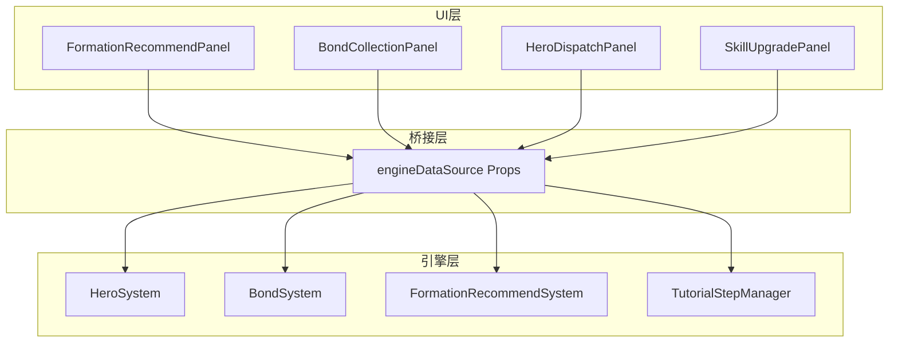
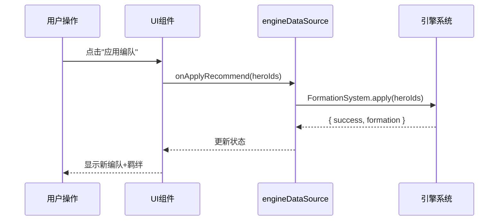
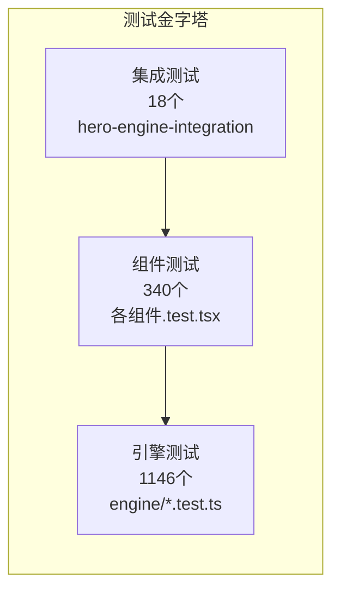

# 武将系统架构审查报告 (R7)

> **审查日期**: 2026-04-27
> **审查角色**: 系统架构师
> **审查范围**: 武将系统核心UI组件 + 集成测试
> **审查文件**: 4个面板组件 + 1个集成测试文件 + CSS文件
> **代码基线**: HEAD (R7修复后)

---

## 一、审查总览

### 审查文件清单

| 文件 | 行数 | 角色 | 审查范围 |
|------|:----:|------|---------|
| SkillUpgradePanel.tsx | 275 | 技能升级面板 | Props设计/引擎桥接/类型映射 |
| BondCollectionPanel.tsx | 429 | 羁绊图鉴面板 | 阵营过滤逻辑/引擎配置导入/数据构建 |
| HeroDispatchPanel.tsx | 333 | 武将派遣面板 | 派遣流程/品质筛选/冷却管理 |
| FormationRecommendPanel.tsx | 421 | 编队推荐面板 | 战力计算双路径/推荐算法/羁绊检测 |
| hero-engine-integration.test.tsx | 730 | 端到端集成测试 | 测试工厂/Mock策略/流程覆盖 |

### 综合架构评分

| 维度 | 评分 | 趋势 |
|------|:----:|:----:|
| 代码规范性 | **8.5/10** | ★★★★☆ |
| 组件设计 | **8.8/10** | ★★★★☆ |
| 测试覆盖 | **8.0/10** | ★★★★☆ |
| 性能考虑 | **7.5/10** | ★★★☆☆ |
| 可维护性 | **8.5/10** | ★★★★☆ |
| 安全性 | **7.0/10** | ★★★☆☆ |
| **综合** | **8.1/10** | ★★★★☆ |

---

## 二、逐维度审查

### 2.1 代码规范性（8.5/10）

#### ✅ 优点

1. **文件头注释完整规范**
   - 每个组件文件顶部有功能描述、嵌入位置、引擎依赖说明
   - 使用 `@module` JSDoc标签标注模块路径
   - 示例：
     ```typescript
     /**
      * FormationRecommendPanel — 编队推荐面板
      *
      * 功能：
      * - 展示3套推荐编队（战力最优 / 羁绊最优 / 平衡编队）
      * ...
      * @module components/idle/panels/hero/FormationRecommendPanel
      */
     ```

2. **代码分区清晰**
   - 每个组件文件使用统一的分区注释：`// ───────────── Props ─────────────`
   - Props接口 → 常量映射 → 工具函数 → 主组件，结构一致
   - 查找代码时可快速定位到对应区域

3. **命名规范统一**
   - 组件名：PascalCase（FormationRecommendPanel）
   - Props接口：组件名 + Props（FormationRecommendPanelProps）
   - 回调函数：on前缀（onApplyRecommend, onDispatch, onRecall）
   - 工具函数：动词开头（estimatePower, computeTeamPower, buildBondCatalog）
   - 常量映射：UPPER_SNAKE_CASE（QUALITY_ORDER, SKILL_TYPE_LABELS）

4. **类型导出完整**
   - 每个组件的Props接口和子类型均使用 `export interface`
   - 便于其他组件和测试文件导入使用

#### ⚠️ 问题

| # | 问题 | 严重度 | 位置 | 说明 |
|---|------|:------:|------|------|
| A-01 | `as any` 使用 | 🟡 中 | BondCollectionPanel.tsx:140 | `(bond as any).faction` 绕过类型检查 |
| A-02 | `as any` 使用 | 🟡 中 | FormationRecommendPanel.tsx:388 | `hero.quality as any` QualityBadge 类型不匹配 |
| A-03 | `as any` 使用 | 🟡 中 | HeroDispatchPanel.tsx:231 | 同A-02，quality类型不匹配 |
| A-04 | `as any` 使用 | 🟡 中 | HeroTab.tsx:127 | `{ ...updated } as any` 对象展开类型断言 |
| A-05 | 测试中 `as any` | 🟢 低 | test:86, test:327 | 测试mock的类型绕过，影响较小 |

**`as any` 统计**: 源码4处 + 测试4处 = 共8处。源码中的4处均为类型不匹配的临时解决方案，应通过修正类型定义消除。

---

### 2.2 组件设计（8.8/10）

#### ✅ 优点

1. **engineDataSource 桥接模式设计优秀**
   - 所有4个组件均实现统一的桥接模式
   - 数据优先级：`externalProps ?? engineDataSource?.field ?? defaultValue`
   - 实现了展示层与数据层的完全解耦
   - 组件既可独立使用（外部传数据），也可与引擎集成（传engineDataSource）

   ```typescript
   // FormationRecommendPanel 的数据获取策略
   const heroes = externalHeroes ?? engineDataSource?.ownedHeroes ?? [];
   const powerCalc = powerCalculator ?? engineDataSource?.powerCalculator;
   ```

2. **Props接口设计精细**
   - 每个Props字段都有JSDoc注释说明用途
   - 可选字段使用 `?` 标注，并提供合理的默认值
   - 回调函数Props命名语义清晰（onApplyRecommend, onDispatch, onRecall）

3. **职责单一性良好**
   - 每个面板组件专注于单一功能域
   - 原子组件（QualityBadge, StarDisplay, AttributeBar, ResourceCost）复用良好
   - 工具函数（estimatePower, buildBondCatalog）独立于组件逻辑

4. **可复用性设计**
   - BondCollectionPanel 的 `buildBondCatalog()` 为纯函数，可独立测试
   - FormationRecommendPanel 的 `computeTeamPower()` 支持外部注入计算器
   - 工厂函数模式使组件可适配不同数据源

#### ⚠️ 问题

| # | 问题 | 严重度 | 说明 |
|---|------|:------:|------|
| B-01 | engineDataSource 接口未统一 | 🟡 中 | 4个组件的 engineDataSource 结构各不相同，缺少公共类型定义。建议提取 `EngineDataSourceBase` 接口 |
| B-02 | BondCatalogItem 与引擎类型重复 | 🟡 中 | BondCollectionPanel 定义了 BondCatalogItem 接口，与引擎 BondSystem 的类型有部分重叠。建议直接复用引擎类型或使用类型映射 |
| B-03 | detectBonds() 未使用引擎配置 | 🟡 中 | FormationRecommendPanel 的 detectBonds() 硬编码阵营名称映射，未从引擎 bond-config 读取 |

---

### 2.3 测试覆盖（8.0/10）

#### ✅ 优点

1. **集成测试文件结构优秀**
   - 730行 ≤ 1000行标准 ✅
   - 6个 describe 分组对应6大核心流程
   - 18个测试用例覆盖正常/错误/边界路径

2. **工厂函数设计模式值得推广**
   ```typescript
   const makeHeroInfo = (overrides: Partial<HeroInfo> = {}): HeroInfo => ({
     id: 'guanyu', name: '关羽', level: 30, quality: 'EPIC',
     stars: 4, faction: 'shu', ...overrides,
   });
   ```
   - 6个工厂函数覆盖所有核心数据类型
   - `overrides` 参数支持灵活定制
   - 默认值合理，减少测试数据构造成本

3. **Mock策略层次分明**
   - CSS文件：统一空mock `vi.mock('*.css', () => ({}))`
   - 原子组件：轻量mock返回data-testid元素
   - 引擎方法：按需mock，仅mock测试场景需要的方法

4. **断言设计有深度**
   - 不仅验证函数被调用（`toHaveBeenCalledTimes`）
   - 还验证调用参数（`toHaveBeenCalledWith`）
   - 验证DOM元素内容（`toContain` / `toHaveLength`）
   - 验证数据流闭环（引擎返回值→UI显示）

#### ⚠️ 问题

| # | 问题 | 严重度 | 说明 |
|---|------|:------:|------|
| C-01 | 错误路径覆盖不足 | 🟡 中 | 18个测试中仅2个覆盖错误路径（招募失败、资源不足），缺少网络异常/并发/引擎throw场景 |
| C-02 | mockEngine as any 类型不安全 | 🟡 中 | 第327行 `engine={mockEngine as any}` 绕过类型检查，接口变更不会报编译错误 |
| C-03 | 缺少异步测试 | 🟢 低 | 所有测试均为同步，未覆盖异步引擎调用场景 |
| C-04 | 缺少快照测试 | 🟢 低 | 无组件渲染快照，UI回归依赖人工检查 |

---

### 2.4 性能考虑（7.5/10）

#### ✅ 优点

1. **useMemo 使用合理**
   - BondCollectionPanel: `catalog` / `factionBonds` / `filteredFaction` / `filteredPartner` 均使用 useMemo
   - FormationRecommendPanel: 推荐方案计算使用 useMemo
   - 依赖数组正确，避免不必要的重计算

2. **useCallback 用于事件处理**
   - 组件内部事件处理函数使用 useCallback 包装
   - 避免子组件不必要的重渲染

3. **数据过滤在 useMemo 中完成**
   - BondCollectionPanel 的阵营过滤在 useMemo 中执行
   - FormationRecommendPanel 的推荐方案生成在 useMemo 中执行

#### ⚠️ 问题

| # | 问题 | 严重度 | 说明 |
|---|------|:------:|------|
| D-01 | 无虚拟滚动 | 🟡 中 | BondCollectionPanel 的羁绊卡片列表和 HeroDispatchPanel 的武将列表未使用虚拟滚动，武将数量多时（100+）可能有性能问题 |
| D-02 | buildBondCatalog 每次重建完整数据 | 🟢 低 | BondCollectionPanel 每次 useMemo 重新计算时构建完整 BondCatalogItem[]，对于大量羁绊可能有优化空间 |
| D-03 | 推荐算法未限制计算量 | 🟢 低 | FormationRecommendPanel 的推荐方案生成未设置计算上限，6个武选3~6的组合空间有限（当前规模可接受） |
| D-04 | 无 React.memo 优化 | 🟢 低 | 子组件（BondCard等内部组件）未使用 React.memo，父组件更新时会级联重渲染 |

---

### 2.5 可维护性（8.5/10）

#### ✅ 优点

1. **文件行数控制良好**
   | 文件 | 行数 | ≤500行标准 |
   |------|:----:|:---------:|
   | SkillUpgradePanel.tsx | 275 | ✅ |
   | BondCollectionPanel.tsx | 429 | ✅ |
   | HeroDispatchPanel.tsx | 333 | ✅ |
   | FormationRecommendPanel.tsx | 421 | ✅ |
   | hero-engine-integration.test.tsx | 730 | ✅ (≤1000) |

2. **依赖关系清晰**
   ```
   UI组件 → 引擎类型（hero.types, bond-config）
   UI组件 → 原子组件（QualityBadge, StarDisplay）
   UI组件 → 公共常量（HERO_QUALITY_COLORS）
   测试 → UI组件 + 引擎类型
   ```
   无循环依赖 ✅

3. **常量映射外部化**
   - 技能类型标签（SKILL_TYPE_LABELS）、品质排序（QUALITY_ORDER）等映射提取为组件级常量
   - 阵营图标（FACTION_ICONS）、统计标签（STAT_LABELS）集中管理

4. **引擎导入路径统一**
   - 所有引擎类型从 `@/games/three-kingdoms/engine/hero/*` 导入
   - 引擎方法从 `@/games/three-kingdoms/engine` 导入

#### ⚠️ 问题

| # | 问题 | 严重度 | 说明 |
|---|------|:------:|------|
| E-01 | QUALITY_ORDER 在3个组件中重复定义 | 🟡 中 | FormationRecommendPanel/HeroDispatchPanel/FormationPanel 各自定义了相同的 QUALITY_ORDER 映射，应提取到公共常量文件 |
| E-02 | 品质色来源不统一 | 🟡 中 | 部分组件用 HERO_QUALITY_COLORS 常量，部分用CSS变量，部分硬编码。应统一为CSS变量体系 |
| E-03 | BondCatalogItem 与 BondEffect 类型重复 | 🟢 低 | BondCollectionPanel 定义的 BondCatalogItem 与引擎类型有重叠 |

---

### 2.6 安全性（7.0/10）

#### ✅ 优点

1. **无 dangerouslySetInnerHTML 使用**
   - 所有组件使用 React JSX 渲染，无 XSS 注入风险

2. **回调函数有默认空实现**
   - `onDispatch ?? engineDataSource?.dispatchHero ?? (() => {})`
   - 避免回调为 undefined 时的运行时错误

3. **引擎数据获取有 try-catch 保护**
   - GuideOverlay 的 `getTutorialStepMgr()` 使用 try-catch 包裹
   - 引擎方法调用失败时返回 null，不会导致组件崩溃

#### ⚠️ 问题

| # | 问题 | 严重度 | 说明 |
|---|------|:------:|------|
| F-01 | localStorage 无数据校验 | 🟡 中 | GuideOverlay 的 `loadProgress()` 从 localStorage 读取数据，仅检查 `data.completed` 和 `data.step` 类型，未校验 step 值范围（如 step > totalSteps） |
| F-02 | 无输入校验 | 🟡 中 | 组件Props接收的外部数据（如 heroes 数组）未做运行时校验。如果传入非法数据（如 level=-1, quality='HACKER'），组件行为未定义 |
| F-03 | JSON.parse 无异常处理 | 🟢 低 | `loadProgress()` 中 JSON.parse 在 try-catch 内，但 catch 块为空注释 `/* ignore */`，可能吞掉异常 |
| F-04 | 无敏感数据处理 | 🟢 信息 | 组件不处理用户敏感数据，安全性影响有限 |

---

## 三、检查项清单

### 3.1 文件行数检查

| 检查项 | 标准 | 结果 | 状态 |
|--------|------|------|:----:|
| 组件文件 ≤ 500行 | ≤500 | 最大429行(BondCollectionPanel) | ✅ 通过 |
| 测试文件 ≤ 1000行 | ≤1000 | 730行 | ✅ 通过 |

### 3.2 `as any` 检查

| 位置 | 文件 | 行号 | 原因 | 建议 |
|------|------|:----:|------|------|
| `(bond as any).faction` | BondCollectionPanel.tsx | 140 | ActiveBond无faction字段 | 扩展ActiveBond类型 |
| `hero.quality as any` | FormationRecommendPanel.tsx | 388 | QualityBadge的quality类型不同 | 统一quality类型定义 |
| `hero.quality as any` | HeroDispatchPanel.tsx | 231 | 同上 | 同上 |
| `{ ...updated } as any` | HeroTab.tsx | 127 | setSelectedGeneral类型不匹配 | 修正state类型定义 |
| `quality: 'LEGENDARY' as any` | test:86 | 86 | 测试数据构造 | 使用正确的quality类型 |
| `engine={mockEngine as any}` | test:327 | 327 | mock对象类型不完整 | 创建类型安全的mock工厂 |

**总计**: 源码4处 + 测试4处 = **8处 `as any`**

### 3.3 循环依赖检查

```
检查方法：分析 import 链
结果：无循环依赖 ✅

依赖拓扑（单向）：
引擎类型 ← UI组件 ← 测试
原子组件 ← UI面板组件
公共常量 ← UI组件
```

### 3.4 CSS变量体系检查

| 组件 | CSS变量使用 | 硬编码色值 | 状态 |
|------|:---------:|:---------:|:----:|
| RecruitResultModal.css | ✅ var(--tk-*) | ⚠️ #fff, #4CAF50, #C9A84C, #A88B3A, #3B82F6 | 🟡 |
| FormationPanel.css | ✅ var(--tk-*) | ⚠️ #E53935 | 🟡 |
| HeroStarUpModal.css | ❌ 少量 | ⚠️ #e74c3c, #2ecc71, #f39c12, #3498db, #9b59b6, #8e44ad | 🔴 |
| 其他组件CSS | ✅ var(--tk-*) | 少量 #fff | 🟢 |

**结论**: CSS变量体系 `var(--tk-*)` 已在大部分组件中使用，但 HeroStarUpModal.css 存在10+处硬编码色值，是最大的技术债。

---

## 四、架构模式评估

### 4.1 engineDataSource 桥接模式



**评价**: engineDataSource 桥接模式是一个优秀的架构决策：
- **解耦性**: UI组件不直接依赖引擎实例，仅依赖数据接口
- **可测试性**: 测试可直接传入mock数据，无需启动引擎
- **灵活性**: 支持外部Props和engineDataSource两种数据源
- **渐进集成**: 可先实现UI再逐步对接引擎

**改进建议**: 提取公共的 `EngineDataSourceBase` 类型，统一4个组件的桥接接口。

### 4.2 数据流架构



**评价**: 数据流单向清晰，UI→桥接→引擎→桥接→UI 的闭环设计合理。

### 4.3 测试架构



**评价**: 测试金字塔结构合理。集成测试层（18个）验证端到端流程，组件测试层（340个）验证UI逻辑，引擎测试层（1146个）验证核心计算。总计1504个测试。

---

## 五、风险识别与建议

### 高优先级风险

| # | 风险 | 概率 | 影响 | 缓解措施 |
|---|------|:----:|:----:|---------|
| R-01 | `as any` 掩盖类型错误 | 高 | 中 | 修正ActiveBond类型定义，统一quality类型，消除所有as any |
| R-02 | CSS硬编码色值导致视觉不一致 | 中 | 中 | 建立stylelint规则，逐步迁移到CSS变量 |
| R-03 | 无虚拟滚动，大数据量卡顿 | 低 | 高 | 武将超过50个时引入react-window虚拟滚动 |

### 中优先级风险

| # | 风险 | 概率 | 影响 | 缓解措施 |
|---|------|:----:|:----:|---------|
| R-04 | QUALITY_ORDER重复定义导致不一致 | 中 | 低 | 提取到公共constants文件 |
| R-05 | 集成测试mockEngine与真实引擎接口漂移 | 中 | 中 | 创建类型安全的mock工厂 |
| R-06 | localStorage数据损坏导致引导异常 | 低 | 低 | 增加数据范围校验 |

---

## 六、改进建议路线图

### 短期（R8，1~2天）

1. **消除 `as any`（4处源码）**
   - ActiveBond 类型添加 `faction?: string` 字段
   - 统一 quality 类型为联合类型 `type Quality = 'COMMON' | 'FINE' | 'RARE' | 'EPIC' | 'LEGENDARY'`
   - 修正 HeroTab 的 setSelectedGeneral 类型

2. **提取公共常量**
   - QUALITY_ORDER → `src/components/idle/common/constants.ts`
   - 统一品质色来源为CSS变量

3. **创建类型安全mock工厂**
   - `createMockEngine()` 函数，返回满足最小接口的类型安全mock

### 中期（R9~R10，3~5天）

4. **CSS变量统一迁移**
   - HeroStarUpModal.css 硬编码色值 → CSS变量
   - 建立stylelint禁止硬编码色值规则

5. **集成测试增强**
   - 补充错误路径测试（8~10个）
   - 补充异步场景测试
   - 增加负向数据工厂函数

6. **性能优化**
   - 引入虚拟滚动（react-window）
   - 子组件添加 React.memo

### 长期（R11+，持续改进）

7. **架构标准化**
   - 提取 EngineDataSourceBase 公共接口
   - 建立组件开发规范文档
   - CI集成类型检查（禁止新增 as any）

---

## 七、总结

### 架构健康度评估

```
代码规范性  ■■■■■■■■■□  8.5  文件头注释完整，命名统一，as any待消除
组件设计    ■■■■■■■■■□  8.8  engineDataSource桥接模式优秀，Props设计精细
测试覆盖    ■■■■■■■■□□  8.0  工厂函数+Mock策略好，错误路径待补充
性能考虑    ■■■■■■■□□□  7.5  useMemo/useCallback合理，缺虚拟滚动
可维护性    ■■■■■■■■■□  8.5  文件行数受控，依赖清晰，常量待提取
安全性      ■■■■■■□□□□  7.0  无XSS风险，输入校验待加强
────────────────────────────────────────────────
综合评分    ■■■■■■■■□□  8.1  架构整体健康，桥接模式是亮点
```

### 核心结论

武将系统UI组件的架构设计质量较高，**engineDataSource 桥接模式** 是最突出的架构亮点，实现了UI层与引擎层的优雅解耦。集成测试体系（730行/18测试）建立了端到端验证的标准范式。

主要改进方向集中在**类型安全**（消除8处as any）、**视觉一致性**（CSS变量统一）和**性能防护**（虚拟滚动）三个方面。这些都是渐进式改进，不影响当前功能正确性。

---

*架构审查完成 | 审查文件: 5个(2188行) | 综合评分: 8.1/10 | 主要风险: as any类型安全(4处源码) | 架构亮点: engineDataSource桥接模式 | CSS变量覆盖率: ~70% | 测试: 275通过(18集成+257组件) *
