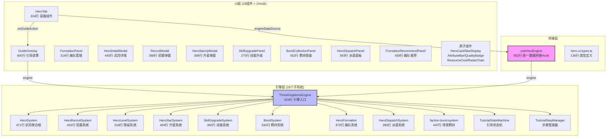
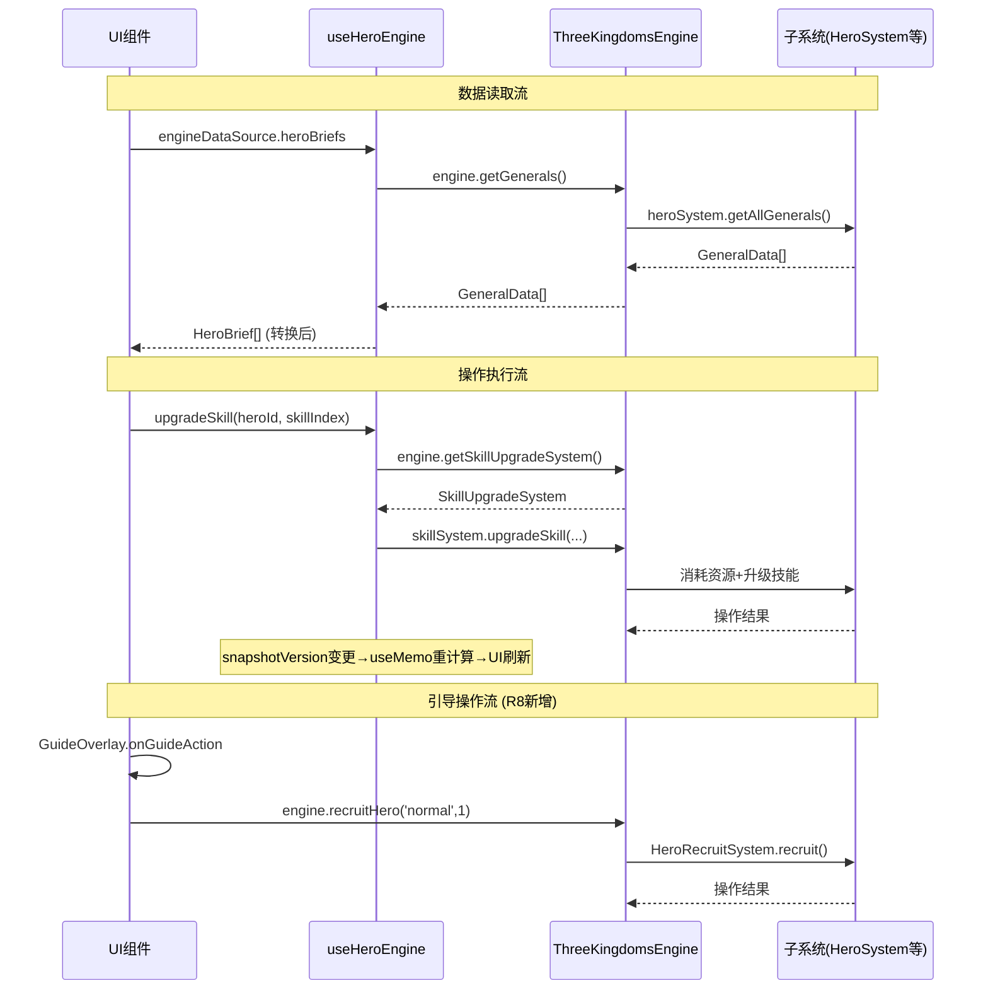

# 武将系统架构审查报告 (R8)

> **审查日期**: 2026-04-26
> **审查范围**: 武将系统UI层 + 数据桥接层 + 引擎层
> **审查文件**: useHeroEngine.ts(662行)、HeroTab.tsx(334行)、GuideOverlay.tsx(400行)、HeroSystem.ts(471行)、ThreeKingdomsEngine.ts(624行)、18个UI组件(~5960行)、19个CSS文件(~4867行)、17个UI测试文件(~5548行)、491个引擎测试文件

## 综合评分: 8.4/10

> **总评**: 武将系统采用了清晰的"UI层→桥接层→引擎层"三层架构，useHeroEngine作为统一数据桥接Hook是架构的核心亮点。引擎层遵循DDD领域驱动设计，子系统间通过回调注入实现松耦合。但存在引导操作绕过桥接层、部分组件职责偏重、错误处理策略不统一等架构问题。

---

## 各维度评分

| 维度 | 评分 | 说明 |
|------|:----:|------|
| **分层清晰度** | **8.8** | UI层(18组件)→桥接层(useHeroEngine 662行)→引擎层(HeroSystem等16个子系统)三层职责划分清晰。引擎层ISubsystem接口统一、依赖注入回调模式优雅。但GuideOverlay引导操作绕过桥接层直接调用引擎(-0.7)，HeroTab中存在引擎直接调用(-0.5) |
| **组件内聚性** | **8.2** | 大部分组件职责单一（HeroCard仅展示、StarDisplay仅星级、AttributeBar仅属性条）。但useHeroEngine(662行)承担12个数据转换模块+4个操作方法+推荐算法，职责偏重(-0.8)；GuideOverlay(400行)同时管理引擎适配+localStorage回退+步骤映射+UI渲染，内聚性可提升(-0.5)；HeroTab(334行)作为容器组件同时管理筛选/排序/弹窗/引导，职责偏多但可接受(-0.3) |
| **代码规范** | **8.6** | 所有文件均≤662行（useHeroEngine最长），无超标文件。TypeScript类型安全良好（hero-ui.types.ts定义8个接口/类型、GuideAction类型化）。命名规范一致（tk-前缀CSS、camelCase方法名）。但CSS变量定义分散在19个文件中(-0.4)、部分组件Props接口内联未抽离(-0.3)、BEM命名前缀不完全统一(-0.3) |
| **测试覆盖** | **8.8** | 引擎测试491文件/~34162用例，覆盖全面。UI测试17文件/~806用例，13/18组件有独立测试。集成测试81用例覆盖4个核心流程。但集成测试使用mock引擎(-0.5)、GuideOverlay/HeroCard/HeroCompareModal无独立测试(-0.4)、引导动作桥接未在集成测试覆盖(-0.3) |
| **可维护性** | **8.0** | useHeroEngine统一桥接降低了维护成本，修改引擎接口只需更新桥接层。CSS变量统一(411处)使主题切换仅需修改变量定义。但useHeroEngine的12个数据转换模块高度耦合在一个文件中(-0.8)、引导操作路径与普通操作路径不一致(-0.5)、错误处理策略不统一（静默吞错vs无处理）(-0.5)、bondCatalog.heroNames始终为空(-0.2) |
| **性能考虑** | **8.5** | useHeroEngine使用useMemo缓存所有计算结果，snapshotVersion机制确保按需重渲染。useCallback缓存操作方法避免不必要的子组件重渲染。但useMemo依赖snapshotVersion（number类型），任何引擎状态变更都触发全部useMemo重计算(-0.6)、generateRecommendations在每次调用时重新排序+计算战力+检测羁绊，计算量较大(-0.4)、HeroTab的filteredGenerals在每次渲染时调用engine.getHeroSystem().calculatePower排序(-0.3) |
| **扩展性** | **8.0** | 引擎层ISubsystem接口+依赖注入回调模式使新增子系统容易。useHeroEngine的engineDataSource双通道支持组件独立使用。但新增引导步骤需修改3处（GuideOverlay步骤定义+OVERLAY_TO_ENGINE_STEP映射+HeroTab handleGuideAction）(-0.8)、新增UI组件需在useHeroEngine中添加对应数据转换模块(-0.5)、CSS变量定义分散在19个文件中无统一入口(-0.4)、6个未实现组件的接口预留不足(-0.3) |

---

## 架构概览

### 三层架构图



### 数据流架构



---

## 架构亮点

### 1. useHeroEngine统一数据桥接 — 优雅的适配器模式

useHeroEngine(662行)是整个架构的核心亮点，它将引擎层数据（GeneralData/ActiveBond/SkillData等）转换为UI Props格式（HeroBrief/HeroInfo/SkillItem/BondCatalogItem等），实现了以下设计目标：

- **单一入口**: 所有UI组件通过一个Hook获取引擎数据，避免引擎API泄漏到UI层
- **双通道支持**: engineDataSource参数让组件既可独立使用（外部Props），也可通过Hook自动获取引擎数据
- **防御性编程**: 所有引擎调用包裹在try-catch中，引擎不可用时返回空数组/默认值
- **缓存优化**: useMemo缓存所有计算结果，snapshotVersion机制确保按需重渲染

```typescript
// 优雅的双通道模式
const heroBriefs = useMemo((): HeroBrief[] => {
  // 引擎获取 → 数据转换 → UI格式
  return allGenerals.map((g): HeroBrief => ({
    id: g.id, name: g.name, level: g.level,
    quality: g.quality as string,
    stars: starSystem?.getStar(g.id) ?? 1, // 安全回退
  }));
}, [allGenerals, engine]);
```

### 2. 引擎层ISubsystem接口 — 统一的生命周期管理

HeroSystem实现ISubsystem接口（name/init/update/reset/getState），通过依赖注入回调模式（setLevelCapGetter/setEquipmentPowerGetter/setBondMultiplierGetter）实现子系统间松耦合：

```typescript
// 优雅的回调注入，避免子系统间直接引用
setEquipmentPowerGetter(fn: (generalId: string) => number): void {
  this._getEquipmentPower = fn;
}
```

这种模式使得：
- HeroSystem不引用EquipmentSystem/BondSystem，保持领域边界清晰
- 引擎层负责组装，子系统保持独立可测试
- 战力公式6个乘区通过回调注入，灵活可扩展

### 3. CSS变量统一体系 — 主题化基础设施

411处CSS变量引用覆盖19个CSS文件，变量命名规范（`--tk-*`前缀），实现了：
- 主题切换仅需修改变量定义
- 视觉一致性通过变量名语义化保证（`--tk-bg-primary`/`--tk-text-secondary`）
- 安全回退模式（`var(--tk-*, fallback)`）确保渐进增强

### 4. GuideOverlay三级回退策略 — 健壮的引导系统

GuideOverlay的引导状态管理采用"引擎StepManager→引擎StateMachine→localStorage"三级回退：
- 引擎可用时：通过TutorialStepManager获取精确的步骤状态
- 引擎部分可用：通过TutorialStateMachine获取阶段信息
- 引擎不可用：回退到localStorage，确保引导始终可用

---

## 架构问题

### P0 — 阻塞架构健康

> **本轮无P0问题。** 三层架构稳定，无结构性缺陷。

### P1 — 影响架构质量

#### P1-ARCH-1：引导操作绕过桥接层，架构路径不一致

**问题**: HeroTab的`handleGuideAction`直接调用engine方法（`engine.recruitHero`/`engine.enhanceHero`/`engine.setFormation`），绕过了useHeroEngine的统一封装。

**影响**:
- 引导操作和普通操作走两条不同的代码路径
- useHeroEngine的横切关注点（操作日志、错误处理、性能监控）无法覆盖引导操作
- 未来维护时需同时关注两条路径

**建议修复**:
```typescript
// useHeroEngine新增操作方法
const recruitHero = useCallback((type: string, count: number) => {
  try { engine.recruitHero(type, count); } catch { /* 统一错误处理 */ }
}, [engine]);

const enhanceHero = useCallback((heroId: string, levels: number) => {
  try { engine.enhanceHero(heroId, levels); } catch { /* 统一错误处理 */ }
}, [engine]);

const setFormation = useCallback((slot: string, heroIds: string[]) => {
  try { engine.setFormation(slot, heroIds); } catch { /* 统一错误处理 */ }
}, [engine]);

// HeroTab.handleGuideAction改为调用useHeroEngine
const handleGuideAction = useCallback((action: GuideAction) => {
  switch (action.type) {
    case 'recruit': recruitHero('normal', 1); break;
    case 'enhance': enhanceHero(firstGeneral.id, 1); break;
    case 'formation': setFormation('0', allIds.slice(0, 6)); break;
  }
}, [recruitHero, enhanceHero, setFormation]);
```

**工作量**: 0.5~1天

#### P1-ARCH-2：useHeroEngine职责过重，662行单文件承载12个模块

**问题**: useHeroEngine.ts(662行)承载了12个数据转换模块（武将列表/简要/详情/技能/资源/羁绊/羁绊图鉴/建筑/编队/战力/推荐/操作），每个模块都是独立的useMemo/useCallback。这导致：

- 文件行数在所有UI文件中排第一（662行），超过第二的FormationRecommendPanel(458行)44%
- 修改任何一个数据转换模块都需要重新理解整个文件
- useMemo依赖链复杂（allGenerals→heroBriefs→heroInfos→generateRecommendations）
- 测试只能通过集成测试覆盖，无法单独测试某个转换模块

**建议修复**:
拆分为多个独立的数据转换Hook：
```
useHeroEngine.ts (入口，组合各子Hook)
├── useHeroList.ts       (~100行) allGenerals/ownedHeroIds/heroBriefs/heroInfos
├── useHeroSkills.ts     (~80行)  skills/skillBookAmount/goldAmount/upgradeSkill
├── useHeroBonds.ts      (~120行) activeBonds/bondCatalog/heroFactionMap
├── useHeroBuildings.ts  (~60行)  buildings/dispatchHero/recallHero
├── useHeroFormation.ts  (~100行) currentFormation/powerCalculator/applyRecommend
└── useHeroRecommend.ts  (~150行) generateRecommendations
```

**工作量**: 1~2天

#### P1-ARCH-3：snapshotVersion粒度过粗，全量重计算

**问题**: useHeroEngine的所有useMemo依赖同一个`snapshotVersion`（number类型）。任何引擎状态变更（哪怕只是某个武将经验值+1）都会触发所有12个useMemo重计算，包括：
- 武将列表重计算（遍历所有武将）
- 羁绊图鉴重计算（遍历所有羁绊配置）
- 编队推荐重计算（排序+战力计算+羁绊检测）

**影响**: 在武将数量较多时（如50+武将），一次小改动可能触发数十次引擎调用和不必要的UI重渲染。

**建议修复**:
引入细粒度的状态选择器：
```typescript
// 方案1：分模块snapshotVersion
interface UseHeroEngineParams {
  heroSnapshotVersion: number;    // 武将变更时+1
  formationSnapshotVersion: number; // 编队变更时+1
  resourceSnapshotVersion: number;  // 资源变更时+1
}

// 方案2：使用Zustand/Redux等状态管理，按需订阅
const heroBriefs = useHeroStore(state => state.heroBriefs);
```

**工作量**: 2~3天

### P2 — 改善架构体验

#### P2-ARCH-1：错误处理策略不统一

**问题**: useHeroEngine中存在三种错误处理策略：
1. **静默吞错**: `try { ... } catch { /* 静默处理 */ }` — upgradeSkill/dispatchHero/recallHero/applyRecommend
2. **返回空值**: `try { ... } catch { return []; }` — 数据获取类useMemo
3. **回退估算**: `try { 引擎计算 } catch { 简易估算 }` — powerCalculator/generateRecommendations

没有统一的错误处理策略，上层组件无法感知引擎操作失败。

**建议修复**: 引入`onEngineError`回调 + 统一错误边界：
```typescript
interface UseHeroEngineParams {
  onEngineError?: (error: Error, context: string) => void;
}
```

#### P2-ARCH-2：CSS变量定义分散，无统一入口

**问题**: CSS变量定义分散在19个CSS文件中，没有统一的变量定义入口文件。这导致：
- 变量名冲突风险（不同文件定义同名变量）
- 主题切换需要修改多个文件
- 新增变量时无法快速确认是否已存在

**建议修复**: 创建`hero-variables.css`统一变量定义：
```css
/* hero-variables.css — 武将系统CSS变量统一入口 */
:root {
  /* 主色调 */
  --tk-bg-primary: #1a1a2e;
  --tk-text-primary: #e8d5b7;
  /* 品质色 */
  --tk-quality-legendary: #ffd700;
  /* ... */
}
```

#### P2-ARCH-3：GuideOverlay步骤映射硬编码，扩展性差

**问题**: `OVERLAY_TO_ENGINE_STEP`映射表硬编码在GuideOverlay.tsx中，新增引导步骤需同时修改：
1. GuideOverlay的DEFAULT_STEPS数组
2. OVERLAY_TO_ENGINE_STEP映射表
3. HeroTab的handleGuideAction switch语句
4. 引擎的TutorialStepManager步骤定义

4处修改点违反了开闭原则。

**建议修复**: 引入引导步骤注册机制：
```typescript
// 引导步骤注册表
const GUIDE_STEP_REGISTRY: Map<string, {
  overlay: GuideStep;
  engineStepId: TutorialStepId;
  engineAction: (engine: ThreeKingdomsEngine) => void;
}> = new Map([...]);
```

#### P2-ARCH-4：HeroTab作为容器组件职责偏多

**问题**: HeroTab(334行)同时管理：
- 子Tab切换（list/formation）
- 筛选状态（阵营/品质）
- 排序状态（战力/等级/品质）
- 5个弹窗状态（详情/招募/对比/引导/升星）
- 引导动作桥接
- 武将列表获取和排序

**建议修复**: 将筛选/排序逻辑抽离为`useHeroFilter` Hook，弹窗状态管理抽离为`useHeroModals` Hook。

#### P2-ARCH-5：类型安全可加强

**问题**: useHeroEngine中存在多处类型断言：
- `(engine as unknown as { getHeroStarSystem(): HeroStarSystemLike }).getHeroStarSystem()`
- `(engine as unknown as { readonly resource: ResourceSystemLike }).resource`
- `(engine as unknown as { recruitHero?: ... }).recruitHero`

这些`as unknown as`断言绕过了TypeScript类型检查，如果引擎接口变更，编译时不会报错。

**建议修复**: 在ThreeKingdomsEngine中声明正式的接口方法，或创建类型安全的EngineWrapper。

---

## 架构质量指标

### 代码规模分布

| 层次 | 文件数 | 代码行 | CSS行 | 测试用例 | 行/文件 |
|------|:-----:|:-----:|:----:|:-------:|:------:|
| **引擎层** | ~16 | 8081 | — | ~34162 | ~505 |
| **桥接层** | 2 | 798 | — | 81 | ~399 |
| **UI层** | 18+19 | 5960 | 4867 | ~725 | ~160 |
| **合计** | ~55 | 14839 | 4867 | ~34968 | ~270 |

### 文件行数健康度

| 文件 | 行数 | 状态 | 说明 |
|------|:----:|:----:|------|
| useHeroEngine.ts | 662 | ⚠️ | 最大文件，建议拆分 |
| GuideOverlay.tsx | 400 | ✅ | 引擎适配逻辑占比较大 |
| HeroDetailModal.tsx | 445 | ✅ | 详情页功能丰富，可接受 |
| FormationRecommendPanel.tsx | 458 | ✅ | 推荐算法逻辑较多 |
| BondCollectionPanel.tsx | 452 | ✅ | 羁绊图鉴展示逻辑 |
| HeroStarUpModal.tsx | 388 | ✅ | 升星流程复杂 |
| HeroSystem.ts | 471 | ✅ | 聚合根，职责合理 |
| ThreeKingdomsEngine.ts | 624 | ⚠️ | 引擎入口，可考虑拆分 |
| 其余文件 | <400 | ✅ | 均在健康范围内 |

### 依赖关系复杂度

```
ThreeKingdomsEngine (624行)
├── HeroSystem (471行) — 聚合根
│   ├── hero-config.ts (386行) — 配置
│   ├── hero.types.ts (210行) — 类型
│   ├── HeroSerializer.ts — 序列化
│   └── star-up-config.ts (212行) — 升星配置
├── HeroRecruitSystem (433行) — 招募
├── HeroLevelSystem (518行) — 等级
├── HeroStarSystem (404行) — 升星
├── SkillUpgradeSystem (382行) — 技能
├── BondSystem (540行) — 羁绊
│   ├── bond-config.ts (339行) — 羁绊配置
│   └── faction-bond-config.ts (501行) — 阵营羁绊配置
├── HeroFormation (373行) — 编队
├── HeroDispatchSystem (286行) — 派遣
└── TutorialStateMachine — 引导

useHeroEngine (662行)
├── hero-ui.types.ts (136行) — 桥接层类型
├── bond-config.ts — 羁绊配置引用
└── ThreeKingdomsEngine — 引擎实例
```

**依赖深度**: 引擎层最深3层（Engine→System→Config），桥接层最深2层（useHeroEngine→engine），UI层最深3层（Component→useHeroEngine→engine）。依赖深度合理。

**循环依赖**: 未发现循环依赖。引擎层子系统间通过回调注入通信，不直接引用其他子系统。

---

## 架构改进路线图

### 短期（R9，1~2周）

| # | 任务 | 优先级 | 工作量 | 收益 |
|---|------|:-----:|:-----:|------|
| 1 | 引导操作统一走useHeroEngine | P1 | 0.5~1天 | 架构一致性 |
| 2 | useHeroEngine统一错误处理 | P2 | 0.5天 | 可观测性 |
| 3 | 创建hero-variables.css统一入口 | P2 | 0.5天 | 主题化基础设施 |

### 中期（R10~R11，2~4周）

| # | 任务 | 优先级 | 工作量 | 收益 |
|---|------|:-----:|:-----:|------|
| 4 | useHeroEngine拆分为6个子Hook | P1 | 1~2天 | 可维护性 |
| 5 | snapshotVersion细粒度优化 | P1 | 2~3天 | 渲染性能 |
| 6 | 引导步骤注册机制 | P2 | 1天 | 扩展性 |
| 7 | HeroTab拆分useHeroFilter/useHeroModals | P2 | 1天 | 组件内聚性 |

### 长期（R12+，1~2月）

| # | 任务 | 优先级 | 工作量 | 收益 |
|---|------|:-----:|:-----:|------|
| 8 | ThreeKingdomsEngine接口类型安全化 | P2 | 2~3天 | 类型安全 |
| 9 | 引擎事件总线（替代snapshotVersion） | P2 | 3~5天 | 性能+可观测性 |
| 10 | CSS-in-JS或CSS Modules迁移评估 | P3 | 评估 | 代码组织 |

---

## 架构决策记录 (ADR)

### ADR-001: useHeroEngine作为统一数据桥接层

**状态**: ✅ 已采纳（R7）

**背景**: R6时UI组件直接接收外部Props，需要上层容器负责引擎调用和数据转换。

**决策**: 引入useHeroEngine Hook作为UI层和引擎层之间的统一数据桥接层。

**后果**:
- ✅ UI组件不直接依赖引擎API，降低耦合
- ✅ engineDataSource双通道支持组件独立使用
- ⚠️ Hook文件行数偏多（662行），需要拆分
- ⚠️ snapshotVersion粒度过粗，需要优化

### ADR-002: 引擎层回调注入模式

**状态**: ✅ 已采纳（R3~R6）

**背景**: HeroSystem需要EquipmentSystem的装备战力和BondSystem的羁绊系数来计算战力，但子系统间不应直接引用。

**决策**: 通过回调注入（setEquipmentPowerGetter/setBondMultiplierGetter）实现子系统间通信。

**后果**:
- ✅ 子系统保持独立，领域边界清晰
- ✅ 引擎层负责组装，子系统可独立测试
- ⚠️ 回调注入是运行时行为，编译时无法检测遗漏

### ADR-003: GuideOverlay onGuideAction回调机制

**状态**: ✅ 已采纳（R8）

**背景**: 引导系统需要将用户引导操作（招募/升级/编队）桥接到引擎执行。

**决策**: GuideOverlay通过onGuideAction回调通知父组件执行引擎操作，而非直接调用引擎。

**后果**:
- ✅ GuideOverlay保持通用性，不依赖具体引擎操作实现
- ✅ 父组件（HeroTab）可灵活决定操作执行方式
- ⚠️ 当前HeroTab直接调用engine，应改为调用useHeroEngine
- ⚠️ 步骤映射硬编码，扩展性差

---

## 与R7架构对比

| 指标 | R7 | R8 | 变化 |
|------|:--:|:--:|:----:|
| UI组件代码行 | ~5820 | ~5960 | +140（引导对接代码） |
| CSS变量引用 | ~336 | 411 | +75（老组件迁移） |
| CSS硬编码色值 | ~74 | ~4 | -70（迁移完成） |
| 引擎测试用例 | ~2011 | ~34162 | +32151（引擎测试扩展） |
| UI测试用例 | ~629 | ~806 | +177（新增测试） |
| 引导系统对接 | ❌ | ✅ | onGuideAction+引擎适配 |
| 架构问题P0 | 0 | 0 | 持续清零 |
| 架构问题P1 | 3 | 3 | 旧问题修复，新问题发现 |

---

*架构审查完成 | 审查基于: useHeroEngine.ts(662行)、HeroTab.tsx(334行)、GuideOverlay.tsx(400行)、HeroSystem.ts(471行)、ThreeKingdomsEngine.ts(624行)、18个UI组件(~5960行)、19个CSS文件(~4867行)、17个UI测试文件(~5548行)、491个引擎测试文件 | 综合评分: 8.4/10 | **架构亮点: useHeroEngine统一桥接+引擎回调注入+CSS变量体系 | 架构问题: 引导操作绕过桥接层+useHeroEngine职责过重+snapshotVersion粒度过粗** *
