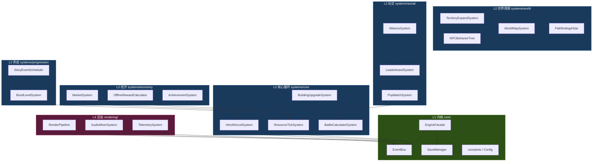

# 三国霸业游戏引擎改进计划

> 版本：v1.0 | 最后更新：2025-07-11
> 关联文档：`00-ARCHITECTURE-REFACTOR.md` · `00-TEST-SYSTEM-DESIGN.md`

---

## 一、改进总览

### 1.1 现状基线

| 指标 | 当前值 |
|------|--------|
| 源文件数 | 38 个 TS |
| 代码行数 | 22,565 行 |
| 子系统数 | 44 个 |
| 架构分层 | L1 内核 / L2 逻辑 / L3 UI / L4 渲染 |

### 1.2 改进目标

- **v1~v4**：夯实核心循环，建立测试与持久化基础设施
- **v5~v7**：开放世界地图，引入 NPC 生态与领地扩张
- **v8~v10**：完善经济循环，离线收益与贸易网络
- **v11~v14**：社交竞技层，PVP / 排行榜 / 联盟
- **v15~v16**：长线养成，羁绊 / 对话 / 故事事件
- **v17~v20**：体验打磨，渲染升级 / 音效 / 教程 / 数据统计

### 1.3 改进原则

1. **增量交付**：每版只新增/改动 ≤5 个子系统，控制回归风险
2. **测试先行**：新增子系统必须附带 ≥80% 覆盖率的单元测试
3. **接口隔离**：跨层调用通过 `EngineFacade` 统一收口，禁止 L3/L4 直接依赖 L1
4. **配置外置**：所有数值参数抽入 `constants.ts` 或独立 Config 文件

---

## 二、Phase 1 (v1~v4) 核心框架阶段

| 版本 | 新增子系统 | 改进子系统 | 基础设施 |
|------|-----------|-----------|---------|
| **v1.0** | `ResourceTickSystem` · `BuildingUpgradeSystem` | `BuildingSystem`（升级链路）· `constants`（资源/建筑数据表） | `EngineFacade` · `EventBus` · `SaveManager` |
| **v2.0** | `HeroRecruitSystem` · `HeroDispatchSystem` | `UnitSystem`（招募/派遣接口） | `IGameLogic` 接口 · `MockGameLogic` 测试替身 |
| **v3.0** | `BattleCalculatorSystem` · `StageMapSystem` | `StageSystem`（关卡地图加载）· `BattleSystem`（自动战斗公式） | `UITreeExtractor`（UI 组件树提取） |
| **v4.0** | `StarRatingSystem` · `SweepSystem` | `BattleSystem`（扫荡模式）· `UnitSystem`（升星计算） | `TestDataProvider`（测试数据工厂） |

**Phase 1 完成标志**：玩家可完成「建造 → 招募 → 战斗 → 扫荡」完整闭环，数据可存取。

---

## 三、Phase 2 (v5~v7) 世界探索阶段

| 版本 | 新增子系统 | 改进子系统 | 基础设施 |
|------|-----------|-----------|---------|
| **v5.0** | `WorldMapSystem` · `MapChunkLoader` | `MapGenerator`（分块生成）· `CityMapSystem`（城池接入世界） | `ChunkPool`（地图块对象池） |
| **v6.0** | `TerritoryExpandSystem` · `ResourcePointSystem` | `TerritorySystem`（扩张规则）· `ResourcePointSystem`（采集逻辑） | `PathfindingAStar`（A* 寻路） |
| **v7.0** | `NPCBehaviorTree` · `NPCTraitSystem` | `NPCSystem`（行为树驱动）· `NPCManager`（调度优化） | `BehaviorTreeBuilder`（可视化编辑器预留接口） |

**Phase 2 完成标志**：世界地图可自由探索，NPC 自主活动，领地可扩张。

---

## 四、Phase 3 (v8~v10) 经济体系阶段

| 版本 | 新增子系统 | 改进子系统 | 基础设施 |
|------|-----------|-----------|---------|
| **v8.0** | `MarketSystem` · `PriceFluctuationEngine` | `TradeRouteSystem`（动态定价） | `EconomicSimulator`（经济模拟沙盒） |
| **v9.0** | `OfflineRewardCalculator` · `ResourceCapSystem` | `OfflineRewardSystem`（收益公式）· `constants`（容量上限） | `TimeWarpUtil`（时间压缩工具） |
| **v10.0** | `AchievementSystem` · `DailyQuestEngine` | `QuestSystem`（日常/成就）· `RewardSystem`（多渠道奖励归并） | `ProgressionTracker`（进度追踪器） |

**Phase 3 完成标志**：经济系统自洽运转，离线收益准确，玩家有长期追求目标。

---

## 五、Phase 4 (v11~v14) 社交竞技阶段

| 版本 | 新增子系统 | 改进子系统 | 基础设施 |
|------|-----------|-----------|---------|
| **v11.0** | `PvpMatchSystem` · `BattleReplaySystem` | `BattleSystem`（PVP 战斗结算） | `MatchmakingQueue`（匹配队列） |
| **v12.0** | `LeaderboardSystem` · `SeasonSystem` | `StatisticsTracker`（赛季统计） | `RankCalculator`（段位计算器） |
| **v13.0** | `AllianceSystem` · `AllianceWarSystem` | `CampaignSystem`（联盟战接入） | `ChatRelay`（聊天中继预留接口） |
| **v14.0** | `BattleChallengeSystem`（重构）· `ArenaSystem` | `BattleChallengeSystem`（竞技场模式）· `BattleStrategy`（AI 策略） | `ReplaySerializer`（回放序列化） |

**Phase 4 完成标志**：PVP 匹配可用，排行榜实时更新，联盟战可发起。

---

## 六、Phase 5 (v15~v16) 长线养成阶段

| 版本 | 新增子系统 | 改进子系统 | 基础设施 |
|------|-----------|-----------|---------|
| **v15.0** | `BondLevelSystem` · `DialogueTriggerEngine` | `GeneralBondSystem`（羁绊等级）· `GeneralDialogueSystem`（条件触发） | `StoryScriptParser`（剧情脚本解析器） |
| **v16.0** | `StoryEventScheduler` · `CharacterArcSystem` | `GeneralStoryEventSystem`（事件调度）· `TutorialStorySystem`（剧情教程） | `TimelineDirector`（时间线编排器） |

**Phase 5 完成标志**：武将羁绊深度可培养，剧情事件按条件自动触发，角色弧线完整。

---

## 七、Phase 6 (v17~v20) 体验优化阶段

| 版本 | 新增子系统 | 改进子系统 | 基础设施 |
|------|-----------|-----------|---------|
| **v17.0** | `RenderPipeline` · `SpriteAtlasManager` | `ThreeKingdomsRenderStateAdapter`（渲染管线重构）· `ParticleSystem`（特效池化） | `AssetPreloader`（资源预加载） |
| **v18.0** | `AudioMixerSystem` · `AmbientSoundEngine` | `AudioManager`（混音/分层）· `DayNightWeatherSystem`（环境音） | `SoundBank`（音效资源库） |
| **v19.0** | `TutorialFlowEngine` · `TooltipSystem` | `TutorialStorySystem`（流程化教程）· `InputHandler`（新手引导拦截） | `GuideOverlay`（引导遮罩组件） |
| **v20.0** | `TelemetrySystem` · `ABTestEngine` | `StatisticsTracker`（埋点上报）· `UnlockChecker`（AB 门控） | `DataPipeline`（数据管道预留接口） |

**Phase 6 完成标志**：渲染帧率稳定 60fps，音效沉浸感强，新手引导流畅，数据可分析。

---

## 八、子系统依赖图

---

## 九、改进优先级与风险

### 9.1 优先级矩阵

| 优先级 | 子系统 | 理由 |
|--------|--------|------|
| **P0 阻塞** | `EngineFacade` · `EventBus` · `SaveManager` | 所有后续子系统依赖 |
| **P0 阻塞** | `ResourceTickSystem` · `BuildingUpgradeSystem` | 核心循环入口 |
| **P1 高** | `BattleCalculatorSystem` · `HeroRecruitSystem` | 核心玩法闭环 |
| **P1 高** | `WorldMapSystem` · `PathfindingAStar` | 世界探索基础 |
| **P2 中** | `MarketSystem` · `OfflineRewardCalculator` | 经济循环 |
| **P2 中** | `PvpMatchSystem` · `LeaderboardSystem` | 社交竞技 |
| **P3 低** | `BondLevelSystem` · `StoryEventScheduler` | 长线养成 |
| **P3 低** | `RenderPipeline` · `AudioMixerSystem` | 体验优化 |

### 9.2 风险清单

| 风险 | 影响 | 缓解措施 |
|------|------|---------|
| `EventBus` 事件风暴导致性能劣化 | 全局卡顿 | 事件分级（同步/异步），高频事件改轮询 |
| `SaveManager` 存档体积膨胀 | 加载超时 | 增量存档 + 数据压缩，上限 2MB |
| `WorldMapSystem` 分块加载卡帧 | 探索体验差 | 异步分块加载 + 对象池复用 |
| `BattleCalculatorSystem` 公式复杂度 | 调试困难 | 公式可配置化，战斗日志可回放 |
| `NPCBehaviorTree` 行为爆炸 | CPU 峰值 | 行为频率限制 + LOD 策略（远处 NPC 降频） |
| 跨版本子系统接口变更 | 回归缺陷 | 接口版本化 + 废弃标记 + 迁移指南 |

### 9.3 技术债务清理计划

| 版本 | 清理内容 |
|------|---------|
| v4.0 | 统一 `constants.ts` 数据格式，消除硬编码魔法数字 |
| v7.0 | `NPCSystem` 系列合并为统一 NPC 模块，减少类间耦合 |
| v10.0 | `EventSystem` + `ThreeKingdomsEventSystem` + `EventEnrichmentSystem` 合并为事件总线统一层 |
| v14.0 | `CampaignSystem` + `CampaignBattleSystem` + `BattleChallengeSystem` 统一战役接口 |
| v20.0 | 全局 TypeScript strict 模式开启，消除 `any` 类型 |

---

## 十、验收标准

### 10.1 质量门禁

| 指标 | 目标值 | 检测方式 |
|------|--------|---------|
| 引擎内核（L1+L2）测试覆盖率 | **>90%** | Jest --coverage |
| 单次 update + render 耗时 | **<16ms** | Performance profiling |
| 存档读写延迟 | **<100ms** | Benchmark |
| 内存峰值 | **<100MB** | Chrome DevTools Memory |
| TypeScript strict 合规 | **0 error** | tsc --strict |
| `any` 类型使用 | **0 处** | ESLint @typescript-eslint/no-explicit-any |

### 10.2 功能验收

- [ ] v1~v4：建造→招募→战斗→扫荡完整闭环可运行
- [ ] v5~v7：世界地图可探索，NPC 自主行为，领地可扩张
- [ ] v8~v10：经济系统自洽，离线收益准确，日常/成就可完成
- [ ] v11~v14：PVP 匹配成功，排行榜实时更新，联盟战可发起
- [ ] v15~v16：羁绊可培养，剧情事件按条件触发
- [ ] v17~v20：60fps 稳定渲染，新手引导流畅，埋点数据可上报

### 10.3 架构验收

- [ ] L3/L4 层无直接 import L1 层模块（通过 `EngineFacade` 间接访问）
- [ ] 所有子系统通过 `EventBus` 解耦，无直接方法调用跨系统
- [ ] UI 组件树可通过 `UITreeExtractor` 完整提取
- [ ] 新增子系统均附 `__tests__/` 目录，覆盖率 ≥80%
- [ ] 100% 符合本改进计划所列交付物

### 10.4 交付物清单

每个版本交付时必须包含：

1. **源码**：新增/改动的 `.ts` 文件
2. **测试**：对应 `__tests__/*.test.ts`，覆盖率达标
3. **配置**：`constants.ts` 或独立 Config 文件中的数值表
4. **文档**：子系统接口说明（JSDoc + README 片段）
5. **变更日志**：`CHANGELOG.md` 版本条目

---

> **下一步行动**：按 Phase 1 v1.0 启动 `EngineFacade` + `EventBus` + `SaveManager` 基础设施搭建。
