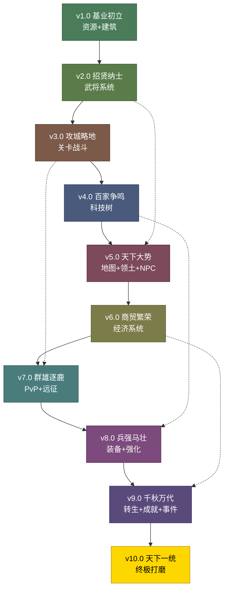

# 三国霸业 10 版本开发路线图

> **文档版本**：v1.0  
> **创建日期**：2025-01-20  
> **项目状态**：大量引擎子系统已编码，UI未完全接入，核心循环未打通  
> **目标**：通过10个迭代版本，逐步将三国霸业从"可展示原型"升级为"完整可玩放置策略游戏"

---

## 版本总览

| 版本 | 名称 | 核心目标 | 关键交付 | 预估工作量 |
|:----:|:----:|---------|---------|:---------:|
| **v1.0** | 基业初立 | 最小可玩版本：资源+建筑 | 4种资源实时产出+8种建筑建造升级+主界面交互 | 5天 |
| **v2.0** | 招贤纳士 | 武将系统打通 | 武将招募+武将列表+武将升级+武将派遣到建筑 | 4天 |
| **v3.0** | 攻城略地 | 关卡战斗系统 | 关卡地图+自动战斗+战利品+关卡解锁链 | 5天 |
| **v4.0** | 百家争鸣 | 科技树可视化 | 3条科技路线+科技研究+科技效果生效+互斥分支 | 4天 |
| **v5.0** | 天下大势 | 地图+领土+NPC | 天下地图+领土征服+NPC巡逻交互+地图收益 | 5天 |
| **v6.0** | 商贸繁荣 | 经济系统完善 | 商店买卖+贸易商路+货币体系+离线奖励 | 4天 |
| **v7.0** | 群雄逐鹿 | PvP竞技+远征 | PvP竞技场+排行榜+远征系统+联盟基础 | 5天 |
| **v8.0** | 兵强马壮 | 装备+强化 | 装备系统+铁匠铺强化+套装效果+装备推荐 | 4天 |
| **v9.0** | 千秋万代 | 转生+成就+事件 | 声望转生+成就系统+随机事件+限时活动 | 5天 |
| **v10.0** | 天下一统 | 终极打磨 | 新手引导+音频+存档+平衡性+全功能验收 | 5天 |

**总预估工作量**：约46天（单人全职开发）

---

## 版本依赖关系图



**依赖说明**：
- 实线箭头：强依赖（必须完成前置版本）
- 虚线箭头：弱依赖（前置版本的数据/机制可增强后续版本体验）

---

## 核心循环演进

每个版本都在上一个版本的基础上扩展核心循环：

```
v1.0: 挂机产出 → 资源增长 → 建造/升级建筑 → 更多资源
v2.0: 建筑产出 → 资源积累 → 招募武将 → 武将派遣增强建筑
v3.0: 武将+资源 → 发起战斗 → 获得战利品 → 解锁新关卡
v4.0: 资源投入 → 研究科技 → 科技加成生效 → 提升整体产出
v5.0: 地图探索 → 征服领土 → NPC交互 → 领土收益加成
v6.0: 资源交易 → 商贸利润 → 离线收益 → 经济循环加速
v7.0: 武将编队 → PvP竞技 → 远征探索 → 排行榜竞争
v8.0: 装备掉落 → 铁匠铺强化 → 套装效果 → 战力飞跃
v9.0: 声望积累 → 转生重置 → 永久加成 → 事件/活动奖励
v10.0: 新手引导 → 完整体验 → 平衡性调优 → 全功能验收
```

---

## 现有代码资产分析

### 引擎子系统（已编码，可直接使用）

| 子系统 | 文件 | 状态 | v1.0是否需要 |
|-------|------|:----:|:----------:|
| ThreeKingdomsEngine | ThreeKingdomsEngine.ts (~1900行) | ✅ 完整 | ✅ 核心 |
| BuildingSystem | engines/idle/modules/BuildingSystem.ts | ✅ 完整 | ✅ 核心 |
| PrestigeSystem | engines/idle/modules/PrestigeSystem.ts | ✅ 完整 | ❌ v9.0 |
| UnitSystem | engines/idle/modules/UnitSystem.ts | ✅ 完整 | ❌ v2.0 |
| StageSystem | engines/idle/modules/StageSystem.ts | ✅ 完整 | ❌ v3.0 |
| BattleSystem | engines/idle/modules/BattleSystem.ts | ✅ 完整 | ❌ v3.0 |
| TechTreeSystem | engines/idle/modules/TechTreeSystem.ts | ✅ 完整 | ❌ v4.0 |
| TerritorySystem | engines/idle/modules/TerritorySystem.ts | ✅ 完整 | ❌ v5.0 |
| CampaignSystem | CampaignSystem.ts | ✅ 完整 | ❌ v3.0 |
| CampaignBattleSystem | CampaignBattleSystem.ts | ✅ 完整 | ❌ v3.0 |
| QuestSystem | engines/idle/modules/QuestSystem.ts | ✅ 完整 | ❌ v5.0 |
| EventSystem | engines/idle/modules/EventSystem.ts | ✅ 完整 | ❌ v9.0 |
| RewardSystem | engines/idle/modules/RewardSystem.ts | ✅ 完整 | ❌ v6.0 |
| NPCSystem | NPCSystem.ts | ✅ 完整 | ❌ v5.0 |
| TradeRouteSystem | TradeRouteSystem.ts | ✅ 完整 | ❌ v6.0 |
| OfflineRewardSystem | OfflineRewardSystem.ts | ✅ 完整 | ❌ v6.0 |
| AudioManager | AudioManager.ts | ✅ 完整 | ❌ v10.0 |
| WeatherSystem | WeatherSystem.ts | ✅ 完整 | ❌ v10.0 |
| DayNightWeatherSystem | DayNightWeatherSystem.ts | ✅ 完整 | ❌ v5.0 |

### UI组件（已编码，需要打通交互）

| 组件 | 文件 | 行数 | 状态 |
|------|------|:----:|:----:|
| ThreeKingdomsPixiGame.tsx | 主UI组件 | ~5000 | ⚠️ UI展示多，交互未连通 |
| ThreeKingdomsPixiGame.css | 样式 | ~5000 | ✅ 完整 |
| ThreeKingdomsSVGIcons.tsx | SVG图标 | - | ✅ 完整 |
| ThreeKingdomsRenderStateAdapter.ts | 渲染适配器 | ~400 | ✅ 完整 |

### 数据定义（已完整）

| 数据 | constants.ts | 状态 |
|------|-------------|:----:|
| 13种建筑 | BUILDINGS[] | ✅ 完整 |
| 12位武将 | GENERALS[] | ✅ 完整 |
| 15块领土 | TERRITORIES[] | ✅ 完整 |
| 25项科技 | TECHS[] | ✅ 完整 |
| 15场战斗 | BATTLES[] | ✅ 完整 |
| 6个阶段 | STAGES[] | ✅ 完整 |
| 7种资源 | RESOURCES[] | ✅ 完整 |

---

## 关键技术决策

### 1. 版本隔离策略
- 每个版本在独立分支开发（`feature/v1.0`、`feature/v2.0`...）
- 未使用到的子系统不初始化（减少构建体积和运行时开销）
- 使用功能开关（Feature Flags）控制版本特性

### 2. UI架构
- 保持现有 `ThreeKingdomsPixiGame.tsx` 单文件架构
- 每个版本增加对应的面板/组件代码
- CSS使用 `ThreeKingdomsPixiGame.css` + 版本追加CSS

### 3. 数据流
```
Engine (ThreeKingdomsEngine)
  → RenderStateAdapter (getRenderState)
    → GameRenderState (标准化数据包)
      → PixiGameCanvas (PixiJS渲染)
      → React UI Overlay (DOM交互)
```

### 4. 构建约束
- 必须通过 `pnpm run build`（Vercel部署）
- 不引入新的外部依赖（除非绝对必要）
- TypeScript严格模式

---

## 风险与缓解

| 风险 | 影响 | 概率 | 缓解措施 |
|------|:----:|:----:|---------|
| 主UI组件过大（5000+行）难以维护 | 高 | 高 | 每版本重构局部，逐步拆分子组件 |
| 引擎API与UI交互不匹配 | 高 | 中 | v1.0先打通核心路径，暴露必要的公共方法 |
| 数据平衡性问题 | 中 | 高 | v1.0先用保守数值，v10.0集中调优 |
| PixiJS渲染性能 | 中 | 低 | 保持Canvas渲染简洁，避免过度绘制 |
| 版本间数据迁移 | 高 | 中 | 引擎内置save/load，版本升级时自动迁移 |

---

## 详细版本规划

> 每个版本的详细计划见对应文件：
> - [v1.0 基业初立](./v1.0-基业初立.md)
> - [v2.0 招贤纳士](./v2.0-招贤纳士.md)
> - [v3.0 攻城略地](./v3.0-攻城略地.md)
> - [v4.0 百家争鸣](./v4.0-百家争鸣.md)
> - [v5.0 天下大势](./v5.0-天下大势.md)
> - [v6.0 商贸繁荣](./v6.0-商贸繁荣.md)
> - [v7.0 群雄逐鹿](./v7.0-群雄逐鹿.md)
> - [v8.0 兵强马壮](./v8.0-兵强马壮.md)
> - [v9.0 千秋万代](./v9.0-千秋万代.md)
> - [v10.0 天下一统](./v10.0-天下一统.md)
