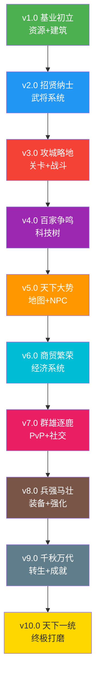

# 三国霸业 — 10 版本开发路线图

> **创建日期**: 2026-04-17  
> **目标**: 将三国霸业从"UI展示"升级为"完整可玩游戏"  
> **原则**: 每个版本必须可独立运行、核心循环连通、Vercel可构建、评测师可验证

---

## 一、现状分析

### 已有资产
- **引擎子系统**: 30+ 模块（BuildingSystem, BattleSystem, TechTreeSystem, CampaignSystem 等）
- **UI设计文档**: 27 个模块文档（含完整ASCII线框图+交互规范）
- **前端组件**: ThreeKingdomsPixiGame.tsx (~5000行) + CSS (~5000行)
- **数据定义**: 8建筑 / 12武将 / 21科技 / 15关卡 / 4资源
- **Tab结构**: 地图 / 武将 / 科技 / 关卡（4个Tab）

### 核心问题
1. **功能未打通**: 子系统已编码但UI未接入，点击操作无实际效果
2. **数据不连通**: 建筑→资源→武将→关卡 的核心循环断裂
3. **交互不完整**: 按钮点击后无状态变更，无法真实发展游戏
4. **缺少游戏逻辑**: 无胜利条件、无进度保存、无数值平衡

---

## 二、版本总览

| 版本 | 代号 | 核心目标 | 关键交付 | 预估迭代轮数 |
|:----:|------|---------|---------|:----------:|
| v1.0 | 基业初立 | 资源+建筑+核心循环 | 4资源实时产出+8建筑升级+主界面交互 | 5-8轮 |
| v2.0 | 招贤纳士 | 武将系统 | 武将招募+列表+升级+派遣加成 | 5-8轮 |
| v3.0 | 攻城略地 | 关卡+战斗 | 关卡地图+自动战斗+战利品+解锁 | 5-8轮 |
| v4.0 | 百家争鸣 | 科技树 | 3路线可视化+研究+效果+互斥分支 | 5-8轮 |
| v5.0 | 天下大势 | 地图+NPC | 天下地图+NPC交互+领土占领 | 5-8轮 |
| v6.0 | 商贸繁荣 | 经济系统 | 商店+贸易+离线奖励+货币体系 | 5-8轮 |
| v7.0 | 群雄逐鹿 | PvP+社交 | 竞技场+排行榜+联盟+远征 | 5-8轮 |
| v8.0 | 兵强马壮 | 装备+强化 | 装备系统+铁匠铺+套装+军师推荐 | 5-8轮 |
| v9.0 | 千秋万代 | 转生+成就 | 声望转生+成就+事件+活动 | 5-8轮 |
| v10.0 | 天下一统 | 终极打磨 | 新手引导+音频+存档+平衡性+全功能验收 | 5-8轮 |

**总计预估迭代轮数: 50-80轮**

---

## 三、版本依赖图



---

## 四、各版本详细规划

### v1.0 基业初立 — 资源+建筑+核心循环

**核心目标**: 玩家打开游戏后能看到资源在增长、能建造/升级建筑、形成最基础的放置循环。

#### 交付功能
1. **资源系统**
   - 4种资源（粮草/铜钱/兵力/天命）实时产出显示
   - 资源数值每秒更新，带飘字动画
   - 资源上限显示（粮草/兵力有上限，铜钱/天命无上限）
   - 点击资源图标获得额外资源

2. **建筑系统**
   - 8种建筑可建造/升级（农田/市集/兵营/铁匠铺/书院/医馆/城墙/主城）
   - 建筑升级消耗资源，有等级上限
   - 建筑产出资源，等级越高产出越多
   - 建筑解锁条件（主城等级决定其他建筑上限）
   - 升级动画反馈（光效+飘字）

3. **主界面交互**
   - 资源栏显示当前值/上限/产出速率
   - 左侧建筑面板：建造/升级按钮可点击，消耗资源
   - 资源不足时按钮禁用+提示
   - 建筑升级进度条
   - Tab切换正常工作

4. **游戏核心循环**
   - 挂机产出资源 → 资源足够时升级建筑 → 建筑提升产出 → 循环加速
   - 游戏tick系统：每秒更新资源
   - 离线时间计算（简化版：记录离开时间，回来时补算资源）

#### 核心数据流
```
BuildingSystem.getProduction() → Engine.update() → resources += production * dt
                                     ↓
UI: resourceBar.display(resources)  UI: buildingPanel.display(buildings)
```

#### 验收标准
- [ ] 4种资源每秒自动增长，数值实时更新
- [ ] 点击建筑"升级"按钮消耗资源，建筑等级+1
- [ ] 资源不足时按钮灰显，hover提示缺少多少
- [ ] 建筑升级后产出增加，资源增长加速
- [ ] 主城等级限制其他建筑等级上限
- [ ] 切换Tab后回来，资源仍在增长
- [ ] pnpm run build 成功

#### 参考设计文档
- 01-main-layout.md（主界面布局）
- 06-building-system.md（建筑系统）
- 08-resource-system.md（资源系统）
- 23-currency-spec.md（货币体系）

---

### v2.0 招贤纳士 — 武将系统

**核心目标**: 玩家可以招募武将、查看武将属性、升级武将、派遣武将到建筑增加产出。

#### 交付功能
1. **武将招募**
   - 招募面板：显示可招募武将列表
   - 消耗铜钱招募（不同品质不同费用）
   - 招募动画（武将出现特效）
   - 首次免费武将（许褚）

2. **武将列表**
   - 卡片展示：头像+名字+等级+品质+阵营
   - 阵营筛选（全部/蜀/魏/吴/群）
   - 品质筛选（传奇/史诗/精良/普通）
   - 排序（等级/攻击/防御）

3. **武将详情**
   - 点击卡片展开详情面板
   - 属性面板（攻击/防御/智谋/统率/魅力）
   - 技能列表（名称+描述+效果）
   - 历史传记
   - 势力归属+品质评级

4. **武将升级**
   - 消耗资源提升武将等级
   - 属性随等级成长
   - 升级动画反馈

5. **武将派遣**
   - 将武将分配到建筑
   - 武将加成建筑产出（统率→兵营、智谋→书院等）
   - 派遣状态显示

#### 验收标准
- [ ] 武将Tab显示12位武将卡片
- [ ] 点击招募按钮消耗铜钱，武将加入阵容
- [ ] 武将详情面板显示完整属性和技能
- [ ] 武将升级消耗资源，属性提升
- [ ] 武将派遣到建筑后，建筑产出增加
- [ ] 阵营筛选和排序功能正常
- [ ] pnpm run build 成功

#### 参考设计文档
- 04-hero-system.md（武将系统）

---

### v3.0 攻城略地 — 关卡+战斗

**核心目标**: 玩家可以推进关卡、进行自动战斗、获得战利品奖励，体验PvE内容。

#### 交付功能
1. **关卡地图**
   - 6章15关的线性关卡地图
   - 关卡节点状态（已完成/当前/未解锁）
   - 关卡详情弹窗（描述+推荐战力+奖励预览）

2. **自动战斗**
   - 选择武将编队（最多6位）
   - 自动计算战斗结果（基于属性对比）
   - 战斗报告（伤害/治疗/回合数）
   - 1-3星评定

3. **战利品系统**
   - 通关奖励（资源+经验+装备碎片）
   - 扫荡功能（已通关关卡可快速扫荡）
   - 奖励领取弹窗

4. **关卡解锁**
   - 前置关卡通关才能解锁下一关
   - 战力门槛提示
   - 推荐武将提示

#### 验收标准
- [ ] 关卡Tab显示关卡地图，节点状态正确
- [ ] 点击当前关卡进入战斗准备
- [ ] 选择武将编队后开始战斗
- [ ] 战斗结果基于属性计算，显示战斗报告
- [ ] 通关获得奖励，下一关解锁
- [ ] 扫荡功能快速获得奖励
- [ ] pnpm run build 成功

#### 参考设计文档
- 03-combat-system.md（战斗系统）
- 26-campaign-stages.md（关卡系统）

---

### v4.0 百家争鸣 — 科技树

**核心目标**: 3条科技路线可视化，玩家可以研究科技获得全局加成。

#### 交付功能
1. **科技树可视化**
   - 3条路线（军事/经济/文化）各7节点
   - 节点间连线显示前置关系
   - 互斥分支（第4节点后二选一）
   - 缩放和拖拽

2. **科技研究**
   - 消耗资源+时间研究科技
   - 研究进度条实时显示
   - 研究完成通知
   - 加速研究（消耗天命）

3. **科技效果**
   - 研究完成后全局加成立即生效
   - 加成效果在对应面板显示
   - 科技与建筑/武将联动

#### 验收标准
- [ ] 科技Tab显示3条路线，节点和连线清晰
- [ ] 点击可研究节点消耗资源开始研究
- [ ] 研究进度条实时更新
- [ ] 研究完成后加成生效，面板显示
- [ ] 互斥分支选择后另一分支不可选
- [ ] pnpm run build 成功

#### 参考设计文档
- 05-tech-tree.md（科技树）

---

### v5.0 天下大势 — 地图+NPC

**核心目标**: 天下地图展示势力范围，NPC在地图上活动并提供任务和交互。

#### 交付功能
1. **天下地图**
   - 三国势力范围可视化
   - 城池标注（名称+等级+产出）
   - 地形渲染（山脉/河流/平原）
   - 小地图导航

2. **NPC系统**
   - NPC在地图上巡逻
   - 点击NPC交互（对话/任务/交易）
   - NPC头顶状态标识（任务/对话/空闲）
   - NPC日程系统

3. **领土系统**
   - 占领城池获得产出
   - 领土收益可视化
   - 势力范围扩张

#### 参考设计文档
- 02-map-system.md（地图系统）
- 09-npc-system.md（NPC系统）

---

### v6.0 商贸繁荣 — 经济系统

**核心目标**: 完善经济循环，加入商店、贸易、离线奖励。

#### 交付功能
1. **商店系统** - 购买/出售物品，每日刷新
2. **贸易商路** - 派遣商队，自动往返获利
3. **离线奖励** - 回归时领取离线收益
4. **货币体系** - 铜钱/天命/招贤榜/求贤令完整流通

#### 参考设计文档
- 15-shop-trade.md, 25-trade-route.md, 22-offline-reward-spec.md, 23-currency-spec.md

---

### v7.0 群雄逐鹿 — PvP+社交

**核心目标**: 加入竞技场PvP、排行榜、联盟等社交玩法。

#### 交付功能
1. **PvP竞技场** - 挑战其他玩家阵容
2. **排行榜** - 战力/等级/关卡进度排名
3. **联盟系统** - 创建/加入联盟，联盟加成
4. **远征系统** - 派遣武将远征获取资源

#### 参考设计文档
- 24-pvp-arena.md, 18-social.md, 17-expedition.md

---

### v8.0 兵强马壮 — 装备+强化

**核心目标**: 装备系统让武将更强，铁匠铺强化装备。

#### 交付功能
1. **装备系统** - 武器/防具/饰品，品质分级
2. **铁匠铺** - 强化装备，消耗材料
3. **套装效果** - 集齐套装获得额外加成
4. **军师推荐** - 智能推荐装备搭配

#### 参考设计文档
- 16-equipment.md

---

### v9.0 千秋万代 — 转生+成就

**核心目标**: 声望转生系统让游戏有长期重玩价值。

#### 交付功能
1. **声望转生** - 重置进度获得永久加成
2. **成就系统** - 完成成就获得奖励
3. **事件系统** - 随机事件增加趣味
4. **活动系统** - 限时活动+签到奖励

#### 参考设计文档
- 07-prestige-system.md, 10-event-system.md, 11-quest-system.md, 12-activity-system.md

---

### v10.0 天下一统 — 终极打磨

**核心目标**: 全功能验收，打磨到每项评分>9分。

#### 交付功能
1. **新手引导** - 完整的新手指引流程
2. **音频系统** - BGM+音效完善
3. **存档系统** - 本地存储+导出/导入
4. **平衡性** - 数值调优，确保游戏节奏合理
5. **全功能验收** - 所有系统联动测试

#### 参考设计文档
- 14-tutorial.md, 19-settings.md, 27-sprite-animation.md

---

## 五、开发流程规范

### 每个版本的标准流程

```
1. 开发实现（子任务：game-developer）
   ├── 读取设计文档和现有代码
   ├── 实现功能逻辑（数据连通+交互逻辑）
   ├── 更新UI组件
   └── 确保编译通过

2. 构建验证（子任务：devops）
   ├── pnpm run build
   ├── 修复构建错误
   └── 确认Vercel部署成功

3. 游戏评测（子任务：game-reviewer）
   ├── 截图（Playwright 6个Tab）
   ├── glm-vision视觉评测
   ├── 功能验收（点击交互、数据连通、可玩性）
   └── 生成评测报告

4. 问题修复（子任务：game-developer）
   ├── 修复评测发现的问题
   ├── 提交推送
   └── 重新构建验证

5. 重新评测（子任务：game-reviewer）
   ├── 重新截图评测
   └── 确认问题已修复

6. 封版判定
   ├── 完成度评分 > 9分 → 封版，进入下一版本
   └── 完成度评分 ≤ 9分 → 回到步骤4继续迭代
```

### 评测维度（每项1-10分）
1. **功能完整性** - 规划功能是否全部实现
2. **数据连通性** - 核心循环是否打通
3. **交互可用性** - 点击操作是否有实际效果
4. **视觉表现** - UI布局、色彩、图标品质
5. **可玩性** - 玩家是否能真实发展游戏
6. **稳定性** - 无崩溃、无数据异常
7. **构建成功** - pnpm run build + Vercel部署

---

## 六、文件结构

```
docs/games/three-kingdoms/plans/
├── 00-VERSION-ROADMAP.md          # 本文件 - 总路线图
├── v1.0-基业初立.md               # v1.0 详细计划
├── v2.0-招贤纳士.md               # v2.0 详细计划
├── v3.0-攻城略地.md               # v3.0 详细计划
├── v4.0-百家争鸣.md               # v4.0 详细计划
├── v5.0-天下大势.md               # v5.0 详细计划
├── v6.0-商贸繁荣.md               # v6.0 详细计划
├── v7.0-群雄逐鹿.md               # v7.0 详细计划
├── v8.0-兵强马壮.md               # v8.0 详细计划
├── v9.0-千秋万代.md               # v9.0 详细计划
├── v10.0-天下一统.md              # v10.0 详细计划
├── reviews/                        # 评测报告目录
│   ├── v1.0-r1-review.md
│   ├── v1.0-r2-review.md
│   └── ...
└── changelog.md                    # 变更日志
```
