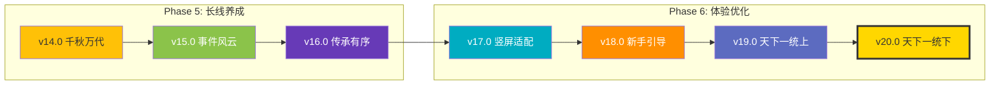

# 三国霸业 — 20 版本开发路线图

> **创建日期**: 2026-04-17  
> **更新日期**: 2026-04-22  
> **目标**: 将三国霸业从"UI展示"升级为"完整可玩游戏"  
> **原则**: 每个版本必须可独立运行、核心循环连通、Vercel可构建、评测师可验证

---

## 一、20版本总览

| 版本 | 代号 | 核心目标 | 关键交付 | 预估迭代 |
|:----:|------|---------|---------|:--------:|
| v1.0 | 基业初立 | 资源+建筑+核心循环 | 4资源实时产出+8建筑升级+主界面交互 | 5~8轮 |
| v2.0 | 招贤纳士 | 武将系统 | 武将招募+列表+升级+派遣加成 | 5~8轮 |
| v3.0 | 攻城略地-上 | 关卡+战斗 | 关卡地图+自动战斗+战利品+解锁 | 5~8轮 |
| v4.0 | 攻城略地-下 | 战斗深化+科技树+武将突破 | 战斗深化+扫荡+科技系统+武将升星 | 5~8轮 |
| v5.0 | 百家争鸣 | 科技深化+世界地图 | 科技系统深化+世界地图+领土系统+攻城战 | 5~8轮 |
| v6.0 | 天下大势 | 地图深化+NPC+事件基础 | 世界地图深化+NPC交互/好感度+事件系统基础 | 5~8轮 |
| v7.0 | 草木皆兵 | NPC巡逻+事件深化+任务系统 | NPC巡逻/赠送/切磋+连锁事件+任务系统 | 5~8轮 |
| v8.0 | 商贸繁荣 | 商店+贸易+货币 | 商店系统(含基础购买)+贸易路线+货币体系 | 5~8轮 |
| v9.0 | 离线收益 | 离线收益+邮件 | 离线收益深化+邮件系统+收益上限 | 5~8轮 |
| v10.0 | 兵强马壮 | 装备系统 | 装备系统+武将装备栏+铁匠铺 | 5~8轮 |
| v11.0 | 群雄逐鹿 | PvP竞技+社交 | 竞技场+好友+聊天+排行榜 | 4~5轮 |
| v12.0 | 远征天下 | 远征+排行榜 | 远征系统+排行榜+联盟基础 | 4~5轮 |
| v13.0 | 联盟争霸 | 联盟深化+赛季+活动基础 | 联盟系统+赛季竞技+活动框架 | 4~5轮 |
| v14.0 | 千秋万代 | 声望转生+成就+任务 | 声望系统+转生机制+成就+任务深化 | 4~5轮 |
| v15.0 | 事件风云 | 事件深化+活动深化 | 连锁事件+限时机遇+活动商店+签到 | 4~5轮 |
| v16.0 | 传承有序 | 羁绊+装备强化+军师推荐 | 武将羁绊+套装系统+强化+军师建议 | 4~5轮 |
| v17.0 | 竖屏适配 | 手机端完整适配 | 响应式布局+触控优化+手机端设置 | 4~5轮 |
| v18.0 | 新手引导 | 完整新手教程 | 6+6步引导+8段剧情+遮罩高亮+跳过重玩 | 4~5轮 |
| v19.0 | 天下一统(上) | 全局打磨 | 设置完善+音频+存档+动画规范 | 4~5轮 |
| v20.0 | 天下一统(下) | 最终验收 | 全功能联调+数值平衡+性能优化+终审 | 5轮 |

**总计预估迭代轮数: 90~120轮**

---

## 二、六大阶段依赖图

### Phase 1: 核心框架 (v1.0 ~ v4.0) — 基石
```
v1.0 资源+建筑 → v2.0 武将 → v3.0 战斗 → v4.0 科技+突破
```
**目标**: 建立核心游戏循环，玩家可以挂机→升级→战斗→研究

### Phase 2: 世界探索 (v5.0 ~ v7.0) — 扩展
```
v4.0 → v5.0 科技深化+地图 → v6.0 地图深化+NPC+事件 → v7.0 NPC巡逻+事件深化+任务
```
**目标**: 扩展游戏世界，增加探索和交互深度

### Phase 3: 经济体系 (v8.0 ~ v10.0) — 经济
```
v7.0 → v8.0 商店+贸易+货币 → v9.0 离线+邮件 → v10.0 装备
```
**目标**: 完善经济循环，加入装备养成线

### Phase 4: 社交竞技 (v11.0 ~ v13.0) — 社交
```
v10.0 → v11.0 PvP+好友 → v12.0 远征+排行 → v13.0 联盟+赛季+活动
```
**目标**: 构建社交和竞技玩法，增加玩家粘性

### Phase 5: 长线养成 (v14.0 ~ v16.0) — 长线
```
v13.0 → v14.0 声望+转生 → v15.0 事件深化+活动深化 → v16.0 羁绊+强化+军师
```
**目标**: 建立长线养成循环，转生系统提供重玩价值

### Phase 6: 体验优化 (v17.0 ~ v20.0) — 打磨
```
v16.0 → v17.0 竖屏适配 → v18.0 新手引导 → v19.0 全局打磨 → v20.0 最终验收
```
**目标**: 全面优化体验，达到发布品质

---

## 三、版本依赖 Mermaid 图

```mermaid
graph TD
    V1[v1.0 基业初立<br/>资源+建筑] --> V2[v2.0 招贤纳士<br/>武将系统]
    V2 --> V3[v3.0 攻城略地-上<br/>关卡+战斗]
    V3 --> V4[v4.0 攻城略地-下<br/>战斗深化+科技]
    V4 --> V5[v5.0 百家争鸣<br/>科技深化+地图]
    V5 --> V6[v6.0 天下大势<br/>地图深化+NPC+事件]
    V6 --> V7[v7.0 草木皆兵<br/>NPC巡逻+事件+任务]
    V7 --> V8[v8.0 商贸繁荣<br/>商店+贸易]
    V8 --> V9[v9.0 离线收益<br/>离线+邮件]
    V9 --> V10[v10.0 兵强马壮<br/>装备系统]
    V10 --> V11[v11.0 群雄逐鹿<br/>PvP+社交]
    V11 --> V12[v12.0 远征天下<br/>远征+排行]
    V12 --> V13[v13.0 联盟争霸<br/>联盟+赛季]
    V13 --> V14[v14.0 千秋万代<br/>声望+转生]
    V14 --> V15[v15.0 事件风云<br/>事件+活动深化]
    V15 --> V16[v16.0 传承有序<br/>羁绊+强化+军师]
    V16 --> V17[v17.0 竖屏适配<br/>手机端适配]
    V17 --> V18[v18.0 新手引导<br/>完整教程]
    V18 --> V19[v19.0 天下一统上<br/>全局打磨]
    V19 --> V20[v20.0 天下一统下<br/>最终验收]

    style V1 fill:#4CAF50,color:#fff
    style V2 fill:#2196F3,color:#fff
    style V3 fill:#F44336,color:#fff
    style V4 fill:#9C27B0,color:#fff
    style V5 fill:#FF9800,color:#fff
    style V6 fill:#00BCD4,color:#fff
    style V7 fill:#E91E63,color:#fff
    style V8 fill:#795548,color:#fff
    style V9 fill:#607D8B,color:#fff
    style V10 fill:#FF5722,color:#fff
    style V11 fill:#3F51B5,color:#fff
    style V12 fill:#009688,color:#fff
    style V13 fill:#CDDC39,color:#333
    style V14 fill:#FFC107,color:#333
    style V15 fill:#8BC34A,color:#fff
    style V16 fill:#673AB7,color:#fff
    style V17 fill:#00ACC1,color:#fff
    style V18 fill:#FF8F00,color:#fff
    style V19 fill:#5C6BC0,color:#fff
    style V20 fill:#FFD700,color:#333,stroke:#333,stroke-width:3px
```



---

## 四、模块→版本覆盖矩阵

| 模块 | v1 | v2 | v3 | v4 | v5 | v6 | v7 | v8 | v9 | v10 | v11 | v12 | v13 | v14 | v15 | v16 | v17 | v18 | v19 | v20 |
|------|:--:|:--:|:--:|:--:|:--:|:--:|:--:|:--:|:--:|:---:|:---:|:---:|:---:|:---:|:---:|:---:|:---:|:---:|:---:|:---:|
| NAV  | ◐  |    |    |    |    |    |    |    |    |     |     |     |     |     |     |     | ●   |     |     |     |
| MAP  |    |    |    |    | ●  | ●  |    |    |    |     |     |     |     |     |     |     |     |     |     |     |
| CBT  |    |    | ●  | ●  |    |    |    |    |    |     |     |     |     |     |     |     |     |     |     |     |
| HER  |    | ●  |    | ●  |    |    |    |    |    | ●   |     |     |     |     |     | ●   |     |     |     |     |
| TEC  |    |    |    | ●  | ●  |    |    |    |    |     |     |     |     |     |     |     |     |     |     |     |
| BLD  | ●  |    |    |    |    |    |    |    |    |     |     |     |     |     |     |     |     |     |     |     |
| PRS  |    |    |    |    |    |    |    |    |    |     |     |     |     | ●   |     | ●   |     |     |     |     |
| RES  | ●  |    |    |    |    |    |    |    | ◐  |     |     |     |     |     |     |     |     |     |     |     |
| NPC  |    |    |    |    |    | ●  | ●  |    |    |     |     |     |     |     |     |     |     |     |     |     |
| EVT  |    |    |    |    |    | ●  | ●  |    |    |     |     |     |     |     | ●   |     |     |     |     |     |
| QST  |    |    |    |    |    |    | ●  |    |    |     |     |     |     | ●   |     |     |     |     |     |     |
| ACT  |    |    |    |    |    |    |    |    |    |     |     |     | ●   | ●   | ●   |     |     |     |     |     |
| MAL  |    |    |    |    |    |    |    |    | ●  |     |     |     |     |     |     |     |     |     |     |     |
| SHP  |    |    |    |    |    |    |    | ●  |    |     |     |     |     |     |     |     |     |     |     |     |
| EQP  |    |    |    |    |    |    |    |    |    | ●   |     |     |     |     |     | ●   |     |     |     |     |
| EXP  |    |    |    |    |    |    |    |    |    |     |     | ●   |     |     |     |     |     |     |     |     |
| SOC  |    |    |    |    |    |    |    |    |    |     | ●   | ●   | ●   |     |     |     |     |     |     |     |
| PVP  |    |    |    |    |    |    |    |    |    |     | ●   |     | ●   |     |     |     |     |     |     |     |
| TRD  |    |    |    |    |    |    |    | ●  |    |     |     |     |     |     |     |     |     |     |     |     |
| SET  |    |    |    |    |    |    |    |    |    |     |     |     |     |     |     |     | ●   | ◐   | ●   |     |
| TUT  |    |    |    |    |    |    |    |    |    |     |     |     |     |     |     | ●   |     | ●   |     |     |
| OFR  |    |    |    |    |    |    |    |    | ●  |     |     |     |     |     |     |     |     |     |     |     |
| SPEC | ◐  |    |    |    |    |    |    |    |    |     |     |     |     |     |     |     |     |     |     | ●   |
| ITR  |    |    |    |    |    |    |    |    |    |     |     |     |     |     |     |     | ●   |     |     | ●   |
| RSP  |    |    |    |    |    |    |    |    |    |     |     |     |     |     |     |     | ●   |     |     |     |
| ANI  |    |    |    |    |    |    |    |    |    |     |     |     |     |     |     |     |     |     | ●   |     |
| CUR  |    |    |    |    |    |    |    | ●  |    |     |     |     |     |     |     |     |     |     |     |     |

> ● = 完整覆盖 | ◐ = 部分覆盖 | 空白 = 未覆盖

---

## 五、开发流程规范

> 已剥离为独立文档：[开发流程规范](../process/development-workflow.md)

---

## 六、功能点统计

### 按版本统计

| 版本 | 功能点数 | P0 | P1 | P2 | 新增子系统 |
|:----:|:-------:|:--:|:--:|:--:|:---------:|
| v1.0 | ~25 | 18 | 5 | 2 | 4 |
| v2.0 | ~18 | 14 | 3 | 1 | 3 |
| v3.0 | ~20 | 16 | 3 | 1 | 4 |
| v4.0 | ~14 | 10 | 3 | 1 | 2 |
| v5.0 | ~20 | 15 | 4 | 1 | 3 |
| v6.0 | ~18 | 13 | 4 | 1 | 3 |
| v7.0 | 21 | 14 | 5 | 2 | 5 |
| v8.0 | 22 | 16 | 4 | 2 | 5 |
| v9.0 | ~18 | 13 | 4 | 1 | 3 |
| v10.0 | ~16 | 12 | 3 | 1 | 3 |
| v11.0 | 18 | 13 | 4 | 1 | 6 |
| v12.0 | 17 | 12 | 4 | 1 | 5 |
| v13.0 | 17 | 11 | 5 | 1 | 5 |
| v14.0 | 18 | 12 | 5 | 1 | 5 |
| v15.0 | 19 | 13 | 5 | 1 | 8 |
| v16.0 | 20 | 13 | 6 | 1 | 7 |
| v17.0 | 18 | 12 | 5 | 1 | 4 |
| v18.0 | 18 | 13 | 4 | 1 | 5 |
| v19.0 | 32 | 16 | 13 | 3 | 11 |
| v20.0 | 16 | 13 | 2 | 1 | 4 |
| **合计** | **~359** | **~251** | **~83** | **~21** | **~87** |

### 按模块统计（v15~v20新增覆盖）

| 模块 | v15~v20新增功能点 | 核心版本 |
|------|:----------------:|---------|
| EVT  | 13 | v15.0 |
| ACT  | 6 | v15.0 |
| HER  | 3 | v16.0 |
| EQP  | 10 | v16.0 |
| TUT  | 12 | v18.0 |
| PRS  | 3 | v16.0 |
| RSP  | 7 | v17.0 |
| ITR  | 4 | v17.0 |
| SET  | 17 | v19.0 |
| ANI  | 3 | v19.0 |
| NAV  | 2 | v17.0 |
| 全局  | 16 | v20.0 |

---

## 七、文件结构

```
docs/games/three-kingdoms/architecture/
├── version-roadmap.md             # 本文件 - 20版本总路线图
├── feature-inventory.md           # 功能清单总览
│
├── # Phase 1: 核心框架
├── v1.0-基业初立.md               # v1.0 资源+建筑
├── v2.0-招贤纳士.md               # v2.0 武将系统
├── v3.0-攻城略地-上.md            # v3.0 关卡+战斗
├── v4.0-攻城略地-下.md            # v4.0 战斗深化+科技
│
├── # Phase 2: 世界探索
├── v5.0-百家争鸣.md               # v5.0 科技深化+地图
├── v6.0-天下大势.md               # v6.0 地图深化+NPC+事件
├── v7.0-草木皆兵.md               # v7.0 NPC巡逻+事件+任务
│
├── # Phase 3: 经济体系
├── v8.0-商贸繁荣.md               # v8.0 商店+贸易+货币
├── v9.0-离线收益.md               # v9.0 离线+邮件
├── v10.0-兵强马壮.md              # v10.0 装备系统
│
├── # Phase 4: 社交竞技
├── v11.0-群雄逐鹿.md              # v11.0 PvP+社交
├── v12.0-远征天下.md              # v12.0 远征+排行
├── v13.0-联盟争霸.md              # v13.0 联盟+赛季
│
├── # Phase 5: 长线养成
├── v14.0-千秋万代.md              # v14.0 声望+转生
├── v15.0-事件风云.md              # v15.0 事件深化+活动深化
├── v16.0-传承有序.md              # v16.0 羁绊+强化+军师
│
├── # Phase 6: 体验优化
├── v17.0-竖屏适配.md              # v17.0 手机端适配
├── v18.0-新手引导.md              # v18.0 完整教程
├── v19.0-天下一统-上.md           # v19.0 全局打磨
├── v20.0-天下一统-下.md           # v20.0 最终验收
│
├── reviews/                        # 评测报告目录
│   ├── v1.0-r1-review.md
│   ├── v1.0-r2-review.md
│   └── ...
└── changelog.md                    # 变更日志
```

---

## 八、v15~v20 版本间依赖关系



---

## 九、关键里程碑

| 里程碑 | 版本 | 达成标准 |
|--------|:----:|---------|
| 🏗️ 核心循环可玩 | v4.0 | 资源→建筑→武将→战斗→科技循环连通 |
| 🗺️ 世界可探索 | v7.0 | 地图+NPC+事件+任务系统完整 |
| 💰 经济可运转 | v10.0 | 商店+贸易+离线+装备循环健康 |
| ⚔️ 社交可互动 | v13.0 | PvP+好友+联盟+远征+活动完整 |
| 🔄 转生可循环 | v16.0 | 声望+转生+羁绊+强化+军师完整 |
| 📱 全平台可用 | v17.0 | PC+手机+平板全平台适配 |
| 🎓 新手可上手 | v18.0 | 完整引导+剧情+跳过+重玩 |
| ✅ 游戏可发布 | v20.0 | 全功能验收≥9分+性能达标+平衡性验证 |

---

*三国霸业 20版本开发路线图 v2.1 | 2026-04-22 | 覆盖26模块，修复P1问题*
