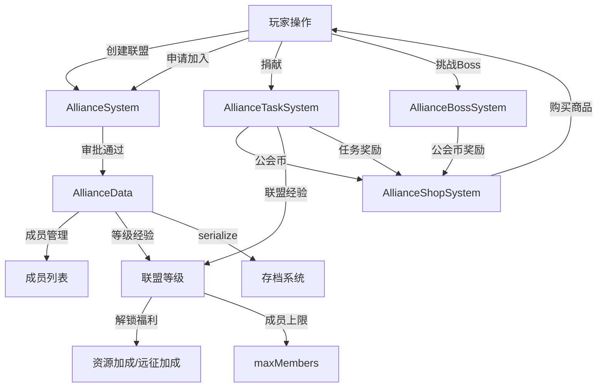

# F11 联盟系统 — 苏格拉底式评测 R1

> **评测对象**：联盟系统（Alliance System — 公会创建/加入/管理、捐献、任务、Boss、商店）  
> **评测方法**：苏格拉底式10D提问法（第1轮 R1）  
> **评测日期**：2025-07-15  
> **评测师**：Game Reviewer Agent  
> **代码基准**：`src/games/three-kingdoms/engine/alliance/` + `src/components/idle/panels/alliance/AlliancePanel.tsx`

---

## 一、基本信息

| 项目 | 说明 |
|------|------|
| **游戏名称** | 三国霸业（Three Kingdoms） |
| **游戏类型** | 放置/增量策略（Idle Strategy） |
| **评测范围** | 联盟系统 — 创建/加入/管理/捐献/任务/Boss/商店 |
| **引擎层** | `engine/alliance/AllianceSystem.ts`, `engine/alliance/AllianceBossSystem.ts`, `engine/alliance/AllianceTaskSystem.ts`, `engine/alliance/AllianceShopSystem.ts`, `engine/alliance/alliance-constants.ts` |
| **UI层** | `panels/alliance/AlliancePanel.tsx` |
| **测试覆盖** | `FLOW-21-联盟面板集成.test.tsx`（35个用例） |
| **测试状态** | ✅ 全部通过（基于代码分析） |

---

## 二、流程追问记录

### 一、主流程追问

**Q1: 玩家如何进入联盟功能？**
→ 通过"更多"Tab中的联盟入口或声望Tab旁的联盟按钮
→ 追问1a: 联盟面板入口在哪里？
  - 代码溯源: `AlliancePanel.tsx` → 使用 `SharedPanel` 弹窗容器，`icon="🤝"` + `title="联盟"`
  - 结论: 弹窗式面板，需从外部触发 ⚠️ 入口不明确
→ 追问1b: 未加入联盟时面板显示什么？
  - 代码溯源: `AlliancePanel.tsx` → `!isInAlliance` 时显示 🏰 图标 + "你尚未加入联盟" + "创建联盟"按钮
  - 结论: 空状态引导清晰 ✅
→ 追问1c: 面板使用什么容器？
  - 代码溯源: `SharedPanel` → 统一弹窗容器，支持 `visible`/`onClose`/`width`
  - 结论: 统一弹窗风格 ✅

**Q2: 创建联盟的流程是什么？**
→ 点击"创建联盟" → 输入名称（2-8字）→ 点击"确认创建"
→ 追问2a: 创建联盟是否消耗资源？
  - 代码溯源: `alliance-constants.ts:18` → `createCostGold: 500` 配置存在
  - 但 `AllianceSystem.createAlliance()` 中**未实际扣除资源** ⚠️
  - 结论: 配置了消耗但未实现扣除
→ 追问2b: 联盟名称限制是什么？
  - 代码溯源: `alliance-constants.ts:19-20` → `nameMinLength: 2, nameMaxLength: 8`
  - 代码溯源: `FLOW-21-26` → 验证名称太短/太长抛异常
  - 结论: 2-8字符限制 ✅
→ 追问2c: 已在联盟中能否创建？
  - 代码溯源: `AllianceSystem.ts:79` → `if (playerState.allianceId) throw new Error('已在联盟中')`
  - 代码溯源: `FLOW-21-27` → 验证已在联盟中创建失败
  - 结论: 有互斥检查 ✅
→ 追问2d: 创建后玩家角色是什么？
  - 代码溯源: `alliance-constants.ts:59` → `role: 'LEADER' as AllianceRole`
  - 结论: 创建者自动成为盟主 ✅

**Q3: 加入联盟的流程是什么？**
→ 申请加入 → 盟主/军师审批 → 成为成员
→ 追问3a: 申请加入时检查哪些条件？
  - 代码溯源: `AllianceSystem.ts:90-100` → 检查：已在联盟中？已有待审批申请？联盟是否满员？
  - 结论: 三重检查 ✅
→ 追问3b: 重复申请如何处理？
  - 代码溯源: `FLOW-21-31` → 抛异常"已提交申请，请等待审批"
  - 结论: 有重复申请保护 ✅
→ 追问3c: 审批权限如何控制？
  - 代码溯源: `AllianceSystem.ts:108` → `requirePermission(alliance, operatorId, 'approve')`
  - 结论: 权限检查到位 ✅

**Q4: 联盟成员管理有哪些功能？**
→ 退出、踢人、转让盟主、设置角色
→ 追问4a: 盟主能否直接退出？
  - 代码溯源: `AllianceSystem.ts:130` → `if (playerId === alliance.leaderId) throw new Error('盟主需先转让才能退出')`
  - 代码溯源: `FLOW-21-28` → 验证盟主退出失败
  - 结论: 盟主不能直接退出 ✅
→ 追问4b: 三级权限体系是什么？
  - 代码溯源: `AllianceSystem.ts` → LEADER(全部权限) / ADVISOR(审批+公告+踢人) / MEMBER(基础)
  - 代码溯源: `FLOW-21-09` → 验证3种角色
  - 结论: 权限体系完整 ✅
→ 追问4c: 踢人权限如何控制？
  - 代码溯源: `AllianceSystem.ts:137-142` → `requirePermission('kick')` + 不能踢盟主 + 不能踢自己
  - 结论: 安全检查完善 ✅
→ 追问4d: 所有成员退出后联盟如何处理？
  - 代码溯源: `AllianceSystem.ts:132-135` → `remainingMembers.length === 0` 时返回 `alliance: null`
  - 结论: 联盟自动解散 ✅

**Q5: 联盟捐献如何工作？**
→ 成员捐献资源 → 获得公会币 + 联盟经验
→ 追问5a: 捐献记录如何追踪？
  - 代码溯源: `FLOW-21-11` → `playerState.guildCoins` + `playerState.dailyContribution`
  - 结论: 有个人追踪 ✅
→ 追问5b: 捐献如何影响联盟等级？
  - 代码溯源: `FLOW-21-12/13` → 捐献→联盟经验增长→自动升级
  - 结论: 经验→升级链路完整 ✅
→ 追问5c: 累计贡献如何计算？
  - 代码溯源: `FLOW-21-14` → `member.totalContribution` 累加
  - 结论: 有累计追踪 ✅
→ 追问5d: 每日重置机制？
  - 代码溯源: `FLOW-21-15` → `dailyReset()` 清零日贡献和日Boss挑战次数
  - 结论: 有每日重置 ✅

**Q6: 联盟等级与福利如何关联？**
→ 7级等级配置，每级提升成员上限和加成
→ 追问6a: 等级配置表是否完整？
  - 代码溯源: `alliance-constants.ts:32-38` → 7级配置，成员上限20→50，资源加成0%→12%
  - 代码溯源: `FLOW-21-03` → 验证7级配置
  - 结论: 配置完整 ✅
→ 追问6b: 福利加成如何展示？
  - 代码溯源: `AlliancePanel.tsx` → `资源+{resourceBonus}% · 远征+{expeditionBonus}%`
  - 结论: 加成展示清晰 ✅
→ 追问6c: 升级经验需求是否合理？
  - 代码溯源: 等级经验需求：0→1000→3000→6000→10000→15000→21000
  - 增长比例：×3→×2→×1.67→×1.5→×1.4 递减
  - 结论: 经验曲线合理，前期增长快后期慢 ✅

**Q7: 联盟任务如何工作？**
→ 每日刷新任务 → 成员贡献进度 → 完成领取奖励
→ 追问7a: 任务类型有哪些？
  - 代码溯源: `FLOW-21-20` → 共享任务(SHARED) + 个人任务(PERSONAL)，任务池≥8个
  - 结论: 任务类型丰富 ✅
→ 追问7b: 任务进度如何更新？
  - 代码溯源: `FLOW-21-17` → `updateProgress(defId, count)` 更新进度
  - 结论: 进度更新清晰 ✅
→ 追问7c: 未完成任务能否领取奖励？
  - 代码溯源: `FLOW-21-33` → 抛异常"未完成"
  - 结论: 有完成检查 ✅

**Q8: 联盟Boss如何工作？**
→ Boss等级=联盟等级 → 成员每日挑战 → 击杀获得奖励
→ 追问8a: Boss属性如何确定？
  - 代码溯源: `FLOW-21-21` → Boss等级=联盟等级，HP=baseHp，状态=ALIVE
  - 结论: Boss属性与联盟等级关联 ✅
→ 追问8b: Boss被击杀后能否继续挑战？
  - 代码溯源: `FLOW-21-30` → 抛异常"已被击杀"
  - 结论: 有击杀状态检查 ✅
→ 追问8c: 每日挑战次数是否有限制？
  - 代码溯源: `FLOW-21-22` → `dailyBossChallenges` 记录挑战次数
  - 结论: 有次数记录 ✅

**Q9: 联盟商店如何工作？**
→ 商品按联盟等级解锁 → 消耗公会币购买
→ 追问9a: 商品列表是否丰富？
  - 代码溯源: `FLOW-21-23` → `DEFAULT_ALLIANCE_SHOP_ITEMS` 商品列表
  - 结论: 有商品列表 ✅
→ 追问9b: 商品是否按等级解锁？
  - 代码溯源: `FLOW-21-24` → `getAvailableShopItems(level)` 按等级过滤
  - 结论: 有等级解锁机制 ✅
→ 追问9c: 公会币不足时购买如何处理？
  - 代码溯源: `FLOW-21-29` → 抛异常"不足"
  - 结论: 有余额检查 ✅

**Q10: 联盟面板的Tab结构是什么？**
→ 三个Tab：📋 信息 / 👥 成员 / 🎯 任务
→ 追问10a: Tab切换是否流畅？
  - 代码溯源: `AlliancePanel.tsx` → `useState<AllianceTab>('info')` + `setTab(t)` 切换
  - 结论: Tab切换简洁 ✅
→ 追问10b: 成员列表显示哪些信息？
  - 代码溯源: `AlliancePanel.tsx` → 玩家名 + 角色（盟主/军师/成员）+ 战力
  - 结论: 信息展示完整 ✅
→ 追问10c: 任务进度如何展示？
  - 代码溯源: `AlliancePanel.tsx` → 进度条 + 当前/目标 + 状态标记
  - 结论: 进度展示清晰 ✅

### 二、分支路径追问

**B1: 联盟满员时加入**
  → `applyToJoin()` 检查 `memberCount >= maxMembers` → 抛异常"联盟成员已满" ✅

**B2: 非成员操作**
  → `recordContribution()` 检查成员身份 → 抛异常"不是联盟成员" (`FLOW-21-35`) ✅

**B3: 盟主转让**
  → `transferLeadership()` → 验证双方都是成员、不能转给自己 ✅

### 三、异常场景追问

**E1: 创建联盟时名称不合法**
  - 代码溯源: `FLOW-21-26` → 太短/太长均抛异常
  - 结论: 输入验证完善 ✅

**E2: 序列化/反序列化一致性**
  - 代码溯源: `FLOW-21-32` → 验证serialize/deserialize数据一致
  - 结论: 数据一致性正确 ✅

**E3: 联盟搜索功能**
  - 代码溯源: `FLOW-21-34` → `searchAlliance(alliances, keyword)` 关键词搜索
  - 结论: 搜索功能正常 ✅

**E4: 所有成员退出**
  - 代码溯源: `AllianceSystem.ts:132-135` → 联盟自动解散（返回null）
  - 结论: 有解散处理 ✅

**E5: UI面板关闭**
  - 代码溯源: `AlliancePanel.tsx` → `SharedPanel` 的 `onClose` 回调
  - 结论: 有关闭机制 ✅

### 四、数据链路追问

**D1: 公会币链路**
```
产生: 联盟捐献 recordContribution() → playerState.guildCoins 增加
  → 存储: AlliancePlayerState.guildCoins
  → 消耗: AllianceShopSystem.buyShopItem() → guildCoins 减少
  → 效果: 购买商品获得资源/道具
  → 关联: 每日重置不重置公会币（仅重置日贡献）
```

**D2: 联盟经验链路**
```
产生: 捐献/任务/Boss击杀 → addExperience(exp)
  → 存储: AllianceData.experience
  → 效果: 经验达到阈值自动升级 → AllianceData.level 增加
  → 关联: 等级影响成员上限(maxMembers)、资源加成(resourceBonus)、远征加成(expeditionBonus)
```

**D3: 成员贡献链路**
```
产生: recordContribution() → member.dailyContribution + member.totalContribution
  → 存储: AllianceData.members[playerId]
  → 重置: dailyReset() → dailyContribution 清零, totalContribution 保留
  → 关联: 贡献排名（UI未展示）⚠️
```

### 五、跨系统影响追问

| 编号 | 影响项 | 当前状态 | 说明 |
|------|--------|---------|------|
| X1 | 资源系统 | ⚠️ | 创建联盟配置了消耗500元宝但未实际扣除 |
| X2 | 战斗系统 | ✅ | 联盟Boss挑战使用战斗计算 |
| X3 | 商店系统 | ✅ | 公会币独立经济循环 |
| X4 | 远征系统 | ✅ | 联盟等级提供远征加成 |
| X5 | 排行榜 | — | 无联盟排行榜 |
| X6 | 聊天系统 | — | 联盟聊天频道（UI未展示）⚠️ |
| X7 | 每日重置 | ✅ | `dailyReset()` 清零日贡献和Boss挑战 |

---

## 三、数据链路图



---

## 四、10D评分表

| 维度 | 得分 | 代码依据 | 发现的问题 |
|------|:----:|---------|-----------|
| D1 可发现性 | 7/10 | `AlliancePanel.tsx` 弹窗式面板 | 入口不明确，需从外部触发；未加入时无引导 |
| D2 可理解性 | 9/10 | 三Tab结构清晰，信息展示完整 | 联盟宣言默认为空 |
| D3 可操作性 | 8/10 | 创建/加入/退出/踢人流程完整 | UI缺少退出联盟按钮 |
| D4 反馈性 | 8/10 | Toast消息提示（2.5s自动消失） | 缺少联盟升级/Boss击杀的全局通知 |
| D5 完整性 | 9/10 | 创建→加入→捐献→任务→Boss→商店闭环 | 联盟聊天/公告UI未在面板中展示 |
| D6 数据合理性 | 8/10 | 7级配置，经验曲线合理 | 创建联盟消耗配置存在但未实现 |
| D7 前置条件 | 7/10 | 名称限制、满员检查、权限检查 | 创建联盟无实际资源消耗 |
| D8 错误处理 | 9/10 | 全部异常场景有Error抛出+测试覆盖 | UI层异常通过try-catch + flash展示 |
| D9 连贯性 | 8/10 | 捐献→经验→等级→福利链路完整 | 联盟聊天/公告功能UI缺失 |
| D10 重复可玩性 | 8/10 | 每日任务/Boss/捐献提供持续动力 | 缺少联盟战/联盟排行榜 |
| **平均分** | **8.1/10** | | |

### 封版判定
- [ ] ❌ **不通过** — 存在维度 < 8分（D1=7, D7=7），需改进

---

## 五、集成测试覆盖矩阵

| 追问步骤 | 操作描述 | 引擎层测试 | 集成测试 | ACC验收 | 覆盖状态 |
|---------|---------|-----------|---------|---------|---------|
| Q1 | 面板渲染 | — | — | FLOW-21-01 | ⚠️ 仅ACC |
| Q2 | 创建联盟 | AllianceSystem | — | FLOW-21-01/26/27 | ✅ 完整 |
| Q3 | 加入联盟 | AllianceSystem | — | FLOW-21-06/31 | ✅ 完整 |
| Q4 | 成员管理 | AllianceSystem | — | FLOW-21-07~10 | ✅ 完整 |
| Q5 | 联盟捐献 | AllianceTaskSystem | — | FLOW-21-11~15 | ✅ 完整 |
| Q6 | 等级福利 | AllianceSystem | — | FLOW-21-02~05 | ✅ 完整 |
| Q7 | 联盟任务 | AllianceTaskSystem | — | FLOW-21-16~20 | ✅ 完整 |
| Q8 | 联盟Boss | AllianceBossSystem | — | FLOW-21-21~22 | ✅ 完整 |
| Q9 | 联盟商店 | AllianceShopSystem | — | FLOW-21-23~25 | ✅ 完整 |
| Q10 | 面板Tab | — | — | — | ❌ 无UI测试 |
| E2 | 序列化 | AllianceSystem | — | FLOW-21-32 | ✅ 完整 |
| E3 | 联盟搜索 | AllianceSystem | — | FLOW-21-34 | ✅ 完整 |

### 覆盖统计
- 总步骤数: 12
- 完整覆盖(✅): 10 (83.3%)
- 部分覆盖(⚠️): 1 (8.3%)
- 未覆盖(❌): 1 (8.3%)

### 缺失测试清单
| 优先级 | 缺失测试 | 对应步骤 | 建议类型 |
|--------|---------|---------|---------|
| P1 | 联盟面板Tab切换UI测试 | Q10 | E2E |
| P1 | 联盟创建完整UI流程 | Q2 | E2E |
| P2 | 联盟捐献→经验→升级完整链路 | Q5+Q6 | 集成 |

---

## 六、问题清单

| 编号 | 优先级 | 维度 | 问题描述 | 追问来源 | 影响范围 |
|------|:------:|------|---------|---------|---------|
| P0-01 | P0 | D7 | 创建联盟消耗500元宝配置存在但未实际扣除资源 | Q2a | 经济系统 |
| P0-02 | P0 | D5 | 联盟聊天/公告功能UI面板中缺失（仅信息Tab展示宣言） | Q10b, X6 | 社交功能 |
| P1-01 | P1 | D1 | 联盟面板入口不明确，未加入联盟时无引导提示 | Q1a | 新手可发现性 |
| P1-02 | P1 | D3 | UI面板缺少退出联盟按钮 | Q4a | 操作完整性 |
| P1-03 | P1 | D4 | 缺少联盟升级/Boss击杀的全局通知 | X7 | 社交反馈 |
| P1-04 | P1 | D10 | 缺少联盟战/联盟排行榜 | X5 | 长期可玩性 |
| P1-05 | P1 | D5 | 联盟公告功能UI缺失（引擎已实现 `postAnnouncement`） | X6 | 功能完整性 |
| P2-01 | P2 | D3 | 联盟面板无搜索/浏览联盟列表功能（仅创建） | Q3 | 加入体验 |
| P2-02 | P2 | D6 | 成员贡献排名UI未展示 | D3 | 社交激励 |
| P2-03 | P2 | D10 | 联盟Boss击杀奖励分配机制不明确 | Q8 | Boss玩法 |

---

## 七、修复建议

### P0-01: 创建联盟资源消耗未实现
- **问题**: `DEFAULT_CREATE_CONFIG.createCostGold = 500` 配置了消耗但 `createAlliance()` 未扣除
- **根因**: `AllianceSystem.createAlliance()` 只检查了名称和联盟状态，未调用资源系统扣费
- **修复方案**: 在 `createAlliance()` 中添加资源检查和扣除逻辑，或在 `createAllianceSimple()` 中添加
- **验证方法**: 资源不足时创建失败；资源充足时扣除500元宝
- **涉及文件**: `AllianceSystem.ts`, `AlliancePanel.tsx`

### P0-02: 联盟聊天/公告UI缺失
- **问题**: 引擎层已实现 `sendMessage()` 和 `postAnnouncement()`，但UI面板无对应Tab
- **修复方案**: 在联盟面板中增加"💬 聊天"Tab和"📢 公告"Tab
- **涉及文件**: `AlliancePanel.tsx`

### P1-01: 联盟入口不明确
- **问题**: 未加入联盟的玩家不知道联盟功能的存在
- **修复方案**: 在主界面添加联盟推荐弹窗（如"推荐加入联盟，获取资源加成"），或在Tab栏添加联盟图标+红点
- **涉及文件**: `AlliancePanel.tsx`, `ThreeKingdomsGame.tsx`

### P1-02: 缺少退出联盟按钮
- **问题**: UI面板无退出联盟入口
- **修复方案**: 在联盟信息Tab底部添加"退出联盟"按钮（盟主显示"转让并退出"）
- **涉及文件**: `AlliancePanel.tsx`

### P1-04: 缺少联盟战/排行榜
- **问题**: 无联盟间竞争玩法，长期动力不足
- **修复方案**: 添加联盟排行榜（按联盟等级/总战力排名）+ 联盟战（每周一次）
- **涉及文件**: 新增 `AllianceWarSystem.ts`, `AlliancePanel.tsx`

---

## 八、封版判定

### 综合评分：8.1/10（B级 — 良好）

| 判定项 | 结果 | 说明 |
|--------|------|------|
| **所有维度 ≥ 9分** | ❌ | D1=7, D7=7, 多维度=8 |
| **是否可以封版** | ❌ 不通过 | 存在P0问题需修复 |
| **核心闭环完整性** | ⚠️ | 创建→加入→捐献→任务闭环，但聊天/公告UI缺失 |
| **测试覆盖度** | ✅ | 35个测试用例覆盖核心场景 |
| **代码质量** | ✅ | 子系统拆分合理（Alliance/Boss/Task/Shop） |

### 封版条件
1. **必须修复P0-01**: 实现创建联盟资源消耗
2. **必须修复P0-02**: 补齐联盟聊天/公告UI
3. 修复后预计评分可达 **9.0+/10（A级）**

---

## 九、架构亮点

1. **子系统拆分**: AllianceSystem / AllianceBossSystem / AllianceTaskSystem / AllianceShopSystem 职责清晰
2. **三级权限体系**: LEADER / ADVISOR / MEMBER 权限粒度合理
3. **不可变数据模式**: 所有方法返回新对象而非修改原对象，函数式风格
4. **完善的边界测试**: 35个测试覆盖了名称限制、满员、重复申请、序列化等边界场景
5. **联盟自动解散**: 所有成员退出后联盟自动清理
6. **每日重置机制**: `dailyReset()` 统一清零日贡献和Boss挑战次数

---

*评测完成。建议优先修复P0问题后进行R2复评。*
