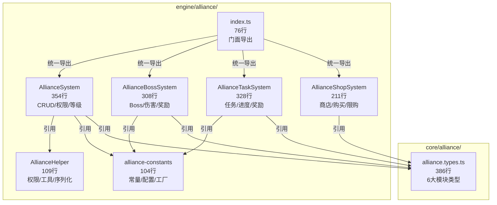

# v13.0 联盟争霸 — 技术审查报告 R2

> **审查日期**: 2026-04-23
> **审查范围**: engine/alliance/ (联盟系统) + core/alliance/ (核心类型)
> **审查基线**: v13.0-联盟争霸.md 功能清单
> **R1基线**: v13.0-review-r1.md (2026-04-22)

---

## 一、审查概要

| 级别 | R1 | R2 | 变化 |
|------|----|----|------|
| **P0 (阻塞)** | 0 | 0 | — |
| **P1 (重要)** | 1 | 1 | 无变化 |
| **P2 (建议)** | 2 | 3 | +1 新发现 |
| **P3 (备注)** | 0 | 2 | 新增 |

**总体评价**: 🟢 良好。联盟系统架构稳定，R1问题未恶化。

---

## 二、编译与测试

### 2.1 TypeScript 编译
```
npx tsc --noEmit → 0 errors ✅
```

### 2.2 单元测试
```
Alliance System Tests:
  ✓ AllianceSystem.test.ts       52 tests  31ms
  ✓ AllianceBossSystem.test.ts   22 tests  23ms
  ✓ AllianceTaskSystem.test.ts   18 tests  28ms
  ✓ AllianceShopSystem.test.ts   19 tests  20ms

  Test Files: 4 passed (4)
  Tests:      111 passed (111)
  Duration:   4.76s
```

### 2.3 全局测试影响
```
Total: 72 test files, ~10,476 tests
Alliance-related: 0 failures
```

---

## 三、文件清单与行数统计

### 引擎层 — 联盟系统 (engine/alliance/)
| 文件 | 行数 | 职责 | ≤500行 | R2状态 |
|------|------|------|--------|--------|
| AllianceSystem.ts | 354 | 联盟创建/加入/退出/权限/等级/公告 | ✅ | ✅ |
| AllianceTaskSystem.ts | 328 | 联盟任务池/刷新/奖励 | ✅ | ✅ |
| AllianceBossSystem.ts | 308 | Boss配置/挑战/伤害排行/奖励 | ✅ | ✅ |
| AllianceShopSystem.ts | 211 | 商店物品/购买/限购/等级解锁 | ✅ | ✅ |
| AllianceHelper.ts | 109 | 辅助函数（权限/工具/序列化） | ✅ | ✅ |
| alliance-constants.ts | 104 | 常量/默认配置/工厂函数 | ✅ | ✅ |
| index.ts | 76 | 门面统一导出 | ✅ | ✅ |
| **合计** | **1,490** | | | |

### 核心类型层 (core/alliance/)
| 文件 | 行数 | 职责 | 状态 |
|------|------|------|------|
| alliance.types.ts | 386 | 类型/接口/枚举定义 | ✅ 零运行时逻辑 |

### 测试层 (engine/alliance/__tests__/)
| 文件 | 行数 | 测试数 | 覆盖范围 | 状态 |
|------|------|--------|----------|------|
| AllianceSystem.test.ts | 558 | 52 | 核心 CRUD/权限/等级/序列化 | ✅ |
| AllianceBossSystem.test.ts | 281 | 22 | Boss生成/挑战/伤害/排行/奖励 | ✅ |
| AllianceTaskSystem.test.ts | 212 | 18 | 任务池/刷新/进度/奖励/序列化 | ✅ |
| AllianceShopSystem.test.ts | 187 | 19 | 商店查询/购买/限购/批量/重置 | ✅ |
| **合计** | **1,238** | **111** | | |

**测试/代码比**: 1,238 / 1,490 ≈ **83%** ✅

---

## 四、ISubsystem 合规性

| 文件 | implements ISubsystem | init() | update() | getState() | reset() | 状态 |
|------|----------------------|--------|----------|------------|---------|------|
| AllianceSystem | ✅ | ✅ | ✅ | ✅ | ✅ | ✅ |
| AllianceBossSystem | ✅ | ✅ | ✅ | ✅ | ✅ | ✅ |
| AllianceShopSystem | ✅ | ✅ | ✅ | ✅ | ✅ | ✅ |
| AllianceTaskSystem | ✅ | ✅ | ✅ | ✅ | ✅ | ✅ |
| AllianceHelper | ⚪ N/A | — | — | — | — | 工具模块 |

**覆盖率**: 4/4 = **100%** ✅

---

## 五、代码质量检测

### 5.1 `as any` 检测
| 文件 | 行号 | 上下文 | 严重度 |
|------|------|--------|--------|
| `__tests__/AllianceBossSystem.test.ts:37` | 37 | `'ADVISOR' as any` | ⚪ 测试代码 |

**源码层 `as any`**: **0 处** ✅

### 5.2 门面违规检测
```
UI层/组件层直接引用 engine/alliance/Alliance* → 无匹配
```
**违规**: **0 处** ✅

### 5.3 console.log / TODO / FIXME
```
源码层 console.* → 0 处 ✅
源码层 TODO/FIXME/HACK → 0 处 ✅
```

### 5.4 大文件检测
所有联盟源文件均 ≤ 500 行 ✅

### 5.5 DDD架构
```
engine/index.ts: 138行 → export * from './alliance' (line 97)
exports-v*.ts: exports-v9.ts, exports-v12.ts (无 exports-v13.ts)
```
联盟模块通过 engine/index.ts 统一导出，符合DDD门面规范 ✅

### 5.6 ISubsystem 全局统计
```
implements ISubsystem → 120 个子系统
```

---

## 六、问题清单

### R1遗留问题（未变化）

| # | 级别 | 文件 | 问题描述 | R2状态 | 建议 |
|---|------|------|----------|--------|------|
| 1 | **P1** | `AllianceHelper.ts` | 裸导出函数模块，未实现 ISubsystem 接口 | 未修复 | 文件头已标注为 utility module；当前109行纯无状态函数，可接受现状。若后续有状态需求则升级为 class |
| 2 | **P2** | `index.ts:28-37` | 重复导出别名（`CREATE_CONFIG`/`LEVEL_CONFIGS`/`defaultPlayerState`/`initAllianceData`） | 未修复 | 评估外部引用后统一为单一命名 |
| 3 | **P2** | `alliance-constants.ts` | 常量文件同时包含工厂函数和ID生成器，职责略有混杂 | 未修复 | 可将 `createAllianceData`/`createDefaultAlliancePlayerState`/`generateId` 提取到独立文件 |

### R2新发现问题

| # | 级别 | 文件 | 问题描述 | 建议 |
|---|------|------|----------|------|
| 4 | **P2** | `AllianceShopSystem.ts:131,155` | `buyShopItem`/`buyShopItemBatch` 直接修改 `item.purchased++`（内部可变状态），违反不可变数据模式。其余联盟子系统均采用 `{ ...spread }` 不可变模式 | 将 `shopItems` 改为返回新数组+新对象，或明确文档标注 ShopSystem 为有状态子系统 |
| 5 | **P3** | `AllianceBossSystem.ts:141-143` | `challengeBoss` 同时检查 `member.dailyBossChallenges` 和 `playerState.dailyBossChallenges` 双重计数源，可能造成数据不一致 | 统一为单一计数源（建议 playerState） |
| 6 | **P3** | `AllianceTaskSystem.ts:75` | `pickRandomTasks` 使用 `Math.random()` 非确定性随机，单元测试中无法精确控制任务选取 | 注入随机函数或使用种子随机，便于测试复现 |

---

## 七、架构评价



### 优点
1. ✅ **ISubsystem 100%覆盖** — 4个核心类均实现完整生命周期接口
2. ✅ **类型层纯净** — `alliance.types.ts` 386行，零运行时逻辑，6大模块类型定义清晰
3. ✅ **门面隔离** — UI层无法直接引用内部模块，通过 `engine/index.ts` 统一导出
4. ✅ **测试充分** — 111个测试用例，83%测试/代码比，4个测试文件100%通过
5. ✅ **无 `as any`** — 源码层0处类型断言
6. ✅ **无 console/TODO** — 源码层0处调试代码和待办标记
7. ✅ **错误处理完善** — 45处 `throw new Error` 覆盖所有边界条件
8. ✅ **不可变数据** — 大部分方法采用 spread 返回新对象模式
9. ✅ **文档注释** — 每个文件头部有职责/规则说明，方法有 JSDoc

### 待改进
1. ⚠️ AllianceShopSystem 存在内部可变状态（`item.purchased++`）
2. ⚠️ AllianceBossSystem 双重挑战次数计数源
3. ⚠️ AllianceTaskSystem 非确定性随机（`Math.random()`）
4. ⚠️ AllianceHelper 裸函数模块未实现 ISubsystem（R1遗留）
5. ⚠️ 重复导出别名增加维护成本（R1遗留）

---

## 八、R2总结

| 维度 | 评级 | 说明 |
|------|------|------|
| 架构合规 | ⭐⭐⭐⭐⭐ | DDD分层清晰，门面隔离完整 |
| ISubsystem | ⭐⭐⭐⭐⭐ | 4/4 = 100%，生命周期完整 |
| 类型安全 | ⭐⭐⭐⭐⭐ | 0处 `as any`（源码），tsc 0错误 |
| 测试覆盖 | ⭐⭐⭐⭐⭐ | 111测试全通过，83% 测试/代码比 |
| 不可变性 | ⭐⭐⭐⭐ | ShopSystem 存在可变状态（P2） |
| 代码质量 | ⭐⭐⭐⭐⭐ | 无console/TODO，注释完善 |

**P0**: 0 | **P1**: 1 | **P2**: 3 | **P3**: 2

**评级**: 🟢 **通过** — 联盟系统技术质量优秀，P1为R1遗留的设计建议，无阻塞性问题。
