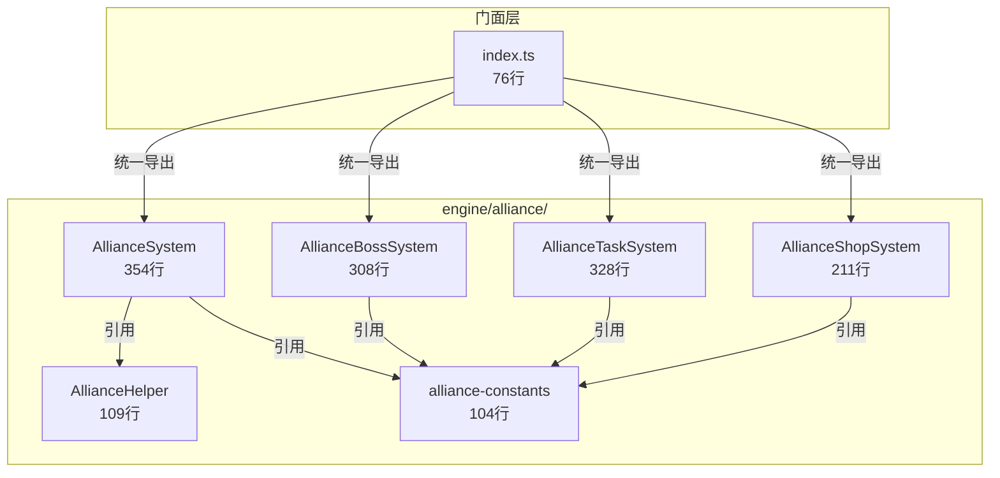

# v13.0 联盟争霸 — 技术审查报告 R1

> **审查日期**: 2025-07-11
> **审查范围**: engine/alliance/ (联盟系统)
> **审查基线**: v13.0-联盟争霸.md 功能清单

---

## 一、审查概要

| 级别 | 数量 | 说明 |
|------|------|------|
| **P0 (阻塞)** | 0 | 无 |
| **P1 (重要)** | 1 | AllianceHelper.ts 为裸导出函数模块，缺少 ISubsystem 封装 |
| **P2 (建议)** | 2 | 重复导出别名、常量文件可进一步拆分 |

**总体评价**: 🟢 良好。联盟系统 4 个核心类均实现 ISubsystem，架构清晰，子系统分工合理，无 `as any`（非测试源码）、无门面违规。

---

## 二、文件清单与行数统计

### 引擎层 — 联盟系统 (engine/alliance/)
| 文件 | 行数 | 职责 | ≤500行 | 状态 |
|------|------|------|--------|------|
| AllianceSystem.ts | 354 | 联盟创建/加入/退出/权限/等级/公告 | ✅ | ✅ |
| AllianceTaskSystem.ts | 328 | 联盟任务池/刷新/奖励 | ✅ | ✅ |
| AllianceBossSystem.ts | 308 | Boss配置/挑战/伤害排行/奖励 | ✅ | ✅ |
| AllianceShopSystem.ts | 211 | 商店物品/购买/限购/等级解锁 | ✅ | ✅ |
| AllianceHelper.ts | 109 | 辅助函数（权限检查/等级计算等） | ✅ | ✅ |
| alliance-constants.ts | 104 | 常量/默认配置/工厂函数 | ✅ | ✅ |
| index.ts | 76 | 门面统一导出 | ✅ | ✅ |
| **合计** | **1,490** | | | |

### 测试层 (engine/alliance/__tests__/)
| 文件 | 行数 | 覆盖范围 | 状态 |
|------|------|----------|------|
| AllianceSystem.test.ts | 558 | 核心 CRUD/权限/等级 | ✅ |
| AllianceTaskSystem.test.ts | 212 | 任务池/刷新/奖励 | ✅ |
| AllianceBossSystem.test.ts | 281 | Boss挑战/伤害/排行 | ✅ |
| AllianceShopSystem.test.ts | 187 | 商店购买/限购 | ✅ |
| **合计** | **1,238** | | |

**测试/代码比**: 1,238 / 1,490 ≈ **83%** ✅

---

## 三、ISubsystem 合规性

| 文件 | implements ISubsystem | init() | reset() | 状态 |
|------|----------------------|--------|---------|------|
| AllianceSystem | ✅ | ✅ | ✅ | ✅ |
| AllianceBossSystem | ✅ | ✅ | ✅ | ✅ |
| AllianceShopSystem | ✅ | ✅ | ✅ | ✅ |
| AllianceTaskSystem | ✅ | ✅ | ✅ | ✅ |
| AllianceHelper | ❌ N/A | — | — | ⚪ 工具模块 |

**覆盖率**: 4/4 = **100%** ✅

---

## 四、代码质量检测

### 4.1 `as any` 检测
| 文件 | 行号 | 上下文 | 严重度 |
|------|------|--------|--------|
| `__tests__/AllianceBossSystem.test.ts` | 37 | `'ADVISOR' as any` | ⚪ 测试代码，可接受 |

**源码层 `as any`**: **0 处** ✅

### 4.2 门面违规检测
```
grep "from.*engine/alliance" src/components/ src/games/three-kingdoms/ui/
→ 无匹配
```
**违规**: **0 处** ✅

### 4.3 大文件检测
所有文件均 ≤ 500 行 ✅

---

## 五、问题清单

| # | 级别 | 文件 | 问题描述 | 建议 |
|---|------|------|----------|------|
| 1 | **P1** | `AllianceHelper.ts` | 裸导出函数模块（`export function`），未实现 ISubsystem 接口，不符合引擎层统一生命周期规范 | 若为纯无状态工具函数可保留现状，但应添加文件头注释明确其为 utility module 而非 subsystem；若后续有状态需求则升级为 class |
| 2 | **P2** | `index.ts:28-37` | 存在重复导出别名（`CREATE_CONFIG` / `LEVEL_CONFIGS` / `defaultPlayerState` / `initAllianceData`），同一符号两个名字增加认知负担 | 评估是否真正需要双名导出，建议统一为单一命名 |
| 3 | **P2** | `alliance-constants.ts` | 常量文件同时包含工厂函数（`createAllianceData`、`createDefaultAlliancePlayerState`）和 ID 生成器（`generateId`），职责略有混杂 | 可将工厂函数提取到独立文件，保持 constants 纯粹 |

---

## 六、架构评价



**优点**:
1. ✅ 4 个子系统均实现 ISubsystem，生命周期管理一致
2. ✅ 常量与类型集中管理在 `alliance-constants.ts` 和 `core/alliance/alliance.types.ts`
3. ✅ 门面 index.ts 导出完整，包含类型和值导出
4. ✅ 无门面违规，UI 层无法直接引用内部模块
5. ✅ 测试覆盖充分（83% 测试/代码比）

**待改进**:
1. ⚠️ AllianceHelper 作为裸函数模块，与引擎层 class 规范不完全一致
2. ⚠️ 重复导出别名增加维护成本
