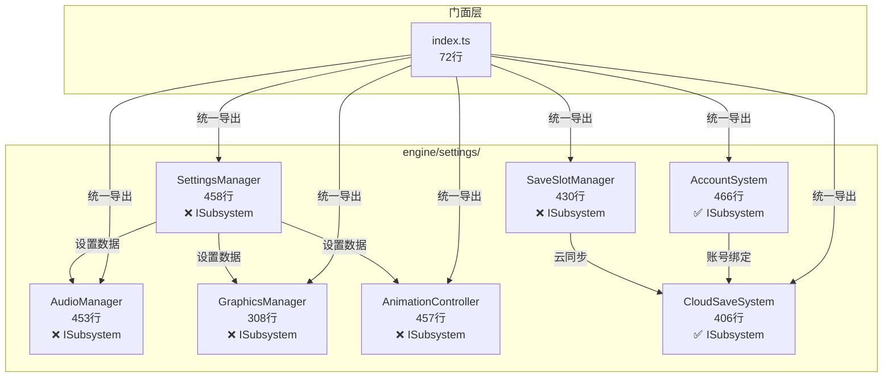

# v14.0 千秋万代 — 技术审查报告 R1

> **审查日期**: 2025-07-11
> **审查范围**: engine/settings/ (设置系统) + engine/cloudsave/ (云存档，已合并入 settings)
> **审查基线**: v14.0-千秋万代.md 功能清单

---

## 一、审查概要

| 级别 | 数量 | 说明 |
|------|------|------|
| **P0 (阻塞)** | 1 | 5/7 引擎类未实现 ISubsystem 接口 |
| **P1 (重要)** | 2 | GraphicsManager 含 `as any` 访问非标准 API；cloudsave 目录缺失（合并入 settings 但无独立模块边界） |
| **P2 (建议)** | 2 | 多文件超 450 行接近阈值；部分类缺少 init()/reset() 生命周期方法 |

**总体评价**: 🟡 需关注。CloudSaveSystem 和 AccountSystem 正确实现了 ISubsystem，但 SettingsManager、AudioManager、GraphicsManager、AnimationController、SaveSlotManager 五个核心类均未实现 ISubsystem，不符合引擎层统一规范。

---

## 二、文件清单与行数统计

### 引擎层 — 设置系统 (engine/settings/)
| 文件 | 行数 | 职责 | ≤500行 | 状态 |
|------|------|------|--------|------|
| AccountSystem.ts | 466 | 账号绑定/解绑/跨设备/删除流程 | ✅ | ✅ |
| SettingsManager.ts | 458 | 4大分类设置统一管理/持久化/变更通知 | ✅ | ⚠️ 接近阈值 |
| AnimationController.ts | 457 | 动画控制/播放队列/事件回调 | ✅ | ⚠️ 接近阈值 |
| AudioManager.ts | 453 | 音效/BGM/音量控制/淡入淡出 | ✅ | ⚠️ 接近阈值 |
| SaveSlotManager.ts | 430 | 存档槽管理/导入导出/云同步 | ✅ | ✅ |
| CloudSaveSystem.ts | 406 | 云存档/自动同步/冲突解决/重试 | ✅ | ✅ |
| GraphicsManager.ts | 308 | 画面预设/高级设置/设备检测 | ✅ | ✅ |
| account.types.ts | 99 | 账号相关类型定义 | ✅ | ✅ |
| cloud-save.types.ts | 97 | 云存档类型/接口定义 | ✅ | ✅ |
| save-slot.types.ts | 62 | 存档槽类型定义 | ✅ | ✅ |
| index.ts | 72 | 门面统一导出 | ✅ | ✅ |
| **合计** | **3,308** | | | |

### 云存档目录 (engine/cloudsave/)
> ⚠️ **不存在**。CloudSaveSystem 已合并入 `engine/settings/` 目录，云存档功能由 `CloudSaveSystem.ts` + `cloud-save.types.ts` 承载。

### 测试层 (engine/settings/__tests__/)
| 文件 | 行数 | 覆盖范围 | 状态 |
|------|------|----------|------|
| AnimationController.test.ts | 447 | 动画控制/播放/事件 | ✅ |
| CloudSaveSystem.test.ts | 434 | 云同步/冲突/重试 | ✅ |
| SettingsManager.test.ts | 412 | 设置管理/持久化/恢复 | ✅ |
| AccountSystem.test.ts | 405 | 账号绑定/解绑/删除 | ✅ |
| SaveSlotManager.test.ts | 364 | 存档槽/导入导出 | ✅ |
| AudioManager.test.ts | 320 | 音效/音量/淡入淡出 | ✅ |
| GraphicsManager.test.ts | 239 | 画面预设/设备检测 | ✅ |
| **合计** | **2,621** | | |

**测试/代码比**: 2,621 / 3,308 ≈ **79%** ✅

---

## 三、ISubsystem 合规性

| 文件 | implements ISubsystem | init() | reset() | 状态 |
|------|----------------------|--------|---------|------|
| CloudSaveSystem | ✅ | ✅ | ✅ | ✅ |
| AccountSystem | ✅ | ✅ | ✅ | ✅ |
| SettingsManager | ❌ | initialize() ✅ | resetCategory/resetAll | 🔴 |
| AudioManager | ❌ | ❌ | reset() ✅ | 🔴 |
| GraphicsManager | ❌ | ❌ | ❌ | 🔴 |
| AnimationController | ❌ | ❌ | reset() ✅ | 🔴 |
| SaveSlotManager | ❌ | ❌ | reset() ✅ | 🔴 |

**覆盖率**: 2/7 = **28.6%** 🔴

**详细分析**:
- `SettingsManager` 有 `initialize()` 方法但非 ISubsystem 接口定义的 `init()`
- `AudioManager`、`AnimationController`、`SaveSlotManager` 有 `reset()` 但无 `init()`
- `GraphicsManager` 既无 `init()` 也无标准 `reset()`
- 5 个类均以 `export class XXX {` 声明，未声明实现任何接口

---

## 四、代码质量检测

### 4.1 `as any` 检测
| 文件 | 行号 | 代码 | 严重度 |
|------|------|------|--------|
| `GraphicsManager.ts` | 154-155 | `(navigator as any).deviceMemory` | **P1** |
| `__tests__/SettingsManager.test.ts` | 357-358 | `null as any` / `{} as any` | ⚪ 测试代码 |
| `__tests__/SaveSlotManager.test.ts` | 271 | `null as any` | ⚪ 测试代码 |

**源码层 `as any`**: **1 处**（2 行）⚠️

> `navigator.deviceMemory` 是非标准 API（Device Memory API），使用 `as any` 绕过类型检查可理解，但建议封装为类型安全的 helper。

### 4.2 门面违规检测
```
grep "from.*engine/(settings|cloudsave)" src/components/ src/games/three-kingdoms/ui/
→ 无匹配
```
**违规**: **0 处** ✅

### 4.3 大文件检测
| 文件 | 行数 | 状态 |
|------|------|------|
| AccountSystem.ts | 466 | ⚠️ 接近 500 阈值 |
| SettingsManager.ts | 458 | ⚠️ 接近 500 阈值 |
| AnimationController.ts | 457 | ⚠️ 接近 500 阈值 |
| AudioManager.ts | 453 | ⚠️ 接近 500 阈值 |

所有文件均 ≤ 500 行 ✅，但 4 个文件在 450-470 行区间，增长空间有限。

---

## 五、问题清单

| # | 级别 | 文件 | 问题描述 | 建议 |
|---|------|------|----------|------|
| 1 | **P0** | `SettingsManager.ts` `AudioManager.ts` `GraphicsManager.ts` `AnimationController.ts` `SaveSlotManager.ts` | 5 个核心类未实现 ISubsystem 接口，缺少标准 `init()`/`reset()` 生命周期方法，不符合引擎层统一规范 | 为每个类添加 `implements ISubsystem`，统一 `init()`/`reset()` 方法签名 |
| 2 | **P1** | `GraphicsManager.ts:154-155` | 使用 `navigator as any` 访问非标准 `deviceMemory` API | 封装为类型安全的 `getDeviceMemory(): number` helper，使用 `typeof navigator !== 'undefined' && 'deviceMemory' in navigator` 类型守卫 |
| 3 | **P1** | 目录结构 | `engine/cloudsave/` 目录不存在，云存档代码直接放在 `engine/settings/` 中，模块边界模糊 | 如果 v14.0 设计意图是云存档独立于设置系统，应创建 `engine/cloudsave/` 目录并迁移 CloudSaveSystem；如果明确是设置系统子模块，在 index.ts 注释中说明归属关系 |
| 4 | **P2** | 4 个文件 > 450 行 | AccountSystem(466)、SettingsManager(458)、AnimationController(457)、AudioManager(453) 接近 500 行阈值 | 持续监控，若继续增长则考虑拆分（如将 SettingsManager 的持久化逻辑提取为独立 StorageAdapter） |
| 5 | **P2** | `SettingsManager.ts` | 使用 `initialize()` 而非标准 `init()`，命名不一致 | 统一为 ISubsystem 接口定义的 `init()` 方法名 |

---

## 六、架构评价



**优点**:
1. ✅ CloudSaveSystem 和 AccountSystem 正确实现 ISubsystem，含完整 init/reset 生命周期
2. ✅ 类型定义独立（account.types / cloud-save.types / save-slot.types），职责清晰
3. ✅ 门面 index.ts 导出完整，含所有类型和值导出
4. ✅ 无门面违规，UI 层无法直接引用内部模块
5. ✅ 测试覆盖充分（79% 测试/代码比）
6. ✅ SettingsManager 的 `initialize()` 有幂等保护（`if (this.initialized) return`）

**待改进**:
1. 🔴 5/7 类未实现 ISubsystem（28.6% 覆盖率），是本轮最严重问题
2. ⚠️ GraphicsManager 的 `as any` 需要类型安全封装
3. ⚠️ cloudsave 目录缺失，模块归属关系不明确
4. ⚠️ 4 个文件接近 500 行阈值，需关注增长趋势

---

## 七、与 v13.0 对比

| 指标 | v13.0 联盟 | v14.0 设置 |
|------|-----------|-----------|
| 总行数 | 1,490 | 3,308 |
| 文件数 | 7 | 11 |
| ISubsystem 覆盖率 | 100% (4/4) | 28.6% (2/7) |
| 源码 `as any` | 0 | 1 处 |
| 门面违规 | 0 | 0 |
| 测试/代码比 | 83% | 79% |
| 大文件(>450行) | 0 | 4 |
