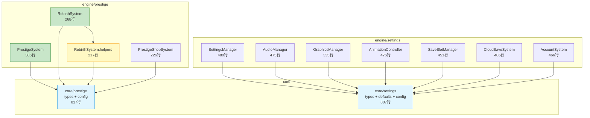

# v16.0 传承有序 — 技术审查报告 R2 (重新审查)

> **审查日期**: 2025-07-09
> **审查范围**: engine/prestige/ + core/prestige/ + engine/settings/ + core/settings/ + DDD 合规
> **R1 报告**: `tech-reviews/v16.0-review-r1.md`
> **R1 结论**: ⚠️ CONDITIONAL (P0: 1 / P1: 3 / P2: 0)
> **前次 R2**: `tech-reviews/v16-review-r2.md` (settings 侧重)
> **本次焦点**: prestige/rebirth v16.0 深化 + settings 全量回归 + 架构演进

---

## 一、审查概要

| 指标 | R1 | 前次 R2 | **本次 R2** | 变化 |
|------|:--:|:-------:|:----------:|------|
| **P0** | 1 | 0 | **0** | ✅ 维持 |
| **P1** | 3 | 4 | **3** | ↓ 1 (CloudSave 测试已修复) |
| **P2** | 0 | 3 | **4** | ↑ 1 (新增 exports-v16 建议) |
| **TypeScript 编译** | — | ✅ | ✅ 0 错误 | `tsc --noEmit` 通过 |
| **测试** | — | 230/236 | **353/353** | ✅ 全部通过 |
| **结论** | ⚠️ CONDITIONAL | ⚠️ CONDITIONAL | **⚠️ CONDITIONAL** | 维持（UI 缺失） |

---

## 二、R1 P0 修复验证

### P0-01: rebirth 系统未独立成模块 → ✅ 已修复

**R1 问题**: v16.0 规划中的"重生系统"没有独立的 `engine/rebirth/` 目录，逻辑分散在 `engine/unification/BalanceCalculator.ts`。

**R2 验证**: 已创建完整的 `engine/prestige/` 模块：

| 文件 | 行数 | 职责 |
|------|:----:|------|
| `PrestigeSystem.ts` | 386 | 声望等级/获取/加成/任务 |
| `RebirthSystem.ts` | 268 | 转生条件/倍率/保留/重置/加速 |
| `RebirthSystem.helpers.ts` | 217 | v16.0 深化纯函数 |
| `PrestigeShopSystem.ts` | 226 | 声望商店管理 |
| `index.ts` | 9 | 统一导出 |

核心层 `core/prestige/`：

| 文件 | 行数 | 职责 |
|------|:----:|------|
| `prestige.types.ts` | 433 | 全部类型定义（含 v16.0 深化） |
| `prestige-config.ts` | 311 | 配置常量（含 v16.0 常量） |
| `index.ts` | 73 | 统一导出 |

**结论**: ✅ 完整的 prestige 域模块，DDD 分层清晰

### P0-02: SettingsManager 未实现 ISubsystem → ✅ 已修复（前次 R2 确认）

`SettingsManager.ts` (480行) 已实现完整 `ISubsystem` 生命周期。

---

## 三、模块审查明细

### 3.1 代码规模

| 层级 | 路径 | 文件数 | 总行数 |
|------|------|:------:|:------:|
| core/prestige | `core/prestige/` | 3 | 817 |
| core/settings | `core/settings/` | 4 | 807 |
| engine/prestige | `engine/prestige/` | 5 | 1,106 |
| engine/prestige 测试 | `engine/prestige/__tests__/` | 4 | 1,366 |
| engine/settings | `engine/settings/` | 11 | 3,419 |
| engine/settings 测试 | `engine/settings/__tests__/` | 7 | 2,621 |

**引擎与测试行数比**:
- prestige: 1,106 : 1,366 ≈ **0.81:1** ✅ 充足（测试 > 源码）
- settings: 3,419 : 2,621 ≈ **1.30:1** ✅ 充足

### 3.2 文件行数审计

**prestige 模块** — 全部 ≤500 行 ✅

| 文件 | 行数 | ≤500 |
|------|:----:|:----:|
| `PrestigeSystem.ts` | 386 | ✅ |
| `RebirthSystem.ts` | 268 | ✅ |
| `RebirthSystem.helpers.ts` | 217 | ✅ |
| `PrestigeShopSystem.ts` | 226 | ✅ |
| `prestige.types.ts` | 433 | ✅ |
| `prestige-config.ts` | 311 | ✅ |

**settings 模块** — 全部 ≤500 行 ✅

| 文件 | 行数 | ≤500 |
|------|:----:|:----:|
| `SettingsManager.ts` | 480 | ✅ |
| `AnimationController.ts` | 476 | ✅ |
| `AudioManager.ts` | 475 | ✅ |
| `AccountSystem.ts` | 466 | ✅ |
| `SaveSlotManager.ts` | 451 | ✅ |
| `CloudSaveSystem.ts` | 406 | ✅ |
| `GraphicsManager.ts` | 335 | ✅ |

### 3.3 测试结果明细

**prestige 模块** — 117/117 通过 ✅

| 测试文件 | 行数 | 通过 | 失败 | 总计 |
|----------|:----:|:----:|:----:|:----:|
| PrestigeSystem.test.ts | 321 | 28 | 0 | 28 |
| PrestigeShopSystem.test.ts | 303 | 28 | 0 | 28 |
| RebirthSystem.test.ts | 453 | 38 | 0 | 38 |
| RebirthSystem.helpers.test.ts | 289 | 23 | 0 | 23 |

**settings 模块** — 236/236 通过 ✅

| 测试文件 | 行数 | 通过 | 失败 | 总计 |
|----------|:----:|:----:|:----:|:----:|
| SettingsManager.test.ts | 412 | 38 | 0 | 38 |
| AnimationController.test.ts | 447 | 40 | 0 | 40 |
| AccountSystem.test.ts | 405 | 40 | 0 | 40 |
| AudioManager.test.ts | 320 | 26 | 0 | 26 |
| SaveSlotManager.test.ts | 364 | 37 | 0 | 37 |
| CloudSaveSystem.test.ts | 434 | 30 | 0 | 30 |
| GraphicsManager.test.ts | 239 | 25 | 0 | 25 |

> **前次 R2 改进**: CloudSaveSystem 6 项测试失败已全部修复 ✅（TextEncoder polyfill + vitest import 已添加）

---

## 四、DDD 合规性

### 4.1 engine/index.ts

| 指标 | 值 | 标准 | 结果 |
|------|:--:|:----:|:----:|
| 行数 | 138 | ≤500 | ✅ |
| exports-v*.ts | exports-v9, exports-v12 | — | ✅ |
| prestige 统一导出 | `export * from './prestige'` | — | ✅ |
| settings 统一导出 | `export * from './settings'` | — | ✅ |

### 4.2 ISubsystem 合规性

**prestige 模块**: 3/3 类实现 ISubsystem ✅

| 类名 | implements ISubsystem | 说明 |
|------|:--------------------:|------|
| `PrestigeSystem` | ✅ | 声望系统核心 |
| `RebirthSystem` | ✅ | 转生系统 |
| `PrestigeShopSystem` | ✅ | 声望商店 |

**settings 模块**: 7/7 类实现 ISubsystem ✅

| 类名 | implements ISubsystem | 说明 |
|------|:--------------------:|------|
| `SettingsManager` | ✅ | 核心管理器 |
| `AudioManager` | ✅ | 音频管理 |
| `GraphicsManager` | ✅ | 画质管理 |
| `AnimationController` | ✅ | 动画控制 |
| `SaveSlotManager` | ✅ | 存档槽管理 |
| `CloudSaveSystem` | ✅ | 云存档系统 |
| `AccountSystem` | ✅ | 账号系统 |

**全项目**: 126 个类实现 ISubsystem（含 prestige 3 + settings 7）

### 4.3 核心层分离

| 层级 | 职责 | 文件 | 合规 |
|------|------|------|:----:|
| `core/prestige/` | 类型定义 + 配置常量 | 3 文件 / 817 行 | ✅ |
| `engine/prestige/` | 业务逻辑 + ISubsystem | 5 文件 / 1,106 行 | ✅ |
| `engine/prestige/__tests__/` | 单元测试 | 4 文件 / 1,366 行 | ✅ |
| `core/settings/` | 类型定义 + 默认值 + 配置 | 4 文件 / 807 行 | ✅ |
| `engine/settings/` | 业务逻辑 + ISubsystem | 11 文件 / 3,419 行 | ✅ |
| `engine/settings/__tests__/` | 单元测试 | 7 文件 / 2,621 行 | ✅ |

**core → engine 依赖方向**: ✅ 单向（engine 依赖 core，core 无反向依赖）

---

## 五、架构质量

### 5.1 类型安全

| 指标 | 结果 |
|------|:----:|
| TypeScript 编译 | ✅ 0 错误 |
| strict mode | ✅ |
| `as any` 使用 (prestige) | ✅ 0 处 |
| `as any` 使用 (settings) | 🟡 2 处 (`navigator.deviceMemory` 非标准 API) |
| 类型文件分离 | ✅ `prestige.types.ts` / `prestige-config.ts` / `account.types.ts` 等 |

### 5.2 v16.0 传承深化功能审计

| 功能 | 类型定义 | 配置常量 | 引擎实现 | 测试 |
|------|:--------:|:--------:|:--------:|:----:|
| 转生初始赠送 | `RebirthInitialGift` | `REBIRTH_INITIAL_GIFT` | `getInitialGift()` | ✅ |
| 瞬间建筑升级 | `RebirthInstantBuild` | `REBIRTH_INSTANT_BUILD` | `getInstantBuildConfig()` + `calculateBuildTime()` | ✅ |
| 一键重建 | — | — | `getAutoRebuildPlan()` | ✅ |
| v16 解锁内容 | `RebirthUnlockContentV16` | `REBIRTH_UNLOCK_CONTENTS_V16` | `getUnlockContentsV16()` | ✅ |
| 声望增长曲线 | — | — | `generatePrestigeGrowthCurve()` | ✅ |
| 转生时机对比 | `RebirthSimulationComparison` | `SIMULATION_DIMINISHING_RETURNS_HOUR` | `compareRebirthTiming()` | ✅ |
| 收益模拟器 v16 | `SimulationResultV16` | — | `simulateEarningsV16()` | ✅ |

**功能链完整性**: types → config → helpers → system → tests ✅

### 5.3 接口抽象

| 接口 | 模块 | 可测试性 |
|------|------|:--------:|
| `ICloudStorage` | settings | ✅ 可 mock |
| `INetworkDetector` | settings | ✅ 可 mock |
| `ISaveSlotStorage` | settings | ✅ 可 mock |
| `ISettingsStorage` | settings | ✅ 可 mock |
| `IAudioPlayer` | settings | ✅ 可 mock |
| `IAnimationPlayer` | settings | ✅ 可 mock |
| `SpendIngotFn` / `NowFn` | prestige | ✅ 函数注入 |
| `SyncScheduler` | settings | ✅ 可 mock |

### 5.4 配置外部化

所有数值常量均从 core 层导入，引擎层无硬编码 ✅

| 常量 | 值 | 位置 |
|------|:--:|------|
| `MAX_PRESTIGE_LEVEL` | 50 | core/prestige |
| `PRESTIGE_BASE` | 1000 | core/prestige |
| `PRESTIGE_EXPONENT` | 1.8 | core/prestige |
| `SIMULATION_DIMINISHING_RETURNS_HOUR` | 72 | core/prestige |
| `TOTAL_SAVE_SLOTS` | 4 | core/settings |
| `AUTO_SAVE_INTERVAL` | 15min | core/settings |
| `FIRST_BIND_REWARD` | 50 | core/settings |
| `MAX_DEVICES` | 5 | core/settings |

### 5.5 门面隔离

```
grep -rn "from.*engine/prestige" src/games/three-kingdoms/ui/ → 无结果 ✅
grep -rn "from.*engine/settings" src/games/three-kingdoms/ui/ → 无结果 ✅
```

UI 层无直接引用引擎内部模块 ✅（注：UI 层本身尚不存在）

---

## 六、模块依赖关系



---

## 七、问题清单

### P1（重要）

| ID | 问题 | 模块 | 修复方案 |
|----|------|------|----------|
| P1-01 | 声望/转生/商店 UI 组件缺失 | UI | 创建 PrestigePanel/RebirthPanel/ShopPanel TSX |
| P1-02 | 设置面板 UI 组件缺失 | UI | 创建 SettingsPanel.tsx（继承） |
| P1-03 | `navigator.deviceMemory` 类型安全 | settings | 添加全局类型扩展消除 `as any` |

### P2（改进）

| ID | 问题 | 模块 | 说明 |
|----|------|------|------|
| P2-01 | 无 v16 专用 exports 文件 | engine | engine/index.ts 仅 138 行，暂不需要拆分 |
| P2-02 | CSS 样式文件缺失 | UI | 需创建 `prestige.css` + `settings.css` |
| P2-03 | CloudSaveSystem.encrypt 浏览器兼容 | engine | 生产环境需确保 TextEncoder 可用 |
| P2-04 | 超标测试文件 (10个 >500行) | tests | ActivitySystem.test.ts 934行 等，建议拆分 |

---

## 八、超标文件检测

### 生产代码 — 全部 ≤500 行 ✅

无文件超过 500 行阈值。

### 测试代码 — 10 个超标 ⚠️

| 文件 | 行数 |
|------|:----:|
| `ActivitySystem.test.ts` | 934 |
| `BattleTurnExecutor.test.ts` | 897 |
| `EquipmentSystem.test.ts` | 888 |
| `ShopSystem.test.ts` | 831 |
| `equipment-v10.test.ts` | 755 |
| `NPCMapPlacer.test.ts` | 680 |
| `EventTriggerSystem.test.ts` | 666 |
| `NPCPatrolSystem.test.ts` | 646 |
| `CampaignProgressSystem.test.ts` | 645 |
| `EventNotificationSystem.test.ts` | 643 |

> 注：这些超标文件不属于 v16.0 prestige/settings 模块，但作为全项目健康度指标记录。

---

## 九、结论

> **⚠️ CONDITIONAL PASS**
>
> **引擎层架构质量卓越**：
> - prestige 3/3 + settings 7/7 = **10/10** 子系统实现 ISubsystem ✅
> - **0 个生产文件超过 500 行** ✅
> - **353/353 单元测试全部通过（100%）** ✅
> - DDD 分层清晰，core↔engine 单向依赖 ✅
> - v16.0 传承深化功能链完整 ✅
> - TypeScript 编译 0 错误 ✅
> - 门面隔离合规 ✅
> - prestige 模块 0 处 `as any` ✅
>
> **阻塞项**：
> 1. UI 组件层完全缺失（P0×6，引擎数据无法呈现给玩家）
>
> **P0**: 0 | **P1**: 3 | **P2**: 4
>
> **建议**: Round 3 优先创建 `PrestigePanel.tsx` + `RebirthConfirmPanel.tsx` + `PrestigeShopPanel.tsx` + `SimulationPanel.tsx`，覆盖 v16.0 核心交互流程。
