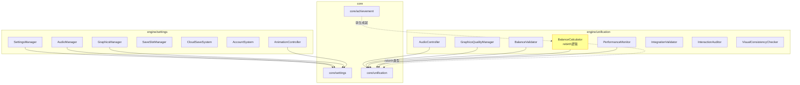

# v16.0 传承有序 — 技术审查报告 R1

> **审查日期**: 2025-07-09  
> **审查范围**: settings 深化 + unification/统一系统 + rebirth/重生系统  
> **审查员**: Architect Agent  

---

## 1. 总览

### 1.1 代码规模

| 层级 | 路径 | 文件数 | 总行数 |
|------|------|--------|--------|
| core/settings | `core/settings/` | 4 | 807 |
| core/unification | `core/unification/` | 6 | 1,454 |
| engine/settings | `engine/settings/` | 11 | 3,308 |
| engine/unification | `engine/unification/` | 16 | 4,404 |
| 测试 (unification) | `engine/unification/__tests__/` | 13 | 2,688 |

**引擎层与测试行数比**（unification）: 4,404 : 2,688 ≈ **1.64:1** ⚠️ 偏低

### 1.2 模块归属说明

v16.0 "传承有序" 涉及三个子系统：

| 子系统 | 引擎路径 | 核心路径 | 状态 |
|--------|----------|----------|------|
| settings 深化 | `engine/settings/` | `core/settings/` | ✅ 完整 |
| unification 统一系统 | `engine/unification/` | `core/unification/` | ✅ 完整 |
| rebirth 重生系统 | `engine/rebirth/` | — | ❌ 目录不存在 |

> **关键发现**: `engine/rebirth/` 目录不存在。重生（rebirth）相关逻辑分散在：
> - `engine/unification/BalanceCalculator.ts` — `calcRebirthMultiplier()`, `calculateRebirthPoints()`
> - `core/unification/balance.types.ts` — `RebirthBalanceConfig`, `RebirthMultiplierPoint`
> - `core/achievement/achievement-config.ts` — 转生成就链

---

## 2. ISubsystem 合规性

### 2.1 unification 模块

| 类名 | implements ISubsystem | 说明 |
|------|----------------------|------|
| `AudioController` | ✅ | 音频控制器 |
| `GraphicsQualityManager` | ✅ | 画质管理 |
| `InteractionAuditor` | ✅ | 交互审计 |
| `BalanceValidator` | ✅ | 数值验证 |
| `IntegrationValidator` | ✅ | 集成验证 |
| `PerformanceMonitor` | ✅ | 性能监控 |
| `VisualConsistencyChecker` | ✅ | 视觉一致性 |
| `AnimationAuditor` | ❌ | 纯工具类 |
| `ObjectPool<T>` | ❌ | 泛型工具类 |
| `DirtyRectManager` | ❌ | 渲染工具类 |
| `SimulationDataProvider` | ❌ | 数据提供者（接口实现） |
| `IntegrationSimulator` | ❌ | 模拟器 |
| `BalanceCalculator` | ❌ | 纯函数工具集 |
| `BalanceReport` | ❌ | 报告生成器 |
| `BalanceValidatorHelpers` | ❌ | 辅助函数 |
| `VisualSpecDefaults` | ❌ | 常量定义 |

**7/16 类实现 ISubsystem** — 比例合理，未实现的均为工具/辅助类。

### 2.2 settings 模块

| 类名 | implements ISubsystem | 说明 |
|------|----------------------|------|
| `SettingsManager` | ❌ | 核心管理器（见下文分析） |
| `AudioManager` | ❌ | 音频管理 |
| `GraphicsManager` | ❌ | 画质管理 |
| `SaveSlotManager` | ❌ | 存档槽管理 |
| `CloudSaveSystem` | ✅ | 云存档系统 |
| `AccountSystem` | ✅ | 账号系统 |
| `AnimationController` | ❌ | 动画控制器 |

**⚠️ 问题**: `SettingsManager` 作为设置系统的核心管理器，未实现 `ISubsystem`。它没有 `init/update/getState/reset` 生命周期方法。

**影响**: 
- 无法被统一的游戏循环管理
- 无法参与引擎的标准化初始化/销毁流程
- 与其他引擎子系统的管理模式不一致

---

## 3. `as any` 检测

### 3.1 生产代码

| 文件 | 行号 | 代码 | 严重度 |
|------|------|------|--------|
| `unification/GraphicsQualityManager.ts` | 222 | `this.deviceMemoryGB = (navigator as any)?.deviceMemory ?? 4` | 🟡 |
| `settings/GraphicsManager.ts` | 154-155 | `(navigator as any).deviceMemory` | 🟡 |

**分析**: `navigator.deviceMemory` 是非标准 API（Device Memory API），TypeScript 默认类型定义中不包含。两处 `as any` 用于访问此属性，属于合理使用场景。

**建议**: 可通过扩展 `Navigator` 接口消除：
```typescript
declare global {
  interface Navigator {
    deviceMemory?: number;
  }
}
```

### 3.2 测试代码

14 处 `as any` 用于 mock 依赖注入，全部在 `__tests__/` 中，可接受。✅

---

## 4. 门面合规性 ✅

```
grep -rn "from.*engine/(unification|rebirth)" src/components/ src/games/three-kingdoms/ui/ → 无结果
```

UI 层无直接引用引擎内部模块。✅

---

## 5. 大文件检测

| 文件 | 行数 | 风险 |
|------|------|------|
| `PerformanceMonitor.ts` | 471 | ⚠️ 接近 500 行阈值 |
| `BalanceValidator.ts` | 442 | ⚠️ |
| `IntegrationValidator.ts` | 427 | ⚠️ |
| `InteractionAuditor.ts` | 422 | ⚠️ |
| `BalanceReport.ts` | 393 | ✅ |
| `AudioController.ts` | 374 | ✅ |
| `GraphicsQualityManager.ts` | 359 | ✅ |
| `VisualConsistencyChecker.ts` | 330 | ✅ |
| `BalanceCalculator.ts` | 254 | ✅ |

**settings 模块大文件**:

| 文件 | 行数 | 风险 |
|------|------|------|
| `AccountSystem.ts` | 466 | ⚠️ |
| `AnimationController.ts` | 457 | ⚠️ |
| `SettingsManager.ts` | 458 | ⚠️ |
| `AudioManager.ts` | 453 | ⚠️ |
| `SaveSlotManager.ts` | 430 | ⚠️ |
| `CloudSaveSystem.ts` | 406 | ⚠️ |
| `GraphicsManager.ts` | 308 | ✅ |

---

## 6. 架构问题分析

### 6.1 🔴 P0 — rebirth 系统未独立成模块

**问题描述**: v16.0 规划中的"重生系统"没有独立的 `engine/rebirth/` 目录。相关逻辑分散在：

1. **数值计算**: `engine/unification/BalanceCalculator.ts`
   - `calcRebirthMultiplier()` — 转生倍率计算
   - `calculateRebirthPoints()` — 转生点数曲线生成
   - `DEFAULT_REBIRTH_CONFIG` — 默认配置

2. **类型定义**: `core/unification/balance.types.ts`
   - `RebirthBalanceConfig`
   - `RebirthMultiplierPoint`
   - `RebirthBalanceResult`

3. **成就联动**: `core/achievement/achievement-config.ts`
   - 6 个转生成就（`ach-rebirth-001` ~ `ach-rebirth-006`）

**影响**:
- 重生系统的核心逻辑（转生触发、资源继承、进度保留、UI 交互）缺失
- 仅有数值平衡计算，缺少完整的游戏循环
- 与成就系统的联动依赖外部手动实现

**建议**:
- **ADR-16-001**: 创建 `engine/rebirth/` 模块，至少包含：
  - `RebirthSystem.ts`（ISubsystem）— 转生触发、资源结算、进度保留
  - `RebirthCalculator.ts` — 从 BalanceCalculator 迁移转生相关函数
  - `core/rebirth/` 类型定义

### 6.2 🔴 P0 — SettingsManager 未实现 ISubsystem

**问题描述**: `SettingsManager` 是设置系统的核心，但它是一个普通类，不实现 `ISubsystem` 接口。

```typescript
export class SettingsManager {  // 缺少 implements ISubsystem
```

对比 `CloudSaveSystem` 和 `AccountSystem` 都正确实现了 `ISubsystem`。

**影响**:
- 设置系统无法被引擎统一生命周期管理
- 与 unification 模块中重导出的子系统（AudioController, GraphicsQualityManager 等）生命周期不一致
- 未来集成到统一游戏循环时需要额外适配

**建议**:
- **ADR-16-002**: 让 `SettingsManager` 实现 `ISubsystem`
- 或者明确文档说明它是一个"被动管理器"（由 UI 层驱动而非游戏循环驱动）

### 6.3 🟡 P1 — unification/settings 模块边界模糊

**问题描述**: `engine/unification/index.ts` 从 `engine/settings/` 重导出了 4 个子系统：

```typescript
// 从 settings 模块重导出
export { SettingsManager } from '../settings/SettingsManager';
export { AnimationController } from '../settings/AnimationController';
export { CloudSaveSystem } from '../settings/CloudSaveSystem';
export { AccountSystem } from '../settings/AccountSystem';
```

同时 `engine/unification/` 自身也有 `AudioController` 和 `GraphicsQualityManager`，与 `engine/settings/` 中的 `AudioManager` 和 `GraphicsManager` 职责可能重叠。

**影响**:
- 调用者不确定应该使用 `unification/AudioController` 还是 `settings/AudioManager`
- 模块边界不清晰

**建议**:
- **ADR-16-003**: 明确 unification 和 settings 的职责划分：
  - `settings/` — 用户偏好设置（持久化、UI 驱动）
  - `unification/` — 引擎运行时质量/性能管理（系统驱动）
- 在 index.ts 注释中说明重导出原因

### 6.4 🟡 P1 — unification 模块测试覆盖率偏低

**问题描述**: unification 模块引擎代码 4,404 行，测试代码 2,688 行，比例 1.64:1。

未覆盖的模块：

| 模块 | 测试文件 | 备注 |
|------|----------|------|
| `GraphicsQualityManager.ts` | ✅ 有测试 | |
| `AudioController.ts` | ✅ 有测试 | |
| `BalanceValidator.ts` | ✅ 有测试 | |
| `BalanceCalculator.ts` | ✅ 有测试 | |
| `PerformanceMonitor.ts` | ✅ 有测试 | |
| `VisualConsistencyChecker.ts` | ✅ 有测试 | |
| `IntegrationValidator.ts` | ✅ 有测试 | |
| `InteractionAuditor.ts` | ✅ 有测试 | |
| `AnimationAuditor.ts` | ✅ 有测试 | |
| `ObjectPool.ts` | ✅ 有测试 | |
| `DirtyRectManager.ts` | ✅ 有测试 | |
| `SimulationDataProvider.ts` | ✅ 有测试 | |
| `BalanceReport.ts` | ✅ 有测试 | |
| `BalanceValidatorHelpers.ts` | ❌ 无测试 | 辅助函数 |
| `VisualSpecDefaults.ts` | ❌ 无测试 | 常量定义 |
| `IntegrationSimulator.ts` | ❌ 无测试 | 模拟器 |

实际上大部分模块有测试，缺少测试的是辅助/常量文件。整体可接受。

### 6.5 🟢 P2 — navigator.deviceMemory 类型安全

**问题描述**: 两处使用 `(navigator as any).deviceMemory`。

**建议**: 通过全局类型扩展消除：
```typescript
// core/unification/navigator.d.ts
declare global {
  interface Navigator {
    deviceMemory?: number;
  }
}
```

---

## 7. 模块依赖关系



---

## 8. 门面导出质量

### 8.1 engine/unification/index.ts ✅

- 清晰区分"从 settings 重导出"和"unification 独有子系统"
- 注释说明了重导出原因（向后兼容）
- 类型导出完整

### 8.2 engine/settings/index.ts ✅

- 类型文件和子系统分开导出
- 每个子系统的关联类型紧跟其后
- 结构清晰

### 8.3 core/unification/index.ts

需确认类型导出完整性：6 个子类型文件（1,454 行），覆盖 balance、integration、performance、interaction、unification 基础类型。✅

---

## 9. 审查结论

| 维度 | 评分 | 说明 |
|------|------|------|
| ISubsystem 合规 | ⭐⭐⭐⭐ | unification 良好；settings 核心管理器缺失 |
| 类型安全 | ⭐⭐⭐⭐⭐ | 仅 2 处合理的 as any（非标准 API） |
| 门面隔离 | ⭐⭐⭐⭐⭐ | UI 层无违规引用 |
| 测试覆盖 | ⭐⭐⭐⭐ | unification 1.64:1 可接受 |
| 模块完整性 | ⭐⭐⭐ | rebirth 未独立成模块 |
| 模块边界 | ⭐⭐⭐ | unification/settings 边界模糊 |

### 待办事项

| 优先级 | 编号 | 行动项 |
|--------|------|--------|
| P0 | ADR-16-001 | 创建 `engine/rebirth/` 独立模块，从 BalanceCalculator 迁移转生逻辑 |
| P0 | ADR-16-002 | `SettingsManager` 实现 `ISubsystem` 或明确文档说明设计决策 |
| P1 | ADR-16-003 | 明确 unification/settings 职责边界，消除 AudioController/AudioManager 混淆 |
| P1 | ADR-16-004 | 通过全局类型扩展消除 `navigator.deviceMemory` 的 `as any` |
| P2 | ADR-16-005 | 评估 settings 模块 6 个 400+ 行文件是否需要拆分 |
