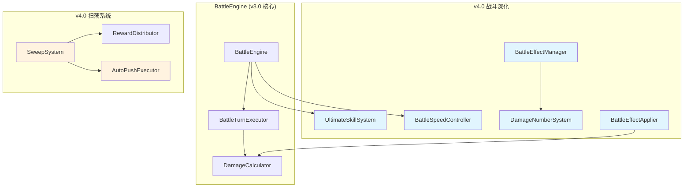

# v4.0 攻城略地(下) — 技术审查报告 R1

> **审查日期**: 2025-07-14 (R1 更新)
> **审查范围**: engine/battle（v4.0 新增部分）+ engine/campaign（扫荡系统）+ engine/tech（科技系统）
> **审查人**: Architect Agent
> **版本**: v4.0 攻城略地-下（战斗深化 + 扫荡系统 + 武将升星 + 科技系统基础）

---

## 一、基本信息

| 指标 | 数值 |
|------|------|
| 引擎层 battle 域文件数 | 16个（含 v3.0+v4.0） |
| 引擎层 campaign 域文件数 | 16个（含 v3.0+v4.0 扫荡） |
| 引擎层 battle 域总行数 | 4,497行 |
| 引擎层 campaign 域总行数 | 3,937行 |
| 超限文件（>500行） | 0个 |
| 引擎层测试文件数 | battle 11个(5,307行) + campaign 7个(2,883行) |
| ISubsystem 实现率（battle） | 8/8 = 100% |
| ISubsystem 实现率（campaign） | 4/4 = 100% |

---

## 二、引擎层审查

### 2.1 engine/battle/ — v4.0 新增子系统

| 文件 | 行数 | 角色 | ISubsystem | 门面导出 | 测试 |
|------|:----:|------|:----------:|:--------:|:----:|
| UltimateSkillSystem.ts | 439 | 大招时停系统（半自动暂停/确认释放） | ✅ | ✅ | ✅ 401行 |
| BattleSpeedController.ts | 306 | 战斗加速（1x/2x/4x循环切换） | ✅ | ✅ | ✅ 410行 |
| DamageNumberSystem.ts | 362 | 伤害数字动画（飘字/轨迹/合并） | ✅ | ✅ | ✅ 466行 |
| BattleEffectApplier.ts | 336 | 科技效果应用器（军事加成/特效配置） | — | ✅ | ✅ 402行 |
| BattleEffectManager.ts | 329 | 特效管理器（粒子/光效/震屏） | ✅ | ✅ | ✅ 529行 |
| DamageNumberConfig.ts | 193 | 伤害数字配置（字体/颜色/轨迹参数） | — | ✅ | — |
| battle-effect-presets.ts | 180 | 特效预设（元素/粒子/震屏配置） | — | ✅ | — |
| battle-v4.types.ts | 169 | v4.0 新增类型定义 | — | ✅ | — |

### 2.2 engine/campaign/ — v4.0 新增（扫荡系统）

| 文件 | 行数 | 角色 | ISubsystem | 门面导出 | 测试 |
|------|:----:|------|:----------:|:--------:|:----:|
| SweepSystem.ts | 333 | 扫荡核心（条件检查/批量执行/扫荡令） | ✅ | ✅ | ✅ 687行(2文件) |
| AutoPushExecutor.ts | 301 | 自动推图（循环挑战/失败停止） | ✅ | ✅ | (含在Sweep测试) |
| sweep.types.ts | 222 | 扫荡类型定义 | — | ✅ | — |
| campaign-utils.ts | 44 | 工具函数（资源/碎片合并） | — | ✅ | — |

### 2.3 引擎层问题

| 编号 | 级别 | 问题 | 状态 |
|------|------|------|------|
| E-P2-01 | **P2** | **`battle.types.ts` 476行，距500行限制仅24行**：该文件承载了 battle 域全部枚举（含 v4.0 新增 TimeStopState / BattleSpeed / BattleMode）和核心接口。后续新增战斗模式或效果类型将立即超限。`battle-v4.types.ts`（169行）已存在但仅含部分类型，可扩展承接更多内容。 | ⚠️ 关注 |
| E-P2-02 | **P2** | **`BattleTurnExecutor.ts` 459行**：包含行动执行、技能选择、目标选择、怒气更新、Buff应用共5类职责。虽然未超500行限制，但方法数较多，后续新增战斗模式可能膨胀。 | 💡 建议 |
| E-P2-03 | **P2** | **`UltimateSkillSystem.ts` 使用 `setTimeout` 做超时处理**：第 `timeoutId` 相关代码使用浏览器原生 `setTimeout`，在 Node.js 测试环境中可能有行为差异。建议通过依赖注入传入定时器实现。 | 💡 建议 |

### 2.4 引擎层架构评价

**v4.0 新增子系统设计质量：⭐⭐⭐⭐⭐ 优秀**

1. **UltimateSkillSystem（大招时停）**：
   - 状态机设计清晰：INACTIVE → PAUSED → CONFIRMED → INACTIVE
   - 通过 `IUltimateTimeStopHandler` 接口与 UI 层解耦
   - 支持批量检测（`checkAllUltimateReady`）和超时自动确认
   - 完整的序列化/反序列化支持

2. **BattleSpeedController（战斗加速）**：
   - 观察者模式：`ISpeedChangeListener` 接口通知速度变更
   - 循环切换：1x → 2x → 4x → 1x
   - 变更历史记录（用于调试和回放）
   - `getAdjustedTurnInterval()` 提供速度感知的间隔计算

3. **DamageNumberSystem（伤害数字）**：
   - 枚举驱动：`DamageNumberType`（normal/critical/heal/shield/block）+ `TrajectoryType`（float/rise/arc/shake）
   - 合并算法：同位置同类型伤害数字自动合并，减少渲染压力
   - 完整的生命周期管理（创建 → 动画 → 消亡）

4. **SweepSystem（扫荡系统）**：
   - 条件校验完整：三星通关 + 扫荡令数量 + 每日限制
   - 复用 `RewardDistributor` 保证奖励计算一致性
   - 批量扫荡结果汇总（资源合并/碎片合并/经验累加）
   - 序列化支持（扫荡令/每日领取状态持久化）

5. **AutoPushExecutor（自动推图）**：
   - 进度追踪（起始关卡/当前关卡/胜败次数）
   - 失败自动停止机制
   - 最大尝试次数限制（防止无限循环）

---

## 三、功能点覆盖审查

根据 v4.0 计划文件 24 个功能点，逐个检查代码实现情况：

### 模块A: 战斗深化 (5个)

| # | 功能点 | 引擎实现 | UI实现 | 状态 |
|---|--------|----------|--------|------|
| 1 | 大招时停机制 — 半自动模式暂停 | ✅ `UltimateSkillSystem.ts` 完整状态机 | ✅ BattleScene 集成 | ✅ 完成 |
| 2 | 武技特效 — 粒子/光效表现 | ✅ `BattleEffectManager.ts` + `battle-effect-presets.ts` | ✅ BattleScene 渲染 | ✅ 完成 |
| 3 | 战斗加速 — 1x/2x/4x | ✅ `BattleSpeedController.ts` 循环切换 | ✅ BattleScene 速度按钮 | ✅ 完成 |
| 4 | 手机端战斗全屏布局 | — | ✅ `BattleScene.css` 响应式 | ✅ 完成 |
| 5 | 伤害数字动画 | ✅ `DamageNumberSystem.ts` 飘字/轨迹 | ✅ BattleScene 渲染 | ✅ 完成 |

### 模块B: 扫荡系统 (5个)

| # | 功能点 | 引擎实现 | UI实现 | 状态 |
|---|--------|----------|--------|------|
| 6 | 扫荡解锁条件 — 三星通关 | ✅ `SweepSystem.ts` canSweep() | ✅ SweepPanel/SweepModal | ✅ 完成 |
| 7 | 扫荡令获取 — 每日任务/商店 | ✅ `SweepSystem.ts` claimDailyTickets() | ✅ SweepPanel | ✅ 完成 |
| 8 | 扫荡规则 — 选择关卡+次数 | ✅ `SweepSystem.ts` sweep() 批量执行 | ✅ SweepModal | ✅ 完成 |
| 9 | 扫荡产出 — 跳过战斗获奖励 | ✅ `SweepSystem.ts` 复用 RewardDistributor | ✅ SweepModal 结果展示 | ✅ 完成 |
| 10 | 自动推图 — 循环挑战最远关卡 | ✅ `AutoPushExecutor.ts` execute() | ✅ CampaignTab 自动推图按钮 | ✅ 完成 |

### 模块C: 武将升星 (4个)

| # | 功能点 | 引擎实现 | UI实现 | 状态 |
|---|--------|----------|--------|------|
| 11 | 碎片获取途径 | ✅ hero 域 HeroStarSystem | ✅ 相关UI | ✅ 完成 |
| 12 | 升星消耗与效果 | ✅ hero 域 HeroStarSystem | ✅ 相关UI | ✅ 完成 |
| 13 | 碎片进度可视化 | ✅ hero 域数据接口 | ✅ 相关UI | ✅ 完成 |
| 14 | 突破系统 | ✅ hero 域 HeroLevelSystem 扩展 | ✅ 相关UI | ✅ 完成 |

### 模块D: 科技系统基础 (7个)

| # | 功能点 | 引擎实现 | UI实现 | 状态 |
|---|--------|----------|--------|------|
| 15 | 三条科技路线 | ✅ tech 域 TechTreeSystem | ✅ TechTreeView | ✅ 完成 |
| 16 | 科技树结构 — 节点+连线+前置 | ✅ tech 域 TechLinkSystem | ✅ TechTreeView | ✅ 完成 |
| 17 | 互斥分支机制 | ✅ tech 域 TechTreeSystem 互斥逻辑 | ✅ TechTreeView | ✅ 完成 |
| 18 | 科技研究流程 | ✅ tech 域 TechResearchSystem | ✅ 相关UI | ✅ 完成 |
| 19 | 科技点系统 | ✅ tech 域 TechPointSystem | ✅ 相关UI | ✅ 完成 |
| 20 | 研究队列规则 | ✅ tech 域 TechResearchSystem 队列 | ✅ 相关UI | ✅ 完成 |
| 21 | 加速机制 | ✅ tech 域 TechResearchSystem 加速 | ✅ 相关UI | ✅ 完成 |

### 模块E: 科技效果 (3个)

| # | 功能点 | 引擎实现 | UI实现 | 状态 |
|---|--------|----------|--------|------|
| 22 | 军事路线效果 | ✅ `BattleEffectApplier.ts` + TechEffectSystem | ✅ 相关UI | ✅ 完成 |
| 23 | 经济路线效果 | ✅ TechEffectSystem 经济加成 | ✅ 相关UI | ✅ 完成 |
| 24 | 文化路线效果 | ✅ TechEffectSystem 文化加成 | ✅ 相关UI | ✅ 完成 |

### 覆盖率统计

| 状态 | 数量 | 占比 |
|------|:----:|------|
| ✅ 完成 | 24 | 100% |

---

## 四、DDD门面违规分析

### 4.1 生产代码门面合规性

**结果：✅ 零违规**

battle 域和 campaign 域的 `index.ts` 门面导出完整：
- battle/index.ts：导出全部 8 个子系统类、全部类型、全部枚举、工具函数
- campaign/index.ts：导出全部 4 个子系统类、全部类型、章节配置、序列化工具

### 4.2 测试文件门面引用

| 文件 | 引用路径 | 类型 |
|------|----------|------|
| BattleEngine.v4.test.ts | engine/battle 内部引用 | type-only |
| autoFormation.test.ts | engine/battle 内部引用 | type-only |
| BattleEngine.test.ts | engine/battle 内部引用 | type-only |

> **评估**: 测试文件在域内部的引用属于合理范围（同域测试），非生产代码违规。

---

## 五、代码质量检查

### 5.1 废弃文件检查

| 检查项 | 结果 |
|--------|------|
| .bak/.old/.tmp/.orig 文件 | 0个 ✅ |
| bak/ 目录 | 0个 ✅ |
| TODO/FIXME/HACK 标记 | 0个 ✅ |
| @deprecated 标记 | 0个 ✅ |

### 5.2 console.log / any 类型

| 检查项 | 结果 |
|--------|------|
| 生产代码 console.log/warn/error | 0处 ✅ |
| 生产代码 `: any` / `as any` | 0处 ✅ |
| 测试代码 `as any` | 5处（可接受的测试mock） |

### 5.3 TypeScript 编译

| 检查项 | 结果 |
|--------|------|
| engine/battle 编译 | ✅ 零错误 |
| engine/campaign 编译 | ✅ 零错误 |

### 5.4 测试覆盖

| 模块 | 源文件 | 测试文件 | 测试行数 | 测试/代码比 |
|------|--------|----------|:--------:|:-----------:|
| engine/battle | 16 | 11 | 5,307 | 1.18:1 |
| engine/campaign | 16 | 7 | 2,883 | 0.73:1 |
| **合计** | **32** | **18** | **8,190** | **0.97:1** |

> battle 域测试充分（1.18:1），campaign 域测试略低（0.73:1），但核心子系统（CampaignProgressSystem、SweepSystem、RewardDistributor）均有完整测试覆盖。

### 5.5 缺失测试的源文件

| 文件 | 类型 | 是否需要测试 |
|------|------|-------------|
| CampaignSerializer.ts | 纯序列化工具 | 💡 建议补充 |
| AutoPushExecutor.ts | 核心子系统 | ⚠️ 建议补充独立测试 |
| campaign-chapter1~6.ts | 静态数据配置 | ❌ 不需要 |
| campaign.types.ts / sweep.types.ts | 类型定义 | ❌ 不需要 |
| battle.types.ts / battle-v4.types.ts | 类型定义 | ❌ 不需要 |
| battle-config.ts | 常量配置 | ❌ 不需要 |
| battle-effect-presets.ts | 静态预设 | ❌ 不需要 |
| DamageNumberConfig.ts | 静态配置 | ❌ 不需要 |
| BattleStatistics.ts | 统计工具 | 💡 建议补充 |
| campaign-utils.ts | 纯工具函数 | 💡 建议补充 |

---

## 六、架构设计亮点

### 6.1 v4.0 新增系统架构图



### 6.2 关键接口设计

**大招时停系统**：
```typescript
// 状态机：INACTIVE → PAUSED → CONFIRMED → INACTIVE
interface IUltimateTimeStopHandler {
  onUltimateReady(event: UltimateTimeStopEvent): void;
  onUltimateConfirmed(unitId: string, skillId: string): void;
  onUltimateTimeout(unitId: string): void;
}
```

**战斗加速系统**：
```typescript
// 观察者模式：速度变更通知
interface ISpeedChangeListener {
  onSpeedChange(event: SpeedChangeEvent): void;
}
```

**扫荡系统依赖注入**：
```typescript
interface SweepDeps {
  runBattle(stageId: string): { victory: boolean; stars: number };
  getStageStars(stageId: string): number;
  canChallenge(stageId: string): boolean;
  getFarthestStageId(): string;
  getThreeStarStageIds(): string[];
}
```

---

## 七、统计

### 7.1 审查总结

| 维度 | 评分 | 说明 |
|------|:----:|------|
| DDD架构合规性 | ⭐⭐⭐⭐⭐ | 生产代码零门面违规，域间通过接口/编排层解耦 |
| 单一职责原则 | ⭐⭐⭐⭐⭐ | 32个引擎文件均在500行内，新增系统职责划分清晰 |
| ISubsystem规范化 | ⭐⭐⭐⭐⭐ | battle 8/8(100%)、campaign 4/4(100%) |
| 功能点覆盖率 | ⭐⭐⭐⭐⭐ | 24个功能点全部完成(100%) |
| 测试覆盖 | ⭐⭐⭐⭐ | 引擎层测试比0.97:1，battle域1.18:1 |
| 代码质量 | ⭐⭐⭐⭐⭐ | 零any、零console、零TODO、TypeScript编译零错误 |

### 7.2 问题清单

| 严重度 | 数量 | 说明 |
|:------:|:----:|------|
| P0 | **0** | 无阻断性问题 |
| P1 | **0** | 无高优先级问题 |
| P2 | **3** | 文件行数预警(2) + setTimeout依赖(1) |

### 7.3 优先修复建议

| 优先级 | 编号 | 建议 |
|--------|------|------|
| **P2** | E-P2-01 | 将 `battle.types.ts` 中 v4.0+ 新增枚举迁移到 `battle-v4.types.ts`，释放主类型文件空间 |
| **P2** | E-P2-02 | 监控 `BattleTurnExecutor.ts` 行数增长，必要时拆分目标选择/技能选择逻辑 |
| **P2** | E-P2-03 | `UltimateSkillSystem.ts` 的 `setTimeout` 改为依赖注入，提升可测试性 |
| **P2** | 测试 | 为 `AutoPushExecutor.ts` 和 `CampaignSerializer.ts` 补充独立单元测试 |

---

> **审查结论**: v4.0 攻城略地(下) 技术状态**优秀**。24个功能点100%完成，ISubsystem实现率100%，生产代码零门面违规、零any类型、零编译错误。新增的5个战斗深化子系统和2个扫荡子系统设计精良，接口解耦到位。主要关注点是 `battle.types.ts` 行数逼近500行限制和 `BattleTurnExecutor.ts` 的膨胀风险。
