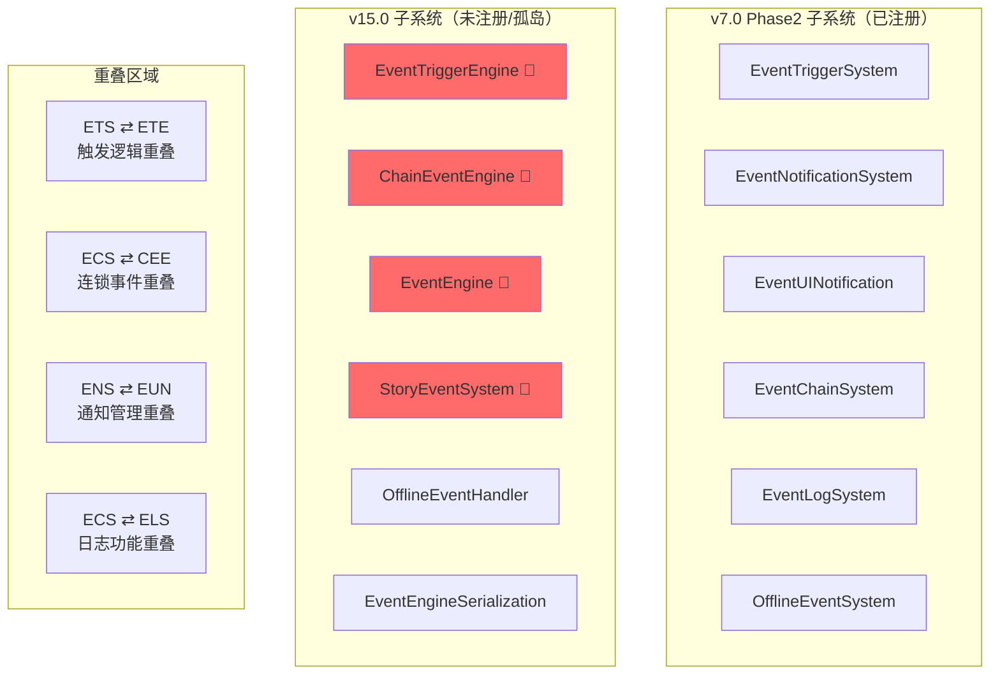

# v6.0 天下大势 — 技术审查报告 R1（Round 5）

> **审查日期**: 2026-04-23
> **审查范围**: engine/event/（事件系统）
> **审查结论**: ⚠️ **CONDITIONAL**

## 审查概要

| 维度 | 结果 |
|------|------|
| P0/P1/P2 | **1 / 4 / 3** |
| ISubsystem | ✅ 11/12 实现了 ISubsystem（OfflineEventHandler 除外，为工具类） |
| 文件行数 | ✅ 全部 ≤500 行（最大 EventTriggerSystem.ts 487 行） |
| as any | 0 处（生产代码） |
| 门面违规 | 0 处 |
| 测试覆盖 | 9/13 文件有测试，测试/源码行数比 = 4523/4837 ≈ 93.5% |

## 问题清单

| ID | 级别 | 文件 | 行号 | 描述 |
|----|------|------|------|------|
| P0-001 | P0 | engine-event-deps.ts | 24-25 | **EventTriggerEngine、ChainEventEngine 已导入但未使用**——import 死代码 |
| P1-001 | P1 | EventTriggerSystem.ts vs EventTriggerEngine.ts | 全文 | **功能重叠**：两个独立的 ISubsystem 都管理事件触发（cooldowns、triggerEvent、canTrigger），职责边界不清 |
| P1-002 | P1 | EventChainSystem.ts vs ChainEventSystem.ts | 全文 | **功能重叠**：两套独立的连锁事件系统，均有 registerChain/advanceChain，且 maxDepth 限制不一致（3 vs 5） |
| P1-003 | P1 | EventNotificationSystem.ts vs EventUINotification.ts | 全文 | **功能重叠**：两套通知系统，都管理 Banner，都 emit `event:banner_created` 事件 |
| P1-004 | P1 | EventChainSystem.ts:257 vs EventLogSystem.ts:94 | 全文 | **日志功能重叠**：EventChainSystem 内含 addLogEntry/getEventLog，与独立的 EventLogSystem 职责冲突 |
| P2-001 | P2 | EventChainSystem.ts:106 | 106 | maxDepth 硬编码限制为 3，ChainEventSystem 限制为 5，ChainEventEngine 限制为 5——**三处不一致** |
| P2-002 | P2 | EventEngine.ts + EventTriggerSystem.ts + EventUINotification.ts | 多处 | **eventBus 事件名重复发射**：`event:triggered`、`event:resolved`、`event:expired`、`event:banner_created` 各被 2 个子系统同时 emit，监听方会收到重复事件 |
| P2-003 | P2 | StoryEventSystem.ts + EventEngine.ts + ChainEventEngine.ts | — | **孤儿子系统**：StoryEventSystem、EventEngine、ChainEventEngine 未在 engine-event-deps.ts 中注册，不在 EventSystems 接口中 |

## 架构合规性

### ✅ 合规项

1. **ISubSystem 接口**：11/12 个类正确实现了 ISubsystem（init/update/reset 生命周期），OfflineEventHandler 为纯工具类无需实现
2. **门面模式**：index.ts 统一导出，UI 层无直接引用 engine 内部路径
3. **类型安全**：生产代码中无 `as any`，类型定义集中在 core/event/ 层
4. **文件大小**：所有文件 ≤500 行，符合规范
5. **序列化**：每个子系统均有 serialize/deserialize 方法，EventEngineSerialization 正确拆分
6. **测试覆盖**：核心系统均有对应测试文件，测试行数比达 93.5%
7. **无 console.log**：生产代码中无调试日志残留
8. **无 TODO/FIXME**：代码中无未完成标记

### ❌ 不合规项

1. **子系统膨胀**：15 个源文件实现 12 个 ISubsystem + 1 个工具类，同一模块内存在多套平行实现
2. **版本混叠**：v7.0 Phase2（EventChainSystem/StoryEventSystem/EventLogSystem）和 v15.0（EventEngine/EventTriggerEngine/ChainEventEngine/OfflineEventHandler）的代码共存于同一目录，未做版本隔离或迁移
3. **依赖注入不完整**：EventTriggerEngine 和 ChainEventEngine 被 import 到 engine-event-deps.ts 但未使用，StoryEventSystem 和 EventEngine 未被注册

### 架构关系图

## 亮点与改进

### 🌟 亮点

1. **序列化设计优秀**：EventEngineSerialization 通过接口（SerializableEventEngine）解耦，避免循环依赖
2. **eventBus 事件驱动**：子系统间通过事件总线通信，松耦合
3. **类型导出规范**：index.ts 区分 `export` 和 `export type`，避免不必要的运行时导入
4. **常量管理**：MAX_PILE_SIZE、MAX_ALLOWED_DEPTH、DEFAULT_WEIGHT 等命名清晰
5. **错误处理**：关键路径使用 throw Error 并附带上下文信息

### ⚠️ 改进建议

| 优先级 | 建议 |
|--------|------|
| P0 | 清理 engine-event-deps.ts 中未使用的 import（EventTriggerEngine、ChainEventEngine） |
| P1 | **统一触发系统**：将 EventTriggerEngine 的 v15.0 增强能力合并到 EventTriggerSystem，或明确分层（Engine 为底层，System 为门面） |
| P1 | **统一连锁事件**：合并 EventChainSystem 和 ChainEventSystem 为一套实现，统一 maxDepth 常量 |
| P1 | **统一通知系统**：明确 EventNotificationSystem（横幅）和 EventUINotification（弹窗）的职责边界，避免 emit 相同事件名 |
| P1 | **日志职责收拢**：EventChainSystem 中的 addLogEntry 应委托给 EventLogSystem |
| P2 | **注册孤儿子系统**：将 StoryEventSystem 和 EventEngine 纳入 EventSystems 接口和初始化流程，或移除 |
| P2 | **版本隔离**：在 index.ts 中用更清晰的注释或目录结构区分 v7.0 和 v15.0 代码，避免维护混乱 |

## 统计数据

| 指标 | 数值 |
|------|------|
| 源文件数 | 15 |
| 测试文件数 | 9 |
| 源码总行数 | 4,837 |
| 测试总行数 | 4,523 |
| ISubsystem 实现数 | 11 |
| 最大文件行数 | 487（EventTriggerSystem.ts） |
| eventBus 事件名数 | 18 |
| 重复事件名数 | 4（`event:triggered`、`event:resolved`、`event:expired`、`event:banner_created`） |
| 缺失测试文件 | 4（EventUINotification、OfflineEventHandler、EventEngineSerialization、ChainEventEngine） |
