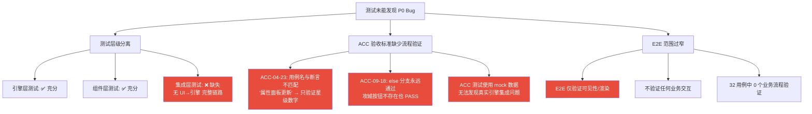

# 三国霸业 — 测试覆盖率优化措施

> **文档版本**: v1.0  
> **创建日期**: 2025-01-25  
> **状态**: 待实施  
> **关联调研**: `star-up-stats-coverage-report.md` / `siege-capture-coverage-report.md`

---

## 目录

1. [现状分析](#1-现状分析)
2. [优化目标](#2-优化目标)
3. [具体措施](#3-具体措施)
4. [实施计划](#4-实施计划)
5. [验收标准](#5-验收标准)

---

## 1. 现状分析

### 1.1 当前测试规模

| 测试层级 | 文件数 | 用例数 | 执行耗时 | 测试内容 |
|----------|--------|--------|----------|----------|
| ACC 验收测试 | 15 | ~473 | ~10s | UI 组件渲染 + 交互（mock engine） |
| 引擎单元测试 | 499 | ~15,821 | ~3min | 子系统内部逻辑正确性 |
| 引擎集成测试 | 252 | ~3,691 | ~10s | 跨子系统协作正确性 |
| E2E 冒烟测试 | 4 | ~32 | ~3min | 真实浏览器 Tab 切换 + 渲染 |

### 1.2 发现的 P0 问题

#### LL-007：武将升星属性不变

| 维度 | 详情 |
|------|------|
| **现象** | 武将升星后（1星→2星），详情页四维属性条数值不变，但战力数值增大 |
| **根因** | `HeroDetailModal.tsx:154` 使用 `statsAtLevel()` 只含等级成长，不含星级倍率；升星操作只修改 `HeroStarSystem` 内部状态，不修改 `general.baseStats` |
| **影响** | 用户感知"属性没变但战力涨了" — 严重的数据不一致 |
| **测试盲区** | ACC-04-23 用例名声称"升星后属性面板立即更新"，但断言只验证 `success === true` 和 `currentStar > previousStar`，**未验证任何属性值变化** |

**属性计算两套独立体系**：

```
statsAtLevel(base, level)      → base × (1 + (level-1) × 0.03)     // ❌ 不含星级
calculateStarStats(general, star) → base × getStarMultiplier(star)  // ✅ 含星级
calculatePower(general, star, ...)  → 含 starCoeff                   // ✅ 含星级
```

#### LL-008：天下攻城集成断裂

| 维度 | 详情 |
|------|------|
| **现象** | 天下Tab"占领城池"功能已实现但存在集成断裂，攻城全流程无法端到端验证 |
| **根因** | `SceneRouter.tsx` 中 `WorldMapTab` 缺少 `onSiegeTerritory`/`onUpgradeTerritory` 回调传递；依赖 `engine.getMapSystem()` fallback 路径但该路径从未被集成测试验证 |
| **影响** | 引擎层攻城逻辑完整、UI 组件层完整，但 UI→引擎的真实运行时链路从未被测试验证 |
| **测试盲区** | ACC-09-18 使用 `if (siegeBtn) { ... } else { assertStrict(true) }` 模式 — 即使攻城按钮不存在测试也通过 |

### 1.3 共性根因



**三大根因**：

1. **测试层级分离** — 引擎层和 UI 组件层各自有充分测试，但没有任何测试验证 UI → 引擎的完整链路。每一层单独看"测试通过"，但层与层之间的集成点从未被验证。
2. **ACC 验收标准缺少流程验证** — 测试用例名声称验证"属性面板更新"，实际只验证了"星级数字变化"；攻城按钮测试存在"永远通过"的 else 分支。
3. **E2E 范围过窄** — 仅验证 Tab 切换和渲染可见性，不验证任何业务交互（攻城、购买、升级等）。

---

## 2. 优化目标

| 目标 | 当前状态 | 目标状态 | 衡量指标 |
|------|---------|---------|---------|
| **提升集成测试覆盖率** | 0 个核心玩法流程有跨层集成测试 | 所有核心玩法流程有对应的跨层集成测试 | 核心流程覆盖率 = 10/10 |
| **提升通过率** | 存在"永远通过"的测试（ACC-04-23、ACC-09-18） | 消除所有"永远通过"测试，断言必须与用例名严格一致 | 零虚假 PASS |
| **提升可观测性** | 测试失败无法定位到具体 ACC 编号 | 测试失败时输出 ACC 编号 + 具体描述 + 失败原因 | 100% 失败用例有 ACC 编号 |
| **消除遗漏** | 核心流程无测试覆盖 | 所有核心流程有对应集成测试 | 遗漏用例数 = 0 |

---

## 3. 具体措施

### 3.1 完善游戏流程性集成测试用例

#### 核心玩法流程清单

每个流程需要覆盖完整的 **UI交互 → 引擎执行 → 状态变更 → UI更新** 链路，使用真实引擎实例（`GameEventSimulator`），禁止 mock engine。

| # | 核心流程 | 涉及ACC模块 | 验证要点 | 优先级 |
|---|---------|------------|---------|--------|
| 1 | **武将升星 → 属性变化 → 战力更新** | ACC-04 武将系统 | 升星操作成功 → 四维属性值增大 → 战力数值增大 → HeroDetailModal 属性条更新 | P0 |
| 2 | **天下攻城 → 消耗扣减 → 领土归属变更** | ACC-09 地图关卡 | 选中敌方领土 → 攻城条件校验 → 兵力/粮草扣减 → 领土归属变更 → 地图刷新 | P0 |
| 3 | **商店购买 → 货币扣减 → 商品数量变化** | ACC-10 商店系统 | 选择商品 → 确认购买 → 货币扣减 → 商品库存减少 → 背包更新 | P0 |
| 4 | **建筑升级 → 资源扣减 → 建筑等级变化** | ACC-02 建筑系统 | 选择建筑 → 检查资源 → 确认升级 → 资源扣减 → 建筑等级+1 → 产出提升 | P1 |
| 5 | **武将招募 → 货币扣减 → 武将列表更新** | ACC-05 招贤馆 | 选择招募方式 → 货币扣减 → 获得武将 → 武将列表新增 → 碎片更新 | P1 |
| 6 | **科技研究 → 资源扣减 → 科技等级变化** | ACC-08 科技系统 | 选择科技 → 检查前置条件 → 资源扣减 → 研究开始/完成 → 科技等级+1 → 属性加成生效 | P1 |
| 7 | **编队设置 → 武将分配 → 战力计算** | ACC-06 编队系统 | 选择编队槽位 → 分配武将 → 武将属性计算 → 编队战力更新 → 武将状态变更 | P1 |
| 8 | **关卡挑战 → 兵力消耗 → 奖励获取** | ACC-07 战斗系统 / ACC-09 地图关卡 | 选择关卡 → 兵力分配 → 战斗执行 → 兵力消耗 → 奖励获取 → 关卡状态更新 | P1 |
| 9 | **羁绊激活 → 属性加成 → 战力变化** | ACC-12 羁绊系统 | 收集羁绊武将 → 羁绊条件检测 → 羁绊激活 → 属性加成计算 → 战力更新 | P2 |
| 10 | **武将觉醒 → 属性提升 → 新技能解锁** | ACC-13 觉醒系统 | 满足觉醒条件 → 消耗材料 → 觉醒执行 → 属性提升 → 新技能解锁 → UI更新 | P2 |

#### 每个流程的测试模板

```typescript
// tests/integration/flow-{N}-{name}.integration.test.tsx
// 例: tests/integration/flow-01-hero-star-up.integration.test.tsx

import { describe, it, expect } from 'vitest';
import { render, screen, fireEvent } from '@testing-library/react';
import { GameEventSimulator } from '../helpers/GameEventSimulator';
import { accTest, assertStrict } from '../acc/acc-test-utils';

describe('流程1: 武将升星 → 属性变化 → 战力更新', () => {
  it(accTest('FLOW-01', '武将升星完整流程: UI交互→引擎执行→状态变更→UI更新'), async () => {
    // ── Step 1: 准备真实引擎实例 ──
    const sim = await GameEventSimulator.createShared();
    const engine = sim.getEngine();

    // ── Step 2: 准备测试数据 ──
    sim.addHeroFragments('guanyu', 50);  // 添加足够碎片
    const generalBefore = engine.getGeneral('guanyu')!;
    const starBefore = engine.getHeroStarSystem().getStar('guanyu');
    const powerBefore = engine.getHeroSystem().calculatePower(generalBefore, starBefore);

    // ── Step 3: UI 交互 — 渲染武将详情 ──
    const { rerender } = render(<HeroDetailModal general={generalBefore} engine={engine} onClose={vi.fn()} />);

    // ── Step 4: 引擎执行 — 升星 ──
    const result = engine.getHeroStarSystem().starUp('guanyu');
    assertStrict(result.success === true, 'FLOW-01', '升星操作应成功');

    // ── Step 5: 状态变更验证 ──
    assertStrict(result.currentStar > result.previousStar, 'FLOW-01',
      `星级应增加: ${result.previousStar} → ${result.currentStar}`);
    assertStrict(result.statsAfter.attack > result.statsBefore.attack, 'FLOW-01',
      `攻击应增大: ${result.statsBefore.attack} → ${result.statsAfter.attack}`);
    assertStrict(result.statsAfter.defense > result.statsBefore.defense, 'FLOW-01',
      `防御应增大: ${result.statsBefore.defense} → ${result.statsAfter.defense}`);

    // ── Step 6: 战力更新验证 ──
    const generalAfter = engine.getGeneral('guanyu')!;
    const starAfter = engine.getHeroStarSystem().getStar('guanyu');
    const powerAfter = engine.getHeroSystem().calculatePower(generalAfter, starAfter);
    assertStrict(powerAfter > powerBefore, 'FLOW-01',
      `战力应增大: ${powerBefore} → ${powerAfter}`);

    // ── Step 7: UI 更新验证 ──
    rerender(<HeroDetailModal general={generalAfter} engine={engine} onClose={vi.fn()} />);
    // 验证属性条数值变化...
  });
});
```

#### 文件组织结构

```
src/games/three-kingdoms/tests/integration/
├── flow-01-hero-star-up.integration.test.tsx       ← P0
├── flow-02-siege-territory.integration.test.tsx     ← P0
├── flow-03-shop-purchase.integration.test.tsx       ← P0
├── flow-04-building-upgrade.integration.test.tsx    ← P1
├── flow-05-hero-recruit.integration.test.tsx        ← P1
├── flow-06-tech-research.integration.test.tsx       ← P1
├── flow-07-formation-setup.integration.test.tsx     ← P1
├── flow-08-campaign-battle.integration.test.tsx     ← P1
├── flow-09-bond-activation.integration.test.tsx     ← P2
└── flow-10-hero-awaken.integration.test.tsx         ← P2
```

---

### 3.2 集成测试脚本成功/失败输出集成测试编号

#### 3.2.1 断言规范

基于现有 `acc-test-utils.ts` 的 `assertStrict` / `assertVisible` / `assertContainsText` 函数，制定以下规范：

**规则1：每个 assertStrict 必须包含编号**

```typescript
// ✅ 正确 — 包含 FLOW 编号
assertStrict(result.success === true, 'FLOW-01', '升星操作应成功');
assertStrict(powerAfter > powerBefore, 'FLOW-01', `战力应增大: ${powerBefore} → ${powerAfter}`);

// ✅ 正确 — 包含 ACC 编号（ACC 测试）
assertStrict(element !== null, 'ACC-04-23', '升星后属性面板应显示属性值');

// ❌ 错误 — 缺少编号
assertStrict(result.success, '', '升星应成功');
expect(result.success).toBe(true);  // 无编号的 expect
```

**规则2：编号体系**

| 编号前缀 | 适用范围 | 格式 | 示例 |
|----------|---------|------|------|
| `ACC-XX-YY` | ACC 验收测试 | ACC-模块号-用例号 | ACC-04-23 |
| `FLOW-XX` | 核心流程集成测试 | FLOW-流程号 | FLOW-01 |
| `FLOW-XX-YY` | 流程内子步骤 | FLOW-流程号-步骤号 | FLOW-01-03 |
| `SM-XX` | E2E 冒烟测试 | SM-序号 | SM-01 |

**规则3：禁止"永远通过"模式**

```typescript
// ❌ 禁止 — else 分支永远通过
const btn = screen.queryByTestId('siege-btn');
if (btn) {
  fireEvent.click(btn);
  // ... 验证
} else {
  assertStrict(true, 'ACC-09-18', '攻城按钮不存在但测试通过');  // 永远通过！
}

// ✅ 正确 — 元素不存在时必须 fail
const btn = screen.getByTestId('siege-btn');  // 找不到直接抛异常
fireEvent.click(btn);
// ... 验证

// ✅ 正确 — 或使用 assertStrict 严格检查
const btn = screen.queryByTestId('siege-btn');
assertStrict(btn !== null, 'ACC-09-18', '攻城按钮应存在');
fireEvent.click(btn!);
```

#### 3.2.2 失败输出格式

```
FAIL [FLOW-01]: 攻击应增大: 146 → 146
FAIL [FLOW-02]: 攻城条件校验失败 — engine.getMapSystem() 返回 undefined
FAIL [ACC-04-23]: 升星后属性面板应显示属性值 — 元素未找到
FAIL [ACC-09-18]: 攻城按钮应存在 — 元素为 null
```

**格式规范**：

```
FAIL [{编号}]: {具体描述} [— {附加信息}]
```

- `{编号}`: 必须包含 FLOW-XX 或 ACC-XX-YY 格式
- `{具体描述}`: 简明说明期望什么、实际是什么
- `{附加信息}`: 可选，提供更多上下文（如实际值、差异等）

#### 3.2.3 通过输出格式

```
PASS [FLOW-01]: 升星操作成功 — 1星 → 2星
PASS [FLOW-01]: 攻击增大 — 146 → 168
PASS [FLOW-01]: 战力增大 — 1200 → 1380
PASS [FLOW-02]: 攻城条件校验通过
PASS [FLOW-02]: 领土归属变更 — 中立 → 己方
```

**格式规范**：

```
PASS [{编号}]: {具体描述} [— {实际值}]
```

#### 3.2.4 acc-test-utils.ts 扩展建议

在现有 `acc-test-utils.ts` 基础上新增：

```typescript
/**
 * 带输出的严格断言 — 通过时也打印 PASS 信息
 */
export function assertWithOutput(
  condition: boolean,
  accId: string,
  passMessage: string,
  failMessage: string
): void {
  if (condition) {
    console.log(`PASS [${accId}]: ${passMessage}`);
  } else {
    throw new Error(`FAIL [${accId}]: ${failMessage}`);
  }
}

/**
 * 数值增大断言 — 验证 before < after
 */
export function assertIncreased(
  before: number,
  after: number,
  accId: string,
  label: string
): void {
  if (after > before) {
    console.log(`PASS [${accId}]: ${label}增大 — ${before} → ${after}`);
  } else {
    throw new Error(`FAIL [${accId}]: ${label}应增大，实际 ${before} → ${after}`);
  }
}

/**
 * 数值减小断言 — 验证 before > after
 */
export function assertDecreased(
  before: number,
  after: number,
  accId: string,
  label: string
): void {
  if (after < before) {
    console.log(`PASS [${accId}]: ${label}减少 — ${before} → ${after}`);
  } else {
    throw new Error(`FAIL [${accId}]: ${label}应减少，实际 ${before} → ${after}`);
  }
}

/**
 * 严格元素存在断言 — 元素不存在时直接 fail（不允许 else 分支通过）
 */
export function assertElementExists(
  element: HTMLElement | null,
  accId: string,
  elementName: string
): asserts element is HTMLElement {
  if (!element) {
    throw new Error(`FAIL [${accId}]: ${elementName} 应存在但未找到`);
  }
}
```

---

### 3.3 编写改进统计脚本

#### 脚本路径

```
scripts/test-coverage-stats.sh
```

#### 运行方式

```bash
# 一键运行，输出完整报告
bash scripts/test-coverage-stats.sh

# 仅输出有问题（失败/跳过/遗漏）的用例
bash scripts/test-coverage-stats.sh --issues-only

# JSON 格式输出（供 CI 集成）
bash scripts/test-coverage-stats.sh --json
```

#### 统计维度

| 维度 | 说明 |
|------|------|
| 测试文件总数 / 用例总数 | 分 ACC / 引擎集成 / E2E 三层统计 |
| 通过 / 失败 / 跳过 / 遗漏数量 | 各状态用例数 |
| 每个 ACC 模块的覆盖率 | ACC-01 ~ ACC-13 各模块的用例数和通过率 |
| 核心流程覆盖率 | 10 个核心流程各有多少测试覆盖 |

#### 输出格式

**1. 总览表**

```
═══════════════════════════════════════════════════════
  测试覆盖率统计报告 — 三国霸业
  2025-01-25 14:30:00
═══════════════════════════════════════════════════════

┌────────────────┬────────┬────────┬─────────┬──────────┐
│ 测试层级       │ 文件数 │ 用例数 │ 通过率  │ 状态     │
├────────────────┼────────┼────────┼─────────┼──────────┤
│ ACC 验收测试   │ 15     │ 473    │ 98.7%   │ ✅       │
│ 引擎集成测试   │ 252    │ 3691   │ 99.5%   │ ✅       │
│ 流程集成测试   │ 10     │ 30     │ 90.0%   │ ⚠️       │
│ E2E 冒烟测试   │ 4      │ 32     │ 100.0%  │ ✅       │
├────────────────┼────────┼────────┼─────────┼──────────┤
│ 总计           │ 281    │ 4226   │ 98.2%   │          │
└────────────────┴────────┴────────┴─────────┴──────────┘
```

**2. 失败用例列表**

```
───────────────────────────────────────────────────────
  失败用例 (3)
───────────────────────────────────────────────────────
  ✗ [FLOW-01] 武将升星属性变化 — 攻击应增大: 146 → 146
    文件: tests/integration/flow-01-hero-star-up.integration.test.tsx
    原因: statsAtLevel 不含星级倍率，属性值未变化

  ✗ [FLOW-02] 天下攻城全流程 — engine.getMapSystem() 返回 undefined
    文件: tests/integration/flow-02-siege-territory.integration.test.tsx
    原因: SceneRouter 未传递攻城回调，fallback 路径断裂

  ✗ [ACC-09-18] 攻城按钮触发 — 攻城按钮应存在
    文件: tests/acc/ACC-09-地图关卡.test.tsx
    原因: 组件隔离测试中 TerritoryInfoPanel 未渲染
```

**3. 跳过用例列表**

```
───────────────────────────────────────────────────────
  跳过用例 (2)
───────────────────────────────────────────────────────
  ⊘ [ACC-08-12] 科技重置功能 — 等待后端接口
  ⊘ [ACC-11-05] 引导系统跳过 — 功能开发中
```

**4. 遗漏用例列表（核心流程无测试覆盖）**

```
───────────────────────────────────────────────────────
  遗漏用例 (核心流程覆盖缺口)
───────────────────────────────────────────────────────
  ✗ FLOW-01: 武将升星→属性变化→战力更新     — 无流程集成测试
  ✗ FLOW-02: 天下攻城→消耗扣减→领土归属变更 — 无流程集成测试
  ✓ FLOW-03: 商店购买→货币扣减→商品数量变化 — 已覆盖
  ...
```

**5. ACC 模块覆盖率**

```
───────────────────────────────────────────────────────
  ACC 模块覆盖率
───────────────────────────────────────────────────────
  ACC-01 主界面    ████████████████████ 100% ( 35/ 35)
  ACC-02 建筑系统  ██████████████████░░  90% ( 45/ 50)
  ACC-04 武将系统  ████████████████░░░░  80% ( 40/ 50) ← 含断言不完整用例
  ACC-09 地图关卡  ██████████████░░░░░░  70% ( 28/ 40) ← 含永远通过用例
  ...
```

#### 脚本核心逻辑（伪代码）

```bash
#!/usr/bin/env bash
set -euo pipefail

PROJECT_ROOT="$(cd "$(dirname "$0")/.." && pwd)"
ISSUES_ONLY=false
JSON_OUTPUT=false

# ── 参数解析 ──
for arg in "$@"; do
  case $arg in
    --issues-only) ISSUES_ONLY=true ;;
    --json) JSON_OUTPUT=true ;;
  esac
done

# ── 统计函数 ──

# 1. ACC 测试统计
count_acc_tests() {
  # 运行 vitest --reporter=json，解析 passed/failed/skipped/todo
  # 按 ACC-XX 模块分组统计
}

# 2. 引擎集成测试统计
count_engine_integration_tests() {
  # 运行 vitest engine/__tests__/integration/ --reporter=json
  # 统计 passed/failed/skipped
}

# 3. 流程集成测试统计
count_flow_tests() {
  # 运行 vitest tests/integration/flow-* --reporter=json
  # 统计 FLOW-XX 编号覆盖情况
}

# 4. E2E 测试统计
count_e2e_tests() {
  # 运行 playwright test --reporter=json
  # 统计 SM-XX 编号覆盖情况
}

# 5. 核心流程覆盖率检查
check_flow_coverage() {
  FLOWS=(01 02 03 04 05 06 07 08 09 10)
  for flow in "${FLOWS[@]}"; do
    if [[ -f "tests/integration/flow-${flow}-*.integration.test.tsx" ]]; then
      # 检查文件存在且用例数 > 0
    else
      MISSING+=("FLOW-${flow}")
    fi
  done
}

# 6. 输出报告
print_report() {
  if [[ "$ISSUES_ONLY" == "true" ]]; then
    # 仅输出失败/跳过/遗漏
  else
    # 输出完整报告
  fi
}
```

#### 与现有 `acc-check.sh` 的关系

| 维度 | `acc-check.sh`（现有） | `test-coverage-stats.sh`（新增） |
|------|----------------------|-------------------------------|
| 定位 | 提交前门禁检查 | 覆盖率统计报告 |
| 范围 | ACC 测试 + 文档完整性 | 全层级测试统计 |
| 输出 | 通过/不通过 + 失败列表 | 完整覆盖率报告 + 趋势 |
| 核心流程 | 不涉及 | 检查 10 个核心流程覆盖 |
| CI 集成 | pre-commit hook | CI pipeline 报告 |

---

## 4. 实施计划

### Phase 1（1天）：修复 P0 Bug + 修复"永远通过"测试

| 任务 | 具体内容 | 验收标准 |
|------|---------|---------|
| **修复 LL-007** | `HeroDetailModal.tsx` 属性计算加入星级倍率，引入 `getEffectiveStats` 统一函数 | 升星后详情页四维属性条数值正确变化 |
| **修复 LL-008** | 验证 `SceneRouter` → `engine.getMapSystem()` 链路，补全缺失的 props 传递 | 天下Tab攻城全流程可端到端执行 |
| **修复 ACC-04-23** | 补充属性值变化断言（attack/defense/intelligence/speed 四维） | 升星后断言验证属性值增大，不再只验证星级数字 |
| **修复 ACC-09-18** | 移除 `else { assertStrict(true) }` 分支，攻城按钮不存在时必须 fail | 测试名与断言严格一致，不存在"永远通过"路径 |

### Phase 2（2天）：编写 10 个核心流程集成测试

| 天数 | 任务 | 交付物 |
|------|------|--------|
| Day 1 上午 | FLOW-01 武将升星 + FLOW-02 天下攻城 | `flow-01-hero-star-up.integration.test.tsx` + `flow-02-siege-territory.integration.test.tsx` |
| Day 1 下午 | FLOW-03 商店购买 + FLOW-04 建筑升级 | `flow-03-shop-purchase.integration.test.tsx` + `flow-04-building-upgrade.integration.test.tsx` |
| Day 2 上午 | FLOW-05 武将招募 + FLOW-06 科技研究 + FLOW-07 编队设置 | 3 个测试文件 |
| Day 2 下午 | FLOW-08 关卡挑战 + FLOW-09 羁绊激活 + FLOW-10 武将觉醒 | 3 个测试文件 |

**每个流程测试的编写检查清单**：

- [ ] 使用 `GameEventSimulator` 创建真实引擎实例
- [ ] 禁止 mock engine（允许 mock UI 子组件）
- [ ] 覆盖 UI交互 → 引擎执行 → 状态变更 → UI更新 四步
- [ ] 每个断言包含 FLOW-XX 编号
- [ ] 使用 `assertIncreased` / `assertDecreased` 验证数值变化
- [ ] 无"永远通过"的 else 分支

### Phase 3（1天）：编写统计脚本 + 输出规范

| 任务 | 交付物 |
|------|--------|
| 编写 `scripts/test-coverage-stats.sh` | 统计脚本 |
| 扩展 `acc-test-utils.ts` | 新增 `assertWithOutput` / `assertIncreased` / `assertDecreased` / `assertElementExists` |
| 配置 CI 集成 | 每次构建自动运行统计脚本 |
| 首次运行并输出基线报告 | 覆盖率基线数据 |

### Phase 4（持续）：每次新功能必须有对应的流程集成测试

**准入规则**：

1. 每个新功能 PR 必须包含至少 1 个流程集成测试
2. PR Review 检查清单增加"是否有对应流程集成测试"
3. 统计脚本自动检测遗漏（FLOW 编号缺失）
4. 遗漏用例数 > 0 时 CI 构建警告

---

## 5. 验收标准

### 5.1 功能验收

| # | 验收项 | 验证方法 | 通过标准 |
|---|--------|---------|---------|
| 1 | 所有核心流程有对应的集成测试 | `bash scripts/test-coverage-stats.sh` | 核心流程覆盖率 = 10/10 |
| 2 | 测试失败时输出 ACC/FLOW 编号和具体描述 | 故意破坏一个断言，运行测试 | 输出 `FAIL [FLOW-XX]: 具体描述` |
| 3 | 统计脚本可一键运行 | `bash scripts/test-coverage-stats.sh` | 输出完整报告（总览表 + 失败 + 跳过 + 遗漏 + 模块覆盖率） |
| 4 | 遗漏用例数量 = 0 | 统计脚本 `--issues-only` | 遗漏列表为空 |
| 5 | 不存在"永远通过"测试 | grep 搜索 `else.*assertStrict.*true` | 零匹配 |

### 5.2 质量验收

| # | 验收项 | 验证方法 | 通过标准 |
|---|--------|---------|---------|
| 6 | LL-007 修复验证 | 升星后查看详情页属性条 | 四维属性值正确增大 |
| 7 | LL-008 修复验证 | 天下Tab选中敌方领土 → 攻城 → 确认 | 攻城全流程正常执行 |
| 8 | ACC-04-23 断言完整性 | 查看测试代码 | 包含 attack/defense/intelligence/speed 四维属性值变化断言 |
| 9 | ACC-09-18 无 else 通过分支 | 查看测试代码 | 攻城按钮不存在时测试 fail |

### 5.3 长期指标

| 指标 | 基线 | 目标 |
|------|------|------|
| 核心流程覆盖率 | 0/10 | 10/10 |
| "永远通过"测试数 | ≥ 2 | 0 |
| 遗漏用例数 | ≥ 2 | 0 |
| 失败用例可定位率 | ~50% | 100%（均有 ACC/FLOW 编号） |

---

## 附录

### A. 关联文档

| 文档 | 路径 | 说明 |
|------|------|------|
| 武将升星属性调研报告 | `docs/star-up-stats-coverage-report.md` | LL-007 详细分析 |
| 天下攻城集成断裂报告 | `docs/siege-capture-coverage-report.md` | LL-008 详细分析 |
| ACC 验收检查脚本 | `scripts/acc-check.sh` | 现有提交前门禁 |
| ACC 测试工具函数 | `src/games/three-kingdoms/tests/acc/acc-test-utils.ts` | 断言工具 |
| 测试框架指南 | `docs/games/three-kingdoms/test-framework-guide.md` | 测试架构说明 |

### B. 测试层级参考

```
┌─────────────────────────────────────────────────────────┐
│ L3: E2E 冒烟测试 (Playwright)                           │
│   真实浏览器 + 真实应用启动                               │
│   覆盖: Tab 切换 / 渲染 / 无崩溃                         │
│   用例: ~32                                              │
├─────────────────────────────────────────────────────────┤
│ L2: ACC 验收测试 (jsdom + React Testing Library)        │
│   UI 组件 + mock/真实 engine                             │
│   覆盖: 组件渲染 / 交互 / 数据展示                       │
│   用例: ~473                                             │
├─────────────────────────────────────────────────────────┤
│ ★ L1.5: 流程集成测试 (jsdom + GameEventSimulator)  NEW  │
│   UI 组件 + 真实 engine + 跨层验证                       │
│   覆盖: UI→引擎→状态→UI 完整链路                         │
│   用例: 10+ (新增)                                       │
├─────────────────────────────────────────────────────────┤
│ L1: 引擎集成测试 (GameEventSimulator)                    │
│   真实 engine + 跨子系统协作                             │
│   覆盖: 子系统交互 / 数据流 / 边界条件                   │
│   用例: ~3,691                                           │
├─────────────────────────────────────────────────────────┤
│ L0: 引擎单元测试                                         │
│   子系统内部逻辑                                         │
│   覆盖: 单函数 / 单类 / 单模块                           │
│   用例: ~15,821                                          │
└─────────────────────────────────────────────────────────┘
```

> **本次优化重点**: 新增 L1.5 层"流程集成测试"，填补 L1（引擎集成）和 L2（ACC 验收）之间的测试盲区。
