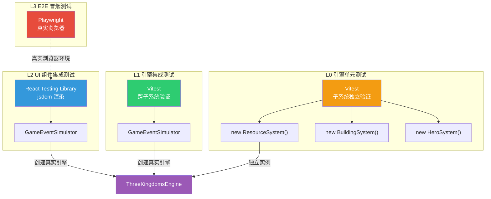
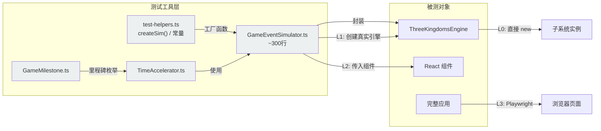
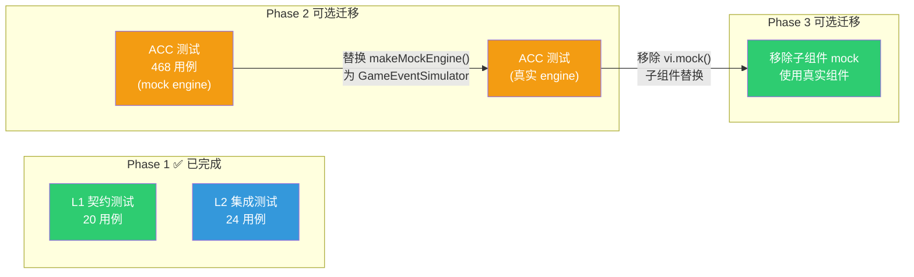

# 三国霸业 — 四层分层测试架构设计文档

> **版本**: v2.0 | **更新日期**: 2025-07-11 | **适用范围**: 三国霸业项目全测试体系
>
> **核心变更**：从"混合分层"重构为"严格四层分层"，明确每层的职责边界、允许/禁止操作和 Mock 规范。

---

## 一、设计动机：为什么需要严格分层

### 1.1 历史教训

项目曾出现多次**测试全绿但生产环境崩溃**的严重事故：

| Bug | 严重程度 | 测试为什么没发现 |
|-----|---------|----------------|
| 商店 Tab ID 不匹配（`general` vs `normal`） | P0 | ACC 测试 mock 了 engine，`getShopGoods('normal')` 硬编码返回数据，与组件自洽但与真实引擎不一致 |
| ShopSystem 未初始化（`init()`/`setCurrencySystem()` 未调用） | P1 | 测试中 `getShopSystem()` 永远返回有效 mock 对象，从未验证真实引擎初始化链路 |
| 武将 Tab 引导系统 registry key 不匹配（`tutorial-state` vs `tutorialStateMachine`） | P0 | ACC 测试 mock 了所有子组件（GuideOverlay 等 8 个组件全部替换成空壳 div），registry 查找逻辑根本不会执行 |
| isStepCompleted localStorage 解析无防御 | P1 | 测试从未覆盖"从 localStorage 加载引导状态"的真实场景 |

### 1.2 根因分析：Mock 三重陷阱

所有历史 Bug 的根因都是 **ACC 测试使用完全 mock 的 engine 对象**，形成"三重陷阱"：

| 陷阱 | 表现 | 后果 |
|------|------|------|
| **Mock 自洽陷阱** | mock 行为与组件期望一致，但与真实 engine 不一致 | 测试通过但生产环境报错 |
| **Mock 覆盖陷阱** | 子组件全部 mock 成空壳 div | 子组件的 bug 完全不可见 |
| **类型断言陷阱** | `as unknown as ThreeKingdomsEngine` 跳过类型检查 | mock 可以缺少任何方法而不报错 |

**一句话总结**：之前的测试验证的是"如果 engine 工作正常，UI 能否正确渲染"，但从未验证"engine 是否真的工作正常"。

### 1.3 新架构的解决思路

引入**严格四层分层测试架构**，每层有明确的职责边界和操作规范：

```
┌─────────────────────────────────────────────────────────────────┐
│  L3  E2E 冒烟测试（Playwright）                                 │
│  真实浏览器 + 真实引擎 + 真实渲染                                │
│  覆盖：7主Tab + 17功能面板 + Console错误捕获                     │
│  用例：~6个  执行：~3分钟  触发：CI/手动                         │
│  ══════════════════════════════════════════════════════════════  │
│  禁止：无限制扩展用例数量，仅保留关键冒烟路径                     │
├─────────────────────────────────────────────────────────────────┤
│  L2  UI 组件集成测试（Vitest + React Testing Library）           │
│  真实 Engine（via GameEventSimulator）+ 真实 React 组件           │
│  覆盖：Tab切换渲染 + 商店购买流程 + 面板数据正确性                │
│  用例：~24个  执行：~10秒  触发：每次提交                        │
│  ══════════════════════════════════════════════════════════════  │
│  禁止：mock engine、直接 new 子系统、不验证数据正确性             │
├─────────────────────────────────────────────────────────────────┤
│  L1  引擎集成测试（Vitest + GameEventSimulator）                 │
│  真实 ThreeKingdomsEngine 实例，验证跨子系统协作                  │
│  覆盖：106个getter非null + 51个registry key + 跨子系统流程       │
│  用例：~81文件  执行：~2秒  触发：每次提交                       │
│  ══════════════════════════════════════════════════════════════  │
│  禁止：mock engine、new 子系统、直接操作子系统内部                │
├─────────────────────────────────────────────────────────────────┤
│  L0  引擎单元测试（Vitest）                                     │
│  直接 new 子系统实例，独立验证每个子系统的内部逻辑                 │
│  覆盖：所有引擎子系统的纯逻辑验证                                │
│  用例：~15,821个/499文件  执行：~3分钟  触发：CI                 │
│  ══════════════════════════════════════════════════════════════  │
│  允许：new 子系统、mock 子系统依赖、直接测试子系统内部方法        │
└─────────────────────────────────────────────────────────────────┘
```

**关键设计原则**：
- **L0 是唯一允许直接 new 子系统和 mock 依赖的层级**
- **L1/L2 必须通过 GameEventSimulator 使用真实 ThreeKingdomsEngine 实例**
- **L2 必须验证 UI 组件与真实 engine 交互后的数据正确性**
- **L3 仅用于关键路径的冒烟验证**，避免所有测试都依赖 Playwright

---

## 二、分层架构总览

### 2.1 架构层级关系图



### 2.2 各层职责与边界速查

| 维度 | L0 引擎单元测试 | L1 引擎集成测试 | L2 UI 组件集成测试 | L3 E2E 冒烟测试 |
|------|----------------|----------------|-------------------|----------------|
| **核心职责** | 子系统内部逻辑正确性 | 跨子系统协作正确性 | UI 与真实 engine 交互正确性 | 真实浏览器端到端流程 |
| **Engine 来源** | `new SubSystem()` | `GameEventSimulator` | `GameEventSimulator` | 真实应用启动 |
| **允许 mock** | ✅ 子系统依赖 | ❌ 禁止 mock engine | ❌ 禁止 mock engine | ❌ 无 mock |
| **允许 new 子系统** | ✅ 允许 | ❌ 严格禁止 | ❌ 严格禁止 | N/A |
| **UI 渲染** | 无 | 无 | jsdom（React Testing Library） | 真实浏览器 |
| **文件位置** | `engine/**/__tests__/` | `engine/**/__tests__/integration/` | `tests/integration/` | `e2e/` |
| **用例规模** | ~15,821 / 499文件 | ~81文件 | ~15文件 / ~468用例 | ~6个 |
| **执行耗时** | ~3分钟 | ~10秒 | ~10秒 | ~3分钟 |

### 2.3 数据流与依赖关系



---

## 三、L0 引擎单元测试

### 3.1 定位与职责

L0 是**最底层**的测试，直接实例化引擎子系统，独立验证每个子系统的内部逻辑。

**核心价值**：
- 快速定位子系统内部的逻辑错误
- 无需依赖其他子系统，测试隔离性好
- 覆盖边界条件和异常路径

### 3.2 规范

| 维度 | 规范 |
|------|------|
| **方法** | 直接 `new` 子系统实例进行测试 |
| **工具** | Vitest + 直接 import 子系统 |
| **允许操作** | `new ResourceSystem()`、mock 子系统依赖（如 mock `EventBus`）、直接调用子系统内部方法 |
| **禁止操作** | 无特殊禁止（此层允许最大自由度） |
| **覆盖范围** | 每个引擎子系统的独立逻辑验证 |

### 3.3 文件组织

```
engine/
├── resource/
│   ├── __tests__/
│   │   ├── ResourceSystem.test.ts          ← 基础逻辑
│   │   ├── ResourceSystem.features.test.ts ← 功能特性
│   │   └── ...
├── building/
│   ├── __tests__/
│   │   ├── BuildingSystem.test.ts
│   │   └── ...
├── hero/
│   ├── __tests__/
│   │   ├── HeroSystem.test.ts
│   │   └── ...
└── ...（共 ~499 个测试文件）
```

### 3.4 代码示例

```typescript
// engine/resource/__tests__/ResourceSystem.test.ts
import { describe, it, expect } from 'vitest';
import { ResourceSystem } from '../ResourceSystem';
// L0 允许直接 new 子系统、mock 依赖

describe('ResourceSystem', () => {
  it('应正确计算资源产出速率', () => {
    const resourceSystem = new ResourceSystem();  // ✅ L0 允许直接 new
    resourceSystem.init();

    resourceSystem.addResource('grain', 100);
    expect(resourceSystem.getAmount('grain')).toBe(100);
  });

  it('应正确处理资源上限截断', () => {
    const resourceSystem = new ResourceSystem();
    resourceSystem.init();
    resourceSystem.setCap('grain', 200);

    resourceSystem.addResource('grain', 300);
    expect(resourceSystem.getAmount('grain')).toBe(200); // 被上限截断
  });
});
```

### 3.5 执行命令

```bash
# 运行所有引擎单元测试
pnpm test:tk

# 运行单个子系统的测试
pnpm vitest run --config vitest.config.three-kingdoms.ts \
  'src/games/three-kingdoms/engine/resource/__tests__/'
```

---

## 四、L1 引擎集成测试

### 4.1 定位与职责

L1 使用 **GameEventSimulator** 创建真实的 `ThreeKingdomsEngine` 实例，验证跨子系统协作的正确性。

**核心价值**：
- 验证子系统之间的交互是否正确（如升级建筑→资源扣减→经验增加）
- 验证引擎初始化后所有接口可用（契约测试）
- 验证前后端 ID/Key 一致性

### 4.2 规范

| 维度 | 规范 |
|------|------|
| **方法** | 通过 `GameEventSimulator` 创建真实 `ThreeKingdomsEngine` 实例 |
| **工具** | Vitest + `GameEventSimulator`（提供 `addResources`/`upgradeBuilding`/`recruitHero`/`fastForward` 等高层 API） |
| **允许操作** | 使用 `createSim()` 创建实例、调用 `sim.*` 高层 API、通过 `sim.engine` 访问真实引擎的公开 API |
| **🚫 严格禁止** | mock engine、`new` 子系统、直接操作子系统内部（如 `sim.engine.resource.setCap()` 仅在 GameEventSimulator 内部使用） |
| **覆盖范围** | 跨子系统协作验证、引擎契约验证、前后端一致性验证 |

### 4.3 文件组织

```
engine/
├── __tests__/
│   ├── ThreeKingdomsEngine.test.ts        ← 引擎核心测试
│   ├── engine-resource.test.ts            ← 资源流程集成
│   ├── engine-building.test.ts            ← 建筑流程集成
│   ├── engine-campaign-integration.test.ts ← 关卡流程集成
│   └── integration/                       ← 跨子系统流程测试
│       ├── v1-e2e-flow.integration.test.ts
│       ├── v1-trd-flow.integration.test.ts
│       ├── v2-hero-data-flow.integration.test.ts
│       ├── v3-battle-flow.integration.test.ts
│       └── ...（共 ~81 个集成测试文件）
```

### 4.4 代码示例

```typescript
// engine/__tests__/integration/v1-e2e-flow.integration.test.ts
import { describe, it, expect } from 'vitest';
import { createSim, SUFFICIENT_RESOURCES } from '../../../test-utils/test-helpers';
import type { GameEventSimulator } from '../../../test-utils/GameEventSimulator';

// ✅ L1 正确模式：通过 createSim() 使用真实引擎
describe('V1 E2E-FLOW 端到端验证', () => {
  it('应完成完整游戏循环：init → tick → upgrade → verify', () => {
    const sim = createSim();  // 创建真实引擎实例

    // 验证初始资源（来自真实引擎初始化）
    expect(sim.getResource('grain')).toBe(500);
    expect(sim.getResource('gold')).toBe(300);

    // 时间快进 → 资源自然增长
    const grainBefore = sim.getResource('grain');
    sim.fastForwardSeconds(60);
    expect(sim.getResource('grain')).toBeGreaterThan(grainBefore);

    // 升级建筑 → 资源扣减 + 等级提升
    sim.addResources(SUFFICIENT_RESOURCES);
    sim.upgradeBuilding('castle');   // castle → Lv2
    sim.upgradeBuilding('farmland'); // farmland → Lv2
    expect(sim.getBuildingLevel('farmland')).toBe(2);
  });
});
```

```typescript
// ❌ L1 错误模式：严格禁止
import { ResourceSystem } from '../../resource/ResourceSystem';

describe('错误示例', () => {
  it('❌ 不要直接 new 子系统', () => {
    const resource = new ResourceSystem(); // 违规！L1 禁止 new 子系统
  });

  it('❌ 不要 mock engine', () => {
    const mockEngine = { getResource: vi.fn().mockReturnValue(100) }; // 违规！
  });
});
```

### 4.5 执行命令

```bash
# 运行引擎集成测试
pnpm vitest run --config vitest.config.three-kingdoms.ts \
  'src/games/three-kingdoms/engine/__tests__/integration/'

# 运行契约测试
pnpm test:contract
```

---

## 五、L2 UI 组件集成测试

### 5.1 定位与职责

L2 使用 **GameEventSimulator 创建真实 engine** → 传入 **React 组件** → 验证 **渲染结果和数据正确性**。

**核心价值**：
- 验证 UI 组件与真实 engine 的交互是否正确
- 验证 Tab 切换后面板能正常渲染且**数据显示正确**
- 替代旧 ACC 测试中的 mock engine 模式，消除 Mock 三重陷阱

### 5.2 规范

| 维度 | 规范 |
|------|------|
| **方法** | 通过 `GameEventSimulator` 创建真实 engine → 传入 React 组件 → 验证渲染结果 |
| **工具** | Vitest + React Testing Library + GameEventSimulator |
| **允许操作** | 使用 `createSim()` 创建真实 engine、mock CSS 模块、mock 纯 UI 子组件（如 SharedPanel 的渲染壳） |
| **🚫 严格禁止** | mock engine、直接 `new` 子系统、不验证数据正确性（仅验证"不崩溃"是不够的） |
| **覆盖范围** | UI 组件与真实 engine 的交互验证，必须验证数据显示正确 |

### 5.3 文件组织

```
tests/
├── integration/
│   ├── scene-router.test.tsx        ← Tab 切换渲染测试
│   └── shop-integration.test.tsx    ← 商店深度集成测试
├── acc/                             ← ACC 验收测试（使用 mock engine，历史遗留）
│   ├── ACC-01-主界面.test.tsx
│   ├── ACC-10-商店系统.test.tsx
│   └── ...（共 ~15 个 ACC 文件）
```

### 5.4 代码示例

```typescript
// tests/integration/scene-router.test.tsx
import { describe, it, expect, vi, beforeEach, afterEach } from 'vitest';
import { render, screen, cleanup } from '@testing-library/react';
import React from 'react';
import { GameEventSimulator } from '../../test-utils/GameEventSimulator';
import type { ThreeKingdomsEngine } from '../../engine/ThreeKingdomsEngine';
import ShopPanel from '@/components/idle/panels/shop/ShopPanel';

// ✅ 允许 mock CSS 模块（不影响逻辑）
vi.mock('@/components/idle/panels/shop/ShopPanel.css', () => ({}));

// ✅ 允许 mock 纯 UI 壳组件（SharedPanel 是布局容器，不影响业务逻辑）
vi.mock('@/components/idle/components/SharedPanel', () => ({
  __esModule: true,
  default: function MockSharedPanel({ children, visible, title, onClose }: any) {
    return visible === false ? null : (
      <div data-testid="shared-panel" data-title={title}>
        <div className="shared-panel-content">{children}</div>
        <button data-testid="shared-panel-close" onClick={onClose}>✕</button>
      </div>
    );
  },
}));

describe('ShopPanel 集成测试', () => {
  let engine: ThreeKingdomsEngine;

  beforeEach(() => {
    // ✅ L2 正确模式：通过 GameEventSimulator 创建真实引擎
    const sim = new GameEventSimulator();
    sim.init();
    engine = sim.engine;

    // 对未完全集成的子系统提供最小 stub（仅 ShopSystem 等特殊情况）
    // 注意：这是 stub 而非 mock，仅提供最小接口使组件不崩溃
    const shopStub = { /* 最小接口 */ };
    (engine as any).getShopSystem = () => shopStub;
  });

  afterEach(() => {
    cleanup();
  });

  it('应正确渲染商店面板标题', () => {
    render(<ShopPanel engine={engine} visible={true} onClose={vi.fn()} />);

    // ✅ 必须验证数据正确性，不能只验证"不崩溃"
    expect(screen.getByText('杂货铺')).toBeInTheDocument();
    expect(container.innerHTML).not.toBe('');
  });
});
```

### 5.5 与旧 ACC 测试的关键区别

| 维度 | 旧 ACC 测试（Mock Engine） | L2 集成测试（真实 Engine） |
|------|--------------------------|--------------------------|
| Engine 创建 | `makeMockEngine()` → 全部 mock | `new GameEventSimulator()` → 真实实例 |
| 类型安全 | `as unknown as ThreeKingdomsEngine` 跳过检查 | 直接使用真实类型，编译期检查 |
| 数据来源 | 硬编码 mock 返回值 | 真实引擎计算结果 |
| 能发现的 Bug | 仅组件渲染 Bug | 引擎初始化问题 + 组件渲染 Bug + 数据不一致 |
| 验证深度 | "组件不崩溃" | "数据显示正确且与引擎一致" |

### 5.6 执行命令

```bash
pnpm test:integration
# 或
pnpm vitest run --config vitest.config.three-kingdoms.ts \
  'src/games/three-kingdoms/tests/integration/'
```

---

## 六、L3 E2E 冒烟测试

### 6.1 定位与职责

L3 在**真实浏览器**中启动完整应用，验证关键用户路径。

**核心价值**：
- 验证真实浏览器环境下的端到端流程
- 捕获 jsdom 无法发现的 CSS/布局/浏览器 API 兼容性问题
- 验证 Console 无 ReferenceError 等致命错误

### 6.2 规范

| 维度 | 规范 |
|------|------|
| **方法** | Playwright 启动真实浏览器 → 操作完整游戏流程 |
| **工具** | Playwright |
| **允许操作** | 模拟用户点击、截图、Console 错误捕获 |
| **禁止操作** | 无限制扩展用例数量（仅保留关键冒烟路径） |
| **覆盖范围** | 7主Tab + 17功能面板的完整流程验证 |

### 6.3 文件组织

```
e2e/
├── three-kingdoms-smoke.test.ts   ← 冒烟测试主文件
├── white-screen-smoke.test.ts     ← 白屏防护测试
└── screenshots/                   ← 自动截图
```

### 6.4 测试覆盖范围

| 编号 | 测试内容 | 覆盖范围 |
|------|---------|---------|
| 1 | 首页加载检测 | 无白屏、TabBar 可见、默认 Tab 正确 |
| 2 | 7 个一级 Tab 切换 | 每个 Tab 可点击、内容非空、无 ReferenceError |
| 3 | "更多▼"菜单 16 个功能面板 | 每个面板可打开、内容非空 |
| 3b | FeatureMenu 5 个扩展面板 | 远征/装备/名士/竞技/军队 |
| 4 | Console 错误汇总 | 全 Tab 遍历无 ReferenceError |
| 5 | 声望面板专项 | 完整渲染验证 |

### 6.5 Console 错误捕获机制

```typescript
class ConsoleErrorCollector {
  private errors: Array<{ type: string; text: string }> = [];

  attach(page: Page) {
    page.on('console', (msg) => {
      if (msg.type() === 'error') this.errors.push({ type: 'console.error', text: msg.text() });
    });
    page.on('pageerror', (err) => {
      this.errors.push({ type: 'pageerror', text: `${err.name}: ${err.message}` });
    });
  }

  getReferenceErrors() {
    return this.errors.filter(e => e.text.includes('ReferenceError'));
  }
}
```

### 6.6 执行命令

```bash
# 需要先启动开发服务器
pnpm preview &  pnpm test:e2e
```

---

## 七、GameEventSimulator 使用指南

### 7.1 概述

`GameEventSimulator` 是项目核心测试基础设施，封装真实 `ThreeKingdomsEngine`，提供高层 API 用于测试场景模拟。**所有方法直接调用真实引擎 API**，确保测试与生产行为一致。

**文件位置**：`src/games/three-kingdoms/test-utils/GameEventSimulator.ts`（~300行）

### 7.2 实例创建

```typescript
import { GameEventSimulator } from '../../test-utils/GameEventSimulator';
import { createSim, createSimWithResources, createSimForResourceUpgrade } from '../../test-utils/test-helpers';

// 方式 1：独立实例（推荐，每次创建新实例，测试间隔离）
const sim = createSim();
// 等价于: new GameEventSimulator() + sim.init()

// 方式 2：带指定资源的独立实例
const sim = createSimWithResources({ grain: 10000, gold: 20000 });

// 方式 3：带充足资源的独立实例（用于升级测试）
const sim = createSimForResourceUpgrade();
// 等价于: createSimWithResources({ grain: 50000, gold: 50000, troops: 50000 })

// 方式 4：共享实例（测试间复用，适合只读验证如契约测试）
const sim = GameEventSimulator.createShared();

// 方式 5：手动创建 + 初始化
const sim = new GameEventSimulator();
sim.init();
```

### 7.3 完整 API 列表

#### 生命周期

| 方法 | 说明 | 返回值 |
|------|------|--------|
| `sim.init()` | 初始化引擎（等同于新游戏） | `this`（链式调用） |
| `sim.reset()` | 重置引擎到初始状态 | `this` |

#### 资源操作

| 方法 | 说明 | 返回值 |
|------|------|--------|
| `sim.addResources(resources)` | 添加指定资源 | `this` |
| `sim.consumeResources(resources)` | 消耗指定资源 | `this` |
| `sim.setResource(type, amount)` | 设置指定资源为精确值 | `this` |
| `sim.getResource(type)` | 获取指定资源数量 | `number` |
| `sim.getAllResources()` | 获取全部资源 | `Record<ResourceType, number>` |

**参数类型**：`resources` 为 `Partial<Record<ResourceType, number>>`，例如 `{ grain: 5000, gold: 3000 }`

#### 建筑操作

| 方法 | 说明 | 返回值 |
|------|------|--------|
| `sim.upgradeBuilding(type)` | 升级建筑（扣费→即时完成） | `this` |
| `sim.upgradeBuildingTo(type, targetLevel)` | 批量升级到指定等级 | `this` |
| `sim.getBuildingLevel(type)` | 获取建筑等级 | `number` |
| `sim.getAllBuildingLevels()` | 获取所有建筑等级 | `Record<BuildingType, number>` |

#### 武将操作

| 方法 | 说明 | 返回值 |
|------|------|--------|
| `sim.recruitHero(type?, count?)` | 招募武将（通过招募系统） | `this` |
| `sim.addHeroDirectly(generalId)` | 直接添加武将（绕过招募） | `GeneralData \| null` |
| `sim.getGenerals()` | 获取所有武将 | `Readonly<GeneralData>[]` |
| `sim.getGeneralCount()` | 获取武将数量 | `number` |
| `sim.getTotalPower()` | 获取总战力 | `number` |
| `sim.addHeroFragments(generalId, count)` | 增加武将碎片 | `this` |

#### 战斗/关卡

| 方法 | 说明 | 返回值 |
|------|------|--------|
| `sim.winBattle(stageId, stars?)` | 战斗胜利（执行战斗并完成关卡） | `BattleResult` |
| `sim.getCampaignProgress()` | 获取关卡进度 | `CampaignProgress` |
| `sim.getStageList()` | 获取关卡列表 | `Stage[]` |

#### 时间快进

| 方法 | 说明 | 返回值 |
|------|------|--------|
| `sim.fastForward(deltaMs)` | 快进指定毫秒 | `this` |
| `sim.fastForwardSeconds(seconds)` | 快进指定秒 | `this` |
| `sim.fastForwardMinutes(minutes)` | 快进指定分钟 | `this` |
| `sim.fastForwardHours(hours)` | 快进指定小时 | `this` |
| `sim.getOnlineSeconds()` | 获取在线秒数 | `number` |

#### 快捷状态初始化

| 方法 | 说明 | 适用场景 |
|------|------|---------|
| `sim.initBeginnerState()` | 新手状态：基础资源 + 建筑升级 + 初始关卡 | 需要基础游戏进度 |
| `sim.initMidGameState()` | 中期状态：充足资源 + 高级建筑 + 多名武将 + 关卡进度 | 需要高级游戏进度 |

#### 快照与断言

| 方法 | 说明 | 返回值 |
|------|------|--------|
| `sim.getSnapshot()` | 获取当前完整快照 | `SimulatorSnapshot` |
| `sim.getEventLog()` | 获取事件日志 | `ReadonlyArray<EventLogEntry>` |
| `sim.clearEventLog()` | 清空事件日志 | `this` |

#### 事件监听

| 方法 | 说明 | 返回值 |
|------|------|--------|
| `sim.on(event, listener)` | 监听引擎事件 | `this` |

#### 静态工厂方法

| 方法 | 说明 |
|------|------|
| `GameEventSimulator.createShared()` | 创建或获取共享实例（只读验证用） |
| `GameEventSimulator.clearCache()` | 清除共享实例缓存（`afterEach`/`afterAll` 清理用） |

### 7.4 SimulatorSnapshot 结构

```typescript
interface SimulatorSnapshot {
  resources: Record<ResourceType, number>;      // 全部资源
  productionRates: Record<string, number>;       // 产出速率
  buildingLevels: Record<string, number>;        // 全部建筑等级
  generalCount: number;                          // 武将数量
  totalPower: number;                            // 总战力
  campaignProgress: CampaignProgress;            // 关卡进度
  onlineSeconds: number;                         // 在线秒数
}
```

### 7.5 最佳实践

#### ✅ 推荐模式

```typescript
// 1. 每个测试创建独立实例（推荐）
it('测试用例', () => {
  const sim = createSim();
  // ... 测试逻辑
});

// 2. 使用链式调用构建复杂状态
const sim = createSim()
  .addResources({ grain: 10000, gold: 20000 })
  .upgradeBuilding('castle')
  .upgradeBuilding('farmland')
  .fastForwardMinutes(30);

// 3. 使用快照进行批量断言
const snapshot = sim.getSnapshot();
expect(snapshot.buildingLevels.castle).toBe(2);
expect(snapshot.generalCount).toBe(0);

// 4. 使用 initMidGameState 快速到达中期
const sim = new GameEventSimulator();
sim.initMidGameState();
// 此时有：城堡Lv5、农田Lv5、5名武将、6个关卡进度
```

#### ❌ 反模式

```typescript
// ❌ 不要在 L1/L2 中直接 new 子系统
const resourceSystem = new ResourceSystem();

// ❌ 不要 mock engine
const mockEngine = { getResource: vi.fn() };

// ❌ 不要直接操作 sim.engine 的内部方法（应使用 sim 的高层 API）
sim.engine.resource.setCap('grain', 99999); // 仅在 GameEventSimulator 内部使用

// ❌ 不要在测试间共享可变状态
let sharedSim: GameEventSimulator;
beforeAll(() => { sharedSim = createSim(); }); // 如果测试修改状态会互相影响
```

### 7.6 语义化常量

`test-helpers.ts` 提供了语义化的资源常量，避免在测试中使用魔法数字：

```typescript
import {
  SUFFICIENT_RESOURCES,   // { grain: 50000, gold: 50000, troops: 50000 }
  MASSIVE_RESOURCES,      // { grain: 5000000, gold: 5000000, troops: 5000000 }
  INITIAL_RESOURCES,      // { grain: 500, gold: 300, troops: 50, mandate: 0 }
  ALL_BUILDING_TYPES,     // 全部 8 种建筑类型
} from '../../test-utils/test-helpers';

// 使用语义化常量
sim.addResources(SUFFICIENT_RESOURCES);  // ✅ 清晰表达意图
sim.addResources({ grain: 50000, gold: 50000, troops: 50000 }); // ❌ 魔法数字
```

### 7.7 TimeAccelerator（时间加速器）

`TimeAccelerator` 通过时间加速推进游戏到指定里程碑，**不捏造任何游戏状态**。所有操作基于真实游戏逻辑：资源自然累积、建筑真实升级、解锁条件真实检查。

```typescript
import { TimeAccelerator } from '../../test-utils/TimeAccelerator';
import { GameMilestone } from '../../test-utils/GameMilestone';

const sim = createSim();
const acc = new TimeAccelerator(sim);

// 推进到主城 5 级（自动完成前置里程碑）
acc.advanceTo(GameMilestone.MAIN_CITY_LV5);

// 推进到首次招募武将
acc.advanceTo(GameMilestone.FIRST_HERO_RECRUITED);

// 等待特定资源积累
acc.waitForResource('gold', 100000);
```

**GameMilestone 枚举值**：

| 里程碑 | 说明 |
|--------|------|
| `GAME_STARTED` | 游戏开始（引擎初始化完成） |
| `TUTORIAL_COMPLETED` | 完成新手教程 |
| `MAIN_CITY_LV3` | 主城达到 3 级 |
| `MAIN_CITY_LV5` | 主城达到 5 级（解锁招贤馆） |
| `MAIN_CITY_LV10` | 主城达到 10 级 |
| `RECRUIT_HALL_UNLOCKED` | 招贤馆解锁 |
| `FIRST_HERO_RECRUITED` | 首次招募武将 |
| `HERO_COUNT_5` | 拥有 5 名武将 |
| `HERO_COUNT_10` | 拥有 10 名武将 |
| `FIRST_STAGE_CLEARED` | 首次通关 |
| `CHAPTER_1_COMPLETED` | 第一章完成 |
| `BARRACKS_LV10` | 兵营达到 10 级 |
| `ARMY_SIZE_1000` | 兵力达到 1000 |
| `ARMY_SIZE_10000` | 兵力达到 10000 |
| `FARMLAND_LV10` | 农田达到 10 级 |
| `GOLD_100K` | 金币达到 100000 |
| `GRAIN_100K` | 粮草达到 100000 |

---

## 八、Mock 使用规范

### 8.1 各层 Mock 权限矩阵

| Mock 操作 | L0 | L1 | L2 | L3 |
|-----------|----|----|----|----|
| Mock 子系统依赖（如 EventBus） | ✅ 允许 | ❌ 禁止 | ❌ 禁止 | ❌ 禁止 |
| Mock Engine 整体 | ❌ 不适用 | ❌ 禁止 | ❌ 禁止 | ❌ 禁止 |
| Mock CSS 模块 | N/A | N/A | ✅ 允许 | N/A |
| Mock 纯 UI 壳组件（如 SharedPanel） | N/A | N/A | ✅ 允许 | N/A |
| Mock 业务子组件 | ❌ 不建议 | ❌ 禁止 | ⚠️ 仅限未集成子系统 | ❌ 禁止 |
| `as unknown as Engine` 类型断言 | ❌ 不适用 | ❌ 禁止 | ❌ 禁止 | N/A |

### 8.2 L2 中"最小 stub"与"mock engine"的区别

在 L2 中，对于 `ThreeKingdomsEngine` 当前版本未完全集成的子系统（如 `ShopSystem`），允许提供**最小 stub**：

```typescript
// ✅ 最小 stub：仅提供接口使组件不崩溃，不模拟业务逻辑
const shopStub = {
  getShopGoods: (tabId: string) => [],  // 返回空列表
  executeBuy: vi.fn().mockReturnValue({ success: false }),
};
(engine as any).getShopSystem = () => shopStub;

// ❌ 完全 mock engine：模拟所有行为，与真实引擎脱节
const mockEngine = {
  getShopSystem: () => ({
    getShopGoods: (tabId: string) => MOCK_GOODS[tabId],  // 硬编码数据
    executeBuy: vi.fn().mockReturnValue({ success: true, deducted: 100 }),
  }),
  getResource: vi.fn().mockReturnValue(99999),
  // ... 100+ 个方法全部 mock
} as unknown as ThreeKingdomsEngine;
```

**核心区别**：
- **最小 stub**：在真实 engine 基础上，仅对缺失的子系统提供空实现 → 绝大部分逻辑仍由真实引擎驱动
- **完全 mock**：所有行为都是手动定义的 → 与真实引擎完全脱节

### 8.3 Mock 三重陷阱详解

| 陷阱 | 代码表现 | 为什么危险 | 在哪一层被消除 |
|------|---------|-----------|--------------|
| **Mock 自洽** | `mock.getShopGoods('normal')` 返回硬编码数据，组件渲染通过 | mock 数据与真实引擎返回值不一致，测试通过但生产报错 | L1（真实引擎验证）+ L2（真实引擎 + 组件验证） |
| **Mock 覆盖** | `vi.mock('./GuideOverlay', () => () => <div/>)` | 被 mock 的子组件中的 Bug 完全不可见 | L2（使用真实组件）+ L3（真实浏览器） |
| **类型断言** | `as unknown as ThreeKingdomsEngine` | mock 对象可以缺少任何方法，TypeScript 编译不会报错 | L1/L2（使用真实类型，编译期检查） |

---

## 九、反模式清单

### 9.1 L1/L2 中的致命反模式

| 编号 | 反模式 | 表现 | 正确做法 |
|------|--------|------|---------|
| AP-01 | 在 L1/L2 中 `new` 子系统 | `new ResourceSystem()` | 使用 `createSim()` 创建真实引擎 |
| AP-02 | 在 L1/L2 中 mock engine | `vi.fn().mockReturnValue(...)` | 使用 `GameEventSimulator` 的真实引擎 |
| AP-03 | 在 L1/L2 中直接操作子系统内部 | `sim.engine.resource.setCap(...)` | 使用 `sim.*` 高层 API |
| AP-04 | L2 中不验证数据正确性 | 仅检查 `container.innerHTML !== ''` | 验证具体数据：`expect(screen.getByText('500')).toBeInTheDocument()` |
| AP-05 | 使用 `as unknown as Engine` | 跳过类型检查 | 使用真实引擎实例，让 TypeScript 检查类型 |
| AP-06 | 在 L2 中 mock 业务子组件 | `vi.mock('./HeroCard', () => ...)` | 使用真实子组件，仅允许 mock 纯 UI 壳 |
| AP-07 | 测试间共享可变状态 | `beforeAll` 中创建 sim，多个 it 修改状态 | 每个测试创建独立 `createSim()` |

### 9.2 全局反模式

| 编号 | 反模式 | 正确做法 |
|------|--------|---------|
| AP-08 | 用魔法数字构造测试数据 | 使用 `SUFFICIENT_RESOURCES` 等语义化常量 |
| AP-09 | 在测试中依赖执行顺序 | 每个测试独立、可乱序执行 |
| AP-10 | 过度使用 `fastForward` 到极端值 | 使用 `initMidGameState()` 或 `TimeAccelerator` |

---

## 十、测试命名和文件组织规范

### 10.1 文件命名规范

| 层级 | 文件命名模式 | 示例 |
|------|-------------|------|
| L0 | `{SubsystemName}.test.ts` | `ResourceSystem.test.ts` |
| L0（分页） | `{SubsystemName}-p{N}.test.ts` | `ShopSystem-p2.test.ts` |
| L0（特性） | `{SubsystemName}.{feature}.test.ts` | `BuildingSystem.features.test.ts` |
| L1（集成） | `{version}-{name}.integration.test.ts` | `v1-e2e-flow.integration.test.ts` |
| L1（跨子系统） | `{name}-cross-system.integration.test.ts` | `trade-currency-shop.integration.test.ts` |
| L2 | `{module-name}.test.tsx` | `shop-integration.test.tsx` |
| L3 | `{game}-smoke.test.ts` | `three-kingdoms-smoke.test.ts` |

### 10.2 目录结构规范

```
src/games/three-kingdoms/
├── engine/                              ← 引擎源码
│   ├── resource/
│   │   ├── ResourceSystem.ts
│   │   └── __tests__/                   ← L0 单元测试
│   │       ├── ResourceSystem.test.ts
│   │       └── ...
│   ├── building/
│   │   └── __tests__/                   ← L0 单元测试
│   ├── __tests__/                       ← L0 引擎级测试
│   │   ├── ThreeKingdomsEngine.test.ts
│   │   └── integration/                 ← L1 引擎集成测试
│   │       ├── v1-e2e-flow.integration.test.ts
│   │       └── ...
│   └── ...
├── test-utils/                          ← 共享测试工具
│   ├── GameEventSimulator.ts            ← 核心测试工具
│   ├── test-helpers.ts                  ← 工厂函数 + 常量
│   ├── TimeAccelerator.ts               ← 时间加速器
│   └── GameMilestone.ts                 ← 里程碑枚举
├── tests/
│   ├── integration/                     ← L2 UI 组件集成测试
│   │   ├── scene-router.test.tsx
│   │   └── shop-integration.test.tsx
│   └── acc/                             ← ACC 验收测试（历史遗留，mock engine）
│       ├── ACC-01-主界面.test.tsx
│       └── ...
└── shared/
    └── types.ts                         ← 共享类型定义

e2e/                                     ← L3 E2E 测试
├── three-kingdoms-smoke.test.ts
└── white-screen-smoke.test.ts
```

### 10.3 测试用例命名规范

```typescript
// L0: 描述子系统行为
describe('ResourceSystem', () => {
  it('应在资源达到上限时截断', () => { /* ... */ });
  it('应在资源不足时抛出异常', () => { /* ... */ });
});

// L1: 描述跨子系统流程
describe('V1 E2E-FLOW: 完整游戏循环', () => {
  it('应完成 init → tick → upgrade → verify 完整流程', () => { /* ... */ });
  it('应在 castle=2 时解锁 market 和 barracks', () => { /* ... */ });
});

// L2: 描述 UI 与 engine 的交互
describe('ShopPanel 集成测试', () => {
  it('应正确渲染商店面板标题', () => { /* ... */ });
  it('应在 Tab 切换后刷新商品列表', () => { /* ... */ });
});

// L3: 描述用户操作路径
describe('三国霸业冒烟测试', () => {
  it('应在 7 个 Tab 之间切换无错误', () => { /* ... */ });
});
```

---

## 十一、从旧测试迁移到新规范的指南

### 11.1 迁移策略概览



### 11.2 Phase 1（已完成）：新增 L1 + L2 测试

新增 L1 契约测试 + L2 集成测试，覆盖核心链路。**ACC 测试保持不变**，继续验证"在给定数据下组件的渲染行为"。

### 11.3 Phase 2（可选）：迁移 ACC 测试的 Engine 创建

将 ACC 测试中的 `makeMockEngine()` 替换为 `GameEventSimulator`：

**迁移前**：
```typescript
// ❌ 旧模式：完全 mock engine
function makeMockEngine() {
  return {
    getResource: vi.fn().mockReturnValue(100),
    getShopSystem: () => ({
      getShopGoods: vi.fn().mockReturnValue(MOCK_GOODS),
    }),
    // ... 100+ 个 mock 方法
  } as unknown as ThreeKingdomsEngine;
}
```

**迁移后**：
```typescript
// ✅ 新模式：真实 engine
import { createSim } from '../../test-utils/test-helpers';

function createTestEngine() {
  const sim = createSim();
  sim.addResources({ grain: 10000, gold: 20000 });
  // 通过 sim 的高层 API 设置测试所需状态
  return sim.engine;
}
```

**迁移步骤**：
1. 识别 ACC 测试中的 `makeMockEngine()` 调用
2. 替换为 `createSim()` 创建真实引擎
3. 使用 `sim.addResources()`/`sim.upgradeBuilding()` 等高层 API 设置测试状态
4. 修改断言：从验证 mock 返回值改为验证真实引擎计算结果
5. 运行测试确认通过

### 11.4 Phase 3（可选）：移除 ACC 测试中的子组件 mock

将 ACC 测试中的 `vi.mock('./GuideOverlay', ...)` 等子组件 mock 移除，使用真实组件：

**迁移前**：
```typescript
vi.mock('@/components/idle/components/GuideOverlay', () => ({
  __esModule: true,
  default: () => <div data-testid="mock-guide" />,  // 空壳 div
}));
```

**迁移后**：
```typescript
// 直接删除 vi.mock() 行，使用真实 GuideOverlay 组件
// 需要确保 GuideOverlay 在 jsdom 中能正常渲染
```

### 11.5 迁移优先级

| 优先级 | 迁移内容 | 原因 |
|--------|---------|------|
| P0（已完成） | 新增 L1 契约测试 | 覆盖引擎初始化盲区 |
| P0（已完成） | 新增 L2 集成测试 | 覆盖 UI 与引擎交互盲区 |
| P1（推荐） | 迁移 ACC 中的 engine mock | 消除 Mock 三重陷阱 |
| P2（可选） | 迁移 ACC 中的子组件 mock | 增加子组件覆盖率 |
| P3（可选） | 合并 ACC 与 L2 测试 | 减少测试维护成本 |

> **注意**：Phase 2/3 是可选的。当前 L1+L2 已经覆盖了 ACC 测试的盲区，ACC 测试可以继续以 mock engine 模式运行。

---

## 十二、如何为新模块添加测试

### 12.1 新增引擎子系统

**步骤 1**：编写 L0 单元测试

```typescript
// engine/new-system/__tests__/NewSystem.test.ts
import { describe, it, expect } from 'vitest';
import { NewSystem } from '../NewSystem';

describe('NewSystem', () => {
  it('应正确初始化', () => {
    const system = new NewSystem();  // L0 允许直接 new
    system.init();
    expect(system.isReady()).toBe(true);
  });
});
```

**步骤 2**：编写 L1 集成测试

```typescript
// engine/__tests__/integration/new-system-flow.integration.test.ts
import { describe, it, expect } from 'vitest';
import { createSim } from '../../../test-utils/test-helpers';

describe('NewSystem 集成测试', () => {
  it('应与其他子系统正确协作', () => {
    const sim = createSim();
    // 通过 sim 的高层 API 验证跨子系统交互
    sim.addResources({ gold: 5000 });
    // ... 调用相关操作
    expect(sim.getSnapshot().resources.gold).toBeLessThan(5000);
  });
});
```

**步骤 3**：更新 GameEventSimulator（如需要）

如果新子系统需要在 `GameEventSimulator` 中暴露高层 API，在 `GameEventSimulator.ts` 中添加新方法。

### 12.2 新增 UI 面板

**步骤 1**：编写 L2 集成测试

```typescript
// tests/integration/new-panel.test.tsx
import { describe, it, expect, vi, beforeEach, afterEach } from 'vitest';
import { render, screen, cleanup } from '@testing-library/react';
import { GameEventSimulator } from '../../test-utils/GameEventSimulator';
import NewPanel from '@/components/idle/panels/new/NewPanel';

describe('NewPanel 集成测试', () => {
  let engine: ThreeKingdomsEngine;

  beforeEach(() => {
    const sim = new GameEventSimulator();
    sim.init();
    engine = sim.engine;
  });

  afterEach(() => cleanup());

  it('应正确渲染面板内容', () => {
    render(<NewPanel engine={engine} visible={true} onClose={vi.fn()} />);
    // 必须验证数据正确性
    expect(screen.getByText('预期文本')).toBeInTheDocument();
  });
});
```

**步骤 2**：在 L3 E2E 冒烟测试中添加面板验证

```typescript
// e2e/three-kingdoms-smoke.test.ts
// 在 FEATURE_PANELS 数组中添加新面板
const FEATURE_PANELS = [
  // ... 现有面板
  { id: 'new-panel', label: '新面板' },  // ← 新增
];
```

### 12.3 Bug 归层指南

| Bug 类型 | 推荐层级 | 示例 |
|---------|---------|------|
| 引擎子系统内部逻辑错误 | L0 | 资源计算公式错误 |
| Engine getter 返回 null | L1 | `getShopSystem()` 返回 null |
| Registry key 拼写错误 | L1 | `tutorial-state` vs `tutorialStateMachine` |
| 跨子系统数据不一致 | L1 | 升级建筑后资源未正确扣减 |
| 组件渲染崩溃/白屏 | L2 | Tab 切换后面板空白 |
| Tab 切换后数据为空 | L2 | 商品列表未正确加载 |
| 购买/升级等交互流程错误 | L2 | 购买后货币未扣减 |
| 真实浏览器中 JS 报错 | L3 | ReferenceError |
| CSS 布局错乱 | L3 | 截图对比 |

---

## 十三、执行命令速查

| 命令 | 层级 | 范围 | 预计耗时 |
|------|------|------|---------|
| `pnpm test:contract` | L1 | Engine 契约测试（~20 用例） | ~2 秒 |
| `pnpm test:integration` | L2 | 组件集成测试（~24 用例） | ~10 秒 |
| `pnpm test:tk` | L0+L1+L2 | 三国全量测试（~16,344 用例） | ~3 分钟 |
| `pnpm test:e2e` | L3 | E2E 冒烟测试（~6 用例） | ~3 分钟 |
| `pnpm test` | 全部 | 项目全量测试（~40,804 用例） | ~10 分钟 |

### 推荐工作流

```
开发新功能/修复 Bug 时：
  1. pnpm test:contract       ← 快速验证引擎初始化完整性（2秒）
  2. pnpm test:integration     ← 验证组件渲染正常（10秒）
  3. git commit                ← 提交

CI 流水线：
  1. pnpm test:tk              ← 三国全量测试（3分钟）
  2. pnpm test:e2e             ← E2E 冒烟（3分钟）

发布前：
  1. pnpm test                 ← 项目全量测试（10分钟）
  2. pnpm test:e2e             ← E2E 冒烟（3分钟）
```

---

## 十四、常见问题

### Q1: 为什么不把所有测试都改成用真实 Engine？

**性能和维护成本的权衡**。真实 Engine 初始化需要 ~50ms，如果 468 个 ACC 用例每个都创建新实例，使用 `GameEventSimulator.createShared()` 共享实例可以缓解。某些 ACC 测试需要特定的极端数据状态（如"武将满级"），用 mock 更容易构造。因此 Phase 2/3 迁移是可选的。

### Q2: L2 中为什么 ShopSystem 还是用 stub？

因为 `ThreeKingdomsEngine` 内置的 `ShopSystem` 目前没有内置测试商品数据，`getShopGoods('normal')` 返回空数组，无法验证商品渲染。未来如果 ShopSystem 内置了默认商品数据，可以去掉 stub，完全使用真实引擎。

### Q3: L1 能替代 L3 E2E 吗？

**不能**。L1 在 jsdom 中运行，无法验证：
- CSS 布局和动画
- 真实浏览器 API 兼容性
- 网络请求和资源加载
- 真实用户交互体验

L3 是唯一能在真实浏览器环境中运行的测试层级。

### Q4: GameEventSimulator 的 `sim.engine` 和 `sim.*` 高层 API 怎么选？

| 场景 | 使用方式 | 原因 |
|------|---------|------|
| 添加资源 | `sim.addResources()` | 高层 API 处理了类型转换和事件日志 |
| 升级建筑 | `sim.upgradeBuilding()` | 高层 API 处理了即时完成和产出同步 |
| 访问引擎公开方法 | `sim.engine.getShopSystem()` | GameEventSimulator 未封装的方法 |
| 操作子系统内部 | ❌ 都不应该在 L1/L2 使用 | 违反分层原则 |

### Q5: 如何判断应该用 `initBeginnerState()` 还是 `initMidGameState()`？

| 状态 | 适用场景 | 包含内容 |
|------|---------|---------|
| `initBeginnerState()` | 测试基础功能、新手流程 | 基础资源 + 建筑 Lv2 + 初始关卡 |
| `initMidGameState()` | 测试高级功能、跨系统交互 | 充足资源 + 建筑 Lv5 + 5名武将 + 6关卡进度 |
| `createSim()` + 手动设置 | 需要精确控制状态 | 自定义资源、建筑等级等 |

---

## 十五、文件索引

| 文件 | 行数 | 说明 |
|------|------|------|
| `test-utils/GameEventSimulator.ts` | ~300 | 核心测试工具：引擎封装 + 高层 API |
| `test-utils/test-helpers.ts` | ~110 | 工厂函数（`createSim`等）+ 语义化常量 |
| `test-utils/TimeAccelerator.ts` | ~259 | 时间加速器：通过真实游戏逻辑推进到里程碑 |
| `test-utils/GameMilestone.ts` | ~60 | 里程碑枚举：定义游戏流程关键节点 |
| `tests/integration/scene-router.test.tsx` | ~257 | L2 Tab 切换集成测试 |
| `tests/integration/shop-integration.test.tsx` | ~440 | L2 商店深度集成测试 |
| `e2e/three-kingdoms-smoke.test.ts` | ~479 | L3 E2E 冒烟测试 |
| `vitest.config.three-kingdoms.ts` | ~55 | 三国专用 Vitest 配置 |

---

## 附录 A：历史 Bug 与测试层级对照

| Bug | 在哪一层能被发现 | 实际被哪一层发现 |
|-----|----------------|----------------|
| ShopPanel Tab ID 不匹配 (`general` vs `normal`) | L1 契约测试 | 手动测试 |
| ShopSystem.init() 未调用 | L1 契约测试 | 手动测试 |
| ShopSystem.setCurrencySystem() 未调用 | L1 契约测试 | 手动测试 |
| Registry key 不匹配 (`tutorial-state` vs `tutorialStateMachine`) | L1 契约测试 | 手动测试 |
| isStepCompleted localStorage 解析无防御 | L2 集成测试 | 手动测试 |
| 武将 Tab 初始化崩溃 | L2 集成测试 | 手动测试 |
| 商店面板打开但内容为空 | L2 集成测试 | 手动测试 |

> **结论**：所有历史 Bug 都可以通过 L1/L2 测试自动发现，无需 Playwright。

## 附录 B：新旧测试互补关系

| 场景 | 旧 ACC 测试（Mock Engine） | L1 引擎集成测试 | L2 组件集成测试 |
|------|--------------------------|----------------|----------------|
| 组件在给定数据下渲染正确 | ✅ 覆盖 | — | — |
| Engine 初始化后所有 getter 可用 | ❌ 盲区 | ✅ 覆盖 | — |
| Tab 切换后面板不白屏 | ❌ 盲区 | — | ✅ 覆盖 |
| 前后端 ID/Key 一致 | ❌ 盲区 | ✅ 覆盖 | — |
| 子系统依赖注入完整 | ❌ 盲区 | ✅ 覆盖 | — |
| UI 显示数据与引擎一致 | ❌ 盲区 | — | ✅ 覆盖 |
| 真实浏览器中无 JS 错误 | ❌ 盲区 | — | —（需 L3） |
