# 远征模块 测试覆盖树

> **生成日期**: 2025-07-10 | **项目**: 三国霸业 | **模块**: 远征系统（Expedition + Campaign）
> **数据来源**: PRD(EXP-expedition-prd.md)、UI布局(EXP-expedition.md)、ACC测试(FLOW-04/FLOW-14/ACC-09)、引擎单元测试、引擎集成测试

---

## 一、PRD功能模块 → 测试覆盖映射

### EXP-1 远征路线

| # | PRD功能点 | FLOW-14 ACC | FLOW-04 ACC | 引擎单元测试 | 引擎集成测试 | 覆盖状态 |
|---|-----------|------------|------------|-------------|-------------|---------|
| 1.1 | 解锁条件（主城≥5） | FLOW-14-03: 初始解锁状态 | — | ExpeditionSystem-p1(28): 状态初始化 | expedition-core(31): §1队伍创建 | ✅ |
| 1.2 | 入口（远征营/更多菜单） | — | — | — | — | ❌ UI入口无ACC测试 |
| 1.3 | 队列槽位解锁（Lv5→1/Lv10→2/Lv15→3/Lv20→4） | FLOW-14-04: 槽位与主城等级关系 | — | ExpeditionSystem-p1(28): 队列槽位 | expedition-core-flow(34): §1.2队列槽位 | ✅ |
| 1.4 | 树状分支路线结构 | FLOW-14-01: 默认路线和区域 | — | expedition-config(21): createDefaultRoutes | expedition-core-flow(34): §1.1路线选择 | ✅ |
| 1.5 | 节点类型（山贼/天险/BOSS/宝箱/休息点） | FLOW-14-12: 休息节点恢复兵力 | — | ExpeditionBattleSystem-adversarial(37): P0-5不同节点类型 | expedition-battle-reward(34): §3.1节点遭遇 | ✅ |
| 1.6 | 路线难度（简单/普通/困难/奇袭） | FLOW-14-02: 路线难度分布(EASY/NORMAL/HARD/EPIC/AMBUSH) | — | expedition-config(21): POWER_MULTIPLIERS | expedition-core-flow(34): §1.1路线选择 | ✅ |
| 1.7 | 行军时长按难度递增 | FLOW-14-25: 行军时长按难度递增 | — | expedition-config(21): BASE_REWARDS含时长 | — | ✅ |
| 1.8 | 节点状态（已通关/行军中/未解锁） | — | — | ExpeditionSystem-p2(27): 远征推进 | expedition-core-flow(34): §1.5远征推进 | ⚠️ 引擎层有推进测试，UI节点状态渲染无ACC测试 |
| 1.9 | 路线解锁规则（区域逐步解锁） | FLOW-14-08: 未解锁路线派遣失败 | FLOW-04-19~21: 关卡解锁链 | ExpeditionSystem-p1(28): 路线解锁 | expedition-core-flow(34): §1.3路线解锁 | ✅ |
| 1.10 | 奇袭路线需通关困难路线解锁 | — | — | — | expedition-core-flow(34): §1.3路线解锁 | ⚠️ 集成测试有路线解锁，奇袭路线特殊条件未明确 |
| 1.11 | 推荐战力倍率（×1.0~×3.0） | — | — | expedition-config(21): POWER_MULTIPLIERS | — | ✅ |

### EXP-2 远征队伍

| # | PRD功能点 | FLOW-14 ACC | FLOW-04 ACC | 引擎单元测试 | 引擎集成测试 | 覆盖状态 |
|---|-----------|------------|------------|-------------|-------------|---------|
| 2.1 | 队伍最多5名武将 | FLOW-14-27: 超过最大武将数校验失败 | — | ExpeditionTeamHelper(14): validateTeam | expedition-core(31): §1队伍创建 | ✅ |
| 2.2 | 阵型系统（鱼鳞/鹤翼/锋矢/雁行/长蛇/方圆） | — | — | ExpeditionBattleSystem(28): 阵型克制 | expedition-core-flow(34): §2.2阵型效果 | ✅ |
| 2.3 | 阵营筛选（全部/魏/蜀/吴/群） | — | — | — | — | ❌ 阵营筛选UI无测试 |
| 2.4 | 武将互斥规则（同一武将不可编入多支队伍） | FLOW-14-06: 创建队伍成功 | — | ExpeditionTeamHelper-adversarial(28): P0-5武将互斥检查 | expedition-auto-offline-serialization(35): §6.2多队并行互斥 | ✅ |
| 2.5 | 羁绊加成（同阵营≥3名全属性+10%） | — | — | ExpeditionTeamHelper(14): checkFactionBond; ExpeditionTeamHelper-adversarial(28): P0-3阵营羁绊精确阈值 | expedition-core-flow(34): §2.2阵营羁绊 | ✅ |
| 2.6 | 兵力消耗（远征20/扫荡10） | FLOW-14-09: 兵力不足派遣失败 | — | ExpeditionTeamHelper(14): calculateTroopCost; ExpeditionTeamHelper-adversarial(28): P0-7兵力消耗 | expedition-core(31): §1队伍创建 | ✅ |
| 2.7 | 兵力恢复（1点/5分钟） | FLOW-14-21: 兵力恢复随时间增加; FLOW-14-22: 兵力恢复不超过上限 | — | ExpeditionSystem-p2(27): 兵力恢复 | — | ✅ |
| 2.8 | 阵型效果（6种阵型属性加成） | — | — | ExpeditionBattleSystem(28): 阵型克制; expedition-config(21): 阵型配置 | expedition-core-flow(34): §2.2阵型效果 | ✅ |
| 2.9 | 智能编队（战力+羁绊自动填充） | — | — | ExpeditionTeamHelper(14): autoComposeTeam; ExpeditionTeamHelper-adversarial(28): P0-6智能编队边界 | expedition-core-flow(34): §2.3智能编队 | ✅ |
| 2.10 | 一键最强（战力最高5名） | — | — | ExpeditionTeamHelper-adversarial(28): P0-6智能编队边界 | — | ⚠️ 智能编队有测试，"一键最强"独立逻辑未明确区分 |

### EXP-3 远征战斗

| # | PRD功能点 | FLOW-14 ACC | FLOW-04 ACC | 引擎单元测试 | 引擎集成测试 | 覆盖状态 |
|---|-----------|------------|------------|-------------|-------------|---------|
| 3.1 | 全自动战斗模式 | — | FLOW-04-11: startBattle完整战斗 | ExpeditionBattleSystem(28): executeBattle | expedition-battle-reward(34): §3.1节点遭遇 | ✅ |
| 3.2 | 回合数上限10回合 | — | — | ExpeditionBattleSystem(28): executeBattle; ExpeditionBattleSystem-adversarial(37): P0-4 quickBattle极端场景 | — | ✅ |
| 3.3 | 战力判定（±20%苦战/轻松/困难） | — | — | ExpeditionBattleSystem(28): 战斗评级; ExpeditionBattleSystem-adversarial(37): P0-2战力极端值 | expedition-battle-reward(34): §3.2战斗规则 | ✅ |
| 3.4 | 阵型克制循环（鱼鳞>锋矢>雁行>鹤翼>鱼鳞） | — | — | ExpeditionBattleSystem(28): 阵型克制; ExpeditionBattleSystem-adversarial(37): P0-1阵型克制边界 | expedition-core-flow(34): §2.2阵型效果 | ✅ |
| 3.5 | 克制方全属性+10% | — | — | ExpeditionBattleSystem(28): 阵型克制 | — | ✅ |
| 3.6 | 战斗结果评定（大捷/小胜/惨胜/惜败） | FLOW-14-20: 评级影响奖励倍率 | FLOW-04-28: 星级评定 | ExpeditionBattleSystem(28): 战斗评级; ExpeditionBattleSystem-adversarial(37): P0-3评级边界 | expedition-battle-reward(34): §3.2战斗规则 | ✅ |
| 3.7 | 大捷条件（剩余血量>50%且无阵亡） | — | — | ExpeditionBattleSystem(28): 战斗评级 | expedition-battle-reward(34): §3.2 | ✅ |
| 3.8 | 小胜条件（剩余10%~50%或有阵亡） | — | — | ExpeditionBattleSystem-adversarial(37): P0-3评级边界 | — | ✅ |
| 3.9 | 惨胜条件（剩余<10%） | — | — | ExpeditionBattleSystem-adversarial(37): P0-3评级边界 | — | ✅ |
| 3.10 | 自动远征设置（重复次数/失败处理/背包满/药品/兵力） | — | — | AutoExpeditionSystem(30): 启动/停止/单步/暂停/循环 | expedition-auto-offline(26): §1~§3自动远征 | ✅ |
| 3.11 | 自动远征暂停条件（兵力耗尽/背包满/连败2次/手动） | — | — | AutoExpeditionSystem(30): 暂停条件; AutoExpeditionSystem-adversarial(27): P0-2连续失败暂停/P0-4兵力耗尽 | expedition-auto-offline(26): §3暂停条件 | ✅ |
| 3.12 | 离线行军继续（时间正常计入） | — | — | AutoExpeditionSystem(30): 离线远征; AutoExpeditionSystem-adversarial(27): P0-5离线远征极端参数 | expedition-auto-offline(26): §4离线远征收益 | ✅ |
| 3.13 | 离线战斗效率×0.8 | — | — | — | expedition-auto-offline(26): §4离线收益; expedition-auto-offline-serialization(35): §5.3离线收益 | ✅ |
| 3.14 | 离线效率系数（0~2h:100%/2~8h:80%/…/>72h:15%） | — | — | — | expedition-auto-offline(26): §5离线效率; expedition-auto-offline-serialization(35): §5.4离线效率分段衰减 | ✅ |
| 3.15 | 离线战斗胜率×0.85 | — | — | — | expedition-auto-offline(26): §4离线收益 | ⚠️ 有离线收益测试，0.85胜率系数独立验证不明确 |
| 3.16 | 离线时间上限72h | — | — | AutoExpeditionSystem-adversarial(27): P0-5离线极端参数 | — | ✅ |
| 3.17 | 离线效率上限100% | — | — | — | expedition-auto-offline-serialization(35): §5.4 | ⚠️ 衰减分段有测试，100%上限独立断言不明确 |

### EXP-4 远征奖励

| # | PRD功能点 | FLOW-14 ACC | FLOW-04 ACC | 引擎单元测试 | 引擎集成测试 | 覆盖状态 |
|---|-----------|------------|------------|-------------|-------------|---------|
| 4.1 | 基础奖励按难度递增（简单→奇袭） | FLOW-14-05: 基础奖励按难度递增; FLOW-14-16: 基础奖励按难度计算 | — | ExpeditionRewardSystem(27): 节点奖励; expedition-config(21): BASE_REWARDS | expedition-battle-reward(34): §4.1基础奖励 | ✅ |
| 4.2 | 掉落表（装备碎片/武将碎片/技能书/稀有材料/传说装备） | — | — | ExpeditionRewardSystem(27): 掉落表; ExpeditionRewardSystem-adversarial(27): P0-2掉落概率边界 | expedition-battle-reward(34): §4.1基础奖励与掉落 | ✅ |
| 4.3 | 首通奖励（武将碎片/元宝×50/声望+20） | FLOW-14-17: 首通额外奖励 | FLOW-04-13: 胜利后发放奖励含首通 | ExpeditionRewardSystem(27): 首通奖励; ExpeditionRewardSystem-adversarial(27): P0-5首通奖励 | expedition-battle-reward(34): §4.2首通奖励; expedition-core(31): §4奖励结算 | ✅ |
| 4.4 | 扫荡解锁条件（三星通关/大捷×3或累计×3） | FLOW-14-24: 未三星不能扫荡 | FLOW-04-23~25: 扫荡按钮/条件 | — | expedition-core(31): §5扫荡系统; expedition-battle-reward(34): §3.3扫荡系统 | ✅ |
| 4.5 | 普通扫荡（扫荡令×1/100%奖励/5次每日） | FLOW-14-18: 扫荡奖励计算 | FLOW-04-26~27: 扫荡令不足/成功 | ExpeditionRewardSystem(27): 扫荡奖励; ExpeditionRewardSystem-adversarial(27): P0-3扫荡奖励 | expedition-core(31): §5扫荡系统 | ✅ |
| 4.6 | 高级扫荡（扫荡令×3/150%+保底稀有/3次每日） | — | — | — | — | ❌ 高级扫荡无测试 |
| 4.7 | 免费扫荡（无消耗/50%奖励/1次每日） | — | — | — | — | ❌ 免费扫荡无测试 |
| 4.8 | 扫荡每日次数限制 | FLOW-14-23: 扫荡次数限制 | FLOW-04-44: 每日扫荡令限制 | — | expedition-battle-reward(34): §3.3扫荡系统 | ✅ |
| 4.9 | 里程碑奖励（初出茅庐/百战之师/远征名将/天下布武） | FLOW-14-15: 里程碑检查; FLOW-14-19: 里程碑奖励 | — | ExpeditionRewardSystem(27): 里程碑奖励; ExpeditionRewardSystem-adversarial(27): F-Error里程碑; expedition-config(21): MILESTONE_CONFIGS | expedition-core(31): §6里程碑 | ✅ |
| 4.10 | 一键远征分配逻辑（战力排序匹配） | — | — | — | — | ❌ 一键远征分配逻辑无测试 |
| 4.11 | 远征日志（队伍/路线/时间/遭遇/结果/奖励） | — | — | — | — | ❌ 远征日志记录无测试 |
| 4.12 | 失败记录标红+失败原因 | — | FLOW-04-31: 失败提升建议 | — | — | ⚠️ 仅UI层失败提示有测试，日志标红+原因记录无测试 |
| 4.13 | 日志保留时长（7天/VIP14天） | — | — | — | — | ❌ 日志过期清理无测试 |

---

## 二、Campaign（战役）子系统覆盖映射

> Campaign子系统对应UI中的"出征Tab"，与Expedition远征系统共享部分底层引擎（如战斗、奖励、扫荡），但拥有独立的关卡进度、章节系统和VIP体系。

### CAM-1 章节与关卡系统

| # | PRD功能点 | FLOW-04 ACC | ACC-09 | 引擎单元测试 | 引擎集成测试 | 覆盖状态 |
|---|-----------|------------|--------|-------------|-------------|---------|
| C1.1 | 章节选择器（第1章~第6章） | FLOW-04-33~35: 章节切换 | ACC-09-01~02: 章节选择器 | campaign-config(41): 章节数据; campaign-chapters-1to3(36); campaign-chapters-4to6(39) | 01-campaign-map(43): §1.1章节列表 | ✅ |
| C1.2 | 关卡列表显示（名称/类型/战力/难度） | FLOW-04-02~05: 关卡列表 | ACC-09-03: 关卡节点状态 | campaign-config(41): 关卡数据 | 01-campaign-map(43): §1.1~§1.4 | ✅ |
| C1.3 | 关卡类型标签（普通⚔️/精英💎/BOSS👹） | FLOW-04-05: 难度图标 | — | — | 01-campaign-map(43): §1.2关卡类型 | ✅ |
| C1.4 | 关卡状态（可挑战/已通关/锁定） | — | ACC-09-03: 关卡节点状态 | CampaignProgressSystem-p1(37): 状态查询; CampaignProgressSystem-p2(70): canChallenge | 01-campaign-map(43): §1.3关卡状态 | ✅ |
| C1.5 | 关卡解锁链（逐关解锁） | FLOW-04-19~21: 关卡解锁 | — | CampaignProgressSystem-p2(70): 逐关解锁链路 | CampaignIntegration.progress(37): 关卡解锁链 | ✅ |
| C1.6 | 章节解锁（通关前章全部关卡） | FLOW-04-21: 第2章解锁 | — | CampaignProgressSystem-p1(37): 章节推进; CampaignProgressSystem-p2(70): 章节推进 | CampaignIntegration.progress(37): 章节切换 | ✅ |
| C1.7 | 星级评定（1~3星，取历史最高） | FLOW-04-22: 星级取历史最高; FLOW-04-45: 存活+回合决定星级 | ACC-09-21: 三星通关状态 | CampaignProgressSystem-p2(70): 星级统计 | 01-campaign-map(43): §1.4星级评定 | ✅ |
| C1.8 | 进度条显示 | FLOW-04-36~38: 进度条 | ACC-09-20: 关卡进度条 | CampaignProgressSystem-p1(37): 状态查询 | CampaignIntegration.progress(37): 进度统计 | ✅ |
| C1.9 | 挑战关卡系统 | — | — | ChallengeStageSystem(51): 初始化/校验/完成/掉落/重置/序列化; challenge-stages(12): 配置 | 13-challenge-stage(29): §11.1~§11.3 | ✅ |

### CAM-2 战前布阵

| # | PRD功能点 | FLOW-04 ACC | ACC-09 | 引擎单元测试 | 引擎集成测试 | 覆盖状态 |
|---|-----------|------------|--------|-------------|-------------|---------|
| C2.1 | 布阵弹窗渲染（敌方阵容/战力对比/我方编队） | FLOW-04-07~09: 布阵弹窗信息 | ACC-09-12: 点击关卡打开布阵 | — | 02-formation-panel(45): §2.1~§2.6 | ✅ |
| C2.2 | 一键布阵（自动选择武将） | FLOW-04-15: 一键布阵 | — | — | 02-formation-panel(45): §2.2一键布阵 | ✅ |
| C2.3 | 手动调整阵容 | — | — | — | 02-formation-panel(45): §2.3手动调整 | ✅ |
| C2.4 | 战力预估 | FLOW-04-08: 战力对比 | — | — | 02-formation-panel(45): §2.4战力预估 | ✅ |
| C2.5 | 智能推荐 | — | — | — | 02-formation-panel(45): §2.5智能推荐 | ✅ |
| C2.6 | 敌方预览 | FLOW-04-07: 敌方阵容 | — | — | 02-formation-panel(45): §2.6敌方预览 | ✅ |
| C2.7 | 锁定关卡点击无响应 | FLOW-04-10: 锁定关卡无响应 | — | — | — | ✅ |

### CAM-3 战斗执行

| # | PRD功能点 | FLOW-04 ACC | ACC-09 | 引擎单元测试 | 引擎集成测试 | 覆盖状态 |
|---|-----------|------------|--------|-------------|-------------|---------|
| C3.1 | 完整战斗流程（挑战→结算→奖励→解锁） | FLOW-04-11: startBattle执行; FLOW-04-39: 完整流程 | — | CampaignIntegration(27): 完整战斗流程 | 04-battle-combat(114): §3.2~§3.6 | ✅ |
| C3.2 | 战斗结算显示（胜负/统计/奖励） | FLOW-04-12: 胜负结果; FLOW-04-14: 完整统计 | — | — | 06-battle-result(41): §4.1胜利/§4.5失败 | ✅ |
| C3.3 | 胜利后发放奖励+更新进度 | FLOW-04-13: 奖励+进度更新 | — | CampaignIntegration(27): 奖励分发 | 07-core-loop(17): §5.1完整流程 | ✅ |
| C3.4 | 战斗失败处理 | FLOW-04-16~18: 失败场景 | — | — | 06-battle-result(41): §4.5失败结算 | ✅ |
| C3.5 | 连续通关多关 | FLOW-04-40: 连续通关 | — | CampaignIntegration.progress(37): 真实配置数据 | 07-core-loop(17): §5.2章节推进 | ✅ |
| C3.6 | 战斗场景渲染 | — | — | — | 03-battle-scene(42): §3.1~§3.1d | ✅ |
| C3.7 | 战斗模式切换（自动/手动/半自动） | — | — | — | 05-battle-mode(65): §3.7~§3.9 | ✅ |
| C3.8 | 伤害计算/技能释放/兵种克制/状态效果 | — | — | — | 04-battle-combat(114): §3.3~§3.6 | ✅ |
| C3.9 | 武将死亡无永久惩罚 | FLOW-04-43: 无永久惩罚 | — | — | 14-exception-handling(51): §12.3武将阵亡 | ✅ |
| C3.10 | 关卡不存在抛异常 | FLOW-04-47: 抛出异常 | — | — | 14-exception-handling(51): §12.6数据异常 | ✅ |
| C3.11 | 未解锁关卡挑战抛异常 | FLOW-04-48: 抛出异常 | — | CampaignProgressSystem-p2(70): canChallenge | — | ✅ |

### CAM-4 奖励系统

| # | PRD功能点 | FLOW-04 ACC | ACC-09 | 引擎单元测试 | 引擎集成测试 | 覆盖状态 |
|---|-----------|------------|--------|-------------|-------------|---------|
| C4.1 | 基础奖励计算 | FLOW-04-13: 奖励发放 | — | RewardDistributor-p1(19): 基础奖励; RewardDistributor-p2(27): 预览/综合/星级/掉落/分发/关卡类型 | 09-battle-resource-sync(34): §7.2奖励入账 | ✅ |
| C4.2 | 首通奖励 | FLOW-04-13: 首通奖励 | — | RewardDistributor-p1(19): 首通奖励 | CampaignIntegration(27): 首通奖励; 09-battle-resource-sync(34): §7.3首通资源暴击 | ✅ |
| C4.3 | 掉落表（碎片/技能书/装备） | — | — | RewardDistributor-p1(19): 掉落表; RewardDistributor-p2(27): 掉落表详细 | 06-battle-result(41): §4.3掉落确认; 08-battle-hero-sync(50): §6.4碎片掉落 | ✅ |
| C4.4 | 星级加成 | — | — | RewardDistributor-p2(27): 星级加成边界 | — | ✅ |
| C4.5 | 关卡↔武将碎片映射 | — | — | campaign-config-fragment(30): 碎片映射 | 06-battle-result(41): §4.3a碎片映射 | ✅ |
| C4.6 | 奖励飞出动画 | — | — | — | 06-battle-result(41): §4.2奖励飞出动画 | ⚠️ 引擎层数据验证有测试，动画视觉无自动化测试 |

### CAM-5 扫荡系统

| # | PRD功能点 | FLOW-04 ACC | ACC-09 | 引擎单元测试 | 引擎集成测试 | 覆盖状态 |
|---|-----------|------------|--------|-------------|-------------|---------|
| C5.1 | 扫荡解锁（三星通关） | FLOW-04-23~25: 扫荡按钮/条件 | ACC-09-37: 非三星无扫荡 | SweepSystem(26): 扫荡解锁条件 | 10-sweep-system(43): §9.1解锁 | ✅ |
| C5.2 | 扫荡令管理 | FLOW-04-26~27: 扫荡令不足/成功 | ACC-09-22: 扫荡令消耗 | SweepSystem(26): 扫荡令管理 | 10-sweep-system(43): §9.2获取扫荡令 | ✅ |
| C5.3 | 批量扫荡执行 | — | — | SweepSystem.sweep(28): 批量扫荡执行 | 10-sweep-system(43): §9.3执行扫荡 | ✅ |
| C5.4 | 自动推图 | — | — | SweepSystem.sweep(28): 自动推图 | 10-sweep-system(43): §9.5统一状态机 | ✅ |
| C5.5 | VIP扫荡特权 | — | — | VIPSystem(61): 免费扫荡 | 10-sweep-system(43): §9.4 VIP依赖; 11-vip-e2e(32): VIP端到端 | ✅ |

### CAM-6 VIP系统

| # | PRD功能点 | FLOW-04 ACC | ACC-09 | 引擎单元测试 | 引擎集成测试 | 覆盖状态 |
|---|-----------|------------|--------|-------------|-------------|---------|
| C6.1 | VIP经验与等级 | — | — | VIPSystem(61): 经验与等级 | 11-vip-e2e(32): 阶段1经验/阶段2等级 | ✅ |
| C6.2 | VIP特权校验 | — | — | VIPSystem(61): 特权校验 | 11-vip-e2e(32): 阶段3特权解锁 | ✅ |
| C6.3 | VIP免费扫荡 | — | — | VIPSystem(61): 免费扫荡 | 11-vip-e2e(32): VIP生命周期 | ✅ |
| C6.4 | VIP GM命令 | — | — | VIPSystem(61): GM命令 | 11-vip-e2e(32): 阶段4 GM命令 | ✅ |
| C6.5 | VIP序列化 | — | — | VIPSystem(61): 序列化 | — | ✅ |

### CAM-7 离线与自动推图

| # | PRD功能点 | FLOW-04 ACC | ACC-09 | 引擎单元测试 | 引擎集成测试 | 覆盖状态 |
|---|-----------|------------|--------|-------------|-------------|---------|
| C7.1 | 离线推图 | — | — | AutoPushExecutor(19): 执行; AutoPushExecutor-def009(9): 异常不卡死 | 12-offline-battle(37): §10.1离线推图 | ✅ |
| C7.2 | 离线挂机收益 | — | — | — | 12-offline-battle(37): §10.2离线挂机收益 | ✅ |
| C7.3 | 离线收益领取弹窗 | — | — | — | 12-offline-battle(37): §10.2a离线收益弹窗 | ✅ |
| C7.4 | 自动连续战斗 | — | — | AutoPushExecutor(19): 执行 | 12-offline-battle(37): §10.3自动连续 | ✅ |

### CAM-8 跨系统联动

| # | PRD功能点 | FLOW-04 ACC | ACC-09 | 引擎单元测试 | 引擎集成测试 | 覆盖状态 |
|---|-----------|------------|--------|-------------|-------------|---------|
| C8.1 | 武将属性→战斗参数映射 | — | — | — | 08-battle-hero-sync(50): §6.1~§6.1a | ✅ |
| C8.2 | 战前布阵↔编队系统联动 | — | — | — | 08-battle-hero-sync(50): §6.2编队联动 | ✅ |
| C8.3 | 战斗经验→武将成长 | — | — | — | 08-battle-hero-sync(50): §6.3~§6.3a | ✅ |
| C8.4 | 战斗消耗→资源扣减 | — | — | — | 09-battle-resource-sync(34): §7.1消耗扣减 | ✅ |
| C8.5 | 战斗奖励→资源入账 | — | — | — | 09-battle-resource-sync(34): §7.2奖励入账 | ✅ |
| C8.6 | 兵力/粮草资源获取与恢复 | — | — | — | 09-battle-resource-sync(34): §7.5兵力粮草 | ✅ |
| C8.7 | 远征↔武将系统联动 | — | — | — | expedition-cross-system(20): §1武将联动 | ✅ |
| C8.8 | 远征↔资源系统联动 | — | — | — | expedition-cross-system(20): §2资源联动 | ✅ |
| C8.9 | 远征↔科技系统联动 | — | — | — | expedition-cross-system(20): §3科技联动 | ✅ |

### CAM-9 异常处理

| # | PRD功能点 | FLOW-04 ACC | ACC-09 | 引擎单元测试 | 引擎集成测试 | 覆盖状态 |
|---|-----------|------------|--------|-------------|-------------|---------|
| C9.1 | 战斗中断处理 | — | — | — | 14-exception-handling(51): §12.1中断处理 | ✅ |
| C9.2 | 回合上限耗尽 | — | — | — | 14-exception-handling(51): §12.2回合上限 | ✅ |
| C9.3 | 武将阵亡处理 | — | — | — | 14-exception-handling(51): §12.3阵亡处理 | ✅ |
| C9.4 | 全军覆没处理 | — | — | — | 14-exception-handling(51): §12.4全军覆没 | ✅ |
| C9.5 | 资源溢出处理 | — | — | — | 14-exception-handling(51): §12.5资源溢出 | ✅ |
| C9.6 | 关卡数据异常 | — | — | — | 14-exception-handling(51): §12.6数据异常 | ✅ |
| C9.7 | 序列化/反序列化一致性 | FLOW-14-28: 序列化保持通关记录 | — | CampaignProgressSystem-p1(37): 序列化; CampaignProgressSystem-p2(70): 序列化边界; CampaignSerializer(10) | expedition-auto-offline-serialization(35): §6.3存档序列化 | ✅ |
| C9.8 | DEF-009: AutoPushExecutor异常不卡死 | — | — | AutoPushExecutor-def009(9) | — | ✅ |
| C9.9 | DEF-010: completeStage stars=NaN防御 | — | — | CampaignProgressSystem-def010(13) | — | ✅ |

### CAM-10 手机端适配

| # | PRD功能点 | FLOW-04 ACC | ACC-09 | 引擎单元测试 | 引擎集成测试 | 覆盖状态 |
|---|-----------|------------|--------|-------------|-------------|---------|
| M10.1 | 手机端关卡地图 | — | ACC-09-40: 竖屏布局 | — | 15-mobile-adaptation(51): §13.1手机端地图 | ✅ |
| M10.2 | 手机端布阵 | — | ACC-09-47: 布阵弹窗手机适配 | — | 15-mobile-adaptation(51): §13.2手机端布阵 | ✅ |
| M10.3 | 手机端战斗 | — | — | — | 15-mobile-adaptation(51): §13.3手机端战斗 | ✅ |
| M10.4 | 手机端结算 | — | ACC-09-45: 攻城弹窗手机适配 | — | 15-mobile-adaptation(51): §13.4手机端结算 | ✅ |
| M10.5 | 手势操作 | — | ACC-09-44: 触控响应 | — | 15-mobile-adaptation(51): §13.5手势操作 | ✅ |
| M10.6 | 远征手机端路线地图（375×200px横向滚动） | — | — | — | — | ❌ 远征手机端路线地图无测试 |
| M10.7 | 远征手机端队伍面板（横向滑动） | — | — | — | — | ❌ 远征手机端队伍面板无测试 |
| M10.8 | 远征手机端结算（全屏弹窗） | — | — | — | — | ❌ 远征手机端结算无测试 |

---

## 三、UI组件 → 测试覆盖映射

### EXP-1 远征场景 (C区 1280×696px)

| # | UI交互点 | ACC测试 | 引擎测试 | 覆盖状态 |
|---|----------|---------|---------|---------|
| U1.1 | 远征主界面渲染（路线地图+队伍面板） | — | — | ❌ 远征主界面无ACC渲染测试 |
| U1.2 | 路线地图区（1280×516px）节点排列 | — | expedition-core-flow(34): §1.1路线选择 | ⚠️ 引擎层有路线数据测试，UI渲染无ACC测试 |
| U1.3 | 当前节点脉动发光动画 | — | — | ❌ 动画效果无自动化测试 |
| U1.4 | 已完成节点灰显+✓标记 | — | — | ❌ |
| U1.5 | 锁定节点显示解锁条件Tooltip | — | — | ❌ |
| U1.6 | 队伍面板（1280×180px）武将卡片 | — | — | ❌ 远征队伍面板UI无ACC测试 |
| U1.7 | 队伍战力条+推荐战力对比 | — | — | ❌ |
| U1.8 | 智能编队按钮 | — | — | ❌ |
| U1.9 | 出发远征按钮（战力不足灰色） | — | — | ❌ |

### EXP-1-1 路线节点 (60×60px)

| # | UI交互点 | ACC测试 | 引擎测试 | 覆盖状态 |
|---|----------|---------|---------|---------|
| U2.1 | 已完成节点样式（绿色边框+✓） | — | — | ❌ |
| U2.2 | 当前节点样式（金色脉动+发光） | — | — | ❌ |
| U2.3 | 锁定节点样式（灰色+锁+解锁条件） | — | — | ❌ |
| U2.4 | 节点类型图标（城池战/遭遇战/资源点/BOSS战） | — | — | ❌ |
| U2.5 | 点击已完成节点→查看战报 | — | — | ❌ |
| U2.6 | 点击当前节点→进入战斗/查看详情 | — | — | ❌ |
| U2.7 | 点击锁定节点→Tooltip解锁条件 | — | — | ❌ |

### EXP-1-2 远征队伍面板 (底部 1280×180px)

| # | UI交互点 | ACC测试 | 引擎测试 | 覆盖状态 |
|---|----------|---------|---------|---------|
| U3.1 | 武将卡片（80×100px）头像+名字+稀有度+战力 | — | — | ❌ |
| U3.2 | 武将状态指示（🟢可出战/🔴战败/⚪空槽） | — | — | ❌ |
| U3.3 | 点击已出战武将→更换/移除/详情菜单 | — | — | ❌ |
| U3.4 | 点击空槽→武将选择列表 | — | — | ❌ |
| U3.5 | 战力条（绿色填充+推荐战力虚线） | — | — | ❌ |
| U3.6 | 阵型选择下拉菜单 | — | — | ❌ |
| U3.7 | 智能编队按钮 | — | — | ❌ |
| U3.8 | 出发远征按钮（虎符造型） | — | — | ❌ |
| U3.9 | 武将卡片拖拽排序 | — | — | ❌ |

### EXP-2 远征战斗结算 (E区 500×400px)

| # | UI交互点 | ACC测试 | 引擎测试 | 覆盖状态 |
|---|----------|---------|---------|---------|
| U4.1 | 结算弹窗渲染（胜利/失败+关卡名） | — | — | ❌ 远征结算弹窗无ACC测试 |
| U4.2 | 战斗统计（回合数/存活数/最高伤害/击杀分布） | — | — | ❌ |
| U4.3 | 奖励列表（图标+名称+数量） | — | — | ❌ |
| U4.4 | 首通奖励金色高亮 | — | — | ❌ |
| U4.5 | 队伍状态HP百分比条（<50%橙色警告） | — | — | ❌ |
| U4.6 | 继续前进按钮 | — | — | ❌ |
| U4.7 | 休整返回按钮 | — | — | ❌ |

### EXP-3 远征配置弹窗 (E区 480×350px)

| # | UI交互点 | ACC测试 | 引擎测试 | 覆盖状态 |
|---|----------|---------|---------|---------|
| U5.1 | 配置弹窗渲染（路线名+节点+难度） | — | — | ❌ 远征配置弹窗无ACC测试 |
| U5.2 | 推荐配置区（战力/阵型/属性对比） | — | — | ❌ |
| U5.3 | 消耗与收益预览（时间/行军粮/收益范围） | — | — | ❌ |
| U5.4 | 自动使用药品勾选 | — | — | ❌ |
| U5.5 | 战败自动撤退勾选 | — | — | ❌ |
| U5.6 | 取消/确认出发按钮 | — | — | ❌ |

### EXP-4 手机端远征布局

| # | UI交互点 | ACC测试 | 引擎测试 | 覆盖状态 |
|---|----------|---------|---------|---------|
| U6.1 | 手机端远征场景（375×507px） | — | — | ❌ |
| U6.2 | 路线地图（375×200px横向滚动） | — | — | ❌ |
| U6.3 | 队伍面板（横向滑动） | — | — | ❌ |
| U6.4 | 手机端结算（全屏弹窗375×400px） | — | — | ❌ |
| U6.5 | 底部按钮固定安全区上方48px | — | — | ❌ |
| U6.6 | 横屏模式（地图全屏+侧边抽屉） | — | — | ❌ |

---

## 四、测试覆盖树（Mermaid DAG）

```mermaid
graph TD
  subgraph PRD_EXP["📋 Expedition PRD功能模块"]
    EXP1["EXP-1 远征路线<br/>11个功能点"]
    EXP2["EXP-2 远征队伍<br/>10个功能点"]
    EXP3["EXP-3 远征战斗<br/>17个功能点"]
    EXP4["EXP-4 远征奖励<br/>13个功能点"]
  end

  subgraph PRD_CAM["📋 Campaign PRD功能模块"]
    CAM1["CAM-1 章节关卡<br/>9个功能点"]
    CAM2["CAM-2 战前布阵<br/>7个功能点"]
    CAM3["CAM-3 战斗执行<br/>11个功能点"]
    CAM4["CAM-4 奖励系统<br/>6个功能点"]
    CAM5["CAM-5 扫荡系统<br/>5个功能点"]
    CAM6["CAM-6 VIP系统<br/>5个功能点"]
    CAM7["CAM-7 离线自动<br/>4个功能点"]
    CAM8["CAM-8 跨系统联动<br/>9个功能点"]
    CAM9["CAM-9 异常处理<br/>9个功能点"]
    CAM10["CAM-10 手机端<br/>8个功能点"]
  end

  subgraph UI["🎨 UI组件"]
    UI1["EXP-1 远征场景<br/>9个交互点"]
    UI2["EXP-1-1 路线节点<br/>7个交互点"]
    UI3["EXP-1-2 队伍面板<br/>9个交互点"]
    UI4["EXP-2 战斗结算<br/>7个交互点"]
    UI5["EXP-3 配置弹窗<br/>6个交互点"]
    UI6["EXP-4 手机端<br/>6个交互点"]
  end

  subgraph ACC["🧪 ACC测试 (106个)"]
    A1["FLOW-14-01~10<br/>面板数据+派遣 (10)"]
    A2["FLOW-14-11~20<br/>事件+奖励 (10)"]
    A3["FLOW-14-21~30<br/>时间+边界 (10)"]
    A4["FLOW-04-01~15<br/>关卡+布阵+战斗 (15)"]
    A5["FLOW-04-16~27<br/>失败+解锁+扫荡 (12)"]
    A6["FLOW-04-28~48<br/>战报+章节+端到端 (21)"]
    A7["ACC-09<br/>地图关卡交叉 (28)"]
  end

  subgraph ENGINE_UNIT["⚙️ 引擎单元测试 (631个)"]
    E1["Expedition System<br/>(394)"]
    E2["Campaign System<br/>(594) → 去重后<br/>约237独立"]
  end

  subgraph ENGINE_INT["🔗 引擎集成测试"]
    I1["expedition/integration<br/>(404)"]
    I2["campaign/integration<br/>(694)"]
  end

  %% Expedition PRD → ACC
  EXP1 --> A1
  EXP2 --> A1
  EXP3 --> A2
  EXP4 --> A2
  EXP4 --> A3

  %% Campaign PRD → ACC
  CAM1 --> A4
  CAM1 --> A7
  CAM2 --> A4
  CAM3 --> A4
  CAM3 --> A5
  CAM4 --> A4
  CAM5 --> A5
  CAM10 --> A7

  %% PRD → Engine
  EXP1 --> E1
  EXP2 --> E1
  EXP3 --> E1
  EXP4 --> E1
  CAM1 --> E2
  CAM3 --> E2
  CAM4 --> E2
  CAM5 --> E2
  CAM6 --> E2
  CAM7 --> E2
  CAM9 --> E2

  %% PRD → Integration
  EXP1 --> I1
  EXP2 --> I1
  EXP3 --> I1
  EXP4 --> I1
  CAM1 --> I2
  CAM2 --> I2
  CAM3 --> I2
  CAM4 --> I2
  CAM5 --> I2
  CAM7 --> I2
  CAM8 --> I1
  CAM8 --> I2
  CAM9 --> I2
  CAM10 --> I2

  %% UI gap markers
  style UI1 fill:#ffe0e0,stroke:#ff6666
  style UI2 fill:#ffe0e0,stroke:#ff6666
  style UI3 fill:#ffe0e0,stroke:#ff6666
  style UI4 fill:#ffe0e0,stroke:#ff6666
  style UI5 fill:#ffe0e0,stroke:#ff6666
  style UI6 fill:#ffe0e0,stroke:#ff6666
```



---

## 五、覆盖缺口分析

### 未覆盖的PRD功能点

| 严重度 | 子系统 | 模块 | 功能点 | 缺失测试 | 影响 |
|--------|--------|------|--------|---------|------|
| **P0** | Expedition | EXP-4 | 4.6 高级扫荡（扫荡令×3/150%+保底稀有/3次每日） | 无任何测试覆盖高级扫荡的消耗、倍率、保底逻辑 | 高级扫荡可能消耗错误或保底不掉稀有 |
| **P0** | Expedition | EXP-4 | 4.7 免费扫荡（无消耗/50%奖励/1次每日） | 无任何测试覆盖免费扫荡的0消耗、50%收益、每日1次限制 | 免费扫荡可能不扣消耗但给100%奖励，或次数不限制 |
| **P0** | Expedition | EXP-4 | 4.10 一键远征分配逻辑 | 无测试验证按战力排序→按路线推荐战力匹配的分配算法 | 一键远征可能将弱队分配到高难度路线 |
| **P1** | Expedition | EXP-1 | 1.2 入口（远征营建筑/更多菜单） | 无ACC测试验证远征入口可达性 | 玩家可能无法从建筑或菜单进入远征 |
| **P1** | Expedition | EXP-2 | 2.3 阵营筛选（全部/魏/蜀/吴/群） | 无测试覆盖阵营筛选UI交互 | 筛选功能可能不工作 |
| **P1** | Expedition | EXP-3 | 3.15 离线战斗胜率×0.85系数 | 离线收益有测试，但0.85胜率衰减系数无独立断言 | 离线战斗胜率可能未正确衰减 |
| **P1** | Expedition | EXP-4 | 4.11 远征日志记录 | 无测试验证日志内容完整性（队伍/路线/时间/遭遇/结果/奖励） | 日志可能缺失关键字段 |
| **P1** | Expedition | EXP-4 | 4.13 日志保留时长（7天/VIP14天） | 无日志过期清理测试 | 日志可能永不清理导致存储膨胀 |
| **P2** | Expedition | EXP-1 | 1.10 奇袭路线特殊解锁条件 | 路线解锁有测试，奇袭路线需通关困难路线的特殊条件未明确验证 | 奇袭路线可能被错误解锁 |
| **P2** | Expedition | EXP-2 | 2.10 一键最强独立逻辑 | 智能编队有测试，但"一键最强"（纯战力排序）vs"智能编队"（战力+羁绊）的区分未明确 | 两种编队模式可能行为混淆 |
| **P2** | Expedition | EXP-3 | 3.17 离线效率上限100% | 衰减分段有测试，但100%硬上限的独立断言不明确 | 科技/VIP加成叠加后可能超过100% |
| **P2** | Expedition | EXP-4 | 4.12 失败记录标红+失败原因 | 仅UI层失败提示有测试，日志标红和原因记录无测试 | 失败日志可能不标红或缺少原因 |
| **P2** | Campaign | CAM-10 | M10.6~M10.8 远征手机端布局 | 远征手机端路线地图/队伍面板/结算均无测试 | 远征手机端体验可能严重异常 |

### 未覆盖的UI交互点

| 严重度 | 组件 | 缺失交互点 | 说明 |
|--------|------|-----------|------|
| **P0** | EXP-1 远征场景 | U1.1~U1.9 全部9个交互点 | 远征主界面完全无ACC测试，包括路线地图渲染、队伍面板、出发按钮 |
| **P0** | EXP-1-1 路线节点 | U2.1~U2.7 全部7个交互点 | 路线节点三种状态样式、四种类型图标、三种点击交互均无测试 |
| **P0** | EXP-1-2 队伍面板 | U3.1~U3.9 全部9个交互点 | 武将卡片、状态指示、更换/移除菜单、空槽选择、阵型下拉、拖拽排序均无测试 |
| **P0** | EXP-2 战斗结算 | U4.1~U4.7 全部7个交互点 | 远征结算弹窗（区别于Campaign结算弹窗）完全无ACC测试 |
| **P0** | EXP-3 配置弹窗 | U5.1~U5.6 全部6个交互点 | 远征配置弹窗完全无ACC测试 |
| **P0** | EXP-4 手机端远征 | U6.1~U6.6 全部6个交互点 | 远征手机端布局完全无测试 |
| **合计** | — | **44个交互点** | **全部无ACC覆盖** |

### 测试盲区

| 盲区 | 说明 | 风险 |
|------|------|------|
| **远征UI层零覆盖** | Expedition系统的6个UI组件共44个交互点全部无ACC测试覆盖。引擎层有394个单元测试+404个集成测试保障逻辑正确，但UI渲染和交互完全未验证 | 远征界面可能无法正确渲染、按钮不可点击、节点状态显示错误 |
| **高级/免费扫荡** | PRD定义了三种扫荡类型（普通/高级/免费），但仅普通扫荡有测试覆盖。高级扫荡的150%倍率和保底稀有、免费扫荡的50%收益和每日1次限制完全未验证 | 扫荡收益计算可能错误，保底机制可能不生效 |
| **一键远征分配** | PRD明确定义了按战力排序匹配路线的分配算法，但无任何测试验证 | 自动分配可能将弱队派往高难度路线导致全军覆没 |
| **远征日志系统** | 日志记录内容、失败标红、过期清理（7天/VIP14天）完全无测试 | 日志可能缺失关键信息、永不清理、VIP特权不生效 |
| **远征手机端** | Campaign手机端有15-mobile-adaptation(51)覆盖，但Expedition手机端（路线地图横向滚动、队伍面板横向滑动、全屏结算弹窗）完全无测试 | 远征手机端可能无法正常操作 |

---

## 六、覆盖统计

### Expedition子系统 — PRD功能模块覆盖统计

| 维度 | 总功能点 | 已覆盖 | 部分覆盖 | 未覆盖 | 覆盖率 |
|------|---------|--------|---------|--------|--------|
| EXP-1 远征路线 | 11 | 8 | 2 | 1 | **73%** |
| EXP-2 远征队伍 | 10 | 8 | 1 | 1 | **80%** |
| EXP-3 远征战斗 | 17 | 13 | 3 | 1 | **76%** |
| EXP-4 远征奖励 | 13 | 8 | 1 | 4 | **62%** |
| **Expedition合计** | **51** | **37** | **7** | **7** | **73%** |

### Campaign子系统 — PRD功能模块覆盖统计

| 维度 | 总功能点 | 已覆盖 | 部分覆盖 | 未覆盖 | 覆盖率 |
|------|---------|--------|---------|--------|--------|
| CAM-1 章节关卡 | 9 | 9 | 0 | 0 | **100%** |
| CAM-2 战前布阵 | 7 | 7 | 0 | 0 | **100%** |
| CAM-3 战斗执行 | 11 | 11 | 0 | 0 | **100%** |
| CAM-4 奖励系统 | 6 | 5 | 1 | 0 | **83%** |
| CAM-5 扫荡系统 | 5 | 5 | 0 | 0 | **100%** |
| CAM-6 VIP系统 | 5 | 5 | 0 | 0 | **100%** |
| CAM-7 离线自动 | 4 | 4 | 0 | 0 | **100%** |
| CAM-8 跨系统联动 | 9 | 9 | 0 | 0 | **100%** |
| CAM-9 异常处理 | 9 | 9 | 0 | 0 | **100%** |
| CAM-10 手机端 | 8 | 5 | 0 | 3 | **63%** |
| **Campaign合计** | **73** | **69** | **1** | **3** | **95%** |

### UI组件覆盖统计

| 维度 | 总交互点 | 已覆盖 | 部分覆盖 | 未覆盖 | 覆盖率 |
|------|---------|--------|---------|--------|--------|
| EXP-1 远征场景 | 9 | 0 | 0 | 9 | **0%** |
| EXP-1-1 路线节点 | 7 | 0 | 0 | 7 | **0%** |
| EXP-1-2 队伍面板 | 9 | 0 | 0 | 9 | **0%** |
| EXP-2 战斗结算 | 7 | 0 | 0 | 7 | **0%** |
| EXP-3 配置弹窗 | 6 | 0 | 0 | 6 | **0%** |
| EXP-4 手机端远征 | 6 | 0 | 0 | 6 | **0%** |
| **UI合计** | **44** | **0** | **0** | **44** | **0%** |

### 测试总量统计

| 测试层级 | 文件数 | 测试用例数 | 覆盖重点 |
|---------|--------|-----------|---------|
| ACC测试 - FLOW-14 | 1 | 30 | 远征系统集成端到端 |
| ACC测试 - FLOW-04 | 1 | 48 | 出征Tab集成端到端 |
| ACC测试 - ACC-09 | 1 | 28 | 地图关卡交叉验证 |
| **ACC小计** | **3** | **106** | |
| 引擎单元测试 - expedition/__tests__ | 14 | 394 | 远征核心系统逻辑 |
| 引擎单元测试 - campaign/__tests__ | 20 | 594 | 战役核心系统逻辑 |
| **引擎单元小计** | **34** | **988** | |
| 引擎集成测试 - expedition/integration | 12 | 404 | 远征跨系统联动 |
| 引擎集成测试 - campaign/integration | 15 | 694 | 战役跨系统联动 |
| **引擎集成小计** | **27** | **1098** | |
| **总计** | **64** | **2192** | |

---

## 七、补充测试建议

### P0 必须补充（阻塞级，影响核心玩法）

| 编号 | 建议测试 | 关联PRD | 说明 |
|------|---------|---------|------|
| **GAP-01** | 高级扫荡测试 | EXP-4 §4.6 | 验证高级扫荡消耗扫荡令×3、奖励为150%基础+保底稀有掉落、每日3次限制。需测试：消耗正确性、倍率计算、保底触发、次数耗尽拒绝 |
| **GAP-02** | 免费扫荡测试 | EXP-4 §4.7 | 验证免费扫荡0消耗、奖励50%基础、每日1次限制。需测试：不扣扫荡令、收益减半、次数限制 |
| **GAP-03** | 一键远征分配测试 | EXP-4 §4.10 | 验证分配算法：按队伍战力降序→按路线推荐战力降序→最高战力队伍配最高路线→已扫荡路线优先 |
| **GAP-04** | 远征主界面ACC测试 | EXP-1 UI | 新增ACC测试覆盖远征主界面渲染：路线地图节点排列、队伍面板武将卡片、战力条、出发按钮。至少覆盖基本渲染和核心交互 |
| **GAP-05** | 远征结算弹窗ACC测试 | EXP-2 UI | 新增ACC测试覆盖远征结算弹窗：胜负标题、战斗统计、奖励列表、队伍HP状态、继续/休整按钮 |

### P1 建议补充（严重级，影响重要功能）

| 编号 | 建议测试 | 关联PRD | 说明 |
|------|---------|---------|------|
| **GAP-06** | 远征入口可达性测试 | EXP-1 §1.2 | 测试从城池地图"远征营"建筑和"更多"菜单进入远征的导航路径 |
| **GAP-07** | 阵营筛选UI测试 | EXP-2 §2.3 | 测试武将选择界面的阵营筛选器（全部/魏/蜀/吴/群）交互和过滤结果 |
| **GAP-08** | 离线胜率系数独立断言 | EXP-3 §3.15 | 在离线远征测试中添加独立断言：离线胜率 = 正常胜率 × 0.85 |
| **GAP-09** | 远征日志记录测试 | EXP-4 §4.11 | 验证日志记录包含：队伍编号、路线名称、开始/结束时间、遭遇列表、战斗结果、奖励明细 |
| **GAP-10** | 日志过期清理测试 | EXP-4 §4.13 | 验证普通玩家7天过期清理、VIP玩家14天过期清理、过期后日志不可查询 |
| **GAP-11** | 远征配置弹窗ACC测试 | EXP-3 UI | 覆盖配置弹窗渲染、路线信息、推荐配置对比、消耗预览、自动选项勾选、确认出发 |
| **GAP-12** | 路线节点交互ACC测试 | EXP-1-1 UI | 覆盖三种节点状态样式、四种节点类型图标、三种点击交互（战报/战斗/解锁条件） |

### P2 一般补充（优化级，提升覆盖率）

| 编号 | 建议测试 | 关联PRD | 说明 |
|------|---------|---------|------|
| **GAP-13** | 奇袭路线解锁条件测试 | EXP-1 §1.10 | 明确验证奇袭路线需通关同区域困难路线后才能解锁 |
| **GAP-14** | 一键最强vs智能编队区分测试 | EXP-2 §2.9/2.10 | 分别测试两种编队模式：一键最强=纯战力排序top5，智能编队=战力+阵营羁绊优先 |
| **GAP-15** | 离线效率100%上限测试 | EXP-3 §3.17 | 验证科技+VIP+声望加成叠加后效率不超过100%硬上限 |
| **GAP-16** | 失败日志标红测试 | EXP-4 §4.12 | 验证失败记录在日志中显示为红色，并包含失败原因（战力不足/阵型克制等） |
| **GAP-17** | 远征队伍面板完整交互测试 | EXP-1-2 UI | 覆盖武将卡片渲染、状态指示、更换/移除菜单、空槽选择、阵型下拉、拖拽排序 |
| **GAP-18** | 远征手机端布局测试 | EXP-4 UI | 新增手机端ACC测试覆盖路线地图横向滚动、队伍面板横向滑动、全屏结算弹窗、底部安全区 |

---

## 附录A：测试文件索引

### ACC测试文件
| 文件 | 用例数 | 路径 |
|------|--------|------|
| FLOW-14-远征系统集成.test.tsx | 30 | `src/games/three-kingdoms/tests/acc/` |
| FLOW-04-出征Tab集成.test.tsx | 48 | `src/games/three-kingdoms/tests/acc/` |
| ACC-09-地图关卡.test.tsx | 28 | `src/games/three-kingdoms/tests/acc/` |

### 引擎单元测试文件 — Expedition (14文件, 394用例)

| 文件 | 用例数 | 覆盖系统 |
|------|--------|---------|
| AutoExpeditionSystem.test.ts | 30 | 自动远征启动/执行/暂停/循环/离线/预估 |
| AutoExpeditionSystem-adversarial.test.ts | 27 | 自动远征边界：启动停止/连续失败/重复耗尽/兵力耗尽/离线极端 |
| ExpeditionBattleSystem.test.ts | 28 | 战斗执行/快速战斗/阵型克制/评级/经验 |
| ExpeditionBattleSystem-adversarial.test.ts | 37 | 战斗边界：阵型/战力极端/评级/quickBattle/节点类型/经验 |
| ExpeditionRewardSystem.test.ts | 27 | 节点奖励/掉落表/首通/路线完成/扫荡/里程碑/离线奖励 |
| ExpeditionRewardSystem-adversarial.test.ts | 27 | 奖励边界：计算/掉落概率/扫荡/离线/首通/里程碑 |
| ExpeditionSystem-p1.test.ts | 28 | 状态初始化/队列槽位/路线解锁/队伍编成 |
| ExpeditionSystem-p2.test.ts | 27 | 队伍编成续/远征推进/扫荡/里程碑/兵力恢复/序列化 |
| ExpeditionSystem-R4.test.ts | 19 | R4修复：武将锁定/快速派遣/进度条/序列化 |
| ExpeditionSystem-adversarial.test.ts | 74 | 系统边界：正常流程/武将锁定/快速派遣/进度奖励/负数零值/并发/兵力溢出/扫荡/序列化/异常 |
| ExpeditionTeamHelper.test.ts | 14 | 队伍校验/羁绊/战力/智能编队/兵力消耗 |
| ExpeditionTeamHelper-adversarial.test.ts | 28 | 队伍边界：空武将/不存在/羁绊阈值/战力极端/互斥/智能编队/兵力消耗 |
| expedition-config.test.ts | 21 | 战斗配置/掉落率/基础奖励/战力倍率/里程碑/默认区域路线 |
| expedition-helpers.test.ts | 7 | 版本号/默认状态 |

### 引擎单元测试文件 — Campaign (20文件, 594用例)

| 文件 | 用例数 | 覆盖系统 |
|------|--------|---------|
| AutoPushExecutor.test.ts | 19 | 自动推图初始化/执行/边界 |
| AutoPushExecutor-def009.test.ts | 9 | DEF-009异常不卡死 |
| campaign-chapters-1to3.test.ts | 36 | 第1~3章数据+跨章一致性 |
| campaign-chapters-4to6.test.ts | 39 | 第4~6章数据+跨章/全局一致性 |
| campaign-config.test.ts | 41 | 章节/关卡/战力范围/查询函数 |
| campaign-config-fragment.test.ts | 30 | 碎片映射 |
| CampaignIntegration.test.ts | 27 | 完整战斗/首通/星级/奖励分发 |
| CampaignIntegration.progress.test.ts | 37 | 解锁链/章节切换/存档/进度统计/真实配置 |
| CampaignProgressSystem-p1.test.ts | 37 | 初始化/状态查询/通关/章节推进/序列化 |
| CampaignProgressSystem-p2.test.ts | 70 | 初始化/查询/通关/章节/序列化/边界/解锁链/canChallenge/星级/序列化边界 |
| CampaignProgressSystem-def010.test.ts | 13 | DEF-010 stars=NaN防御 |
| CampaignSerializer.test.ts | 10 | 序列化/反序列化/常量 |
| campaign-utils.test.ts | 14 | mergeResources/mergeFragments |
| challenge-stages.test.ts | 12 | 挑战关卡配置 |
| ChallengeStageSystem.test.ts | 51 | 初始化/校验/预锁/完成/掉落/重置/序列化/完整流程/默认配置 |
| RewardDistributor-p1.test.ts | 19 | 基础奖励/首通/掉落/分发 |
| RewardDistributor-p2.test.ts | 27 | 预览/综合/星级加成/掉落详细/分发回调/预览详细/关卡类型 |
| SweepSystem.test.ts | 26 | ISubsystem/解锁条件/扫荡令/序列化 |
| SweepSystem.sweep.test.ts | 28 | 批量扫荡/产出/自动推图/边界 |
| VIPSystem.test.ts | 61 | 初始/经验等级/特权/免费扫荡/GM/序列化/静态方法 |

### 引擎集成测试文件 — Expedition Integration (12文件, 404用例)

| 文件 | 用例数 | 覆盖场景 |
|------|--------|---------|
| expedition-core.integration.test.ts | 31 | §1~§6 全链路：队伍→路线→战斗→奖励→扫荡→里程碑 |
| expedition-core-flow.integration.test.ts | 34 | §1路线选择+§2队编组（路线/槽位/解锁/推进/武将/阵型/智能编队） |
| expedition-battle-reward.integration.test.ts | 34 | §3远征事件+§4远征奖励（节点遭遇/战斗规则/扫荡/基础奖励/首通里程碑/远征币） |
| expedition-auto-offline.integration.test.ts | 26 | §1~§5 自动远征启动/循环/暂停/离线收益/离线效率 |
| expedition-auto-offline-serialization.integration.test.ts | 35 | §5自动远征+离线+§6全链路序列化 |
| expedition-cross-system.integration.test.ts | 20 | §1~§4 远征↔武将/资源/科技联动+端到端 |
| cross-validation-chain.integration.test.ts | 18 | §9 跨系统交叉验证 |
| arena-match-challenge.integration.test.ts | 45 | §1~§2 竞技场匹配+挑战+§9闭环 |
| season-rank-defense.integration.test.ts | 62 | §3~§4 赛季+段位+防守闭环 |
| ranking-friend-chat.integration.test.ts | 62 | §5~§7 排行+好友+聊天 |
| season-switch-unlock.integration.test.ts | 20 | §8.5 赛季切换+段位重置+商店刷新 |
| mail-pvp-social.integration.test.ts | 17 | §8 PvP/社交邮件 |

### 引擎集成测试文件 — Campaign Integration (15文件, 694用例)

| 文件 | 用例数 | 覆盖场景 |
|------|--------|---------|
| 01-campaign-map.test.ts | 43 | §1.1~§1.4 章节列表/关卡类型/状态/星级 |
| 02-formation-panel.test.ts | 45 | §2.1~§2.6 布阵/一键/手动/战力/推荐/敌方 |
| 03-battle-scene.test.ts | 42 | §3.1~§3.1d 战斗场景/组件/HUD/交互/动画 |
| 04-battle-combat.test.ts | 114 | §3.2~§3.6 自动战斗/伤害/技能/兵种/状态 |
| 05-battle-mode.test.ts | 65 | §3.7~§3.9 模式切换/手动/速度/大招时停 |
| 06-battle-result.test.ts | 41 | §4.1~§4.6 胜利/奖励动画/掉落/碎片/解锁/失败/日志 |
| 07-core-loop.test.ts | 17 | §5.1~§5.3 完整流程/章节推进/交叉验证 |
| 08-battle-hero-sync.test.ts | 50 | §6.1~§6.4 武将映射/技能/编队联动/经验/碎片 |
| 09-battle-resource-sync.test.ts | 34 | §7.1~§7.5 消耗/奖励/首通/重复/兵力粮草 |
| 10-sweep-system.test.ts | 43 | §9.1~§9.5a 解锁/扫荡令/执行/VIP/状态机/回写 |
| 11-vip-e2e.test.ts | 32 | §9.6 VIP经验/等级/特权/GM/端到端 |
| 12-offline-battle.test.ts | 37 | §10.1~§10.3 离线推图/挂机收益/弹窗/自动连续 |
| 13-challenge-stage.test.ts | 29 | §11.1~§11.3 挑战关卡进入/结算/资源 |
| 14-exception-handling.test.ts | 51 | §12.1~§12.6 中断/回合上限/阵亡/覆没/溢出/数据异常 |
| 15-mobile-adaptation.test.ts | 51 | §13.1~§13.5 手机端地图/布阵/战斗/结算/手势 |

---

## 附录B：Expedition ↔ Campaign 关系说明

```
远征模块（EXP）
├── Expedition子系统 — "远征"玩法
│   ├── 路线式推进（树状分支）
│   ├── 多队伍并行远征
│   ├── 自动远征+离线远征
│   ├── 远征专属奖励（掉落表/里程碑）
│   └── UI: 远征场景（独立界面）
│
└── Campaign子系统 — "出征"玩法
    ├── 章节式关卡（线性解锁）
    ├── 单队伍挑战
    ├── 自动推图+离线挂机
    ├── 战役奖励（首通/扫荡/碎片）
    ├── VIP体系
    └── UI: 出征Tab（主界面Tab页）
```

**共享引擎层**：战斗系统（阵型克制/评级）、扫荡系统、奖励分发、序列化、跨系统联动

**独立测试层**：Expedition有独立的ACC测试(FLOW-14)，Campaign有独立的ACC测试(FLOW-04)

---

*文档生成时间: 2025-07-10 | 总测试用例: 2192 | PRD覆盖率: Expedition 73% / Campaign 95% | UI覆盖率: 0% (Expedition) / Campaign由ACC-09+15-mobile覆盖*
