# 天下Tab 测试覆盖树

> **生成日期**: 2025-07-10 | **项目**: 三国霸业 | **模块**: 天下Tab（世界地图）
> **数据来源**: PRD(MAP-world-prd.md)、UI布局(MAP-world.md)、ACC测试(FLOW-01/ACC-09/P0-3)、引擎单元测试、引擎集成测试

---

## 一、PRD功能模块 → 测试覆盖映射

### MAP-1 地图规则

| # | PRD功能点 | FLOW-01 ACC | 引擎单元测试 | 引擎集成测试 | 覆盖状态 |
|---|-----------|------------|-------------|-------------|---------|
| 1.1 | 20×15六边形瓦片网格 | — | MapDataRenderer(40): 视口范围、格子坐标转换、渲染数据生成 | map-rendering-siege-conditions(28) | ✅ |
| 1.2 | 15块领土 | FLOW-01-27: 验证24个领土 | map-config(41): 领土配置完整性 | cross-validation(36) | ✅ |
| 1.3 | 三大区域(魏蜀吴+中立) | FLOW-01-30: 区域统计 | MapFilterSystem(32): 区域筛选 | territory-garrison-filter-landmarks(49) | ✅ |
| 1.4 | 6种地形类型 | — | MapFilterSystem(32): 地形筛选(平原/山地/水域/城池/森林/关隘) | map-rendering-siege-conditions(28) | ✅ |
| 1.5 | 3个特殊地标(洛阳/长安/建业) | — | MapDataRenderer(40): 地标渲染数据 | territory-garrison-filter-landmarks(49): 地标筛选 | ✅ |
| 1.6 | 地图缩放(50%~200%) | — | MapDataRenderer(40): 缩放约束、视口计算 | mobile-responsive(13) | ✅ |
| 1.7 | 地图拖拽平移 | — | MapDataRenderer(40): 偏移约束、视口偏移 | mobile-responsive(13) | ✅ |
| 1.8 | 瓦片尺寸120×120px | — | MapDataRenderer(40): gridToPixel/pixelToGrid | — | ✅ |

### MAP-2 筛选逻辑

| # | PRD功能点 | FLOW-01 ACC | 引擎单元测试 | 引擎集成测试 | 覆盖状态 |
|---|-----------|------------|-------------|-------------|---------|
| 2.1 | 5个筛选维度(阵营/地形/收益/等级/热力图) | FLOW-01-31: 3个筛选器可见 | MapFilterSystem(32): 区域/地形/归属/类型筛选 | map-filter-stat(46) | ✅ |
| 2.2 | 组合筛选逻辑(AND/OR) | — | MapFilterSystem(32): 多条件叠加筛选 | map-filter-stat(46) | ✅ |
| 2.3 | 快捷按钮-我的领土 | FLOW-01-32: 归属筛选player | — | — | ✅ |
| 2.4 | 快捷按钮-高产领地 | — | — | — | ❌ 无测试 |
| 2.5 | 快捷按钮-可征服 | — | — | — | ❌ 无测试 |
| 2.6 | 热力图模式 | FLOW-01-33: 热力图切换+图例 | — | — | ⚠️ 仅UI层，无引擎热力图数据计算测试 |
| 2.7 | 热力图颜色分级(5档) | — | — | — | ❌ 无颜色分级逻辑测试 |
| 2.8 | 过滤视觉效果(高亮/灰度) | — | — | — | ❌ 视觉效果无自动化测试 |
| 2.9 | 手机端筛选差异(底部弹出) | — | — | mobile-responsive(13) | ⚠️ 响应式布局有测试，筛选交互差异未覆盖 |
| 2.10 | 筛选无结果提示 | FLOW-01-34: 空状态显示 | — | — | ✅ |
| 2.11 | 网格列数自适应 | FLOW-01-35: 2列/5列自适应 | — | — | ✅ |

### MAP-3 领土系统

| # | PRD功能点 | FLOW-01 ACC | 引擎单元测试 | 引擎集成测试 | 覆盖状态 |
|---|-----------|------------|-------------|-------------|---------|
| 3.1 | 产出计算公式(基础×地形×阵营×科技×声望×地标) | FLOW-01-23: 等级加成验证 | TerritorySystem(47): 产出计算 | cross-system-linkage(30): 跨系统产出 | ✅ |
| 3.2 | 地形加成(平原+30%等) | — | TerritorySystem(47): 地形产出修正 | map-rendering-siege-conditions(28) | ✅ |
| 3.3 | 阵营加成(己方+10%) | — | TerritorySystem(47): 阵营加成 | cross-system-linkage(30) | ✅ |
| 3.4 | 科技加成(屯田+15%) | — | — | tech-tree-research-mutual(69): 科技对领土产出影响 | ✅ |
| 3.5 | 声望加成(声望等级×2%) | — | — | — | ❌ 无声望加成计算测试 |
| 3.6 | 地标加成(洛阳+50%等) | — | — | territory-garrison-filter-landmarks(49) | ⚠️ 地标筛选有测试，产出加成计算未明确验证 |
| 3.7 | 产出气泡-己方领土 | FLOW-01-04: 产出气泡显示 | — | — | ✅ |
| 3.8 | 产出气泡-非己方不显示 | — | — | — | ❌ 无测试验证非己方不显示气泡 |
| 3.9 | 产出气泡-刚占领充能动画 | — | — | — | ❌ 动画效果无自动化测试 |
| 3.10 | 产出气泡-产出为0灰色 | — | — | — | ❌ 无测试 |
| 3.11 | 产出气泡-缩放<60%隐藏 | — | — | — | ❌ 无测试 |
| 3.12 | 驻防兵力上限(等级×100) | — | GarrisonSystem(35): 驻防上限 | garrison-production(40) | ✅ |
| 3.13 | 驻防效果(每兵力+0.1%防御) | — | GarrisonSystem(35): 防御加成计算 | garrison-production(40) | ✅ |
| 3.14 | 驻防消耗/调回 | — | GarrisonSystem(35): 撤回机制 | garrison-reincarnation-edge(13) | ✅ |
| 3.15 | 自动驻防(新占领50%兵力) | — | — | siege-execution-territory-capture(26) | ⚠️ 攻占后驻防有测试，50%自动分配未明确 |
| 3.16 | 征服条件(相邻+兵力门槛) | FLOW-01-15: 相邻校验 | SiegeSystem(40): 征服条件检查 | siege-execution-territory-capture(26) | ✅ |
| 3.17 | 兵力门槛(非城池×1.5/城池×2.0) | FLOW-01-16: 兵力不足 | SiegeSystem(40): 兵力门槛 | siege-settlement-winrate(19) | ✅ |
| 3.18 | 胜率预估公式 | — | SiegeEnhancer(30): 胜率计算 | siege-settlement-winrate(19) | ✅ |
| 3.19 | 胜率颜色编码(4档) | — | — | — | ❌ UI颜色编码无自动化测试 |
| 3.20 | 领土等级(1/5/10/15) | FLOW-01-03: 等级标签, FLOW-01-14: 满级 | TerritorySystem(47): 等级系统 | — | ✅ |
| 3.21 | 领土等级产出倍率(×1.0~×2.0) | FLOW-01-23: Lv3→Lv4产出验证 | TerritorySystem(47): 等级产出倍率 | — | ✅ |
| 3.22 | 离线领土变化-新占领标记 | — | — | offline-reward-summary(66): 离线奖励 | ⚠️ 离线奖励有测试，视觉标记(金色脉冲/红色脉冲)未覆盖 |
| 3.23 | 离线领土变化-失去领土 | — | — | offline-event-territory(47): 离线领土事件 | ⚠️ 有离线事件测试，视觉标记未覆盖 |
| 3.24 | 离线领土变化-收益变化闪烁 | — | — | — | ❌ 视觉效果无自动化测试 |
| 3.25 | 离线领土变化-防御变化闪烁 | — | — | — | ❌ 视觉效果无自动化测试 |

### MAP-4 攻城战

| # | PRD功能点 | FLOW-01 ACC | 引擎单元测试 | 引擎集成测试 | 覆盖状态 |
|---|-----------|------------|-------------|-------------|---------|
| 4.1 | 攻城条件-领土相邻 | FLOW-01-15: 相邻校验 | SiegeSystem(40): 相邻检查 | v4-siege-full-flow(35) | ✅ |
| 4.2 | 攻城条件-兵力×100 | FLOW-01-20: 消耗计算 | SiegeSystem(40): 消耗计算 | siege-execution-territory-capture(26) | ✅ |
| 4.3 | 攻城条件-粮草×500 | FLOW-01-17/20: 粮草校验/消耗 | SiegeSystem(40): 粮草消耗 | siege-execution-territory-capture(26) | ✅ |
| 4.4 | 攻城条件-每日3次 | FLOW-01-37: 3次后不可攻 | SiegeSystem(40): 每日次数限制 | battle-speed-ultimate(56) | ✅ |
| 4.5 | 城防计算(基础×等级×科技加成) | — | SiegeSystem(40): 城防计算 | siege-execution-territory-capture(26) | ✅ |
| 4.6 | 城防恢复(每小时5%) | — | — | — | ❌ 城防恢复速率无测试 |
| 4.7 | 城防效果(每点-0.02%攻方伤害) | — | SiegeEnhancer(30): 城防效果 | — | ✅ |
| 4.8 | 出征兵力门槛(城池驻防×2.0) | FLOW-01-16: 兵力不足 | SiegeSystem(40): 门槛检查 | siege-settlement-winrate(19) | ✅ |
| 4.9 | 攻城时间(30min+城防/100) | — | — | — | ❌ 攻城时间计算无测试 |
| 4.10 | 占领条件-城防归零 | FLOW-01-18: 胜利后归属变更 | SiegeSystem(40): 占领逻辑 | siege-execution-territory-capture(26) | ✅ |
| 4.11 | 占领冷却24h | FLOW-01-38: 冷却期校验 | SiegeSystem(40): 冷却检查 | — | ✅ |
| 4.12 | 占领产出(初始50%→24h后100%) | — | — | — | ❌ 初始50%产出及24h后100%产出渐进无测试 |
| 4.13 | 首次攻占奖励(元宝×100+声望+50) | — | — | — | ❌ 首次攻占奖励无测试 |
| 4.14 | 重复攻占奖励(铜钱×5000+产出×2) | — | — | — | ❌ 重复攻占奖励无测试 |
| 4.15 | 攻城失败惩罚(损失30%兵力) | FLOW-01-19: 失败损失兵力 | SiegeSystem(40): 失败惩罚 | v4-siege-full-flow(35) | ✅ |
| 4.16 | 攻城确认弹窗 | FLOW-01-21/22: 弹窗显示/条件disabled | P0-3(13): 攻城结果弹窗 | — | ✅ |
| 4.17 | 攻城失败后可重试 | FLOW-01-36: 重试验证 | — | — | ✅ |

### MAP-5 地图事件

| # | PRD功能点 | FLOW-01 ACC | 引擎单元测试 | 引擎集成测试 | 覆盖状态 |
|---|-----------|------------|-------------|-------------|---------|
| 5.1 | 5种事件类型(流寇/商队/天灾/遗迹/阵营冲突) | — | MapEventSystem(19): 事件类型 | map-event-system(29): 事件系统 | ✅ |
| 5.2 | 触发规则(每小时10%/最多3个/区域限制) | — | MapEventSystem(19): 触发规则 | v4-map-event-lifecycle(42): 事件生命周期 | ✅ |
| 5.3 | 选择分支(强攻/谈判/忽略) | — | MapEventSystem(19): 选择分支 | map-event-system(29) | ✅ |
| 5.4 | 事件持续时间(1.5h~48h) | — | — | v4-map-event-lifecycle(42) | ⚠️ 生命周期有测试，具体持续时间未明确验证 |
| 5.5 | 事件脉冲动画 | — | — | — | ❌ 动画效果无自动化测试 |
| 5.6 | 事件自动消失(30min) | — | — | v4-map-event-lifecycle(42): 过期消失 | ⚠️ 有过期测试，30min具体时长未明确 |
| 5.7 | 事件通知(顶部事件条) | — | — | — | ❌ 通知UI无测试 |
| 5.8 | 事件交互弹窗(E区420×300px) | — | — | — | ❌ 事件弹窗UI组件无ACC测试 |

### MAP-6 地图统计

| # | PRD功能点 | FLOW-01 ACC | 引擎单元测试 | 引擎集成测试 | 覆盖状态 |
|---|-----------|------------|-------------|-------------|---------|
| 6.1 | 领土概览(数量/占比) | FLOW-01-28: 领土数统计 | TerritorySystem(47): 领土统计 | map-filter-stat(46) | ✅ |
| 6.2 | 资源产出汇总 | FLOW-01-24/25/29: 产出汇总 | TerritorySystem(47): 产出汇总 | map-filter-stat(46) | ✅ |
| 6.3 | 战斗统计(攻城次数/胜率/伤亡) | — | — | — | ❌ 战斗统计数据聚合无测试 |
| 6.4 | 探索进度(已探索/未探索) | — | — | v4-map-exploration-linkage(35): 探索联动 | ⚠️ 探索联动有测试，统计面板数据展示未覆盖 |
| 6.5 | 事件参与统计 | — | — | map-event-stat-mobile(10): 事件统计 | ⚠️ 有引擎层统计测试，UI面板展示未覆盖 |
| 6.6 | 统计面板UI(D区420×696px) | FLOW-01-05: 统计卡片 | — | — | ⚠️ 仅验证统计卡片DOM存在，面板完整交互未覆盖 |

### MAP-7 手机端适配

| # | PRD功能点 | FLOW-01 ACC | 引擎单元测试 | 引擎集成测试 | 覆盖状态 |
|---|-----------|------------|-------------|-------------|---------|
| 7.1 | 双指缩放+单指拖拽 | — | — | mobile-responsive(13): 响应式 | ⚠️ 响应式布局有测试，触控手势交互无测试 |
| 7.2 | 筛选底部弹出(Bottom Sheet) | — | — | mobile-responsive(13) | ⚠️ 布局适配有测试，Bottom Sheet交互未覆盖 |
| 7.3 | 领土详情Bottom Sheet(60%高度) | — | — | mobile-responsive(13) | ⚠️ 同上 |
| 7.4 | 无小地图组件 | — | — | mobile-responsive(13) | ⚠️ 隐藏逻辑未明确验证 |
| 7.5 | 攻城确认Bottom Sheet(80%高度) | — | — | mobile-responsive(13) | ⚠️ 同上 |
| 7.6 | 事件弹窗Bottom Sheet | — | — | mobile-responsive(13) | ⚠️ 同上 |
| 7.7 | 统计面板Bottom Sheet(50%高度) | — | — | map-event-stat-mobile(10): 手机端统计 | ⚠️ 同上 |

---

## 二、UI组件 → 测试覆盖映射

### MAP-1-1 筛选工具栏 (36px)

| # | UI交互点 | ACC测试 | 引擎测试 | 覆盖状态 |
|---|----------|---------|---------|---------|
| T1.1 | 筛选工具栏渲染 | FLOW-01-01: toolbar可见 | — | ✅ |
| T1.2 | 区域筛选器(全部/魏/蜀/吴) | FLOW-01-31: regionFilter可见 | MapFilterSystem(32): 区域筛选 | ✅ |
| T1.3 | 归属筛选器 | FLOW-01-31/32: ownershipFilter+选择player | MapFilterSystem(32): 归属筛选 | ✅ |
| T1.4 | 类型/地标筛选器 | FLOW-01-31: landmarkFilter可见 | MapFilterSystem(32): 类型筛选 | ✅ |
| T1.5 | 热力图开关 | FLOW-01-33: toggle点击+图例 | — | ⚠️ UI切换有测试，热力图数据计算无引擎测试 |
| T1.6 | 可折叠交互 | — | — | ❌ 折叠/展开交互无测试 |
| T1.7 | 快捷按钮"我的领土" | FLOW-01-32: 归属筛选player | — | ✅ |
| T1.8 | 快捷按钮"高产领地" | — | — | ❌ 无测试 |
| T1.9 | 快捷按钮"可征服" | — | — | ❌ 无测试 |
| T1.10 | 手机端底部按钮栏(32px) | — | — | ❌ 手机端筛选按钮栏无ACC测试 |

### MAP-1-2 六边形瓦片地图 (2400×1800px)

| # | UI交互点 | ACC测试 | 引擎测试 | 覆盖状态 |
|---|----------|---------|---------|---------|
| T2.1 | 地图网格渲染 | FLOW-01-01: grid可见 | MapDataRenderer(40): 渲染数据 | ✅ |
| T2.2 | 点击己方领土→详情面板 | FLOW-01-06: 点击选中+信息面板 | — | ✅ |
| T2.3 | 点击敌方领土→攻城弹窗 | FLOW-01-42: 内部攻城流程 | — | ✅ |
| T2.4 | 点击资源点→采集+Toast | — | — | ❌ 资源点采集交互无测试 |
| T2.5 | 拖拽平移 | — | MapDataRenderer(40): 偏移计算 | ⚠️ 引擎层偏移有测试，UI拖拽交互无测试 |
| T2.6 | 滚轮缩放(50%~200%) | — | MapDataRenderer(40): 缩放约束 | ⚠️ 同上 |
| T2.7 | 边缘滚动(PC端30px触发区) | — | — | ❌ 边缘滚动无测试 |

### MAP-1-3 小地图 (180×140px)

| # | UI交互点 | ACC测试 | 引擎测试 | 覆盖状态 |
|---|----------|---------|---------|---------|
| T3.1 | 小地图渲染(全局缩略图) | — | — | ❌ 小地图组件无ACC测试 |
| T3.2 | 当前位置标记 | — | — | ❌ |
| T3.3 | 点击跳转到对应位置 | — | — | ❌ |

### MAP-2 领土详情面板 (D区480×696px)

| # | UI交互点 | ACC测试 | 引擎测试 | 覆盖状态 |
|---|----------|---------|---------|---------|
| T4.1 | 面板渲染(名称/等级/归属/产出) | FLOW-01-07: 己方面板内容 | — | ✅ |
| T4.2 | 敌方领土-攻城按钮 | FLOW-01-08: 攻城按钮 | — | ✅ |
| T4.3 | 中立领土-占领按钮 | FLOW-01-09: 占领按钮 | — | ✅ |
| T4.4 | 己方领土-升级按钮 | FLOW-01-11: 升级回调 | — | ✅ |
| T4.5 | 关闭按钮[×] | — | — | ❌ 关闭面板交互无测试 |
| T4.6 | 折叠按钮[—] | — | — | ❌ 折叠交互无测试 |
| T4.7 | ESC关闭 | — | — | ❌ ESC快捷键无测试 |
| T4.8 | 采集资源按钮 | — | — | ❌ 采集资源交互无测试 |
| T4.9 | 驻军信息(守军数/最大数) | — | GarrisonSystem(35): 驻防信息查询 | ⚠️ 引擎层有测试，UI展示无ACC测试 |

### MAP-2-1 领土产出详情展开 (E区360×320px)

| # | UI交互点 | ACC测试 | 引擎测试 | 覆盖状态 |
|---|----------|---------|---------|---------|
| T5.1 | 基础产出显示 | — | TerritorySystem(47): 基础产出 | ⚠️ 引擎层有测试，UI展开面板无ACC测试 |
| T5.2 | 科技加成显示 | — | — | ❌ 科技加成展示无测试 |
| T5.3 | 建筑加成显示 | — | — | ❌ 建筑加成展示无测试 |
| T5.4 | 总计产出 | FLOW-01-07: 总产出显示 | TerritorySystem(47): 产出汇总 | ✅ |
| T5.5 | 占领时间显示 | — | — | ❌ 占领时间展示无测试 |
| T5.6 | 下次产出提升提示 | — | — | ❌ |

### MAP-3 攻城确认弹窗 (E区480×380px)

| # | UI交互点 | ACC测试 | 引擎测试 | 覆盖状态 |
|---|----------|---------|---------|---------|
| T6.1 | 弹窗渲染(目标信息/守军/城防) | FLOW-01-21: 弹窗+条件列表 | — | ✅ |
| T6.2 | 我方战力显示 | — | — | ❌ 战力显示无测试 |
| T6.3 | 预估胜率(颜色编码) | — | SiegeEnhancer(30): 胜率计算 | ⚠️ 引擎计算有测试，UI颜色编码无测试 |
| T6.4 | 出战武将列表 | — | — | ❌ 武将列表显示无测试 |
| T6.5 | 调整阵容跳转 | — | — | ❌ 跳转交互无测试 |
| T6.6 | 进攻按钮-条件满足 | FLOW-01-21: canSiege=true | — | ✅ |
| T6.7 | 进攻按钮-条件不满足disabled | FLOW-01-22: confirmDisabled | — | ✅ |
| T6.8 | 取消按钮 | — | — | ❌ 取消交互无测试 |
| T6.9 | 攻城结果弹窗 | P0-3(13): 胜利/失败/条件不满足 | — | ✅ |

### MAP-4 地图事件标记+事件交互弹窗

| # | UI交互点 | ACC测试 | 引擎测试 | 覆盖状态 |
|---|----------|---------|---------|---------|
| T7.1 | 事件脉冲图标渲染 | — | MapEventSystem(19): 事件生成 | ⚠️ 引擎层有测试，UI图标渲染无ACC测试 |
| T7.2 | 事件交互弹窗(E区420×300px) | — | — | ❌ 事件弹窗UI组件无ACC测试 |
| T7.3 | 事件选择分支(强攻/谈判/忽略) | — | MapEventSystem(19): 选择分支 | ⚠️ 引擎层有测试，UI选择交互无ACC测试 |
| T7.4 | 事件奖励展示 | — | — | ❌ 奖励展示无测试 |
| T7.5 | 事件自动消失 | — | — | v4-map-event-lifecycle(42): 过期消失 | ⚠️ 引擎层有测试，UI消失动画无测试 |

### MAP-5 地图统计面板 (D区420×696px)

| # | UI交互点 | ACC测试 | 引擎测试 | 覆盖状态 |
|---|----------|---------|---------|---------|
| T8.1 | 统计卡片(占领数/总产出) | FLOW-01-05: 统计卡片DOM | — | ⚠️ 仅验证DOM存在 |
| T8.2 | 势力分布展示 | — | — | ❌ 势力分布可视化无测试 |
| T8.3 | 我方领土列表(按产出排序) | — | — | ❌ 排序展示无测试 |
| T8.4 | 总产出汇总(实时更新) | FLOW-01-24/25: 产出汇总 | TerritorySystem(47) | ✅ |
| T8.5 | 折叠/关闭操作 | — | — | ❌ 面板操作无测试 |

### MAP-6-1 手机端地图布局

| # | UI交互点 | ACC测试 | 引擎测试 | 覆盖状态 |
|---|----------|---------|---------|---------|
| T9.1 | 手机端地图整体布局 | — | — | mobile-responsive(13): 响应式 | ⚠️ 引擎层有测试，UI组件无手机端ACC测试 |
| T9.2 | 底部筛选按钮栏(32px) | — | — | ❌ |
| T9.3 | 领土详情Bottom Sheet(60%) | — | — | ❌ |
| T9.4 | 攻城确认Bottom Sheet(80%) | — | — | ❌ |
| T9.5 | 事件弹窗Bottom Sheet | — | — | ❌ |
| T9.6 | 统计面板Bottom Sheet(50%) | — | — | ❌ |

---

## 三、测试覆盖树（Mermaid DAG）

```mermaid
graph TD
  subgraph PRD["📋 PRD功能模块"]
    MAP1["MAP-1 地图规则<br/>8个功能点"]
    MAP2["MAP-2 筛选逻辑<br/>11个功能点"]
    MAP3["MAP-3 领土系统<br/>25个功能点"]
    MAP4["MAP-4 攻城战<br/>17个功能点"]
    MAP5["MAP-5 地图事件<br/>8个功能点"]
    MAP6["MAP-6 地图统计<br/>6个功能点"]
    MAP7["MAP-7 手机端适配<br/>7个功能点"]
  end

  subgraph UI["🎨 UI组件"]
    UI1["MAP-1-1 筛选工具栏<br/>10个交互点"]
    UI2["MAP-1-2 瓦片地图<br/>7个交互点"]
    UI3["MAP-1-3 小地图<br/>3个交互点"]
    UI4["MAP-2 领土详情面板<br/>9个交互点"]
    UI5["MAP-2-1 产出详情展开<br/>6个交互点"]
    UI6["MAP-3 攻城确认弹窗<br/>9个交互点"]
    UI7["MAP-4 事件标记+弹窗<br/>5个交互点"]
    UI8["MAP-5 统计面板<br/>5个交互点"]
    UI9["MAP-6-1 手机端布局<br/>6个交互点"]
  end

  subgraph ACC["🧪 ACC测试 (89个)"]
    A1["FLOW-01-01~05<br/>渲染类 (5)"]
    A2["FLOW-01-06~10<br/>交互类 (5)"]
    A3["FLOW-01-11~14<br/>升级类 (4)"]
    A4["FLOW-01-15~17<br/>攻城校验 (3)"]
    A5["FLOW-01-18~20<br/>攻城执行 (3)"]
    A6["FLOW-01-21~22<br/>攻城弹窗 (2)"]
    A7["FLOW-01-23~26<br/>产出计算 (4)"]
    A8["FLOW-01-27~30<br/>天下总览 (4)"]
    A9["FLOW-01-31~35<br/>筛选 (5)"]
    A10["FLOW-01-36~41<br/>边界 (6)"]
    A11["FLOW-01-42~48<br/>集成 (7)"]
    A12["ACC-09<br/>地图关卡 (28)"]
    A13["P0-3<br/>攻城结果弹窗 (13)"]
  end

  subgraph ENGINE_UNIT["⚙️ 引擎单元测试 (344个)"]
    E1["GarrisonSystem (35)"]
    E2["map-config (41+54)"]
    E3["MapDataRenderer (40)"]
    E4["MapEventSystem (19)"]
    E5["MapFilterSystem (32)"]
    E6["SiegeEnhancer (30)"]
    E7["SiegeSystem (40)"]
    E8["TerritorySystem (47)"]
    E9["WorldMapSystem (25+35)"]
    E10["territory-config (31)"]
  end

  subgraph ENGINE_INT["🔗 引擎集成测试 (764个)"]
    I1["map/integration (498)"]
    I2["engine/integration (264)"]
    I3["calendar/integration (127)"]
    I4["tech/integration (185)"]
  end

  %% PRD → ACC 映射
  MAP1 --> A1
  MAP1 --> A8
  MAP2 --> A9
  MAP3 --> A2
  MAP3 --> A3
  MAP3 --> A7
  MAP3 --> A8
  MAP4 --> A4
  MAP4 --> A5
  MAP4 --> A6
  MAP5 -.->|"❌ 无ACC"| A12
  MAP6 --> A8
  MAP7 -.->|"❌ 无ACC"| A12

  %% PRD → 引擎 映射
  MAP1 --> E3
  MAP1 --> E2
  MAP2 --> E5
  MAP3 --> E8
  MAP3 --> E1
  MAP3 --> E6
  MAP4 --> E7
  MAP4 --> E6
  MAP5 --> E4
  MAP6 --> E8

  %% UI → ACC 映射
  UI1 --> A9
  UI2 --> A1
  UI2 --> A2
  UI4 --> A2
  UI4 --> A3
  UI6 --> A6
  UI6 --> A13
  UI8 --> A1

  %% 引擎集成 → PRD 映射
  MAP3 --> I1
  MAP4 --> I1
  MAP5 --> I2
  MAP6 --> I4
  MAP7 --> I1

  %% 缺失标记
  style MAP5 fill:#ffe0e0,stroke:#ff6666
  style MAP7 fill:#ffe0e0,stroke:#ff6666
  style UI3 fill:#ffe0e0,stroke:#ff6666
  style UI5 fill:#fff3e0,stroke:#ff9800
  style UI7 fill:#ffe0e0,stroke:#ff6666
  style UI9 fill:#ffe0e0,stroke:#ff6666
```

---

## 四、覆盖缺口分析

### 未覆盖的PRD功能点

| 严重度 | 模块 | 功能点 | 缺失测试 | 影响 |
|--------|------|--------|---------|------|
| **P0** | MAP-4 | 4.12 占领产出渐进(50%→100%) | 无测试验证占领后初始50%产出、24h后100%产出的渐进逻辑 | 核心玩法数值错误，玩家可能占领即获100%产出 |
| **P0** | MAP-4 | 4.13 首次攻占奖励(元宝×100+声望+50) | 无测试验证首次攻占特殊奖励发放 | 奖励可能不发放或重复发放 |
| **P0** | MAP-4 | 4.14 重复攻占奖励(铜钱×5000+产出×2) | 无测试验证重复攻占奖励 | 奖励逻辑可能错误 |
| **P1** | MAP-3 | 3.5 声望加成(声望等级×2%) | 无声望系统对领土产出的加成测试 | 产出计算可能遗漏声望乘数 |
| **P1** | MAP-4 | 4.6 城防恢复(每小时5%) | 无城防恢复速率测试 | 城防恢复可能过快/过慢 |
| **P1** | MAP-4 | 4.9 攻城时间计算(30min+城防/100) | 无攻城时间计算测试 | 攻城时间可能计算错误 |
| **P1** | MAP-5 | 5.8 事件交互弹窗UI | 无ACC测试覆盖事件弹窗组件 | 事件弹窗可能渲染异常 |
| **P1** | MAP-6 | 6.3 战斗统计(攻城次数/胜率/伤亡) | 无战斗统计数据聚合测试 | 统计面板数据可能不准确 |
| **P2** | MAP-2 | 2.4 快捷按钮"高产领地" | 无测试 | 排序+高亮前5逻辑未验证 |
| **P2** | MAP-2 | 2.5 快捷按钮"可征服" | 无测试 | 相邻非己方领土过滤未验证 |
| **P2** | MAP-2 | 2.7 热力图颜色分级(5档) | 无引擎层数据计算测试 | 颜色分级阈值可能错误 |
| **P2** | MAP-3 | 3.6 地标加成产出计算 | 无明确的地标产出加成验证 | 地标特殊效果可能未生效 |
| **P2** | MAP-3 | 3.15 自动驻防(新占领50%兵力) | 无50%自动分配验证 | 自动驻防可能分配错误比例 |
| **P3** | MAP-3 | 3.8~3.11 产出气泡条件 | 无非己方隐藏/0产出灰色/缩放隐藏测试 | 气泡显示条件可能异常 |
| **P3** | MAP-3 | 3.19 胜率颜色编码(4档) | 无UI颜色编码测试 | 胜率颜色可能显示错误 |
| **P3** | MAP-3 | 3.22~3.25 离线领土视觉标记 | 无视觉标记测试 | 离线变化标记可能不显示 |

### 未覆盖的UI交互点

| 严重度 | 组件 | 交互点 | 缺失测试 |
|--------|------|--------|---------|
| **P0** | MAP-1-3 小地图 | T3.1~T3.3 全部交互 | 小地图渲染、位置标记、点击跳转均无测试 |
| **P0** | MAP-4 事件弹窗 | T7.2 事件交互弹窗 | 事件弹窗UI组件完全无ACC测试 |
| **P1** | MAP-1-1 筛选工具栏 | T1.6 可折叠交互 | 折叠/展开状态切换无测试 |
| **P1** | MAP-1-2 瓦片地图 | T2.4 点击资源点采集 | 资源点采集+Toast交互无测试 |
| **P1** | MAP-2 领土详情面板 | T4.5~T4.7 关闭/折叠/ESC | 面板关闭交互无测试 |
| **P1** | MAP-3 攻城确认弹窗 | T6.2~T6.5 战力/胜率/武将/阵容 | 攻城弹窗核心信息展示无测试 |
| **P2** | MAP-2-1 产出详情展开 | T5.1~T5.6 全部交互 | 产出详情展开面板无ACC测试 |
| **P2** | MAP-5 统计面板 | T8.2~T8.5 势力分布/排序/操作 | 统计面板完整交互无测试 |
| **P2** | MAP-6-1 手机端布局 | T9.1~T9.6 全部交互 | 手机端Bottom Sheet交互无ACC测试 |

### 测试盲区

| 盲区 | 说明 | 风险 |
|------|------|------|
| **事件系统UI层** | MapEventSystem引擎层有19个单元+29个集成测试，但事件弹窗UI组件零ACC覆盖 | 事件交互可能无法正常触发或显示 |
| **小地图组件** | 完全无测试覆盖，包括渲染、交互、跳转 | 小地图可能无法正确显示当前位置或跳转 |
| **手机端交互** | mobile-responsive集成测试仅13个，且全部为引擎层；UI层手机端Bottom Sheet交互零覆盖 | 手机端用户体验可能严重异常 |
| **产出气泡条件逻辑** | 仅测试己方领土气泡显示，未测试非己方隐藏、0产出灰色、缩放隐藏等边界条件 | 气泡可能在错误场景显示 |
| **攻城奖励系统** | 首次攻占奖励、重复攻占奖励、失败惩罚的完整奖励链路无测试 | 奖励发放可能错误或遗漏 |
| **面板关闭/折叠交互** | 所有面板(领土详情/统计/产出详情)的关闭、折叠、ESC快捷键无测试 | 面板可能无法正常关闭或状态异常 |
| **视觉反馈效果** | 热力图颜色分级、胜率颜色编码、事件脉冲动画、离线变化标记等视觉效果无自动化测试 | 视觉反馈可能不符合设计规范 |

---

## 五、覆盖统计

### PRD功能模块覆盖统计

| 维度 | 总功能点 | 已覆盖 | 部分覆盖 | 未覆盖 | 覆盖率 |
|------|---------|--------|---------|--------|--------|
| MAP-1 地图规则 | 8 | 8 | 0 | 0 | **100%** |
| MAP-2 筛选逻辑 | 11 | 6 | 2 | 3 | **55%** |
| MAP-3 领土系统 | 25 | 15 | 5 | 5 | **60%** |
| MAP-4 攻城战 | 17 | 11 | 0 | 6 | **65%** |
| MAP-5 地图事件 | 8 | 3 | 3 | 2 | **38%** |
| MAP-6 地图统计 | 6 | 2 | 3 | 1 | **33%** |
| MAP-7 手机端适配 | 7 | 0 | 7 | 0 | **0%** (全⚠️) |
| **合计** | **82** | **45** | **20** | **17** | **55%** |

### UI组件覆盖统计

| 维度 | 总交互点 | 已覆盖 | 部分覆盖 | 未覆盖 | 覆盖率 |
|------|---------|--------|---------|--------|--------|
| MAP-1-1 筛选工具栏 | 10 | 5 | 1 | 4 | **50%** |
| MAP-1-2 瓦片地图 | 7 | 3 | 2 | 2 | **43%** |
| MAP-1-3 小地图 | 3 | 0 | 0 | 3 | **0%** |
| MAP-2 领土详情面板 | 9 | 4 | 1 | 4 | **44%** |
| MAP-2-1 产出详情展开 | 6 | 1 | 1 | 4 | **17%** |
| MAP-3 攻城确认弹窗 | 9 | 4 | 1 | 4 | **44%** |
| MAP-4 事件标记+弹窗 | 5 | 0 | 2 | 3 | **0%** |
| MAP-5 统计面板 | 5 | 1 | 0 | 4 | **20%** |
| MAP-6-1 手机端布局 | 6 | 0 | 1 | 5 | **0%** |
| **合计** | **60** | **18** | **9** | **33** | **30%** |

### 测试总量统计

| 测试层级 | 文件数 | 测试用例数 | 覆盖重点 |
|---------|--------|-----------|---------|
| ACC测试 - FLOW-01 | 1 | 48 | 天下Tab端到端集成 |
| ACC测试 - ACC-09 | 1 | 28 | 地图关卡+天下Tab交叉验证 |
| ACC测试 - P0-3 | 1 | 13 | 攻城结果弹窗 |
| **ACC小计** | **3** | **89** | |
| 引擎单元测试 - map/__tests__ | 10 | 344 | 核心系统逻辑 |
| 引擎集成测试 - map/integration | 13 | 498 | 跨系统联动 |
| 引擎集成测试 - engine/integration | 8 | 264 | 全局流程 |
| 引擎集成测试 - calendar/integration | 3 | 127 | 离线/时间相关 |
| 引擎集成测试 - tech/integration | 6 | 185 | 科技树联动 |
| **引擎小计** | **40** | **1418** | |
| **总计** | **43** | **1507** | |

---

## 六、补充测试建议

### P0 必须补充（阻塞级，影响核心玩法）

| 编号 | 建议测试 | 关联PRD | 说明 |
|------|---------|---------|------|
| **GAP-01** | 占领产出渐进测试 | MAP-4 §4.12 | 验证占领后初始产出50%，24h后产出100%。需测试：占领后立即检查产出倍率、模拟24h后检查产出倍率、中途被反攻时产出重置 |
| **GAP-02** | 攻城奖励链路测试 | MAP-4 §4.13/4.14 | 验证首次攻占奖励(元宝×100+声望+50+称号)、重复攻占奖励(铜钱×5000+产出×2/24h)、奖励不重复发放 |
| **GAP-03** | 事件交互弹窗ACC测试 | MAP-5 §5.8, MAP-4 UI | 新增FLOW测试覆盖事件弹窗组件渲染、选择分支点击、奖励展示、弹窗关闭。至少覆盖3种事件类型 |
| **GAP-04** | 小地图组件ACC测试 | MAP-1-3 UI | 新增ACC测试覆盖小地图渲染、当前位置标记、点击跳转交互 |

### P1 建议补充（严重级，影响重要功能）

| 编号 | 建议测试 | 关联PRD | 说明 |
|------|---------|---------|------|
| **GAP-05** | 声望加成产出测试 | MAP-3 §3.5 | 在TerritorySystem或集成测试中验证声望等级×2%的产出加成计算 |
| **GAP-06** | 城防恢复测试 | MAP-4 §4.6 | 在SiegeSystem中添加城防恢复速率测试(每小时恢复上限5%)，验证战斗中不恢复 |
| **GAP-07** | 攻城时间计算测试 | MAP-4 §4.9 | 验证攻城时间=基础30min+城防值/100(min)的计算公式 |
| **GAP-08** | 战斗统计数据聚合测试 | MAP-6 §6.3 | 新增引擎测试验证攻城次数、胜率、伤亡数据的正确聚合 |
| **GAP-09** | 面板关闭/折叠交互测试 | MAP-2 UI | 在ACC测试中添加领土详情面板[×]关闭、[—]折叠、ESC快捷键交互测试 |
| **GAP-10** | 筛选工具栏折叠测试 | MAP-1-1 UI | 测试筛选工具栏折叠/展开状态切换、折叠后筛选状态保持 |
| **GAP-11** | 攻城弹窗信息展示测试 | MAP-3 UI | 测试攻城弹窗中我方战力、预估胜率(含颜色编码)、出战武将列表的正确显示 |
| **GAP-12** | 资源点采集交互测试 | MAP-1-2 UI | 测试点击资源点→采集→Toast提示的完整交互流程 |

### P2 一般补充（优化级，提升覆盖率）

| 编号 | 建议测试 | 关联PRD | 说明 |
|------|---------|---------|------|
| **GAP-13** | 快捷按钮"高产领地"测试 | MAP-2 §2.4 | 测试按总收益排序并高亮前5个领土 |
| **GAP-14** | 快捷按钮"可征服"测试 | MAP-2 §2.5 | 测试过滤显示与己方相邻的非己方领土 |
| **GAP-15** | 热力图颜色分级测试 | MAP-2 §2.7 | 引擎层测试5档颜色分级的阈值计算 |
| **GAP-16** | 产出详情展开面板测试 | MAP-2-1 UI | 测试基础产出、科技加成、建筑加成、占领时间的完整展示 |
| **GAP-17** | 统计面板完整交互测试 | MAP-5 UI | 测试势力分布可视化、领土列表排序、面板折叠/关闭 |
| **GAP-18** | 地标产出加成测试 | MAP-3 §3.6 | 明确验证洛阳+50%、长安+30%、建业+30%的产出加成数值 |
| **GAP-19** | 自动驻防比例测试 | MAP-3 §3.15 | 验证新占领领土自动分配50%兵力上限的驻防 |
| **GAP-20** | 产出气泡边界条件测试 | MAP-3 §3.8~3.11 | 测试非己方隐藏、0产出灰色气泡、缩放<60%隐藏 |

### P3 轻微补充（完善级，视觉/体验）

| 编号 | 建议测试 | 关联PRD | 说明 |
|------|---------|---------|------|
| **GAP-21** | 手机端Bottom Sheet交互测试 | MAP-7 | 使用Playwright/Cypress进行手机端E2E测试，覆盖所有Bottom Sheet交互 |
| **GAP-22** | 离线领土变化视觉标记测试 | MAP-3 §3.22~3.25 | 视觉回归测试验证金色脉冲/红色脉冲/闪烁动画 |
| **GAP-23** | 事件脉冲动画测试 | MAP-5 §5.5 | 视觉回归测试验证事件图标脉冲动画 |
| **GAP-24** | 胜率颜色编码测试 | MAP-3 §3.19 | 测试4档胜率(翠绿/金色/琥珀橙/赤红)的颜色映射 |

---

## 附录：测试文件索引

### ACC测试文件
| 文件 | 用例数 | 路径 |
|------|--------|------|
| FLOW-01-天下Tab集成.test.tsx | 48 | `src/games/three-kingdoms/tests/acc/` |
| ACC-09-地图关卡.test.tsx | 28 | `src/games/three-kingdoms/tests/acc/` |
| P0-3-SiegeResultModal.test.tsx | 13 | `src/games/three-kingdoms/tests/acc/` |

### 引擎单元测试文件
| 文件 | 用例数 | 覆盖系统 |
|------|--------|---------|
| GarrisonSystem.test.ts | 35 | 驻防系统 |
| map-config.test.ts (engine) | 41 | 地图配置 |
| map-config.test.ts (core) | 54 | 核心地图配置 |
| MapDataRenderer.test.ts | 40 | 地图渲染 |
| MapEventSystem.test.ts | 19 | 地图事件 |
| MapFilterSystem.test.ts | 32 | 地图筛选 |
| SiegeEnhancer.test.ts | 30 | 攻城增强 |
| SiegeSystem.test.ts | 40 | 攻城系统 |
| TerritorySystem.test.ts | 47 | 领土系统 |
| WorldMapSystem.test.ts | 25 | 世界地图系统 |
| WorldMapSystem.viewport.test.ts | 35 | 视口系统 |
| territory-config.test.ts | 31 | 领土配置 |

### 引擎集成测试文件（map模块）
| 文件 | 用例数 | 覆盖场景 |
|------|--------|---------|
| battle-speed-ultimate.integration.test.ts | 56 | 战斗速度极限 |
| cross-system-linkage.integration.test.ts | 30 | 跨系统联动 |
| cross-validation.integration.test.ts | 36 | 跨系统验证 |
| hero-star-breakthrough.integration.test.ts | 38 | 武将突破 |
| map-event-system.integration.test.ts | 29 | 地图事件系统 |
| map-rendering-siege-conditions.integration.test.ts | 28 | 地图渲染攻城条件 |
| mobile-responsive.integration.test.ts | 13 | 手机端响应式 |
| offline-reward-summary.integration.test.ts | 66 | 离线奖励汇总 |
| siege-execution-territory-capture.integration.test.ts | 26 | 攻城执行领土占领 |
| siege-settlement-winrate.integration.test.ts | 19 | 攻城结算胜率 |
| sweep-auto-push.integration.test.ts | 40 | 扫荡自动推送 |
| tech-tree-research-mutual.integration.test.ts | 69 | 科技树研究互斥 |
| territory-garrison-filter-landmarks.integration.test.ts | 49 | 领土驻防筛选地标 |

---

*文档生成时间: 2025-07-10 | 总测试用例: 1507 | PRD覆盖率: 55% | UI覆盖率: 30%*
