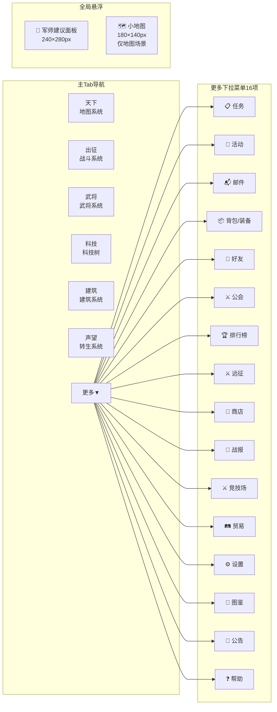
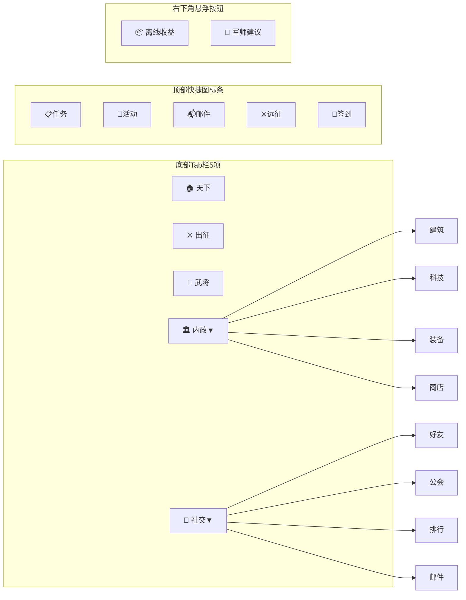
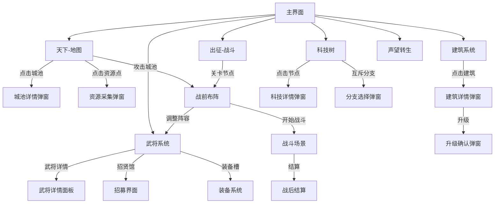
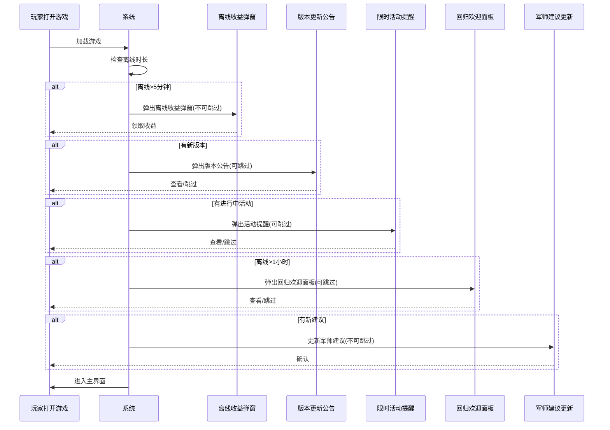

# 三国霸业 UI布局设计 — 全局导航 + 主界面

> **版本**: v1.0 | **日期**: 2026-04-18
> **设计基准**: PC端 1280×800 / 手机端 375×667

---

## 一、全局导航关系图

### 1.1 PC端导航架构



### 1.2 手机端导航架构



### 1.3 系统间核心跳转关系



---

## 二、PC端主界面布局（1280×800）

### 2.1 整体布局

```
╔══════════════════════════════════════════════════════════════════════════════╗
║  顶部资源栏 · 1280×56px                                                     ║
║  ┌────────┬──────────┬──────────┬──────────┬──────────┬──────────┐        ║
║  │三国霸业 │ 🌾1000/2000│ 💰500/∞  │ ⚔️200/500│ 👑50     │ 📊资源总览│        ║
║  │ LOGO   │ ████░░░░  │          │ ████░░░  │          │         │        ║
║  └────────┴──────────┴──────────┴──────────┴──────────┴──────────┘        ║
╠══════════════════════════════════════════════════════════════════════════════╣
║  导航Tab栏 · 1280×48px                                                      ║
║  ┌──────┬──────┬──────┬──────┬──────┬──────┬──────┐                       ║
║  │ 天下 │ 出征 │ 武将 │ 科技 │ 建筑 │ 声望 │更多▼ │                       ║
║  └──────┴──────┴──────┴──────┴──────┴──────┴──────┘                       ║
╠══════════════════════════════════════════════════════════════════════════════╣
║                                                                            ║
║  中央场景区 · 1280×696px                                                     ║
║  （根据顶部Tab切换显示不同模块内容）                                            ║
║                                                                            ║
║  ┌─────────────────────────────────────────────────────┐                  ║
║  │                                                     │                  ║
║  │                                                     │                  ║
║  │              当前Tab对应的场景内容                     │                  ║
║  │              天下→地图 / 出征→战役 / 武将→列表          │                  ║
║  │              科技→科技树 / 建筑→城池 / 声望→转生        │                  ║
║  │                                                     │                  ║
║  │                                                     │                  ║
║  │                                                     │   ┌──────────┐  ║
║  │                                                     │   │军师建议面板│  ║
║  │                                                     │   │240×280px │  ║
║  │                                                     │   │·升级关羽  │  ║
║  │                                                     │   │·出征赤壁  │  ║
║  │                                                     │   │·收取资源  │  ║
║  │                                                     │   └──────────┘  ║
║  │                                                     │   ┌──────────┐  ║
║  │                                                     │   │ 小地图    │  ║
║  │                                                     │   │180×140px │  ║
║  │                                                     │   │仅地图场景│  ║
║  │                                                     │   └──────────┘  ║
║  └─────────────────────────────────────────────────────┘                  ║
║                                                                            ║
╚══════════════════════════════════════════════════════════════════════════════╝
```

### 2.2 顶部资源栏详细布局（1280×56px）

```
┌─────────────────────────────────────────────────────────────────────────────┐
│ 1280×56px · 卷轴横幅造型 · 背景: rgba(13,17,23,0.9) · 底边: 古铜金描边1px  │
│                                                                             │
│ ┌──────┐  ┌──────────────┐  ┌──────────────┐  ┌──────────────┐  ┌──────┐ │
│ │LOGO  │  │ 🌾 粮草      │  │ 💰 铜钱      │  │ ⚔️ 兵力      │  │ 👑   │ │
│ │三国  │  │ 1000/2000    │  │ 500/∞        │  │ 200/500      │  │ 50   │ │
│ │霸业  │  │ ████░░░░     │  │              │  │ ████░░░      │  │      │ │
│ │      │  │ +50/秒       │  │ +30/秒       │  │ +10/秒       │  │      │ │
│ └──────┘  └──────────────┘  └──────────────┘  └──────────────┘  └──────┘ │
│   120px       220px              200px            200px          100px    │
│                                                                             │
│ ┌──────────────────────────────────────────────────────────────┐ ┌──────┐ │
│                        （间距填充）                              │ │📊总览│ │
│                                                                │ └──────┘ │
│ └──────────────────────────────────────────────────────────────┘  80px   │
└─────────────────────────────────────────────────────────────────────────────┘
```

**资源栏规格**:
| 元素 | 宽度 | 说明 |
|------|------|------|
| LOGO区 | 120px | 游戏名称+图标 |
| 粮草 | 220px | 图标+数值+进度条80×6px+产出速率 |
| 铜钱 | 200px | 图标+数值（无上限，无进度条）+产出速率 |
| 兵力 | 200px | 图标+数值+进度条80×6px+产出速率 |
| 天命 | 100px | 图标+数值（高级货币，无进度条） |
| 间距填充 | auto | 弹性间距 |
| 资源总览按钮 | 80px | 点击→资源总览面板 |

### 2.3 导航Tab栏详细布局（1280×48px）

```
┌─────────────────────────────────────────────────────────────────────────────┐
│ 1280×48px · 背景: rgba(20,24,30,0.95) · 底边: 1px古铜金分割线              │
│                                                                             │
│  ┌──────┐ ┌──────┐ ┌──────┐ ┌──────┐ ┌──────┐ ┌──────┐ ┌──────┐         │
│  │ 天下 │ │ 出征 │ │ 武将 │ │ 科技 │ │ 建筑 │ │ 声望 │ │更多▼ │         │
│  │      │ │      │ │      │ │      │ │      │ │      │ │      │         │
│  └──────┘ └──────┘ └──────┘ └──────┘ └──────┘ └──────┘ └──────┘         │
│   160px    160px    160px    160px    160px    160px    160px              │
│                                                                             │
│  激活态: 古铜金底边3px + 文字高亮 #D4A843                                   │
│  默认态: 文字 #8B949E + 无底边                                              │
│  悬停态: 文字 #C9D1D9 + 底边1px #8B949E                                    │
│  红点提示: 右上角8px红点（有新内容时）                                        │
└─────────────────────────────────────────────────────────────────────────────┘
```

**更多下拉菜单**（点击"更多▼"展开，200px宽）:
```
┌──── 更多 ▼ ─────────────┐
│                          │
│ ── 核心功能 ──           │
│  📋 任务(Q)    ●3        │
│  🎪 活动(E)    ⏰23:45   │
│  📬 邮件(P)    ●2        │
│  📦 背包/装备            │
│                          │
│ ── 社交互动 ──           │
│  👥 好友       ●1在线    │
│  ⚔️ 公会                 │
│  🏆 排行榜               │
│                          │
│ ── 扩展系统 ──           │
│  ⚔️ 远征                 │
│  🛒 商店                 │
│  🎒 装备                 │
│  📜 战报                 │
│  ⚔️ 竞技场               │
│  🛤️ 贸易                 │
│                          │
│ ── 系统功能 ──           │
│  ⚙️ 设置                 │
│  📖 图鉴                 │
│  💬 公告                 │
│  ❓ 帮助                 │
│                          │
└──────────────────────────┘
  宽200px，每行高36px
  背景: rgba(13,17,23,0.98)
  分割线: 1px rgba(139,148,158,0.2)
```

---

## 三、手机端主界面布局（375×667）

### 3.1 整体布局

```
╔════════════════════════════════════════════════════╗
║  顶部资源栏 · 375×48px                              ║
║  ┌────────┬─────┬─────┬─────┬────┐               ║
║  │三国霸业│🌾1K  │💰500│⚔️200│👑50│               ║
║  │ LOGO  │◯◯◯  │     │◯◯  │    │               ║
║  └────────┴─────┴─────┴─────┴────┘               ║
╠════════════════════════════════════════════════════╣
║  快捷图标条 · 375×36px                              ║
║  ┌────┬────┬────┬────┬────┐                       ║
║  │📋任务│🎪活动│📬邮件│⚔️远征│🎁签到│ ←可滑动→      ║
║  │  ●3 │ ⏰  │  ●2 │    │    │                       ║
║  └────┴────┴────┴────┴────┘                       ║
╠════════════════════════════════════════════════════╣
║                                                    ║
║  中央场景区 · 375×507px                              ║
║  （根据底部Tab切换显示不同模块内容）                    ║
║                                                    ║
║  ┌──────────────────────────────────────┐         ║
║  │                                      │         ║
║  │                                      │         ║
║  │        当前Tab对应的场景内容           │         ║
║  │                                      │         ║
║  │                                      │         ║
║  │                                      │         ║
║  │                                      │         ║
║  │                                      │         ║
║  │                              ┌──┐   │         ║
║  │                              │📦│   │         ║
║  │                              │离│   │         ║
║  │                              │线│   │         ║
║  │                              └──┘   │         ║
║  │                              ┌──┐   │         ║
║  │                              │🧭│   │         ║
║  │                              │军│   │         ║
║  │                              │师│   │         ║
║  │                              └──┘   │         ║
║  └──────────────────────────────────────┘         ║
║                                                    ║
╠════════════════════════════════════════════════════╣
║  底部Tab栏 · 375×76px                               ║
║  ┌──────┬──────┬──────┬──────┬──────┐             ║
║  │ 🏠   │ ⚔️   │ 👤   │ 🏛️   │ 👥   │             ║
║  │ 天下 │ 出征 │ 武将 │内政▼ │社交▼ │             ║
║  └──────┴──────┴──────┴──────┴──────┘             ║
╚════════════════════════════════════════════════════╝
```

### 3.2 手机端内政子菜单（点击"内政▼"展开）

```
┌─────────────────────────────┐
│  内政                        │
│  ┌────────┐  ┌────────┐    │
│  │ 🏛️ 建筑 │  │ 📚 科技 │    │
│  │  ●2     │  │        │    │
│  └────────┘  └────────┘    │
│  ┌────────┐  ┌────────┐    │
│  │ 🎒 装备 │  │ 🛒 商店 │    │
│  │        │  │        │    │
│  └────────┘  └────────┘    │
└─────────────────────────────┘
  Bottom Sheet弹出
  每格: 170×80px
  背景: rgba(13,17,23,0.98)
```

### 3.3 手机端社交子菜单（点击"社交▼"展开）

```
┌─────────────────────────────┐
│  社交                        │
│  ┌────────┐  ┌────────┐    │
│  │ 👥 好友 │  │ ⚔️ 公会 │    │
│  │  ●1     │  │        │    │
│  └────────┘  └────────┘    │
│  ┌────────┐  ┌────────┐    │
│  │ 🏆 排行 │  │ 📬 邮件 │    │
│  │        │  │  ●2     │    │
│  └────────┘  └────────┘    │
└─────────────────────────────┘
  Bottom Sheet弹出，同内政格式
```

---

## 四、回归欢迎流程

### 4.1 弹窗优先级队列（Mermaid时序图）



### 4.2 离线收益弹窗

**PC端**（居中弹窗，400×360px）:
```
┌──── 离线收益 ────────────────────────────────┐
│  ×关闭（右上角24px）                          │
│                                               │
│  主公离线 6小时23分                            │
│  离线效率: 80%                                 │
│                                               │
│  ┌─────────────────────────────────────────┐ │
│  │  🌾 粮草    +12,400  (1,540/时)         │ │
│  │  💰 铜钱    +8,200   (1,025/时)         │ │
│  │  ⚔️ 兵力    +3,100   (388/时)           │ │
│  │  📚 科技点  +420     (52/时)            │ │
│  └─────────────────────────────────────────┘ │
│                                               │
│  💎 离线收益+50%（观看广告/消耗加速令）         │
│                                               │
│  ┌──────────────┐  ┌──────────────┐          │
│  │  💎 +50%领取  │  │   领取全部    │          │
│  └──────────────┘  └──────────────┘          │
│     160×44px          160×44px                │
└───────────────────────────────────────────────┘
  居中弹窗 400×360px
  背景: rgba(13,17,23,0.95) + 古铜金描边
  领取后: 资源数字飞向顶部资源栏（粒子流效果）
```

**手机端**（全屏居中弹窗）:
```
┌─────────────────────┐
│                     │
│  主公离线 6小时23分  │
│  效率: 80%          │
│                     │
│  ┌──┐ 🌾 +12,400   │
│  └──┘ 粮草 1,540/时 │
│  ┌──┐ 💰 +8,200    │
│  └──┘ 铜钱 1,025/时 │
│  ┌──┐ ⚔️ +3,100    │
│  └──┘ 兵力 388/时   │
│  ┌──┐ 📚 +420      │
│  └──┘ 科技点 52/时  │
│                     │
│ ┌──────┐┌────────┐ │
│ │💎+50%││领取全部 │ │
│ └──────┘└────────┘ │
│  160×44  160×44    │
└─────────────────────┘
  全屏居中弹窗
  每种资源独立一行
```

### 4.3 回归欢迎面板

**PC端**（居中弹窗，480×520px）:
```
┌──── 主公归来 ────────────────────────────────────┐
│  ×关闭                                            │
│                                                   │
│  「主公离线 6小时23分，期间发生如下变化：」           │
│                                                   │
│  ━━ 领土变动 ━━━━━━━━━━━━━━━━━━━━━━━━━━━━━━━━  │
│  ✅ 新占领: 赤壁、襄阳                            │
│  ❌ 失去: 江夏                                    │
│  [点击查看地图变化→]                               │
│                                                   │
│  ━━ 建筑升级 ━━━━━━━━━━━━━━━━━━━━━━━━━━━━━━━━  │
│  🏛️ 农田升至Lv.13  🏛️ 市集升至Lv.11              │
│  [点击查看建筑日志→]                               │
│                                                   │
│  ━━ 武将动态 ━━━━━━━━━━━━━━━━━━━━━━━━━━━━━━━━  │
│  👤 关羽升级至Lv.25  ⚔️ 赵云远征归来              │
│  [点击查看武将详情→]                               │
│                                                   │
│  ━━ 未处理事件 ━━━━━━━━━━━━━━━━━━━━━━━━━━━━━━  │
│  📜 急报×3  📋 日常任务×5  🎪 活动倒计时×1        │
│  [一键处理全部→]                                   │
│                                                   │
│  ━━ 离线总收益 ━━━━━━━━━━━━━━━━━━━━━━━━━━━━━━  │
│  🌾+12,400  💰+8,200  ⚔️+3,100  📚+420          │
│                                                   │
│              ┌──────────────┐                     │
│              │   进入游戏    │                     │
│              └──────────────┘                     │
│                200×44px                           │
└───────────────────────────────────────────────────┘
  居中弹窗 480×520px
  5个信息分区，每个有跳转链接直达对应系统
```

**手机端**（全屏Bottom Sheet）:
```
┌─ 拖拽手柄 ──────────────────────┐
│                                  │
│  主公归来 (离线6小时23分)         │
│                                  │
│  ┌─ 离线收益 ──────────────┐   │
│  │ 🌾+12.4K 💰+8.2K ⚔️+3.1K│   │
│  │ [一键领取]               │   │
│  └──────────────────────────┘   │
│                                  │
│  ┌─ 变化摘要 (横滑卡片) ───┐   │
│  │ ← ✅赤壁襄阳  🏛️农田↑13 │   │
│  │    ❌江夏     🏛️市集↑11  │   │
│  │    👤关羽↑25            →│   │
│  └──────────────────────────┘   │
│                                  │
│  ┌─ 待处理 ────────────────┐   │
│  │ 📜急报×3 📋日常×5 🎪活动×1│   │
│  │ [一键处理]               │   │
│  └──────────────────────────┘   │
│                                  │
│  ┌──────────────┐               │
│  │   进入游戏    │               │
│  └──────────────┘               │
└──────────────────────────────────┘
  Bottom Sheet，屏幕高度85%，可拖拽关闭
  变化摘要为横向滑动卡片
  所有按钮≥44×44px
```

---

## 五、军师建议悬浮面板

### PC端（240×280px，右下角悬浮，小地图上方）

```
┌──── 军师建议 ────────────┐
│  ×关闭                    │
│                           │
│  ━━ 优先推荐 ━━━━━━━━━  │
│                           │
│  1️⃣ 升级关羽至Lv.26      │
│     战力+150 🌾500 💰300  │
│     [立即前往→]           │
│                           │
│  2️⃣ 出征赤壁             │
│     推荐战力: 3500        │
│     当前战力: 3800 ✅     │
│     [立即前往→]           │
│                           │
│  3️⃣ 收取建筑产出         │
│     🌾+2400 💰+1800      │
│     [一键收取]            │
│                           │
│  ━━ 更多建议 ━━━━━━━━━  │
│  · 研究农耕改良科技       │
│  · 招募新武将             │
│                           │
└───────────────────────────┘
  240×280px，右下角悬浮
  竹简面板造型
  背景: rgba(20,30,20,0.92)
  边框: 竹节纹理
```

### 手机端（悬浮按钮，点击展开Bottom Sheet）

```
右下角悬浮按钮:
┌────┐
│ 🧭 │  44×44px
│军师│  圆形，古铜金边框
└────┘  有红点提示时有新建议

点击展开Bottom Sheet:
┌─ 军师建议 ──────────────┐
│                          │
│  1️⃣ 升级关羽至Lv.26     │
│     [立即前往→]          │
│                          │
│  2️⃣ 出征赤壁            │
│     [立即前往→]          │
│                          │
│  3️⃣ 收取建筑产出        │
│     [一键收取]           │
│                          │
└──────────────────────────┘
```

---

## 六、全局弹窗/面板规范

### 弹窗类型与定位

| 弹窗类型 | PC端位置 | 手机端位置 | 触发方式 |
|---------|---------|-----------|---------|
| 居中弹窗 | 屏幕正中，有遮罩 | 全屏居中 | 按钮点击 |
| 右侧滑入面板 | 右侧滑入，宽度320-480px | 全屏面板 | Tab/按钮 |
| Bottom Sheet | — | 底部推入，高度50-85% | 点击/手势 |
| 悬浮面板 | 固定位置悬浮 | 悬浮按钮→Bottom Sheet | 自动/点击 |
| Toast提示 | 顶部中央，3秒消失 | 顶部中央，2秒消失 | 系统触发 |
| 急报横幅 | 顶部降下，3秒收起 | 顶部降下，3秒收起 | 系统触发 |

### 弹窗通用规格

| 属性 | PC端 | 手机端 |
|------|------|--------|
| 遮罩 | rgba(0,0,0,0.6) | rgba(0,0,0,0.7) |
| 关闭按钮 | 右上角 × 24px | 右上角 × 32px |
| 圆角 | 8px | 12px |
| 动效 | scale 0.8→1.0, 300ms bounce | translateY 100%→0, 300ms ease-out |
| 背景 | rgba(13,17,23,0.95) + 古铜金描边 | rgba(13,17,23,0.98) + 古铜金描边 |
| 按钮高度 | 44px | 48px（≥44px触控标准） |
