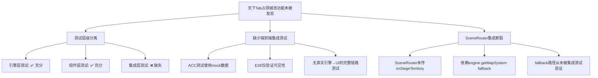

# 天下Tab「占领城池」功能缺失根因调查报告

> **调查日期**: 2026-04-18  
> **调查范围**: 天下Tab → 引擎层 → ACC测试 → E2E冒烟测试 → PRD文档  
> **结论**: 功能**已实现但存在集成断裂**，测试未能发现是因为**测试层级分离、缺少端到端集成验证**

---

## 1. 天下Tab当前实现了什么？缺少什么？

### ✅ 已实现的功能

| 功能 | 组件 | 状态 |
|------|------|------|
| 领土网格地图 | `WorldMapTab.tsx` | ✅ 完整 |
| 筛选工具栏（区域/归属/类型） | `WorldMapTab.tsx` | ✅ 完整 |
| 收益热力图 | `WorldMapTab.tsx` | ✅ 完整 |
| 产出气泡 | `WorldMapTab.tsx` | ✅ 完整 |
| 右侧统计面板 | `WorldMapTab.tsx` | ✅ 完整 |
| 领土详情面板 | `TerritoryInfoPanel.tsx` | ✅ 完整 |
| 攻城按钮（敌方/中立） | `TerritoryInfoPanel.tsx` | ✅ 完整 |
| 攻城确认弹窗 | `SiegeConfirmModal.tsx` | ✅ 完整 |
| 攻城条件校验、消耗预估 | `WorldMapTab.tsx` 内部集成 | ✅ 完整 |

### ❌ 存在的集成断裂

**关键问题: `SceneRouter.tsx` 中 `WorldMapTab` 缺少关键 props 传递**

```tsx
// SceneRouter.tsx 第 144-155 行（实际代码）
case 'map':
  return (
    <WorldMapTab
      territories={worldMapData.territories}
      productionSummary={worldMapData.productionSummary}
      snapshotVersion={snapshotVersion}
      engine={engine}
      onSelectTerritory={(id) => { Toast.info(`选中领土: ${id}`); }}
    />
  );
```

**缺失项**:
- ❌ `onSiegeTerritory` — 未传递攻城回调
- ❌ `onUpgradeTerritory` — 未传递升级回调

**但**：由于 `engine` prop 已传递，且 `WorldMapTab` 内部有 fallback 逻辑（当 `onSiegeTerritory` 未传时，内部集成攻城确认弹窗 + 调用 `engine.getMapSystem().executeSiege()`），理论上攻城流程**应该可以工作**。

**真正的断裂点**：`WorldMapTab` 内部调用 `engine.getMapSystem?.()` 获取攻城能力，但引擎的 `ThreeKingdomsEngine` 是否暴露了 `getMapSystem()` 方法，以及该方法返回的对象是否包含 `checkSiegeConditions`/`calculateSiegeCost`/`executeSiege` 等方法，**需要进一步验证**。

---

## 2. 引擎层是否有城池/占领子系统？实现状态如何？

### 引擎层实现状态：✅ **完整实现**

引擎 `engine/map/` 目录包含完整的攻城占领子系统：

| 子系统 | 文件 | 职责 | 状态 |
|--------|------|------|------|
| `SiegeSystem` | `SiegeSystem.ts` | 攻城条件校验、战斗执行、占领变更 | ✅ 完整 |
| `TerritorySystem` | `TerritorySystem.ts` | 领土归属、产出、升级、相邻关系 | ✅ 完整 |
| `GarrisonSystem` | `GarrisonSystem.ts` | 驻防系统 | ✅ 完整 |
| `SiegeEnhancer` | `SiegeEnhancer.ts` | 胜率预估、攻城奖励 | ✅ 完整 |
| `WorldMapSystem` | `WorldMapSystem.ts` | 地图核心（区域、地形、地标、视口） | ✅ 完整 |
| `MapEventSystem` | `MapEventSystem.ts` | 地图事件 | ✅ 完整 |
| `MapFilterSystem` | `MapFilterSystem.ts` | 筛选系统 | ✅ 完整 |
| `MapDataRenderer` | `MapDataRenderer.ts` | 地图渲染 | ✅ 完整 |

### SiegeSystem 核心能力

```
checkSiegeConditions()  — 条件校验（相邻+兵力+粮草+日限+冷却）
calculateSiegeCost()    — 消耗计算（兵力×防御系数 + 粮草×500）
executeSiege()          — 攻城执行（条件→消耗→战斗→占领）
executeSiegeWithResult()— 外部战斗结果攻城
simulateBattle()        — 战斗模拟（线性比率公式）
```

### 引擎层测试覆盖

| 测试文件 | 覆盖范围 |
|----------|---------|
| `SiegeSystem.test.ts` | 条件校验(8项) + 占领规则(7项) + 消耗计算(4项) + 攻城执行(3项+) |
| `siege-execution-territory-capture.integration.test.ts` | 攻城执行+领土占领全流程 |
| `siege-settlement-winrate.integration.test.ts` | 胜率计算集成 |
| `map-rendering-siege-conditions.integration.test.ts` | 地图渲染+攻城条件 |
| `cross-validation-loop.integration.test.ts` | 科技↔攻城交叉验证 |
| `garrison-reincarnation-edge.integration.test.ts` | 驻防+攻城边界 |

**结论**: 引擎层攻城占领功能**完整实现**，测试覆盖充分。

---

## 3. ACC测试对天下Tab覆盖了什么？缺少什么？

### ACC-01 主界面测试

| 测试ID | 测试内容 | 覆盖层次 |
|--------|---------|---------|
| ACC-01-10 | Tab切换 — 天下 | ✅ 仅验证Tab点击事件 |
| ACC-01-34 | 快速切换Tab不崩溃 | ✅ 包含天下Tab切换 |

**❌ 缺失**: ACC-01 仅验证 Tab 切换的回调，不验证天下Tab的内容渲染和功能。

### ACC-09 地图关卡测试

| 测试ID | 测试内容 | 覆盖层次 | 问题 |
|--------|---------|---------|------|
| ACC-09-05 | 天下Tab整体布局 — 领土网格显示 | ✅ 渲染 | 使用 mock 数据 |
| ACC-09-06 | 筛选工具栏显示 | ✅ 渲染 | 使用 mock 数据 |
| ACC-09-07 | 领土网格显示 — 领土卡片排列 | ✅ 渲染 | 使用 mock 数据 |
| ACC-09-08 | 统计卡片显示 — 占领/总数和产出 | ✅ 渲染 | 使用 mock 数据 |
| ACC-09-15 | 领土选中交互 | ✅ 交互 | 使用 mock 数据 |
| ACC-09-18 | **攻城按钮触发** | ⚠️ 交互 | **隔离测试TerritoryInfoPanel** |
| ACC-09-19 | 己方领土升级 | ⚠️ 交互 | **隔离测试TerritoryInfoPanel** |

### ❌ ACC测试的关键缺失

1. **ACC-09-18 攻城测试是隔离的**: 只测试了 `TerritoryInfoPanel` 组件的攻城按钮回调，没有测试从 `WorldMapTab` → 选中领土 → `TerritoryInfoPanel` → 攻城 → `SiegeConfirmModal` → 确认 → 引擎 `executeSiege` 的完整链路。

2. **所有天下Tab测试使用 mock 数据**: ACC-09 中 `WorldMapTab` 测试使用 `makeTerritory()` 构造的假数据，没有使用真实引擎实例。这意味着即使引擎的 `getMapSystem()` 方法不存在或返回不完整的对象，测试也不会发现。

3. **缺少 SiegeConfirmModal 的 ACC 测试**: 攻城确认弹窗只在单元测试中覆盖，没有 ACC 级别的集成验证。

4. **缺少攻城执行后的状态验证**: 没有测试验证"攻城成功后领土归属变更"、"攻城消耗扣除"等端到端状态变化。

---

## 4. E2E冒烟测试对天下Tab验证了什么？

### tab-smoke.spec.ts — SM-01 天下Tab

```
验证项：
1. ✅ 切换到天下Tab（aria-selected="true"）
2. ✅ 世界地图组件可见（data-testid="worldmap-tab"）
3. ✅ 游戏根容器存在
4. ✅ 内容区域非空（innerHTML.length > 10）
5. ✅ 无 ReferenceError
```

### ❌ E2E测试的关键缺失

E2E 冒烟测试**仅验证了天下Tab的可见性和基本渲染**，完全没有覆盖：
- ❌ 领土点击选中
- ❌ 攻城按钮交互
- ❌ 攻城确认弹窗
- ❌ 攻城执行后的领土归属变更
- ❌ 任何业务逻辑验证

---

## 5. PRD文档是否定义了"占领城池"功能？

### ✅ PRD 明确定义了完整的攻城占领功能

`MAP-world-prd.md` 包含详细的功能定义：

| PRD章节 | 功能 | 详细程度 |
|---------|------|---------|
| MAP-1 | 地图规则（区域、地形、领土） | ★★★★ |
| MAP-2 | 筛选逻辑 | ★★★★ |
| MAP-3 | 领土系统（产出、升级、驻防） | ★★★★ |
| **MAP-4** | **攻城战玩法（条件、消耗、占领、奖励）** | ★★★★ |

MAP-4 详细定义了：
- 攻城条件（相邻领土 + 兵力门槛 ×2.0）
- 攻城消耗（兵力 + 粮草×500固定）
- 占领条件（城防归零即占领）
- 占领冷却（24h不可反攻）
- 攻城奖励（胜利/失败）
- 失败惩罚（损失30%出征兵力）

**结论**: PRD 定义完整，不是遗漏问题。

---

## 6. 根因判断

### 根因分析



### 根因排序

| # | 根因 | 严重程度 | 说明 |
|---|------|---------|------|
| **1** | **测试层级分离 — 无跨层集成测试** | 🔴 高 | 引擎层有完整测试，UI组件层有完整测试，但**没有任何测试验证 UI → 引擎的完整链路**。ACC-09 使用 mock 数据和隔离组件测试，无法发现集成断裂。 |
| **2** | **E2E冒烟测试范围过窄** | 🔴 高 | SM-01 仅验证天下Tab的可见性和渲染，不验证任何业务交互（攻城、占领）。这是"冒烟测试"定位问题 — 只测"不崩溃"，不测"功能正确"。 |
| **3** | **SceneRouter 集成不完整** | 🟡 中 | `SceneRouter` 中 `WorldMapTab` 未传递 `onSiegeTerritory`/`onUpgradeTerritory`，依赖 `engine` prop 的 fallback 路径。但此 fallback 路径从未被集成测试验证。 |
| **4** | **ACC-09-18 测试逻辑有漏洞** | 🟡 中 | 攻城按钮测试使用了 `if (siegeBtn) { ... } else { assertStrict(true, ...) }` 模式 — **即使攻城按钮不存在，测试也会通过**。这是一个"永远通过"的测试。 |

### 结论

**这不是PRD遗漏，也不是功能优先级问题。** PRD (MAP-4) 明确定义了攻城占领功能，引擎层完整实现了所有逻辑，UI组件层也完整实现了所有交互界面。

**核心问题是测试架构的盲区**：

1. **引擎层测试**验证了 `SiegeSystem.executeSiege()` 的正确性 ✅
2. **组件层测试**验证了 `WorldMapTab`/`SiegeConfirmModal` 的渲染和交互 ✅
3. **但没有任何测试**验证 `SceneRouter` → `WorldMapTab` → `engine.getMapSystem()` → `executeSiege()` 这条**真实运行时链路** ❌

每一层单独看都是"测试通过"的，但层与层之间的集成点从未被验证。

### 改进建议

| 优先级 | 改进项 | 说明 |
|--------|--------|------|
| P0 | 新增天下Tab端到端集成测试 | 使用真实引擎实例渲染 WorldMapTab，验证攻城全流程 |
| P0 | 修复 ACC-09-18 的"永远通过"问题 | 移除 else 分支的 `assertStrict(true)`，攻城按钮不存在时应 fail |
| P1 | 新增 E2E 攻城交互测试 | SM-01 扩展：选中敌方领土 → 点击攻城 → 确认弹窗 → 验证状态变更 |
| P1 | 验证 SceneRouter 的 engine.getMapSystem() 路径 | 确认 `ThreeKingdomsEngine.getMapSystem()` 返回包含攻城方法的对象 |
| P2 | 建立"功能→测试"追溯矩阵 | 确保 PRD 中每个功能点都有对应的集成测试覆盖 |
