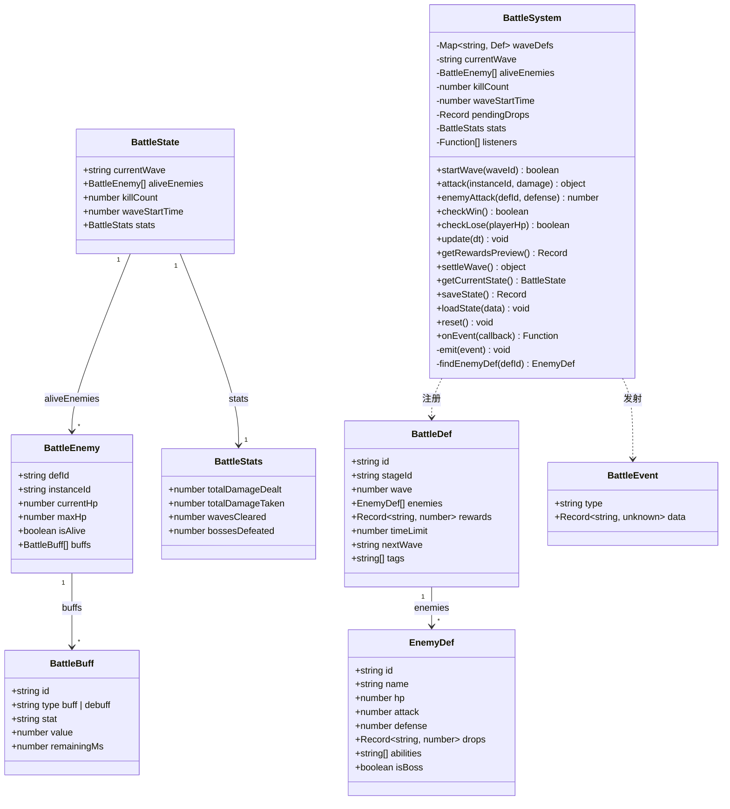
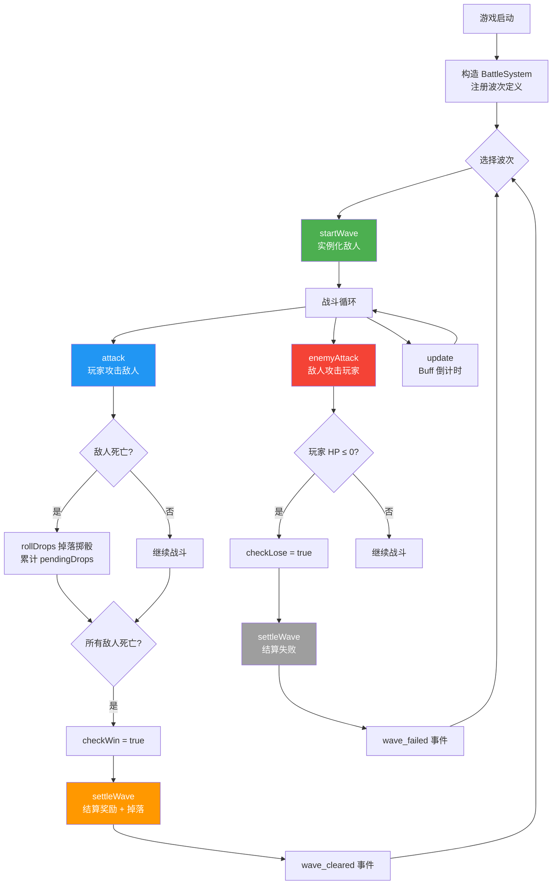
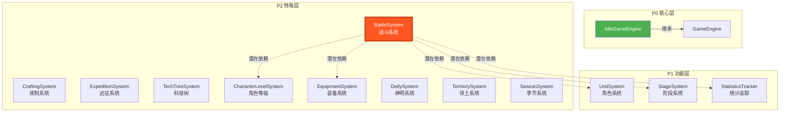
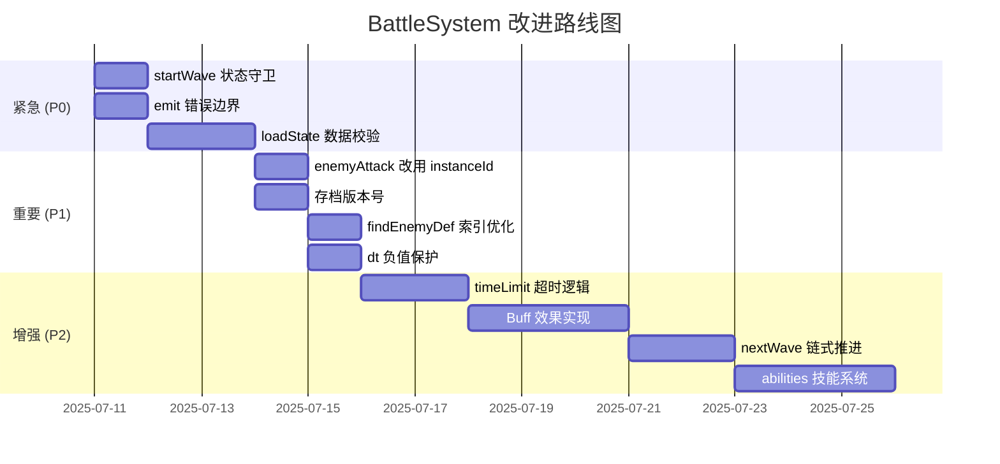

# BattleSystem 战斗子系统 — 架构分析报告

> **审查人**: 系统架构师  
> **审查日期**: 2025-07-10  
> **源码版本**: `src/engines/idle/modules/BattleSystem.ts`  
> **测试版本**: `src/engines/idle/__tests__/BattleSystem.test.ts`

---

## 1. 系统概览

### 1.1 模块定位

| 属性 | 值 |
|------|------|
| **层级** | P2 特殊层（战斗波次系统） |
| **源码路径** | `src/engines/idle/modules/BattleSystem.ts` |
| **源码行数** | 297 行 |
| **测试行数** | 746 行 |
| **测试/源码比** | 2.51 : 1 |
| **测试用例数** | 55 个 `it()` |
| **类型接口数** | 7 个 |
| **公开方法数** | 13 个 |
| **私有方法数** | 2 个 |
| **泛型参数** | 1 个 (`Def extends BattleDef`) |
| **业务引用** | 0 处（仅被测试和模块索引引用） |

### 1.2 类型体系总览



### 1.3 核心流程图



### 1.4 数据流图

```mermaid
flowchart LR
    subgraph 输入
        W[波次定义 Def[]]
        A1[攻击指令]
        A2[敌人攻击指令]
        DT[时间增量 dt]
        SD[存档数据]
    end

    subgraph BattleSystem
        REG[波次注册表<br/>waveDefs Map]
        INST[运行时实例<br/>aliveEnemies[]]
        DROP[待领取掉落<br/>pendingDrops]
        STAT[累计统计<br/>BattleStats]
        EVT[事件总线<br/>listeners[]]
    end

    subgraph 输出
        ST[BattleState 快照]
        SET[结算结果<br/>rewards + drops]
        EV[BattleEvent 事件流]
        SAVE[持久化存档]
    end

    W --> REG
    A1 --> INST
    A2 --> STAT
    DT --> INST
    SD --> REG

    INST --> ST
    INST --> DROP
    DROP --> SET
    STAT --> ST
    STAT --> SAVE
    EVT --> EV
    REG --> SET
```

---

## 2. 架构分析

### 2.1 类结构分析

**设计模式**: 独立状态机 + 观察者模式

BattleSystem 采用经典的有限状态机模式，通过 `currentWave` 是否为 `null` 来区分"空闲"和"战斗中"两种状态。同时集成了观察者模式（`onEvent` / `emit`）实现事件通知。

**优点**:
- 状态转换清晰：`startWave` → 战斗 → `settleWave` → 空闲
- 事件驱动解耦：外部通过 `onEvent` 订阅，不侵入核心逻辑
- 实例化隔离：每个 `BattleSystem` 实例独立，无全局状态污染

**缺点**:
- 缺少显式状态枚举（`idle` | `fighting` | `settling`），状态判断依赖 `currentWave !== null` 的隐式约定
- 没有状态守卫：可以在战斗中再次调用 `startWave` 覆盖当前战斗，无警告
- `settleWave` 后没有清除 `waveStartTime`（虽然 `currentWave` 被置 null）

### 2.2 泛型设计评价

```typescript
export class BattleSystem<Def extends BattleDef = BattleDef>
```

**设计意图**: 允许游戏开发者扩展 `BattleDef`，添加自定义字段（如特殊规则、环境效果等）。

**评价**:

| 维度 | 评分 | 说明 |
|------|------|------|
| 扩展性 | ★★★★☆ | 泛型约束合理，`extends BattleDef` 保证核心字段存在 |
| 类型安全 | ★★★☆☆ | `loadState` 使用 `Record<string, unknown>` 而非泛型状态类型，丢失类型信息 |
| 实用性 | ★★☆☆☆ | 当前项目 0 处业务引用，泛型能力未被实际验证 |
| 复杂度代价 | ★★★★☆ | 泛型引入的额外认知负担很小 |

**建议**: 如果泛型参数 `Def` 在可预见的未来不会被扩展使用，建议简化为 `BattleSystem`（去掉泛型），遵循 YAGNI 原则。

### 2.3 事件系统分析

**事件类型清单**:

| 事件类型 | 触发时机 | 携带数据 |
|----------|----------|----------|
| `wave_started` | `startWave()` | `{ waveId, enemyCount }` |
| `enemy_killed` | `attack()` 击杀时 | `{ instanceId }` |
| `boss_defeated` | `attack()` 击杀 Boss 时 | `{ instanceId }` |
| `loot_dropped` | `attack()` 掉落时 | `{ instanceId, drops }` |
| `player_damaged` | `enemyAttack()` | `{ enemyDefId, damage }` |
| `wave_cleared` | `settleWave()` 胜利时 | `{ waveId }` |
| `wave_failed` | `settleWave()` 失败时 | `{ waveId }` |

**优点**:
- 事件类型覆盖完整，覆盖了战斗全生命周期
- `onEvent` 返回取消订阅函数，符合 React/Vue 生态习惯
- 支持多监听器

**问题**:
- 🔴 **无错误边界**: `emit` 中如果某个 listener 抛异常，后续 listener 不会执行
- 🟡 **同步调用**: 所有 listener 同步执行，高频事件（如 `enemy_killed`）可能导致帧卡顿
- 🟡 **缺少事件优先级**: 无法控制 listener 执行顺序
- 🟢 **缺少 once 支持**: 没有一次性的 `once` 监听器

### 2.4 存档系统分析

**序列化策略**: JSON 深拷贝 (`JSON.parse(JSON.stringify(...))`)

| 方面 | 评价 |
|------|------|
| **完整性** | ✅ 保存了所有运行时状态：currentWave、aliveEnemies、killCount、waveStartTime、pendingDrops、stats |
| **一致性** | ⚠️ `saveState` 保存了包括死亡敌人在内的全部 enemies，但 `getCurrentState` 只返回存活敌人 |
| **类型安全** | ❌ `loadState` 使用 `Record<string, unknown>` + `as` 类型断言，无运行时校验 |
| **版本兼容** | ❌ 无存档版本号，未来格式变更会导致反序列化失败 |
| **防御性** | ⚠️ `loadState({})` 不崩溃但静默忽略，可能掩盖数据损坏问题 |

**`saveState` vs `getCurrentState` 差异**:

```
saveState:         { currentWave, aliveEnemies(全部), killCount, waveStartTime, pendingDrops, stats }
getCurrentState:   { currentWave, aliveEnemies(仅存活), killCount, waveStartTime, stats }
```

`saveState` 多保存了 `pendingDrops` 和死亡敌人的完整信息，这是正确的——用于完整恢复战斗状态。但两个方法名字容易混淆，建议在文档中明确说明差异。

### 2.5 与其他模块的关系



**关键发现**: BattleSystem 当前是一个**完全独立的模块**，没有与 IdleGameEngine 或任何其他模块建立实际依赖关系。它既不继承 IdleGameEngine，也不被 IdleGameEngine 引用。这意味着：

1. **优点**: 高内聚、零耦合、可独立测试
2. **缺点**: 缺少与资源系统（奖励发放）、角色系统（攻击力计算）、装备系统（属性加成）的集成接口

---

## 3. 逐方法分析

### 3.1 `startWave(waveId: string): boolean`

| 属性 | 说明 |
|------|------|
| **输入** | 波次定义 ID |
| **返回** | `true` 成功启动，`false` 波次不存在 |
| **副作用** | 重置 aliveEnemies、killCount、pendingDrops；发射 `wave_started` 事件 |
| **边界处理** | 不存在的 waveId → 静默返回 false |
| **潜在问题** | 🔴 **可覆盖当前战斗**: 如果战斗进行中再次调用 `startWave`，会丢弃当前战斗进度（包括 pendingDrops），无任何警告或确认机制 |

### 3.2 `attack(enemyInstanceId: string, damage: number): { killed, damage }`

| 属性 | 说明 |
|------|------|
| **输入** | 敌人实例 ID、伤害值 |
| **返回** | `{ killed: boolean, damage: number }` 实际造成的伤害 |
| **副作用** | 扣减敌人 HP、更新 totalDamageDealt、可能触发击杀/掉落/事件 |
| **边界处理** | 不存在的 instanceId → `{ killed: false, damage: 0 }`；负伤害 → `Math.max(1, damage)` |
| **潜在问题** | 🟡 **溢出伤害丢失**: 如果 damage=100 但敌人只剩 10 HP，`totalDamageDealt` 记录 100 而非 10（过度统计） |
| **潜在问题** | 🟡 **无防御力计算**: `attack` 方法不做防御力减伤，伤害计算完全由调用方负责 |

### 3.3 `enemyAttack(enemyDefId: string, targetDefense: number): number`

| 属性 | 说明 |
|------|------|
| **输入** | 敌人定义 ID、目标防御力 |
| **返回** | 计算后的伤害值 |
| **副作用** | 更新 totalDamageTaken、发射 `player_damaged` 事件 |
| **公式** | `damage = max(1, enemy.attack - targetDefense / 2)` |
| **边界处理** | 不存在的 defId → 返回 1 |
| **潜在问题** | 🔴 **参数语义不一致**: 传入的是 `defId`（定义 ID）而非 `instanceId`（实例 ID），当同一类型有多个实例时无法区分是哪个敌人在攻击 |
| **潜在问题** | 🟡 **不检查战斗状态**: 即使没有进行中的波次也可以调用 `enemyAttack` |
| **潜在问题** | 🟡 **不检查敌人存活**: 死亡敌人的定义仍可用于攻击 |

### 3.4 `checkWin(): boolean`

| 属性 | 说明 |
|------|------|
| **输入** | 无 |
| **返回** | 所有敌人是否已死亡 |
| **副作用** | 无 |
| **边界处理** | 无波次 → false；无敌人（空数组）→ false（因为 `every` 对空数组返回 true，但 `length > 0` 守卫了） |
| **潜在问题** | 🟢 逻辑正确：`aliveEnemies.length > 0 && aliveEnemies.every(e => !e.isAlive)` |

### 3.5 `checkLose(playerHp: number): boolean`

| 属性 | 说明 |
|------|------|
| **输入** | 玩家当前 HP |
| **返回** | `playerHp <= 0` |
| **副作用** | 无 |
| **评价** | 🟢 方法极其简单，但职责归属值得商榷——玩家 HP 不由 BattleSystem 管理，此方法更适合放在外部判断 |

### 3.6 `update(dt: number): void`

| 属性 | 说明 |
|------|------|
| **输入** | 时间增量（毫秒） |
| **返回** | 无 |
| **副作用** | 减少所有存活敌人 buff 的 remainingMs，移除过期 buff |
| **边界处理** | 无波次 → 静默返回；死亡敌人 → 跳过 |
| **潜在问题** | 🟡 **dt 无负值保护**: 传入负值 dt 会导致 buff 剩余时间增加 |
| **潜在问题** | 🟡 **Buff 效果未生效**: `BattleBuff` 有 `stat` 和 `value` 字段，但 `update` 只做倒计时，没有任何地方实际应用 buff 效果到伤害计算中 |

### 3.7 `getRewardsPreview(): Record<string, number>`

| 属性 | 说明 |
|------|------|
| **输入** | 无 |
| **返回** | 当前波次的奖励预览（浅拷贝） |
| **副作用** | 无 |
| **评价** | 🟢 简洁安全，返回副本防止外部修改 |

### 3.8 `settleWave(): { rewards, drops }`

| 属性 | 说明 |
|------|------|
| **输入** | 无 |
| **返回** | `{ rewards: 固定奖励, drops: 掉落物品 }` |
| **副作用** | 胜利时 wavesCleared++、发射 `wave_cleared/wave_failed` 事件、重置战斗状态 |
| **边界处理** | 失败时 rewards 为空对象，drops 仍返回已累积的掉落 |
| **潜在问题** | 🟡 **失败也发 drops**: 如果玩家失败但之前有掉落，`settleWave` 仍然返回这些掉落——设计意图不明确 |
| **潜在问题** | 🟡 **settleWave 后 currentWave=null 但 waveStartTime 未重置**: `reset` 中重置了 waveStartTime，但 `settleWave` 没有 |

### 3.9 `getCurrentState(): BattleState`

| 属性 | 说明 |
|------|------|
| **输入** | 无 |
| **返回** | 战斗状态快照（深拷贝存活敌人） |
| **副作用** | 无 |
| **评价** | 🟢 安全的只读快照，过滤死亡敌人 |

### 3.10 `saveState(): Record<string, unknown>`

| 属性 | 说明 |
|------|------|
| **输入** | 无 |
| **返回** | 完整持久化数据（含死亡敌人和 pendingDrops） |
| **副作用** | 无 |
| **潜在问题** | 🟡 返回类型 `Record<string, unknown>` 过于宽泛，丢失类型安全 |
| **潜在问题** | 🟡 使用 `JSON.parse(JSON.stringify(...))` 做深拷贝，无法处理 undefined、函数、循环引用 |

### 3.11 `loadState(data: Record<string, unknown>): void`

| 属性 | 说明 |
|------|------|
| **输入** | 存档数据 |
| **返回** | 无 |
| **副作用** | 完全覆盖所有内部状态 |
| **潜在问题** | 🔴 **无数据校验**: 直接 `as` 类型断言，恶意或损坏数据可能导致运行时异常 |
| **潜在问题** | 🔴 **无版本兼容**: 存档格式变更无迁移机制 |
| **潜在问题** | 🟡 **`|| 0` 的 falsy 陷阱**: `(data.killCount as number) || 0` 会把合法值 `0` 也当作 falsy 处理（虽然 0 就是默认值所以无实际影响） |

### 3.12 `reset(): void`

| 属性 | 说明 |
|------|------|
| **输入** | 无 |
| **返回** | 无 |
| **副作用** | 重置所有内部状态到初始值 |
| **评价** | 🟢 完整重置，包括 stats；重置后可重新开始波次 |

### 3.13 `onEvent(callback): () => void`

| 属性 | 说明 |
|------|------|
| **输入** | 事件回调函数 |
| **返回** | 取消订阅函数 |
| **副作用** | 注册监听器 |
| **评价** | 🟢 返回 unsubscribe 函数的模式很优雅 |

---

## 4. 测试分析

### 4.1 覆盖度评估

| 方法 | 用例数 | 覆盖评价 |
|------|--------|----------|
| 构造函数 | 3 | ✅ 空构造、单定义、多定义 |
| `startWave` | 5 | ✅ 正常启动、不存在 ID、重置状态、事件触发 |
| `attack` | 9 | ✅ 扣血、击杀、最小伤害、死亡攻击、不存在 ID、事件、Boss、掉落、统计 |
| `enemyAttack` | 6 | ✅ 公式验证、高防御、零防御、不存在 ID、统计、事件 |
| `checkWin` | 3 | ✅ 无波次、敌人存活、全部击杀 |
| `checkLose` | 2 | ✅ HP≤0、HP>0 |
| `update` | 4 | ✅ buff 倒计时、过期移除、无波次、死亡敌人 |
| `getRewardsPreview` | 3 | ✅ 无波次、正常预览、副本隔离 |
| `settleWave` | 4 | ✅ 胜利结算、统计增加、胜利事件、失败事件 |
| `getCurrentState` | 3 | ✅ 初始状态、存活过滤、深拷贝 |
| `reset` | 2 | ✅ 完整重置、重置后可用 |
| `saveState/loadState` | 5 | ✅ 往返序列化、空系统、空数据、buff、pendingDrops |
| `onEvent` | 3 | ✅ 取消函数、取消后静默、多监听器 |
| Boss 统计 | 2 | ✅ Boss 计数、普通敌人不计数 |
| 多敌人波次 | 1 | ✅ 多敌人流程 |

**方法覆盖率**: 13/13 公开方法 = **100%**

### 4.2 测试盲区

| 编号 | 盲区描述 | 严重度 |
|------|----------|--------|
| T1 | **战斗中重复 startWave**: 未测试覆盖当前战斗的场景 | 🔴 高 |
| T2 | **负数 dt 传入 update**: 未测试异常输入 | 🟡 中 |
| T3 | **settleWave 失败时的 drops 行为**: 失败结算时 pendingDrops 是否应返回 | 🟡 中 |
| T4 | **loadState 数据损坏**: 传入畸形数据（如 `aliveEnemies: "invalid"`） | 🟡 中 |
| T5 | **并发事件监听器异常**: 某个 listener 抛错是否影响其他 listener | 🟡 中 |
| T6 | **timeLimit 超时逻辑**: `BattleDef.timeLimit` 定义了但系统未使用 | 🟡 中 |
| T7 | **nextWave 链式推进**: `BattleDef.nextWave` 定义了但无相关测试 | 🟡 中 |
| T8 | **abilities 字段**: `EnemyDef.abilities` 定义了但从未使用或测试 | 🟡 中 |
| T9 | **泛型扩展场景**: `BattleSystem<CustomDef>` 的泛型使用未测试 | 🟢 低 |
| T10 | **instanceCounter 溢出**: `genInstanceId` 中的全局计数器无上限 | 🟢 低 |
| T11 | **rollDrops 概率边界**: drops 概率为 0 或 1 的边界行为 | 🟢 低 |
| T12 | **settleWave 后 waveStartTime 残留**: settleWave 不重置 waveStartTime | 🟢 低 |

### 4.3 测试质量评价

**优点**:
- ✅ 工厂函数设计良好（`createEnemyDef`、`createWaveDef` 等），测试数据可复用
- ✅ 每个方法独立 describe 分组，结构清晰
- ✅ 覆盖了正常路径和边界情况
- ✅ 事件系统测试充分
- ✅ 序列化/反序列化往返测试完整

**不足**:
- ⚠️ 部分测试通过 `(system as any)` 访问私有属性（buff 测试），耦合了内部实现
- ⚠️ 缺少集成测试（与其他模块的交互）
- ⚠️ 没有性能测试（大量敌人场景）
- ⚠️ `onEvent` 取消测试中的注释提到"新系统不会触发"——实际测试的是旧系统上取消后旧系统不触发，测试逻辑有误导

---

## 5. 评分

### 5.1 架构设计 (30%) — 3.8 / 5.0

| 子维度 | 得分 | 说明 |
|--------|------|------|
| 职责单一 | ★★★★☆ | 战斗管理职责清晰，但 `checkLose` 的归属有争议 |
| 接口设计 | ★★★★☆ | 7 个接口定义完整，字段命名一致 |
| 扩展性 | ★★★☆☆ | 泛型设计预留了扩展点，但 buff/ability 未实现限制了实际扩展 |
| 解耦度 | ★★★★★ | 零外部依赖，完全独立可测试 |

### 5.2 功能完整性 (25%) — 3.2 / 5.0

| 功能点 | 状态 | 说明 |
|--------|------|------|
| 波次管理 | ✅ 完整 | 注册、启动、结算 |
| 敌人实例化 | ✅ 完整 | 唯一 ID、HP 初始化 |
| 攻击计算 | ⚠️ 部分 | 玩家攻击无防御计算，敌人攻击有防御公式 |
| Buff 系统 | ⚠️ 骨架 | 数据结构存在但效果未实现 |
| 掉落系统 | ✅ 完整 | 概率掷骰、累积、结算 |
| 存档系统 | ✅ 完整 | 保存/加载/重置 |
| 时间限制 | ❌ 缺失 | `timeLimit` 字段存在但无超时逻辑 |
| 技能系统 | ❌ 缺失 | `abilities` 字段存在但无实现 |
| 波次链 | ❌ 缺失 | `nextWave` 字段存在但无自动推进 |

### 5.3 代码质量 (20%) — 3.6 / 5.0

| 子维度 | 得分 | 说明 |
|--------|------|------|
| 类型安全 | ★★★☆☆ | `loadState` 使用 `as` 断言，`saveState` 返回 `Record<string, unknown>` |
| 错误处理 | ★★★☆☆ | 边界情况用默认值静默处理，缺少显式错误上报 |
| 性能 | ★★★★☆ | `findEnemyDef` 线性扫描所有波次，敌人类型多时性能下降 |
| 代码风格 | ★★★★★ | 命名一致、注释充分、结构清晰 |

### 5.4 测试覆盖 (15%) — 4.0 / 5.0

| 子维度 | 得分 | 说明 |
|--------|------|------|
| 方法覆盖率 | ★★★★★ | 13/13 公开方法全覆盖 |
| 边界条件 | ★★★★☆ | 覆盖了大部分边界，缺少异常输入测试 |
| 测试隔离 | ★★★☆☆ | 部分测试通过 `as any` 访问私有属性 |

### 5.5 文档可维护性 (10%) — 4.2 / 5.0

| 子维度 | 得分 | 说明 |
|--------|------|------|
| TSDoc | ★★★★☆ | 模块级和方法级注释完整 |
| 类型文档 | ★★★★☆ | 接口字段含义清晰 |
| 使用示例 | ★★★☆☆ | 缺少独立的使用示例或 README |

### 5.6 综合评分

```
┌─────────────────────┬────────┬─────────┬──────────┐
│ 维度                 │ 权重    │ 得分     │ 加权得分  │
├─────────────────────┼────────┼─────────┼──────────┤
│ 架构设计             │  30%   │  3.80   │  1.140   │
│ 功能完整性           │  25%   │  3.20   │  0.800   │
│ 代码质量             │  20%   │  3.60   │  0.720   │
│ 测试覆盖             │  15%   │  4.00   │  0.600   │
│ 文档可维护性         │  10%   │  4.20   │  0.420   │
├─────────────────────┼────────┼─────────┼──────────┤
│ 总分                 │  100%  │         │  3.68/5  │
└─────────────────────┴────────┴─────────┴──────────┘

综合评分: ★★★☆☆ (3.68 / 5.0)
```

---

## 6. 关键问题总结

### 🔴 高严重度

| # | 问题 | 影响 | 建议 |
|---|------|------|------|
| H1 | **startWave 可覆盖当前战斗** | 玩家意外丢失战斗进度和 pendingDrops | 添加状态守卫：战斗中调用 `startWave` 应返回 false 或抛出异常；或提供 `forceStart` 参数 |
| H2 | **loadState 无数据校验** | 损坏或恶意存档数据导致运行时异常 | 引入 Schema 校验（如 zod），或至少添加字段存在性和类型检查 |
| H3 | **emit 无错误边界** | 单个 listener 异常导致后续 listener 不执行 | 在 `emit` 中对每个 listener 调用添加 try-catch |
| H4 | **timeLimit/abilities/nextWave 定义但未实现** | 接口承诺了功能但未交付，误导使用者 | 要么实现这些功能，要么从接口中移除并标记为 TODO |

### 🟡 中严重度

| # | 问题 | 影响 | 建议 |
|---|------|------|------|
| M1 | **enemyAttack 使用 defId 而非 instanceId** | 同类型多实例时无法区分攻击来源 | 改为接收 `instanceId`，内部查找对应 defId |
| M2 | **Buff 系统仅实现倒计时，效果未生效** | `BattleBuff.stat`/`value` 字段无实际作用 | 实现 buff 对攻击/防御的数值影响，或移除未使用字段 |
| M3 | **settleWave 失败仍返回 drops** | 设计意图不明确：失败是否应保留掉落？ | 明确文档说明或添加配置项控制 |
| M4 | **findEnemyDef 线性扫描** | 敌人定义多时性能下降 | 构建独立的 `enemyDef Map` 索引，避免每次遍历所有波次 |
| M5 | **saveState 返回类型过宽** | `Record<string, unknown>` 丢失类型安全 | 定义 `BattleSaveData` 接口，泛型化返回类型 |
| M6 | **update 缺少 dt 负值保护** | 负值 dt 导致 buff 时间增加 | 添加 `dt = Math.max(0, dt)` 防护 |
| M7 | **无存档版本号** | 格式变更后旧存档无法迁移 | 在 `saveState` 中添加 `version` 字段 |

### 🟢 低严重度

| # | 问题 | 影响 | 建议 |
|---|------|------|------|
| L1 | **泛型参数未被实际使用** | 增加认知负担 | 评估是否移除，遵循 YAGNI |
| L2 | **deepClone 使用 JSON 序列化** | 无法处理特殊类型（Date、undefined、循环引用） | 当前场景可接受，未来如需扩展可引入 structuredClone |
| L3 | **全局 instanceCounter 无上限** | 理论上可能溢出 | 实际场景下不可能触发，可忽略 |
| L4 | **checkLose 职责归属** | 玩家 HP 不由 BattleSystem 管理 | 考虑将此方法移到外部或标记为 utility |
| L5 | **缺少 once 事件监听** | 使用不便 | 可按需添加 `once` 方法 |
| L6 | **settleWave 不重置 waveStartTime** | 状态残留 | 在 settleWave 中添加 `this.waveStartTime = 0` |

---

## 附录 A: 方法签名速查表

```typescript
class BattleSystem<Def extends BattleDef = BattleDef> {
  constructor(defs?: Def[])
  startWave(waveId: string): boolean
  attack(enemyInstanceId: string, damage: number): { killed: boolean; damage: number }
  enemyAttack(enemyDefId: string, targetDefense: number): number
  checkWin(): boolean
  checkLose(playerHp: number): boolean
  update(dt: number): void
  getRewardsPreview(): Record<string, number>
  settleWave(): { rewards: Record<string, number>; drops: Record<string, number> }
  getCurrentState(): BattleState
  saveState(): Record<string, unknown>
  loadState(data: Record<string, unknown>): void
  reset(): void
  onEvent(callback: (event: BattleEvent) => void): () => void
}
```

## 附录 B: 建议的改进优先级路线图



---

> **总结**: BattleSystem 是一个结构清晰、职责明确的战斗子系统骨架。其独立模块化设计和完整的事件系统是显著优点。主要不足在于：部分接口字段（timeLimit、abilities、nextWave）定义但未实现，存档系统缺少数据校验和版本管理，以及战斗状态转换缺少显式守卫。建议按路线图优先解决 P0 级问题，再逐步完善功能完整性。
