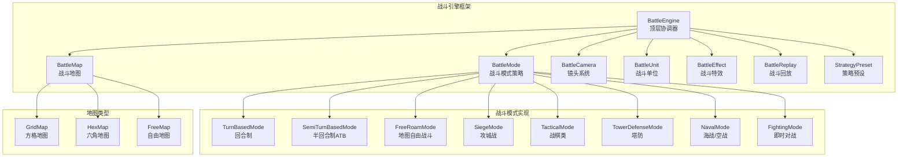

# BattleSystem 战斗子系统 — 改进建议文档

> **版本**: v1.0 | **日期**: 2026-04-15
> **基于**: BattleSystem-ANALYSIS.md 审查报告（综合评分 3.68/5.0）
> **目标**: 将单一波次战斗模块升级为多模式战斗引擎框架

---

## 第一部分：现有问题修复清单

### 🔴 P1-01: startWave 可覆盖进行中的战斗

**问题**: 调用 `startWave()` 时无状态守卫，会静默覆盖当前战斗，丢失 `pendingDrops` 和 `aliveEnemies`。

**修复方案**: 添加状态检查，进行中的战斗需先 `settleWave()` 或 `reset()`。

```typescript
startWave(waveId: string): boolean {
  if (this.currentWave !== null) {
    return false; // 进行中的战斗不允许覆盖
  }
  // ... 原有逻辑
}
```

### 🔴 P1-02: loadState 无数据校验

**问题**: 全部使用 `as` 类型断言，恶意/损坏存档可致运行时崩溃。

**修复方案**: 添加数据校验函数。

```typescript
private validateState(data: unknown): BattleState | null {
  if (!data || typeof data !== 'object') return null;
  const d = data as Record<string, unknown>;
  return {
    currentWave: typeof d.currentWave === 'string' ? d.currentWave : null,
    aliveEnemies: Array.isArray(d.aliveEnemies) ? d.aliveEnemies : [],
    killCount: typeof d.killCount === 'number' ? Math.max(0, d.killCount) : 0,
    waveStartTime: typeof d.waveStartTime === 'number' ? d.waveStartTime : 0,
    stats: this.validateStats(d.stats),
  };
}
```

### 🔴 P1-03: emit 无错误边界

**问题**: 单个 listener 抛异常会阻断后续所有 listener。

**修复方案**: try-catch 包裹每个 listener。

```typescript
private emit(event: BattleEvent): void {
  for (const fn of this.listeners) {
    try { fn(event); } catch (e) { console.error('BattleSystem listener error:', e); }
  }
}
```

### 🔴 P1-04: 接口承诺未兑现

**问题**: `timeLimit`、`abilities`、`nextWave` 字段在接口中定义但系统完全未使用。

**修复方案**:
- `timeLimit`: 在 `update(dt)` 中检查超时，超时触发 `wave_failed`
- `nextWave`: `settleWave()` 成功时自动衔接下一波
- `abilities`: 在 `BattleUnit` 层实现（见新架构）

### 🟡 P2-01: 伤害公式过于简单

**问题**: 仅 `max(1, damage)` 和 `max(1, atk - def/2)`，缺少暴击/闪避/克制。

**修复方案**: 引入伤害计算管道。

```typescript
interface DamageContext {
  attacker: BattleUnit; defender: BattleUnit;
  baseDamage: number; element?: string;
}
interface DamageResult {
  finalDamage: number; isCrit: boolean; isMiss: boolean;
  effectiveness: 'normal' | 'super' | 'weak';
}

function calculateDamage(ctx: DamageContext): DamageResult {
  let dmg = ctx.baseDamage;
  // 1. 闪避检查
  if (Math.random() < ctx.defender.stats.evasion) return { finalDamage: 0, isCrit: false, isMiss: true, effectiveness: 'normal' };
  // 2. 元素克制
  const eff = getElementEffectiveness(ctx.element, ctx.defender.element);
  dmg *= eff === 'super' ? 1.5 : eff === 'weak' ? 0.5 : 1.0;
  // 3. 防御减伤
  dmg = Math.max(1, dmg - ctx.defender.stats.defense * 0.5);
  // 4. 暴击检查
  const isCrit = Math.random() < ctx.attacker.stats.critRate;
  if (isCrit) dmg *= ctx.attacker.stats.critMultiplier;
  return { finalDamage: Math.floor(dmg), isCrit, isMiss: false, effectiveness: eff };
}
```

### 🟡 P2-02 ~ P2-04

| 问题 | 修复方向 |
|------|---------|
| Buff 仅限敌人侧 | 新架构中 BattleUnit 双方统一，Buff 挂载在 Unit 上 |
| 无 AoE/范围攻击 | 新架构中 Skill 支持 targetting 模式（single/aoe/pierce/all） |
| 无仇恨/目标选择 | 新架构中 AI 层实现仇恨表和目标优先级 |

---

## 第二部分：多模式战斗引擎架构设计

### 2.1 整体架构



### 2.2 核心接口定义

#### BattleEngine — 战斗引擎框架

```typescript
/** 战斗引擎 — 顶层协调器，管理战斗生命周期 */
export class BattleEngine {
  private mode: BattleMode;
  private map: BattleMap;
  private camera: BattleCamera;
  private units: BattleUnit[];
  private effects: BattleEffectManager;
  private replay: BattleReplay;
  private preset: StrategyPreset;
  private state: BattleEngineState;
  private speed: 1 | 2 | 4 | 8;

  /** 初始化战斗（预设策略 → 自动执行） */
  init(config: BattleConfig): void;

  /** 每帧更新（由 IdleGameEngine.update 调用） */
  update(deltaTime: number): void;

  /** 快速结算（跳过战斗过程，直接计算结果） */
  quickSettle(): BattleResult;

  /** 获取战斗状态（供 Canvas 渲染） */
  getState(): BattleEngineState;

  /** 存档/读档 */
  saveState(): Record<string, unknown>;
  loadState(data: Record<string, unknown>): void;
}

export interface BattleConfig {
  mode: BattleModeType;
  mapDef: MapDef;
  attackerUnits: UnitDef[];
  defenderUnits: UnitDef[];
  preset: StrategyPreset;
  rewards: Record<string, number>;
}

export type BattleModeType =
  | 'turn-based' | 'semi-turn-based'
  | 'free-roam' | 'siege' | 'tactical'
  | 'tower-defense' | 'naval' | 'fighting';

export interface BattleResult {
  won: boolean;
  rewards: Record<string, number>;
  drops: Record<string, number>;
  mvp: string | null;        // MVP 单位 ID
  duration: number;           // 战斗耗时(ms)
  stats: BattleStats;
}
```

#### BattleMode — 战斗模式策略接口

```typescript
/** 战斗模式策略接口 — 每种模式实现此接口 */
export interface BattleMode {
  readonly type: BattleModeType;

  /** 初始化模式（创建单位实例、设置初始位置等） */
  init(ctx: BattleContext): void;

  /** 每帧更新（模式特有的逻辑：回合调度/ATB填充/移动AI等） */
  update(ctx: BattleContext, dt: number): void;

  /** 检查胜负条件 */
  checkWin(ctx: BattleContext): boolean;
  checkLose(ctx: BattleContext): boolean;

  /** 结算 */
  settle(ctx: BattleContext): BattleResult;
}

export interface BattleContext {
  engine: BattleEngine;
  map: BattleMap;
  camera: BattleCamera;
  units: BattleUnit[];
  effects: BattleEffectManager;
  preset: StrategyPreset;
  replay: BattleReplay;
  speed: number;
}
```

#### TurnBasedMode — 回合制

```typescript
/** 回合制模式（参考：最终幻想、博德之门） */
export class TurnBasedMode implements BattleMode {
  readonly type = 'turn-based';

  private turnOrder: string[] = [];      // 行动顺序（按速度排序）
  private currentTurnIndex: number = 0;
  private turnCount: number = 0;
  private maxTurns: number = 30;          // 回合上限

  /** 生成行动顺序（速度值决定先后） */
  private generateTurnOrder(units: BattleUnit[]): string[];

  /** 执行当前单位的回合（按预设策略自动选择技能和目标） */
  private executeTurn(unit: BattleUnit, ctx: BattleContext): void;

  /** AI 选择技能（基于 StrategyPreset） */
  private selectSkill(unit: BattleUnit, ctx: BattleContext): SkillDef;

  /** AI 选择目标（基于 StrategyPreset.targetPriority） */
  private selectTarget(unit: BattleUnit, ctx: BattleContext): BattleUnit;
}
```

放置游戏适配：
- 玩家预设**技能释放顺序**和**目标优先级**
- 回合自动执行，无需手动操作
- 支持 1x/2x/4x/8x 加速

#### SemiTurnBasedMode — 半回合制 ATB

```typescript
/** 半回合制 ATB 模式（参考：仙剑奇侠传、最终幻想4-9） */
export class SemiTurnBasedMode implements BattleMode {
  readonly type = 'semi-turn-based';

  private atbBars: Map<string, number> = new Map();  // unitId → ATB进度(0-100)
  private atbSpeed: number = 10;                       // ATB 填充速度/秒

  /** 更新 ATB 条（每帧调用） */
  update(ctx: BattleContext, dt: number): void {
    for (const unit of ctx.units) {
      if (!unit.isAlive) continue;
      const bar = (this.atbBars.get(unit.id) || 0) + unit.stats.speed * this.atbSpeed * (dt / 1000);
      if (bar >= 100) {
        this.atbBars.set(unit.id, 0);
        this.executeAction(unit, ctx);  // ATB 满了自动执行
      } else {
        this.atbBars.set(unit.id, bar);
      }
    }
  }
}
```

放置游戏适配：
- ATB 条自动填充，满了自动执行预设技能
- 玩家预设**技能优先级列表**，AI 按优先级选择

#### FreeRoamMode — 地图自由战斗

```typescript
/** 地图自由战斗模式（参考：魔兽争霸3、红色警戒） */
export class FreeRoamMode implements BattleMode {
  readonly type = 'free-roam';

  /** 每帧更新：移动单位 → 检测碰撞 → 执行攻击 */
  update(ctx: BattleContext, dt: number): void {
    const aliveUnits = ctx.units.filter(u => u.isAlive);
    // 1. 每个单位执行 AI 行为树
    for (const unit of aliveUnits) {
      unit.ai.tick(ctx, dt);  // 行为树：移动→攻击→使用技能→撤退
    }
    // 2. 碰撞检测（近战范围）
    this.checkMeleeCollisions(ctx);
    // 3. 弹道更新（远程攻击）
    this.updateProjectiles(ctx, dt);
    // 4. 资源点占领检查
    this.checkResourcePoints(ctx);
  }

  /** 编队阵型移动（预设策略） */
  private moveFormation(units: BattleUnit[], target: Position, ctx: BattleContext): void;
}
```

放置游戏适配：
- 玩家预设**编队阵型**（前排坦克、后排输出）
- 玩家预设**目标优先级**（最近/最弱/Boss优先）
- 单位自动移动、自动攻击、自动使用技能

#### SiegeMode — 攻城战

```typescript
/** 攻城战模式（参考：三国志系列） */
export class SiegeMode implements BattleMode {
  readonly type = 'siege';

  private walls: SiegeStructure[];      // 城墙段
  private gates: SiegeStructure[];      // 城门
  private towers: SiegeStructure[];     // 箭塔
  private siegeWeapons: SiegeWeapon[];  // 攻城器械
  private morale: { attacker: number; defender: number }; // 士气(0-100)

  /** 城墙破坏判定 */
  private damageWall(structure: SiegeStructure, damage: number): void;

  /** 士气系统：单位死亡/城墙被破/主将受伤影响士气 */
  private updateMorale(event: SiegeEvent): void;

  /** 士气崩溃：士气归零一方全军溃败 */
  private checkMoraleCollapse(): 'attacker' | 'defender' | null;
}

export interface SiegeStructure {
  id: string; type: 'wall' | 'gate' | 'tower';
  hp: number; maxHp: number; defense: number;
  position: Position; garrison?: UnitDef[];
}
```

放置游戏适配：
- 玩家预设**攻城方案**（集中突破城门/全面围攻/攀墙）
- 自动分配攻城器械攻击目标
- 士气系统自动运作

#### TacticalMode — 战棋类

```typescript
/** 战棋类模式（参考：英雄无敌系列） */
export class TacticalMode implements BattleMode {
  readonly type = 'tactical';

  private grid: HexGrid | SquareGrid;   // 六角或方格地图
  private moveRange: Map<string, Set<string>>;  // 单位可移动范围

  /** 计算移动范围（BFS/寻路） */
  private calculateMoveRange(unit: BattleUnit): Set<string>;

  /** AI 自动移动（按预设路线） */
  private autoMove(unit: BattleUnit, ctx: BattleContext): void;

  /** 相遇战斗触发（两个敌对单位相邻时） */
  private triggerEngagement(attacker: BattleUnit, defender: BattleUnit): void;

  /** 地形效果（山地防御加成、森林隐蔽、河流减速） */
  private applyTerrainEffect(unit: BattleUnit, terrain: TerrainType): void;
}
```

放置游戏适配：
- 玩家预设**行军路线**（每个单位的移动路径点）
- AI 自动沿路线移动，遇敌自动战斗
- 地形效果自动应用

#### BattleCamera — 镜头系统

```typescript
/** 镜头状态 */
type CameraState = 'free' | 'follow' | 'closeup' | 'shake';

/** 镜头系统 — 支持平移、缩放、跟随、特写 */
export class BattleCamera {
  private x: number = 0;
  private y: number = 0;
  private zoom: number = 1.0;        // 0.5x ~ 3.0x
  private state: CameraState = 'free';
  private target: string | null = null;  // 跟随目标 unitId
  private shakeIntensity: number = 0;
  private closeupTimer: number = 0;

  /** 平移镜头 */
  pan(dx: number, dy: number): void;

  /** 缩放 */
  setZoom(level: number): void;

  /** 跟随指定单位 */
  follow(unitId: string): void;

  /** 武将技能特写（镜头拉近到技能释放者） */
  triggerCloseup(unitId: string, durationMs: number = 1500): void;

  /** 震屏效果（大范围技能/城墙倒塌） */
  shake(intensity: number, durationMs: number): void;

  /** 每帧更新 */
  update(dt: number): void;

  /** 获取变换矩阵（供 Canvas 渲染使用） */
  getTransform(): { x: number; y: number; zoom: number };
}
```

镜头行为规则：
- **回合制**: 自由视角，技能释放时特写
- **自由战斗**: 默认跟随玩家编队中心，大规模技能时拉远
- **攻城战**: 默认展示城墙全景，城墙被破时震动+拉近
- **战棋类**: 跟随当前行动单位，战斗时拉近

#### BattleUnit — 战斗单位

```typescript
/** 战斗单位属性 */
export interface UnitStats {
  hp: number; maxHp: number;
  attack: number; defense: number;
  speed: number;              // 行动速度（回合制排序/ATB填充率/移动速度）
  critRate: number;           // 暴击率 0~1
  critMultiplier: number;     // 暴击倍率（默认2.0）
  evasion: number;            // 闪避率 0~1
  accuracy: number;           // 命中率 0~1
  range: number;              // 攻击范围（格/像素）
  moveSpeed: number;          // 移动速度（自由战斗/战棋用）
}

/** 战斗单位 */
export class BattleUnit {
  id: string;
  team: 'attacker' | 'defender';
  stats: UnitStats;
  skills: SkillDef[];
  buffs: BuffInstance[];
  position: Position;
  isAlive: boolean;
  ai: UnitAI;                 // AI 行为树

  /** 使用技能 */
  useSkill(skillId: string, target: BattleUnit | Position): SkillResult;

  /** 受到伤害 */
  takeDamage(damage: number, context?: DamageContext): DamageResult;

  /** 添加/移除 Buff */
  addBuff(buff: BuffDef, source: string): void;
  removeBuff(buffId: string): void;
}

/** 技能定义 */
export interface SkillDef {
  id: string; name: string;
  type: 'active' | 'passive' | 'ultimate';
  targetting: 'single' | 'aoe' | 'pierce' | 'all' | 'self' | 'ally';
  range: number;
  cooldown: number;           // 冷却时间(ms)
  damage?: number;
  element?: string;           // 火/冰/雷/物理/...
  effects?: SkillEffect[];    // 附加效果（Buff/Debuff/治疗/...）
  closeupAnimation?: string;  // 特写动画标识
  description: string;
}

/** AI 行为树节点 */
export interface UnitAI {
  /** 执行一帧 AI 逻辑 */
  tick(ctx: BattleContext, dt: number): void;
}
```

#### StrategyPreset — 策略预设系统

```typescript
/** 策略预设 — 玩家在战斗前设置，战斗中自动执行 */
export interface StrategyPreset {
  /** 阵型配置（单位站位） */
  formation: FormationPreset;

  /** 技能释放顺序（优先级列表） */
  skillPriority: SkillPriorityItem[];

  /** 目标选择策略 */
  targetPriority: TargetStrategy;

  /** 逃跑/撤退条件 */
  retreatCondition?: RetreatCondition;

  /** 道具使用策略 */
  itemStrategy?: ItemStrategy;
}

export interface FormationPreset {
  type: 'standard' | 'offensive' | 'defensive' | 'flanking' | 'custom';
  positions: Map<string, Position>;  // unitId → 站位
}

export interface SkillPriorityItem {
  skillId: string;
  condition: 'always' | 'hp_below_50' | 'enemy_count_gt_3' | 'boss_alive' | 'on_cooldown';
  targetOverride?: 'weakest' | 'strongest' | 'boss' | 'aoe_center';
}

export type TargetStrategy =
  | 'nearest'        // 最近目标
  | 'weakest'        // 最弱目标
  | 'strongest'      // 最强目标
  | 'boss_priority'  // Boss优先
  | 'threat'         // 威胁度最高
  | 'random';        // 随机

export interface RetreatCondition {
  hpThreshold: number;      // HP 低于此比例撤退
  preserveUnits: string[];  // 必须保留的单位（不撤退）
}
```

---

## 第三部分：分阶段实施计划

| Phase | 内容 | 预估代码量 | 适用游戏 | 优先级 |
|-------|------|-----------|---------|--------|
| **Phase 1** | 回合制 + 半回合制 + 技能系统 + 伤害管道 | ~1500行 | 最终幻想、博德之门、仙剑、轩辕剑 | 🔴 高 |
| **Phase 2** | 战棋地图 + 六角网格 + 移动AI + 地形效果 | ~1200行 | 英雄无敌 | 🟡 中 |
| **Phase 3** | 攻城战 + 城墙/器械/士气系统 | ~1000行 | 三国志、龙之崛起 | 🔴 高 |
| **Phase 4** | 自由战斗 + 实时移动 + 编队 + 资源点 | ~1500行 | 魔兽争霸3、红色警戒、帝国时代 | 🟡 中 |
| **Phase 5** | 镜头系统 + 特写 + 特效 + 震屏 | ~800行 | 所有游戏 | 🔴 高 |
| **Phase 6** | 塔防 + 海战/空战 + 即时对战 | ~1000行 | 植物大战僵尸、大航海时代 | 🟢 低 |

**建议执行顺序**: Phase 5（镜头）→ Phase 1（回合制）→ Phase 3（攻城）→ Phase 2（战棋）→ Phase 4（自由战斗）→ Phase 6（扩展模式）

---

## 第四部分：兼容与迁移方案

### 4.1 向后兼容

```typescript
// 现有 BattleSystem 保持不变，作为 legacy 模块
// 新游戏使用 BattleEngine，旧游戏继续使用 BattleSystem

// modules/index.ts 中两者共存导出
export { BattleSystem } from './BattleSystem';           // 旧版（波次制）
export { BattleEngine } from './BattleEngine';           // 新版（多模式）
export { TurnBasedMode } from './modes/TurnBasedMode';
export { SiegeMode } from './modes/SiegeMode';
// ...
```

### 4.2 迁移路径

```
旧游戏（已上线）→ 保持 BattleSystem，无需改动
新游戏（待重建）→ 使用 BattleEngine + 对应模式
三国志重建      → BattleEngine + SiegeMode
英雄无敌重建    → BattleEngine + TacticalMode
魔兽争霸重建    → BattleEngine + FreeRoamMode
最终幻想重建    → BattleEngine + TurnBasedMode
```

### 4.3 文件结构

```
src/engines/idle/modules/
├── BattleSystem.ts              # 旧版（保持不变）
├── battle/                      # 新版战斗引擎
│   ├── BattleEngine.ts          # 顶层协调器
│   ├── BattleUnit.ts            # 战斗单位
│   ├── BattleCamera.ts          # 镜头系统
│   ├── BattleEffect.ts          # 战斗特效
│   ├── BattleReplay.ts          # 战斗回放
│   ├── StrategyPreset.ts        # 策略预设
│   ├── DamageCalculator.ts      # 伤害计算管道
│   ├── modes/                   # 战斗模式
│   │   ├── BattleMode.ts        # 模式接口
│   │   ├── TurnBasedMode.ts     # 回合制
│   │   ├── SemiTurnBasedMode.ts # 半回合制ATB
│   │   ├── FreeRoamMode.ts      # 地图自由战斗
│   │   ├── SiegeMode.ts         # 攻城战
│   │   ├── TacticalMode.ts      # 战棋类
│   │   ├── TowerDefenseMode.ts  # 塔防
│   │   ├── NavalMode.ts         # 海战/空战
│   │   └── FightingMode.ts      # 即时对战
│   └── maps/                    # 战斗地图
│       ├── BattleMap.ts         # 地图接口
│       ├── GridMap.ts           # 方格地图
│       ├── HexMap.ts            # 六角地图
│       └── FreeMap.ts           # 自由地图
```
