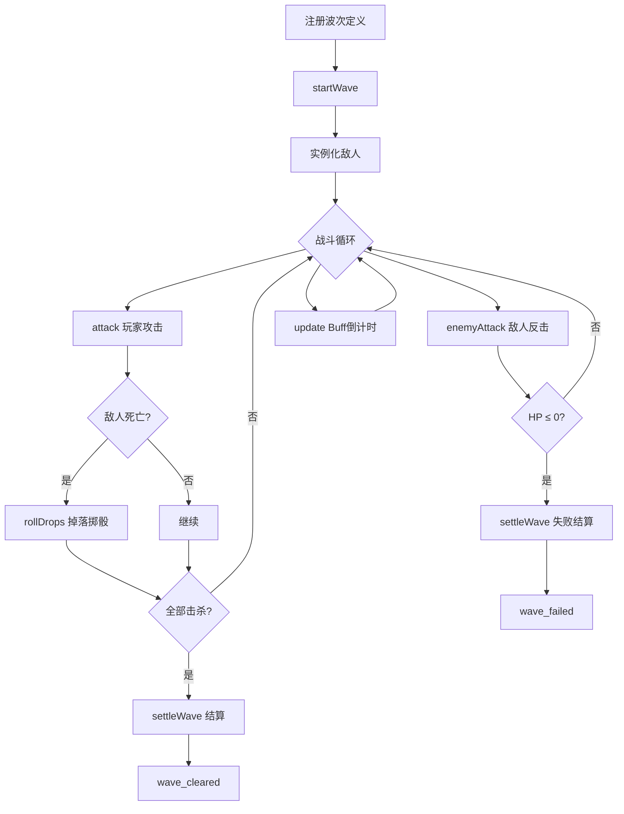
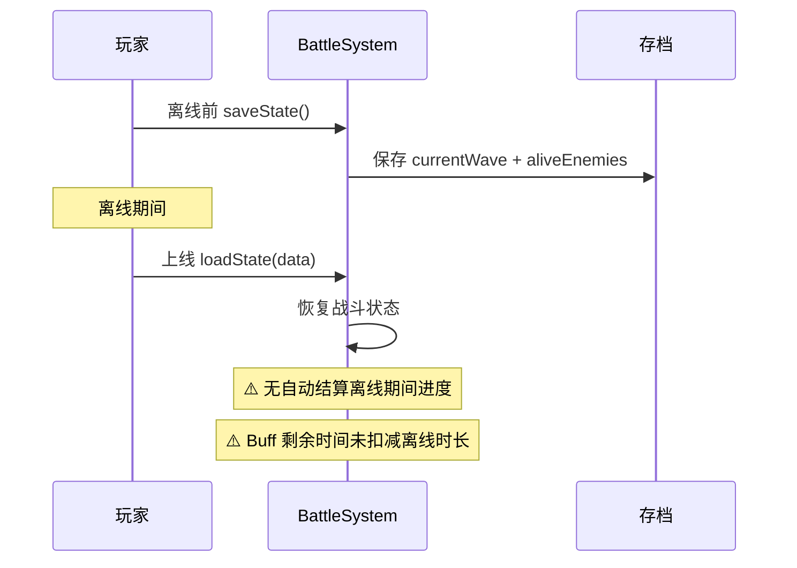

# BattleSystem 战斗子系统 — 架构审查报告

> **审查人**: 系统架构师  
> **审查日期**: 2025-07-10  
> **模块路径**: `src/engines/idle/modules/BattleSystem.ts`  
> **测试路径**: `src/engines/idle/__tests__/BattleSystem.test.ts`  
> **优先级**: P2（放置游戏战斗波次系统）

---

## 1. 概览

### 1.1 代码规模

| 指标 | 数值 |
|------|------|
| 源码行数 | 297 行 |
| 测试行数 | 530 行 |
| 测试/源码比 | 1.78:1 |
| 公共方法数 | 13 |
| 私有方法数 | 2 |
| 导出接口/类型 | 7 个 |
| 测试套件数 | 12 个 describe |
| 测试用例数 | 55 个 it |
| 泛型参数 | 1 个 (`Def extends BattleDef`) |

### 1.2 依赖关系

```mermaid
graph TB
    subgraph "外部依赖"
        NONE["无外部依赖"]
    end

    subgraph "模块内部"
        BS["BattleSystem&lt;Def&gt;"]
        ED["EnemyDef"]
        BD["BattleDef"]
        BB["BattleBuff"]
        BE["BattleEnemy"]
        BSTAT["BattleStats"]
        BSTATE["BattleState"]
        B EVT["BattleEvent"]
    end

    subgraph "上游引擎"
        IGE["IdleGameEngine"]
        IDX["modules/index.ts"]
    end

    IDX -->|导出| BS
    IGE -.->|可集成| BS
    BS --> ED
    BS --> BD
    BS --> BB
    BS --> BE
```

**依赖评价**: ✅ 零外部运行时依赖，纯 TypeScript 实现。仅依赖 `Date.now()`、`Math.random()` 和 `JSON` 全局对象，便于测试和移植。

### 1.3 模块定位

BattleSystem 是放置游戏引擎 P2 优先级模块，负责波次管理、敌人实例化、攻击伤害计算、Buff 管理、掉落掷骰、结算和统计追踪。当前 **未与 IdleGameEngine 直接集成**（0 处业务引用），作为独立子系统存在，需要手动编排接入。

---

## 2. 接口分析

### 2.1 公共 API 一览

| 方法 | 签名 | 职责 | 评价 |
|------|------|------|------|
| `constructor` | `(defs?: Def[])` | 注册波次定义 | ✅ 简洁 |
| `startWave` | `(waveId) → boolean` | 启动波次 | ⚠️ 无状态守卫 |
| `attack` | `(instanceId, damage) → {killed, damage}` | 玩家攻击敌人 | ✅ 清晰 |
| `enemyAttack` | `(defId, defense) → number` | 敌人攻击玩家 | ⚠️ 参数用 defId 非实例ID |
| `checkWin` | `() → boolean` | 胜利判定 | ✅ |
| `checkLose` | `(playerHp) → boolean` | 失败判定 | ⚠️ 职责归属有争议 |
| `update` | `(dt) → void` | Buff 倒计时 | ⚠️ Buff 效果未生效 |
| `getRewardsPreview` | `() → Record` | 奖励预览 | ✅ 返回副本 |
| `settleWave` | `() → {rewards, drops}` | 波次结算 | ✅ |
| `getCurrentState` | `() → BattleState` | 状态快照 | ✅ 深拷贝安全 |
| `saveState / loadState` | 规范接口 | 持久化 | ⚠️ 无数据校验 |
| `reset` | `() → void` | 重置状态 | ✅ 完整重置 |
| `onEvent` | `(callback) → unsubscribe` | 事件监听 | ✅ 返回取消函数 |

### 2.2 接口设计评价

**优点**:
- 泛型 `BattleSystem<Def extends BattleDef>` 支持游戏自定义扩展波次字段
- `onEvent` 返回取消订阅函数，符合 React/Vue 生态惯例
- `getCurrentState()` 返回深拷贝并过滤死亡敌人，只读安全
- 事件类型覆盖战斗全生命周期（7 种事件）

**问题**:
- `saveState()` 返回 `Record<string, unknown>` 丢失类型安全
- `loadState()` 使用 `as` 类型断言无运行时校验
- `checkLose(playerHp)` 的玩家 HP 不由本系统管理，职责归属不清
- `BattleDef` 中 `timeLimit`、`nextWave`、`abilities` 字段已定义但系统完全未使用

---

## 3. 核心逻辑分析

### 3.1 战斗流程



**流程评价**: 主流程清晰，`startWave → attack → checkWin → settleWave` 的状态机模式简洁有效。但缺少显式状态枚举，状态判断依赖 `currentWave !== null` 的隐式约定。

### 3.2 伤害计算

```
玩家攻击:  actual = Math.max(1, damage)         // 无防御减伤
敌人攻击:  dmg = Math.max(1, atk - defense/2)   // 有防御公式
```

**问题**: 玩家侧和敌人侧伤害计算不对称——玩家攻击不做防御减伤，完全由调用方传入最终伤害值。这增加了调用方负担，也导致系统内部无法统一处理防御 Buff。

### 3.3 掉落掷骰

```typescript
function rollDrops(drops: Record<string, number>): Record<string, number> {
  const result: Record<string, number> = {};
  for (const [item, chance] of Object.entries(drops)) {
    if (Math.random() < chance) result[item] = (result[item] || 0) + 1;
  }
  return result;
}
```

**评价**: 标准概率掷骰，实现正确。`Math.random()` 硬编码导致无法注入确定性随机源，测试中无法精确复现掉落结果。

### 3.4 事件系统

| 事件类型 | 触发时机 | 携带数据 |
|----------|----------|----------|
| `wave_started` | `startWave()` | `{ waveId, enemyCount }` |
| `enemy_killed` | `attack()` 击杀 | `{ instanceId }` |
| `boss_defeated` | `attack()` 击杀 Boss | `{ instanceId }` |
| `loot_dropped` | `attack()` 掉落 | `{ instanceId, drops }` |
| `player_damaged` | `enemyAttack()` | `{ enemyDefId, damage }` |
| `wave_cleared` | `settleWave()` 胜利 | `{ waveId }` |
| `wave_failed` | `settleWave()` 失败 | `{ waveId }` |

**问题**: `emit` 中无 try-catch，单个 listener 异常会阻断后续所有 listener 执行。

### 3.5 存档/读档

**序列化策略**: `JSON.parse(JSON.stringify(...))` 深拷贝

| 方面 | 评价 |
|------|------|
| 完整性 | ✅ 保存了全部运行时状态 |
| 类型安全 | ❌ `loadState` 全部使用 `as` 断言，无运行时校验 |
| 版本兼容 | ❌ 无存档版本号 |
| 一致性 | ⚠️ `saveState` 保存全部敌人（含死亡），`getCurrentState` 仅返回存活 |

---

## 4. 问题清单

### 🔴 严重问题

#### S-01: startWave 可覆盖进行中的战斗
- **位置**: `startWave()` L134-146
- **问题**: 战斗进行中再次调用 `startWave` 会静默丢弃当前战斗进度（`pendingDrops`、`aliveEnemies`），无任何警告或确认机制。
- **修复建议**:
  ```typescript
  startWave(waveId: string): boolean {
    if (this.currentWave !== null) return false;
    // ... 原有逻辑
  }
  ```

#### S-02: loadState 无数据校验
- **位置**: `loadState()` L214-228
- **问题**: 全部使用 `as` 类型断言，恶意或损坏的存档数据（如 `aliveEnemies: "invalid"`）可导致运行时崩溃。
- **修复建议**: 引入 `validateState()` 方法，对每个字段进行类型检查和范围校验。

#### S-03: emit 无错误边界
- **位置**: `emit()` L236-238
- **问题**: 单个 listener 抛异常会阻断后续所有 listener 执行，破坏事件系统的健壮性。
- **修复建议**:
  ```typescript
  private emit(event: BattleEvent): void {
    for (const fn of this.listeners) {
      try { fn(event); } catch (e) { console.error('BattleSystem listener error:', e); }
    }
  }
  ```

#### S-04: 接口承诺未兑现（timeLimit / abilities / nextWave）
- **位置**: `BattleDef` L24-28, `EnemyDef` L12
- **问题**: `timeLimit`、`nextWave`、`abilities` 三个字段在接口中定义但系统完全未使用，误导使用者以为这些功能已实现。
- **修复建议**: 短期内从接口中移除并标记为 TODO；长期实现 `timeLimit` 超时判定、`nextWave` 链式推进和 `abilities` 技能系统。

### 🟡 中等问题

#### M-01: enemyAttack 参数语义不一致
- **位置**: `enemyAttack()` L166-172
- **问题**: 传入 `defId`（定义 ID）而非 `instanceId`（实例 ID），同类型多实例时无法区分攻击来源。且不检查战斗状态和敌人存活。
- **修复建议**: 改为接收 `instanceId`，内部查找对应 `defId`。

#### M-02: Buff 系统仅实现倒计时，效果未生效
- **位置**: `update()` L180-185
- **问题**: `BattleBuff` 有 `stat` 和 `value` 字段，但 `update` 只做倒计时移除，没有任何地方将 buff 效果应用到伤害计算中。
- **修复建议**: 在 `attack` 和 `enemyAttack` 中查询目标 buff 列表，按 `stat` 和 `value` 调整最终伤害。

#### M-03: findEnemyDef 线性扫描性能问题
- **位置**: `findEnemyDef()` L240-245
- **问题**: 每次调用遍历所有波次的所有敌人，时间复杂度 O(W×E)。敌人类型多时性能下降。
- **修复建议**: 在构造函数中构建 `enemyDefMap: Map<string, EnemyDef>` 索引。

#### M-04: settleWave 失败仍返回 drops
- **位置**: `settleWave()` L195-206
- **问题**: 玩家失败但之前有掉落时，`settleWave` 仍返回这些掉落，设计意图不明确。
- **修复建议**: 添加配置项 `loseKeepDrops` 或在文档中明确说明失败保留掉落的设计决策。

#### M-05: saveState 返回类型过宽
- **位置**: `saveState()` L208-219
- **问题**: 返回 `Record<string, unknown>` 丢失类型安全，消费者无法获得类型提示。
- **修复建议**: 定义 `BattleSaveData` 接口作为返回类型。

#### M-06: update 缺少 dt 负值保护
- **位置**: `update()` L180
- **问题**: 传入负值 dt 会导致 buff 剩余时间增加而非减少。
- **修复建议**: 添加 `dt = Math.max(0, dt)` 防护。

#### M-07: 无存档版本号
- **位置**: `saveState()` / `loadState()`
- **问题**: 无版本号字段，未来格式变更后旧存档无法迁移。
- **修复建议**: 在 `saveState` 输出中添加 `version: 1` 字段。

### 🟢 轻微问题

#### L-01: 泛型参数未被实际使用
- **位置**: 类声明 `BattleSystem<Def>`
- **问题**: 当前 0 处业务引用泛型扩展能力，增加认知负担。
- **修复建议**: 评估是否移除，遵循 YAGNI 原则。

#### L-02: deepClone 使用 JSON 序列化
- **位置**: `deepClone()` L95
- **问题**: 无法处理 `undefined`、函数、循环引用等特殊类型。
- **修复建议**: 当前场景可接受，未来可引入 `structuredClone`。

#### L-03: settleWave 不重置 waveStartTime
- **位置**: `settleWave()` L203
- **问题**: `settleWave` 置 `currentWave = null` 但未重置 `waveStartTime`，而 `reset()` 中有重置。
- **修复建议**: 在 `settleWave` 末尾添加 `this.waveStartTime = 0`。

#### L-04: checkLose 职责归属
- **位置**: `checkLose()` L176
- **问题**: 玩家 HP 不由 BattleSystem 管理，此方法更像外部 utility。
- **修复建议**: 考虑移到外部或标记为辅助方法。

#### L-05: 缺少 once 事件监听
- **位置**: `onEvent()` L232
- **问题**: 无一次性的 `once` 监听器，使用不便。
- **修复建议**: 可按需添加 `once(type, callback)` 方法。

#### L-06: attack 伤害溢出统计
- **位置**: `attack()` L152
- **问题**: 如果 damage=100 但敌人只剩 10 HP，`totalDamageDealt` 记录 100（过度统计）。
- **修复建议**: 改为 `Math.min(actual, enemy.currentHp)` 记录实际有效伤害。

---

## 5. 测试覆盖分析

### 5.1 覆盖矩阵

| 功能模块 | 用例数 | 评价 |
|---------|--------|------|
| 构造函数 | 3 | ✅ 空系统 + 单定义 + 多定义 |
| startWave | 5 | ✅ 正常/不存在/重置状态/事件 |
| attack | 9 | ✅ 扣血/击杀/最小伤害/死亡/不存在/事件/Boss/掉落/统计 |
| enemyAttack | 6 | ✅ 公式/高防/零防/不存在/统计/事件 |
| checkWin/Lose | 5 | ✅ 无波次/存活/全杀/HP边界 |
| update (Buff) | 4 | ✅ 倒计时/过期/无波次/死亡敌人 |
| getRewardsPreview | 3 | ✅ 无波次/正常/副本隔离 |
| settleWave | 4 | ✅ 胜利/统计/事件/失败 |
| getCurrentState | 3 | ✅ 初始/存活过滤/深拷贝 |
| reset | 2 | ✅ 完整重置/重置后可用 |
| saveState/loadState | 5 | ✅ 往返/空系统/空数据/buff/drops |
| onEvent | 3 | ✅ 取消/取消后静默/多监听 |
| Boss 统计 | 2 | ✅ Boss 计数/普通不计数 |
| 多敌人 | 1 | ✅ 多敌人流程 |

**方法覆盖率**: 13/13 公开方法 = **100%**

### 5.2 测试盲区

| 编号 | 盲区 | 严重度 |
|------|------|--------|
| T1 | 战斗中重复 `startWave` 覆盖场景 | 🔴 |
| T2 | `loadState` 畸形数据（如 `aliveEnemies: "invalid"`） | 🟡 |
| T3 | 负数 `dt` 传入 `update` | 🟡 |
| T4 | `settleWave` 失败时 drops 行为验证 | 🟡 |
| T5 | 并发 listener 异常传播 | 🟡 |
| T6 | `timeLimit` / `nextWave` / `abilities` 未使用字段 | 🟡 |
| T7 | 泛型 `BattleSystem<CustomDef>` 扩展场景 | 🟢 |
| T8 | 大量敌人压力测试 | 🟢 |

### 5.3 测试质量评价

**优点**:
- ✅ 工厂函数设计良好（`createEnemyDef`、`createWaveDef`），测试数据可复用
- ✅ 每个方法独立 `describe` 分组，结构清晰
- ✅ 覆盖了正常路径和大部分边界情况
- ✅ 事件系统测试充分

**不足**:
- ⚠️ 部分测试通过 `(system as any)` 访问私有属性（buff 测试），耦合了内部实现
- ⚠️ 缺少集成测试（与其他模块的交互）
- ⚠️ 无性能压力测试
- ⚠️ `onEvent` 取消测试中注释有误导（"新系统不会触发"实际测试的是旧系统）

---

## 6. 放置游戏适配性分析

### 6.1 放置游戏特性适配

| 需求 | 当前支持 | 评价 |
|------|---------|------|
| 离线战斗结算 | ❌ 无自动推进 | 需外部实现 |
| 挂机自动战斗 | ❌ 无自动攻击循环 | 需外部调度 |
| 波次自动推进 | ❌ `nextWave` 未实现 | 字段已预留 |
| 战斗加速 | ❌ 无加速倍率 | `update(dt)` 支持但需外部驱动 |
| 快速结算 | ❌ 无跳过战斗直接出结果 | 可扩展 |
| 掉落累积 | ✅ `pendingDrops` 累积 | 实现完整 |
| 战斗统计 | ✅ `BattleStats` 追踪 | 基本完整 |
| Boss 战 | ✅ Boss 标识和事件 | 实现完整 |
| 时间限制 | ❌ `timeLimit` 未实现 | 字段已预留 |

### 6.2 离线恢复场景



**评价**: 当前不支持离线战斗自动推进，需要外部系统（如 IdleGameEngine）在上线后手动驱动 `update()` 来推进战斗进度。Buff 系统也缺少离线时间扣减逻辑。

---

## 7. 改进建议

### 7.1 短期修复（1-2 天，不破坏兼容性）

| 优先级 | 建议 | 关联问题 |
|--------|------|---------|
| P0 | `startWave` 添加 `currentWave !== null` 状态守卫 | S-01 |
| P0 | `emit` 中对每个 listener 添加 try-catch | S-03 |
| P0 | `loadState` 添加基本数据校验（字段类型检查） | S-02 |
| P1 | `update` 添加 `dt = Math.max(0, dt)` 防护 | M-06 |
| P1 | `settleWave` 末尾添加 `this.waveStartTime = 0` | L-03 |
| P1 | `saveState` 添加 `version: 1` 字段 | M-07 |
| P1 | 构建构造函数中 `enemyDefMap` 索引 | M-03 |

### 7.2 中期优化（1 周）

| 优先级 | 建议 | 说明 |
|--------|------|------|
| P1 | 实现 `timeLimit` 超时逻辑 | 在 `update(dt)` 中检查累计时间，超时触发 `wave_failed` |
| P1 | 实现 `nextWave` 链式推进 | `settleWave()` 成功时自动衔接 `nextWave` 指定的下一波 |
| P2 | 实现 Buff 效果应用 | 在伤害计算中查询目标 buff 列表，按 stat/value 调整 |
| P2 | `enemyAttack` 改用 `instanceId` | 修复参数语义不一致问题 |
| P2 | 定义 `BattleSaveData` 接口 | 替代 `Record<string, unknown>` 返回类型 |

### 7.3 长期优化（架构层面）

> 详细方案参见 [BattleSystem-IMPROVEMENT.md](./BattleSystem-IMPROVEMENT.md)

| 方向 | 建议 |
|------|------|
| **多模式战斗引擎** | 引入 `BattleMode` 策略接口，支持回合制/半回合制/自由战斗/攻城战/战棋等多种模式 |
| **伤害计算管道** | 引入 `DamageCalculator`，支持暴击/闪避/元素克制/防御减伤的流水线处理 |
| **策略预设系统** | `StrategyPreset` 接口，玩家预设技能释放顺序、目标优先级、阵型配置 |
| **战斗单位统一** | `BattleUnit` 统一玩家和敌人，双方均可挂载 Buff/Skill/AI |
| **镜头与特效** | `BattleCamera` + `BattleEffect` 支持 Canvas 渲染的镜头平移/缩放/特写/震屏 |
| **快速结算** | `quickSettle()` 跳过战斗过程直接计算结果，适配放置游戏离线结算 |

---

## 8. 综合评分

| 维度 | 分数 | 说明 |
|------|:----:|------|
| **接口设计** | 3.5/5 | 泛型扩展性好、事件覆盖完整；但 timeLimit/abilities/nextWave 未兑现，loadState 无类型安全 |
| **数据模型** | 4.0/5 | 7 个接口定义清晰完整，字段命名一致；BattleEnemy 运行时实例设计合理 |
| **核心逻辑** | 3.5/5 | 波次流程清晰、掉落掷骰正确；但伤害公式不对称、Buff 仅骨架、startWave 无守卫 |
| **可复用性** | 4.0/5 | 零外部依赖、泛型支持扩展、完全独立可测试；缺少与其他模块的集成接口 |
| **性能** | 3.5/5 | 小规模场景足够；findEnemyDef 线性扫描、deepClone 频繁调用是潜在瓶颈 |
| **测试覆盖** | 4.0/5 | 13/13 方法 100% 覆盖、55 个用例；但缺少异常输入、集成和压力测试 |
| **放置游戏适配** | 3.0/5 | 基本战斗功能完备；但缺少离线结算、自动推进、加速倍率等放置游戏核心特性 |
| **总分** | **25.5/35** | |

```
接口设计     ███████░░░  3.5/5
数据模型     ████████░░  4.0/5
核心逻辑     ███████░░░  3.5/5
可复用性     ████████░░  4.0/5
性能         ███████░░░  3.5/5
测试覆盖     ████████░░  4.0/5
放置游戏适配  ██████░░░░  3.0/5
━━━━━━━━━━━━━━━━━━━━━━━━━━
总计         █████████░  25.5/35 (72.9%)
```

### 评级：B（良好，需改进）

**总结**: BattleSystem 是一个结构清晰、职责明确的战斗子系统骨架。独立模块化设计、完整的事件系统和 100% 方法测试覆盖是其显著优点。主要短板在于：(1) 接口承诺的 `timeLimit`/`abilities`/`nextWave` 功能未实现（S-04）；(2) 存档系统缺少数据校验和版本管理（S-02）；(3) 战斗状态转换缺少显式守卫（S-01）；(4) 放置游戏核心特性（离线结算、自动推进、加速）缺失。建议按 P0 → P1 → P2 优先级逐步修复，长期可参考 IMPROVEMENT.md 升级为多模式战斗引擎框架。
