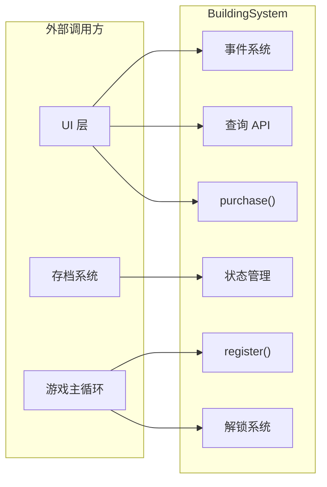
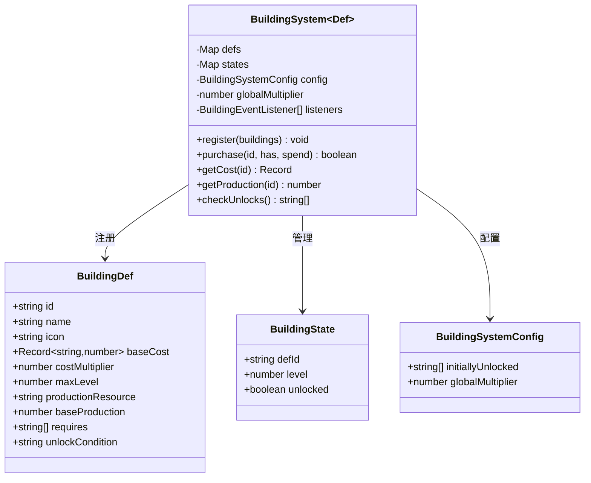
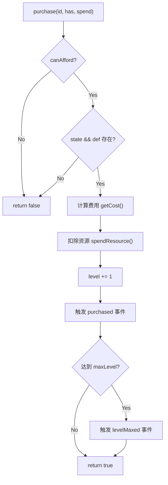

# BuildingSystem 建筑子系统 — 审查报告

> **审查日期**：2025-07-10  
> **审查人**：系统架构师  
> **审查范围**：源码 + 单元测试

---

## 概览

| 指标 | 值 |
|------|-----|
| 源码文件 | `src/engines/idle/modules/BuildingSystem.ts` |
| 源码行数 | 617 行 |
| 测试文件 | `src/__tests__/BuildingSystem.test.ts` |
| 测试行数 | 744 行 |
| 公共方法数 | 18 |
| 类型/接口数 | 6（`BuildingDef`, `BuildingState`, `BuildingEvent`, `BuildingSystemConfig`, `BuildingEventListener`, `BuildingSystem<Def>`） |
| 外部依赖 | 无（纯 TypeScript） |

### 依赖关系



---

## 接口分析

### 公共 API 列表

| 方法 | 职责 | 评价 |
|------|------|------|
| `constructor(config)` | 初始化系统 | ✅ 配置简洁清晰 |
| `register(buildings)` | 注册建筑定义 | ✅ 支持批量注册、覆盖注册 |
| `loadState(savedLevels)` | 从存档恢复等级 | ⚠️ 仅恢复等级，不恢复解锁状态 |
| `saveState()` | 导出存档数据 | ✅ 仅导出非零数据，体积优化 |
| `getDef(id)` | 获取建筑定义 | ✅ |
| `getAllDefs()` | 获取所有定义 | ✅ 保持注册顺序 |
| `getLevel(id)` | 获取当前等级 | ✅ |
| `getCost(id)` | 计算下一级费用 | ✅ 公式清晰 |
| `canAfford(id, hasResource)` | 检查购买能力 | ✅ 综合判断完整 |
| `isUnlocked(id)` | 检查解锁状态 | ✅ |
| `getProduction(id)` | 计算单建筑产出 | ✅ |
| `getTotalProduction()` | 汇总所有产出 | ✅ 按资源分组 |
| `getUnlockedBuildings()` | 获取已解锁建筑列表 | ✅ |
| `getVisibleCount()` | 获取可见建筑数量 | ✅ 支持"即将解锁"预览 |
| `purchase(id, has, spend)` | 购买/升级建筑 | ✅ 资源管理委托外部 |
| `setGlobalMultiplier(m)` | 设置全局倍率 | ⚠️ 缺少校验 |
| `checkUnlocks()` | 检查并自动解锁 | ✅ 返回新解锁列表 |
| `forceUnlock(id)` | 强制解锁 | ✅ |
| `onEvent(listener)` | 注册监听器 | ✅ |
| `offEvent(listener)` | 移除监听器 | ✅ |
| `reset(keepUnlocked?)` | 重置系统 | ✅ 灵活参数 |

### 数据模型分析



**数据模型评价**：

- ✅ `BuildingDef` 与 `BuildingState` 分离，定义与运行时状态解耦
- ✅ 泛型 `<Def extends BuildingDef>` 支持游戏自定义扩展
- ✅ 事件类型使用 discriminated union，类型安全
- ⚠️ `BuildingState` 缺少版本号字段，存档迁移困难
- ⚠️ `unlockCondition` 仅为 UI 展示用字符串，无法参与实际逻辑判断

---

## 核心逻辑分析

### 1. 建筑升级流程



**评价**：
- ✅ 流程清晰，防御性编程到位
- ✅ 资源管理委托外部（`hasResource` / `spendResource` 回调），系统不持有资源状态
- ⚠️ `purchase()` 内部调用 `getCost()` 两次（`canAfford` 一次 + 扣费一次），存在微小性能浪费

### 2. 产出计算逻辑

```
单建筑产出 = baseProduction × level × globalMultiplier
总产出 = Σ (已解锁且 level > 0 的建筑产出)，按 productionResource 分组
```

**评价**：
- ✅ 公式简洁直观
- ⚠️ 线性产出模型（`baseProduction × level`），缺少每级递增产出机制（放置游戏常见设计）
- ⚠️ 无建筑个体倍率字段，所有倍率只能通过 `globalMultiplier` 全局控制
- 🔴 **缺少离线收益计算能力**：无 `calculateOfflineProduction(elapsedMs)` 方法，不符合放置游戏核心需求

### 3. 解锁/前置条件


**评价**：
- ✅ 链式解锁逻辑正确，需逐级触发
- ✅ `checkUnlocks()` 返回新解锁列表，方便 UI 更新
- ⚠️ 前置条件仅支持"建筑等级 > 0"，不支持更复杂的条件（如"等级 ≥ N"、"资源 ≥ X"）
- ⚠️ `getVisibleCount()` 中可见性逻辑与 `checkUnlocks()` 解锁条件重复但不完全一致（可见性不要求已解锁）

### 4. 边界情况处理

| 场景 | 处理方式 | 评价 |
|------|----------|------|
| 未注册建筑 ID | 静默返回默认值（0/false/空对象） | ✅ 不抛异常 |
| 重复注册 | 覆盖定义，保留状态 | ✅ 合理 |
| 负数 globalMultiplier | 未校验，直接使用 | 🔴 可能导致负产出 |
| loadState 传入负数等级 | 未校验，直接赋值 | 🟡 可导致异常状态 |
| maxLevel = 0 | 正确处理为"无上限" | ✅ |
| 空建筑列表注册 | 静默跳过 | ✅ |
| 监听器抛异常 | try-catch 隔离，不中断其他监听器 | ✅ |

---

## 问题清单

### 🔴 严重问题

#### 1. 缺少离线收益计算能力
- **描述**：放置游戏的核心特性是离线收益，但系统无 `calculateOfflineProduction(elapsedMs)` 方法。上层需自行计算，容易出错且逻辑分散。
- **位置**：`BuildingSystem` 类整体设计
- **修复建议**：
  ```typescript
  calculateOfflineProduction(elapsedMs: number): Record<string, number> {
    const production = this.getTotalProduction(); // 每秒产出
    const seconds = elapsedMs / 1000;
    const result: Record<string, number> = {};
    for (const [resource, rate] of Object.entries(production)) {
      result[resource] = rate * seconds;
    }
    return result;
  }
  ```

#### 2. `setGlobalMultiplier` 缺少参数校验
- **描述**：传入负数、NaN、Infinity 会导致产出计算异常。
- **位置**：第 399 行 `setGlobalMultiplier(multiplier: number)`
- **修复建议**：
  ```typescript
  setGlobalMultiplier(multiplier: number): void {
    if (typeof multiplier !== 'number' || !Number.isFinite(multiplier) || multiplier < 0) {
      throw new RangeError('globalMultiplier must be a finite non-negative number');
    }
    this.globalMultiplier = multiplier;
  }
  ```

#### 3. `loadState` 不恢复解锁状态
- **描述**：存档恢复后，已解锁但不在 `initiallyUnlocked` 中的建筑会回到锁定状态。虽然测试中通过 `checkUnlocks()` 弥补，但这要求前置建筑等级 > 0 才能触发，如果前置条件不完全是"建筑等级"（未来扩展），则解锁状态会丢失。
- **位置**：第 157 行 `loadState(savedLevels)`
- **修复建议**：扩展 `saveState()` 和 `loadState()` 以包含解锁状态：
  ```typescript
  interface BuildingSystemSaveData {
    levels: Record<string, number>;
    unlocked: string[];
  }
  saveState(): BuildingSystemSaveData { ... }
  loadState(data: BuildingSystemSaveData): void { ... }
  ```

### 🟡 中等问题

#### 4. 产出公式过于简单，缺少每级递增机制
- **描述**：当前 `baseProduction × level` 为纯线性增长，放置游戏通常采用指数或阶梯式增长以保持后期趣味性。
- **位置**：第 281 行 `getProduction(id)`
- **修复建议**：在 `BuildingDef` 中增加可选的 `productionMultiplier` 字段：
  ```typescript
  // BuildingDef 新增
  productionMultiplier?: number; // 默认 1.0，每级产出 = base * (multiplier ^ (level-1))
  ```

#### 5. 前置条件系统不够灵活
- **描述**：`requires` 仅支持"建筑等级 > 0"的隐式条件，无法表达"鱼塘等级 ≥ 3"或"金币 ≥ 1000"等复杂条件。
- **位置**：`BuildingDef.requires` 字段，`checkUnlocks()` 方法
- **修复建议**：引入条件函数或结构化条件：
  ```typescript
  // 方案 A：条件函数
  unlockCondition?: (system: BuildingSystem) => boolean;
  
  // 方案 B：结构化条件（可序列化）
  requires?: Array<{
    buildingId: string;
    minLevel: number;
  }>;
  ```

#### 6. `purchase()` 中 `getCost()` 被调用两次
- **描述**：`canAfford()` 内部调用 `getCost()`，`purchase()` 内部再次调用，当建筑数量多或费用资源种类多时存在不必要的重复计算。
- **位置**：第 354-371 行
- **修复建议**：将 `canAfford` 改为内部可复用费用缓存，或让 `purchase` 直接计算费用一次：
  ```typescript
  purchase(id, hasResource, spendResource): boolean {
    const cost = this.getCost(id);
    if (!this.canAffordWithCost(id, cost, hasResource)) return false;
    // ... use cost directly
  }
  ```

#### 7. 事件系统缺少 `once` 和 `removeAllListeners` 能力
- **描述**：无法注册一次性监听器，也无法批量清除，在复杂 UI 场景中不便。
- **位置**：事件相关方法（第 448-474 行）
- **修复建议**：
  ```typescript
  onceEvent(listener: BuildingEventListener): void { ... }
  removeAllListeners(): void { ... }
  ```

#### 8. `getVisibleCount` 逻辑与解锁条件耦合但不一致
- **描述**：可见性判断要求 `requires.length > 0`，这意味着没有 `requires` 的建筑如果未在 `initiallyUnlocked` 中，将永远不可见。这可能是设计意图，但缺少文档说明。
- **位置**：第 318 行 `getVisibleCount()`
- **修复建议**：增加注释说明设计意图，或提供 `visibilityRule` 配置项。

### 🟢 轻微问题

#### 9. `emitEvent` 中异常被静默吞掉
- **描述**：监听器异常只被 try-catch 吞掉，无任何日志输出，调试困难。
- **位置**：第 504 行 `emitEvent()`
- **修复建议**：添加可选的 `onError` 回调或 `console.warn`：
  ```typescript
  } catch (error) {
    console.warn('[BuildingSystem] listener error:', error);
  }
  ```

#### 10. `reset()` 使用 `includes()` 查找初始解锁列表
- **描述**：每次 reset 遍历所有状态时对每个建筑调用 `Array.includes()`，O(n×m) 复杂度。建筑数量少时无影响，但不够优雅。
- **位置**：第 492 行
- **修复建议**：在构造函数中将 `initiallyUnlocked` 转为 `Set<string>`：
  ```typescript
  private readonly initiallyUnlockedSet: Set<string>;
  constructor(config) {
    this.initiallyUnlockedSet = new Set(config.initiallyUnlocked);
  }
  ```

#### 11. 缺少 `getVisibleBuildings()` 方法
- **描述**：有 `getVisibleCount()` 返回数量，但没有返回可见建筑列表的方法，UI 层需要自己遍历。
- **位置**：查询 API 区域
- **修复建议**：新增 `getVisibleBuildings(): Def[]` 方法。

#### 12. `BuildingDef.baseCost` 缺少校验
- **描述**：`baseCost` 中的值如果为 0 或负数，`getCost()` 仍会正常计算，可能导致免费购买。
- **位置**：`register()` 方法
- **修复建议**：注册时校验 `baseCost` 值 > 0。

---

## 放置游戏适配性分析

| 放置游戏特性 | 支持情况 | 说明 |
|-------------|---------|------|
| 离线收益计算 | 🔴 不支持 | 需上层自行实现 |
| 自动升级/自动购买 | 🔴 不支持 | 无 autoBuy 相关 API |
| 声望重置 | 🟡 部分支持 | `reset(true)` 可保留解锁，但无声望倍率计算 |
| 全局倍率加成 | ✅ 支持 | `setGlobalMultiplier()` |
| 建筑个体倍率 | 🔴 不支持 | 无 per-building multiplier |
| 产出加速（临时 buff） | 🔴 不支持 | 无 buff 系统 |
| 里程碑奖励 | 🟡 间接支持 | 可通过事件监听 + `forceUnlock` 实现 |
| 存档/读档 | 🟡 部分支持 | 不保存解锁状态 |
| 统计数据（总购买次数等） | 🔴 不支持 | 无统计字段 |

---

## 改进建议

### 短期修复（不破坏兼容性）

1. **添加 `setGlobalMultiplier` 参数校验** — 防止负数/NaN/Infinity
2. **添加 `calculateOfflineProduction(elapsedMs)` 方法** — 核心放置游戏能力
3. **扩展存档格式** — `saveState()` 返回 `{ levels, unlocked }`，`loadState()` 兼容旧格式
4. **添加 `getVisibleBuildings()` 方法** — 补充 UI 需求
5. **注册时校验 `baseCost` 值** — 防止零/负费用
6. **添加 `onceEvent()` 和 `removeAllListeners()`** — 增强事件系统
7. **`emitEvent` 添加 `console.warn`** — 方便调试

### 长期优化（架构层面）

1. **引入建筑个体倍率机制**
   ```typescript
   interface BuildingState {
     defId: string;
     level: number;
     unlocked: boolean;
     multiplier: number; // 新增：个体倍率
   }
   ```

2. **支持结构化前置条件**
   ```typescript
   interface UnlockCondition {
     buildingId: string;
     minLevel: number;
   }
   // BuildingDef.requires 改为 UnlockCondition[]
   ```

3. **引入 Buff/临时加成系统**
   ```typescript
   interface ProductionBuff {
     id: string;
     resource?: string;       // 不指定则全局生效
     multiplier: number;
     expiresAt: number;       // 时间戳
   }
   ```

4. **添加自动购买能力**
   ```typescript
   setAutoBuy(buildingId: string, enabled: boolean): void;
   tickAutoBuy(hasResource, spendResource): string[]; // 返回自动购买的建筑列表
   ```

5. **引入统计数据**
   ```typescript
   interface BuildingStats {
     totalPurchased: number;
     totalProductionGenerated: Record<string, number>;
   }
   ```

---

## 综合评分

| 维度 | 分数 | 说明 |
|------|------|------|
| **接口设计** | ⭐⭐⭐⭐ (4/5) | API 清晰完整，泛型设计优秀，缺少离线收益和自动购买接口 |
| **数据模型** | ⭐⭐⭐⭐ (4/5) | 定义与状态分离合理，可扩展性好，存档格式需完善 |
| **核心逻辑** | ⭐⭐⭐⭐ (4/5) | 升级/费用/解锁逻辑正确，产出公式偏简单 |
| **可复用性** | ⭐⭐⭐⭐⭐ (5/5) | 零依赖、泛型设计、回调委托资源管理，复用性极佳 |
| **性能** | ⭐⭐⭐⭐⭐ (5/5) | Map 查找 O(1)，无热路径瓶颈，建筑数量级无性能问题 |
| **测试覆盖** | ⭐⭐⭐⭐ (4/5) | 744 行测试覆盖主要场景，缺少边界值和并发测试 |
| **放置游戏适配** | ⭐⭐⭐ (3/5) | 缺少离线收益、自动购买、buff 系统等放置游戏核心特性 |

### 总分：29 / 35（82.9%）

**总体评价**：BuildingSystem 是一个设计良好的基础模块，代码质量高、接口清晰、可复用性强。核心的注册-购买-升级-解锁链路完整且正确。主要不足在于**放置游戏特性适配不足**——缺少离线收益计算、自动购买、临时 buff 等放置游戏标配能力。建议优先补齐离线收益和存档完整性，再逐步引入更丰富的放置游戏机制。

---

*报告由系统架构师生成 | BuildingSystem v1.0 审查*
