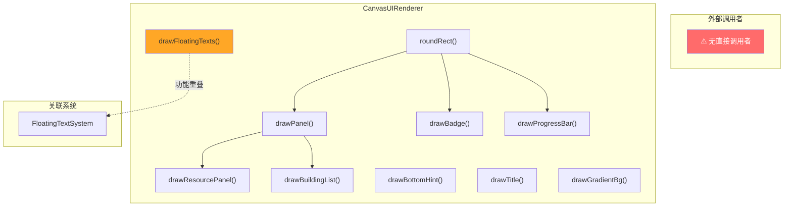
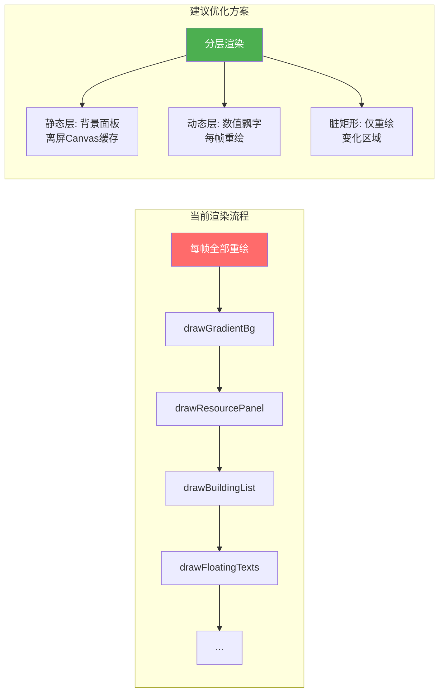
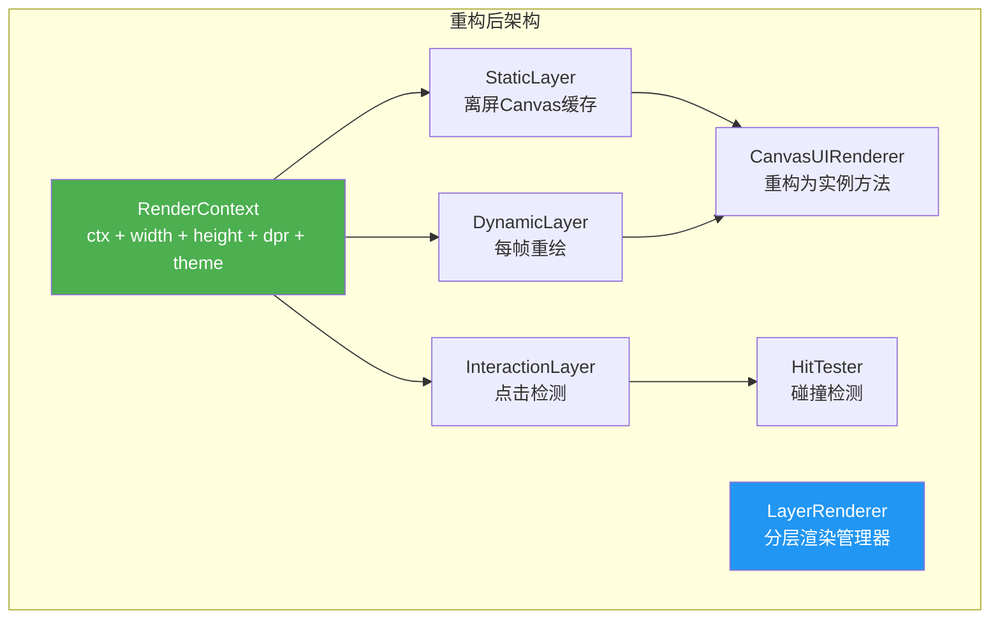

# CanvasUIRenderer 架构审查报告

> **审查对象**: `src/engines/idle/modules/CanvasUIRenderer.ts`  
> **审查日期**: 2025-07-09  
> **审查角色**: 系统架构师  
> **文件版本**: 640 行 | 10 个静态方法 | 7 个接口/类型

---

## 一、概览

### 1.1 代码度量

| 指标 | 数值 |
|------|------|
| 源码行数 | 640 |
| 有效代码行（非空非注释） | ~320 |
| 注释/文档行 | ~200 |
| 空行 | ~120 |
| 公开静态方法 | 10 |
| 导出接口/类型 | 7 |
| 外部依赖 | 0（仅 Canvas 2D API） |
| 项目内调用者 | 0（仅通过 index.ts 导出） |
| 测试文件 | ❌ **不存在** |

### 1.2 方法清单

| # | 方法名 | 职责 | 行数范围 |
|---|--------|------|----------|
| 1 | `roundRect()` | 圆角矩形路径 | L145-172 |
| 2 | `drawResourcePanel()` | 顶部资源面板 | L182-260 |
| 3 | `drawBuildingList()` | 建筑列表（网格） | L274-375 |
| 4 | `drawFloatingTexts()` | 飘字效果 | L385-430 |
| 5 | `drawBadge()` | 徽章/胶囊标签 | L440-465 |
| 6 | `drawBottomHint()` | 底部操作提示 | L475-490 |
| 7 | `drawTitle()` | 居中标题 | L500-520 |
| 8 | `drawGradientBg()` | 渐变背景 | L530-548 |
| 9 | `drawProgressBar()` | 进度条 | L558-596 |
| 10 | `drawPanel()` | 通用面板背景 | L606-640 |

### 1.3 依赖关系图



### 1.4 导出接口

| 接口名 | 用途 | 字段数 |
|--------|------|--------|
| `ResourceDisplayItem` | 资源显示项 | 6 |
| `BuildingDisplayItem` | 建筑列表项 | 7 |
| `FloatingText` | 飘字效果 | 6 |
| `BadgeOptions` | 徽章配置 | 7 |
| `ResourcePanelConfig` | 资源面板布局 | 7 |
| `BuildingListConfig` | 建筑列表布局 | 10 |
| `UIColorScheme` | 主题颜色 | 12 |

---

## 二、接口分析

### 2.1 接口设计优点

1. **接口粒度合理**：每个接口对应一个明确的 UI 组件，字段命名清晰
2. **配置与数据分离**：`*Config` 接口负责布局，`*Item` 接口负责数据
3. **可选字段设计得当**：颜色、字体等均有合理默认值
4. **UIColorScheme 集中管理**：12 个主题色常量，支持全局换肤

### 2.2 接口设计问题

| 问题 | 说明 |
|------|------|
| `FloatingText` 与 `FloatingTextSystem` 类型重复 | 两个子系统各自定义了飘字数据结构，语义重叠但字段不同，增加认知负担 |
| 缺少统一的 `RenderContext` 接口 | 每个方法都单独传入 `ctx`、`canvasWidth`、`canvasHeight`，参数冗余 |
| `ResourceDisplayItem.amount` 为 `string` | 已格式化文本无法进行布局计算（如截断、自适应字号），应传入 `number` + 格式化函数 |
| 缺少 `Padding` / `Margin` 类型 | 布局参数散落在各 Config 中（`itemPadding`、`itemMarginX`），未抽象为通用盒模型 |

### 2.3 接口定义评估

```typescript
// 当前：参数冗余，每个方法都要传 ctx + canvasWidth + canvasHeight
static drawBuildingList(ctx, buildings, config, canvasWidth): void
static drawBottomHint(ctx, text, canvasWidth, canvasHeight, color?): void
static drawTitle(ctx, title, canvasWidth, y?, color?): void

// 建议：封装渲染上下文
interface RenderContext {
  ctx: CanvasRenderingContext2D;
  width: number;
  height: number;
  dpr: number;       // 设备像素比
  colors: UIColorScheme;
}
```

---

## 三、核心逻辑分析

### 3.1 布局系统

**现状**：采用硬编码数值 + 简单线性排列。

```typescript
// drawResourcePanel — 硬编码布局常量
const itemHeight = 64;      // L209
const itemGap = 8;           // L210
const innerPadding = 10;     // L211
```

**问题**：
- 布局常量散落在方法体内，无法从外部调整
- 无响应式布局能力（固定 64px 高度）
- 无文本溢出处理（长资源名/大数字可能超出卡片边界）
- `drawBuildingList` 的网格布局较合理，但列数计算未考虑最小宽度保障

### 3.2 绘制系统

**现状**：基于 `roundRect` 原子方法 + 各组件方法直接调用 Canvas API。

**优点**：
- `roundRect` 做了半径安全裁剪（L163-164），防御性好
- `drawPanel` 作为通用面板方法被复用，减少重复代码
- 颜色使用 `??` 运算符提供默认值

**问题**：
- **无 DPR（设备像素比）适配**：在高 DPI 屏幕上会模糊
- **无 `ctx.save()/restore()` 保护**：除 `drawFloatingTexts` 外，其他方法直接修改 `ctx.font`、`ctx.fillStyle`、`ctx.textAlign` 等状态但不恢复
- **字体硬编码**：所有方法内嵌字体字符串，无法全局切换

```typescript
// 问题示例：修改了 ctx 状态但未恢复
static drawTitle(ctx, title, canvasWidth, y?, color?): void {
  ctx.font = 'bold 22px "Segoe UI", Arial, sans-serif';  // 污染调用方上下文
  ctx.textAlign = 'center';
  ctx.textBaseline = 'middle';
  ctx.fillStyle = color ?? DEFAULT_COLORS.accentGold;
  ctx.fillText(title, canvasWidth / 2, titleY);
  // ⚠️ 没有 ctx.restore()
}
```

### 3.3 动画系统

**现状**：仅 `drawFloatingTexts` 涉及动画逻辑。

**分析**：
- 透明度线性衰减：`alpha = life / maxLife`（L397）
- 向上漂移：`drift = (1 - life/maxLife) * 40`（L400）
- 使用 `ctx.save()/restore()` 正确保护状态 ✅
- 但无缓动函数支持（线性运动不够自然）

**与 FloatingTextSystem 的关系**：
- `FloatingTextSystem` 是完整的飘字子系统（5 种轨迹 + 4 种缓动 + 6 种预设样式）
- `CanvasUIRenderer.drawFloatingTexts` 是简化版飘字（仅 floatUp + linear）
- **功能重叠但未复用**，维护两套飘字逻辑

### 3.4 交互系统

**现状**：CanvasUIRenderer 是纯绘制层，不处理交互。

**评估**：
- ✅ 正确的职责分离，绘制与交互解耦
- ⚠️ `drawBuildingList` 返回 `void`，调用方无法获取绘制后的卡片位置用于点击检测
- 缺少 `hitTest()` 或 `getBuildingBounds()` 等辅助方法

---

## 四、问题清单

### 🔴 严重问题

| # | 问题 | 位置 | 说明 | 修复建议 |
|---|------|------|------|----------|
| S1 | **无测试覆盖** | 全文件 | 项目中 13 个 idle 子系统均有测试，唯独 CanvasUIRenderer 缺失 | 补充单元测试，覆盖所有 10 个方法 |
| S2 | **Canvas 状态泄漏** | L222-260, L300-375, L476-490, L500-520 | 除 `drawFloatingTexts` 外，所有方法修改 `ctx.font`/`fillStyle`/`textAlign` 后不恢复，污染调用方上下文 | 每个方法开头 `ctx.save()`，结尾 `ctx.restore()` |
| S3 | **无 DPR 适配** | 全文件 | 未考虑 `devicePixelRatio`，在 Retina/HiDPI 屏幕上文字和图形模糊 | 增加 `scaleCanvas(ctx, dpr)` 工具方法，或由调用方在 `RenderContext` 中传入 |
| S4 | **零外部调用者** | 全文件 | 搜索整个 `src/` 目录，除 `index.ts` 导出外无任何文件 import 或使用 CanvasUIRenderer | 确认是否为未集成模块，若是则制定集成计划 |

### 🟡 中等问题

| # | 问题 | 位置 | 说明 | 修复建议 |
|---|------|------|------|----------|
| M1 | **布局常量硬编码** | L209-211, L300-375 | `itemHeight=64`、`itemGap=8`、`innerPadding=10` 等写死在方法体 | 提取到 Config 接口或主题常量 |
| M2 | **飘字功能与 FloatingTextSystem 重叠** | L385-430 | 项目已有功能完善的 FloatingTextSystem（5 种轨迹 + 4 种缓动），此处重复实现 | 删除 `drawFloatingTexts`，或改为调用 FloatingTextSystem |
| M3 | **无文本截断/溢出处理** | L232-254, L340-370 | 长资源名、大数字可能超出卡片边界，无 `ellipsis` 或自适应逻辑 | 添加 `truncateText(ctx, text, maxWidth)` 工具方法 |
| M4 | **字体字符串重复** | 全文件 | `'bold 22px "Segoe UI", Arial, sans-serif'` 等字体定义出现 10+ 次 | 提取为 `FontConfig` 接口或 `FontTheme` 常量 |
| M5 | **drawProgressBar 填充条最小宽度问题** | L583 | `fillWidth = Math.max(h, w * clampedProgress)` 当 progress 很小时填充条仍为圆角矩形高度，视觉上呈现为圆形而非细条 | 改为 `Math.max(2, w * clampedProgress)` 或使用 clip 方案 |
| M6 | **drawBuildingList 无返回值** | L274-375 | 调用方无法获取卡片绘制位置，不利于后续点击检测 | 返回 `Array<{id: string, bounds: {x,y,w,h}}>` |

### 🟢 轻微问题

| # | 问题 | 位置 | 说明 | 修复建议 |
|---|------|------|------|----------|
| L1 | **`DEFAULT_COLORS` 不可覆盖** | L118-131 | 颜色常量为模块级 `const`，无法运行时切换主题 | 改为可注入的 `ThemeRegistry` 或方法参数 |
| L2 | **缺少 JSDoc @example** | 全文件 | 文档注释完整但缺少使用示例 | 为每个公开方法添加 `@example` 代码片段 |
| L3 | **`roundRect` 可用原生 API** | L145-172 | 现代浏览器已支持 `ctx.roundRect()`，可做特性检测降级 | `if (ctx.roundRect) { ctx.roundRect(x,y,w,h,r); } else { /* fallback */ }` |
| L4 | **缺少离屏渲染优化** | 全文件 | 频繁绘制的静态 UI（如资源面板背景）可缓存到离屏 Canvas | 提供 `createCachedPanel()` 方法 |
| L5 | **`drawGradientBg` 仅支持垂直渐变** | L530-548 | 不支持水平或对角线渐变方向 | 增加 `direction` 参数 |
| L6 | **Emoji 渲染跨平台不一致** | L228, L314 | 使用 Emoji 作为图标在不同 OS 上渲染差异大 | 考虑改用图标字体或 SVG sprite |

---

## 五、放置游戏适配性分析

### 5.1 放置游戏 UI 特征覆盖

| 放置游戏 UI 元素 | 是否支持 | 对应方法 |
|------------------|----------|----------|
| 资源面板（顶部资源条） | ✅ | `drawResourcePanel` |
| 建筑列表（购买/升级卡片） | ✅ | `drawBuildingList` |
| 数值飘字（产出/消耗反馈） | ✅ | `drawFloatingTexts` |
| 进度条（升级/生产进度） | ✅ | `drawProgressBar` |
| 徽章（等级/成就标记） | ✅ | `drawBadge` |
| 标题栏 | ✅ | `drawTitle` |
| 底部操作提示 | ✅ | `drawBottomHint` |
| 渐变背景 | ✅ | `drawGradientBg` |
| 通用面板 | ✅ | `drawPanel` |

### 5.2 缺失的放置游戏 UI 元素

| 缺失元素 | 重要性 | 说明 |
|----------|--------|------|
| **数字滚动动画** | 🔴 高 | 放置游戏核心体验，资源数量变化时应有数字滚动效果 |
| **通知/Toast 系统** | 🟡 中 | 解锁新建筑、达成成就等需要通知反馈 |
| **弹窗/对话框** | 🟡 中 | 确认购买、声望重置等需要模态弹窗 |
| **标签页/Tab 切换** | 🟡 中 | 建筑面板、科技树、角色等需要 Tab 导航 |
| **迷你地图/区域地图** | 🟢 低 | 领土系统可能需要地图渲染 |
| **图表/趋势线** | 🟢 低 | 统计系统可能需要简单的折线图 |

### 5.3 放置游戏性能考量

放置游戏需要长时间运行，Canvas 渲染的性能至关重要：



---

## 六、改进建议

### 6.1 短期改进（1-2 天）

#### P0：补充测试（对应 S1）

```typescript
// 建议测试结构
describe('CanvasUIRenderer', () => {
  let ctx: CanvasRenderingContext2D;

  beforeEach(() => {
    const canvas = document.createElement('canvas');
    ctx = canvas.getContext('2d')!;
  });

  describe('roundRect', () => {
    it('应正确创建圆角矩形路径', () => { ... });
    it('半径超过宽高一半时应自动裁剪', () => { ... });
    it('半径为 0 时应退化为直角矩形', () => { ... });
    it('负数宽高不应崩溃', () => { ... });
  });

  describe('drawResourcePanel', () => {
    it('空数组应直接返回', () => { ... });
    it('应正确绘制每个资源项', () => { ... });
    it('perSecond 为空字符串时不绘制产出文本', () => { ... });
  });

  describe('drawBuildingList', () => {
    it('应正确计算每行卡片数', () => { ... });
    it('选中状态应使用高亮背景', () => { ... });
    it('不可购买状态应使用灰色', () => { ... });
  });

  describe('drawFloatingTexts', () => {
    it('life <= 0 的飘字应跳过', () => { ... });
    it('透明度应随 life 线性衰减', () => { ... });
  });

  describe('drawProgressBar', () => {
    it('progress 应裁剪到 [0, 1]', () => { ... });
    it('progress 为 0 时不绘制填充条', () => { ... });
  });

  // ... 其余方法
});
```

#### P0：修复 Canvas 状态泄漏（对应 S2）

```typescript
// 修复模式：所有绘制方法统一包裹 save/restore
static drawTitle(ctx, title, canvasWidth, y?, color?): void {
  ctx.save();                                    // ← 新增
  const titleY = y ?? 30;
  ctx.font = 'bold 22px "Segoe UI", Arial, sans-serif';
  ctx.textAlign = 'center';
  ctx.textBaseline = 'middle';
  ctx.fillStyle = color ?? DEFAULT_COLORS.accentGold;
  ctx.fillText(title, canvasWidth / 2, titleY);
  ctx.restore();                                 // ← 新增
}
```

#### P1：消除飘字重复（对应 M2）

两个方案择一：
- **方案 A**：删除 `drawFloatingTexts`，由调用方直接使用 `FloatingTextSystem.render()`
- **方案 B**：将 `drawFloatingTexts` 改为 `FloatingTextSystem` 的薄包装

### 6.2 长期改进（1-2 周）

#### 架构重构：引入渲染上下文 + 分层缓存



```typescript
// 重构方向：从静态工具类 → 可配置的渲染器实例
class CanvasUIRenderer {
  private ctx: CanvasRenderingContext2D;
  private width: number;
  private height: number;
  private dpr: number;
  private colors: UIColorScheme;
  private fonts: UIFontConfig;
  
  // 静态 UI 缓存
  private staticCache: Map<string, OffscreenCanvas> = new Map();

  constructor(options: RendererOptions) { ... }
  
  // 布局计算与绘制分离
  layoutResourcePanel(items: ResourceDisplayItem[]): LayoutResult { ... }
  drawResourcePanel(items: ResourceDisplayItem[]): void { ... }
  
  // 命中测试
  hitTestBuilding(x: number, y: number): string | null { ... }
}
```

#### 主题系统

```typescript
interface UITheme {
  colors: UIColorScheme;
  fonts: UIFontConfig;
  spacing: UISpacingConfig;
  radius: UIRadiusConfig;
}

const THEMES: Record<string, UITheme> = {
  dark: { ... },    // 默认深色
  light: { ... },   // 浅色模式
  egyptian: { ... }, // 埃及主题
};
```

---

## 七、综合评分

| 维度 | 评分(1-5) | 说明 |
|------|-----------|------|
| **接口设计** | 3.5 | 接口粒度合理，但缺少统一渲染上下文，参数冗余 |
| **数据模型** | 3.5 | 类型定义完整，但 amount 为 string 限制了布局计算能力 |
| **核心逻辑** | 3.0 | 基本绘制功能完整，但 Canvas 状态泄漏、无 DPR 适配 |
| **可复用性** | 3.0 | 静态方法设计便于调用，但硬编码布局和字体降低了灵活性 |
| **性能** | 2.5 | 无分层缓存、无脏矩形、无离屏渲染，长时间运行有隐患 |
| **测试覆盖** | 1.0 | ❌ 零测试，13 个同类模块中唯一缺失测试的 |
| **放置游戏适配** | 3.5 | 覆盖了核心 UI 元素，但缺少数字滚动、弹窗、Tab 等关键组件 |

### 总分：20.0 / 35

```
接口设计    ███████░░░  3.5/5
数据模型    ███████░░░  3.5/5
核心逻辑    ██████░░░░  3.0/5
可复用性    ██████░░░░  3.0/5
性能        █████░░░░░  2.5/5
测试覆盖    ██░░░░░░░░  1.0/5
放置游戏适配 ███████░░░  3.5/5
─────────────────────────────
总计        ███████░░░  20.0/35 (57%)
```

### 评级：⚠️ 需要改进

**核心结论**：CanvasUIRenderer 作为一个放置游戏的 Canvas UI 渲染模块，**接口设计和功能覆盖基本合格**，但存在 **Canvas 状态泄漏（S2）** 和 **零测试覆盖（S1）** 两个严重问题需要立即修复。长期来看，需要引入分层渲染和主题系统以支撑放置游戏的长时间运行和多样化 UI 需求。

---

## 附录 A：方法调用链分析

```
roundRect()          ← 原子方法，被 4 个方法调用
  ├─ drawPanel()     ← 通用面板，被 2 个方法调用
  │   ├─ drawResourcePanel()
  │   └─ drawBuildingList()
  ├─ drawBadge()
  └─ drawProgressBar()

独立方法（无内部依赖）：
  ├─ drawFloatingTexts()
  ├─ drawBottomHint()
  ├─ drawTitle()
  └─ drawGradientBg()
```

## 附录 B：与 FloatingTextSystem 对比

| 特性 | CanvasUIRenderer.drawFloatingTexts | FloatingTextSystem |
|------|-------------------------------------|-------------------|
| 轨迹类型 | 1 种（floatUp） | 5 种 |
| 缓动函数 | 1 种（linear） | 4 种 |
| 预设样式 | 无 | 6 种 |
| 缩放动画 | ❌ | ✅ |
| 描边支持 | ❌ | ✅ |
| 生命周期管理 | ❌（由调用方管理） | ✅（内置） |
| 序列化支持 | ❌ | ✅ |
| 代码量 | ~45 行 | ~500+ 行 |

**建议**：CanvasUIRenderer 的飘字功能应委托给 FloatingTextSystem，仅保留一个薄包装方法。
