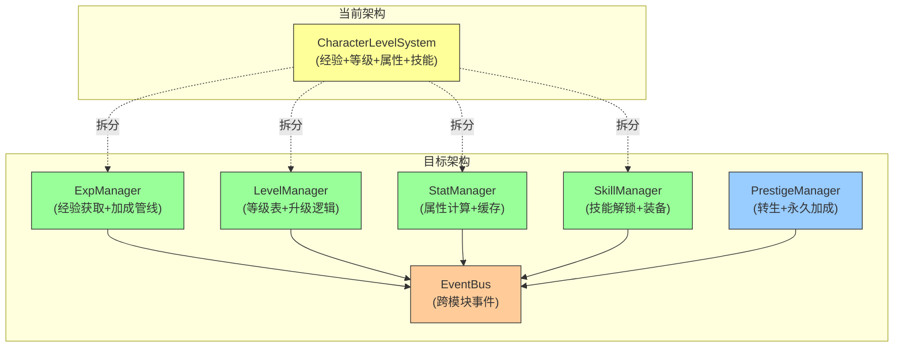

# CharacterLevelSystem 角色等级子系统 — 架构审查报告

> **审查人**: 系统架构师  
> **审查日期**: 2025-07-09  
> **源码路径**: `src/engines/idle/modules/CharacterLevelSystem.ts`  
> **测试路径**: `src/engines/idle/__tests__/CharacterLevelSystem.test.ts`

---

## 一、概览

### 1.1 基本指标

| 指标 | 数值 |
|------|------|
| 源码行数 | ~370 行 |
| 测试行数 | ~450 行 |
| 公共方法数 | 15 |
| 私有方法数 | 3 |
| 导出接口数 | 4 (`LevelTable`, `CharacterLevelState`, `CharacterLevelEvent`, `AddExpResult`) |
| 导出类数 | 1 (`CharacterLevelSystem`) |
| 模块级工具函数 | 2 (`parseStringNumberMap`, `parseStringSet`) |
| 外部依赖 | 0（纯 TypeScript） |
| 被依赖模块 | 0（当前无其他模块直接导入） |

### 1.2 依赖关系

```
┌─────────────────────────────────────────────────────┐
│                  modules/index.ts                    │
│         (统一导出 CharacterLevelSystem + Types)       │
└──────────────────────┬──────────────────────────────┘
                       │ export
          ┌────────────▼────────────┐
          │  CharacterLevelSystem   │
          │  ┌───────────────────┐  │
          │  │  LevelTable[]     │◄─┼── 外部注入等级配置
          │  │  state (内部)     │  │
          │  │  listeners[]      │  │
          │  └───────────────────┘  │
          └─────────────────────────┘
          无外部运行时依赖 ✅
```

### 1.3 方法清单

| 类别 | 方法 | 可见性 |
|------|------|--------|
| **核心操作** | `addExp(amount)` | public |
| **查询** | `getLevel()`, `getLevelProgress()`, `getExpToNextLevel()`, `getMaxLevel()`, `getTitle()`, `isSkillUnlocked()`, `getTotalStats()` | public |
| **属性分配** | `allocateStat(statId, points)` | public |
| **状态管理** | `getState()`, `serialize()`, `deserialize()`, `reset()` | public |
| **兼容别名** | `saveState()`, `loadState()` | public (deprecated) |
| **事件** | `onEvent(callback)` | public |
| **内部** | `emitEvent()`, `canLevelUp()`, `findLevelDef()` | private |

---

## 二、接口分析

### 2.1 LevelTable — 等级表条目

```typescript
interface LevelTable {
  level: number;           // 等级编号
  expRequired: number;     // 累计经验阈值
  statBonus: Record<string, number>;  // 属性加成
  unlockSkills: string[];  // 解锁技能
  title: string;           // 称号
}
```

**评价**: 结构清晰，字段语义明确。`expRequired` 使用累计值而非增量值，避免了运行时累加计算，是正确的设计选择。

**🟡 问题**: 缺少运行时校验——如果 `expRequired` 不单调递增、`level` 有重复或跳跃，系统会静默产生错误行为。

### 2.2 CharacterLevelState — 状态快照

```typescript
interface CharacterLevelState {
  level: number;
  currentExp: number;
  totalExp: number;
  availablePoints: number;
  allocatedStats: Record<string, number>;
  unlockedSkills: Set<string>;  // ⚠️ JSON 不可序列化
}
```

**评价**: 字段完整，`getState()` 返回深拷贝，防止外部篡改。

**🔴 问题**: `unlockedSkills` 使用 `Set<string>` 类型，无法直接 `JSON.stringify`。虽然 `serialize()` 做了转换，但 `CharacterLevelState` 接口本身作为公共 API 类型，包含不可序列化字段，会给消费者造成困惑。

### 2.3 CharacterLevelEvent — 事件

```typescript
interface CharacterLevelEvent {
  type: 'exp_gained' | 'level_up' | 'skill_unlocked' | 'stat_allocated';
  data?: Record<string, unknown>;
  level?: number;   // @deprecated
  skill?: string;   // @deprecated
  stat?: string;    // @deprecated
}
```

**评价**: 事件类型覆盖了核心场景，`data` 字段提供了扩展性。

**🟡 问题**: 同时保留 deprecated 顶层字段和新的 `data` 字段，增加了接口复杂度。deprecated 字段在 `emitEvent()` 中仍然赋值，没有明确的移除计划。

### 2.4 AddExpResult — 升级结果

```typescript
interface AddExpResult {
  leveledUp: boolean;
  newLevel: number;
  levelsGained: number;
}
```

**评价**: 简洁实用，信息充分。

---

## 三、核心逻辑分析

### 3.1 经验与升级流程

```mermaid
flowchart TD
    A["addExp(amount)"] --> B{amount ≤ 0?}
    B -- 是 --> C["返回未升级结果"]
    B -- 否 --> D["累加 currentExp / totalExp"]
    D --> E["发射 exp_gained 事件"]
    E --> F{canLevelUp()?}
    F -- 否 --> G["返回升级结果"]
    F -- 是 --> H["level++, levelsGained++"]
    H --> I["获得属性点"]
    I --> J["重算 currentExp"]
    J --> K["解锁技能 + 发射事件"]
    K --> L["发射 level_up 事件"]
    L --> F
```

**分析**:
- 连续升级循环逻辑正确，通过 `totalExp` 与下一级 `expRequired` 比较判断
- `currentExp` 在每次升级后通过 `totalExp - curDef.expRequired` 重算，保证准确性
- 满级后经验继续累加但不升级，`getExpToNextLevel()` 返回 0

**🟡 问题**: 满级后 `addExp()` 仍然将溢出经验累加到 `currentExp` 和 `totalExp`，但 `currentExp` 没有上限约束。虽然不影响功能，但在 UI 展示上可能产生困惑（如显示 "3000/0" 进度条）。

### 3.2 属性成长机制

```
总属性 = Σ(等级 1 ~ 当前等级的 statBonus) + 手动分配属性点
```

**分析**:
- `getTotalStats()` 遍历等级表累加，逻辑正确
- 手动分配与基础加成分离，支持灵活构建

**🟡 问题**: `getTotalStats()` 每次调用都遍历整个等级表（O(L×S)，L=等级数，S=属性数），在放置游戏中属性查询可能非常频繁（每帧战斗计算），存在不必要的重复计算。

### 3.3 属性点分配

**分析**:
- 参数校验完善（空 ID、零/负值、超量分配）
- 返回布尔值，调用方需自行处理失败
- 分配后不可撤回（除非 `reset()`）

**🟢 问题**: 缺少 `deallocateStat()` 或 `resetAllocatedStats()` 方法，玩家无法重新分配属性点。放置游戏通常需要"洗点"功能。

### 3.4 技能解锁

**分析**:
- 技能在升级时自动解锁，通过 `Set` 去重
- 查询方法 `isSkillUnlocked()` 简洁高效

**🟡 问题**: 没有被动技能/主动技能的分类，没有技能等级概念。作为基础模块可以接受，但扩展性不足。

### 3.5 序列化/反序列化

**分析**:
- `serialize()` 将 `Set` 转为 `Array`，`deserialize()` 反向转换
- `deserialize()` 对每个字段做类型校验，非法值用安全默认值替代
- 工具函数 `parseStringNumberMap` 和 `parseStringSet` 防御性良好

**🟡 问题**: `deserialize()` 不校验逻辑一致性。例如可以反序列化出 `level=5, totalExp=10` 的不一致状态，后续行为不可预测。

### 3.6 等级表查找

```typescript
private findLevelDef(level: number): LevelTable | undefined {
  // 线性扫描，遇大于目标时提前终止
}
```

**🟢 问题**: 线性扫描 O(L)。对于放置游戏通常不超过几百级，性能完全足够。但若等级表巨大（如 10000 级），应改为二分查找。

---

## 四、问题清单

### 🔴 严重问题

| # | 问题 | 位置 | 说明 | 修复建议 |
|---|------|------|------|----------|
| S1 | `CharacterLevelState.unlockedSkills` 使用 `Set<string>` 不可 JSON 序列化 | L38 | 公共接口类型包含不可序列化字段，消费者直接 `JSON.stringify(getState())` 会得到 `{}` | 将接口中 `unlockedSkills` 改为 `string[]`，内部仍用 `Set` 优化查询 |
| S2 | `deserialize()` 无逻辑一致性校验 | L278-285 | 可反序列化出 `level=99, totalExp=0` 等非法状态，导致后续 `addExp` 行为不可预测 | 增加 `validateState()` 方法，校验 `totalExp >= 当前等级 expRequired`、`availablePoints >= 0` 等不变量 |

### 🟡 中等问题

| # | 问题 | 位置 | 说明 | 修复建议 |
|---|------|------|------|----------|
| M1 | 等级表缺少运行时校验 | L131-138 | `expRequired` 非单调递增、`level` 重复/跳跃时静默出错 | 构造时增加 `validateLevelTable()`，检查单调性和连续性 |
| M2 | deprecated 事件字段无移除计划 | L49-55 | `level`/`skill`/`stat` 标记 deprecated 但仍在 emit 中赋值 | 设定版本计划，下个大版本移除；或提供 `EventV2` 类型 |
| M3 | `getTotalStats()` 每次全量遍历 | L228-240 | 频繁调用场景（每帧战斗计算）存在性能浪费 | 引入脏标记 + 缓存，升级/分配时标记脏，查询时按需重算 |
| M4 | 满级后 `currentExp` 无上限约束 | L157-158 | 满级后继续 `addExp` 导致 `currentExp` 无限增长，UI 可能显示异常 | 满级时 `currentExp` 钳制为 `0` 或标记 `isMaxLevel` |
| M5 | 缺少属性点重分配/洗点机制 | L253-267 | 玩家无法撤回属性分配，限制了游戏策略深度 | 增加 `resetAllocatedStats()` 方法，可配合游戏内货币/道具消耗 |
| M6 | 事件监听器无类型过滤 | L296 | 监听器接收所有事件类型，消费者需自行过滤 | 提供 `on(eventType, callback)` 重载，支持按类型订阅 |
| M7 | `findLevelDef` 未利用排序特性 | L335-341 | 已排序数组使用线性扫描，可优化为二分查找 | 改为 `binarySearch`，时间复杂度 O(log L) |
| M8 | `emitEvent` 异常静默吞没 | L318-323 | 监听器异常被完全忽略，调试困难 | 增加 `console.warn` 或可选的 `onError` 回调 |

### 🟢 轻微问题

| # | 问题 | 位置 | 说明 | 修复建议 |
|---|------|------|------|----------|
| L1 | `addExp` 返回值未包含剩余经验信息 | L151-190 | 消费者无法直接知道当前经验状态 | 在 `AddExpResult` 中增加 `currentExp`/`totalExp` 字段 |
| L2 | `pointsPerLevel` 不支持按等级变化 | L110 | 固定每级属性点，无法实现"高等级给更多点" | 改为 `(level: number) => number` 函数或等级表字段 |
| L3 | 无称号变更事件 | — | 升级时未单独通知称号变化 | 在 `level_up` 事件的 `data` 中增加 `newTitle` 字段 |
| L4 | `reset()` 不发射事件 | L293-302 | 外部监听器无法感知重置操作 | `reset()` 末尾发射 `reset` 类型事件 |
| L5 | `saveState`/`loadState` 别名方法冗余 | L268-281 | deprecated 方法增加维护负担 | 设定移除时间线，或使用 `@deprecated` JSDoc 配合工具提示 |
| L6 | 无 `getUnlockedSkills()` 批量查询 | — | 需要遍历所有技能时无便捷方法 | 增加 `getUnlockedSkills(): string[]` 方法 |

---

## 五、放置游戏适配性分析

### 5.1 放置游戏特性适配度

| 特性 | 适配度 | 说明 |
|------|--------|------|
| 离线经验累积 | ⭐⭐⭐⭐ | `addExp()` 支持大批量经验，连续升级逻辑健壮 |
| 挂机自动战斗 | ⭐⭐⭐ | 缺少自动属性分配策略接口 |
| 转生/转职系统 | ⭐⭐ | 无转生/转职概念，`reset()` 是全量重置，无法保留部分进度 |
| 经验倍率/加成 | ⭐⭐ | 系统内部无加成计算，需外部计算后传入净经验值 |
| 离线存档 | ⭐⭐⭐⭐ | 序列化/反序列化完整，但缺少版本号和校验 |
| 长期进度感 | ⭐⭐⭐ | 缺少里程碑奖励、成就联动机制 |

### 5.2 关键缺失功能

1. **转生系统**: 放置游戏核心循环通常包含"转生→获得永久加成→重新升级"。当前 `reset()` 是硬重置，无法保留转生收益。建议增加：
   ```typescript
   interface PrestigeConfig {
     minLevel: number;                    // 转生最低等级
     bonusPerPrestige: Record<string, number>;  // 每次转生永久加成
     keepSkills: boolean;                 // 是否保留技能
   }
   ```

2. **经验加成钩子**: 放置游戏常见经验加成（VIP、道具、活动），建议：
   ```typescript
   constructor(levelTable, options?: {
     expMultiplier?: number;
     onExpGain?: (baseExp: number) => number;  // 加成计算回调
   })
   ```

3. **等级里程碑**: 放置游戏需要在特定等级触发特殊奖励（如每 10 级额外奖励），当前仅支持等级表定义的固定奖励。

---

## 六、改进建议

### 6.1 短期改进（1-2 天）

| 优先级 | 改进项 | 工作量 |
|--------|--------|--------|
| P0 | `CharacterLevelState.unlockedSkills` 改为 `string[]` | 0.5h |
| P0 | `deserialize()` 增加不变量校验 | 1h |
| P1 | 构造时增加等级表校验（单调性、连续性） | 1h |
| P1 | `emitEvent` 异常时增加 `console.warn` | 0.5h |
| P2 | 增加洗点方法 `resetAllocatedStats()` | 1h |
| P2 | `getTotalStats()` 增加缓存优化 | 1h |

### 6.2 中期改进（1 周）

| 优先级 | 改进项 | 工作量 |
|--------|--------|--------|
| P1 | 事件系统支持按类型订阅 `on<T>(type, callback)` | 2h |
| P1 | 移除 deprecated 事件字段，统一使用 `data` | 1h |
| P2 | 序列化格式增加版本号 `__version` 字段 | 1h |
| P2 | 增加 `getUnlockedSkills()` 和 `getExpInfo()` 便捷方法 | 1h |
| P3 | `findLevelDef` 改为二分查找 | 0.5h |

### 6.3 长期演进（1-2 周）

| 优先级 | 改进项 | 说明 |
|--------|--------|------|
| P1 | 转生/转职子系统 | 作为独立模块与 `CharacterLevelSystem` 组合，通过事件联动 |
| P1 | 经验加成管线 | 支持多来源加成叠加（VIP + 道具 + 活动），外部注入计算策略 |
| P2 | 等级表配置化 | 支持从 JSON/远程配置加载等级表，支持热更新 |
| P2 | 里程碑系统 | 独立模块，监听 `level_up` 事件触发里程碑奖励 |
| P3 | 属性系统抽象 | 将属性计算抽取为独立 `StatAggregator`，支持多来源属性叠加 |

### 6.4 架构演进建议



当前 `CharacterLevelSystem` 承担了过多职责（经验、等级、属性、技能、序列化、事件），建议在游戏规模扩大后拆分为独立的管理器，通过事件总线松耦合。

---

## 七、测试覆盖分析

### 7.1 测试统计

| 维度 | 数量 |
|------|------|
| 测试套件 (describe) | 11 |
| 测试用例 (it) | 35 |
| 断言数 (expect) | ~70 |

### 7.2 覆盖矩阵

| 功能模块 | 正向测试 | 边界测试 | 异常测试 | 评价 |
|----------|----------|----------|----------|------|
| 构造函数 | ✅ 初始化、自定义点数 | ✅ 空表、乱序 | ✅ 空表抛错 | 充分 |
| addExp | ✅ 不升级/单级/多级 | ✅ 满级溢出 | ✅ 零/负值 | 充分 |
| getLevelProgress | ✅ 初始/半程/满级 | — | — | 基本覆盖 |
| getExpToNextLevel | ✅ 正常/升级后 | ✅ 满级 | — | 充分 |
| allocateStat | ✅ 正常分配/累加 | ✅ 超量/零负/空ID | — | 充分 |
| getTotalStats | ✅ 基础/升级/分配 | — | — | 基本覆盖 |
| 事件系统 | ✅ 四种事件类型 | ✅ 取消监听 | — | 良好 |
| 序列化 | ✅ 保存恢复 | ✅ 空数据 | — | 良好 |
| reset | ✅ 重置验证 | — | — | 基本覆盖 |
| getState | ✅ 深拷贝验证 | — | — | 基本覆盖 |

### 7.3 缺失测试场景

| 场景 | 优先级 | 说明 |
|------|--------|------|
| 连续升级时技能去重 | P1 | 多个等级解锁同一技能时的行为 |
| deserialize 恶意数据 | P1 | 注入 `level: Infinity`、`availablePoints: -999` 等 |
| 事件监听器异常隔离 | P2 | 监听器抛错后其他监听器仍正常 |
| 并发 addExp | P2 | 连续多次 addExp 的状态一致性 |
| 大数值经验 | P2 | `Number.MAX_SAFE_INTEGER` 附近的行为 |
| 等级表边界 | P3 | 只有 1 级的等级表、1000 级等级表 |

---

## 八、综合评分

| 维度 | 评分 (1-5) | 说明 |
|------|------------|------|
| **接口设计** | ⭐⭐⭐⭐ 4/5 | 接口清晰、职责明确；`Set` 不可序列化和 deprecated 字段拉低分数 |
| **数据模型** | ⭐⭐⭐⭐ 4/5 | 状态模型完整，序列化/反序列化健壮；缺少校验和版本号 |
| **核心逻辑** | ⭐⭐⭐⭐⭐ 5/5 | 连续升级、经验重算、属性累加逻辑正确，边界处理完善 |
| **可复用性** | ⭐⭐⭐⭐ 4/5 | 零依赖、配置驱动、事件驱动；但缺少策略注入点（加成、转生） |
| **性能** | ⭐⭐⭐⭐ 4/5 | 整体轻量；`getTotalStats()` 缺缓存、`findLevelDef()` 线性扫描 |
| **测试覆盖** | ⭐⭐⭐⭐ 4/5 | 35 个用例覆盖主要场景；缺少恶意数据、并发、大数值边界测试 |
| **放置游戏适配** | ⭐⭐⭐ 3/5 | 基础功能完备；缺少转生、经验加成、里程碑等放置游戏核心机制 |

### 总分: **28 / 35**

---

## 九、总结

`CharacterLevelSystem` 是一个**设计良好、实现扎实**的基础模块。代码组织清晰，注释充分，核心升级逻辑正确处理了连续升级等复杂场景。零外部依赖和事件驱动的架构使其具备良好的可集成性。

**主要优势**:
- 连续升级循环逻辑严谨，经验重算准确
- 序列化/反序列化防御性编程到位
- 事件系统简单实用，异常隔离保护了主流程
- 深拷贝状态快照防止了外部篡改

**主要风险**:
- `Set` 类型在公共接口中不可序列化（S1）
- 反序列化缺少不变量校验（S2）
- 缺少放置游戏核心的转生/经验加成机制

**总体建议**: 短期修复 2 个严重问题后即可安全上线；中期补充洗点和事件类型过滤；长期规划转生子系统和经验加成管线的架构拆分。
