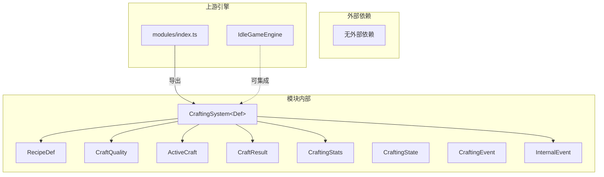
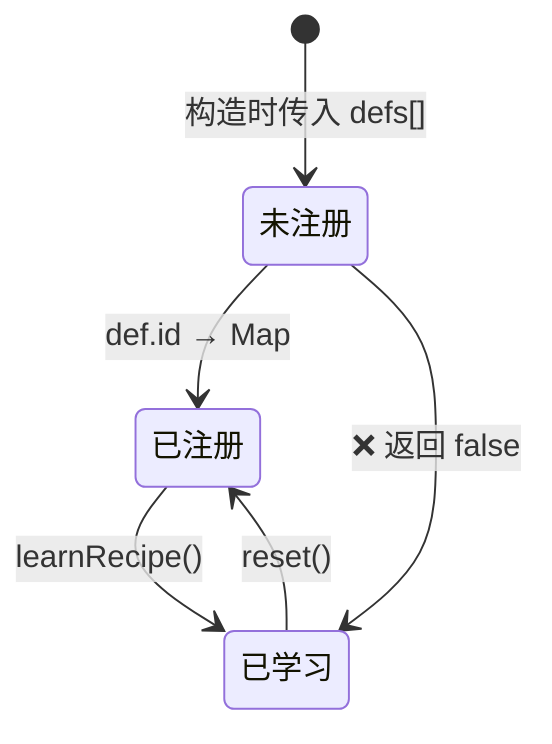
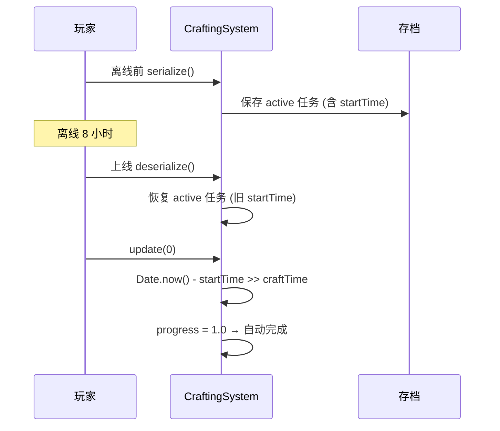

# CraftingSystem 合成/制造子系统 — 架构审查报告

> **审查人**: 系统架构师  
> **审查日期**: 2025-06-18  
> **模块路径**: `src/engines/idle/modules/CraftingSystem.ts`  
> **测试路径**: `src/engines/idle/__tests__/CraftingSystem.test.ts`  
> **优先级**: P2（放置游戏炼制/合成系统）

---

## 1. 概览

### 1.1 代码规模

| 指标 | 数值 |
|------|------|
| 源码行数 | 348 行 |
| 测试行数 | 662 行 |
| 测试/源码比 | 1.90:1 |
| 公共方法数 | 13 |
| 私有方法数 | 2 |
| 导出接口/类型 | 8 个 |
| 测试套件数 | 12 个 describe |
| 测试用例数 | ~45 个 it |

### 1.2 依赖关系



**依赖评价**: ✅ 零外部运行时依赖，纯 TypeScript 实现，高度自包含。仅依赖 `Date.now()` 和 `Math.random()`，便于测试和移植。

### 1.3 模块定位

CraftingSystem 是放置游戏引擎 P2 优先级模块，位于 `modules/` 目录下与 BattleSystem、ExpeditionSystem、TechTreeSystem 等并列。当前 **未与 IdleGameEngine 直接集成**，作为独立子系统存在，需要子类手动编排。

---

## 2. 接口分析

### 2.1 公共 API 一览

| 方法 | 签名 | 职责 | 评价 |
|------|------|------|------|
| `constructor` | `(defs?: Def[])` | 注册配方定义 | ✅ 简洁 |
| `checkIngredients` | `(recipeId, inventory) → boolean` | 材料充足检查 | ✅ 纯查询无副作用 |
| `craft` | `(recipeId, inventory) → ActiveCraft \| null` | 启动炼制 | ⚠️ 直接修改 inventory |
| `update` | `(dt: number) → void` | 推进进度 | ⚠️ dt 参数未使用 |
| `completeCraft` | `(instanceId) → CraftResult` | 完成炼制 | ✅ 清晰 |
| `learnRecipe` | `(recipeId) → boolean` | 学习配方 | ✅ 幂等设计 |
| `isLearned` | `(recipeId) → boolean` | 查询学习状态 | ✅ |
| `getActiveCrafts` | `() → readonly ActiveCraft[]` | 获取活跃任务 | ✅ 返回副本 |
| `getStats` | `() → CraftingStats` | 获取统计 | ✅ 返回副本 |
| `getRecipe` | `(id) → Def \| undefined` | 获取配方定义 | ✅ |
| `saveState / loadState` | 规范接口 | 持久化桥接 | ✅ |
| `serialize / deserialize` | 状态序列化 | 存档/读档 | ✅ 完整 |
| `reset` | `() → void` | 重置状态 | ✅ 保留配方定义 |
| `onEvent` | `(callback) → unsubscribe` | 事件监听 | ⚠️ 类型不一致 |

### 2.2 接口设计评价

**优点**:
- 泛型 `CraftingSystem<Def extends RecipeDef>` 支持游戏自定义扩展配方字段
- `ActiveCraft` 返回副本，防止外部篡改内部状态
- `onEvent` 返回取消订阅函数，符合 React/Vue 生态惯例
- `serialize/deserialize` 与 `saveState/loadState` 双层设计，兼容不同持久化方案

**问题**:
- `CraftingState` 接口定义了但 `serialize()` 返回 `Record<string, unknown>` 而非 `CraftingState`，类型信息丢失
- `CraftingEvent` 被导出但从未在内部使用，内部用的是未导出的 `InternalEvent`，存在两套事件类型

---

## 3. 核心逻辑分析

### 3.1 配方注册与学习



**分析**: 配方注册（构造函数）与学习（`learnRecipe`）分离，支持"知道配方但尚未学会"的状态。`requires` 前置配方检查在 `craft()` 中执行而非 `learnRecipe()` 中，意味着玩家可以先学后置配方（只要它已注册），但在实际炼制时才被阻止——**这是一个设计选择，但可能导致玩家困惑**。

### 3.2 材料检查与扣除

```typescript
// craft() 方法中直接修改传入的 inventory 对象
for (const [itemId, required] of Object.entries(def.ingredients)) {
  inventory[itemId] = (inventory[itemId] ?? 0) - required;
}
```

**问题**: `craft()` 方法通过**直接变异传入的 inventory 对象**来扣除材料。这种命令式副作用：
- 违反最小惊讶原则——调用方可能不期望查询+启动方法会修改参数
- 无法支持"预检查→确认→扣除"的两阶段提交模式
- 与 `checkIngredients()` 构成隐式耦合（先检查再扣除，但非原子操作）

### 3.3 炼制进度与时间系统

```typescript
update(dt: number): void {
  // ...
  craft.progress = Math.min(1, (now - craft.startTime) / def.craftTime);
  // ...
}
```

**关键问题**:
1. **`dt` 参数被完全忽略**——进度计算依赖 `Date.now() - startTime`，`dt` 参数形同虚设
2. **`Date.now()` 硬编码**——无法在测试中控制时间，也无法支持"加速炼制"等游戏功能
3. **离线进度未处理**——反序列化恢复的 `active` 任务，其 `startTime` 是旧时间戳，`update()` 会立即将过期任务标记为完成，但不会自动触发 `completeCraft()`（需要外部再调用一次 `update`）

### 3.4 品质掷骰

```typescript
private rollQuality(qualities: CraftQuality[]): CraftQuality {
  // 加权随机选择算法
  let totalWeight = 0;
  for (const q of qualities) totalWeight += q.weight;
  const roll = Math.random() * totalWeight;
  let cumulative = 0;
  for (const q of qualities) {
    cumulative += q.weight;
    if (roll < cumulative) return q;
  }
  return qualities[qualities.length - 1];
}
```

**分析**: 标准的加权随机算法（Roulette Wheel Selection），实现正确。`Math.random()` 硬编码导致：
- 无法注入确定性随机源（测试中需要 mock）
- 无法支持"幸运加成"等影响品质分布的 buff

### 3.5 事件系统

```typescript
// 导出的公共事件类型（从未使用）
export interface CraftingEvent {
  type: 'started' | 'completed' | 'failed' | 'recipe_learned' | 'quality_hit';
  // ...
}

// 内部实际使用的类型（未导出）
interface InternalEvent {
  type: 'craft_started' | 'craft_completed' | 'craft_failed' | ...;
  data?: Record<string, unknown>;
}
```

**问题**: 存在**两套事件类型**——导出的 `CraftingEvent` 和内部的 `InternalEvent`，事件名不同（`started` vs `craft_started`），结构不同（扁平 vs 嵌套 data）。`onEvent` 的回调参数类型是 `InternalEvent`，但 `InternalEvent` 未导出，外部消费者无法获得正确的类型提示。

### 3.6 并发控制

```typescript
const currentActive = this.active.filter((a) => a.recipeId === recipeId).length;
if (currentActive >= def.maxConcurrent) return null;
```

**分析**: 并发限制是**按配方维度**的（同一配方最多 N 个同时炼制），而非全局维度。这是合理的设计，但缺少全局并发上限配置。`active` 数组使用线性查找，当活跃任务量大时存在 O(n) 性能风险。

---

## 4. 问题清单

### 🔴 严重问题

#### S-01: 事件类型双重标准，外部类型不可用
- **位置**: `CraftingEvent` (L55-61) vs `InternalEvent` (L64-68), `onEvent()` (L262)
- **问题**: 导出了 `CraftingEvent` 和 `CraftingEventListener` 类型但从未使用；内部使用未导出的 `InternalEvent`，`onEvent` 回调参数为 `InternalEvent`。外部消费者无法获得正确类型。
- **修复建议**: 
  ```typescript
  // 统一为一种事件类型，删除 InternalEvent
  export interface CraftingEvent {
    type: 'craft_started' | 'craft_completed' | 'craft_failed' 
        | 'recipe_learned' | 'quality_hit';
    data?: Record<string, unknown>;
  }
  // onEvent 使用导出类型
  onEvent(callback: (event: CraftingEvent) => void): () => void { ... }
  ```

#### S-02: craft() 直接变异 inventory 参数
- **位置**: `craft()` 方法 L131-133
- **问题**: `inventory` 对象被直接修改（扣除材料），违反不可变参数原则，且与 `checkIngredients()` 的纯查询语义不一致。在并发场景下可能导致材料被重复扣除。
- **修复建议**: 
  ```typescript
  // 方案A: 返回材料扣除计划，由调用方执行
  craft(recipeId: string, inventory: Record<string, number>): 
    { craft: ActiveCraft; cost: Record<string, number> } | null;
  
  // 方案B: 使用 Inventory 抽象接口
  craft(recipeId: string, inventory: Inventory): ActiveCraft | null;
  ```

#### S-03: update() 的 dt 参数未使用，依赖 Date.now() 硬编码
- **位置**: `update()` 方法 L142-153
- **问题**: `dt` 参数在方法签名中存在但完全未被使用，进度计算依赖 `Date.now()`。这导致：(1) 无法在测试中精确控制时间推进；(2) 无法实现"加速炼制"buff；(3) 反序列化后的离线进度处理不可控。
- **修复建议**:
  ```typescript
  // 注入时间源
  constructor(defs: Def[] = [], private timeSource: () => number = Date.now) { ... }
  
  // update 使用累加进度
  update(dt: number): void {
    for (const craft of this.active) {
      const def = this.defs.get(craft.recipeId)!;
      craft.progress = Math.min(1, craft.progress + dt / def.craftTime);
    }
  }
  ```

### 🟡 中等问题

#### M-01: serialize() 返回类型过于宽泛
- **位置**: `serialize()` L233, `saveState()` L220
- **问题**: 返回 `Record<string, unknown>` 而非已定义的 `CraftingState` 接口，类型信息丢失，反序列化时需要大量 `as` 断言。
- **修复建议**:
  ```typescript
  serialize(): CraftingState {
    return {
      learned: Array.from(this.learned),
      active: this.active.map(c => ({ ...c })),
      stats: { ...this.stats, qualityDistribution: { ...this.stats.qualityDistribution } },
    };
  }
  ```
  注意：`CraftingState.learned` 当前定义为 `Set<string>`，但 JSON 序列化需要改为 `string[]`。

#### M-02: CraftingState.learned 使用 Set 无法直接 JSON 序列化
- **位置**: `CraftingState` 接口 L48
- **问题**: `Set<string>` 在 `JSON.stringify` 时会变成 `{}`，当前 `serialize()` 已手动转换为数组，但接口定义与实际序列化格式不一致。
- **修复建议**: 将 `CraftingState.learned` 类型改为 `string[]`。

#### M-03: Math.random() 硬编码，无法注入随机源
- **位置**: `completeCraft()` L170, `rollQuality()` L285
- **问题**: 成功/失败掷骰和品质掷骰均使用 `Math.random()`，无法注入确定性随机源，导致测试中需要依赖 `vi.fn()` mock 或使用成功率 0/1 的极端配方。
- **修复建议**:
  ```typescript
  constructor(defs: Def[] = [], options?: { random?: () => number }) {
    this.random = options?.random ?? Math.random;
  }
  ```

#### M-04: learnRecipe() 不检查前置配方
- **位置**: `learnRecipe()` L196-199
- **问题**: 学习配方时不检查 `requires` 前置配方是否已学习，允许跳过前置直接学习后置配方。虽然 `craft()` 中会检查，但可能导致 UI 显示已学习但无法使用的配方。
- **修复建议**: 在 `learnRecipe()` 中增加前置检查，或提供 `canLearn(recipeId)` 查询方法。

#### M-05: active 数组线性查找性能
- **位置**: `completeCraft()` L161, `update()` L147, `craft()` L128
- **问题**: `active` 是普通数组，所有查找操作均为 O(n)。当活跃任务数量大时（例如 100+ 并发炼制），性能会下降。
- **修复建议**: 增加 `Map<string, ActiveCraft>` 索引，或使用 `findIndex` 替代 `filter`。

#### M-06: 解锁条件 unlockCondition 未被任何方法使用
- **位置**: `RecipeDef.unlockCondition` L32
- **问题**: `unlockCondition` 字段在接口中定义但模块内无任何方法检查它。解锁逻辑可能在外部实现，但缺少文档说明。
- **修复建议**: 添加 `canUnlock(resources: Record<string, number>): boolean` 方法，或在文档中明确说明解锁由外部系统负责。

### 🟢 轻微问题

#### L-01: instanceIdCounter 可能溢出
- **位置**: L125
- **问题**: `craft_${++this.instanceIdCounter}` 在极端长时间运行后可能溢出，虽然 JavaScript 数字安全范围很大，但建议使用 UUID 或重置机制。
- **修复建议**: 使用 `crypto.randomUUID()` 或在 `reset()` 中已有重置（当前已实现）。

#### L-02: getActiveCrafts() 每次调用创建完整副本
- **位置**: L210
- **问题**: 每次调用都 `map` 创建新对象，高频调用场景（如每帧渲染）会产生 GC 压力。
- **修复建议**: 考虑返回 `ReadonlyArray<Readonly<ActiveCraft>>` 的冻结对象，或使用缓存机制。

#### L-03: 缺少配方动态注册方法
- **位置**: 构造函数
- **问题**: 配方只能在构造时注册，运行时无法动态添加新配方（例如 DLC 内容或活动配方）。
- **修复建议**: 添加 `registerRecipe(def: Def): void` 方法。

#### L-04: completeCraft 对不存在的 def 返回成功=false 但未记录统计
- **位置**: L165-166
- **问题**: 当配方定义被删除但活跃任务仍引用时，`completeCraft` 返回失败结果但不更新统计，可能导致数据不一致。
- **修复建议**: 添加日志警告或抛出异常。

#### L-05: 测试通过 `(system as any).active` 访问私有成员
- **位置**: 测试文件多处
- **问题**: 测试通过类型断言访问私有属性来操纵 `startTime`，说明 API 设计未充分考虑测试需求（如时间控制）。
- **修复建议**: 配合 S-03 修复，注入时间源后测试不再需要 hack。

---

## 5. 放置游戏适配性分析

### 5.1 离线进度处理



**评价**: 反序列化后的离线进度恢复**依赖 `Date.now()` 的自然流逝**，这在大多数场景下可行，但存在边界问题：
- 如果 `update()` 在 `deserialize()` 之后未被调用，过期任务不会被完成
- 多个过期任务会在同一次 `update()` 中批量完成，可能造成事件风暴
- 建议在 `deserialize()` 中增加过期任务检测和自动结算

### 5.2 放置游戏常见需求适配

| 需求 | 当前支持 | 评价 |
|------|---------|------|
| 离线进度累积 | ✅ 通过 startTime 自然计算 | ⚠️ 需外部触发 update |
| 加速/减速 buff | ❌ Date.now 硬编码 | 需重构时间源 |
| 批量炼制 | ❌ 单次 craft() 只创建一个 | 需外部循环调用 |
| 自动炼制 | ❌ 无自动重炼机制 | 需外部调度 |
| 炼制队列 | ❌ 只有并发上限，无排队 | 可扩展 |
| 材料自动补充 | ❌ inventory 由外部管理 | 合理的边界划分 |
| 声望加成 | ❌ 无加成接口 | 需扩展 |

---

## 6. 测试覆盖分析

### 6.1 覆盖矩阵

| 功能模块 | 测试覆盖 | 评价 |
|---------|---------|------|
| 构造函数 | ✅ 空系统 + 带配方 | 完整 |
| learnRecipe | ✅ 正常/重复/不存在/事件 | 完整 |
| checkIngredients | ✅ 充足/刚好/不足/缺失/空/不存在 | 完整 |
| craft 启动 | ✅ 正常/材料不足/未学习/不存在/并发/事件/前置 | 完整 |
| update 进度 | ⚠️ 基本推进/空任务/自动完成 | **不够充分** |
| completeCraft | ✅ 成功/失败/不存在/移除/事件/统计 | 完整 |
| 品质掷骰 | ✅ 倍率/分布统计 | 基本覆盖 |
| 序列化 | ✅ 学习/活跃/统计/空/品质分布 | 完整 |
| 事件系统 | ✅ 订阅/取消/多监听 | 完整 |
| 重置 | ✅ 状态/配方保留/统计归零 | 完整 |
| 完整流程 | ✅ 端到端 + 并行 | 完整 |

### 6.2 测试盲区

1. **update() 的 dt 参数行为**: 未测试 dt 是否真的被使用（实际上没被使用，但测试也没验证这一点）
2. **rollQuality 加权随机分布**: 仅测试单品质和固定品质，未测试多品质的统计分布
3. **并发边界**: 未测试 `maxConcurrent = 0` 或负数的边界行为
4. **deserialize 后 update**: 未测试反序列化后立即调用 update 的离线恢复场景
5. **CraftingState 类型一致性**: 未验证序列化输出与接口定义的匹配
6. **大量活跃任务性能**: 无压力测试

---

## 7. 改进建议

### 7.1 短期修复（1-2 天）

| 优先级 | 建议 | 关联问题 |
|--------|------|---------|
| P0 | 统一事件类型，删除 `InternalEvent`，让 `onEvent` 使用 `CraftingEvent` | S-01 |
| P0 | 修复 `serialize()` 返回类型为 `CraftingState`（需同步修改接口） | M-01, M-02 |
| P1 | 将 `inventory` 扣除逻辑提取为独立方法，`craft()` 不再直接变异参数 | S-02 |
| P1 | 注入时间源和随机源到构造函数 | S-03, M-03 |

### 7.2 中期优化（1 周）

| 优先级 | 建议 | 说明 |
|--------|------|------|
| P1 | 添加 `canCraft(recipeId, inventory): { ok: boolean; reason: string }` | 提供详细的不可炼制原因，改善 UI 反馈 |
| P1 | `deserialize()` 中自动结算过期任务 | 改善离线恢复体验 |
| P2 | 添加 `activeIndex: Map<string, number>` 索引 | 优化 O(n) 查找 |
| P2 | 添加 `registerRecipe()` / `unregisterRecipe()` | 支持运行时动态配方 |
| P2 | 添加 `CraftingConfig` 接口 | 集中管理全局并发上限、默认品质等配置 |

### 7.3 长期优化（迭代规划）

| 方向 | 建议 |
|------|------|
| **炼制队列** | 支持"排队等待"机制，当前任务完成后自动启动队列中的下一个 |
| **加速系统** | 通过可配置的时间倍率支持 buff/道具加速 |
| **批量炼制** | `craftBatch(recipeId, count, inventory)` 一次性启动多个任务 |
| **自动炼制** | 配方级别的 `autoCraft` 标志，材料充足时自动启动 |
| **加成接口** | `CraftingModifier` 接口，支持声望/科技/装备对成功率、品质、时间的加成 |
| **与 IdleGameEngine 集成** | 提供标准的 `IdleGamePlugin` 接口，自动接入引擎的游戏循环和存档系统 |

### 7.4 推荐重构方案

```typescript
// 构造函数选项接口
interface CraftingSystemOptions<Def extends RecipeDef = RecipeDef> {
  defs?: Def[];
  timeSource?: () => number;
  randomSource?: () => number;
  maxGlobalConcurrent?: number;
}

// 重构后的构造函数
class CraftingSystem<Def extends RecipeDef = RecipeDef> {
  private readonly time: () => number;
  private readonly random: () => number;
  
  constructor(options: CraftingSystemOptions<Def> = {}) {
    this.time = options.timeSource ?? Date.now;
    this.random = options.randomSource ?? Math.random;
    // ...
  }
}

// 材料扣除分离
interface CraftAttempt {
  craft: ActiveCraft;
  cost: Record<string, number>;
}

tryCraft(recipeId: string, inventory: Record<string, number>): CraftAttempt | null {
  // 只检查，不扣除
}

commitCraft(attempt: CraftAttempt, inventory: Record<string, number>): ActiveCraft | null {
  // 扣除材料并激活
}
```

---

## 8. 综合评分

| 维度 | 分数 (1-5) | 说明 |
|------|:----------:|------|
| **接口设计** | 3.5 | 泛型扩展性好，但事件类型分裂、参数变异、返回类型宽泛 |
| **数据模型** | 4.0 | 接口定义清晰完整，字段设计合理，序列化支持良好 |
| **核心逻辑** | 3.5 | 炼制流程完整，但时间系统硬编码、材料扣除耦合 |
| **可复用性** | 4.0 | 零外部依赖，泛型支持扩展，但缺少插件化接口 |
| **性能** | 3.5 | 小规模场景足够，线性查找和频繁拷贝是潜在瓶颈 |
| **测试覆盖** | 4.0 | 覆盖面广，测试结构清晰，但时间/随机相关测试不够深入 |
| **放置游戏适配** | 3.0 | 基本功能完备，但缺少加速/批量/自动/离线结算等放置游戏核心特性 |

### 总分：25.5 / 35

```
接口设计    ████████░░  3.5/5
数据模型    █████████░  4.0/5
核心逻辑    ████████░░  3.5/5
可复用性    █████████░  4.0/5
性能        ████████░░  3.5/5
测试覆盖    █████████░  4.0/5
放置游戏适配 ███████░░░  3.0/5
━━━━━━━━━━━━━━━━━━━━━━━
总计        █████████░  25.5/35 (72.9%)
```

### 评级：B（良好，需改进）

**总结**: CraftingSystem 是一个功能完整、代码清晰的炼制子系统。类型定义丰富、泛型设计合理、零外部依赖是其显著优点。主要短板在于：事件类型系统存在分裂（S-01）、时间源和随机源硬编码导致可测试性和可扩展性受限（S-03/M-03）、以及放置游戏特有的加速/批量/离线自动结算等高级特性缺失。建议优先修复 S-01~S-03 三个严重问题，然后逐步补充放置游戏适配能力。
