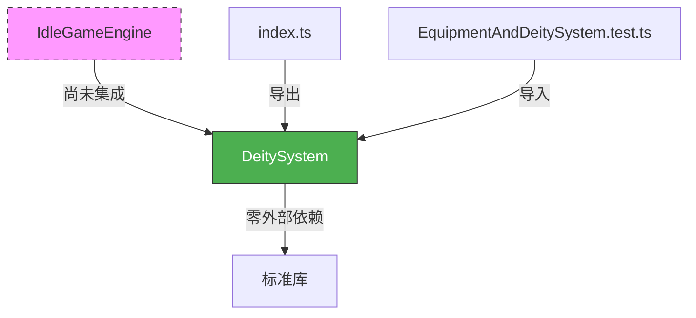
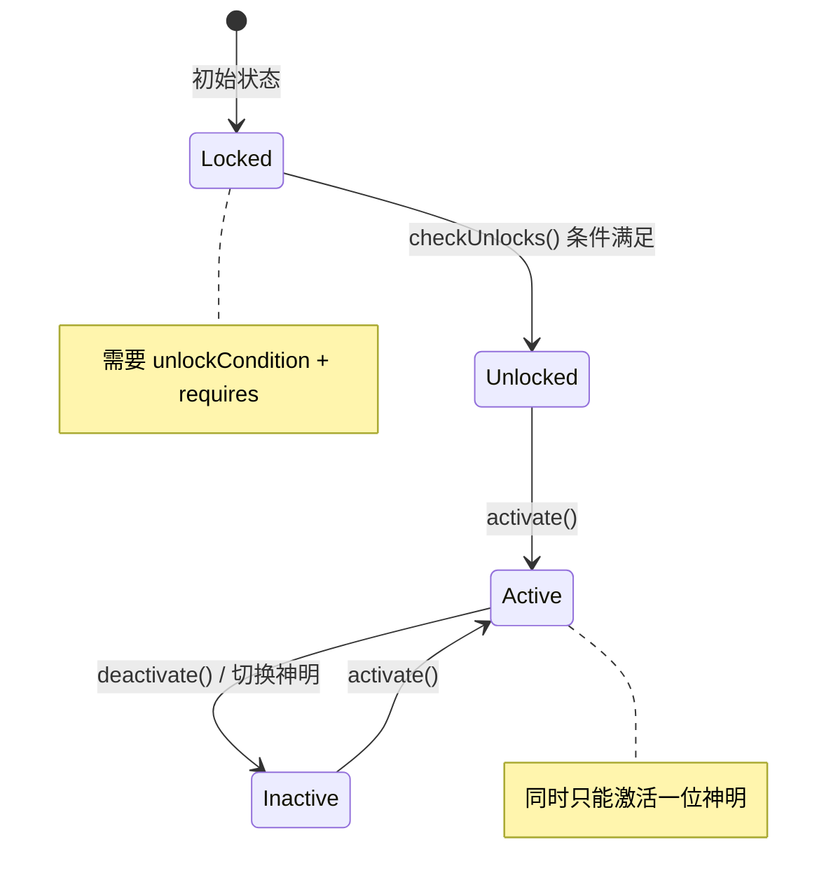
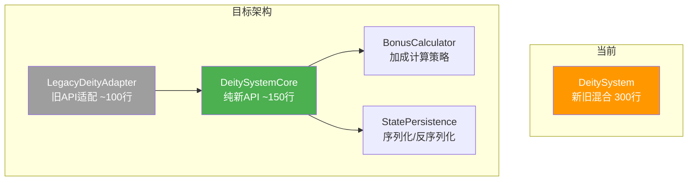

# DeitySystem 神明/信仰子系统 — 架构审查报告

> **审查人**: 系统架构师  
> **审查日期**: 2025-07-09  
> **源码路径**: `src/engines/idle/modules/DeitySystem.ts`  
> **测试路径**: `src/engines/idle/__tests__/EquipmentAndDeitySystem.test.ts`

---

## 一、概览

### 1.1 代码度量

| 指标 | 数值 |
|------|------|
| 源码行数 | 300 行 |
| 类方法数 | 28（含 private） |
| 公共方法数 | 18 |
| 已废弃方法数 | 8 |
| 接口/类型定义 | 3（`DeityDef`, `DeityState`, `DeityEvent`） |
| 测试用例数 | ~30（DeitySystem 部分） |
| 测试文件总行数 | 740（含 EquipmentSystem） |

### 1.2 依赖关系



**关键发现**: `IdleGameEngine.ts` 尚未引用 DeitySystem，该模块处于**未集成**状态，仅在 `modules/index.ts` 中导出。

### 1.3 架构定位

DeitySystem 是放置游戏引擎中负责神明信仰系统的独立模块，职责包括：
- 神明解锁（条件检查 + 前置依赖）
- 神明激活/停用（互斥逻辑）
- 好感度/祝福系统（资源消耗 + 等级提升）
- 加成计算（好感倍率叠加）
- 事件通知与状态持久化

---

## 二、接口分析

### 2.1 DeityDef — 神明定义接口

```typescript
export interface DeityDef {
  id: string;              // ✅ 唯一标识
  name: string;            // ✅ 显示名称
  description: string;     // ✅ 描述文本
  icon: string;            // ✅ 图标标识
  domain: string;          // ✅ 神域分类
  bonus: Record<string, number>;  // ✅ 新格式：多属性加成映射
  requires?: string;               // ✅ 前置神明
  exclusiveWith?: string[];        // ✅ 新格式互斥
  unlockCondition?: Record<string, number>;  // ✅ 解锁条件
  maxFavorLevel: number;           // ✅ 好感等级上限
  favorPerLevel: number;           // ✅ 每级所需好感值
  // ... 8 个已废弃字段
}
```

**问题**: 接口同时承载了新旧两套 API 的字段（共 20 个属性），其中 8 个标记为 `@deprecated`。这导致：

| 问题 | 影响 |
|------|------|
| 接口臃肿 | 新使用者难以区分哪些字段是必须的 |
| 语义混淆 | `bonus` vs `bonusValue + bonusTarget` 两套加成体系 |
| 互斥双写 | `exclusiveWith` vs `mutuallyExclusive` 功能完全相同 |
| 等级双写 | `maxFavorLevel` vs `maxBlessingLevel` 功能相同 |

### 2.2 DeityState — 持久化接口

```typescript
export interface DeityState {
  unlocked: string[];           // 已解锁神明 ID 列表
  activeDeity: string | null;   // 当前激活神明
  favor: Record<string, number>; // 好感度映射
}
```

**评价**: 简洁清晰，字段精炼。但缺少版本号字段，不利于后续迁移。

### 2.3 DeityEvent — 事件接口

```typescript
export interface DeityEvent {
  type: 'deity_unlocked' | 'deity_activated' | 'deity_deactivated'
    | 'favor_increased' | 'favor_maxed' | 'blessing_performed' | 'blessing_maxed';
  deityId?: string;
}
```

**评价**: 事件类型覆盖完整，但 `deityId` 为可选字段——`deity_deactivated` 场景下 `deityId` 应为必填。

---

## 三、核心逻辑分析

### 3.1 神明选择与激活



**激活流程** (`activate` 方法):
1. 验证定义存在 + 已解锁
2. 幂等检查（已激活同一神明 → 返回 true）
3. 互斥检查：
   - **旧格式**：互斥时直接拒绝，返回 false
   - **新格式**：自动停用旧神明，再激活新神明
4. 触发 `deity_deactivated` → `deity_activated` 事件

**问题**: 新旧格式的互斥行为不一致。旧格式"拒绝切换"，新格式"自动切换"，这会导致同一调用在不同数据配置下行为完全不同。

### 3.2 好感度系统

```mermaid
graph LR
    A[addFavor<br/>被动积累] --> B[favor 累加]
    C[bless<br/>主动祭祀] --> B
    B --> D{favor / favorPerLevel}
    D --> E[favorLevel]
    E --> F[加成倍率: bonus × (1 + level × 0.1)]
```

**双轨制好感系统**:
- **新 API**: `addFavor(amount)` — 纯数值累加，无资源消耗
- **旧 API**: `bless(id, resources)` — 消耗资源，按 `costScaling` 指数增长

两套系统的**等级上限计算方式一致**（`maxFavorLevel` / `maxBlessingLevel`），但**升级路径完全不同**，且状态共享同一 `favor` 字段，存在冲突风险。

### 3.3 祭祀系统（bless — 旧 API）

祭祀流程：
1. 检查神明已解锁
2. 检查当前等级 < 最大等级
3. 按 `costScaling^currentLevel` 计算消耗
4. **直接修改传入的 `res` 对象**（`res[k] -= v`）
5. 累加好感值（每次固定 +`favorPerLevel`）

### 3.4 祝福效果计算

**新 API** (`getBonus()`):
```
最终加成 = bonus × (1 + favorLevel × 0.1)
```
支持多属性加成，返回 `Record<string, number>`。

**旧 API** (`getBonusById(id)`):
```
旧格式: bonusValue + bonusPerLevel × favorLevel
新格式: bonusValue × (1 + favorLevel × 0.1)
```
单属性，返回 `{ target, type, value }`。

**问题**: 两套加成公式不一致。新 API 用乘法倍率（`× (1 + level × 0.1)`），旧 API 的旧格式用加法（`+ bonusPerLevel × level`），导致同一神明在不同 API 下计算结果不同。

---

## 四、问题清单

### 🔴 严重问题

#### 4.1 bless() 直接修改传入的资源对象（副作用泄漏）

**位置**: 第 175-177 行  
**代码**:
```typescript
for (const [k, v] of Object.entries(c)) res[k] -= v;
```

**问题**: `bless()` 方法直接修改了调用方传入的 `res` 对象，违反了最小副作用原则。如果调用方在 bless 失败后继续使用 `res`，可能得到已被扣减的不一致状态。

**修复建议**:
```typescript
// 方案 A：返回消耗量，由调用方扣减
bless(id: string, available: Record<string, number>): 
  { success: boolean; newLevel: number; consumed: Record<string, number> }

// 方案 B：内部拷贝，不修改原对象
const cost = this.getNextBlessingCost(id);
const consumed: Record<string, number> = {};
for (const [k, v] of Object.entries(cost)) {
  if ((res[k] ?? 0) < v) return { success: false, newLevel: cl };
  consumed[k] = v;
}
// 返回 consumed 让调用方决定
```

---

#### 4.2 新旧 API 的互斥行为不一致

**位置**: 第 88-95 行 (`activate` 方法)  
**代码**:
```typescript
if (isExcl && (this.isOld(def) || (cur && this.isOld(cur)))) return false;
// 旧格式: 拒绝切换
// 新格式: 隐式执行下方的自动停用+激活
```

**问题**: 同一个 `activate()` 方法，根据神明定义格式不同，在互斥场景下可能返回 `false`（拒绝）或 `true`（自动切换），调用方无法预测行为。

**修复建议**: 统一行为策略。建议统一为"自动停用旧神明 + 激活新神明"，通过事件通知调用方：
```typescript
activate(id: string): boolean {
  // ...验证...
  if (this.activeDeity !== null && this.activeDeity !== id) {
    const old = this.activeDeity;
    this.activeDeity = null;
    this.emit({ type: 'deity_deactivated', deityId: old });
  }
  this.activeDeity = id;
  this.emit({ type: 'deity_activated', deityId: id });
  return true;
}
```

---

#### 4.3 getBonus() 返回类型联合体，破坏类型安全

**位置**: 第 104-105 行  
**代码**:
```typescript
getBonus(id?: string): Record<string, number> | { target: string; type: string; value: number }
```

**问题**: 同一个方法根据参数有无返回完全不同形状的对象。调用方必须做类型窄化，否则容易出错。

**修复建议**: 拆分为两个方法，旧 API 标记 `@deprecated`：
```typescript
getActiveBonusMap(): Record<string, number>  // 新 API
getLegacyBonusById(id: string): { target: string; type: string; value: number }  // @deprecated
```

---

### 🟡 中等问题

#### 4.4 DeityDef 接口字段冗余（新旧双写）

**位置**: 第 7-38 行  
**问题**: 8 个 `@deprecated` 字段与对应新字段共存，接口膨胀到 20 个属性。新使用者不清楚哪些字段必须填写。

**修复建议**: 
- 短期：在 JSDoc 中明确标注"新项目必须使用"的字段
- 长期：将旧字段拆到 `LegacyDeityDef extends DeityDef`，核心接口只保留新字段

---

#### 4.5 事件监听器使用数组 + splice，性能与内存隐患

**位置**: 第 63 行，第 228-229 行  
**代码**:
```typescript
private readonly listeners: Array<(e: DeityEvent) => void> = [];
// 取消订阅：
const i = this.listeners.indexOf(cb); if (i !== -1) this.listeners.splice(i, 1);
```

**问题**: `indexOf` + `splice` 在高频订阅/取消场景下为 O(n) 复杂度。放置游戏通常在 tick 循环中触发事件，如果监听器数量多，会有性能影响。

**修复建议**: 使用 `Set` 替代数组：
```typescript
private readonly listeners = new Set<(e: DeityEvent) => void>();
onEvent(cb: (e: DeityEvent) => void): () => void {
  this.listeners.add(cb);
  return () => this.listeners.delete(cb);
}
```

---

#### 4.6 emit() 静默吞掉异常

**位置**: 第 224 行  
**代码**:
```typescript
for (const fn of this.listeners) { try { fn(ev); } catch { /* 静默 */ } }
```

**问题**: 监听器中的异常被完全吞掉，调试时无法发现问题。在游戏系统中，一个监听器的错误可能导致后续逻辑不执行但无任何提示。

**修复建议**: 至少在开发模式下输出警告：
```typescript
private emit(ev: DeityEvent): void {
  for (const fn of this.listeners) {
    try { fn(ev); }
    catch (err) {
      if (process.env.NODE_ENV !== 'production') console.warn('[DeitySystem] listener error:', err);
    }
  }
}
```

---

#### 4.7 checkUnlocks() 的遍历顺序依赖 Map 插入顺序

**位置**: 第 134-145 行  
**问题**: `checkUnlocks` 遍历 `this.defs`（Map），解锁顺序依赖构造时传入的数组顺序。如果 `requires` 链中前置神明排在后面，同一次调用可能无法解锁依赖链上的所有神明。

**示例**: 假设定义顺序为 `[athena, mars]`（athena requires mars），第一次调用 `checkUnlocks` 时：
1. 遍历到 athena → requires mars 未解锁 → 跳过
2. 遍历到 mars → 条件满足 → 解锁
3. athena 未被解锁（已跳过），需要第二次调用

**修复建议**: 多轮遍历直到无新解锁，或拓扑排序后遍历：
```typescript
checkUnlocks(stats: Record<string, number>): string[] {
  const res: string[] = [];
  let changed = true;
  while (changed) {
    changed = false;
    for (const [id, def] of this.defs) {
      if (this.unlocked.has(id)) continue;
      if (!this.checkCondition(def, stats)) continue;
      this.unlocked.add(id); res.push(id); changed = true;
      this.favor[id] ??= 0;
      this.emit({ type: 'deity_unlocked', deityId: id });
    }
  }
  return res;
}
```

---

#### 4.8 loadState() 不验证神明 ID 是否存在于定义中

**位置**: 第 155-162 行  
**问题**: `loadState` 接受任意字符串作为 unlocked/favor 的 key，不验证对应的神明定义是否存在。加载脏数据或版本不匹配的存档时，可能导致幽灵状态。

**修复建议**: 加载时过滤无效 ID：
```typescript
for (const id of data.unlocked) {
  if (typeof id === 'string' && this.defs.has(id)) this.unlocked.add(id);
}
```

---

#### 4.9 totalBlessings 不参与 saveState/loadState

**位置**: 第 149-153 行（saveState），第 155-162 行（loadState）  
**问题**: `saveState()` 返回的 `DeityState` 接口不包含 `totalBlessings`，但 `serialize()` 包含。`loadState()` 也不恢复 `totalBlessings`，导致通过新 API 持久化时会丢失此数据。

**修复建议**: 在 `DeityState` 中增加可选的 `totalBlessings` 字段，或确认该字段是否仍然需要。

---

### 🟢 轻微问题

#### 4.10 DeityEvent.deityId 应为必填

**位置**: 第 42-45 行  
**问题**: 所有事件类型都关联一个神明，但 `deityId` 是可选的。建议改为必填。

---

#### 4.11 缺少 getFavor() 方法查看原始好感值

**位置**: 全局  
**问题**: 有 `getFavorLevel()` 查看等级，但无法查看原始好感值（如 350/500）。UI 展示进度条时需要此数据。

**修复建议**: 增加 `getFavor(id: string): { current: number; max: number }` 方法。

---

#### 4.12 bMap() 辅助方法名不达意

**位置**: 第 73 行  
**问题**: `bMap` 命名过于简略，难以理解其含义（bonus Map）。建议重命名为 `resolveBonusMap`。

---

#### 4.13 缺少 domain 的聚合查询能力

**位置**: 全局  
**问题**: `DeityDef` 有 `domain` 字段但无按 domain 查询的方法（如 `getDeitiesByDomain('war')`）。在神明数量增多时，UI 筛选需要此能力。

---

#### 4.14 构造函数使用单行 for 循环

**位置**: 第 64 行  
**代码**:
```typescript
constructor(defs: Def[]) { for (const d of defs) this.defs.set(d.id, d); }
```

**问题**: 压缩到一行降低了可读性，且缺少对重复 ID 的校验。

---

## 五、测试覆盖分析

### 5.1 覆盖矩阵

| 功能模块 | 测试覆盖 | 评价 |
|----------|---------|------|
| unlock（旧 API） | ✅ 7 个用例 | 覆盖充分 |
| checkUnlocks（新 API） | ❌ 无测试 | **缺失** |
| activate / deactivate | ✅ 7 个用例 | 覆盖充分 |
| bless（旧 API） | ✅ 6 个用例 | 覆盖充分 |
| addFavor（新 API） | ❌ 无测试 | **缺失** |
| getBonus（新 API） | ❌ 无测试 | **缺失** |
| getBonus（旧 API） | ✅ 2 个用例 | 基本覆盖 |
| getActiveBonus | ✅ 2 个用例 | 基本覆盖 |
| getNextBlessingCost | ✅ 3 个用例 | 覆盖充分 |
| serialize / deserialize | ✅ 2 个用例 | 覆盖充分 |
| saveState / loadState | ❌ 无测试 | **缺失** |
| 事件系统 | ✅ 2 个用例 | 基本覆盖 |
| reset | ✅ 1 个用例 | 基本覆盖 |

### 5.2 关键测试缺口

1. **新 API 完全未测试**: `checkUnlocks`、`addFavor`、`getBonus()`（无参版本）、`saveState`、`loadState` 均无测试用例
2. **新旧 API 交互未测试**: 用 `bless` 升级后用 `addFavor` 继续累加，或反过来
3. **边界条件未测试**: 空定义数组构造、极大好感值溢出、并发 activate/deactivate
4. **互斥切换行为未测试**: 新格式神明的自动切换（旧格式有测试，新格式没有）

---

## 六、改进建议

### 6.1 短期改进（1-2 天）

| 优先级 | 改进项 | 预估工时 |
|--------|--------|---------|
| P0 | 补充新 API 的单元测试（checkUnlocks, addFavor, getBonus, saveState, loadState） | 4h |
| P0 | 修复 `bless()` 的资源对象副作用（返回 consumed 而非直接修改） | 1h |
| P1 | 统一互斥激活行为（全部采用自动切换策略） | 2h |
| P1 | `loadState()` 增加 ID 有效性校验 | 0.5h |
| P2 | `listeners` 改用 `Set` | 0.5h |

### 6.2 长期改进（1-2 周）

| 优先级 | 改进项 | 说明 |
|--------|--------|------|
| P1 | **新旧 API 分层清理** | 将旧 API 方法提取到 `LegacyDeitySystem` 基类或 mixin，核心类只保留新 API。设置 3 个月的废弃过渡期 |
| P1 | **DeityDef 接口拆分** | 核心接口 `DeityDef`（新字段）+ `LegacyDeityDef`（扩展旧字段），通过泛型约束 |
| P2 | **集成到 IdleGameEngine** | 当前模块未接入主引擎，需要设计与其他系统（资源、战斗、装备）的交互接口 |
| P2 | **DeityState 版本化** | 增加 `version` 字段，支持存档迁移策略 |
| P2 | **增加 domain 聚合查询** | 支持按神域筛选、统计等 UI 需求 |
| P3 | **加成公式统一** | 统一为乘法倍率模型，消除新旧公式差异 |

### 6.3 架构演进建议



**核心思路**: 将 DeitySystem 拆分为：
1. **DeitySystemCore** — 纯新 API，无废弃逻辑
2. **LegacyDeityAdapter** — 适配旧接口，内部委托 Core
3. **BonusCalculator** — 可插拔的加成计算策略（乘法/加法/混合）
4. **StatePersistence** — 独立的序列化模块，支持版本迁移

---

## 七、放置游戏适配性评估

### 7.1 离线收益兼容性

| 维度 | 评估 | 说明 |
|------|------|------|
| 离线好感积累 | ⚠️ 需补充 | `addFavor` 支持批量累加，但缺少离线时间→好感值的换算接口 |
| 加成快照 | ✅ 合理 | `getBonus()` 是纯函数，可随时计算当前加成 |
| 状态恢复 | ⚠️ 部分缺失 | `saveState/loadState` 基本可用，但 `totalBlessings` 未持久化 |

### 7.2 数值平衡支持

| 维度 | 评估 | 说明 |
|------|------|------|
| 好感曲线 | ✅ 线性 | 每级固定 `favorPerLevel`，适合放置游戏的稳定节奏 |
| 祭祀成本 | ✅ 指数增长 | `costScaling^level` 提供了良好的数值膨胀控制 |
| 加成缩放 | ⚠️ 线性偏弱 | `1 + level × 0.1` 为线性增长，后期可能缺乏感知度。建议考虑对数或分段函数 |

### 7.3 扩展性

| 维度 | 评估 | 说明 |
|------|------|------|
| 新神明添加 | ✅ 数据驱动 | 只需新增 `DeityDef`，无需改代码 |
| 新加成类型 | ⚠️ 受限 | `bonus: Record<string, number>` 只支持数值加成，无法表达条件触发型效果 |
| 多神明协同 | ❌ 不支持 | 当前严格单神明激活，无法扩展为"主神+辅神"等组合玩法 |

---

## 八、综合评分

| 评分维度 | 分数 (1-5) | 说明 |
|----------|:----------:|------|
| **接口设计** | 2.5 | 新旧 API 混杂导致接口臃肿；返回类型联合体破坏类型安全；核心字段设计合理但被废弃字段淹没 |
| **数据模型** | 3.5 | DeityState 简洁有效；DeityDef 冗余但功能完整；缺少版本化支持 |
| **核心逻辑** | 3.0 | 功能实现正确但新旧双轨制增加理解成本；互斥行为不一致；checkUnlocks 有顺序依赖 bug |
| **可复用性** | 3.5 | 零外部依赖，泛型支持扩展；但旧 API 耦合度高，难以在其他项目中直接复用 |
| **性能** | 3.5 | 整体轻量；listeners 用数组可优化；无热路径性能瓶颈 |
| **测试覆盖** | 2.0 | 旧 API 覆盖充分，新 API 完全缺失；关键方法（checkUnlocks, addFavor, saveState）零测试 |
| **放置游戏适配** | 3.0 | 基本满足放置游戏需求；离线收益接口缺失；加成曲线偏简单；不支持多神明组合 |

### 总分：21 / 35

```
评分图示:
接口设计    ████████░░░░░░░░░░░░  2.5/5
数据模型    ██████████████░░░░░░  3.5/5
核心逻辑    ████████████░░░░░░░░  3.0/5
可复用性    ██████████████░░░░░░  3.5/5
性能        ██████████████░░░░░░  3.5/5
测试覆盖    ████████░░░░░░░░░░░░  2.0/5
放置游戏适配 ████████████░░░░░░░░  3.0/5
─────────────────────────────────────
总分        21.0 / 35 (60%)
```

---

## 九、总结

DeitySystem 的**核心设计思路是正确的**——数据驱动、零依赖、事件通知、状态持久化。这些是放置游戏子系统的优良实践。

主要风险集中在**新旧 API 共存**带来的技术债务：
1. 接口膨胀（20 个属性，8 个废弃）
2. 行为不一致（互斥切换、加成公式）
3. 测试覆盖偏斜（旧 API 充分，新 API 缺失）

**最紧迫的三件事**：
1. 🔴 补全新 API 的单元测试
2. 🔴 修复 `bless()` 的资源副作用
3. 🟡 制定旧 API 废弃时间表，逐步清理

如果团队能在下一个迭代中完成短期改进项，该模块可以稳定支撑放置游戏的神明信仰玩法。长期来看，拆分新旧 API、接入 IdleGameEngine、增加离线收益和组合玩法支持，将使系统更加健壮。
