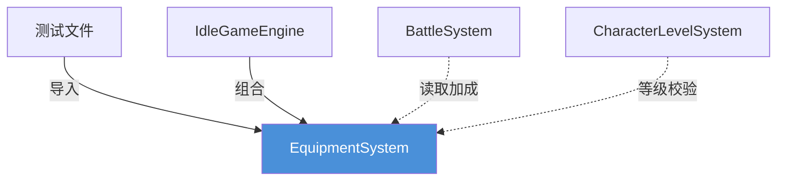
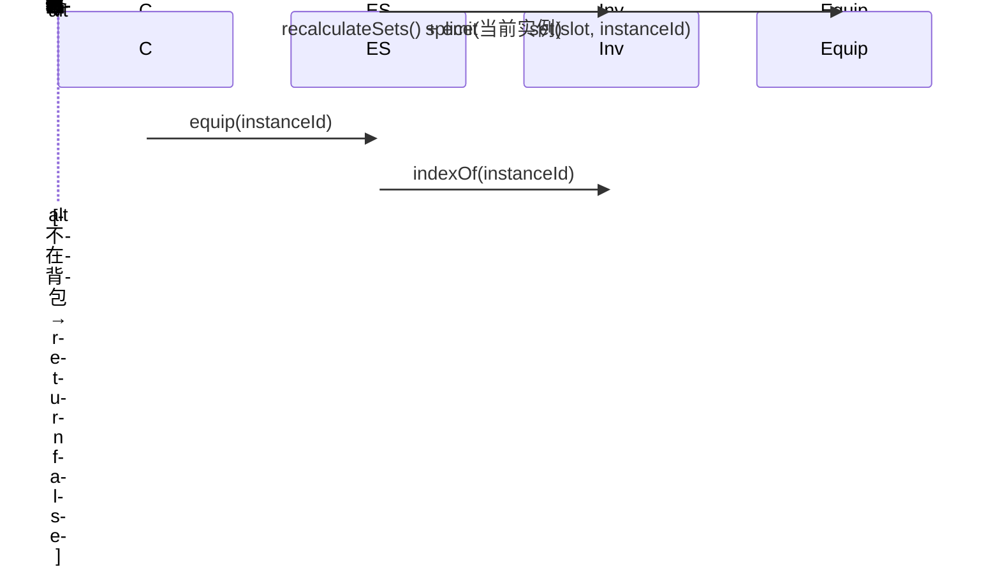
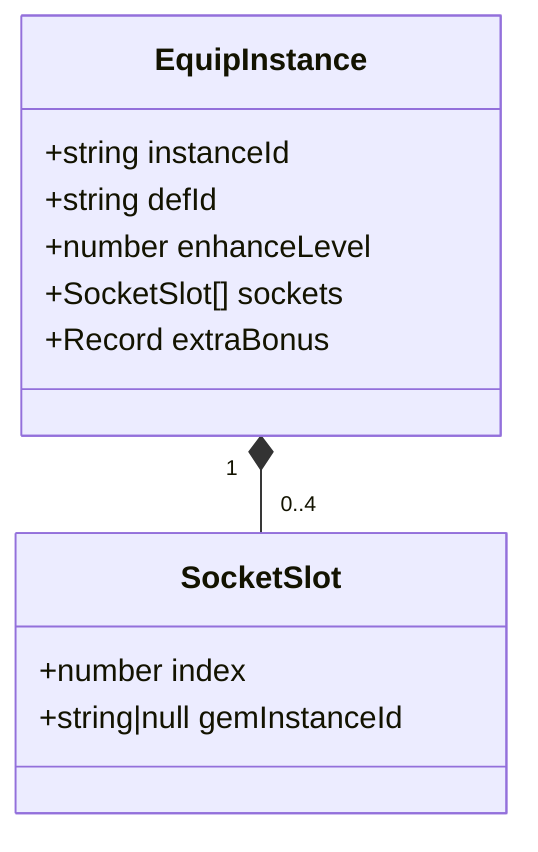

# EquipmentSystem 装备子系统 — 架构审查报告

> **审查日期**: 2025-07-11 | **源码**: `src/engines/idle/modules/EquipmentSystem.ts` (690行)  
> **测试**: `src/engines/idle/__tests__/EquipmentAndDeitySystem.test.ts` (~30个EquipmentSystem用例)

---

## 1. 概览

| 指标 | 数值 | 指标 | 数值 |
|------|------|------|------|
| 源码行数 | 690 | 公开方法 | 11 |
| 私有方法 | 3 | 类型/接口 | 6 |
| 外部依赖 | 0 | 测试用例 | ~30 |

### 依赖关系



### 公开 API

| 方法 | 返回值 | 职责 |
|------|--------|------|
| `constructor(defs)` | — | 注册装备定义 |
| `addToInventory(defId, extraBonus?)` | `EquipInstance` | 创建实例加入背包 |
| `equip(instanceId)` | `boolean` | 穿戴装备 |
| `unequip(slot)` | `EquipInstance \| null` | 卸下装备 |
| `discard(instanceId)` | `boolean` | 丢弃装备 |
| `enhance(instanceId, cost)` | `boolean` | 强化装备 |
| `getBonus()` | `Record<string, number>` | 计算总加成 |
| `getInventory()` / `getEquipped()` | 只读副本 | 查询状态 |
| `serialize()` / `deserialize()` | JSON 对象 | 存档/读档 |
| `onEvent(callback)` | 取消订阅函数 | 事件监听 |

---

## 2. 接口分析

### EquipDef（装备定义）

**优点**: 泛型 `<Def extends EquipDef>` 支持自定义扩展；`bonus: Record<string, number>` 属性映射灵活。  
**不足**: `rarity` 仅为标签无品质系数；`effects` 是字符串数组缺乏结构化；`levelRequired` 定义了但 `equip()` 未校验。

### EquipInstance（装备实例）

**优点**: 轻量级，职责清晰。  
**不足**: 缺少镶嵌孔位/宝石信息（需求要求镶嵌功能）、绑定状态、耐久度。

### EquipSlot（槽位）

固定 8 槽位覆盖常见需求，`accessory1/2` 支持多同类装备。但硬编码不支持动态扩展（翅膀/时装等）。

### EquipEvent（事件）

覆盖核心操作，但 `data: Record<string, unknown>` 缺乏类型安全，且缺少 `set_bonus_deactivated` 事件。

---

## 3. 核心逻辑分析

### 3.1 穿戴/卸下



自动替换逻辑正确，状态一致性好。

### 3.2 品质系统

5 级品质（common→legendary）仅作标签，**未参与任何计算**。无品质系数、无影响强化上限/镶嵌孔数。

### 3.3 强化系统

公式：`强化加成 = 基础加成 × enhanceLevel × 0.1`。线性模型简单易懂，但**无上限、无失败机制、不实际消耗资源**。

### 3.4 镶嵌系统

**完全缺失**。无 Gem/Socket 数据模型和操作方法。

### 3.5 套装效果

有件数统计（≥2件激活），但**套装加成未纳入 `getBonus()` 计算**，套装系统形同虚设。缺少 `set_bonus_deactivated` 事件和套装加成配置表。

### 3.6 序列化

完整保存运行时状态含 `instanceCounter`。但 `deserialize` 大量 `as` 断言无数据校验，无版本迁移机制。

---

## 4. 问题清单

### 🔴 严重问题

| # | 问题 | 位置 | 修复建议 |
|---|------|------|----------|
| S1 | **等级校验缺失** | `equip()` L194 | 增加 `context?: {playerLevel}` 参数，校验 `def.levelRequired` |
| S2 | **套装加成未纳入 getBonus()** | `getBonus()` L297 | 引入 `SetBonusDef` 配置表，按件数阈值叠加加成 |
| S3 | **镶嵌系统完全缺失** | 整体 | 新增 `GemDef`/`SocketSlot` 数据模型，`embedGem()`/`removeGem()` 方法 |
| S4 | **enhance() 不消耗资源** | `enhance()` L345 | 改为 `canEnhance()` 查询或内部管理资源池 |

### 🟡 中等问题

| # | 问题 | 位置 | 修复建议 |
|---|------|------|----------|
| M1 | 品质无实际作用 | `EquipDef.rarity` | 引入 `RARITY_CONFIG` 配置（倍率/强化上限/孔数） |
| M2 | 强化无上限 | `enhance()` | 增加 `MAX_ENHANCE_LEVEL` 或按品质配置上限 |
| M3 | 套装件数变化无事件 | `recalculateSets()` | 增加 `set_bonus_upgraded` 事件 |
| M4 | 事件 data 缺乏类型安全 | `EquipEvent.data` | 使用判别联合类型替代 `Record<string, unknown>` |
| M5 | 背包无容量限制 | `inventoryIds` | 增加 `maxInventorySize` 配置 |
| M6 | deserialize 无数据校验 | `deserialize()` L598 | 增加 `validateEquipState()` 运行时校验 |
| M7 | reset() 归零 counter 有 ID 冲突风险 | `reset()` L568 | 不重置 counter 或使用 UUID |

### 🟢 轻微问题

| # | 问题 | 位置 | 修复建议 |
|---|------|------|----------|
| L1 | `EquipState` 接口已定义未使用 | L52 | 删除或用于 serialize 返回类型 |
| L2 | `getInventory` 返回引用非深拷贝 | L474 | 返回 `DeepReadonly<EquipInstance>` |
| L3 | 事件监听器无上限 | `listeners` | 添加最大数量警告 |
| L4 | 重复遍历 equipped 可提取工具方法 | 多处 | 提取 `forEachEquipped()` 迭代器 |
| L5 | 单调递增 ID 可预测 | L558 | 考虑 UUID |
| L6 | 缺少 `@since` 版本标记 | 全局 | 补全 JSDoc 版本标签 |

---

## 5. 改进建议

### 短期（1-2天）

**1) 补全等级校验** — `equip()` 增加 `context` 参数校验玩家等级（0.5h）

**2) 强化上限与品质配置**（2h）：
```typescript
const RARITY_CONFIG = {
  common:    { maxEnhance: 5,  socketCount: 0, multiplier: 1.0 },
  uncommon:  { maxMaxEnhance: 10, socketCount: 1, multiplier: 1.2 },
  rare:      { maxEnhance: 15, socketCount: 2, multiplier: 1.5 },
  epic:      { maxEnhance: 20, socketCount: 3, multiplier: 2.0 },
  legendary: { maxEnhance: 25, socketCount: 4, multiplier: 3.0 },
};
```

**3) 套装加成纳入 getBonus()**（2h）— 引入 `SetBonusDef` 配置，按件数阈值叠加

**4) 事件类型安全**（2h）— 判别联合替代宽松 data

### 长期（1-2周）

**5) 镶嵌系统**（1d）：


**6) 装备定义动态注册** — `registerDef()`/`unregisterDef()` 支持热更新

**7) 存档版本迁移** — `_version` 字段 + 迁移链

**8) 提取公共迭代器** — `forEachEquipped(callback)` 消除重复代码

---

## 6. 放置游戏适配评估

| 维度 | 评估 | 说明 |
|------|------|------|
| 离线收益兼容 | ✅ | `getBonus()` 纯计算，无时间依赖 |
| 序列化完整 | ✅ | 支持完整存档/读档 |
| 数值膨胀控制 | ❌ | 无强化上限、无属性软上限、无品质系数 |
| 自动穿戴 | ❌ | 缺少"一键穿戴最优"功能 |
| 装备比较 | ❌ | 无法对比两件装备属性差异 |
| 批量操作 | ❌ | 无批量丢弃/出售低品质装备 |

---

## 7. 测试覆盖分析

### 已覆盖（核心路径良好）
addToInventory(4) / equip+unequip(7) / getBonus(4) / enhance(5) / discard(4) / 套装(2) / 序列化(2) / reset(1) / 事件(1)

### 未覆盖

| 缺失测试 | 优先级 |
|----------|--------|
| 套装件数增减的完整序列 | 🟡 |
| deserialize 损坏/畸形数据 | 🟡 |
| 连续 equip→unequip→equip 状态一致性 | 🟡 |
| instanceCounter 持久化后不冲突 | 🟡 |
| 重复 discard 同一实例 | 🟢 |
| 空字符串 instanceId 边界值 | 🟢 |

---

## 8. 综合评分

| 维度 | 分数(1-5) | 评价 |
|------|:---------:|------|
| 接口设计 | **4.0** | 泛型优秀，事件 data 缺类型安全 |
| 数据模型 | **3.5** | 核心合理，缺镶嵌/品质系数 |
| 核心逻辑 | **3.5** | 穿戴正确，等级校验缺失、套装半成品 |
| 可复用性 | **4.5** | 零依赖+泛型，高度可复用 |
| 性能 | **4.0** | O(n) 在放置游戏可接受 |
| 测试覆盖 | **3.5** | 核心路径良好，缺边界/深度测试 |
| 放置游戏适配 | **3.0** | 缺自动穿戴/比较/批量/数值控制 |
| **总计** | **26.0/35** | **良好，需补全关键功能** |

---

## 9. 总结

### 优点
1. **零依赖纯 TypeScript** — 可在任何 JS 运行时使用
2. **泛型架构** — 支持游戏自定义扩展
3. **事件驱动** — 内置轻量事件系统
4. **序列化完整** — 存档/读档覆盖全面
5. **注释详尽** — JSDoc + 设计原则说明

### 关键风险
1. 等级校验缺失 → 游戏平衡性破坏
2. 套装系统半成品 → 有统计无实际效果
3. 镶嵌系统缺失 → 与需求不匹配
4. 强化无上限 → 长期数值失控

### 优先行动项

| 优先级 | 行动 | 工时 |
|--------|------|------|
| P0 | 补全 `equip()` 等级校验 | 0.5h |
| P0 | 套装加成纳入 `getBonus()` | 2h |
| P1 | 实现镶嵌系统 | 1d |
| P1 | 强化上限 + 品质配置 | 2h |
| P2 | 事件类型安全改造 | 2h |
| P2 | 补全测试用例 | 3h |
| P3 | 自动穿戴/装备比较 | 4h |
| P3 | 存档版本迁移 | 3h |

> **结论**: 基础架构扎实、代码质量良好，但放置游戏核心功能存在明显缺口。建议按优先级逐步补全，预计 **3 人日**。
