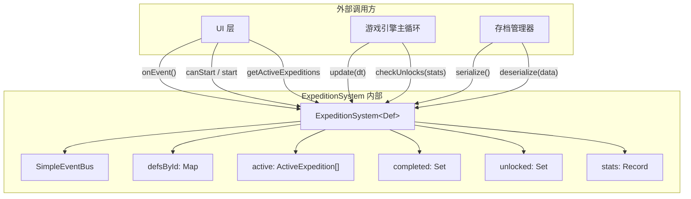
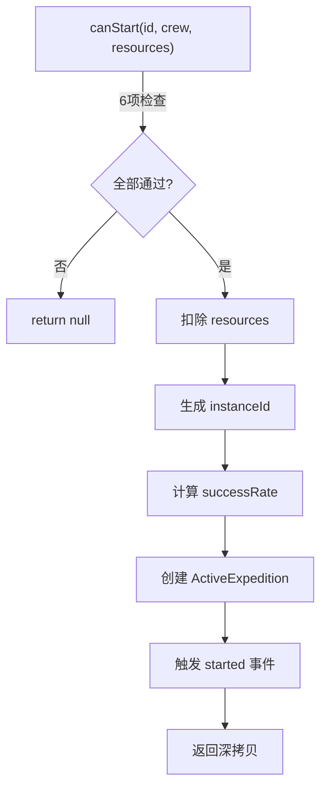
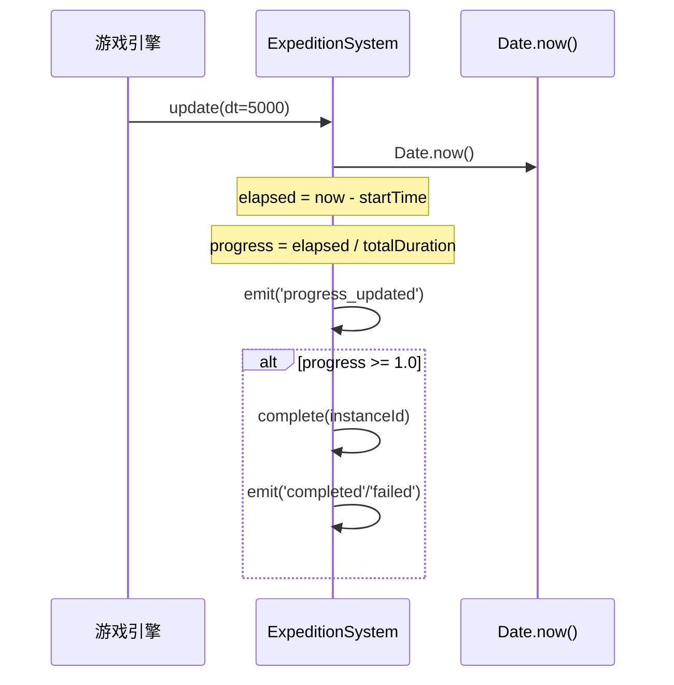
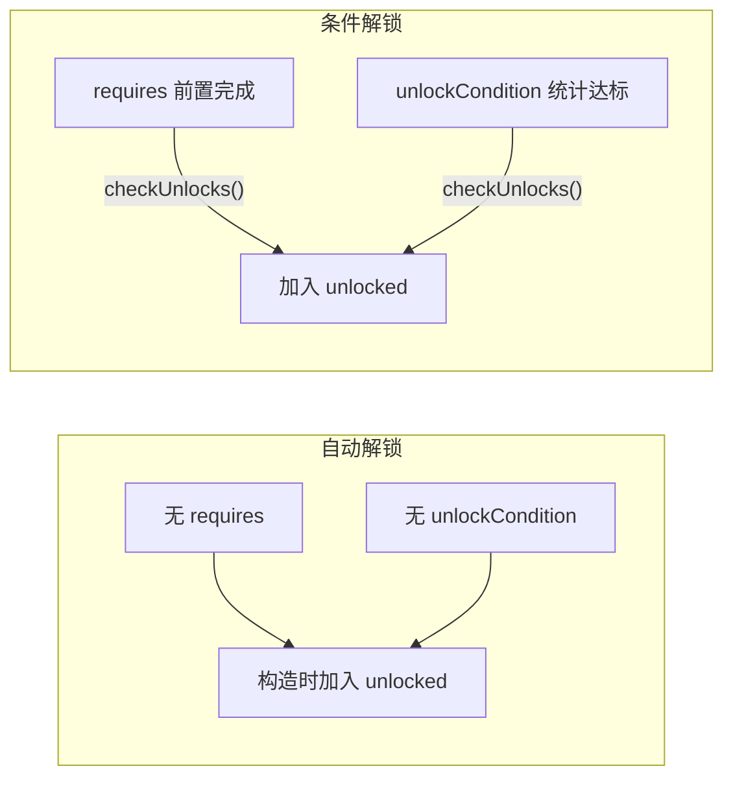
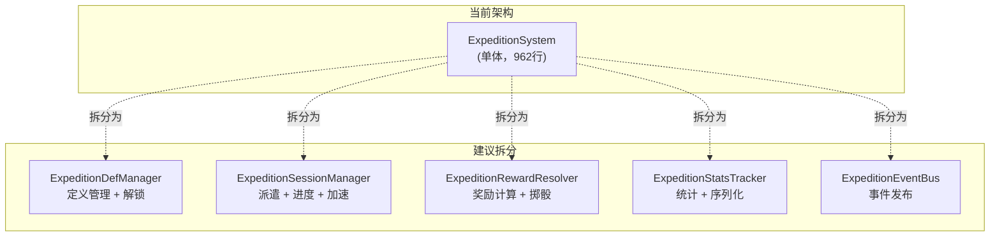

# ExpeditionSystem 远征子系统 — 架构审查报告

> **审查人**: 系统架构师  
> **审查日期**: 2025-07-09  
> **源码路径**: `src/engines/idle/modules/ExpeditionSystem.ts`  
> **测试路径**: `src/engines/idle/__tests__/ExpeditionSystem.test.ts`

---

## 一、概览

### 1.1 代码度量

| 指标 | 数值 |
|------|------|
| 源码行数 | 962 行 |
| 测试行数 | 725 行 |
| 测试/源码比 | 0.75 : 1 |
| 公共方法数 | 14 |
| 私有方法数 | 4 |
| 接口/类型数 | 5（`ExpeditionDef`, `ActiveExpedition`, `ExpeditionStats`, `ExpeditionState`, `ExpeditionEvent`） |
| 内部类 | 1（`SimpleEventBus<T>`） |
| 泛型参数 | 1（`Def extends ExpeditionDef`） |

### 1.2 依赖关系



**关键特征**：零外部依赖，纯 TypeScript 实现，泛型设计支持游戏自定义扩展。

### 1.3 模块定位

ExpeditionSystem 是放置游戏引擎中 20 个核心模块之一（与 `BuildingSystem`、`BattleSystem`、`CraftingSystem` 等并列），负责管理远征的完整生命周期：定义 → 解锁 → 派遣 → 进度 → 结算 → 统计。

---

## 二、接口分析

### 2.1 公共 API 总览

| 方法 | 职责 | 返回值 | 副作用 |
|------|------|--------|--------|
| `constructor(defs)` | 初始化系统，自动解锁 | — | 写入 unlocked |
| `isUnlocked(id)` | 查询解锁状态 | `boolean` | 无 |
| `canStart(id, crew, resources)` | 综合前置检查 | `boolean` | 无 |
| `start(id, crew, resources)` | 发起远征 | `ActiveExpedition \| null` | 扣资源、写 active、触发事件 |
| `update(dt)` | 推进进度，自动完成 | `void` | 写 progress、触发事件 |
| `complete(instanceId)` | 手动结算 | `{success, rewards} \| null` | 写 completed/stats、触发事件 |
| `speedUp(instanceId, ms)` | 加速远征 | `void` | 写 endTime |
| `checkUnlocks(stats)` | 批量检查解锁 | `string[]` | 写 unlocked、触发事件 |
| `getActiveExpeditions()` | 查询活跃远征 | `readonly ActiveExpedition[]` | 无（深拷贝） |
| `getStats(id)` | 查询统计 | `ExpeditionStats \| null` | 无（深拷贝） |
| `getDef(id)` | 查询单个定义 | `Def \| undefined` | 无 |
| `getAllDefs()` | 查询全部定义 | `Def[]` | 无（浅拷贝） |
| `serialize()` | 序列化状态 | `Record<string, unknown>` | 无 |
| `deserialize(data)` | 反序列化恢复 | `void` | 全量覆盖内部状态 |
| `reset()` | 重置系统 | `void` | 清空状态、重新自动解锁 |
| `onEvent(callback)` | 注册事件监听 | `() => void`（取消函数） | 注册监听器 |

### 2.2 接口设计评价

**✅ 优点**：

1. **查询与命令分离清晰** — `canStart` 纯查询不修改状态，`start` 执行实际操作，调用方可先检查后执行
2. **防御性拷贝一致** — `getActiveExpeditions()`、`getStats()` 均返回深拷贝，防止外部篡改内部状态
3. **事件驱动解耦** — 通过 `SimpleEventBus` 发布事件，UI 层无需轮询
4. **泛型扩展点** — `<Def extends ExpeditionDef>` 允许游戏自定义字段（测试已验证）
5. **序列化完备** — Set ↔ Array 自动转换，反序列化有数据校验

**⚠️ 待改进**：

1. `start()` 直接修改传入的 `resources` 参数（副作用隐式），违反最小惊讶原则
2. 缺少批量查询接口（如 `getActiveByDefId(id)`），当活跃远征较多时遍历效率低
3. `update(dt)` 中 `dt` 参数语义模糊 — 实际进度依赖 `Date.now()` 而非 `dt`
4. `complete()` 是 public 方法但无保护，外部可直接跳过进度阶段强制完成

---

## 三、核心逻辑分析

### 3.1 远征派遣流程



**派遣检查链**（`canStart`）：定义存在 → 已解锁 → 非重复完成 → 船员充足 → 资源充足 → 非进行中。六项检查顺序合理，短路求值高效。

**成功率计算**：`baseSuccessRate + max(0, crew.length - crewRequired) × 0.02`，上限 1.0。设计简洁但加成幅度偏低（每多1人仅+2%），在放置游戏中后期可能缺乏感知度。

### 3.2 时间与进度机制



**关键设计决策**：进度基于 `Date.now()` 计算，而非累加 `dt`。这意味着：
- ✅ 进度不会因帧率波动而漂移
- ⚠️ 但 `dt` 参数仅作为"是否更新"的开关（`dt <= 0` 跳过），语义不匹配
- ⚠️ 测试中使用 `vi.useFakeTimers()` + `vi.advanceTimersByTime()` 模拟时间，与 `Date.now()` 耦合

### 3.3 奖励与风险机制

**成功/失败判定**使用确定性哈希掷骰：

```
deterministicRandom(instanceId, defId) → DJB2 hash → [0, 1)
roll < successRate → 成功，否则失败
```

| 判定结果 | 奖励来源 | 统计更新 |
|----------|----------|----------|
| 成功 | `def.rewards` | `successCount++` |
| 失败 | `def.failureRewards`（可选） | `failCount++` |

**评价**：
- ✅ 确定性哈希支持重放和调试，适合放置游戏的离线结算场景
- ⚠️ DJB2 哈希的分布均匀性未经数学验证，`hash % 10000 / 10000` 精度仅万分之一
- ⚠️ 缺少奖励倍率机制（如暴击、连续成功加成），放置游戏后期可能缺乏激励

### 3.4 队伍编成

当前实现仅检查 **船员数量**（`crew.length >= crewRequired`），不涉及：
- 船员个体属性（战力、技能、等级）
- 船员职业/角色搭配
- 船员去重校验（同一角色可被重复编入）

### 3.5 解锁条件



解锁条件支持两种模式，且可叠加（同时需要前置完成和统计达标），设计灵活。

---

## 四、问题清单

### 🔴 严重问题

#### P1: `start()` 隐式修改传入的 `resources` 参数

- **位置**: `start()` 方法，约第 280-283 行
- **现象**: `resources[resourceId] = (resources[resourceId] ?? 0) - amount;` 直接修改传入对象
- **风险**: 调用方可能未预期 resources 被修改，导致资源状态不一致；若调用方在 `canStart` 和 `start` 之间依赖 resources 做其他判断，可能产生竞态
- **修复建议**:
  ```typescript
  // 方案 A: 返回扣除后的资源副本
  start(id, crew, resources): { expedition: ActiveExpedition; cost: Record<string, number> } | null
  
  // 方案 B: 由调用方自行扣除（推荐）
  start(id, crew): ActiveExpedition | null  // 不接收 resources
  // 调用方: if (canStart) { deductResources(); start(); }
  ```

#### P2: 确定性随机数精度不足且分布未验证

- **位置**: `deterministicRandom()` 方法，约第 580-590 行
- **现象**: `Math.abs(hash % 10000) / 10000` 精度仅 10000 级别，且 DJB2 哈希对短字符串的分布均匀性无保证
- **风险**: 在大量远征批量结算时，可能出现结果分布偏向，影响游戏公平性
- **修复建议**:
  ```typescript
  // 使用更高精度的映射
  return (hash >>> 0) / 4294967296; // 32位无符号整数映射到 [0, 1)
  ```

### 🟡 中等问题

#### P3: `update(dt)` 参数语义与实际行为不一致

- **位置**: `update()` 方法，约第 320 行
- **现象**: 方法签名接收 `dt` 参数，但实际进度计算完全依赖 `Date.now()`，`dt` 仅用于判断是否跳过更新
- **风险**: 误导调用方以为 `dt` 影响进度计算；在服务器端或测试环境中 `Date.now()` 可能不可靠
- **修复建议**: 
  ```typescript
  // 方案 A: 移除 dt 参数，改为无参
  update(): void { ... }
  
  // 方案 B: 接受可选的 now 参数，便于测试注入
  update(now?: number): void {
    const currentTime = now ?? Date.now();
    ...
  }
  ```

#### P4: 船员 ID 无去重校验

- **位置**: `start()` 和 `canStart()` 方法
- **现象**: 同一角色 ID 可被重复编入队伍（如 `['hero1', 'hero1']`），且仍能通过 `crewRequired` 检查
- **风险**: 玩家可用 1 个角色满足 N 人需求，破坏游戏平衡
- **修复建议**:
  ```typescript
  // 在 canStart 中增加去重检查
  const uniqueCrew = new Set(crew);
  if (uniqueCrew.size < def.crewRequired) return false;
  ```

#### P5: `complete()` 可被外部直接调用跳过进度

- **位置**: `complete()` 方法，public 访问
- **现象**: 外部代码可在进度未满时直接调用 `complete(instanceId)` 强制完成远征
- **风险**: 可能被滥用跳过等待时间，绕过游戏设计意图
- **修复建议**:
  ```typescript
  // 方案 A: 改为 private，仅由 update() 内部调用
  private complete(instanceId: string): ... { ... }
  
  // 方案 B: 增加 forceComplete 公共方法，但需要特殊权限/消耗
  forceComplete(instanceId: string, token: string): ... { ... }
  ```

#### P6: 事件监听器异常被静默吞掉

- **位置**: `SimpleEventBus.emit()` 方法，约第 140 行
- **现象**: `catch {}` 完全静默，无任何日志或错误上报
- **风险**: 监听器中的 bug 难以被发现和调试，可能导致 UI 不更新等隐蔽问题
- **修复建议**:
  ```typescript
  catch (err) {
    console.warn('[ExpeditionSystem] Event listener error:', err);
  }
  ```

#### P7: `difficulty` 字段定义但未使用

- **位置**: `ExpeditionDef.difficulty`，约第 45 行
- **现象**: `difficulty` 在接口中定义，但在成功率计算、奖励计算等核心逻辑中完全未被引用
- **风险**: 死字段增加认知负担，调用方误以为难度会影响判定
- **修复建议**: 要么在成功率计算中纳入难度系数，要么移除该字段

### 🟢 轻微问题

#### P8: `instanceId` 格式包含 `Date.now()` 不利于测试断言

- **位置**: `start()` 方法，约第 287 行
- **现象**: `exp_${id}_${counter}_${Date.now()}` 中的时间戳使测试难以精确断言
- **修复建议**: 可注入 ID 生成器，或测试中仅验证格式/唯一性

#### P9: `getActiveExpeditions()` 每次调用创建完整深拷贝

- **位置**: `getActiveExpeditions()` 方法
- **现象**: 每次调用都遍历所有活跃远征并创建副本，高频调用时有性能开销
- **修复建议**: 对只读场景提供 `getActiveCount()` 轻量方法，或引入缓存机制

#### P10: `ExpeditionState` 接口中 `Set<string>` 不匹配序列化格式

- **位置**: `ExpeditionState` 接口定义
- **现象**: 接口声明 `completed: Set<string>`，但 `serialize()` 输出为 `string[]`。接口与实际序列化产物不一致，可能误导使用者
- **修复建议**: 区分运行时状态接口和持久化接口

#### P11: `reset()` 不清除事件监听器的设计需文档化

- **位置**: `reset()` 方法
- **现象**: 注释说明了不清除监听器，但未解释原因。这在某些场景下可能导致重复监听
- **修复建议**: 在 JSDoc 中明确说明设计意图和使用场景

---

## 五、改进建议

### 5.1 短期修复（1-2 天）

| 优先级 | 问题编号 | 建议 |
|--------|----------|------|
| 🔴 高 | P1 | 将 `start()` 改为不修改传入 resources，改为返回 `cost` 信息由调用方扣除 |
| 🔴 高 | P2 | 改用 `(hash >>> 0) / 4294967296` 提升随机精度 |
| 🟡 中 | P4 | 在 `canStart` 中增加 `new Set(crew).size` 去重校验 |
| 🟡 中 | P6 | 为事件监听器 catch 块添加 `console.warn` |
| 🟡 中 | P7 | 决定 `difficulty` 的用途：纳入成功率公式或移除 |

### 5.2 中期优化（1 周）

1. **解耦时间依赖** — `update()` 接受可选 `now` 参数，便于测试和服务端渲染
2. **访问控制** — `complete()` 改为 private 或增加完成条件校验
3. **丰富奖励机制** — 支持奖励倍率、暴击、连续成功加成等放置游戏常见机制
4. **船员系统增强** — 支持船员战力、职业、等级对成功率和奖励的影响

### 5.3 长期架构优化



1. **模块拆分** — 当远征类型和规则持续增长时，将单体类拆分为定义管理、会话管理、奖励解析、统计追踪四个职责模块
2. **策略模式引入** — 成功率计算、奖励分配、解锁条件检查抽象为可注入策略，支持不同游戏模式复用
3. **离线结算支持** — 放置游戏核心场景，需要支持批量时间跳跃结算（当前 `update()` 逐帧推进，不适合长时间离线）
4. **船员系统集成** — 与 `CharacterLevelSystem`、`EquipmentSystem` 联动，形成完整的角色 → 编队 → 远征链路

---

## 六、测试覆盖分析

### 6.1 测试分布

| 模块 | 测试用例数 | 覆盖评估 |
|------|-----------|----------|
| 构造与自动解锁 | 5 | ✅ 充分 |
| canStart 前置检查 | 8 | ✅ 充分 |
| start 发起远征 | 11 | ✅ 充分 |
| update 进度推进 | 5 | 🟡 中等 |
| complete 结算 | 5 | ✅ 充分 |
| speedUp 加速 | 4 | ✅ 充分 |
| checkUnlocks 解锁 | 5 | ✅ 充分 |
| getStats 统计 | 2 | 🟡 偏少 |
| serialize/deserialize | 6 | ✅ 充分 |
| reset 重置 | 3 | ✅ 充分 |
| onEvent 事件 | 3 | ✅ 充分 |
| 泛型支持 | 1 | ✅ 验证通过 |
| **合计** | **58** | — |

### 6.2 测试盲区

| 缺失场景 | 风险等级 | 说明 |
|----------|----------|------|
| 并发同一远征 | 🟡 中 | `canStart` 已拒绝但未测试快速连续 start 的竞态 |
| 船员重复编入 | 🔴 高 | P4 对应，未测试 `['hero1', 'hero1']` 场景 |
| 空定义数组构造 | 🟢 低 | `new ExpeditionSystem([])` 行为未验证 |
| 大量活跃远征性能 | 🟡 中 | 无压力测试 |
| 反序列化后 update 连续性 | 🟡 中 | 恢复的远征进度计算是否正确 |
| failureRewards 为 undefined | 🟢 低 | 已隐式覆盖但无显式用例 |
| duration 为 0 的边界 | 🟢 低 | 已有 `totalDuration <= 0` 处理但无专门用例 |

---

## 七、综合评分

| 维度 | 分数 (1-5) | 说明 |
|------|:----------:|------|
| **接口设计** | 4 | API 清晰、职责分明、防御性拷贝到位；扣分项：resources 隐式修改、complete 访问控制不足 |
| **数据模型** | 4 | 类型定义完整、泛型扩展灵活、序列化完备；扣分项：difficulty 死字段、State 接口与序列化不一致 |
| **核心逻辑** | 4 | 派遣/进度/结算流程完整、确定性掷骰可重放；扣分项：随机精度不足、奖励机制单一 |
| **可复用性** | 5 | 零外部依赖、泛型设计、事件解耦，可直接用于 28 款放置游戏 |
| **性能** | 3 | 深拷贝开销、线性查找、无索引优化；活跃远征数量大时有瓶颈 |
| **测试覆盖** | 4 | 58 个用例覆盖主要路径，测试/源码比 0.75；扣分项：船员去重、性能、边界场景缺失 |
| **放置游戏适配** | 3 | 基础远征流程完备；扣分项：缺少离线批量结算、奖励倍率、船员属性联动、加速消耗机制 |
| **总分** | **27 / 35** | **良好** — 核心功能完备，架构清晰，适合作为放置游戏远征系统的基础框架 |

### 评级说明

| 分数区间 | 等级 |
|----------|------|
| 30-35 | 🟢 优秀 — 可直接投产 |
| 25-29 | 🟡 良好 — 需修复严重问题后投产 |
| 20-24 | 🟠 合格 — 需要较多改进 |
| < 20 | 🔴 不合格 — 需要重构 |

**当前评级：🟡 良好** — 修复 P1（resources 隐式修改）和 P2（随机精度）后可达优秀水平。

---

## 附录：架构决策记录（ADR）

### ADR-001: 确定性掷骰 vs Math.random()

- **决策**: 使用 DJB2 哈希生成确定性随机数
- **原因**: 支持离线结算重放、调试可追溯、避免随机种子管理复杂性
- **代价**: 分布均匀性不如 PRNG，精度有限
- **状态**: ✅ 已实施，建议优化精度

### ADR-002: 进度基于 Date.now() vs 累加 dt

- **决策**: 基于 `Date.now()` 绝对时间计算进度
- **原因**: 避免帧率波动导致进度漂移，简化逻辑
- **代价**: 测试需 mock Date.now()，服务端环境可能需适配
- **状态**: ✅ 已实施，建议增加 now 参数注入

### ADR-003: 内置 SimpleEventBus vs 外部事件库

- **决策**: 自实现轻量事件总线
- **原因**: 零依赖原则，功能需求简单
- **代价**: 缺少优先级、一次性监听、错误上报等高级特性
- **状态**: ✅ 已实施，当前规模足够

---

*报告结束。建议优先处理 P1、P2 两个严重问题，预计修复工时 0.5 人天。*
