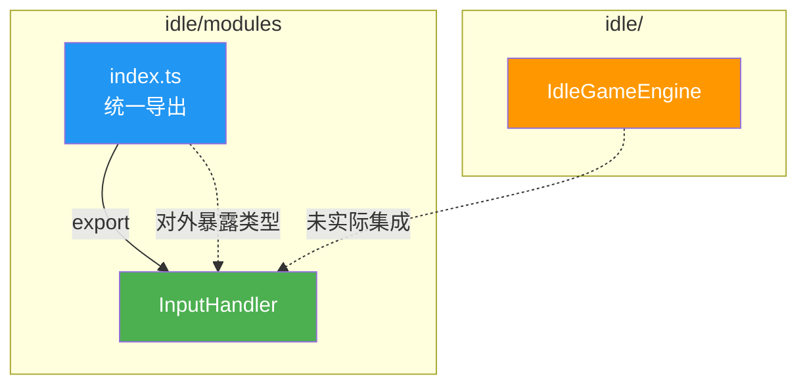
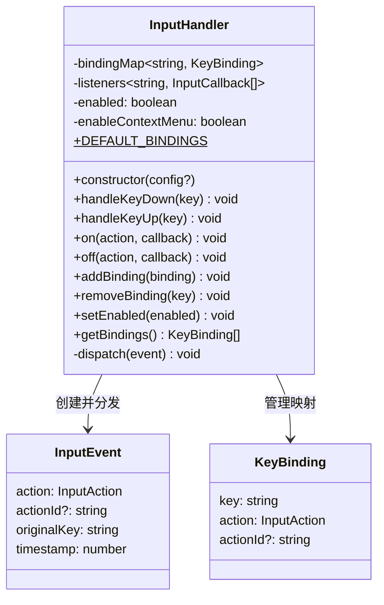
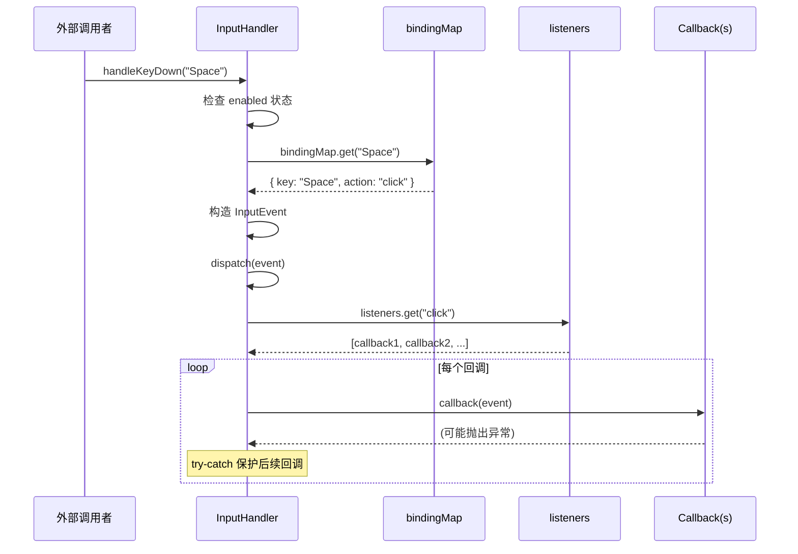
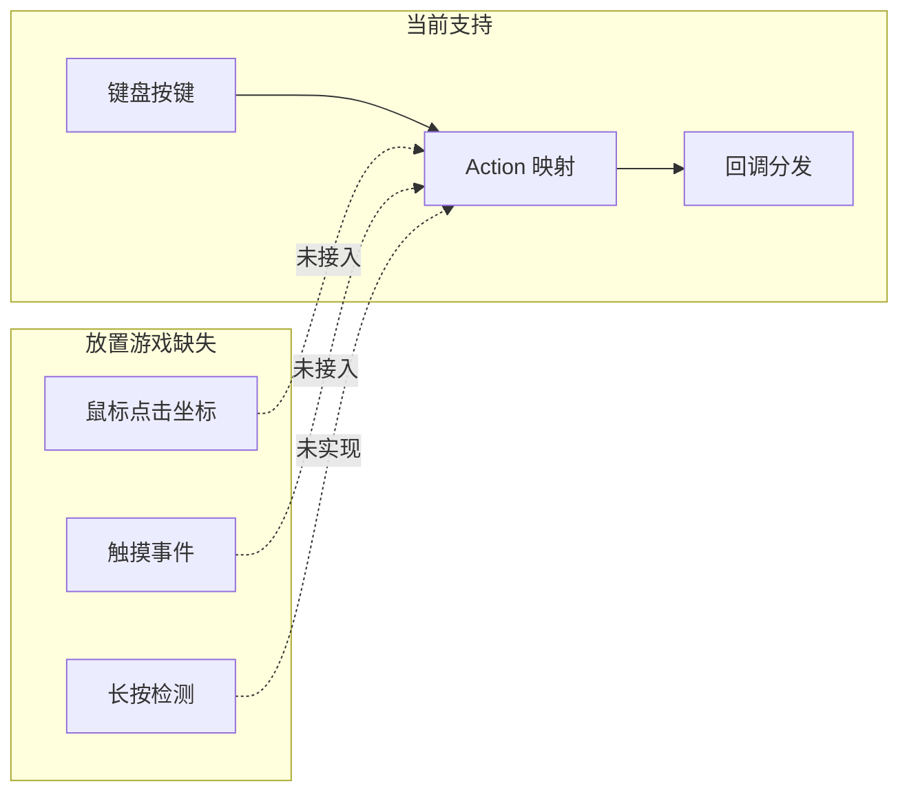
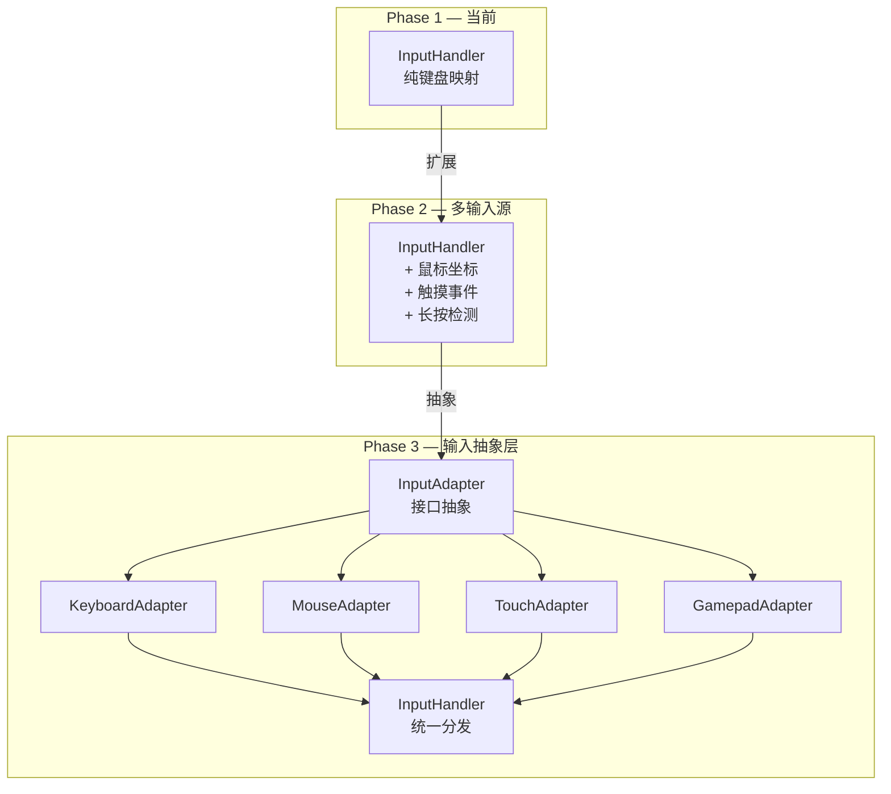

# InputHandler 输入处理子系统 — 架构审查报告

> **审查日期**: 2025-07-11  
> **审查人**: 系统架构师  
> **文件路径**: `src/engines/idle/modules/InputHandler.ts`  
> **优先级**: P0（核心模块）  
> **测试状态**: ❌ 无测试文件

---

## 一、概览

### 1.1 基础指标

| 指标 | 数值 |
|------|------|
| 源码行数 | 344 行 |
| 类型定义 | 5 个（`InputAction`, `KeyBinding`, `InputConfig`, `InputEvent`, `InputCallback`） |
| 公开方法 | 7 个（`constructor`, `handleKeyDown`, `handleKeyUp`, `on`, `off`, `addBinding`, `removeBinding`, `setEnabled`, `getBindings`） |
| 私有方法 | 1 个（`dispatch`） |
| 静态属性 | 1 个（`DEFAULT_BINDINGS`） |
| 外部依赖 | 0（零依赖，纯 TypeScript） |
| 测试文件 | ❌ 不存在 |
| 被引用次数 | 仅 `modules/index.ts` 导出，`IdleGameEngine` 未实际使用 |

### 1.2 依赖关系图



### 1.3 架构定位

InputHandler 在放置游戏引擎中定位为 **输入层适配器**，负责将底层按键事件转换为游戏语义动作（Action），实现输入与业务逻辑的解耦。

---

## 二、接口分析

### 2.1 类型定义评估

```typescript
// ✅ 优点：使用字面量联合类型，IDE 友好
export type InputAction =
  | 'click' | 'select_up' | 'select_down' | 'confirm' | 'cancel'
  | 'tab_left' | 'tab_right' | 'prestige' | 'speed_up' | 'speed_down'
  | 'pause' | 'save' | 'custom';
```

| 类型 | 评价 | 说明 |
|------|------|------|
| `InputAction` | ✅ 良好 | 联合类型明确，涵盖放置游戏核心操作 |
| `KeyBinding` | ✅ 良好 | 结构简洁，`actionId` 可选字段设计合理 |
| `InputConfig` | ⚠️ 偏简 | 仅含 `bindings` 和 `enableContextMenu`，缺少节流/防抖配置 |
| `InputEvent` | ✅ 良好 | 包含时间戳、原始按键、动作类型，信息完整 |
| `InputCallback` | ✅ 良好 | 简洁的函数签名 |

### 2.2 公开 API 列表

| 方法 | 签名 | 职责 | 评价 |
|------|------|------|------|
| `constructor` | `(config?: Partial<InputConfig>)` | 初始化映射表 | ✅ 支持部分配置覆盖 |
| `handleKeyDown` | `(key: string) => void` | 处理按键按下 | ✅ 核心入口 |
| `handleKeyUp` | `(_key: string) => void` | 处理按键释放 | ⚠️ 空实现 |
| `on` | `(action, callback) => void` | 注册回调 | ✅ 防重复注册 |
| `off` | `(action, callback) => void` | 移除回调 | ✅ 自动清理空数组 |
| `addBinding` | `(binding: KeyBinding) => void` | 添加映射 | ✅ 浅拷贝防泄漏 |
| `removeBinding` | `(key: string) => void` | 移除映射 | ✅ 简洁 |
| `setEnabled` | `(enabled: boolean) => void` | 启用/禁用 | ⚠️ 缺少 toggle |
| `getBindings` | `() => KeyBinding[]` | 获取映射副本 | ✅ 返回深拷贝 |

### 2.3 接口设计模式



**设计模式**: 观察者模式（Observer） + 策略模式（可配置映射表）

---

## 三、核心逻辑分析

### 3.1 事件绑定与分发流程



**评价**: 分发逻辑清晰，异常隔离机制（try-catch）确保单个回调失败不影响其他回调。

### 3.2 按键映射管理

- **初始化**: 先加载 `DEFAULT_BINDINGS`（16 条），再用 `config.bindings` 覆盖/追加
- **运行时**: 通过 `addBinding` / `removeBinding` 动态修改
- **数据结构**: `Map<string, KeyBinding>` — O(1) 查找，选择合理

### 3.3 手势识别 / 坐标转换

> ⚠️ **当前模块不涉及手势识别和坐标转换**

- `handleKeyDown` / `handleKeyUp` 仅处理离散按键
- 无触摸事件（touchstart/touchmove/touchend）支持
- 无鼠标坐标转换（screen → game coordinates）
- 无手势识别（滑动、缩放、长按）

对于放置游戏而言，这是 **合理的范围界定**（放置游戏以点击为主），但限制了移动端体验扩展。

### 3.4 Custom Action 机制

```typescript
// 注册自定义动作
handler.on('custom:myAction', callback);

// 触发
handler.addBinding({ key: 'x', action: 'custom', actionId: 'myAction' });
handler.handleKeyDown('x');
// → 分发给 action='custom' 的回调
// → 同时分发给 'custom:myAction' 的回调
```

**评价**: 双重分发设计（先按 action 分发，再按 `custom:actionId` 分发）允许同时监听所有自定义动作和特定自定义动作，灵活性高。

---

## 四、问题清单

### 🔴 严重问题

#### P1: 零测试覆盖 — 完全没有测试文件

- **位置**: 测试文件 `tests/engines/idle/modules/InputHandler.test.ts` 不存在
- **影响**: 无法验证任何功能的正确性，重构时无安全网
- **修复建议**: 创建完整测试套件，覆盖以下场景：
  ```typescript
  // 建议的测试结构
  describe('InputHandler', () => {
    describe('构造函数', () => { /* 默认映射加载、自定义覆盖 */ });
    describe('handleKeyDown', () => { /* 正常分发、禁用状态、未知按键 */ });
    describe('handleKeyUp', () => => { /* 预留接口 */ });
    describe('on/off', () => { /* 注册/移除/防重复/空清理 */ });
    describe('addBinding/removeBinding', () => { /* 动态映射管理 */ });
    describe('dispatch', () => { /* 异常隔离、custom双重分发 */ });
    describe('setEnabled', () => { /* 启用/禁用切换 */ });
    describe('getBindings', () => { /* 返回深拷贝验证 */ });
  });
  ```

#### P2: IdleGameEngine 未集成 InputHandler

- **位置**: `IdleGameEngine.ts` L513-517 — `handleKeyDown`/`handleKeyUp` 为空实现
- **影响**: InputHandler 作为 P0 模块已被导出但未被主引擎使用，属于 **死代码**
- **修复建议**: 在 `IdleGameEngine` 中实例化 `InputHandler` 并桥接 DOM 事件

### 🟡 中等问题

#### P3: handleKeyUp 空实现缺少扩展路径

- **位置**: L190-193
- **代码**: `handleKeyUp(_key: string): void { // 预留 }`
- **影响**: 无法支持长按检测、按键组合、连续触发等放置游戏常见需求
- **修复建议**: 至少维护一个 `pressedKeys: Set<string>` 状态：
  ```typescript
  private pressedKeys = new Set<string>();

  handleKeyDown(key: string): void {
    if (this.pressedKeys.has(key)) return; // 防止 key repeat
    this.pressedKeys.add(key);
    // ... 原有逻辑
  }

  handleKeyUp(key: string): void {
    this.pressedKeys.delete(key);
  }
  ```

#### P4: 缺少按键重复（Key Repeat）过滤

- **位置**: L160-178 `handleKeyDown`
- **影响**: 用户按住按键时，浏览器会持续触发 `keydown` 事件，导致同一动作被反复触发
- **修复建议**: 使用 `KeyboardEvent.repeat` 或内部 `pressedKeys` Set 过滤：
  ```typescript
  handleKeyDown(key: string, repeat?: boolean): void {
    if (repeat) return; // 过滤长按重复
    // ...
  }
  ```

#### P5: `enableContextMenu` 配置项未被使用

- **位置**: L107 声明，L130 初始化，之后无任何引用
- **影响**: 配置项声明了但无功能实现，属于 **死字段**
- **修复建议**: 要么实现右键菜单控制逻辑，要么移除该字段

#### P6: dispatch 中 console.error 缺乏结构化

- **位置**: L324, L338
- **代码**: `console.error('[InputHandler] Error in callback...', err)`
- **影响**: 生产环境无法收集错误信息，调试困难
- **修复建议**: 引入可选的错误回调或事件：
  ```typescript
  interface InputConfig {
    // ...
    onError?: (error: unknown, event: InputEvent) => void;
  }
  ```

#### P7: `on` 方法对 custom action 的 key 约定不直观

- **位置**: L208-222
- **影响**: 监听自定义动作需要使用 `'custom:actionId'` 格式，但这一约定仅在 JSDoc 注释中说明，类型系统无法约束
- **修复建议**: 增加辅助方法或重载签名：
  ```typescript
  on(action: 'custom', actionId: string, callback: InputCallback): void;
  on(action: InputAction | string, callback: InputCallback): void;
  ```

### 🟢 轻微问题

#### P8: `InputAction` 缺少 `'save'` 的实际映射

- **位置**: L42 类型定义包含 `'save'`，但 `DEFAULT_BINDINGS`（L82-97）无任何按键映射到 `'save'`
- **影响**: 类型声明了动作但无默认入口，可能让使用者困惑
- **修复建议**: 添加默认映射（如 `Ctrl+S`）或在文档中标注需自行绑定

#### P9: `getBindings()` 返回顺序不确定

- **位置**: L296-303
- **代码**: `this.bindingMap.forEach(...)` — Map 迭代顺序为插入顺序，但经过覆盖后可能不符合直觉
- **影响**: 不影响功能，但调试时可能困惑
- **修复建议**: 返回前排序或添加注释说明

#### P10: 缺少 `isEnabled()` 查询方法

- **位置**: L285-288 仅有 `setEnabled`
- **影响**: 外部无法查询当前启用状态
- **修复建议**: 添加 getter：
  ```typescript
  get isEnabled(): boolean { return this.enabled; }
  ```

#### P11: 缺少 `destroy()` / `dispose()` 清理方法

- **位置**: 类末尾
- **影响**: 无法彻底清理所有回调和映射，可能造成内存泄漏
- **修复建议**:
  ```typescript
  destroy(): void {
    this.listeners.clear();
    this.bindingMap.clear();
  }
  ```

#### P12: `performance.now()` 降级策略不完整

- **位置**: L171
- **代码**: `typeof performance !== 'undefined' ? performance.now() : Date.now()`
- **影响**: 两种时间戳精度不同（微秒 vs 毫秒），混用可能导致计算错误
- **修复建议**: 统一使用 `Date.now()` 或在文档中明确精度差异

---

## 五、放置游戏适配性分析

### 5.1 放置游戏输入特征匹配

| 放置游戏需求 | 当前支持 | 评价 |
|-------------|---------|------|
| 点击/敲击（核心操作） | ✅ `'click'` 动作 | 良好 |
| 方向导航（菜单选择） | ✅ `select_up/down`, `tab_left/right` | 良好 |
| 确认/取消 | ✅ `confirm`, `cancel` | 良好 |
| 声望重置 | ✅ `prestige` | 良好 |
| 加速/减速 | ✅ `speed_up`, `speed_down` | 良好 |
| 暂停 | ✅ `pause` | 良好 |
| 保存 | ⚠️ 类型有，无默认映射 | 需补充 |
| 触摸/点击坐标 | ❌ 不支持 | 移动端受限 |
| 长按/连续操作 | ❌ 不支持 | 放置游戏高频需求 |
| 鼠标悬停（Tooltip） | ❌ 不支持 | 建筑信息展示需要 |
| 拖拽（排序/移动） | ❌ 不支持 | 非核心但有用 |
| 多点触控（缩放） | ❌ 不支持 | 移动端体验受限 |

### 5.2 放置游戏特定建议

放置游戏的核心交互是 **点击 → 资源增长 → 升级循环**，InputHandler 当前设计偏向键盘操作，对放置游戏最核心的 **鼠标/触摸点击** 支持不足：



---

## 六、改进建议

### 6.1 短期改进（1-2 天）

| 优先级 | 建议 | 工作量 |
|--------|------|--------|
| 🔴 | **创建单元测试**：覆盖所有公开方法，目标行覆盖率 > 90% | 4h |
| 🔴 | **集成到 IdleGameEngine**：替换空实现，桥接 DOM 事件 | 2h |
| 🟡 | **添加 Key Repeat 过滤**：防止长按重复触发 | 0.5h |
| 🟡 | **添加 `destroy()` 方法**：支持资源清理 | 0.5h |
| 🟢 | **添加 `isEnabled` getter** | 10min |
| 🟢 | **移除或实现 `enableContextMenu`** | 30min |

### 6.2 中期改进（1 周）

| 建议 | 说明 |
|------|------|
| **扩展输入源** | 添加 `handleClick(x, y)`, `handleTouch(type, touches)` 方法，支持坐标传递 |
| **长按检测** | 在 `handleKeyDown`/`handleKeyUp` 中实现长按计时器，触发 `long_press` 动作 |
| **输入节流/防抖** | 在 `InputConfig` 中添加 `throttleMs` 配置，防止快速连点 |
| **输入队列** | 在高频率输入场景下缓冲事件，按帧分发 |
| **序列化支持** | 添加 `exportBindings()` / `importBindings()` 方法，支持用户自定义键位持久化 |

### 6.3 长期架构演进



---

## 七、综合评分

### 7.1 各维度评分（1-5 分）

| 维度 | 分数 | 说明 |
|------|------|------|
| **接口设计** | ⭐⭐⭐⭐ (4) | API 简洁清晰，类型定义完善，custom action 约定可改进 |
| **数据模型** | ⭐⭐⭐⭐ (4) | Map 结构合理，深拷贝保护良好，缺少 pressedKeys 状态 |
| **核心逻辑** | ⭐⭐⭐⭐ (4) | 分发逻辑清晰，异常隔离好，handleKeyUp 空实现扣分 |
| **可复用性** | ⭐⭐⭐⭐⭐ (5) | 零依赖，纯 TypeScript，不绑定 DOM，高度可移植 |
| **性能** | ⭐⭐⭐⭐⭐ (5) | O(1) 查找，无内存泄漏风险（off 时清理），轻量级 |
| **测试覆盖** | ⭐ (1) | 完全没有测试文件，0% 覆盖率 |
| **放置游戏适配** | ⭐⭐⭐ (3) | 键盘映射完善，但缺少点击坐标、长按、触摸等放置游戏核心输入 |

### 7.2 总分

| 维度 | 得分 | 满分 |
|------|------|------|
| 接口设计 | 4 | 5 |
| 数据模型 | 4 | 5 |
| 核心逻辑 | 4 | 5 |
| 可复用性 | 5 | 5 |
| 性能 | 5 | 5 |
| 测试覆盖 | 1 | 5 |
| 放置游戏适配 | 3 | 5 |
| **总分** | **26** | **35** |

### 7.3 评级

> **B- (良好，但有明显短板)**
>
> 代码质量本身较高，架构设计合理，零依赖可复用性极强。主要短板在于 **零测试覆盖** 和 **未被主引擎集成**，以及放置游戏核心输入场景（点击坐标、长按、触摸）的缺失。补齐测试和集成后可达 B+。

---

## 附录 A：建议的测试文件模板

```typescript
// tests/engines/idle/modules/InputHandler.test.ts
import { describe, it, expect, vi } from 'vitest';
import { InputHandler, type InputCallback } from '@/engines/idle/modules/InputHandler';

describe('InputHandler', () => {
  describe('构造函数', () => {
    it('应加载默认映射', () => { /* ... */ });
    it('应支持自定义映射覆盖', () => { /* ... */ });
    it('应支持空配置', () => { /* ... */ });
  });

  describe('handleKeyDown', () => {
    it('应正确分发已映射按键', () => { /* ... */ });
    it('禁用时应忽略按键', () => { /* ... */ });
    it('未映射按键不应触发回调', () => { /* ... */ });
  });

  describe('on / off', () => {
    it('应正确注册和移除回调', () => { /* ... */ });
    it('应防止重复注册同一回调', () => { /* ... */ });
    it('off 后应清理空数组', () => { /* ... */ });
  });

  describe('dispatch 异常隔离', () => {
    it('单个回调异常不影响其他回调', () => { /* ... */ });
  });

  describe('custom action', () => {
    it('应双重分发给 custom 和 custom:actionId', () => { /* ... */ });
  });

  describe('addBinding / removeBinding', () => {
    it('应动态添加和移除映射', () => { /* ... */ });
  });

  describe('getBindings', () => {
    it('应返回深拷贝', () => { /* ... */ });
  });
});
```

---

*报告结束*
