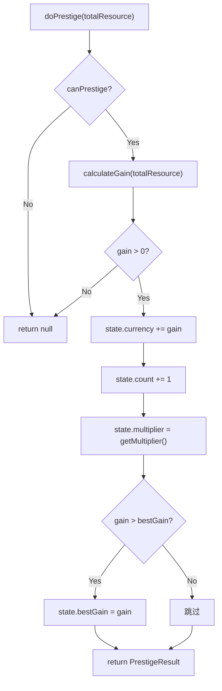
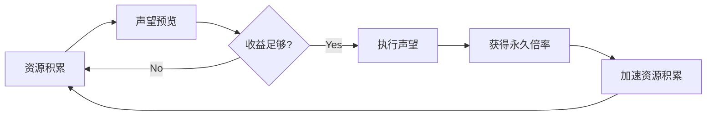

# PrestigeSystem 声望转生子系统 — 架构审查报告

> **审查人**: 系统架构师  
> **审查日期**: 2025-07-09  
> **源码路径**: `src/engines/idle/modules/PrestigeSystem.ts`  
> **测试路径**: `src/__tests__/PrestigeSystem.test.ts`

---

## 一、概览

### 1.1 基本指标

| 指标 | 数值 |
|------|------|
| 源码行数 | 410 行 |
| 测试行数 | 587 行 |
| 测试/源码比 | 1.43 : 1 |
| 公共方法数 | 11 |
| 导出类型数 | 4（`PrestigeConfig`, `PrestigeState`, `PrestigePreview`, `PrestigeResult`） |
| 外部依赖 | 0（纯 TypeScript，仅使用 `Math.log` / `Math.floor` / `Math.max`） |
| 优先级 | P0（核心模块） |

### 1.2 模块定位

PrestigeSystem 是放置游戏的核心循环机制模块，负责：

- **声望货币计算** — 基于对数公式，根据玩家总资源计算可获得的声望货币
- **声望执行** — 重置进度并累加永久性增益
- **预览机制** — 为 UI 层提供声望前的收益预览
- **状态管理** — 存档/读档/重置支持

### 1.3 系统上下文

```
┌─────────────────────────────────────────────────────┐
│                  IdleGameEngine                      │
│                                                     │
│  ┌──────────┐  ┌──────────────┐  ┌──────────────┐  │
│  │ Building │  │  Prestige    │  │  Unlock      │  │
│  │ System   │──│  System      │──│  Checker     │  │
│  └──────────┘  └──────┬───────┘  └──────────────┘  │
│                       │                             │
│         ┌─────────────┼─────────────┐               │
│         ▼             ▼             ▼               │
│   ┌──────────┐  ┌──────────┐  ┌──────────┐         │
│   │ Unit     │  │ Stage    │  │ TechTree │  ...     │
│   │ System   │  │ System   │  │ System   │         │
│   └──────────┘  └──────────┘  └──────────┘         │
└─────────────────────────────────────────────────────┘
```

**关键发现**: `IdleGameEngine` 当前使用独立的 `PrestigeData` 类型（`{ currency, count }`）管理声望，**并未直接实例化 PrestigeSystem 类**。两个实现之间存在数据模型割裂。

---

## 二、接口分析

### 2.1 公共 API 列表

| 方法 | 签名 | 职责 | 评价 |
|------|------|------|------|
| `constructor` | `(config: PrestigeConfig)` | 初始化配置和状态 | ✅ 配置解构为只读快照，防止外部篡改 |
| `canPrestige` | `(totalResource: number) => boolean` | 判断是否满足声望条件 | ✅ 简洁明了 |
| `calculateGain` | `(totalResource: number) => number` | 计算声望货币获取量 | ✅ 纯函数，无副作用 |
| `getMultiplier` | `() => number` | 获取当前产出倍率 | ⚠️ 每次调用重新计算 |
| `getPreview` | `(totalResource: number) => PrestigePreview` | 声望预览 | ✅ 丰富的 UI 支持信息 |
| `doPrestige` | `(totalResource: number) => PrestigeResult \| null` | 执行声望 | ✅ null 返回表示失败，语义清晰 |
| `getState` | `() => PrestigeState` | 获取状态快照 | ✅ 返回浅拷贝 |
| `loadState` | `(state: Partial<PrestigeState>) => void` | 恢复状态 | ⚠️ 无校验，信任外部数据 |
| `reset` | `() => void` | 完全重置 | ✅ |
| `getCurrencyName` | `() => string` | 配置访问器 | ✅ |
| `getCurrencyIcon` | `() => string` | 配置访问器 | ✅ |
| `getRetentionRate` | `() => number` | 配置访问器 | ✅ |
| `getOfflineBonus` | `() => number` | 离线收益加成 | ✅ 可选特性优雅降级 |
| `getConfig` | `() => PrestigeConfig` | 完整配置快照 | ✅ 返回副本 |

### 2.2 类型定义评价

```
┌────────────────────────────────────────────────────────────┐
│  PrestigeConfig        设计质量: ★★★★☆                      │
│  ├── currencyName      ✅ 国际化友好                         │
│  ├── currencyIcon      ✅ UI 展示支持                        │
│  ├── base              ✅ 可调参数                           │
│  ├── threshold         ✅ 可调参数                           │
│  ├── bonusMultiplier   ✅ 可调参数                           │
│  ├── retention         ✅ 可调参数                           │
│  └── offlineBonusPerPoint  ✅ 可选，优雅降级                  │
│                                                            │
│  PrestigeState         设计质量: ★★★☆☆                      │
│  ├── currency          ✅                                  │
│  ├── count             ✅                                  │
│  ├── multiplier        ⚠️ 冗余派生字段，需同步维护            │
│  └── bestGain          ✅                                  │
│                                                            │
│  PrestigePreview       设计质量: ★★★★★                      │
│  ├── canPrestige       ✅                                  │
│  ├── gain              ✅                                  │
│  ├── newMultiplier     ✅                                  │
│  ├── multiplierIncrease✅ 增量展示，UX 友好                   │
│  ├── retentionRate     ✅                                  │
│  └── warning?          ✅ 上下文感知的提示信息                 │
│                                                            │
│  PrestigeResult        设计质量: ★★★★☆                      │
│  ├── gainedCurrency    ✅                                  │
│  ├── newState          ✅ 声望后完整状态                      │
│  └── retentionRate     ✅ 调用方需据此折算资源                 │
└────────────────────────────────────────────────────────────┘
```

---

## 三、核心逻辑分析

### 3.1 声望货币计算公式

```
gain = floor(log(threshold + totalResource) / log(base))
     - floor(log(threshold) / log(base))
```

**公式特性分析**:

```
gain
  ^
  |        ┌────── 阶段3: 增速极缓（需10x资源才+1）
  |       ┌
  |     ┌─  ──── 阶段2: 线性增长区间
  |   ┌─
  | ┌─
  |/ ──────────── 阶段1: 起步区间
  +──────────────────────────────────> totalResource
  0          threshold
```

| 评估维度 | 结论 |
|----------|------|
| **数值平衡** | ✅ 对数曲线确保后期增速递减，防止数值膨胀 |
| **零点正确性** | ✅ `totalResource = 0` 时 `gain = 0`（两 floor 项相等） |
| **阈值意义** | ✅ threshold 越大，获得首个声望货币所需资源越多 |
| **整数保证** | ✅ `Math.floor` + `Math.max(0, ...)` 双重保障 |
| **base 调参** | ✅ base=10 时每 10 倍资源获得 1 点；base=2 时更频繁 |

**⚠️ 潜在问题**: 公式中 `threshold + totalResource` 在 `totalResource` 极大时（> `Number.MAX_SAFE_INTEGER - threshold`）可能丢失精度。放置游戏后期资源通常使用大数库，但此处使用原生 `number`。

### 3.2 声望执行流程



**流程评价**:

- ✅ 前置检查完备：`canPrestige` + `gain > 0` 双重守卫
- ✅ 状态更新原子性：所有修改在方法内完成，无中间态泄露
- ✅ 职责边界清晰：仅管理声望内部状态，资源重置委托给调用方
- ⚠️ 无事件通知机制：声望完成后无法通知其他子系统（如 StatisticsTracker）

### 3.3 倍率系统

```
multiplier = 1 + currency × bonusMultiplier
```

| 声望货币 | bonusMultiplier=0.25 | bonusMultiplier=0.5 |
|----------|---------------------|---------------------|
| 0 | 1.0x | 1.0x |
| 10 | 3.5x | 6.0x |
| 50 | 13.5x | 26.0x |
| 100 | 26.0x | 51.0x |

**评价**: 线性倍率模型简单直观，但后期倍率增长过快。建议考虑软上限（soft cap）或递减公式。

### 3.4 预览与警告系统

```typescript
// 四级警告策略
if (!canPrestige)         → "资源未达到声望阈值"
else if (gain === 0)      → "不足以获得任何声望货币"
else if (gain ≤ bestGain×0.1 && count > 0) → "收益远低于历史最高"
else if (count === 0)     → "首次声望！"
```

**评价**: ✅ 警告逻辑层次清晰，覆盖了所有关键决策场景，有效引导玩家做出最优声望时机选择。

---

## 四、问题清单

### 🔴 严重（2 项）

#### P1: IdleGameEngine 未集成 PrestigeSystem，存在双轨实现

- **位置**: `IdleGameEngine.ts:36` vs `PrestigeSystem.ts`
- **现状**: IdleGameEngine 使用独立的 `PrestigeData { currency, count }` 管理声望，未实例化 PrestigeSystem
- **风险**: 两套声望逻辑各自演进，数据模型不一致，最终导致存档兼容性问题
- **修复建议**:
  ```typescript
  // IdleGameEngine 中应注入 PrestigeSystem
  private readonly prestigeSystem: PrestigeSystem;
  
  constructor() {
    this.prestigeSystem = new PrestigeSystem(prestigeConfig);
  }
  
  // 移除独立的 prestige: PrestigeData 字段
  // 所有声望操作委托给 prestigeSystem
  ```

#### P2: loadState 无输入校验，可注入非法状态

- **位置**: `PrestigeSystem.ts:267-283`（`loadState` 方法）
- **现状**: 直接信任外部传入的 `currency`、`count`、`bestGain` 值，无边界检查
- **风险**: 恶意存档可注入 `currency = -100`（导致倍率为负）或 `count = NaN`
- **修复建议**:
  ```typescript
  loadState(state: Partial<PrestigeState>): void {
    if (state.currency !== undefined) {
      if (state.currency < 0 || !Number.isFinite(state.currency)) {
        throw new Error('Invalid currency value');
      }
      this.state.currency = state.currency;
    }
    if (state.count !== undefined) {
      if (state.count < 0 || !Number.isInteger(state.count)) {
        throw new Error('Invalid count value');
      }
      this.state.count = state.count;
    }
    if (state.bestGain !== undefined) {
      this.state.bestGain = Math.max(0, state.bestGain);
    }
    this.state.multiplier = this.getMultiplier();
  }
  ```

### 🟡 中等（4 项）

#### P3: PrestigeState.multiplier 是冗余派生字段

- **位置**: `PrestigeState` 类型定义，`PrestigeSystem.ts:44`
- **现状**: `multiplier` 可由 `currency × bonusMultiplier + 1` 实时计算，但仍存储在 state 中
- **风险**: multiplier 需在每次 currency 变更时手动同步（`doPrestige` 和 `loadState` 中），遗漏则导致不一致
- **修复建议**: 从 `PrestigeState` 中移除 `multiplier`，改为 getter 或由调用方按需计算
  ```typescript
  interface PrestigeState {
    currency: number;
    count: number;
    bestGain: number;
    // multiplier 通过 getState().multiplier 动态计算
  }
  ```

#### P4: 缺少事件/回调机制

- **位置**: 整个 PrestigeSystem 类
- **现状**: 声望执行后无任何通知机制，外部系统无法感知声望事件
- **影响**: StatisticsTracker 无法记录声望统计，AchievementSystem 无法触发声望成就，UI 无法播放声望动画
- **修复建议**: 引入事件回调
  ```typescript
  type PrestigeEventCallback = (result: PrestigeResult) => void;
  
  class PrestigeSystem {
    private listeners: PrestigeEventCallback[] = [];
    
    onPrestige(callback: PrestigeEventCallback): () => void {
      this.listeners.push(callback);
      return () => { this.listeners = this.listeners.filter(l => l !== callback); };
    }
    
    doPrestige(totalResource: number): PrestigeResult | null {
      // ... 现有逻辑 ...
      this.listeners.forEach(l => l(result!));
      return result;
    }
  }
  ```

#### P5: 声望配置运行时不可变，缺少热更新支持

- **位置**: `constructor` 中配置冻结
- **现状**: 配置在构造时固定，无法响应游戏平衡性调整
- **影响**: 运营阶段调整声望参数需要重建实例
- **修复建议**: 提供 `updateConfig(partial: Partial<PrestigeConfig>)` 方法，或在配置变更时触发 multiplier 重算

#### P6: getMultiplier() 每次调用重复计算

- **位置**: `PrestigeSystem.ts:170-172`
- **现状**: `1 + this.state.currency * this.config.bonusMultiplier` 每次调用都执行浮点乘法
- **影响**: 性能影响极小（微秒级），但违反 DRY 原则——multiplier 的计算逻辑分散在 `getMultiplier()`、`doPrestige()`、`loadState()` 三处
- **修复建议**: 统一通过 `getMultiplier()` 计算，其他位置调用而非重复

### 🟢 轻微（4 项）

#### P7: 缺少 PrestigeConfig 的构造时校验

- **位置**: `constructor` 
- **现状**: 未校验 `base > 1`、`threshold > 0`、`0 ≤ retention ≤ 1`、`bonusMultiplier > 0` 等约束
- **风险**: 传入 `base = 1` 导致 `log(1) = 0` 除零错误；`retention = 2` 语义错误
- **修复建议**: 构造时添加参数校验并抛出明确错误

#### P8: getConfig() 返回的 offlineBonusPerPoint 可能为 undefined

- **位置**: `getConfig()` 方法
- **现状**: spread 复制包含 `offlineBonusPerPoint: undefined`，与类型定义 `number?` 一致但可能让消费者困惑
- **修复建议**: 文档说明或在返回时过滤 undefined 字段

#### P9: calculateGain 公式注释与实际实现存在细微差异

- **位置**: 类 JSDoc 注释（第 80-81 行）
- **现状**: 注释写 `floor(log(threshold + totalResource) / log(base))`，实际代码中变量名 `logBase` 更清晰
- **修复建议**: 注释保持精确一致

#### P10: 缺少 TypeScript readonly 标记

- **位置**: `PrestigeConfig`、`PrestigeState` 接口
- **现状**: 所有字段均可变，但语义上 config 应为不可变
- **修复建议**: 对配置接口添加 `readonly` 修饰符

---

## 五、放置游戏适配性分析

### 5.1 核心循环支持



| 放置游戏特性 | 支持程度 | 说明 |
|-------------|---------|------|
| 声望循环 | ✅ 完整 | 积累→预览→执行→加速 的完整闭环 |
| 离线收益 | ✅ 支持 | `offlineBonusPerPoint` 可选参数 |
| 存档/读档 | ✅ 完整 | `getState()` + `loadState()` |
| 数值平衡 | ✅ 良好 | 对数公式天然抑制数值膨胀 |
| 多层声望 | ❌ 缺失 | 无二级声望（如"超级声望"）支持 |
| 声望里程碑 | ❌ 缺失 | 无声望次数解锁奖励机制 |
| 声望加速 | ❌ 缺失 | 无广告/道具加速声望收益 |

### 5.2 与同类游戏对比

| 特性 | 本系统 | Cookie Clicker | Realm Grinder | Tap Titans |
|------|--------|---------------|---------------|------------|
| 声望货币 | 单一 | 单一 | 双轨 | 多层 |
| 计算公式 | 对数 | 对数 | 线性+阈值 | 固定阶梯 |
| 保留机制 | 固定比例 | 无 | 部分建筑 | 英雄保留 |
| 离线加成 | ✅ | ✅ | ❌ | ✅ |
| 预览系统 | ✅ | ❌ | ✅ | ✅ |

---

## 六、测试覆盖评估

### 6.1 测试分布

| 测试分组 | 用例数 | 覆盖方法 |
|---------|--------|---------|
| constructor | 2 | 初始化状态、配置存储 |
| canPrestige | 4 | 阈值边界、负数 |
| calculateGain | 6 | 零值、边界、大数、不同 base |
| getMultiplier | 3 | 初始值、公式验证 |
| getPreview | 6 | 资源不足、充足、已有货币、警告 |
| doPrestige | 5 | 失败、成功、多次累加、bestGain |
| loadState | 4 | 完整恢复、部分恢复、空对象、multiplier 重算 |
| reset | 2 | 完全重置、重置后可再声望 |
| 配置访问 | 5 | 各 getter、getConfig 不可变性 |
| getOfflineBonus | 3 | 未配置、已配置、零值 |
| getState 不可变性 | 1 | 副本隔离 |
| 综合场景 | 2 | 完整生命周期、多次声望倍率增长 |

**总计: 43 个测试用例**

### 6.2 覆盖盲区

| 缺失场景 | 严重程度 | 说明 |
|---------|---------|------|
| 构造参数非法值 | 🟡 | `base=1`、`threshold=0`、`retention=-1` 等 |
| loadState 注入非法值 | 🔴 | `currency=-1`、`count=NaN`、`bestGain=Infinity` |
| 浮点精度边界 | 🟡 | 极大 totalResource（> 1e15）的精度损失 |
| 并发声望 | 🟢 | 连续快速调用 doPrestige 的状态一致性 |
| config 为空对象 | 🟢 | `new PrestigeSystem({})` 的行为 |
| offlineBonusPerPoint 为负值 | 🟢 | 可能导致离线收益减少 |

---

## 七、改进建议

### 7.1 短期改进（1-2 天）

| 优先级 | 改进项 | 工作量 |
|--------|--------|--------|
| 🔴 P0 | 集成到 IdleGameEngine，消除双轨实现 | 4h |
| 🔴 P0 | loadState 添加输入校验 | 1h |
| 🟡 P1 | 构造函数添加 config 参数校验 | 1h |
| 🟡 P1 | 补充边界条件测试用例 | 2h |
| 🟢 P2 | 为 PrestigeConfig 添加 readonly 修饰符 | 0.5h |

### 7.2 长期改进（1-2 周）

| 优先级 | 改进项 | 说明 |
|--------|--------|------|
| 高 | 引入事件系统 | 支持声望完成后的通知链 |
| 高 | 多层声望支持 | 支持二级/三级转生，每层独立配置 |
| 中 | 大数支持 | 引入 BigInt 或 decimal.js 支持后期数值 |
| 中 | 声望里程碑 | 按声望次数解锁特殊奖励 |
| 中 | 软上限机制 | multiplier 增长到一定程度后递减 |
| 低 | 配置热更新 | 支持运行时调整声望参数 |

### 7.3 架构演进路线图

```
Phase 1 (当前)          Phase 2                Phase 3
┌──────────────┐    ┌──────────────┐     ┌──────────────┐
│ PrestigeSystem│    │ PrestigeSystem│     │ PrestigeSystem│
│ - 单层声望    │───▶│ - 事件通知    │────▶│ - 多层声望    │
│ - 无校验     │    │ - 输入校验    │     │ - 大数支持    │
│ - 线性倍率   │    │ - 软上限      │     │ - 里程碑系统  │
│              │    │ - 引擎集成    │     │ - 配置热更新  │
└──────────────┘    └──────────────┘     └──────────────┘
```

---

## 八、综合评分

| 维度 | 评分 | 说明 |
|------|------|------|
| **接口设计** | ★★★★☆ (4/5) | API 清晰、命名规范、Preview 设计优秀；缺少事件机制 |
| **数据模型** | ★★★☆☆ (3/5) | 类型定义完整；multiplier 冗余、loadState 无校验 |
| **核心逻辑** | ★★★★★ (5/5) | 公式正确、流程完备、边界处理到位 |
| **可复用性** | ★★★★☆ (4/5) | 零依赖、配置驱动；但与 IdleGameEngine 未集成 |
| **性能** | ★★★★★ (5/5) | 纯计算无 IO，对数运算开销可忽略 |
| **测试覆盖** | ★★★★☆ (4/5) | 43 个用例覆盖主流程；缺少非法输入和精度边界测试 |
| **放置游戏适配** | ★★★★☆ (4/5) | 核心循环完整、离线收益支持；缺少多层声望和里程碑 |

### 总分: **29 / 35 (82.9%)**

```
评分等级: B+

┌──────────────────────────────────────────────────────┐
│  ████████████████████████████████░░░░  82.9%         │
│  优秀: 核心逻辑、性能                                │
│  良好: 接口设计、可复用性、测试、放置适配              │
│  待改进: 数据模型（冗余字段+校验缺失）                │
└──────────────────────────────────────────────────────┘
```

---

## 九、总结

PrestigeSystem 是一个**设计良好、实现扎实**的核心模块。对数公式选择恰当，API 设计直观，预览系统为 UI 层提供了优秀支持，测试覆盖全面。

**最紧迫的问题是集成 gap**（P1）——IdleGameEngine 未使用此模块，导致双轨实现。其次是数据安全性（P2）——loadState 缺少输入校验。

建议按 Phase 2 路线图推进，优先完成引擎集成和输入校验，再考虑事件系统和多层声望等高级特性。

---

*报告生成时间: 2025-07-09 | 审查工具: Architect Agent v1.0*
