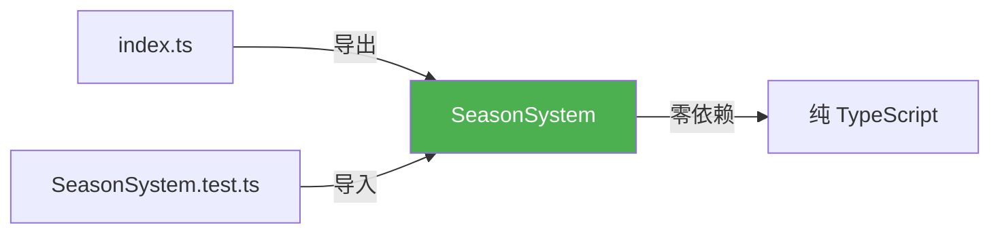
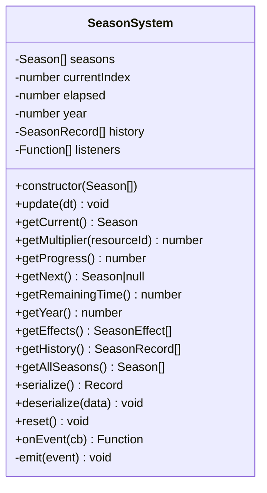
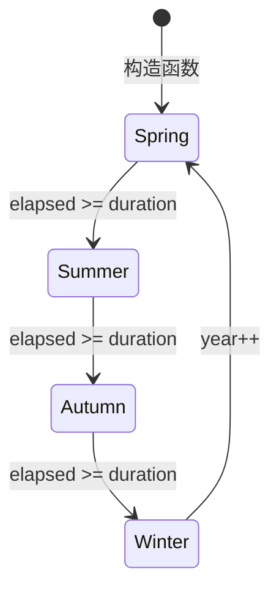
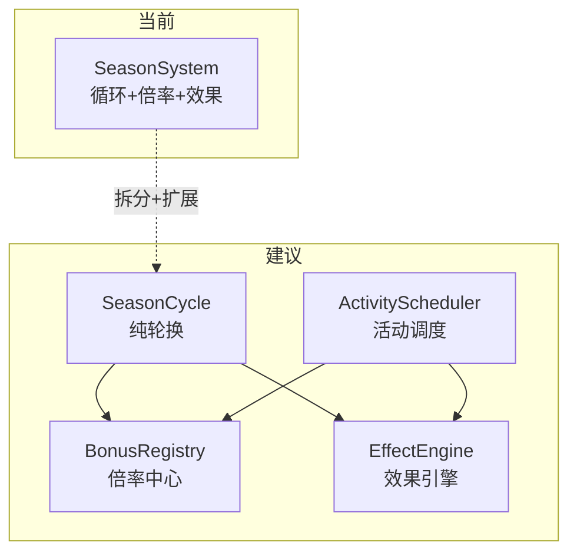

# SeasonSystem 季节/活动子系统 — 架构审查报告

> **审查人**: 系统架构师 · **日期**: 2025-07-09 · **版本**: P2（季节循环系统）  
> **源码**: `src/engines/idle/modules/SeasonSystem.ts`  
> **测试**: `src/engines/idle/__tests__/SeasonSystem.test.ts`

---

## 1. 概览

### 1.1 代码统计

| 指标 | 数值 |
|------|------|
| 源码行数 | ~290 行 |
| 测试行数 | ~350 行 |
| 公开方法数 | 13 |
| 接口/类型 | 5 (`SeasonEffect`, `Season`, `SeasonRecord`, `SeasonState`, `SeasonEvent`) |
| 测试用例 | 22 |
| 外部依赖 | **0**（纯 TypeScript） |

### 1.2 依赖关系



**关键发现**: SeasonSystem 完全独立，当前**未被任何其他子系统直接引用**。`getMultiplier()` 虽已暴露，但尚未形成实际的倍率集成链路。

---

## 2. 接口分析

### 2.1 类型定义评估

| 接口 | 评价 | 说明 |
|------|------|------|
| `SeasonEffect` | ✅ 良好 | 5 种效果类型联合清晰，字段完整 |
| `Season` | ✅ 良好 | 结构完整，`colorTheme` 支持主题化，`multipliers` 用 Record 灵活映射 |
| `SeasonRecord` | ✅ 良好 | 历史追踪字段齐全 |
| `SeasonState` | 🔴 **未使用** | 已定义但 `serialize()` 返回 `Record<string, unknown>`，且字段名不匹配 |
| `SeasonEvent` | ✅ 良好 | 3 种事件类型覆盖核心场景 |

### 2.2 API 设计



**优点**: `get` 前缀一致、`onEvent` 返回取消函数、集合方法均做防御性拷贝。  
**不足**: 缺少 `getAllMultipliers()` 批量接口、`deserialize` 参数丢失类型安全。

---

## 3. 核心逻辑分析

### 3.1 季节循环引擎



**核心算法** (`update()`, 第 123-185 行):

```
输入 dt → elapsed += dt → while (overflow >= 0):
  ① 记录历史 → ② 推进索引 → ③ 年度检查 → ④ elapsed = overflow
  ⑤ 触发 season_changed → ⑥ 触发 season_effect → ⑦ 重算 overflow
```

✅ 循环溢出处理正确，支持大 dt 一次性跳过多个季节（对离线收益至关重要）。

### 3.2 产出倍率

- ✅ 未配置资源默认返回 1.0，语义正确
- ⚠️ 仅支持单一静态倍率，不支持多来源复合计算

### 3.3 效果系统

- ✅ 5 种效果类型覆盖常见场景
- ⚠️ 效果仅通过事件通知，系统本身不执行效果逻辑
- ⚠️ 无效果叠加/互斥规则、无持续时间概念

### 3.4 限时加成

当前 **没有独立的限时加成机制**。缺少：加成叠加规则、到期自动移除、临时活动管理。

---

## 4. 问题清单

### 🔴 严重

#### P1: `SeasonState` 接口与 `serialize()` 输出不一致
**位置**: 第 43-48 行（接口）, 第 228 行（serialize）

```typescript
// 接口定义: current: string
// 实际输出: currentIndex: number
// 字段名和类型完全不同！
```
**修复**: 统一接口字段或让 `serialize()` 返回 `SeasonState`。

#### P2: `Date.now()` 与游戏时间耦合
**位置**: 第 103 行（构造函数）, 第 154 行（update 内）

`currentSeasonStartedAt` 使用 `Date.now()`，但 `update()` 用纯 `dt` 推进。导致：
- 游戏暂停后恢复时间跳变
- 离线计算时间戳不一致
- 不支持时间加速/减速

**修复**: 引入游戏单调时钟 `gameTick`，所有时间基于累计 `dt`。

#### P3: 历史记录无限增长 — 内存泄漏
**位置**: 第 140-145 行

以 4 季 × 30s/季为例，一个月约 345,600 条记录 (~34MB)。`serialize()` 全量拷贝导致存档膨胀。

**修复**: 添加 `MAX_HISTORY` 上限（如 1000 条），超出后裁剪。

---

### 🟡 中等

#### P4: `deserialize()` 类型断言不安全
**位置**: 第 240-275 行

大量 `as` 断言，`NaN` 和非整数可通过校验。建议使用 `Number.isInteger()` 严格校验。

#### P5: 事件监听器无上限
**位置**: 第 289 行

React 组件反复注册但忘记取消订阅会导致泄漏。建议添加 `MAX_LISTENERS` 告警。

#### P6: `emit()` 静默吞掉异常
**位置**: 第 297-303 行

完全静默的 catch 使调试极困难。建议添加 `console.warn` 或可配置错误处理器。

#### P7: 缺少季节配置校验
**位置**: 构造函数第 108-115 行

仅校验数组非空，未校验：id 唯一性、duration 非负、multipliers 正数。

---

### 🟢 轻微

| # | 问题 | 位置 | 建议 |
|---|------|------|------|
| P8 | `getHistory()` 和 `serialize()` 拷贝策略不一致 | 第 233/249 行 | 统一为 `slice()` |
| P9 | `getNext()` 单季节返回 null 语义不清 | 第 221 行 | 返回自身更合理 |
| P10 | 缺少 `getElapsed()` 公开方法 | — | 添加 getter |
| P11 | `SeasonEffect.type` 用字符串联合而非枚举 | 第 16 行 | 风格偏好，可保留 |

---

## 5. 测试覆盖分析

### 覆盖矩阵

| 功能点 | 覆盖 | 功能点 | 覆盖 |
|--------|:----:|--------|:----:|
| 构造函数（正常/空/null） | ✅ | 事件 changed/effect | ✅ |
| update dt 边界 (0/负数) | ✅ | 事件取消订阅 | ✅ |
| 单次/跨多季切换 | ✅ | 监听器异常保护 | ✅ |
| 年度推进 + 事件 | ✅ | 序列化/反序列化 | ✅ |
| getMultiplier 有/无/切换 | ✅ | 历史记录保存恢复 | ✅ |
| getProgress 计算 | ✅ | deserialize 无效数据 | ✅ |
| getNext 正常/末尾 | ✅ | reset 状态/监听器 | ✅ |
| getRemainingTime 不为负 | ✅ | 单季节边界 | ✅ |
| getEffects 浅拷贝 | ✅ | duration=0 边界 | ✅ |

### 缺失场景

| 场景 | 重要性 |
|------|--------|
| 超大 dt（数月离线，验证无栈溢出） | 🟡 |
| 重复 id 配置 | 🟡 |
| 负数 duration 配置 | 🟡 |
| deserialize 后连续 update | 🟢 |

---

## 6. 放置游戏适配评估

| 需求 | 支持 | 说明 |
|------|:----:|------|
| 离线收益计算 | ✅ | `update(大dt)` 支持一次性推进 |
| 存档/读档 | ✅ | 完整序列化支持 |
| 产出倍率 | ⚠️ | 单一倍率，无复合计算 |
| 限时活动 | ❌ | 无独立活动系统 |
| 时间加速 | ❌ | Date.now() 耦合 |
| 视觉反馈 | ✅ | colorTheme + icon |
| 季节预览 | ✅ | `getNext()` |

**集成缺口**: 倍率和效果是"只生产、不消费"状态，未发现其他系统实际调用 `getMultiplier()` 影响产出。

---

## 7. 改进建议

### 短期（1-2 天）

| 优先级 | 改进项 | 工时 |
|:------:|--------|:----:|
| 🔴 | 修复 `SeasonState` 与 `serialize()` 不一致 | 0.5h |
| 🔴 | 添加历史记录上限 `MAX_HISTORY` | 0.5h |
| 🔴 | 添加季节配置校验（id 唯一/duration 非负） | 1h |
| 🟡 | `emit()` 添加 `console.warn` 日志 | 0.5h |
| 🟡 | `deserialize()` 严格类型校验 | 1h |
| 🟢 | 添加 `getElapsed()` 方法 | 0.5h |

### 长期（下一迭代）

| 改进项 | 工时 |
|--------|:----:|
| 引入游戏时钟，解耦 `Date.now()` | 2-3d |
| 独立活动调度器（限时活动、节日活动） | 3-5d |
| 倍率集成管道（与 Building/Resource 系统对接） | 2-3d |
| 效果执行引擎（从事件通知升级为可配置执行器） | 3-5d |

### 架构演进方向



---

## 8. 综合评分

| 维度 | 分数 | 说明 |
|------|:----:|------|
| 接口设计 | ⭐⭐⭐⭐ **4** | 命名规范，`SeasonState` 未使用需修复 |
| 数据模型 | ⭐⭐⭐⭐ **4** | 结构完整，缺配置校验 |
| 核心逻辑 | ⭐⭐⭐⭐ **4** | 循环算法正确，Date.now() 耦合是隐患 |
| 可复用性 | ⭐⭐⭐⭐⭐ **5** | 零依赖、纯回调，高度可移植 |
| 性能 | ⭐⭐⭐ **3** | 历史无限增长、事件无上限 |
| 测试覆盖 | ⭐⭐⭐⭐ **4** | 22 用例覆盖全公开方法，缺边界测试 |
| 放置游戏适配 | ⭐⭐⭐⭐ **4** | 离线支持好，缺时间加速和活动系统 |

### 总分: 28 / 35 (80%)

```
接口设计     ████████░░  4
数据模型     ████████░░  4
核心逻辑     ████████░░  4
可复用性     ██████████  5
性能         ██████░░░░  3
测试覆盖     ████████░░  4
放置游戏适配  ████████░░  4
─────────────────────────
合计          28/35
```

### 总体评价

SeasonSystem 是一个 **设计良好、实现扎实** 的放置游戏子系统。零依赖设计带来极高可移植性，季节循环算法正确处理了大 dt 场景。主要风险在 **历史无限增长**（P3）和 **时间模型耦合**（P2），建议优先修复三个 🔴 严重问题。中期应推动与其他系统的实际集成，确保季节倍率真正影响游戏产出。

---

*报告结束*
