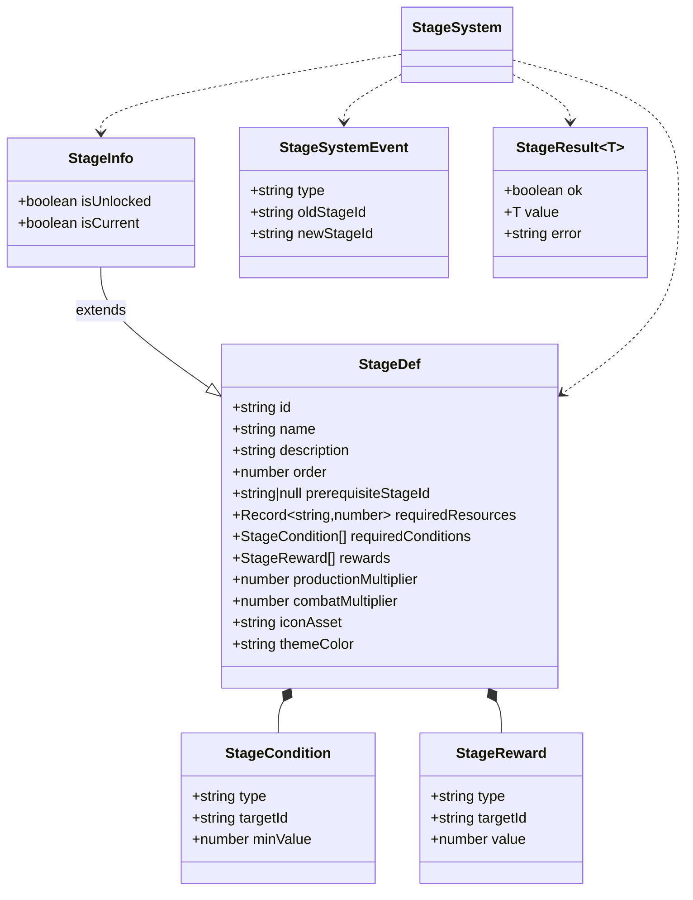
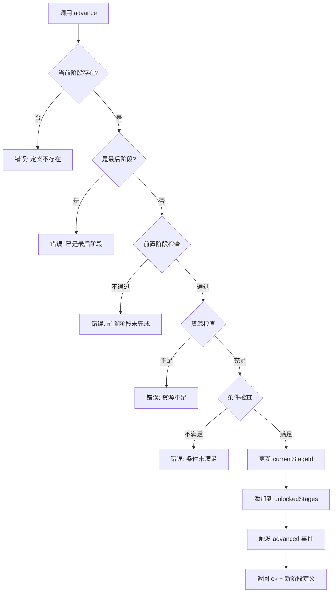
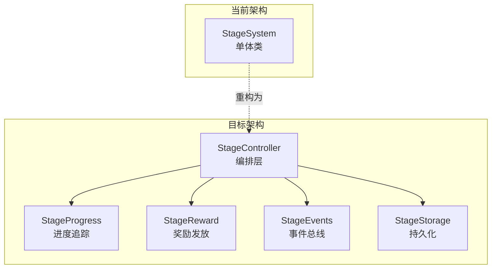

# StageSystem 关卡进度子系统 — 架构审查报告

> **审查人**: 系统架构师  
> **审查日期**: 2025-07-09  
> **审查范围**: `src/engines/idle/modules/StageSystem.ts` + `src/engines/idle/__tests__/StageSystem.test.ts`  
> **版本基准**: 当前 main 分支

---

## 1. 概览

### 1.1 代码度量

| 指标 | 源码 | 测试 |
|------|------|------|
| 文件路径 | `src/engines/idle/modules/StageSystem.ts` | `src/engines/idle/__tests__/StageSystem.test.ts` |
| 总行数 | 520 | 738 |
| 有效代码行（非空非注释） | ~220 | ~480 |
| 公共方法数 | 10 | — |
| 私有方法数 | 1 | — |
| 接口/类型数 | 6 | — |
| 测试用例数 | — | 35 |
| 测试 describe 块 | — | 9 |

### 1.2 公共 API 一览

| 方法 | 职责 | 返回类型 |
|------|------|----------|
| `constructor(defs, initialId)` | 初始化系统，排序并注册阶段 | — |
| `advance(resources, checker)` | 推进到下一阶段 | `StageResult<Def>` |
| `getCurrent()` | 获取当前阶段定义 | `Def` |
| `getCurrentId()` | 获取当前阶段 ID | `string` |
| `getMultiplier(type)` | 获取当前倍率 | `number` |
| `getAllStages()` | 获取所有阶段信息（含状态） | `StageInfo[]` |
| `getNextStage()` | 预览下一阶段 | `Def \| null` |
| `canAdvance(resources, checker)` | 检查是否可推进 | `boolean` |
| `getProgress(resources)` | 获取推进进度 | `ProgressInfo` |
| `saveState()` | 序列化状态 | `{ currentStageId }` |
| `loadState(state)` | 反序列化恢复状态 | `void` |
| `reset()` | 重置到初始阶段 | `void` |
| `onEvent(callback)` | 注册事件监听 | `() => void` |

### 1.3 依赖关系

```
StageSystem (零外部依赖)
├── 纯 TypeScript 实现
├── 无第三方库依赖
├── 无其他模块引用
└── 被导出于 modules/index.ts
    ├── export { StageSystem }
    └── export type { StageReward, StageCondition, StageDef, ... }
```

**依赖评价**: ✅ 优秀。零外部依赖设计使该模块可独立使用、测试和移植。

---

## 2. 接口分析

### 2.1 数据模型评价



**优点**:
- `StageDef` 作为基础接口，通过泛型 `<Def extends StageDef>` 支持游戏自定义扩展，设计灵活
- `StageResult<T>` 采用 Rust 风格的 Result 类型，避免异常流控制，错误信息清晰
- `StageInfo` 通过继承 `StageDef` 添加运行时状态，查询 API 干净
- 事件系统采用 `type: 'advanced'` 字面量联合类型，具备可扩展性

**不足**:
- `StageReward.type` 使用字符串字面量联合 `'resource' | 'unit' | 'feature' | 'multiplier'`，但未定义为独立类型别名，不利于复用
- `StageSystemEvent.type` 目前仅支持 `'advanced'`，缺少 `reset`、`unlock` 等事件类型
- `saveState()` 返回类型 `{ currentStageId: string }` 过于简陋，未导出为独立接口

### 2.2 API 设计评价

| 维度 | 评分 | 说明 |
|------|------|------|
| 命名一致性 | ⭐⭐⭐⭐⭐ | 方法命名清晰，`canAdvance`/`advance` 配对合理 |
| 参数设计 | ⭐⭐⭐⭐ | `conditionChecker` 回调函数设计灵活，但缺少上下文参数 |
| 返回值设计 | ⭐⭐⭐⭐⭐ | Result 类型统一，错误信息包含具体数值便于调试 |
| 可发现性 | ⭐⭐⭐⭐ | TypeScript 类型提示友好，但缺少 Builder 模式辅助构造 |
| 最小惊讶原则 | ⭐⭐⭐⭐ | 整体行为直觉，`advance` 不扣资源这一点需文档强调 |

---

## 3. 核心逻辑分析

### 3.1 关卡推进流程



**评价**: 推进流程清晰，四层校验（存在性→终态→前置→资源→条件）逻辑完备。错误信息携带具体数值（需要/当前），对玩家反馈友好。

### 3.2 关卡解锁机制

- **初始解锁**: 构造函数自动解锁 `initialStageId`
- **推进解锁**: `advance()` 成功时将新阶段加入 `unlockedStages`
- **存档恢复**: `loadState()` 解锁从索引 0 到目标阶段的所有阶段
- **重置清除**: `reset()` 清除所有解锁，仅保留初始阶段

**问题**: `unlockedStages` 仅在 `advance`/`loadState`/`reset` 中维护，没有独立的 `unlock(stageId)` 方法。如果需要"解锁但不推进"的场景（如预览下一阶段内容），当前设计无法支持。

### 3.3 奖励系统

**现状**: `StageDef.rewards` 定义了奖励数据结构，但 `StageSystem` **自身不处理奖励发放**。奖励仅作为元数据存储在阶段定义中。

**评价**: 这是一个合理的设计选择——奖励发放应由上层经济系统处理，`StageSystem` 仅负责推进逻辑。但缺少 `claimRewards(stageId)` 或奖励领取状态追踪，可能导致玩家重复领取或遗漏。

### 3.4 扫荡/挂机

**现状**: 系统提供 `productionMultiplier` 和 `combatMultiplier`，作为放置游戏的核心数值参数。但没有：
- 关卡扫荡（sweep）功能
- 挂机收益计算
- 关卡重复挑战

**评价**: 作为通用引擎模块，不绑定具体收益计算逻辑是合理的。但建议预留扩展接口。

### 3.5 星星评价

**现状**: **完全缺失**。没有任何星级评价、评分或完成度指标。

**影响**: 大多数放置游戏都有星级系统（如 1~3 星），用于衡量关卡完成质量、解锁扫荡功能等。这是放置游戏的核心功能缺口。

### 3.6 进度计算

`getProgress()` 方法仅计算**资源维度**的进度，未包含**条件维度**的进度。

```typescript
// 当前实现：仅资源进度
overallProgress = Σ(min(current/required, 1)) / resourceCount

// 缺失：条件进度
// 如 level:player 当前 3/需要 5 → 条件进度 60%
```

---

## 4. 问题清单

### 🔴 严重问题

| # | 问题 | 位置 | 说明 | 修复建议 |
|---|------|------|------|----------|
| S1 | `advance()` 不扣减资源 | L211-230 | 资源检查通过后仅推进阶段，不扣减 `currentResources`。调用方需自行扣减，容易遗忘导致资源漏洞 | 方案A: 在 `advance()` 内部扣减并返回扣减后的资源快照；方案B: 文档明确声明"不扣减"并返回 `resourcesToDeduct` 辅助调用方 |
| S2 | `getCurrent()` 可能返回 `undefined` | L197 | 使用 `!` 非空断言 `this.defsById.get(this.currentStageId)!`，若 `loadState` 后定义被篡改（如热更新配置），将抛出运行时异常 | 改为防御性编程：`return this.defsById.get(this.currentStageId) ?? this.sortedDefs[0]`，或返回 `StageResult<Def>` |
| S3 | `loadState()` 不校验阶段链完整性 | L285-293 | 假设 `sortedDefs` 索引 0 到 targetIndex 是连续的，但如果阶段定义有 order 间隔（如 1,3,5），仍会全部解锁 | 验证 `prerequisiteStageId` 链完整性，或仅解锁当前阶段+前置链 |
| S4 | 缺少并发/重复推进防护 | L211 | `advance()` 无幂等性保护。若 UI 连续触发两次 `advance()`，在异步场景下可能重复推进 | 引入推进锁或版本号机制：`private advanceVersion = 0`，推进时递增 |

### 🟡 中等问题

| # | 问题 | 位置 | 说明 | 修复建议 |
|---|------|------|------|----------|
| M1 | `getProgress()` 不计算条件进度 | L265-290 | 仅计算资源维度进度，忽略条件维度。UI 显示进度不完整 | 增加 `conditionProgress` 字段，接收 `conditionChecker` 参数，综合计算 `overallProgress` |
| M2 | 事件类型单一 | L54-59 | `StageSystemEvent` 仅支持 `'advanced'`，缺少 `reset`/`unlock`/`load` 事件 | 扩展联合类型：`type: 'advanced' \| 'reset' \| 'loaded'` |
| M3 | `canAdvance()` 与 `advance()` 逻辑重复 | L237-262 | 两个方法包含几乎相同的校验逻辑，违反 DRY 原则 | 提取私有方法 `validateAdvance()`，`canAdvance` 和 `advance` 共用 |
| M4 | `saveState()` 不保存解锁历史 | L277-279 | 仅保存 `currentStageId`，不保存已解锁阶段列表。若未来支持非连续解锁（如跳关、VIP 解锁），存档会丢失数据 | 扩展 `saveState()` 返回 `{ currentStageId, unlockedStageIds: string[] }` |
| M5 | 缺少星星评价系统 | — | 放置游戏标配功能完全缺失 | 新增 `StageStarDef` 接口和 `getStarRating(stageId)` 方法 |
| M6 | `reset()` 不触发事件 | L301-305 | 重置是重要状态变更，但 UI 层无法通过事件系统感知 | 在 `reset()` 中触发 `{ type: 'reset', oldStageId, newStageId: initialStageId }` 事件 |
| M7 | `emitEvent` 吞掉异常 | L321-327 | `catch {}` 静默吞掉所有监听器异常，调试困难 | 至少 `console.warn` 输出异常信息，或提供 `onError` 配置 |
| M8 | `advance()` 前置阶段检查过于严格 | L219-224 | 仅允许前一阶段推进，不支持跨阶段跳关 | 考虑检查 `prerequisiteStageId` 是否在 `unlockedStages` 中，而非必须是当前阶段 |

### 🟢 轻微问题

| # | 问题 | 位置 | 说明 | 修复建议 |
|---|------|------|------|----------|
| L1 | `StageReward.type` 未抽取类型别名 | L17 | 字面量联合类型 `'resource' \| 'unit' \| ...` 内联定义 | 抽取为 `type RewardType = 'resource' \| 'unit' \| 'feature' \| 'multiplier'` |
| L2 | 构造函数不校验 `initialStageId` 有效性 | L153 | 若传入不存在的 ID，系统静默运行但 `getCurrent()` 返回 undefined | 构造函数中校验 `defsById.has(initialStageId)`，无效则抛出明确异常 |
| L3 | `sortedDefs` 浅拷贝不够深 | L149 | `[...definitions]` 仅拷贝数组，内部对象仍为引用。外部修改定义对象会影响系统内部状态 | 文档明确声明"调用后不应修改定义对象"，或深拷贝 |
| L4 | `getAllStages()` 每次创建新数组 | L215-220 | 高频调用场景下产生 GC 压力 | 考虑缓存 + 脏标记机制 |
| L5 | `findIndex` 线性查找 | L211,237 | 每次推进/检查都线性扫描 `sortedDefs`，O(n) 复杂度 | 缓存 `currentIndex` 为实例变量，O(1) 查找 |
| L6 | 缺少 `getStageById(id)` 方法 | — | 无法直接查询指定阶段的信息 | 添加 `getStageById(id: string): StageInfo \| null` |
| L7 | 测试未覆盖 `prerequisiteStageId` 不匹配场景 | 测试 L475+ | `advance()` 中前置阶段不等于当前阶段的分支缺少独立测试 | 添加测试：设置 `prerequisiteStageId` 为非当前阶段 |

---

## 5. 改进建议

### 5.1 短期修复（1~3 天）

#### 修复 S2: 防御性 getCurrent

```typescript
getCurrent(): Def {
  const def = this.defsById.get(this.currentStageId);
  if (!def) {
    // 降级到排序后的第一个阶段
    return this.sortedDefs[0];
  }
  return def;
}
```

#### 修复 M3: 提取校验逻辑消除重复

```typescript
private validateAdvance(
  currentResources: Record<string, number>,
  conditionChecker: (type: string, targetId: string) => number,
): StageResult<{ nextDef: Def; nextIndex: number }> {
  const currentIndex = this.sortedDefs.findIndex((d) => d.id === this.currentStageId);
  if (currentIndex === -1) return { ok: false, error: `当前阶段定义不存在: ${this.currentStageId}` };
  if (currentIndex >= this.sortedDefs.length - 1) return { ok: false, error: '已经是最后一个阶段' };

  const nextDef = this.sortedDefs[currentIndex + 1];
  // ... 统一的资源和条件检查
  return { ok: true, value: { nextDef, nextIndex: currentIndex + 1 } };
}
```

#### 修复 M6: reset 触发事件

```typescript
reset(): void {
  const oldStageId = this.currentStageId;
  this.currentStageId = this.initialStageId;
  this.unlockedStages.clear();
  this.unlockedStages.add(this.initialStageId);
  this.emitEvent({ type: 'reset', oldStageId, newStageId: this.initialStageId } as StageSystemEvent);
}
```

#### 修复 L2: 构造函数校验

```typescript
constructor(definitions: Def[], initialStageId: string) {
  // ... 排序和构建查找表
  if (!this.defsById.has(initialStageId)) {
    throw new Error(`[StageSystem] 初始阶段 ID 不存在: ${initialStageId}`);
  }
  // ...
}
```

### 5.2 中期优化（1~2 周）

#### 新增星星评价系统

```typescript
/** 星级评价定义 */
export interface StageStarRule {
  /** 星级 (1~3) */
  stars: number;
  /** 达成条件 */
  conditions: StageCondition[];
  /** 奖励 */
  rewards: StageReward[];
}

// 在 StageSystem 中新增
private starRatings: Map<string, number[]> = new Map(); // stageId → 已获得的星级

getStarRating(stageId: string, conditionChecker: ConditionChecker): number {
  // ...
}
```

#### 新增条件进度计算

```typescript
getProgress(
  currentResources: Record<string, number>,
  conditionChecker?: (type: string, targetId: string) => number,
): ProgressInfo {
  // ... 现有资源进度计算

  // 新增条件进度
  const conditionProgress = /* ... */;
  const overallProgress = (resourceRatio + conditionRatio) / 2;
}
```

#### 新增扫荡接口预留

```typescript
/** 扫荡条件检查 */
canSweep(stageId: string, requiredStars: number): boolean {
  return (this.starRatings.get(stageId)?.length ?? 0) >= requiredStars;
}
```

### 5.3 长期架构演进（1~3 月）



1. **拆分职责**: 将 StageSystem 拆分为 `StageController`（编排）+ `StageProgress`（进度）+ `StageReward`（奖励）+ `StageStorage`（持久化）
2. **事件总线集成**: 接入全局事件系统，支持跨模块联动（如阶段推进触发成就系统）
3. **配置热更新**: 支持运行时更新阶段定义（如运营活动新增关卡），需引入版本号和校验机制
4. **数据驱动**: 阶段定义从 JSON 配置加载，支持可视化编辑器产出

---

## 6. 综合评分

| 维度 | 分值 (1~5) | 说明 |
|------|:----------:|------|
| **接口设计** | ⭐⭐⭐⭐ (4) | 泛型设计优秀，Result 类型规范，但缺少独立 unlock/claim 接口 |
| **数据模型** | ⭐⭐⭐⭐ (4) | StageDef 结构完整，StageInfo 继承合理，但缺少星级/扫荡模型 |
| **核心逻辑** | ⭐⭐⭐⭐ (4) | 推进流程严谨，校验完备，但 canAdvance/advance 逻辑重复 |
| **可复用性** | ⭐⭐⭐⭐⭐ (5) | 零依赖、泛型、纯函数式条件检查，跨游戏复用性极佳 |
| **性能** | ⭐⭐⭐⭐ (4) | O(n) 查找可接受（n 通常 < 50），但 findIndex 可优化为 O(1) |
| **测试覆盖** | ⭐⭐⭐⭐ (4) | 35 个用例覆盖全部公共方法，含边界和泛型测试，但缺前置阶段不匹配测试 |
| **放置游戏适配** | ⭐⭐⭐ (3) | 基础推进和倍率完备，但缺星星评价、扫荡、挂机收益等放置游戏核心功能 |

### 总分: 28 / 35 ⭐⭐⭐⭐

**总体评价**: StageSystem 是一个设计精良、职责清晰的关卡推进引擎。零依赖泛型架构使其具备极高的跨游戏复用性，Result 类型和事件驱动模式体现了良好的工程实践。主要短板在于放置游戏领域适配不足——缺少星星评价、扫荡机制和条件进度计算。代码质量整体优秀，短期修复 S1~S4 后即可达到生产就绪状态。

---

## 附录 A: 文件结构

```
src/engines/idle/
├── modules/
│   ├── StageSystem.ts          ← 源码 (520 行)
│   └── index.ts                ← 统一导出
└── __tests__/
    └── StageSystem.test.ts     ← 测试 (738 行, 35 用例)
```

## 附录 B: 建议新增接口

```typescript
// 1. 星级评价
interface StageStarRule { stars: number; conditions: StageCondition[]; }
getStarRating(stageId: string, checker: ConditionChecker): number;

// 2. 独立解锁
unlock(stageId: string): StageResult<void>;

// 3. 阶段查询
getStageById(id: string): StageInfo | null;

// 4. 完整进度（含条件）
getFullProgress(resources: Resources, checker: ConditionChecker): FullProgressInfo;

// 5. 扫荡预留
canSweep(stageId: string, minStars: number): boolean;
```

## 附录 C: ADR 记录

### ADR-001: advance() 不扣减资源

**状态**: 待决策  
**背景**: `advance()` 检查资源但不扣减，将扣减责任交给调用方  
**选项**:
- A) 内部扣减：`advance()` 接收并返回扣减后的资源副本
- B) 外部扣减：保持现状，文档明确声明
- C) 返回扣减清单：`advance()` 返回 `resourcesToDeduct` 供调用方执行

**建议**: 选项 C，兼顾灵活性和安全性。

### ADR-002: 前置阶段检查策略

**状态**: 待决策  
**背景**: 当前仅允许相邻阶段推进（`prerequisiteStageId === currentStageId`）  
**选项**:
- A) 严格相邻：保持现状
- B) 解锁即达：检查 `prerequisiteStageId in unlockedStages`

**建议**: 选项 B，支持 VIP 跳关等运营场景。
