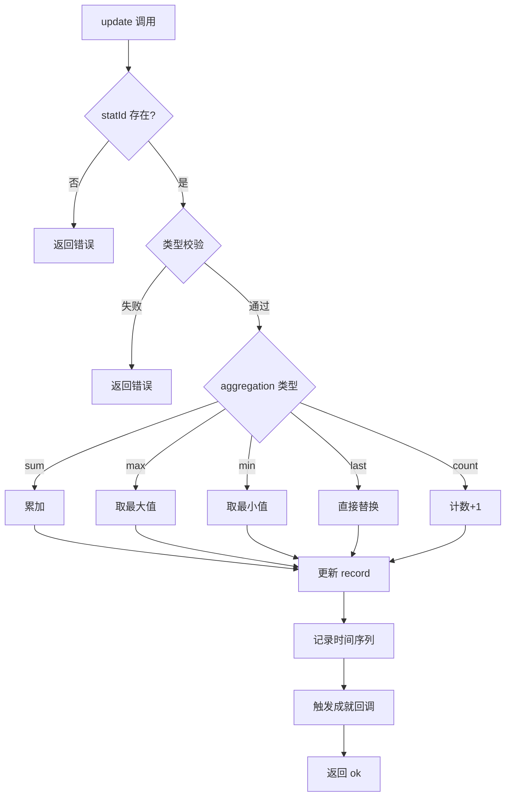

# StatisticsTracker 统计追踪子系统 — 架构审查报告

> **审查日期**: 2025-07-09  
> **审查人**: Architect Agent  
> **源码路径**: `src/engines/idle/modules/StatisticsTracker.ts`  
> **测试路径**: `tests/engines/idle/modules/StatisticsTracker.test.ts`（**不存在**）

---

## 一、概览

### 1.1 基本信息

| 指标 | 数值 |
|------|------|
| 源码总行数 | ~430 行 |
| 公共方法数 | 12 |
| 私有方法数 | 3 |
| 类型/接口定义 | 7 |
| 外部依赖 | 0（纯 TypeScript） |
| 测试文件 | ❌ **不存在** |

### 1.2 依赖关系

```
┌─────────────────────────────────────────────────┐
│              StatisticsTracker                   │
│  ┌──────────────┐  ┌──────────────────────────┐ │
│  │ definitions   │  │ records (StatRecord)     │ │
│  │ (StatDef...)  │  │ timeSeries (TimeSeries)  │ │
│  └──────────────┘  └──────────────────────────┘ │
│         ▲                  ▲                     │
│         │                  │                     │
│  被导出于 index.ts    被 IdleGameEngine          │
│                       （但未实际使用！）          │
└─────────────────────────────────────────────────┘
```

**关键发现**: `IdleGameEngine.ts` 中使用的是自带的 `statistics: Record<string, number>` 简单对象，**完全未集成 StatisticsTracker 模块**。StatisticsTracker 虽已导出，但处于"孤岛"状态。

### 1.3 模块在项目中的位置

```
src/engines/idle/
├── IdleGameEngine.ts        ← 主引擎（使用简单 Record 代替 StatisticsTracker）
└── modules/
    ├── StatisticsTracker.ts ← 本次审查对象
    ├── BattleSystem.ts
    ├── PrestigeSystem.ts
    ├── ... (共 18 个子系统模块)
    └── index.ts             ← 统一导出
```

---

## 二、接口分析

### 2.1 公共 API 一览

| 方法 | 签名 | 职责 | 评价 |
|------|------|------|------|
| `constructor` | `(definitions: StatDefinition[])` | 初始化所有统计项 | ✅ 清晰 |
| `update` | `(statId, newValue) → {ok, error?}` | 核心更新，按聚合策略处理 | ✅ 完善 |
| `increment` | `(statId, delta?) → {ok, error?}` | 增量快捷方式 | ✅ 实用 |
| `get` | `(statId) → StatValue \| undefined` | 获取当前值 | ⚠️ 返回 undefined 语义模糊 |
| `getRecord` | `(statId) → StatRecord \| undefined` | 获取完整记录 | ✅ 返回防御性副本 |
| `getByCategory` | `(category) → StatRecord[]` | 按类别查询 | ✅ 合理 |
| `getTimeSeries` | `(statId, since?) → TimeSeriesPoint[]` | 时间序列查询 | ✅ 支持范围过滤 |
| `getSessionSummary` | `() → {sessionDuration, totalUpdates, topStats}` | 会话摘要 | ⚠️ sessionDuration 实时计算 |
| `onProgress` | `(callback) → unsubscribe` | 注册成就回调 | ✅ 返回取消函数 |
| `serialize` | `() → string` | 序列化 | ✅ 仅持久化项 |
| `deserialize` | `(json) → {ok, error?}` | 反序列化 | ⚠️ 静默跳过错误数据 |
| `reset` | `() → void` | 重置到初始状态 | ✅ 保留定义和回调 |
| `getAllDefinitions` | `() → StatDefinition[]` | 获取所有定义 | ✅ |
| `getCategories` | `() → string[]` | 获取类别列表 | ✅ |

### 2.2 接口设计评价

**优点**:
- 操作结果统一使用 `{ ok, error? }` 模式，一致性良好
- `onProgress` 返回取消函数，符合 Observable 模式最佳实践
- `getRecord` / `getTimeSeries` 返回副本，防止外部篡改内部状态
- `persistent` 标志区分持久化/临时统计项，序列化策略清晰

**不足**:
- 缺少 `has(statId): boolean` 方法，外部需通过 `get() !== undefined` 判断
- 缺少批量更新接口 `batchUpdate(updates: Array<{statId, value}>)`，放置游戏高频更新场景需要
- `get()` 返回 `undefined` 无法区分"统计项不存在"和"值本身就是 undefined"
- 缺少事件/观察者机制（仅成就回调，无通用变更通知）

---

## 三、核心逻辑分析

### 3.1 统计项定义（StatDefinition）

```typescript
interface StatDefinition {
  id: string;                    // 唯一标识
  displayName: string;           // 显示名称
  category: string;              // 分类
  valueType: "number" | "string" | "boolean";
  aggregation: AggregationType;  // sum/max/min/last/count
  initialValue: StatValue;
  linkedAchievementIds: string[];
  persistent: boolean;
}
```

**评价**: 定义完整，字段设计合理。`linkedAchievementIds` 将统计与成就解耦，通过回调通知，设计良好。

**问题**: 构造函数中对 `definitions` 数组**无重复 ID 校验**。如果传入两个相同 `id` 的定义，后者会静默覆盖前者。

### 3.2 聚合策略（update 方法）



**聚合逻辑评价**:
- ✅ 5 种聚合策略覆盖放置游戏常见场景
- ✅ `count` 模式正确忽略传入值，只递增
- ⚠️ `sum`/`max`/`min` 对非 number 类型**静默使用 newValue**（不报错），可能产生意外行为
- ⚠️ `default` 分支永远不会执行（TypeScript 已穷举所有 AggregationType），但代码中保留了它

### 3.3 时间序列

- 最大保留 1000 个数据点，超出后 FIFO 淘汰
- 仅 `number` 类型统计项自动记录
- `getTimeSeries` 支持 `since` 时间范围过滤

**问题清单**:
1. 🔴 **`appendTimeSeriesPoint` 使用 `splice(0, excess)` 淘汰旧数据**，当 `excess` 较大时（如反序列化大量数据后），`splice` 对数组的 O(n) 移动操作会造成性能抖动
2. 🟡 **无降采样策略**。放置游戏可能运行数天，1000 个点可能只覆盖最近几分钟的高频更新，无法展示长期趋势
3. 🟡 **`getTimeSeries` 缺少 `until` 参数**，无法指定结束时间

### 3.4 序列化/反序列化

- `serialize`: 仅保存 `persistent: true` 的统计项，JSON 格式
- `deserialize`: 恢复记录、时间序列和会话元数据

**问题清单**:
1. 🔴 **`deserialize` 恢复 `sessionStart` 和 `totalUpdates`**，但 `sessionStart` 语义上是"当前会话开始时间"，跨会话恢复后语义矛盾——加载存档后 `sessionStart` 变成了上一次会话的开始时间
2. 🟡 **`deserialize` 静默跳过所有错误数据**（类型不匹配、statId 不存在等），无任何日志或统计，难以排查存档损坏问题
3. 🟡 **反序列化后时间序列直接覆盖**，不与现有数据合并，可能丢失当前会话已产生的数据
4. 🟢 **无版本号字段**，未来格式变更时无法做迁移

### 3.5 成就进度回调

- `onProgress` 注册回调，返回取消函数
- `notifyProgress` 仅在 `linkedAchievementIds.length > 0` 时触发
- 回调异常被 `try/catch` 吞掉，不影响主流程

**评价**: 设计合理，异常隔离做得好。但缺少回调执行耗时监控，如果外部成就系统卡顿会拖慢统计更新。

---

## 四、问题清单

### 🔴 严重问题（3 个）

#### P1: 构造函数无重复 ID 校验
- **位置**: `constructor` (第 155~172 行)
- **现象**: 传入重复 `id` 的定义时，后者静默覆盖前者，无任何警告
- **影响**: 可能导致统计项丢失，且极难排查
- **修复建议**:
```typescript
constructor(definitions: StatDefinition[]) {
  // ...
  for (let i = 0; i < definitions.length; i++) {
    const def = definitions[i];
    if (this.definitions.has(def.id)) {
      console.warn(`[StatisticsTracker] Duplicate stat id: "${def.id}", overwriting`);
    }
    this.definitions.set(def.id, def);
    // ...
  }
}
```

#### P2: 时间序列 splice 性能问题
- **位置**: `appendTimeSeriesPoint` (第 415~425 行)
- **现象**: `points.splice(0, excess)` 在数组前端删除元素，触发 O(n) 的内存移动
- **影响**: 高频更新场景（如每帧记录资源产出）下可能造成帧率抖动
- **修复建议**: 使用环形缓冲区（Circular Buffer）替代数组，或使用双索引方案：
```typescript
private timeSeriesHead: Map<string, number> = new Map();
// append 时只更新 head 索引，读时按索引遍历
```

#### P3: 与 IdleGameEngine 未集成
- **位置**: `IdleGameEngine.ts` 第 37 行
- **现象**: `IdleGameEngine` 使用 `statistics: Record<string, number>` 简单对象，完全未使用 StatisticsTracker
- **影响**: StatisticsTracker 是"死代码"，所有精心设计的聚合、时间序列、成就回调功能均未生效
- **修复建议**: 在 `IdleGameEngine` 中用 StatisticsTracker 替换 `statistics` 字段，或将 StatisticsTracker 作为独立服务注入

### 🟡 中等问题（6 个）

#### P4: sum/max/min 聚合对非 number 类型静默降级
- **位置**: `update` 方法 (第 198~220 行)
- **现象**: 当 `valueType` 为 `string`/`boolean` 但 `aggregation` 为 `sum`/`max`/`min` 时，直接使用 `newValue` 不做聚合
- **修复建议**: 在构造函数中校验聚合方式与值类型的兼容性：
```typescript
if (["sum", "max", "min"].includes(def.aggregation) && def.valueType !== "number") {
  throw new Error(`Stat "${def.id}": aggregation "${def.aggregation}" requires number type`);
}
```

#### P5: deserialize 静默跳过错误数据
- **位置**: `deserialize` (第 340~395 行)
- **现象**: 类型不匹配、statId 不存在等情况均被静默忽略
- **修复建议**: 返回跳过的记录数或警告列表：
```typescript
return { ok: true, warnings: skippedItems };
```

#### P6: sessionStart 跨会词语义矛盾
- **位置**: `deserialize` (第 389 行)
- **现象**: 恢复后 `sessionStart` 是上一次会话时间，但 `getSessionSummary().sessionDuration` 会基于此计算
- **修复建议**: 区分 `originalSessionStart` 和 `currentSessionStart`，或 deserialize 后重置 sessionStart

#### P7: 缺少批量更新接口
- **位置**: 公共 API 层面
- **现象**: 放置游戏一帧内可能需要更新数十个统计项（战斗结束结算），逐个调用效率低
- **修复建议**: 增加 `batchUpdate(updates: Array<{statId: string, value: StatValue}>)` 方法，合并回调通知

#### P8: 时间序列无降采样
- **位置**: `appendTimeSeriesPoint` (第 415 行)
- **现象**: 固定 1000 点上限，长时间运行后只能看到最近的数据
- **修复建议**: 实现多级降采样（如 1min/5min/1hour 粒度），或提供配置化的采样策略

#### P9: getTimeSeries 缺少 until 参数
- **位置**: `getTimeSeries` (第 282 行)
- **现象**: 只能指定起始时间，无法指定结束时间
- **修复建议**: 增加 `until?: number` 参数

### 🟢 轻微问题（4 个）

#### P10: default 分支不可达
- **位置**: `update` 方法 (第 232~235 行)
- **现象**: TypeScript 已穷举所有 `AggregationType`，`default` 分支永远不会执行
- **修复建议**: 删除或改为 `assertNever(def.aggregation)` 做穷举保护

#### P11: SerializedStatRecord 与 StatRecord 结构重复
- **位置**: 类型定义区 (第 62~68 行)
- **现象**: 两个接口字段完全相同，仅类型名不同
- **修复建议**: 直接复用 `StatRecord` 类型或用 `type SerializedStatRecord = StatRecord`

#### P12: get() 返回 undefined 语义模糊
- **位置**: `get` 方法 (第 260 行)
- **现象**: 无法区分"统计项不存在"和"值未设置"
- **修复建议**: 增加 `has(statId): boolean` 方法，或让 `get` 在不存在时抛出异常

#### P13: MAX_TIME_SERIES_POINTS 不可配置
- **位置**: 类属性 (第 132 行)
- **现象**: 硬编码 1000，无法按统计项或全局配置
- **修复建议**: 改为构造函数参数或 StatDefinition 中的可选字段

---

## 五、放置游戏适配分析

### 5.1 放置游戏特有需求 vs 当前支持

| 需求 | 支持情况 | 说明 |
|------|----------|------|
| 离线收益统计 | ⚠️ 部分 | 可通过 `sum` 聚合累计，但无专门的离线时间计算 |
| 每秒/每分钟产出速率 | ❌ 不支持 | 无速率计算 API，需外部自行从时间序列推算 |
| Prestige 重置统计 | ⚠️ 部分 | `reset()` 会清零所有统计，无法选择性保留 |
| 跨 Prestige 累计（如"总重生次数"） | ❌ 不支持 | 无"跨重置持久化"机制 |
| 成就进度追踪 | ✅ 支持 | 通过 `linkedAchievementIds` + 回调 |
| 资源产出时间曲线 | ⚠️ 部分 | 有时间序列但无降采样，长期运行后数据不完整 |
| 统计排行榜 | ❌ 不支持 | 无排名/对比 API |
| 大批量统计更新 | ❌ 不支持 | 无批量更新接口 |

### 5.2 放置游戏场景建议

放置游戏（Idle Game）的统计系统有独特需求：

1. **离线计算**: 玩家离线数小时后回来，需要一次性结算大量统计。当前 `update()` 逐条调用效率不足
2. **Prestige 机制**: 每次重生需要重置部分统计但保留部分（如"历史最高金币"、"总重生次数"）。当前 `reset()` 是全量重置
3. **速率展示**: UI 需要展示 "金币/秒" 等速率指标，当前无内置支持
4. **长时间运行**: 放置游戏可能连续运行数周，时间序列需要更智能的存储策略

---

## 六、改进建议

### 6.1 短期修复（1~2 天）

| 优先级 | 任务 | 预估工时 |
|--------|------|----------|
| P0 | 编写完整单元测试（覆盖率 > 90%） | 4h |
| P0 | 构造函数增加重复 ID 校验 | 0.5h |
| P1 | 校验聚合方式与值类型兼容性 | 0.5h |
| P1 | deserialize 增加跳过计数/警告 | 1h |
| P2 | 增加 `has(statId)` 和 `getTimeSeries(statId, since, until)` | 0.5h |

### 6.2 中期优化（1 周）

| 任务 | 说明 |
|------|------|
| 集成到 IdleGameEngine | 替换 `Record<string, number>` 为 StatisticsTracker 实例 |
| 批量更新接口 | `batchUpdate()` 合并回调通知，减少重复触发 |
| Prestige 感知重置 | 增加 `reset(options: { preserveCategories?: string[] })` 支持选择性保留 |
| 时间序列降采样 | 实现 LTTB (Largest Triangle Three Buckets) 或等间隔采样 |
| 环形缓冲区 | 替换 `splice` 为 O(1) 的环形缓冲区实现 |

### 6.3 长期演进（1 月+）

| 方向 | 说明 |
|------|------|
| 速率计算 API | `getRate(statId, intervalMs)` 返回指定时间窗口内的变化速率 |
| 统计项动态注册 | 支持运行时添加新统计项（如解锁新系统后注册新统计） |
| 多级持久化策略 | 热数据内存 + 冷数据 IndexedDB，支持海量历史数据 |
| 统计事件总线 | 集成到游戏事件系统，支持 `on("stat:update", ...)` 等通用事件 |
| 数据版本迁移 | 序列化格式增加版本号，支持旧存档自动迁移 |

---

## 七、综合评分

| 维度 | 评分 (1~5) | 说明 |
|------|:----------:|------|
| **接口设计** | 4 | API 设计清晰一致，缺少批量操作和部分查询能力 |
| **数据模型** | 4 | 类型定义完整，StatDefinition/StatRecord 分离合理，序列化结构有冗余 |
| **核心逻辑** | 3.5 | 聚合策略正确但类型兼容性校验缺失，时间序列性能有隐患 |
| **可复用性** | 4 | 零外部依赖，接口通用，但放置游戏特有需求支持不足 |
| **性能** | 3 | splice O(n) 问题、逐条更新无批量、回调无耗时保护 |
| **测试覆盖** | 1 | ❌ **无测试文件**，所有逻辑未经自动化验证 |
| **放置游戏适配** | 3 | 基础统计能力完备，但缺少离线结算、Prestige 重置、速率计算等关键特性 |

### 总分: 22.5 / 35

```
接口设计    ████████░░  4.0/5
数据模型    ████████░░  4.0/5
核心逻辑    ███████▓░░  3.5/5
可复用性    ████████░░  4.0/5
性能        ██████░░░░  3.0/5
测试覆盖    ██░░░░░░░░  1.0/5
放置游戏    ██████░░░░  3.0/5
─────────────────────────────
总计        ████████░░  22.5/35 (64%)
```

### 评级: **C+** (及格偏上)

> **核心结论**: StatisticsTracker 的接口设计和数据模型质量较好，聚合策略完整，零依赖设计利于复用。但存在三个关键短板：**(1) 完全没有单元测试**，**(2) 未与主引擎集成处于孤岛状态**，**(3) 放置游戏特有需求（离线结算、Prestige 重置、速率计算）支持不足**。建议优先补充测试并完成引擎集成，再逐步增强放置游戏适配能力。
