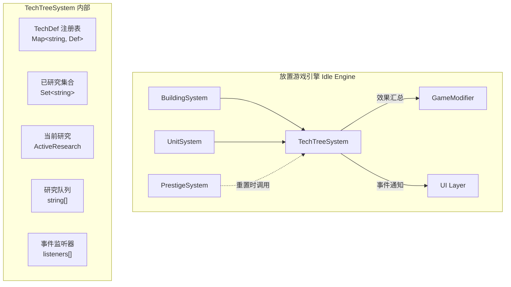

# TechTreeSystem 科技树子系统 — 架构审查报告

> **审查人**：系统架构师  
> **审查日期**：2025-07-10  
> **模块路径**：`src/engines/idle/modules/TechTreeSystem.ts`  
> **测试路径**：`src/engines/idle/__tests__/TechTreeSystem.test.ts`

---

## 1. 概览

### 1.1 代码度量

| 指标 | 数值 |
|------|------|
| 源码行数 | 240 行 |
| 测试行数 | 641 行 |
| 测试/代码比 | 2.67 : 1 |
| 公共方法数 | 14 |
| 私有方法数 | 4 |
| 接口/类型定义 | 5 个（`TechEffect`, `TechDef`, `ActiveResearch`, `TechTreeState`, `TechTreeEvent`） |
| 泛型参数 | 1 个（`Def extends TechDef`） |

### 1.2 依赖关系

```
TechTreeSystem（零外部依赖，纯 TypeScript）
├── 被导出于 → modules/index.ts（聚合导出）
├── 被测试于 → __tests__/TechTreeSystem.test.ts（Vitest）
└── 被使用于 → 暂无上游模块直接导入（独立子系统）
```

**依赖评价**：模块完全零外部依赖，仅使用 TypeScript 内置类型（`Map`, `Set`, `Date`），具备极高的可移植性和可测试性。这是放置游戏引擎子系统的理想设计。

### 1.3 架构定位图



---

## 2. 接口分析

### 2.1 类型定义评价

| 接口 | 评价 | 备注 |
|------|------|------|
| `TechEffect` | ✅ 良好 | 四种效果类型覆盖放置游戏核心需求 |
| `TechDef` | ✅ 良好 | 字段完整，`branch` 可选字段合理 |
| `ActiveResearch` | ✅ 良好 | 包含 start/end/progress 三要素 |
| `TechTreeState` | ⚠️ 未使用 | 已定义但代码中未引用，与 `saveState()` 返回类型不一致 |
| `TechTreeEvent` | ✅ 良好 | 事件类型完整，`data` 可扩展 |

### 2.2 公共 API 清单

```typescript
// 核心操作
research(id, resources): boolean        // 开始研究
canResearch(id, resources): boolean     // 前置检查
isResearched(id): boolean               // 状态查询
enqueue(id): boolean                    // 加入队列

// 状态查询
getEffects(): Record<string, number>    // 效果汇总
getPrerequisites(id): string[]          // 前置链（拓扑序）
getDependents(id): string[]             // 后续科技
getCurrentResearch(): ActiveResearch | null
getQueue(): string[]

// 生命周期
update(dt: number): void                // 每帧更新
reset(): void                           // 重置

// 持久化
saveState() / loadState()               // 状态快照
serialize() / deserialize()             // 别名

// 事件
onEvent(cb): () => void                 // 订阅/取消订阅
```

**接口设计优点**：
- API 表面积小（14 个公共方法），学习成本低
- 查询方法与修改方法职责清晰分离
- `onEvent` 返回取消函数，符合 React/Vue 生态惯例
- `getCurrentResearch()` 和 `getQueue()` 返回防御性拷贝，防止外部篡改

**接口设计不足**：
- `research()` 返回 `boolean`，失败原因不透明（7 种 false 场景无法区分）
- `update(_dt)` 接受 `dt` 参数但完全未使用，接口具有误导性
- `saveState()` 返回 `Record<string, unknown>` 而非已定义的 `TechTreeState`

---

## 3. 核心逻辑分析

### 3.1 科技节点注册

```typescript
constructor(defs: Def[]) {
  for (const def of defs) {
    if (this.techMap.has(def.id)) throw new Error(`Duplicate tech id: "${def.id}"`);
    this.techMap.set(def.id, def);
  }
}
```

**评价**：✅ 构造时一次性注册，重复 ID 检测到位。使用 `Map` 数据结构查找效率 O(1)。

**缺失**：未验证 `requires` 中引用的科技 ID 是否存在于注册表中，可能导致运行时静默失败。

### 3.2 前置条件检查

```typescript
if (!def.requires.every((r) => this.researched.has(r))) return false;
```

**评价**：✅ 使用 `Set.has()` 实现 O(1) 查找，`every()` 短路求值效率好。

**缺失**：无循环依赖检测。若定义 `A requires B` 且 `B requires A`，`getPrerequisites()` 会因 `visited` Set 而不无限递归，但逻辑上不应允许此类定义。

### 3.3 研究时间与进度

```typescript
this.current.progress = Math.min((Date.now() - this.current.startTime) / def.researchTime, 1);
```

**评价**：基于真实时间（`Date.now()`）计算进度，适配放置游戏离线收益场景。

**问题**：
- `update(_dt)` 参数 `dt` 被完全忽略，方法签名具有误导性
- 进度计算依赖系统时钟，测试中必须 mock `Date.now()`（当前测试通过 `vi.useFakeTimers()` 实现）
- 若 `researchTime` 为 0，将产生除零错误（`Infinity`）

### 3.4 效果应用

```typescript
if (e.type === 'multiplier') r[e.target] = (r[e.target] ?? 1) * e.value;
else if (e.type === 'modifier') r[e.target] = (r[e.target] ?? 0) + e.value;
else r[e.target] = 1;  // unlock / ability
```

**评价**：✅ multiplier 累乘 + modifier 累加的数学模型正确。

**问题**：
- `unlock` 和 `ability` 类型被合并处理为 `r[e.target] = 1`，无法区分"解锁"和"已解锁多次"
- `value` 字段对 `unlock`/`ability` 类型无实际意义，接口定义冗余
- 无效果移除机制（如科技被撤销），对 Prestige（转生）系统不友好

### 3.5 研究队列

```typescript
private startNext(): void {
  while (this.queue.length > 0 && !this.current) {
    const id = this.queue.shift()!;
    if (this.researched.has(id)) continue;
    const def = this.techMap.get(id);
    if (!def || !def.requires.every((r) => this.researched.has(r))) continue;
    // ... 启动研究
    break;
  }
}
```

**评价**：队列处理逻辑合理，跳过不满足前置条件的项。

**问题**：
- 队列中不满足前置条件的科技被**静默丢弃**（`shift` 后 `continue`），无事件通知
- 队列启动研究时**不检查资源**（与 `research()` 行为不一致），可能导致无资源时启动研究
- 队列无优先级机制，无重新排序能力

### 3.6 事件系统

```typescript
private emit(event: TechTreeEvent): void {
  for (const fn of this.listeners) { try { fn(event); } catch { /* 静默 */ } }
}
```

**评价**：✅ 发布-订阅模式，监听器异常不影响其他监听器。

**问题**：
- 异常被完全静默吞掉，调试困难
- 无 once（单次监听）支持
- 无事件历史记录，新订阅者无法获取已发生的事件

### 3.7 序列化/反序列化

**评价**：✅ 防御性编码到位，对非法类型（`number`、`null`）有过滤。

**问题**：
- `TechTreeState` 接口已定义但 `saveState()` 返回 `Record<string, unknown>`，类型不一致
- `loadState()` 未验证已研究科技的 ID 是否存在于当前 `techMap` 中，可能加载到无效状态
- 反序列化后 `current` 的 `progress` 被硬设为 0，而非根据时间重新计算

---

## 4. 问题清单

### 🔴 严重问题

#### P1：`startNext()` 队列启动不检查资源
- **位置**：第 228-237 行
- **影响**：玩家可在资源不足时将科技入队，队列自动启动后免费研究
- **复现**：`enqueue('mining_1')` → `update()` → 即使 gold=0 也开始研究
- **修复建议**：
```typescript
private startNext(): void {
  while (this.queue.length > 0 && !this.current) {
    const id = this.queue.shift()!;
    if (this.researched.has(id)) continue;
    const def = this.techMap.get(id);
    if (!def || !def.requires.every((r) => this.researched.has(r))) continue;
    // ✅ 新增：资源检查（需要传入资源快照或回调）
    // if (!this.checkResources(def.cost)) continue;  // 或跳过并通知
    const now = Date.now();
    this.current = { techId: id, startTime: now, endTime: now + def.researchTime, progress: 0 };
    this.emit({ type: 'research_started', techId: id, data: { techId: id, name: def.name, fromQueue: true } });
    break;
  }
}
```

#### P2：`researchTime` 为 0 时除零错误
- **位置**：第 165 行
- **影响**：`progress` 计算结果为 `Infinity` 或 `NaN`，导致研究永远无法完成
- **修复建议**：在构造函数或 `research()` 中验证 `researchTime > 0`

#### P3：`research()` 资源扣除但无回调通知
- **位置**：第 93 行 `this.recordInvestment(def.cost)`
- **影响**：`research()` 内部记录了投入，但调用方无法知道哪些资源被扣除了（返回值仅为 `boolean`）。调用方必须自行维护资源扣减逻辑，容易与系统内部状态不同步
- **修复建议**：返回扣除的资源详情，或提供 `ResourceDeductor` 回调接口

### 🟡 中等问题

#### P4：`update(_dt)` 参数被忽略
- **位置**：第 161 行
- **影响**：接口误导 — 调用方传入 `dt` 但系统使用 `Date.now()` 计算，两种时间源可能不一致（如暂停游戏时 `dt=0` 但真实时间流逝）
- **修复建议**：移除 `dt` 参数，或改为接受 `now: number` 参数

#### P5：`TechTreeState` 接口定义但未使用
- **位置**：第 45-50 行（定义），第 174-180 行（`saveState` 返回 `Record<string, unknown>`）
- **影响**：类型安全丧失，`loadState()` 参数无类型约束
- **修复建议**：
```typescript
saveState(): TechTreeState { ... }
loadState(data: Partial<TechTreeState>): void { ... }
```

#### P6：队列项被静默丢弃无事件
- **位置**：第 231-233 行
- **影响**：玩家加入队列的科技因前置不满足被移除时无通知，UI 无法反馈
- **修复建议**：新增 `research_queue_skipped` 事件类型

#### P7：无循环依赖检测
- **位置**：构造函数第 72-81 行
- **影响**：若定义中存在 `A → B → A` 循环，`getPrerequisites()` 不会死循环（有 visited），但语义上不应允许
- **修复建议**：构造时执行 DAG 验证

#### P8：事件监听器异常被静默吞掉
- **位置**：第 212 行
- **影响**：监听器中的 bug 极难排查
- **修复建议**：至少 `console.warn` 输出异常信息

#### P9：`loadState()` 未验证科技 ID 有效性
- **位置**：第 184 行
- **影响**：加载存档后 `researched` 中可能包含当前版本不存在的科技 ID，导致 `getEffects()` 静默跳过
- **修复建议**：加载时过滤或警告无效 ID

### 🟢 轻微问题

#### P10：`getEffects()` 每次调用重新计算
- **位置**：第 113-125 行
- **影响**：高频调用场景（如每帧 UI 更新）存在不必要的重复计算
- **修复建议**：添加 dirty flag + 缓存机制

#### P11：`getDependents()` 使用 `Array.includes()` 线性查找
- **位置**：第 144 行
- **影响**：科技数量大时（>100）性能退化
- **修复建议**：维护反向索引 Map

#### P12：`unlock`/`ability` 效果类型的 `value` 字段无意义
- **位置**：`TechEffect.value` 定义
- **影响**：接口语义不清
- **修复建议**：使用联合类型区分不同效果的 payload

#### P13：`listeners` 取消订阅使用 `splice` 在遍历场景下不安全
- **位置**：第 206 行
- **影响**：若在事件回调中取消订阅，可能导致跳过后续监听器
- **修复建议**：使用 `filter` 替换或在 `emit` 后统一清理

---

## 5. 放置游戏适配性分析

### 5.1 离线进度 ✅

系统使用 `Date.now()` 真实时间计算进度，天然支持离线进度。玩家关闭游戏后重新打开，`update()` 会根据当前时间自动补算进度。这是放置游戏的核心需求，实现正确。

### 5.2 转生/重置 ⚠️

`reset()` 方法清除所有状态，但：
- 无"部分重置"能力（如保留某些分支）
- 无"转生货币"概念（PrestigeSystem 需要的）
- `getEffects()` 无反向操作，外部系统需自行处理效果移除

### 5.3 数值膨胀 ⚠️

`multiplier` 效果累乘，高阶科技叠加后数值可能溢出浮点精度：
- 10 个 x2 效果 = x1024
- 50 个 x2 效果 = x1.12 × 10^15

建议引入 `BigDecimal` 或对数值上限做 clamp。

### 5.4 玩家体验缺失

| 放置游戏常见需求 | 当前支持 |
|:---|:---:|
| 离线进度 | ✅ |
| 研究队列 | ✅ |
| 研究加速/跳过 | ❌ |
| 科技分支选择 | ❌（仅 branch 标记） |
| 科技重置/洗点 | ❌ |
| 研究速度加成 | ❌ |
| 条件解锁（非前置） | ❌ |
| 科技等级/重复研究 | ❌ |

---

## 6. 测试覆盖分析

### 6.1 覆盖矩阵

| 方法 | 正常路径 | 边界情况 | 异常情况 |
|------|:---:|:---:|:---:|
| `constructor` | ✅ | ✅ 空数组 | ✅ 重复 ID |
| `research` | ✅ | ✅ 资源刚好够 | ✅ 7 种失败场景 |
| `isResearched` | ✅ | — | — |
| `canResearch` | ✅ | — | ✅ 不存在/已研究 |
| `getEffects` | ✅ 累乘/累加 | ✅ 空状态 | — |
| `getPrerequisites` | ✅ | ✅ 无前置 | ✅ 不存在 |
| `getDependents` | ✅ | ✅ 无后续 | — |
| `enqueue` | ✅ | ✅ 重复入队 | ✅ 不存在/已研究 |
| `update` | ✅ 进度更新 | ✅ 无当前研究 | — |
| `events` | ✅ | ✅ 多监听器 | ✅ 取消订阅 |
| `serialize/deserialize` | ✅ | ✅ 初始状态 | ✅ 非法数据 |
| `reset` | ✅ | — | — |
| 泛型支持 | ✅ | — | — |

### 6.2 测试盲区

1. **P1 资源绕过**：无测试验证队列启动时资源不足的场景
2. **`researchTime = 0`**：无测试覆盖零研究时间的边界情况
3. **循环依赖**：无测试验证循环前置条件的处理
4. **`loadState` 后 `update`**：无测试验证反序列化后进度恢复的正确性
5. **大量科技性能**：无压力测试
6. **并发研究**：无测试验证 `research()` 在 `current` 刚被 `complete()` 清空后的竞态

### 6.3 测试质量评价

- **测试结构**：✅ 使用嵌套 `describe` 分组，组织清晰
- **测试数据**：✅ `BASIC_TECHS` 覆盖线性链 + 跨分支依赖
- **时间 mock**：✅ 正确使用 `vi.useFakeTimers()` + `advanceTimersByTime()`
- **断言精度**：✅ 使用 `toBeCloseTo()` 处理浮点比较
- **测试独立性**：✅ `beforeEach` 重建实例，无测试间污染

---

## 7. 改进建议

### 7.1 短期改进（1-2 天）

| 优先级 | 改进项 | 工作量 |
|:---:|------|:---:|
| 🔴 | 修复 `startNext()` 资源检查缺失（P1） | 2h |
| 🔴 | 添加 `researchTime > 0` 验证（P2） | 30min |
| 🟡 | 统一 `saveState/loadState` 使用 `TechTreeState` 类型（P5） | 1h |
| 🟡 | 移除 `update()` 的 `dt` 参数或改用 `now`（P4） | 1h |
| 🟡 | 队列跳过时发送事件通知（P6） | 30min |
| 🟢 | 事件监听器异常添加 `console.warn`（P8） | 15min |

### 7.2 中期改进（1 周）

1. **引入资源回调接口**：解耦资源管理
```typescript
interface ResourceManager {
  hasEnough(cost: Record<string, number>): boolean;
  deduct(cost: Record<string, number>): void;
}
```

2. **添加 DAG 验证**：构造时检测循环依赖和悬空引用
```typescript
private validateDAG(): void {
  // 拓扑排序检测环 + requires 引用完整性
}
```

3. **效果系统增强**：支持效果移除和条件效果
```typescript
interface TechEffect {
  type: 'multiplier' | 'modifier' | 'unlock' | 'ability' | 'conditional';
  target: string;
  value: number;
  condition?: string;  // 条件表达式
  description: string;
}
```

4. **研究加速机制**：放置游戏核心玩法
```typescript
speedUp(techId: string, factor: number): void;
instantComplete(techId: string): void;
```

### 7.3 长期演进（1 月+）

1. **科技树可视化支持**：提供布局数据接口
```typescript
getTreeLayout(): { nodes: TreeNode[]; edges: TreeEdge[] };
```

2. **模块化效果引擎**：将 `getEffects()` 抽取为独立的 `EffectAggregator`，支持其他系统复用

3. **配置驱动**：支持 JSON/YAML 定义科技树，运行时热加载

4. **数值平衡工具**：集成曲线分析，自动检测数值膨胀风险

---

## 8. 综合评分

| 维度 | 分数 | 说明 |
|------|:---:|------|
| **接口设计** | 4/5 | API 简洁清晰，泛型支持好；返回值信息量不足，`TechTreeState` 未使用 |
| **数据模型** | 4/5 | 核心模型完整，效果类型丰富；缺少联合类型细化，`value` 语义模糊 |
| **核心逻辑** | 3/5 | 前置检查/效果汇总正确；队列资源绕过严重，`update` 接口误导 |
| **可复用性** | 5/5 | 零依赖、泛型设计、事件驱动，几乎可在任何 TS 项目中直接使用 |
| **性能** | 4/5 | Map/Set 查找高效；`getEffects()` 无缓存，`getDependents()` 无反向索引 |
| **测试覆盖** | 4/5 | 覆盖率高、结构清晰；缺少资源绕过、零研究时间、循环依赖等边界测试 |
| **放置游戏适配** | 3/5 | 离线进度支持好；缺少加速、洗点、条件解锁、数值膨胀防护 |

### 总分：27 / 35（77%）

```
接口设计    ████████░░  4/5
数据模型    ████████░░  4/5
核心逻辑    ██████░░░░  3/5
可复用性    ██████████  5/5
性能        ████████░░  4/5
测试覆盖    ████████░░  4/5
放置游戏适配 ██████░░░░  3/5
            ─────────────
总分        27/35 (77%)
```

### 评级：**B+（良好）**

> **总结**：TechTreeSystem 是一个设计简洁、零依赖的高质量子系统。泛型支持和事件驱动架构使其具备优秀的可复用性。核心问题集中在**队列资源检查缺失**（P1）和**放置游戏高级特性不足**（加速/洗点/条件解锁）。建议优先修复 P1 安全漏洞，然后按中期路线图逐步增强放置游戏适配能力。
