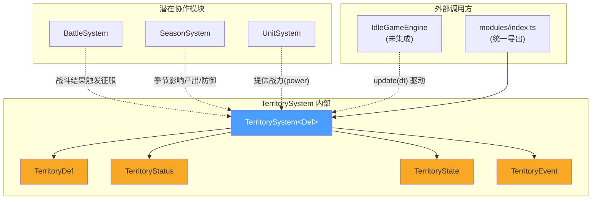
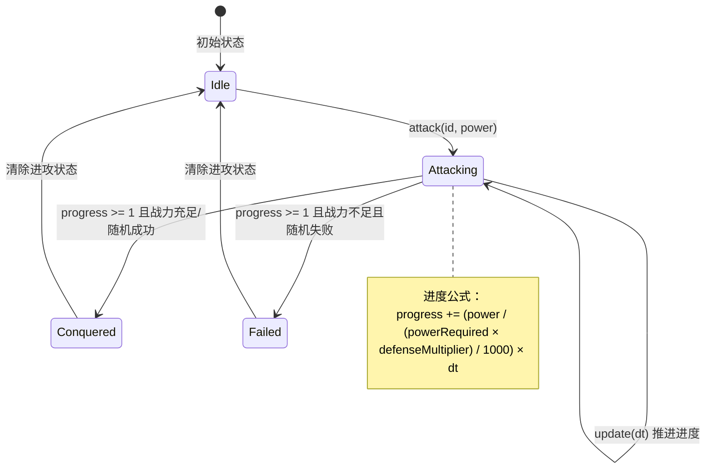
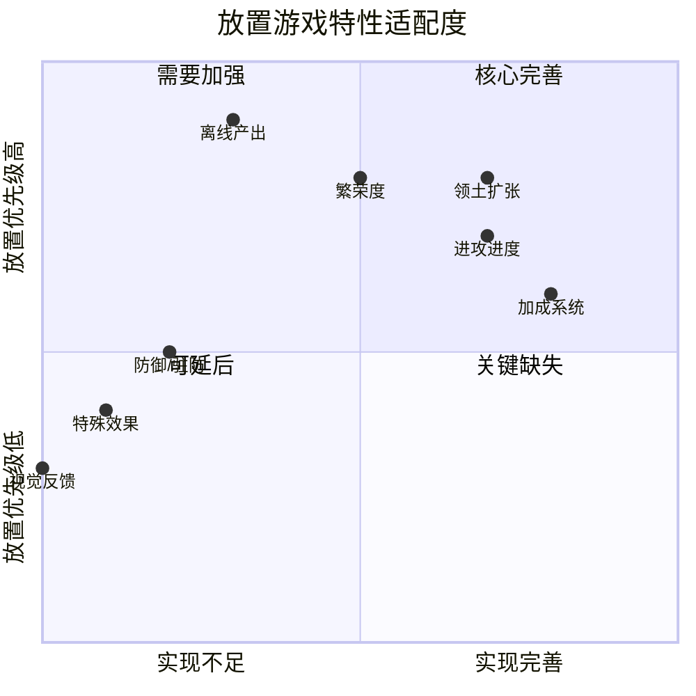

# TerritorySystem 领土子系统 — 架构审查报告

> **审查人**：系统架构师  
> **审查日期**：2025-07-11  
> **模块路径**：`src/engines/idle/modules/TerritorySystem.ts`  
> **测试路径**：`src/engines/idle/__tests__/TerritorySystem.test.ts`  
> **模块级别**：P2（放置游戏引擎核心模块）

---

## 一、概览

### 1.1 代码度量

| 指标 | 值 |
|------|-----|
| 源码行数 | 225 行 |
| 测试行数 | 757 行 |
| 测试/代码比 | 3.36:1 |
| 公共方法数 | 17 |
| 私有方法数 | 4 |
| 接口/类型数 | 4（TerritoryDef, TerritoryStatus, TerritoryState, TerritoryEvent） |
| 泛型参数 | 1（`Def extends TerritoryDef`） |
| 外部依赖 | **零**（纯 TypeScript，无第三方依赖） |

### 1.2 依赖关系



### 1.3 架构定位

TerritorySystem 是一个**自包含的领土征服子系统**，以图结构管理领土节点，提供进攻→征服→加成→产出的完整生命周期。作为 P2 模块，它目前**尚未被 IdleGameEngine 集成**，仅通过 `modules/index.ts` 统一导出。

---

## 二、接口分析

### 2.1 数据模型评估

```typescript
// 核心定义接口
interface TerritoryDef {
  id: string;                    // ✅ 唯一标识
  name: string;                  // ✅ 显示名称
  powerRequired: number;         // ⚠️ 基础战力需求，但缺乏范围约束
  rewards: Record<string, number>;       // ✅ 灵活的奖励映射
  conquestBonus?: Record<string, number>; // ✅ 可选加成
  adjacent: string[];            // ⚠️ 字符串引用，无编译时校验
  type: 'plains' | 'mountain' | ...;     // ✅ 联合类型
  defenseMultiplier: number;     // ⚠️ 无下界约束，可设为 0 或负数
  level: number;                 // ⚠️ 无范围约束
  specialEffect?: string;        // 🔴 字符串类型，缺乏类型安全
  position: { x: number; y: number };    // ✅ 坐标定位
}
```

**接口设计优点**：
- `Record<string, number>` 的奖励/加成设计灵活，支持任意资源类型
- `type` 使用联合类型而非 enum，tree-shaking 友好
- `conquestBonus` 设为可选，零加成领土无需空对象
- 泛型 `TerritorySystem<Def>` 允许扩展定义

**接口设计问题**：

| # | 问题 | 严重度 | 说明 |
|---|------|--------|------|
| 1 | `specialEffect: string` 无类型约束 | 🔴 | 无法在编译时发现拼写错误，也无法穷举处理 |
| 2 | `defenseMultiplier` 无最小值保证 | 🟡 | 为 0 时 `eff=0`，进攻进度直接跳满 |
| 3 | `TerritoryState` 接口已导出但从未使用 | 🟢 | 死代码，增加维护负担 |
| 4 | `adjacent` 缺乏图完整性校验 | 🟡 | 可声明不存在的相邻领土，运行时不报错 |
| 5 | 缺少 `TerritoryConfig` 配置接口 | 🟡 | 繁荣度增长率、初始繁荣度等硬编码在实现中 |

### 2.2 公共 API 审查

```
┌──────────────────────────────────────────────────────────────┐
│                    TerritorySystem API                        │
├──────────────┬───────────────────────────────────────────────┤
│ 生命周期      │ constructor(defs)                             │
│              │ reset()                                       │
│              │ serialize() / deserialize(data)               │
│              │ saveState() / loadState(data)                 │
├──────────────┼───────────────────────────────────────────────┤
│ 进攻/征服     │ attack(id, power) → boolean                  │
│              │ conquer(id) → { rewards, bonus }              │
│              │ canAttack(id) → boolean                       │
│              │ isConquered(id) → boolean                     │
├──────────────┼───────────────────────────────────────────────┤
│ 产出/加成     │ getBonus() → Record<string, number>          │
│              │ getIncomePerSecond() → Record<string, number> │
├──────────────┼───────────────────────────────────────────────┤
│ 状态查询      │ getTerritoryStatus(id)                       │
│              │ getDef(id) / getAllDefs()                     │
│              │ getAttackInfo() / getConqueredIds()           │
├──────────────┼───────────────────────────────────────────────┤
│ 操作         │ setGarrison(id, garrison)                     │
│              │ update(dt)                                    │
├──────────────┼───────────────────────────────────────────────┤
│ 事件         │ onEvent(cb) → unsubscribe fn                  │
└──────────────┴───────────────────────────────────────────────┘
```

**API 设计亮点**：
- `onEvent` 返回取消订阅函数，符合 React/Vue 生态惯例
- `getTerritoryStatus` 返回浅拷贝 `{ ...s }`，防止外部直接修改内部状态
- `serialize/deserialize` + `saveState/loadState` 双别名，兼容不同序列化场景

**API 设计问题**：

| # | 问题 | 严重度 | 说明 |
|---|------|--------|------|
| 1 | `conquer()` 是公开方法，可跳过进攻直接征服 | 🔴 | 破坏了"进攻→征服"的游戏流程 |
| 2 | `attackPower` 无法从外部读取 | 🟡 | 进攻中无法查询当前投入的战力 |
| 3 | `saveState/loadState` 与 `serialize/deserialize` 完全重复 | 🟢 | 违反 DRY，增加维护成本 |
| 4 | 缺少 `cancelAttack()` 方法 | 🟡 | 进攻开始后无法主动取消 |
| 5 | 缺少 `getAttackableIds()` 批量查询 | 🟢 | 调用方需遍历所有领土逐个 `canAttack` |

---

## 三、核心逻辑分析

### 3.1 进攻流程



**进攻进度公式分析**：

```
speed = attackPower / (powerRequired × defenseMultiplier) / 1000  (per ms)
progress += speed × dt
```

- 当 `eff = powerRequired × defenseMultiplier = 0` 时，`speed` 为 `Infinity`，进度直接跳满 → **边界缺陷**
- 进度达到 1.0 后调用 `resolveAttack()`，存在**战力不足仍可随机成功**的机制
- 随机数使用 DJB2 确定性哈希，相同输入永远产生相同结果 → **可预测/可作弊**

**resolveAttack 判定逻辑**：

```typescript
const ok = this.attackPower >= eff 
  || this.deterministicRandom(tid, this.totalPower) < this.attackPower / eff;
```

| 条件 | 结果 | 分析 |
|------|------|------|
| `attackPower >= eff` | 必定成功 | ✅ 战力碾压直接通过 |
| `attackPower < eff` 但随机值 < 比率 | 成功 | ⚠️ 低战力有概率翻盘 |
| `attackPower < eff` 且随机值 >= 比率 | 失败 | ✅ 正常失败 |
| `attackPower = 0` | 比率 = 0，必定失败 | ✅ 正确 |

### 3.2 产出系统

**产出公式**：

```
income = baseReward × (prosperity / 100) × (level × 0.5)
```

| 问题 | 说明 |
|------|------|
| `level = 0` 时产出恒为 0 | 领土等级未做最小值约束 |
| 繁荣度从 10 开始 | 征服后初始繁荣度硬编码为 10 |
| 繁荣度增长率极慢 | 基础速率 0.0001/ms = 0.1/s，从 10→100 需约 900,000ms（15分钟） |
| `specialEffect` 未使用 | `double_income` 等特殊效果在产出计算中完全未处理 |

### 3.3 防御系统

- `defenseMultiplier` 作为纯数值乘数，缺乏策略深度
- `garrison`（驻防）仅影响繁荣度增长速率，**不参与防御计算**
- 缺少"被进攻"机制（AI 反攻/领土丢失）

### 3.4 扩张系统

- 基于相邻关系的图扩张，逻辑正确
- 首个领土（如 home）必须通过 `conquer()` 直接征服（因为无已征服相邻领土）
- 缺乏"远程扩张"或"跳跃扩张"的高级机制

---

## 四、问题清单

### 🔴 严重问题（4 个）

#### S-1: `conquer()` 公开暴露，破坏游戏流程

- **位置**：`TerritorySystem.ts:67-82`
- **问题**：`conquer()` 是公开方法，任何调用方都可以跳过进攻阶段直接征服领土，破坏了"进攻→进度→征服"的核心游戏循环
- **影响**：游戏逻辑完整性受损，可能导致作弊或意外调用
- **修复建议**：
  ```typescript
  // 方案 A：将 conquer 降为 internal（通过友元包或符号键）
  private conquer(id: string): { ... }
  
  // 方案 B：增加来源校验
  conquer(id: string, source: 'attack' | 'admin'): { ... }
  ```

#### S-2: `specialEffect` 字段声明但从未生效

- **位置**：`TerritoryDef` 接口（第 18 行），`getIncomePerSecond()` 方法（第 93 行）
- **问题**：`specialEffect?: string` 被定义但整个系统中没有任何代码读取或处理它。测试数据中 `capital_1` 声明了 `specialEffect: 'double_income'`，但王都产出并未翻倍
- **影响**：功能缺失，领土类型缺乏差异化
- **修复建议**：
  ```typescript
  // 定义效果类型和处理映射
  type SpecialEffect = 'double_income' | 'defense_boost' | 'prosperity_boost';
  const EFFECT_HANDLERS: Record<SpecialEffect, (ctx: IncomeContext) => number> = { ... }
  ```

#### S-3: `defenseMultiplier = 0` 导致进度瞬间跳满

- **位置**：`updateAttack()` 方法（第 148 行）
- **问题**：当 `eff = powerRequired × defenseMultiplier = 0` 时，`attackProgress += 1`（硬编码跳满），任何进攻瞬间完成
- **影响**：数据配置错误时可被利用
- **修复建议**：
  ```typescript
  const eff = Math.max(1, def.powerRequired * def.defenseMultiplier);
  ```

#### S-4: 确定性随机数可被预测和利用

- **位置**：`deterministicRandom()` 方法（第 183-187 行）+ `resolveAttack()` 方法（第 164 行）
- **问题**：DJB2 哈希产生的随机值完全由 `territoryId + totalPower` 决定。玩家只要记住 `totalPower` 值，就能预知进攻是否成功，选择性地只在"会成功"时进攻
- **影响**：游戏公平性受损
- **修复建议**：
  ```typescript
  // 引入不可预测的种子源
  private attackSeed: number = 0;
  
  attack(id: string, power: number): boolean {
    // ...
    this.attackSeed = Date.now(); // 或 crypto.getRandomValues
  }
  
  private deterministicRandom(tid: string): number {
    let h = this.attackSeed | 0;
    // ...
  }
  ```

### 🟡 中等问题（6 个）

#### M-1: `attackPower` 状态不可查询

- **位置**：`attackPower` 私有字段（第 38 行）
- **问题**：进攻开始后，外部无法获取当前进攻投入的战力值
- **修复建议**：在 `getAttackInfo()` 返回值中增加 `power` 字段

#### M-2: 缺少 `cancelAttack()` 方法

- **位置**：公共 API
- **问题**：进攻开始后无法主动取消，只能等进攻完成或重置整个系统
- **修复建议**：增加 `cancelAttack(): boolean` 方法

#### M-3: 繁荣度增长参数全部硬编码

- **位置**：`updateProsperity()` 方法（第 175-179 行）
- **问题**：基础增长率 `0.0001`、驻防加成 `0.00005`、上限 `100` 均为魔法数字
- **修复建议**：抽取为 `TerritoryConfig` 接口参数

#### M-4: `TerritoryState` 接口导出但未使用

- **位置**：接口定义（第 22-26 行）
- **问题**：`TerritoryState` 被导出但系统内部使用 `Set<string>` + `Record<string, TerritoryStatus>` 组合，接口与实现不一致
- **修复建议**：删除或重构内部状态以匹配接口

#### M-5: `adjacent` 引用无完整性校验

- **位置**：构造函数（第 42-48 行）
- **问题**：构造时只检查重复 ID，不验证 `adjacent` 引用的领土是否存在
- **修复建议**：
  ```typescript
  for (const d of defs) {
    for (const adj of d.adjacent) {
      if (!this.defMap.has(adj))
        console.warn(`[TerritorySystem] "${d.id}" references unknown adjacent "${adj}"`);
    }
  }
  ```

#### M-6: 事件监听器使用数组 splice，大规模时性能退化

- **位置**：`onEvent()` 取消订阅逻辑（第 140 行）
- **问题**：`Array.splice()` 为 O(n)，若注册大量监听器（虽不太可能），频繁订阅/取消会影响性能
- **修复建议**：使用 `Set` 替代数组存储监听器

### 🟢 轻微问题（4 个）

#### L-1: `saveState/loadState` 与 `serialize/deserialize` 完全重复

- **位置**：第 127-131 行
- **问题**：两对方法功能完全相同，违反 DRY 原则
- **修复建议**：保留一对，另一对标记 `@deprecated`

#### L-2: `emit()` 中异常被静默吞掉

- **位置**：第 145 行 `catch { /* 静默 */ }`
- **问题**：监听器抛出的异常被完全忽略，不利于调试
- **修复建议**：至少在开发模式下打印 `console.warn`

#### L-3: `conqueredAt` 使用 `Date.now()` 导致测试不确定性

- **位置**：`conquer()` 方法（第 72 行）
- **问题**：直接调用 `Date.now()` 使测试依赖系统时间
- **修复建议**：注入时钟函数 `now: () => number = Date.now`

#### L-4: `position` 字段在系统中未使用

- **位置**：`TerritoryDef.position`（第 19 行）
- **问题**：坐标信息在系统中完全未使用，仅作为数据载体
- **影响**：轻微，可能是为渲染层预留

---

## 五、测试覆盖分析

### 5.1 覆盖矩阵

| 方法 | 有测试 | 边界测试 | 异常测试 |
|------|:------:|:--------:|:--------:|
| `constructor` | ✅ | ✅ 空数组 | ✅ 重复 ID |
| `conquer` | ✅ | ✅ 初始繁荣度 | ✅ 不存在 ID |
| `isConquered` | ✅ | — | — |
| `canAttack` | ✅ | ✅ 征服链条 | ✅ 不存在/已征服 |
| `attack` | ✅ | ✅ 多种拒绝条件 | — |
| `update` (进攻) | ✅ | ✅ dt≤0 | — |
| `update` (繁荣) | ✅ | ✅ 上限100 | — |
| `getBonus` | ✅ | ✅ 累加 | — |
| `getIncomePerSecond` | ✅ | ✅ 公式验证 | — |
| `setGarrison` | ✅ | ✅ 负数截断 | ✅ 未征服/不存在 |
| `serialize/deserialize` | ✅ | ✅ 完整往返 | ✅ 无效数据 |
| `reset` | ✅ | — | — |
| `onEvent` | ✅ | ✅ 多监听器 | ✅ 异常隔离 |
| 泛型支持 | ✅ | — | — |

### 5.2 测试盲区

| 缺失测试 | 严重度 | 说明 |
|----------|--------|------|
| `defenseMultiplier = 0` 的进攻行为 | 🔴 | 边界条件未覆盖 |
| `resolveAttack` 随机成功/失败路径 | 🔴 | 核心分支未测试 |
| `totalPower` 累计行为 | 🟡 | 多次进攻后 `totalPower` 的累积是否正确 |
| 并发进攻取消场景 | 🟡 | 无 `cancelAttack`，但也未测试进攻中 `reset` |
| `getDef` 返回的是引用还是拷贝 | 🟡 | 返回原始对象引用，外部可修改定义 |
| 大规模领土（1000+ 节点）性能 | 🟢 | 无压力测试 |

---

## 六、放置游戏适配评估

### 6.1 放置特性适配度



### 6.2 关键放置游戏适配问题

| 特性 | 当前状态 | 适配评估 |
|------|----------|----------|
| **离线产出** | `getIncomePerSecond()` 仅计算瞬时值，无离线累积 | 🔴 放置游戏核心缺失 |
| **挂机收益** | 繁荣度需 `update()` 持续调用才增长，离线不增长 | 🔴 离线期间繁荣度停滞 |
| **进度感** | 进攻进度线性增长，缺乏加速/倍率机制 | 🟡 长期玩家体验单调 |
| **策略深度** | 驻防仅影响繁荣度，不影响防御 | 🟡 策略维度不足 |
| **领土差异化** | 6 种类型仅影响 `defenseMultiplier`，`specialEffect` 未实现 | 🟡 领土同质化严重 |
| **声望/重置** | `reset()` 清除所有状态，无声望加成保留 | 🟢 可与 PrestigeSystem 协作 |

---

## 七、改进建议

### 7.1 短期改进（1-2 天）

| 优先级 | 改进项 | 工作量 |
|--------|--------|--------|
| P0 | 将 `conquer()` 改为内部方法或增加来源校验 | 0.5h |
| P0 | 修复 `defenseMultiplier = 0` 边界：`Math.max(1, eff)` | 0.5h |
| P0 | 为 `resolveAttack` 的随机成功/失败路径补充测试 | 1h |
| P1 | 在 `getAttackInfo()` 中暴露 `attackPower` | 0.5h |
| P1 | 增加 `cancelAttack()` 方法 | 0.5h |
| P1 | 实现 `specialEffect` 的 `double_income` 处理 | 1h |
| P2 | 将繁荣度增长参数抽取为配置常量 | 0.5h |

### 7.2 长期改进（1-2 周）

#### LA-1: 离线产出计算

```typescript
/** 计算离线期间的累计产出 */
calculateOfflineIncome(offlineMs: number): Record<string, number> {
  const income = this.getIncomePerSecond();
  const result: Record<string, number> = {};
  for (const [k, v] of Object.entries(income)) {
    result[k] = v * (offlineMs / 1000);
  }
  return result;
}
```

#### LA-2: 领土类型效果系统

```typescript
interface TerritoryTypeConfig {
  incomeMultiplier: number;
  prosperityRate: number;
  defenseBonus: number;
  specialAbilities: SpecialEffect[];
}

const TERRITORY_TYPE_CONFIGS: Record<TerritoryDef['type'], TerritoryTypeConfig> = {
  plains:   { incomeMultiplier: 1.0, prosperityRate: 1.0, defenseBonus: 0, specialAbilities: [] },
  mountain: { incomeMultiplier: 0.8, prosperityRate: 0.7, defenseBonus: 0.5, specialAbilities: [] },
  forest:   { incomeMultiplier: 1.2, prosperityRate: 1.1, defenseBonus: 0.2, specialAbilities: [] },
  desert:   { incomeMultiplier: 0.6, prosperityRate: 0.5, defenseBonus: 0.3, specialAbilities: [] },
  coastal:  { incomeMultiplier: 1.5, prosperityRate: 1.3, defenseBonus: -0.1, specialAbilities: [] },
  capital:  { incomeMultiplier: 2.0, prosperityRate: 1.5, defenseBonus: 1.0, specialAbilities: ['double_income'] },
};
```

#### LA-3: 防御与驻防重构

```typescript
// 驻防参与防御计算
private getEffectiveDefense(def: Def, garrison: number): number {
  const base = def.powerRequired * def.defenseMultiplier;
  const garrisonBonus = garrison * GARRISON_DEFENSE_FACTOR;
  return base + garrisonBonus;
}

// AI 反攻机制
interface ThreatLevel { territoryId: string; chance: number; interval: number }
```

#### LA-4: 与其他系统的集成接口

```typescript
// 为 IdleGameEngine 设计集成接口
interface TerritoryIntegration {
  /** 从 UnitSystem 获取可用战力 */
  getAvailablePower(): number;
  /** 将产出注入资源系统 */
  onIncome(income: Record<string, number>): void;
  /** 季节效果回调 */
  onSeasonChange(season: Season): void;
}
```

---

## 八、综合评分

| 维度 | 分数 (1-5) | 评语 |
|------|:----------:|------|
| **接口设计** | 3.5 | 泛型扩展性好，但 `specialEffect` 无类型安全、`conquer` 过度暴露 |
| **数据模型** | 3.5 | 核心模型清晰，但缺乏校验约束、配置接口和图完整性验证 |
| **核心逻辑** | 3.0 | 进攻/产出基本正确，但边界条件处理不足、随机数可预测 |
| **可复用性** | 4.0 | 零依赖、泛型设计、事件驱动，复用性优秀 |
| **性能** | 4.5 | 数据结构合理（Map + Set），无内存泄漏风险，O(n) 遍历可接受 |
| **测试覆盖** | 3.5 | 公共 API 覆盖全面，但核心分支（随机判定、边界值）有盲区 |
| **放置游戏适配** | 2.5 | 缺少离线产出、领土差异化不足、驻防策略深度不够 |

### 总分：24.5 / 35

```
  接口设计    ████████░░  3.5/5
  数据模型    ████████░░  3.5/5
  核心逻辑    ███████░░░  3.0/5
  可复用性    █████████░  4.0/5
  性能        █████████░  4.5/5
  测试覆盖    ████████░░  3.5/5
  放置适配    █████░░░░░  2.5/5
  ─────────────────────────────
  总分        24.5/35 (70%)
```

### 总评

TerritorySystem 是一个**结构清晰、零依赖、泛型友好**的领土征服子系统，在可复用性和性能方面表现优秀。主要短板集中在：

1. **放置游戏核心缺失**：无离线产出计算，这是放置游戏的命脉功能
2. **游戏逻辑完整性**：`conquer()` 过度暴露、`specialEffect` 未实现、随机数可预测
3. **策略深度不足**：领土类型同质化、驻防不参与防御、缺乏高级扩张机制

建议优先修复 🔴 严重问题（预计 2-3 小时），然后逐步补充离线产出和领土差异化功能，使其真正适配放置游戏的核心玩法循环。
