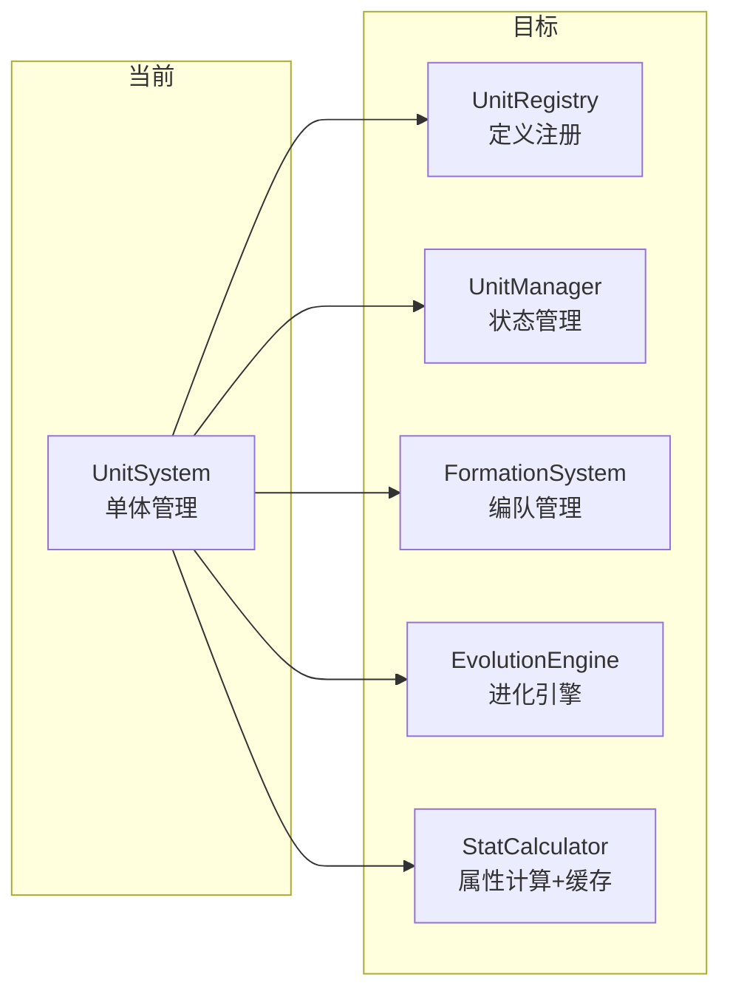

# UnitSystem 角色/单位子系统 — 架构审查报告

> **审查日期**: 2025-07-10  
> **审查人**: 系统架构师  
> **源码路径**: `src/engines/idle/modules/UnitSystem.ts`  
> **测试路径**: `src/engines/idle/__tests__/UnitSystem.test.ts`  
> **模块层级**: P1（放置游戏核心子系统）

---

## 1. 概览

### 1.1 基本指标

| 指标 | 数值 |
|------|------|
| 源码行数 | 631 行 |
| 测试行数 | 776 行 |
| 公共方法数 | 13 |
| 私有方法数 | 2 |
| 类型/接口数 | 7（UnitRarity, MaterialCost, EvolutionBranch, UnitDef, UnitState, UnitSystemEvent, UnitResult） |
| 测试用例数 | 59 |
| 测试/代码比 | 1.23:1 |
| 外部依赖 | 0（纯 TypeScript） |
| 被依赖方 | 仅 index.ts 导出 + 测试文件，**尚无业务模块直接消费** |

### 1.2 模块定位

```
┌─────────────────────────────────────────────────────────┐
│                    放置游戏引擎                           │
├──────────┬──────────┬──────────┬────────────────────────┤
│ P0 核心  │ P1 扩展  │ P2 高级  │    工具层               │
├──────────┼──────────┼──────────┼────────────────────────┤
│ Building │ UnitSys  │ Battle   │ CanvasUIRenderer       │
│ Prestige │ StageSys │ Season   │ InputHandler           │
│ Unlock   │ Particle │ Crafting │ StatisticsTracker      │
│          │ FloatTxt │ Expedition│                        │
│          │          │ TechTree │                        │
│          │          │ Territory│                        │
└──────────┴──────────┴──────────┴────────────────────────┘
                  ▲
            UnitSystem（本次审查）
```

UnitSystem 在放置游戏引擎中属于 **P1 扩展层**，负责角色招募、经验升级、进化等核心玩法。当前状态为 **"已定义但未集成"**——仅通过 `index.ts` 统一导出，尚无 BattleSystem、ExpeditionSystem 等下游模块实际引用。

### 1.3 架构关系图

```mermaid
graph TB
    subgraph UnitSystem
        DEF[UnitDef 注册表] --> STATE[UnitState 状态表]
        STATE --> UNLOCK[unlock 招募]
        STATE --> EXP[addExp 经验]
        STATE --> EVOLVE[evolve 进化]
        UNLOCK --> EVENT[事件总线]
        EXP --> EVENT
        EVOLVE --> CHECK[checkEvolution]
        CHECK --> EVENT
    end

    subgraph 下游消费者（预期）
        BATTLE[BattleSystem] -->|getBonus| UnitSystem
        EXPEDITION[ExpeditionSystem] -->|getUnits| UnitSystem
        EQUIP[EquipmentSystem] -->|getState| UnitSystem
    end

    subgraph 持久化
        SAVE[saveState] --> STORAGE[LocalStorage/IndexedDB]
        STORAGE --> LOAD[loadState]
    end

    UnitSystem --> SAVE
    LOAD --> UnitSystem
```

---

## 2. 接口分析

### 2.1 公共 API 列表

| 方法 | 签名 | 职责 | 评价 |
|------|------|------|------|
| `constructor` | `(definitions: Def[])` | 注册角色定义并初始化状态 | ✅ 清晰 |
| `unlock` | `(unitId: string) → UnitResult<UnitState>` | 招募/解锁角色 | ✅ 返回副本，安全 |
| `evolve` | `(unitId, branchId) → UnitResult<void>` | 开始进化流程 | ⚠️ 不验证前置条件 |
| `addExp` | `(unitId, amount) → UnitResult<UnitState>` | 增加经验，自动升级 | ✅ 自动升级循环健壮 |
| `getBonus` | `(statType: string) → number` | 计算属性加成总和 | ⚠️ 每次全量遍历 |
| `getUnits` | `(filter?) → UnitState[]` | 查询已解锁角色 | ✅ 支持稀有度/标签筛选 |
| `getDef` | `(id) → Def \| undefined` | 获取角色定义 | ✅ 简洁 |
| `getState` | `(id) → UnitState \| undefined` | 获取状态副本 | ✅ 防御性拷贝 |
| `getLevel` | `(id) → number` | 获取等级 | ✅ 便捷方法 |
| `isUnlocked` | `(id) → boolean` | 检查解锁状态 | ✅ 便捷方法 |
| `checkEvolutionCompletion` | `() → string[]` | 检查进化完成 | ⚠️ 依赖 Date.now() |
| `saveState` | `() → Record<string, ...>` | 序列化 | ⚠️ 缺失 equippedIds |
| `loadState` | `(data) → void` | 反序列化 | ⚠️ 类型松散 |
| `reset` | `() → void` | 重置所有状态 | ✅ 清晰 |
| `onEvent` | `(callback) → unsubscribe` | 事件订阅 | ✅ 返回取消函数，优秀 |

### 2.2 类型定义评价

**优点**：
- `UnitResult<T>` 统一结果类型，符合 Rust 风格的错误处理
- `UnitRarity` 使用数字枚举，便于比较和序列化
- 泛型 `UnitSystem<Def>` 支持游戏自定义扩展
- `UnitSystemEvent` 事件类型联合清晰

**不足**：
- `loadState` 参数类型为 `Record<string, any>`，丧失类型安全
- `saveState` 返回类型为匿名结构，未定义独立的 `SaveData` 接口
- 缺少 `UnitInstance` 概念——同一 UnitDef 无法创建多个实例

---

## 3. 核心逻辑分析

### 3.1 单位创建（unlock）

```
unlock(unitId) → 检查 def 存在 → 检查未解锁 → 设置 unlocked=true → 触发事件 → 返回状态副本
```

**评价**: 逻辑清晰，防御性拷贝做得好。但 **不执行资源扣除**（recruitCost 仅是定义，系统不负责验证消耗），这是合理的职责分离——由上层经济系统处理。

**缺失**: 无"锁定"（lock/retire）反向操作，无法回收已解锁角色。

### 3.2 升级机制（addExp + expToNextLevel）

```
经验公式: floor(100 × 1.15^(level-1))
```

| 等级 | 所需经验 | 累计经验 |
|------|---------|---------|
| 1→2 | 100 | 100 |
| 2→3 | 115 | 215 |
| 3→4 | 132 | 347 |
| 5→6 | 175 | 674 |
| 10→11 | 352 | 2,335 |
| 20→21 | 1,424 | 9,452 |
| 50→max | 35,099 | ~232,880 |

**评价**: 指数增长曲线合理，适合放置游戏中期节奏。自动升级 while 循环正确处理多级连升。

**问题**: 经验公式 **硬编码在私有方法中**，无法通过配置或 UnitDef 自定义。不同稀有度的角色无法有不同的经验曲线。

### 3.3 属性计算（getBonus）

```
公式: baseStats[stat] + growthRates[stat] × (level - 1)
```

**评价**: 线性成长公式简单直观，但：
- 不支持非线性成长（如二次方、对数）
- 不考虑进化带来的属性突变
- 每次调用全量遍历所有已解锁角色，O(n) 复杂度

### 3.4 进化机制（evolve + checkEvolutionCompletion）

```
evolve: 设置 branch + startTime → 等待外部调用 check → 时间到则完成
```

**评价**: 基于轮询的进化检查机制适合游戏主循环，但存在以下设计缺陷：

1. **成功率 (successRate) 未使用** — `EvolutionBranch` 定义了 `successRate` 字段，但进化完成时 **完全不判定成功/失败**
2. **前置阶段 (requiredStage) 未验证** — `requiredStage` 字段仅定义不使用
3. **材料消耗 (requiredMaterials) 未扣除** — 仅定义不验证
4. **金币消耗 (requiredGold) 未扣除** — 仅定义不验证
5. **进化后角色不变** — 完成进化后角色仍为原单位，不会替换为 `targetUnitId`

### 3.5 编队/装备

`UnitState.equippedIds` 提供了装备槽位，但：
- 无 `equip/unequip` 方法
- `saveState` **未序列化** `equippedIds`（仅 loadState 可恢复）
- 无编队（formation）概念

---

## 4. 问题清单

### 🔴 严重（3 项）

#### P1 — saveState 丢失 equippedIds 数据

- **位置**: `UnitSystem.ts` L498-L515（`saveState` 方法）
- **现象**: `saveState()` 序列化时未包含 `equippedIds` 字段，导致存档恢复后装备信息丢失
- **影响**: 玩家装备数据在存档/读档后丢失，严重破坏游戏体验
- **修复建议**:
  ```typescript
  saveState(): Record<string, {
    level: number;
    exp: number;
    unlocked: boolean;
    evolutionBranch: string | null;
    evolutionStartTime: number | null;  // 也缺失！
    equippedIds: string[];              // 新增
  }> {
    // ...
    result[id] = {
      level: state.level,
      exp: state.exp,
      unlocked: state.unlocked,
      evolutionBranch: state.currentEvolutionBranch,
      evolutionStartTime: state.evolutionStartTime,  // 新增
      equippedIds: [...state.equippedIds],           // 新增
    };
  }
  ```

#### P2 — 进化成功率完全不生效

- **位置**: `UnitSystem.ts` L446-L487（`checkEvolutionCompletion` 方法）
- **现象**: `EvolutionBranch.successRate` 字段定义了 0~1 的成功率，但进化完成时直接判定成功，**从未进行概率判定**
- **影响**: 进化系统形同虚设，所有进化 100% 成功，失去放置游戏的策略深度
- **修复建议**:
  ```typescript
  if (elapsed >= branch.evolveTime) {
    // 添加成功率判定
    if (Math.random() > branch.successRate) {
      // 进化失败，清除状态并触发失败事件
      state.currentEvolutionBranch = null;
      state.evolutionStartTime = null;
      this.emitEvent({ type: 'evolve_failed', unitId: id, data: { branchId } });
      continue;
    }
    // ... 原有成功逻辑
  }
  ```

#### P3 — 进化后角色无实际变化

- **位置**: `UnitSystem.ts` L446-L487（`checkEvolutionCompletion` 方法）
- **现象**: 进化完成后仅清除进化状态并触发事件，但 **不替换角色定义、不更新属性、不改变角色 ID**
- **影响**: 进化在系统层面没有任何实质效果，完全依赖外部处理，违反"系统自治"原则
- **修复建议**: 至少应提供 `applyEvolution` 方法，将角色定义替换为 `targetUnitId` 对应的定义：
  ```typescript
  // 进化完成后
  const targetDef = this.defs.get(branch.targetUnitId);
  if (targetDef) {
    // 将原角色状态迁移到新角色
    state.defId = branch.targetUnitId;
    // 或创建新角色实例并移除旧实例
  }
  ```

### 🟡 中等（5 项）

#### P4 — loadState 类型安全缺失

- **位置**: `UnitSystem.ts` L530（`loadState` 参数类型 `Record<string, any>`）
- **现象**: 使用 `any` 类型，丧失编译期类型检查
- **修复建议**: 定义 `UnitSaveData` 接口，与 `saveState` 返回类型一致

#### P5 — 经验公式不可配置

- **位置**: `UnitSystem.ts` L613（`expToNextLevel` 私有方法）
- **现象**: 经验曲线硬编码为 `floor(100 × 1.15^(level-1))`，所有角色共用同一条曲线
- **影响**: 无法为不同稀有度角色设计不同的成长曲线
- **修复建议**: 在 `UnitDef` 或构造函数配置中增加 `expCurve` 参数：
  ```typescript
  interface UnitDef {
    expCurve?: (level: number) => number; // 默认使用内置公式
  }
  ```

#### P6 — evolve 不验证前置条件

- **位置**: `UnitSystem.ts` L239-L276（`evolve` 方法）
- **现象**: `EvolutionBranch.requiredStage` 和 `requiredMaterials` 仅作为数据定义存在，`evolve()` 不验证
- **影响**: 任何已解锁角色可直接进入进化，无需满足前置条件
- **修复建议**: 至少验证 `requiredStage`，材料验证可由上层经济系统负责（需在文档中明确说明）

#### P7 — checkEvolutionCompletion 依赖系统时间

- **位置**: `UnitSystem.ts` L460（`Date.now()` 调用）
- **现象**: 直接使用 `Date.now()`，导致测试必须通过 `(system as any).states` hack 修改内部状态
- **影响**: 测试困难，且在服务器环境下时间不可控
- **修复建议**: 引入时间抽象（可选方案）：
  ```typescript
  constructor(definitions: Def[], options?: { now?: () => number }) {
    this.now = options?.now ?? (() => Date.now());
  }
  ```

#### P8 — getBonus 性能隐患

- **位置**: `UnitSystem.ts` L334-L357（`getBonus` 方法）
- **现象**: 每次调用遍历所有角色状态，在角色数量大或调用频率高的场景下有性能风险
- **影响**: 放置游戏通常每帧计算 DPS，若每帧调用 `getBonus('atk')`，N 个角色 × 60fps = 高频遍历
- **修复建议**: 引入脏标记 + 缓存机制，仅在状态变更时重新计算

### 🟢 轻微（4 项）

#### P9 — 事件类型不够丰富

- **位置**: `UnitSystem.ts` L104-L110
- **现象**: 仅有 4 种事件类型，缺少 `evolve_failed`、`max_level_reached`、`stats_changed` 等事件
- **修复建议**: 扩展事件联合类型，覆盖更多业务场景

#### P10 — reset 不清除事件监听器

- **位置**: `UnitSystem.ts` L556-L569（`reset` 方法）
- **现象**: `reset()` 不清除 `listeners` 数组，可能导致内存泄漏（如果监听器持有闭包引用）
- **修复建议**: 文档中明确说明设计意图，或提供 `destroy()` 方法

#### P11 — getDef 返回原始引用

- **位置**: `UnitSystem.ts` L397-L405
- **现象**: `getDef()` 直接返回内部 Map 中的对象引用，调用者可意外修改定义数据
- **影响**: 与 `getState()` 返回副本的做法不一致
- **修复建议**: 返回 `Readonly<Def>` 或冻结对象

#### P12 — 缺少批量操作 API

- **位置**: 整体接口设计
- **现象**: 无 `unlockAll`、`addExpAll`、`resetUnit` 等批量/单个操作
- **影响**: 上层需要自行循环调用，代码冗余
- **修复建议**: 按需添加高频批量操作

---

## 5. 测试覆盖分析

### 5.1 覆盖矩阵

| 模块 | 测试 describe 块 | 用例数 | 评价 |
|------|-----------------|--------|------|
| constructor | 1 | 3 | ✅ 覆盖正常/重复 ID |
| unlock | 1 | 5 | ✅ 含事件验证 |
| addExp | 1 | 9 | ✅ 含连续升级、边界值 |
| getBonus | 1 | 6 | ✅ 含多角色累加 |
| getUnits | 1 | 5 | ✅ 含组合筛选 |
| 查询方法 | 1 | 7 | ✅ 含副本验证 |
| evolve | 1 | 5 | ✅ 含各种错误场景 |
| checkEvolution | 1 | 5 | ⚠️ 使用 `(as any)` hack |
| saveState/loadState | 1 | 5 | ✅ 含往返一致性 |
| reset | 1 | 2 | ✅ |
| onEvent | 1 | 3 | ✅ 含异常隔离 |
| 经验公式 | 1 | 3 | ✅ 逐级精确验证 |
| 泛型支持 | 1 | 1 | ✅ |
| **合计** | **13** | **59** | |

### 5.2 测试质量评价

**优点**:
- 工厂函数设计良好（`createUnitDef`、`createEvolutionUnitDef`、`createMultiRarityDefs`）
- 覆盖了正常路径和错误路径
- 验证了事件触发和状态副本
- 经验公式逐级精确验证，非常细致

**不足**:
- 进化成功率未测试（因为功能未实现）
- `saveState` 缺失 `equippedIds` 未被测试发现（因为测试数据中 `equippedIds` 为空）
- `loadState` 的边界情况（如非法 level 值）覆盖不足
- 无性能测试（大量角色场景）
- 测试中使用 `(system as any).states` 绕过封装访问内部状态，说明 API 设计需要改进

---

## 6. 放置游戏适配性评估

### 6.1 放置游戏核心需求对照

| 需求 | 支持程度 | 说明 |
|------|---------|------|
| 离线经验累积 | ⚠️ 部分 | `addExp` 支持批量经验，但无离线时间计算 |
| 自动战斗属性 | ✅ 良好 | `getBonus` 提供属性聚合 |
| 角色收集/图鉴 | ✅ 良好 | unlock + getUnits 支持筛选 |
| 角色进化/转职 | ⚠️ 框架在，逻辑缺失 | 数据结构完整但核心逻辑未实现 |
| 存档/读档 | ⚠️ 有缺陷 | 缺失 equippedIds 和 evolutionStartTime |
| 声望重置 | ✅ 良好 | reset 方法支持 |
| 多角色编队 | ❌ 缺失 | 无编队概念 |
| 被动技能 | ❌ 仅 ID 引用 | `passiveSkillIds` 仅存储，无计算逻辑 |
| 稀有度差异化 | ⚠️ 仅筛选 | 无稀有度对属性/成长的影响 |

### 6.2 放置游戏特有模式缺失

1. **离线收益计算** — 无 `calculateOfflineProgress(offlineMs)` 方法
2. **自动挂机经验** — 无 `tick(deltaMs)` 或 `idleUpdate` 方法
3. **编队系统** — 无 formation/squad 概念，无法设置前排/后排
4. **角色突破** — 无突破（breakthrough/limit-break）机制
5. **好感度/亲密度** — 无角色羁绊系统

---

## 7. 改进建议

### 7.1 短期改进（1-2 天）

| 优先级 | 改进项 | 工作量 |
|--------|--------|--------|
| 🔴 P0 | 修复 `saveState` 补充 `equippedIds` 和 `evolutionStartTime` | 0.5h |
| 🔴 P0 | 实现进化成功率判定逻辑 | 1h |
| 🔴 P0 | 实现进化后角色替换/属性变更 | 2h |
| 🟡 P1 | `loadState` 参数改为强类型 | 0.5h |
| 🟡 P1 | 添加时间注入点，消除测试中的 `(as any)` | 1h |
| 🟡 P1 | 添加 `evolve_failed` 事件类型 | 0.5h |
| 🟢 P2 | `getDef` 返回 `Readonly<Def>` | 0.5h |

### 7.2 长期改进（1-2 周）

| 方向 | 改进项 | 说明 |
|------|--------|------|
| **编队系统** | 新增 `FormationSystem` 或在 UnitSystem 内增加编队 API | 支持前排/后排、队长加成 |
| **属性缓存** | 引入脏标记 + 缓存，避免每帧全量计算 | 对性能敏感的放置游戏至关重要 |
| **经验曲线可配置** | `UnitDef` 增加 `expCurve` 配置 | 不同稀有度不同曲线 |
| **离线进度** | 新增 `calculateOfflineProgress(offlineMs)` | 放置游戏核心体验 |
| **Tick 机制** | 新增 `tick(deltaMs)` 方法，驱动自动经验/进化计时 | 统一游戏主循环入口 |
| **突破系统** | 新增 `breakthrough` 方法，支持满级后继续强化 | 延长游戏生命周期 |
| **集成测试** | 与 BattleSystem、EquipmentSystem 的集成测试 | 验证跨系统协作 |
| **角色实例化** | 支持 `UnitDef` → 多个 `UnitInstance` | 同一角色可招募多个 |

### 7.3 推荐架构演进



将 UnitSystem 拆分为更细粒度的子系统，通过 Facade 模式对外暴露统一接口。当前 631 行的单体类在功能扩展后会迅速膨胀。

---

## 8. 综合评分

| 维度 | 分数 | 说明 |
|------|------|------|
| **接口设计** | ⭐⭐⭐⭐ (4/5) | API 清晰、Result 类型统一、事件驱动优秀；缺少批量操作和编队 |
| **数据模型** | ⭐⭐⭐⭐ (4/5) | 类型定义完整、泛型扩展好；saveState 缺失字段、loadState 类型松散 |
| **核心逻辑** | ⭐⭐⭐ (3/5) | unlock/addExp 健壮；进化系统形同虚设（成功率/前置条件/角色替换均未实现） |
| **可复用性** | ⭐⭐⭐⭐ (4/5) | 零依赖、泛型设计、事件驱动；经验公式硬编码限制了复用 |
| **性能** | ⭐⭐⭐ (3/5) | 当前规模无问题；getBonus 全量遍历、无缓存机制，大规模场景有风险 |
| **测试覆盖** | ⭐⭐⭐⭐ (4/5) | 59 个用例覆盖所有公共方法；未发现 saveState 缺陷、使用 as any hack |
| **放置游戏适配** | ⭐⭐⭐ (3/5) | 基础框架到位；缺离线收益、编队、tick 机制、突破等放置游戏核心特性 |

### 总分: 25 / 35（⭐⭐⭐ 3.6/5）

### 总体评价

UnitSystem 是一个 **设计良好但实现不完整** 的子系统。其类型系统、事件驱动、泛型扩展等架构决策质量较高，代码风格统一、注释充分。核心问题集中在 **进化系统**——数据结构已定义但核心逻辑（成功率判定、前置条件验证、角色替换）全部缺失，使得该功能模块处于"框架搭好但引擎未装"的状态。此外 `saveState` 的数据丢失是一个必须立即修复的严重缺陷。

**建议优先级**: 修复 saveState 缺陷 → 补全进化逻辑 → 添加时间注入 → 长期架构演进。

---

*报告结束*
