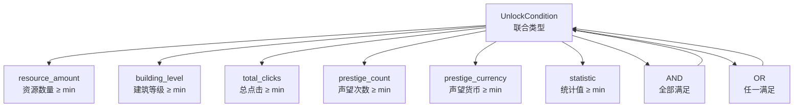
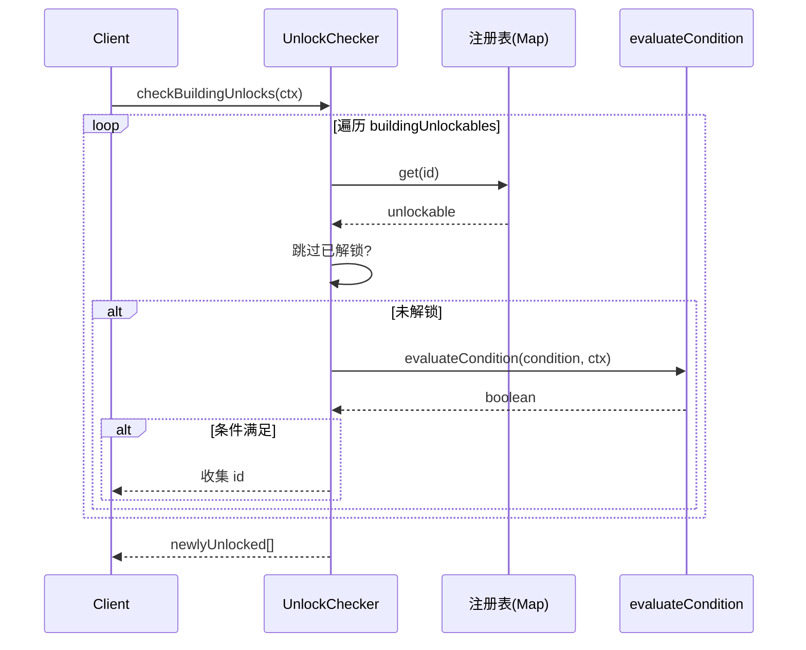

# UnlockChecker 解锁条件检查子系统 — 架构审查报告

> **审查人**: 系统架构师  
> **审查日期**: 2025-07-09  
> **审查范围**: `src/engines/idle/modules/UnlockChecker.ts` + 测试文件  
> **版本基线**: 当前 main 分支

---

## 1. 概览

### 1.1 文件统计

| 指标 | 数值 |
|------|------|
| 源码行数 | ~210 行（含注释） |
| 有效代码行数 | ~100 行 |
| 类数量 | 1 (`UnlockChecker`) |
| 公共方法数 | 5 |
| 私有方法数 | 1 (`evaluateCondition`) |
| 导出类型数 | 4 (`UnlockCondition`, `UnlockResult`, `Unlockable`, `UnlockContext`) |
| 条件类型数 | 8（6 原子 + 2 复合） |
| 测试文件数 | 2（内容完全重复） |
| 测试用例数 | 27 |

### 1.2 依赖关系

```
┌─────────────────────────────────────────────┐
│              UnlockChecker.ts               │
│                                             │
│  ┌─────────┐  ┌──────────┐  ┌───────────┐  │
│  │  Types   │  │  Class   │  │ evaluate  │  │
│  │ (4 个)   │→│  (Map×2) │→│ Condition  │  │
│  └─────────┘  └──────────┘  └───────────┘  │
└──────────────────┬──────────────────────────┘
                   │ export
         ┌─────────┴─────────┐
         │    modules/index  │
         └─────────┬─────────┘
                   │ import
    ┌──────────────┼──────────────┐
    │              │              │
__tests__/①   __tests__/②    (暂无引擎集成)
(相对路径)    (别名路径)
```

**外部依赖**: 零（纯 TypeScript，无第三方库）

**集成现状**: `UnlockChecker` 仅在 `modules/index.ts` 中导出，**尚未被 `IdleGameEngine` 或其他子系统引用**。目前是一个独立模块。

---

## 2. 接口分析

### 2.1 公共 API 清单

| 方法 | 签名 | 职责 |
|------|------|------|
| `registerBuildingUnlocks` | `(unlockables: Unlockable[]) => void` | 注册建筑解锁条件 |
| `registerResourceUnlocks` | `(unlockables: Unlockable[]) => void` | 注册资源解锁条件 |
| `checkBuildingUnlocks` | `(context: UnlockContext) => string[]` | 检查建筑解锁，返回新解锁 ID |
| `checkResourceUnlocks` | `(context: UnlockContext) => string[]` | 检查资源解锁，返回新解锁 ID |
| `checkAll` | `(context: UnlockContext) => { buildings, resources }` | 批量检查所有解锁 |
| `getProgress` | `(targetId, context) => UnlockResult \| null` | 查询单目标解锁进度 |

### 2.2 接口评价

**✅ 优点**

1. **API 表面积小**：仅 5 个公共方法 + 1 个私有核心方法，学习成本低
2. **不可变注册语义**：注册后对 `Unlockable` 做浅拷贝，避免外部引用篡改内部状态
3. **无副作用**：`check*` 方法不修改传入的 `context`，纯函数风格
4. **类型安全**：使用 TypeScript 联合类型（discriminated union）定义 `UnlockCondition`，`switch` 语句中类型收窄自然

**⚠️ 不足**

1. **建筑/资源分离注册缺乏统一抽象**：`registerBuildingUnlocks` 和 `registerResourceUnlocks` 逻辑完全对称，存在代码重复。若未来增加第三类解锁目标（如科技、成就），需要再添加一套方法
2. **缺少注销/清除机制**：无法移除已注册的目标，也没有 `clear()` 方法，不利于热重载或配置热更新场景
3. **`getProgress` 返回 `null` 的语义模糊**：目标未注册时返回 `null`，与"已注册但未解锁"的 `UnlockResult` 需要调用方做双重判空

---

## 3. 核心逻辑分析

### 3.1 条件类型体系



**评价**：条件类型设计清晰，使用递归联合类型实现条件树，支持任意深度嵌套。6 种原子条件覆盖了放置游戏的核心维度。

### 3.2 条件评估逻辑 (`evaluateCondition`)

```
evaluateCondition(condition, ctx) → boolean
│
├─ resource_amount → ctx.resources.get(id)?.amount ?? 0 >= min
├─ building_level  → ctx.buildings.get(id)?.level ?? 0 >= min
├─ total_clicks    → ctx.totalClicks >= min
├─ prestige_count  → ctx.prestige.count >= min
├─ prestige_currency → ctx.prestige.currency >= min
├─ statistic       → ctx.statistics[key] ?? 0 >= min
├─ and             → conditions.every(evaluate) [空→true]
├─ or              → conditions.some(evaluate)  [空→false]
└─ default         → false (安全降级)
```

**评价**：
- 所有原子条件均采用 `>=` 比较，语义一致
- 缺失数据安全降级为 0，不会抛异常
- `default` 分支处理未知类型，防御性编程良好
- AND 空列表返回 `true`（vacuous truth），OR 空列表返回 `false`，逻辑自洽

### 3.3 检查流程



**评价**：流程简洁直接，遍历 + 评估 + 过滤三步完成。但每次调用都全量遍历注册表，无缓存/增量机制。

---

## 4. 问题清单

### 🔴 严重问题

#### 4.1 递归条件树无深度保护，存在栈溢出风险

- **位置**: `evaluateCondition` 方法（第 229-232 行，第 237-240 行）
- **描述**: `and`/`or` 条件递归调用 `evaluateCondition`，无最大深度限制。恶意或错误配置的条件树（如自引用或超深嵌套）可导致调用栈溢出
- **影响**: 运行时崩溃，整个解锁子系统失效
- **修复建议**:
  ```typescript
  private evaluateCondition(
    condition: UnlockCondition,
    ctx: UnlockContext,
    depth: number = 0,
    maxDepth: number = 10
  ): boolean {
    if (depth > maxDepth) {
      console.warn(`UnlockChecker: 条件树深度超过 ${maxDepth}，截断为 false`);
      return false;
    }
    // ... 在递归调用时传入 depth + 1
    case 'and':
      return condition.conditions.every(sub =>
        this.evaluateCondition(sub, ctx, depth + 1, maxDepth)
      );
  }
  ```

#### 4.2 重复测试文件导致维护负担

- **位置**: `src/__tests__/engines/idle/UnlockChecker.test.ts` 与 `src/engines/idle/__tests__/UnlockChecker.test.ts`
- **描述**: 两个测试文件内容完全相同（598 行 × 2），仅 import 路径不同（别名 vs 相对路径）
- **影响**: 修改一处时容易遗漏另一处，测试不一致风险
- **修复建议**: 删除其中一个重复文件，统一使用别名路径的版本（`src/__tests__/` 目录下的）

### 🟡 中等问题

#### 4.3 `UnlockContext` 使用 `Map` 类型，序列化/反序列化困难

- **位置**: `UnlockContext` 接口定义（第 44-50 行）
- **描述**: `resources` 和 `buildings` 字段使用 `Map<string, ...>` 类型，`Map` 无法直接 `JSON.stringify`/`JSON.parse`
- **影响**: 
  - 游戏存档保存/加载需要额外转换逻辑
  - 测试中构造 context 较繁琐
  - 与 Web Worker 通信时无法结构化克隆（`Map` 支持但需注意）
- **修复建议**: 考虑使用 `Record<string, ...>` 替代 `Map`，或在类内部做转换：
  ```typescript
  export interface UnlockContext {
    resources: Record<string, { amount: number; unlocked: boolean }>;
    buildings: Record<string, { level: number; unlocked: boolean }>;
    // ...
  }
  ```

#### 4.4 注册覆盖行为无警告日志

- **位置**: `registerBuildingUnlocks` / `registerResourceUnlocks` 方法（第 82-91 行，第 103-112 行）
- **描述**: 当 `id` 已存在时静默覆盖，无任何日志或警告
- **影响**: 在开发阶段难以发现配置冲突，可能导致意外的解锁行为
- **修复建议**:
  ```typescript
  if (this.buildingUnlockables.has(unlockable.id)) {
    console.warn(`UnlockChecker: 建筑解锁目标 "${unlockable.id}" 被覆盖注册`);
  }
  ```

#### 4.5 `getProgress` 缺少进度百分比信息

- **位置**: `getProgress` 方法（第 196-220 行）及 `UnlockResult` 接口（第 34-38 行）
- **描述**: `UnlockResult` 仅返回 `unlocked: boolean`，对于未解锁目标没有进度百分比信息（如"当前 50/100 金币"）
- **影响**: UI 层无法向玩家展示"距离解锁还差多少"的提示，降低放置游戏体验
- **修复建议**: 扩展 `UnlockResult`：
  ```typescript
  export interface UnlockResult {
    targetId: string;
    unlocked: boolean;
    description: string;
    progress?: number;      // 0.0 ~ 1.0
    progressText?: string;  // "50/100 金币"
  }
  ```

#### 4.6 `checkAll` 内部调用两次全量遍历

- **位置**: `checkAll` 方法（第 185-189 行）
- **描述**: `checkAll` 分别调用 `checkBuildingUnlocks` 和 `checkResourceUnlocks`，各自独立遍历注册表
- **影响**: 对于大量解锁目标，性能为 O(n) × 2 而非 O(n)
- **修复建议**: 当前规模下影响不大（放置游戏解锁目标通常 < 200），若后续扩展可合并为单次遍历

### 🟢 轻微问题

#### 4.7 注册方法参数缺乏空值/类型校验

- **位置**: `registerBuildingUnlocks` / `registerResourceUnlocks`（第 82-112 行）
- **描述**: 未校验 `unlockables` 数组中的 `id` 是否为空字符串、`condition` 是否为合法对象
- **影响**: 非法输入可能导致后续 `getProgress` / `check*` 方法行为异常
- **修复建议**: 添加基础校验并抛出明确错误

#### 4.8 `Unlockable.description` 字段定位不清

- **位置**: `Unlockable` 接口（第 41-45 行）
- **描述**: `description` 字段在注册时设置，但仅用于 `getProgress` 返回。不清楚是面向开发者的调试信息还是面向玩家的 UI 文案
- **修复建议**: 明确文档说明其用途，或拆分为 `debugLabel` + `displayDescription`

#### 4.9 `evaluateCondition` 的 `default` 分支不可达

- **位置**: `evaluateCondition` 方法末尾 `default` 分支（第 244-247 行）
- **描述**: TypeScript 联合类型已穷尽所有 case，`default` 分支在类型系统层面不可达。仅在运行时通过 `as any` 强制绕过类型时才会触发
- **影响**: 正面——防御性编程良好；负面——可能掩盖类型系统应捕获的错误
- **修复建议**: 保留但添加 `console.warn` 提醒开发者

#### 4.10 测试未覆盖边界条件

- **缺失测试场景**:
  - `minAmount` / `minLevel` 等阈值为 0 时的行为
  - `minAmount` / `minLevel` 为负数时的行为
  - 超大数值（`Number.MAX_SAFE_INTEGER`）的精度
  - `context` 中 `prestige` 为 `null` 或 `undefined` 的防御
  - 同一个 `id` 同时注册到建筑表和资源表时的行为
  - 并发注册/检查（虽然 JS 单线程，但异步场景下可能有竞态）

---

## 5. 放置游戏适配性分析

### 5.1 放置游戏解锁场景覆盖度

| 放置游戏常见解锁场景 | 是否覆盖 | 备注 |
|---------------------|---------|------|
| 资源数量达标 | ✅ | `resource_amount` |
| 建筑等级达标 | ✅ | `building_level` |
| 总点击次数 | ✅ | `total_clicks` |
| 声望（转生）次数 | ✅ | `prestige_count` |
| 声望货币 | ✅ | `prestige_currency` |
| 自定义统计 | ✅ | `statistic` |
| 时间条件（在线时长） | ❌ | 需通过 `statistic` 间接实现 |
| 离线收益条件 | ❌ | 需通过 `statistic` 间接实现 |
| 成就条件 | ❌ | 需通过 `statistic` 间接实现 |
| 组合条件 | ✅ | `and` / `or` |
| 条件取反（NOT） | ❌ | 缺少 `not` 条件类型 |
| 数值范围（区间） | ❌ | 仅支持 `>=`，无区间判断 |

### 5.2 放置游戏特有需求适配

1. **增量检查优化**: 放置游戏中解锁检查通常每帧或每秒执行。当前全量遍历在小规模下可接受，但大规模解锁树需要缓存机制
2. **解锁事件通知**: 当前仅返回 ID 列表，缺少事件回调/观察者机制，不利于 UI 层响应式更新
3. **条件可视化**: `getProgress` 缺少进度百分比，无法在 UI 上展示进度条
4. **配置驱动**: 解锁条件硬编码为 TypeScript 对象，缺少从 JSON/配置文件加载的能力

---

## 6. 改进建议

### 6.1 短期修复（1-2 天）

| 优先级 | 建议 | 工作量 |
|--------|------|--------|
| P0 | 添加递归深度保护（问题 4.1） | 0.5h |
| P0 | 删除重复测试文件（问题 4.2） | 0.1h |
| P1 | 添加注册覆盖警告日志（问题 4.4） | 0.5h |
| P1 | 补充边界条件测试（问题 4.10） | 2h |
| P2 | 添加基础参数校验（问题 4.7） | 0.5h |

### 6.2 中期优化（1 周）

| 建议 | 描述 |
|------|------|
| 统一注册表抽象 | 将 `buildingUnlockables` / `resourceUnlockables` 合并为 `Map<string, { category: 'building' \| 'resource'; unlockable: Unlockable }>`，消除代码重复 |
| 扩展 `UnlockResult` | 增加进度百分比和进度文案字段 |
| 添加 `NOT` 条件类型 | `{ type: 'not'; condition: UnlockCondition }` |
| 添加 `clear()` 方法 | 支持重置注册表，便于热重载 |
| 事件回调机制 | 在 `check*` 方法中支持 `onUnlock` 回调 |

### 6.3 长期架构演进

```
┌──────────────────────────────────────────────────────┐
│                 UnlockSystem (facade)                 │
│  ┌─────────────┐  ┌──────────────┐  ┌─────────────┐ │
│  │ ConfigLoader │  │UnlockChecker │  │EventEmitter │ │
│  │ (JSON驱动)   │  │ (核心评估)    │  │ (解锁通知)   │ │
│  └─────────────┘  └──────────────┘  └─────────────┘ │
│  ┌─────────────┐  ┌──────────────┐                   │
│  │ProgressCache │  │ConditionVis  │                   │
│  │ (增量检查)   │  │ (进度可视化)  │                   │
│  └─────────────┘  └──────────────┘                   │
└──────────────────────────────────────────────────────┘
```

1. **配置驱动**: 从 JSON/ScriptableObject 加载解锁条件，策划可配置
2. **增量检查缓存**: 记录上次检查时的 context 快照，仅重新评估变化部分
3. **条件可视化器**: 将条件树渲染为玩家可读的 UI 文案（如"需要：金币 ≥ 1000 且 矿井等级 ≥ 5"）
4. **插件化条件类型**: 支持自定义条件评估器注册，而非硬编码 switch-case

---

## 7. 综合评分

| 维度 | 评分 (1-5) | 说明 |
|------|-----------|------|
| **接口设计** | ⭐⭐⭐⭐ 4/5 | API 简洁清晰，但建筑/资源分离注册存在冗余，缺少注销和清除机制 |
| **数据模型** | ⭐⭐⭐⭐ 4/5 | 联合类型设计优秀，条件树递归结构灵活；`Map` 类型不利于序列化 |
| **核心逻辑** | ⭐⭐⭐⭐ 4/5 | 评估逻辑正确完整，防御性编程良好；缺少递归深度保护和 NOT 条件 |
| **可复用性** | ⭐⭐⭐ 3/5 | 零外部依赖便于移植；但建筑/资源硬编码分类限制了通用性，缺少插件机制 |
| **性能** | ⭐⭐⭐⭐ 4/5 | 小规模下性能充足；全量遍历在大规模场景下需优化；无缓存机制 |
| **测试覆盖** | ⭐⭐⭐⭐ 4/5 | 27 个用例覆盖所有条件类型和公共方法；缺少边界值和异常场景测试 |
| **放置游戏适配** | ⭐⭐⭐⭐ 4/5 | 覆盖核心放置游戏解锁场景；缺少时间条件、进度百分比、事件通知 |

### 总分: 27 / 35 (77%)

### 总评

`UnlockChecker` 是一个**设计良好、实现简洁**的解锁检查模块。代码注释充分，类型安全，零依赖，核心逻辑正确。作为放置游戏的 P0 基础模块，它可靠地完成了"条件注册 → 条件评估 → 结果返回"的核心链路。

**主要风险点**：
1. 递归条件树无深度保护（🔴）
2. 重复测试文件（🔴）
3. 缺少进度百分比和事件通知（🟡）

**总体建议**: 模块质量高于项目平均水平，短期修复递归保护后即可安全集成到 `IdleGameEngine`。中期建议统一注册表抽象并扩展进度查询能力。
